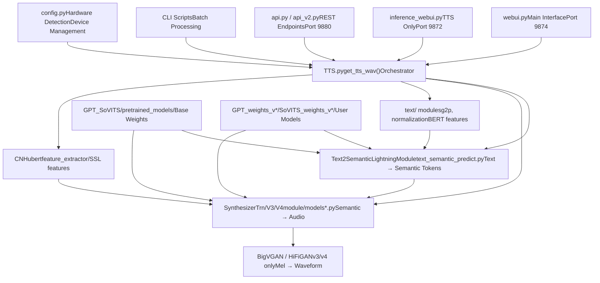
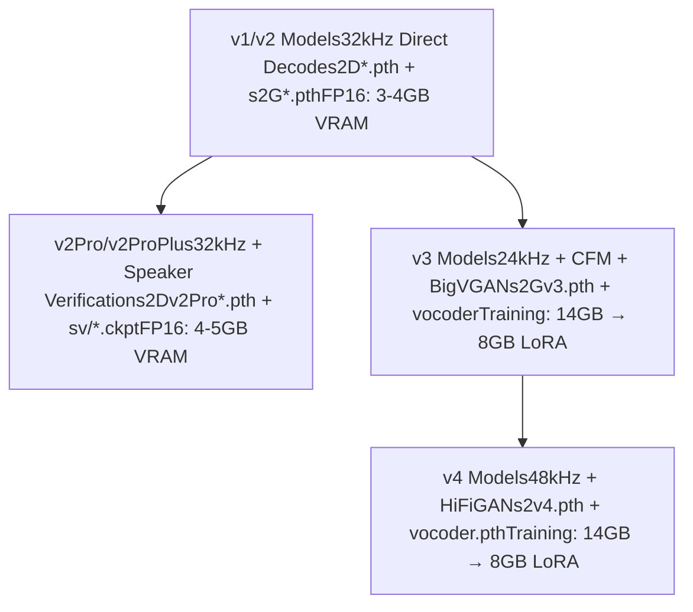
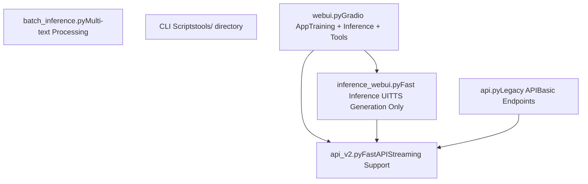
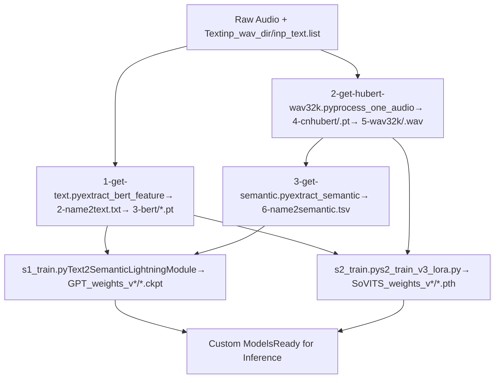
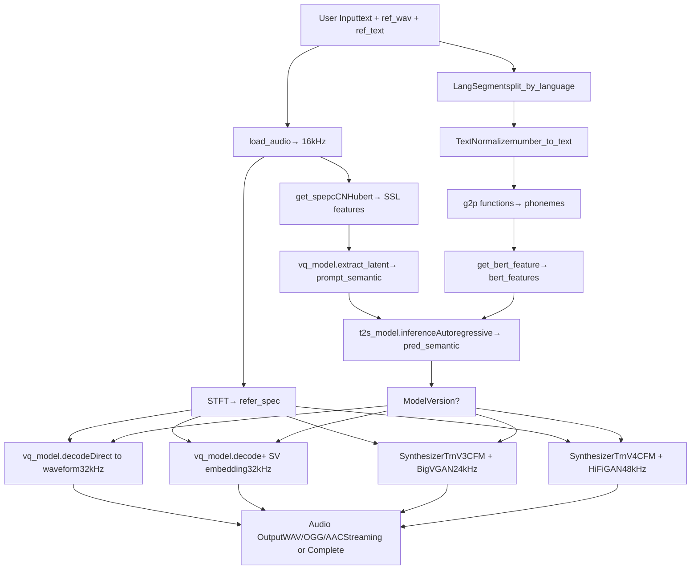
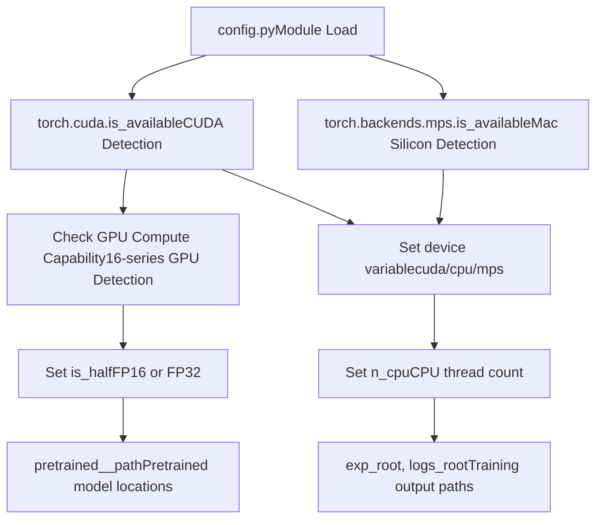
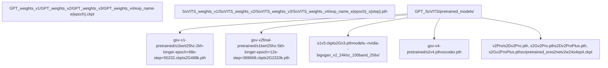
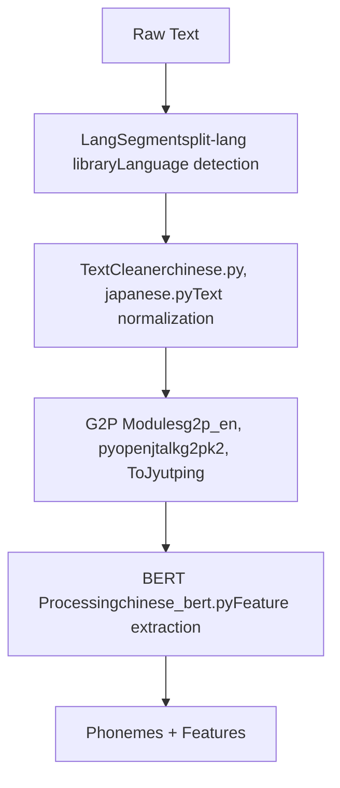

# Overview

Relevant source files

-   [README.md](https://github.com/RVC-Boss/GPT-SoVITS/blob/c767f0b8/README.md?plain=1)
-   [docs/cn/Changelog\_CN.md](https://github.com/RVC-Boss/GPT-SoVITS/blob/c767f0b8/docs/cn/Changelog_CN.md?plain=1)
-   [docs/cn/README.md](https://github.com/RVC-Boss/GPT-SoVITS/blob/c767f0b8/docs/cn/README.md?plain=1)
-   [docs/en/Changelog\_EN.md](https://github.com/RVC-Boss/GPT-SoVITS/blob/c767f0b8/docs/en/Changelog_EN.md?plain=1)
-   [docs/ja/Changelog\_JA.md](https://github.com/RVC-Boss/GPT-SoVITS/blob/c767f0b8/docs/ja/Changelog_JA.md?plain=1)
-   [docs/ja/README.md](https://github.com/RVC-Boss/GPT-SoVITS/blob/c767f0b8/docs/ja/README.md?plain=1)
-   [docs/ko/Changelog\_KO.md](https://github.com/RVC-Boss/GPT-SoVITS/blob/c767f0b8/docs/ko/Changelog_KO.md?plain=1)
-   [docs/ko/README.md](https://github.com/RVC-Boss/GPT-SoVITS/blob/c767f0b8/docs/ko/README.md?plain=1)
-   [docs/tr/Changelog\_TR.md](https://github.com/RVC-Boss/GPT-SoVITS/blob/c767f0b8/docs/tr/Changelog_TR.md?plain=1)
-   [docs/tr/README.md](https://github.com/RVC-Boss/GPT-SoVITS/blob/c767f0b8/docs/tr/README.md?plain=1)
-   [install.ps1](https://github.com/RVC-Boss/GPT-SoVITS/blob/c767f0b8/install.ps1)
-   [install.sh](https://github.com/RVC-Boss/GPT-SoVITS/blob/c767f0b8/install.sh)
-   [requirements.txt](https://github.com/RVC-Boss/GPT-SoVITS/blob/c767f0b8/requirements.txt)

## Purpose and Scope

This page provides a high-level overview of the GPT-SoVITS system architecture, core capabilities, and major components. GPT-SoVITS is a few-shot voice conversion and text-to-speech (TTS) system that can clone voices with as little as 5 seconds of reference audio (zero-shot) or 1 minute of training data (few-shot).

For detailed information about specific subsystems:

-   Installation procedures: see [Installation and Setup](/RVC-Boss/GPT-SoVITS/1.1-installation-and-setup)
-   Model architecture details: see [Core Model Architectures](/RVC-Boss/GPT-SoVITS/2.1-core-model-architectures)
-   Training workflows: see [Training Pipeline](/RVC-Boss/GPT-SoVITS/2.3-training-pipeline)
-   Text processing specifics: see [Text Processing Pipeline](/RVC-Boss/GPT-SoVITS/2.2-text-processing-pipeline)

**Sources:** [README.md1-52](https://github.com/RVC-Boss/GPT-SoVITS/blob/c767f0b8/README.md?plain=1#L1-L52) [docs/cn/README.md1-46](https://github.com/RVC-Boss/GPT-SoVITS/blob/c767f0b8/docs/cn/README.md?plain=1#L1-L46)

## System Architecture

GPT-SoVITS implements a two-stage neural codec TTS system. The architecture separates semantic token generation from acoustic synthesis, enabling fine-grained control and high-quality voice cloning.

The system follows a layered architecture where user interfaces invoke the `TTS.py` orchestrator, which coordinates model inference using pretrained or custom-trained weights.

**Sources:** [README.md30-40](https://github.com/RVC-Boss/GPT-SoVITS/blob/c767f0b8/README.md?plain=1#L30-L40) [webui.py1-50](https://github.com/RVC-Boss/GPT-SoVITS/blob/c767f0b8/webui.py#L1-L50) [GPT\_SoVITS/TTS.py1-100](https://github.com/RVC-Boss/GPT-SoVITS/blob/c767f0b8/GPT_SoVITS/TTS.py#L1-L100) [config.py1-50](https://github.com/RVC-Boss/GPT-SoVITS/blob/c767f0b8/config.py#L1-L50)

## Core Components

### Two-Stage Generation Pipeline

GPT-SoVITS implements a codec-based TTS approach with two primary models:

| Component | Input | Output | Purpose |
| --- | --- | --- | --- |
| **GPT Model** (`Text2SemanticLightningModule`) | Phonemes + BERT features + Reference semantic | Predicted semantic tokens | Converts text to discrete semantic representations |
| **SoVITS Model** (`SynthesizerTrn` variants) | Semantic tokens + Reference spectrogram | Audio waveform (or mel) | Synthesizes audio from semantic tokens |
| **Vocoder** (v3/v4 only) | Mel-spectrogram | Waveform | Neural vocoder for mel-to-audio conversion |

The GPT stage performs autoregressive semantic token prediction, while the SoVITS stage performs acoustic modeling. This separation enables better control and modularity.

**Sources:** [GPT\_SoVITS/AR/models/t2s\_lightning\_module.py1-50](https://github.com/RVC-Boss/GPT-SoVITS/blob/c767f0b8/GPT_SoVITS/AR/models/t2s_lightning_module.py#L1-L50) [GPT\_SoVITS/module/models.py1-100](https://github.com/RVC-Boss/GPT-SoVITS/blob/c767f0b8/GPT_SoVITS/module/models.py#L1-L100) [GPT\_SoVITS/module/models\_v3.py1-100](https://github.com/RVC-Boss/GPT-SoVITS/blob/c767f0b8/GPT_SoVITS/module/models_v3.py#L1-L100)

### Model Version Comparison

**Model Version Characteristics:**

| Version | Sample Rate | Architecture | VRAM (Training) | Key Features |
| --- | --- | --- | --- | --- |
| v1/v2 | 32kHz | Direct VQ decode | 6-8GB | Fast, stable, average quality datasets |
| v2Pro/Plus | 32kHz | VQ + Speaker Verification | 8-10GB | Enhanced timbre similarity, v2 speed |
| v3 | 24kHz | CFM + BigVGAN | 14GB (8GB LoRA) | Higher similarity, fewer repetitions |
| v4 | 48kHz | CFM + HiFiGAN | 14GB (8GB LoRA) | No metallic artifacts, native 48kHz |

**Key Architectural Differences:**

-   **v1/v2**: Use `SynthesizerTrn` class with direct VQ decoding to waveform
-   **v2Pro/Plus**: Add speaker verification embeddings (`eres2netv2w24s4ep4.ckpt`) for enhanced similarity
-   **v3**: Introduce `SynthesizerTrnV3` with CFM (Conditional Flow Matching) and BigVGAN vocoder
-   **v4**: Use `SynthesizerTrnV4` with improved HiFiGAN vocoder for 48kHz native output

**Sources:** [README.md293-367](https://github.com/RVC-Boss/GPT-SoVITS/blob/c767f0b8/README.md?plain=1#L293-L367) [docs/cn/README.md281-356](https://github.com/RVC-Boss/GPT-SoVITS/blob/c767f0b8/docs/cn/README.md?plain=1#L281-L356) [GPT\_SoVITS/module/models.py1-50](https://github.com/RVC-Boss/GPT-SoVITS/blob/c767f0b8/GPT_SoVITS/module/models.py#L1-L50) [GPT\_SoVITS/module/models\_v3.py1-50](https://github.com/RVC-Boss/GPT-SoVITS/blob/c767f0b8/GPT_SoVITS/module/models_v3.py#L1-L50)

## User Interfaces

GPT-SoVITS provides multiple entry points for different use cases:

**Interface Comparison:**

| Interface | File | Port | Purpose | Key Features |
| --- | --- | --- | --- | --- |
| Main WebUI | `webui.py` | 9874 | Complete workflow | UVR5, ASR, training, inference |
| Inference WebUI | `inference_webui.py` | 9872 | TTS only | Model loading, parameter tuning |
| Fast Inference | `inference_webui_fast.py` | 9872 | Optimized TTS | Parallel processing support |
| REST API v1 | `api.py` | 9880 | Basic HTTP | Simple text-to-speech |
| REST API v2 | `api_v2.py` | 9880 | FastAPI | Streaming, async, JSON schema |
| Batch CLI | `batch_inference.py` | \- | Bulk processing | Multiple texts, automated |

**Sources:** [webui.py1-100](https://github.com/RVC-Boss/GPT-SoVITS/blob/c767f0b8/webui.py#L1-L100) [GPT\_SoVITS/inference\_webui.py1-50](https://github.com/RVC-Boss/GPT-SoVITS/blob/c767f0b8/GPT_SoVITS/inference_webui.py#L1-L50) [api.py1-50](https://github.com/RVC-Boss/GPT-SoVITS/blob/c767f0b8/api.py#L1-L50) [api\_v2.py1-100](https://github.com/RVC-Boss/GPT-SoVITS/blob/c767f0b8/api_v2.py#L1-L100)

## Data Processing Pipeline

### Training Data Preparation

GPT-SoVITS requires three types of features extracted from training audio:

**Feature Files Structure:**

| File/Directory | Content | Dimensions | Source |
| --- | --- | --- | --- |
| `2-name2text.txt` | Phoneme sequences, word2ph | Text | BERT model |
| `3-bert/*.pt` | Contextual embeddings | \[seq\_len, 1024\] | chinese-roberta-wwm-ext |
| `4-cnhubert/*.pt` | SSL features | \[frames, 768\] | CNHubert model |
| `5-wav32k/*.wav` | Resampled audio | 32kHz | Audio resampling |
| `5.1-sv/*.pt` | Speaker embeddings | \[20480\] | eres2netv2 (v2Pro only) |
| `6-name2semantic.tsv` | Semantic token IDs | Discrete codes | Pretrained SoVITS-G |

**Sources:** [GPT\_SoVITS/prepare\_datasets/1-get-text.py1-50](https://github.com/RVC-Boss/GPT-SoVITS/blob/c767f0b8/GPT_SoVITS/prepare_datasets/1-get-text.py#L1-L50) [GPT\_SoVITS/prepare\_datasets/2-get-hubert-wav32k.py1-50](https://github.com/RVC-Boss/GPT-SoVITS/blob/c767f0b8/GPT_SoVITS/prepare_datasets/2-get-hubert-wav32k.py#L1-L50) [GPT\_SoVITS/prepare\_datasets/3-get-semantic.py1-50](https://github.com/RVC-Boss/GPT-SoVITS/blob/c767f0b8/GPT_SoVITS/prepare_datasets/3-get-semantic.py#L1-L50)

### Inference Workflow

**Key Functions in Inference Flow:**

-   **`TTS.get_tts_wav()`**: Main orchestrator function in [GPT\_SoVITS/TTS.py200-500](https://github.com/RVC-Boss/GPT-SoVITS/blob/c767f0b8/GPT_SoVITS/TTS.py#L200-L500)
-   **`load_audio()`**: Audio loading and resampling in [GPT\_SoVITS/TTS.py50-100](https://github.com/RVC-Boss/GPT-SoVITS/blob/c767f0b8/GPT_SoVITS/TTS.py#L50-L100)
-   **`get_spepc()`**: CNHubert SSL feature extraction in [GPT\_SoVITS/TTS.py100-150](https://github.com/RVC-Boss/GPT-SoVITS/blob/c767f0b8/GPT_SoVITS/TTS.py#L100-L150)
-   **`t2s_model.inference()`**: GPT semantic token generation in [GPT\_SoVITS/AR/models/t2s\_lightning\_module.py150-300](https://github.com/RVC-Boss/GPT-SoVITS/blob/c767f0b8/GPT_SoVITS/AR/models/t2s_lightning_module.py#L150-L300)
-   **`vq_model.decode()`**: VQ-VAE decoding for v1/v2 in [GPT\_SoVITS/module/models.py300-400](https://github.com/RVC-Boss/GPT-SoVITS/blob/c767f0b8/GPT_SoVITS/module/models.py#L300-L400)

**Sources:** [GPT\_SoVITS/TTS.py1-700](https://github.com/RVC-Boss/GPT-SoVITS/blob/c767f0b8/GPT_SoVITS/TTS.py#L1-L700) [GPT\_SoVITS/AR/models/t2s\_lightning\_module.py1-400](https://github.com/RVC-Boss/GPT-SoVITS/blob/c767f0b8/GPT_SoVITS/AR/models/t2s_lightning_module.py#L1-L400)

## Hardware and Deployment

### Configuration Management

The `config.py` module handles hardware detection and device assignment:

**Device Selection Logic:**

| Condition | Device | Precision | Notes |
| --- | --- | --- | --- |
| CUDA available + supported GPU | `cuda` | `fp16` | RTX 30/40 series, A100, etc. |
| CUDA available + 16-series GPU | `cuda` | `fp32` | GTX 1650/1660 lack tensor cores |
| MPS available (Mac) | `cpu` | `fp32` | CPU faster than MPS for inference |
| CPU only | `cpu` | `fp32` | Slower but functional |

**Sources:** [config.py1-100](https://github.com/RVC-Boss/GPT-SoVITS/blob/c767f0b8/config.py#L1-L100) [GPT\_SoVITS/TTS.py1-50](https://github.com/RVC-Boss/GPT-SoVITS/blob/c767f0b8/GPT_SoVITS/TTS.py#L1-L50)

### Model File Organization

**Model Loading Priority:**

1.  User-specified custom model paths (via UI or API)
2.  Latest checkpoint in version-specific weight directories
3.  Pretrained base models in `GPT_SoVITS/pretrained_models/`

**Version Detection:** Model version is automatically detected from checkpoint metadata or file characteristics via [GPT\_SoVITS/inference\_webui.py100-200](https://github.com/RVC-Boss/GPT-SoVITS/blob/c767f0b8/GPT_SoVITS/inference_webui.py#L100-L200) using checksums and header inspection.

**Sources:** [config.py20-80](https://github.com/RVC-Boss/GPT-SoVITS/blob/c767f0b8/config.py#L20-L80) [GPT\_SoVITS/inference\_webui.py50-150](https://github.com/RVC-Boss/GPT-SoVITS/blob/c767f0b8/GPT_SoVITS/inference_webui.py#L50-L150) [tools/i18n/utils.py1-50](https://github.com/RVC-Boss/GPT-SoVITS/blob/c767f0b8/tools/i18n/utils.py#L1-L50)

## Supporting Systems

### Audio Processing Tools

GPT-SoVITS integrates several audio preprocessing tools accessible via the main WebUI:

| Tool | File | Function | Purpose |
| --- | --- | --- | --- |
| UVR5 | `tools/uvr5/webui.py` | Vocal separation | Remove BGM, reverb, echo |
| Audio Slicer | `tools/slice_audio.py` | Silence-based segmentation | Split long audio into training chunks |
| Denoiser | `tools/cmd-denoise.py` | Noise reduction | 16kHz denoising for noisy datasets |
| ASR Tools | `tools/asr/` | Speech recognition | Auto-generate transcriptions |

**Sources:** [tools/uvr5/webui.py1-50](https://github.com/RVC-Boss/GPT-SoVITS/blob/c767f0b8/tools/uvr5/webui.py#L1-L50) [tools/slice\_audio.py1-100](https://github.com/RVC-Boss/GPT-SoVITS/blob/c767f0b8/tools/slice_audio.py#L1-L100)

### Text Processing Modules

Multi-language text processing is handled by dedicated modules:

**Supported Languages:**

| Language | G2P Module | BERT Model | Text Normalizer |
| --- | --- | --- | --- |
| Chinese (zh) | `pypinyin`, `g2pW` | `chinese-roberta-wwm-ext` | `GPT_SoVITS/text/chinese.py` |
| English (en) | `g2p_en` | None | Basic rules |
| Japanese (ja) | `pyopenjtalk` | None | `GPT_SoVITS/text/japanese.py` |
| Korean (ko) | `g2pk2` | None | Basic rules |
| Cantonese (yue) | `ToJyutping` | Same as Chinese | Chinese normalizer |

**Sources:** [GPT\_SoVITS/text/cleaner.py1-100](https://github.com/RVC-Boss/GPT-SoVITS/blob/c767f0b8/GPT_SoVITS/text/cleaner.py#L1-L100) [GPT\_SoVITS/text/chinese.py1-50](https://github.com/RVC-Boss/GPT-SoVITS/blob/c767f0b8/GPT_SoVITS/text/chinese.py#L1-L50)

## Key Design Patterns

### Separation of Concerns

GPT-SoVITS maintains clear boundaries between subsystems:

1.  **Model Architecture** (`GPT_SoVITS/module/`, `GPT_SoVITS/AR/`): Neural network definitions
2.  **Training Logic** (`GPT_SoVITS/s1_train.py`, `s2_train*.py`): PyTorch Lightning trainers
3.  **Inference Orchestration** (`GPT_SoVITS/TTS.py`): End-to-end generation pipeline
4.  **User Interfaces** (`webui.py`, `api_v2.py`): Request handling and response formatting
5.  **Data Processing** (`GPT_SoVITS/prepare_datasets/`, `tools/`): Feature extraction utilities

### Configuration-Driven Behavior

Model behavior is controlled through configuration files and environment detection:

-   **Training Configs**: `GPT_SoVITS/configs/s1longer.yaml`, `s2*.json`
-   **Runtime Config**: `config.py` auto-detects hardware and sets defaults
-   **Version Switching**: WebUI allows dynamic version selection without code changes

### Extensibility Points

The system is designed for extension:

-   **New Languages**: Add G2P module in `GPT_SoVITS/text/` and update language mappings
-   **New Vocoders**: Implement vocoder interface in `GPT_SoVITS/module/`
-   **Custom Frontends**: Override text processing in `TTS.py` pipeline
-   **API Extensions**: Add FastAPI routes in `api_v2.py`

**Sources:** [GPT\_SoVITS/TTS.py1-50](https://github.com/RVC-Boss/GPT-SoVITS/blob/c767f0b8/GPT_SoVITS/TTS.py#L1-L50) [GPT\_SoVITS/configs/s1longer.yaml1-30](https://github.com/RVC-Boss/GPT-SoVITS/blob/c767f0b8/GPT_SoVITS/configs/s1longer.yaml#L1-L30) [GPT\_SoVITS/configs/s2.json1-20](https://github.com/RVC-Boss/GPT-SoVITS/blob/c767f0b8/GPT_SoVITS/configs/s2.json#L1-L20)

---

This overview provides the foundation for understanding GPT-SoVITS. For deeper dives into specific subsystems, refer to the linked pages in the table of contents.
