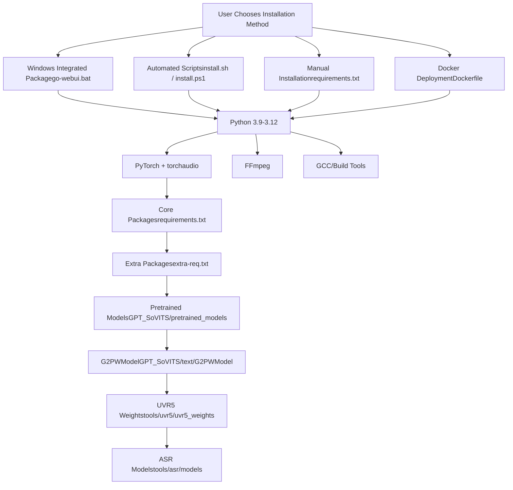
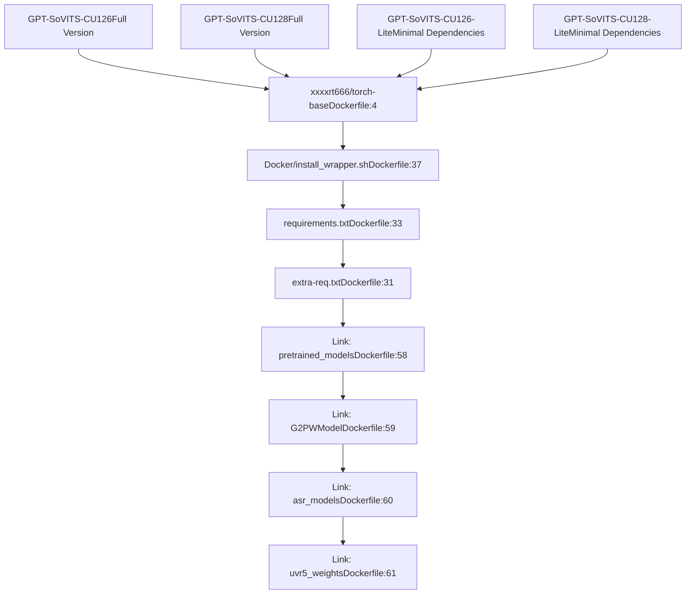

# Installation

Relevant source files

-   [README.md](https://github.com/RVC-Boss/GPT-SoVITS/blob/c767f0b8/README.md?plain=1)
-   [docs/cn/README.md](https://github.com/RVC-Boss/GPT-SoVITS/blob/c767f0b8/docs/cn/README.md?plain=1)
-   [docs/ja/README.md](https://github.com/RVC-Boss/GPT-SoVITS/blob/c767f0b8/docs/ja/README.md?plain=1)
-   [docs/ko/README.md](https://github.com/RVC-Boss/GPT-SoVITS/blob/c767f0b8/docs/ko/README.md?plain=1)
-   [docs/tr/README.md](https://github.com/RVC-Boss/GPT-SoVITS/blob/c767f0b8/docs/tr/README.md?plain=1)
-   [install.ps1](https://github.com/RVC-Boss/GPT-SoVITS/blob/c767f0b8/install.ps1)
-   [install.sh](https://github.com/RVC-Boss/GPT-SoVITS/blob/c767f0b8/install.sh)
-   [requirements.txt](https://github.com/RVC-Boss/GPT-SoVITS/blob/c767f0b8/requirements.txt)

This document provides comprehensive installation instructions for GPT-SoVITS, covering dependency management, platform-specific setup procedures, and deployment options. For information about post-installation configuration and model setup, see [Configuration Management](/RVC-Boss/GPT-SoVITS/3.4-configuration-management). For quick setup workflows, see [Quick Start Guide](/RVC-Boss/GPT-SoVITS/1.3-quick-start-guide).

## Overview

GPT-SoVITS supports multiple installation methods across Windows, Linux, macOS, and containerized environments. The installation process involves setting up Python dependencies, installing system tools like FFmpeg, downloading pretrained models, and configuring language-specific components.

## Supported Environments

The following configurations have been tested and verified:

| Python Version | PyTorch Version | Device Support | Platform |
| --- | --- | --- | --- |
| Python 3.10 | PyTorch 2.5.1 | CUDA 12.4 | Windows/Linux |
| Python 3.11 | PyTorch 2.5.1 | CUDA 12.4 | Windows/Linux |
| Python 3.11 | PyTorch 2.7.0 | CUDA 12.8 | Windows/Linux |
| Python 3.9 | PyTorch 2.8.0dev | CUDA 12.8 | Windows/Linux |
| Python 3.9 | PyTorch 2.5.1 | Apple Silicon | macOS |
| Python 3.11 | PyTorch 2.7.0 | Apple Silicon | macOS |
| Python 3.9 | PyTorch 2.2.2 | CPU Only | All Platforms |

Sources: [docs/ko/README.md49-59](https://github.com/RVC-Boss/GPT-SoVITS/blob/c767f0b8/docs/ko/README.md?plain=1#L49-L59) [docs/tr/README.md49-59](https://github.com/RVC-Boss/GPT-SoVITS/blob/c767f0b8/docs/tr/README.md?plain=1#L49-L59)

## Installation Methods Overview


Sources: [docs/ko/README.md61-198](https://github.com/RVC-Boss/GPT-SoVITS/blob/c767f0b8/docs/ko/README.md?plain=1#L61-L198) [install.sh1-381](https://github.com/RVC-Boss/GPT-SoVITS/blob/c767f0b8/install.sh#L1-L381) [install.ps11-242](https://github.com/RVC-Boss/GPT-SoVITS/blob/c767f0b8/install.ps1#L1-L242) [Dockerfile1-62](https://github.com/RVC-Boss/GPT-SoVITS/blob/c767f0b8/Dockerfile#L1-L62)

## Windows Installation

### Integrated Package (Recommended)

The simplest installation method for Windows users is the pre-built integrated package:

1.  Download the integrated package from [HuggingFace](https://huggingface.co/lj1995/GPT-SoVITS-windows-package/resolve/main/GPT-SoVITS-v3lora-20250228.7z)
2.  Extract the archive
3.  Double-click `go-webui.bat` to launch GPT-SoVITS-WebUI

Sources: [docs/ko/README.md62-63](https://github.com/RVC-Boss/GPT-SoVITS/blob/c767f0b8/docs/ko/README.md?plain=1#L62-L63)

### Automated PowerShell Installation

For custom installations, use the PowerShell script:

```
conda create -n GPTSoVits python=3.10conda activate GPTSoVitspwsh -F install.ps1 --Device <CU126|CU128|CPU> --Source <HF|HF-Mirror|ModelScope> [--DownloadUVR5]
```
The PowerShell script supports:

-   **Device Options**: `CU126` (CUDA 12.6), `CU128` (CUDA 12.8), `CPU`
-   **Source Options**: `HF` (HuggingFace), `HF-Mirror`, `ModelScope`
-   **Optional**: `--DownloadUVR5` for audio separation models

Sources: [docs/ko/README.md64-68](https://github.com/RVC-Boss/GPT-SoVITS/blob/c767f0b8/docs/ko/README.md?plain=1#L64-L68) [install.ps11-242](https://github.com/RVC-Boss/GPT-SoVITS/blob/c767f0b8/install.ps1#L1-L242)

## Linux Installation

### Automated Installation Script

```
conda create -n GPTSoVits python=3.10conda activate GPTSoVitsbash install.sh --device <CU126|CU128|ROCM|CPU> --source <HF|HF-Mirror|ModelScope> [--download-uvr5]
```
The installation script handles:

-   **Build Tools**: GCC 11+, build essentials via [install.sh184-199](https://github.com/RVC-Boss/GPT-SoVITS/blob/c767f0b8/install.sh#L184-L199)
-   **System Libraries**: FFmpeg, CMake via [install.sh224-226](https://github.com/RVC-Boss/GPT-SoVITS/blob/c767f0b8/install.sh#L224-L226)
-   **PyTorch Installation**: Device-specific PyTorch builds via [install.sh324-342](https://github.com/RVC-Boss/GPT-SoVITS/blob/c767f0b8/install.sh#L324-L342)
-   **Model Downloads**: Pretrained models and dependencies via [install.sh255-294](https://github.com/RVC-Boss/GPT-SoVITS/blob/c767f0b8/install.sh#L255-L294)

### Linux Installation Flow

```mermaid
flowchart TD
    Start["bash install.sh --device --source"]
    CheckConda["Check Conda Installationinstall.sh:59-62"]
    ParseArgs["Parse Command Argumentsinstall.sh:94-158"]
    DetectArch["Detect System Architectureinstall.sh:174-182"]
    CheckGCC["Check GCC Versioninstall.sh:187-189"]
    InstallGCC["Install GCC 11+ from Condainstall.sh:190-192"]
    InstallSysroot["Install sysroot Packageinstall.sh:191"]
    InstallFFmpeg["Install FFmpeg & CMakeinstall.sh:224-226"]
    InstallUnzip["Install unzip Utilityinstall.sh:228-230"]
    DetectGPU["Detect GPU Supportinstall.sh:296-322"]
    InstallPyTorch["Install PyTorch for Platforminstall.sh:324-342"]
    InstallExtra["Install extra-req.txtinstall.sh:348"]
    InstallReqs["Install requirements.txtinstall.sh:350"]
    DownloadPretrained["Download Pretrained Modelsinstall.sh:255-266"]
    DownloadG2PW["Download G2PWModelinstall.sh:268-279"]
    DownloadUVR5["Download UVR5 Modelsinstall.sh:281-294"]
    DownloadNLTK["Download NLTK Datainstall.sh:357-362"]
    DownloadOpenJTalk["Download OpenJTalk Dictinstall.sh:364-369"]

    Start --> CheckConda
    CheckConda --> ParseArgs
    ParseArgs --> DetectArch
    DetectArch --> CheckGCC
    CheckGCC --> InstallGCC
    InstallGCC --> InstallSysroot
    InstallSysroot --> InstallFFmpeg
    InstallFFmpeg --> InstallUnzip
    InstallUnzip --> DetectGPU
    DetectGPU --> InstallPyTorch
    InstallPyTorch --> InstallExtra
    InstallExtra --> InstallReqs
    InstallReqs --> DownloadPretrained
    DownloadPretrained --> DownloadG2PW
    DownloadG2PW --> DownloadUVR5
    DownloadUVR5 --> DownloadNLTK
    DownloadNLTK --> DownloadOpenJTalk
```


Sources: [install.sh1-381](https://github.com/RVC-Boss/GPT-SoVITS/blob/c767f0b8/install.sh#L1-L381)

## macOS Installation

**Note**: GPU training on macOS produces lower quality models compared to other platforms. CPU training is currently used as a temporary workaround.

```
conda create -n GPTSoVits python=3.10conda activate GPTSoVitsbash install.sh --device <MPS|CPU> --source <HF|HF-Mirror|ModelScope> [--download-uvr5]
```
The macOS installation includes Xcode Command Line Tools detection and installation via [install.sh201-222](https://github.com/RVC-Boss/GPT-SoVITS/blob/c767f0b8/install.sh#L201-L222)

Sources: [docs/ko/README.md79-89](https://github.com/RVC-Boss/GPT-SoVITS/blob/c767f0b8/docs/ko/README.md?plain=1#L79-L89) [install.sh201-222](https://github.com/RVC-Boss/GPT-SoVITS/blob/c767f0b8/install.sh#L201-L222)

## Manual Installation

For users requiring custom dependency management or troubleshooting:

### Dependencies Installation

```
conda create -n GPTSoVits python=3.10conda activate GPTSoVits pip install -r extra-req.txt --no-depspip install -r requirements.txt
```
### Core Dependencies Analysis

The main dependencies from `requirements.txt` include:

| Category | Packages | Purpose |
| --- | --- | --- |
| **Deep Learning** | `torch`, `torchaudio`, `pytorch-lightning>=2.4` | Neural network framework |
| **Audio Processing** | `librosa==0.10.2`, `ffmpeg-python`, `av>=11` | Audio manipulation |
| **NLP/Text** | `transformers>=4.43,<=4.50`, `sentencepiece`, `tokenizers` | Text processing |
| **ASR** | `funasr==1.0.27`, `faster-whisper` via `ctranslate2>=4.0,<5` | Speech recognition |
| **Language-Specific** | `pypinyin`, `pyopenjtalk>=0.4.1`, `g2p_en`, `jieba_fast` | Multi-language support |
| **Web Interface** | `gradio<5`, `fastapi[standard]>=0.115.2` | User interfaces |
| **Utilities** | `numpy<2.0`, `scipy`, `tqdm`, `psutil` | General utilities |

Sources: [requirements.txt1-46](https://github.com/RVC-Boss/GPT-SoVITS/blob/c767f0b8/requirements.txt#L1-L46)

### FFmpeg Installation

#### Conda Users

```
conda activate GPTSoVitsconda install ffmpeg
```
#### Ubuntu/Debian

```
sudo apt install ffmpegsudo apt install libsox-dev
```
#### Windows Manual

Download and place in GPT-SoVITS root directory:

-   [ffmpeg.exe](https://huggingface.co/lj1995/VoiceConversionWebUI/blob/main/ffmpeg.exe)
-   [ffprobe.exe](https://huggingface.co/lj1995/VoiceConversionWebUI/blob/main/ffprobe.exe)

Install [Visual Studio 2017 Redistributable](https://aka.ms/vs/17/release/vc_redist.x86.exe)

#### macOS

```
brew install ffmpeg
```
Sources: [docs/ko/README.md102-129](https://github.com/RVC-Boss/GPT-SoVITS/blob/c767f0b8/docs/ko/README.md?plain=1#L102-L129)

## Docker Deployment

### Docker Image Selection

GPT-SoVITS provides multiple Docker image variants:


### Docker Compose Usage

```
docker compose run --service-ports <GPT-SoVITS-CU126-Lite|GPT-SoVITS-CU128-Lite|GPT-SoVITS-CU126|GPT-SoVITS-CU128>
```
### Environment Variables

-   `is_half`: Controls half-precision (fp16) usage
-   `CUDA_VERSION`: CUDA version selection via [Dockerfile10-12](https://github.com/RVC-Boss/GPT-SoVITS/blob/c767f0b8/Dockerfile#L10-L12)
-   `LITE`: Enables lite mode via [Dockerfile20-21](https://github.com/RVC-Boss/GPT-SoVITS/blob/c767f0b8/Dockerfile#L20-L21)

### Building Custom Images

```
bash docker_build.sh --cuda <12.6|12.8> [--lite]
```
Sources: [docs/ko/README.md130-179](https://github.com/RVC-Boss/GPT-SoVITS/blob/c767f0b8/docs/ko/README.md?plain=1#L130-L179) [Dockerfile1-62](https://github.com/RVC-Boss/GPT-SoVITS/blob/c767f0b8/Dockerfile#L1-L62)

## Model Downloads

### Required Models

The installation process downloads several model components:

1.  **Pretrained Models** → `GPT_SoVITS/pretrained_models/`

    -   Core neural network weights
    -   Version-specific model files (V2, V3, V4, V2Pro)
2.  **G2PWModel** → `GPT_SoVITS/text/G2PWModel/`

    -   Chinese grapheme-to-phoneme conversion
    -   Required for Chinese TTS via [GPT\_SoVITS/text/g2pw/onnx\_api.py58-80](https://github.com/RVC-Boss/GPT-SoVITS/blob/c767f0b8/GPT_SoVITS/text/g2pw/onnx_api.py#L58-L80)
3.  **UVR5 Weights** → `tools/uvr5/uvr5_weights/`

    -   Vocal/instrumental separation models
    -   Optional, downloaded with `--download-uvr5` flag
4.  **ASR Models** → `tools/asr/models/`

    -   Automatic Speech Recognition models
    -   Downloaded on-demand during first use

### Model Source Options

| Source | Base URL | Use Case |
| --- | --- | --- |
| `HF` | `https://huggingface.co/XXXXRT/GPT-SoVITS-Pretrained/` | Default, global access |
| `HF-Mirror` | `https://hf-mirror.com/XXXXRT/GPT-SoVITS-Pretrained/` | China mirror |
| `ModelScope` | `https://www.modelscope.cn/models/XXXXRT/GPT-SoVITS-Pretrained/` | China alternative |

Sources: [install.sh232-253](https://github.com/RVC-Boss/GPT-SoVITS/blob/c767f0b8/install.sh#L232-L253) [install.ps1149-174](https://github.com/RVC-Boss/GPT-SoVITS/blob/c767f0b8/install.ps1#L149-L174)

## Post-Installation Verification

After installation, verify the setup by launching the web interface:

### Integrated Package Users

```
# Double-click go-webui.bat (Windows)# orgo-webui.ps1
```
### Manual Installation Users

```
python webui.py
```
### Version Switching

```
# Switch to V1python webui.py v1 # Or use version-specific launchersgo-webui-v1.bat  # Windows V1go-webui-v2.bat  # Windows V2
```
Sources: [docs/ko/README.md221-241](https://github.com/RVC-Boss/GPT-SoVITS/blob/c767f0b8/docs/ko/README.md?plain=1#L221-L241)

## Troubleshooting

### Common Issues

1.  **CUDA Not Detected**: The installation scripts automatically fall back to CPU if GPU drivers are not found via [install.sh296-305](https://github.com/RVC-Boss/GPT-SoVITS/blob/c767f0b8/install.sh#L296-L305)

2.  **ROCm on WSL2**: Special handling for WSL2 ROCm compatibility via [install.sh371-378](https://github.com/RVC-Boss/GPT-SoVITS/blob/c767f0b8/install.sh#L371-L378)

3.  **Model Download Failures**: Multiple source options available for regions with restricted access

4.  **Build Tool Issues**: Automatic GCC installation on Linux systems lacking modern compilers via [install.sh184-199](https://github.com/RVC-Boss/GPT-SoVITS/blob/c767f0b8/install.sh#L184-L199)


Sources: [install.sh296-305](https://github.com/RVC-Boss/GPT-SoVITS/blob/c767f0b8/install.sh#L296-L305) [install.sh371-378](https://github.com/RVC-Boss/GPT-SoVITS/blob/c767f0b8/install.sh#L371-L378) [install.sh184-199](https://github.com/RVC-Boss/GPT-SoVITS/blob/c767f0b8/install.sh#L184-L199)
