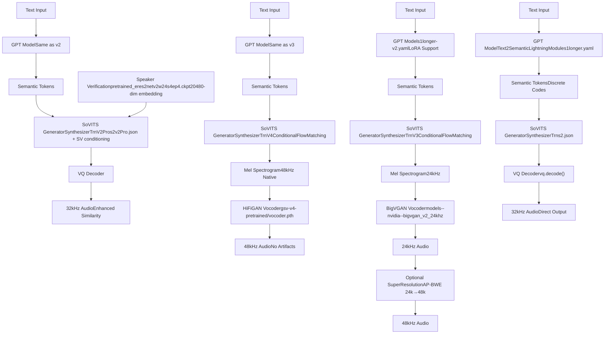
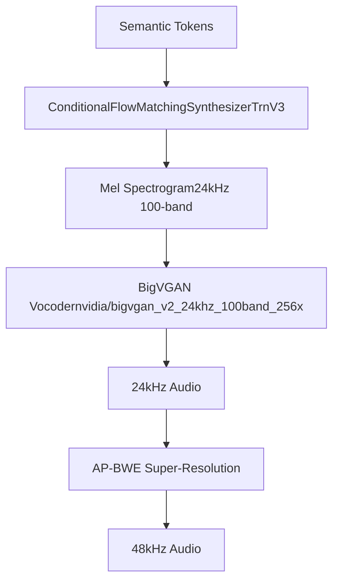
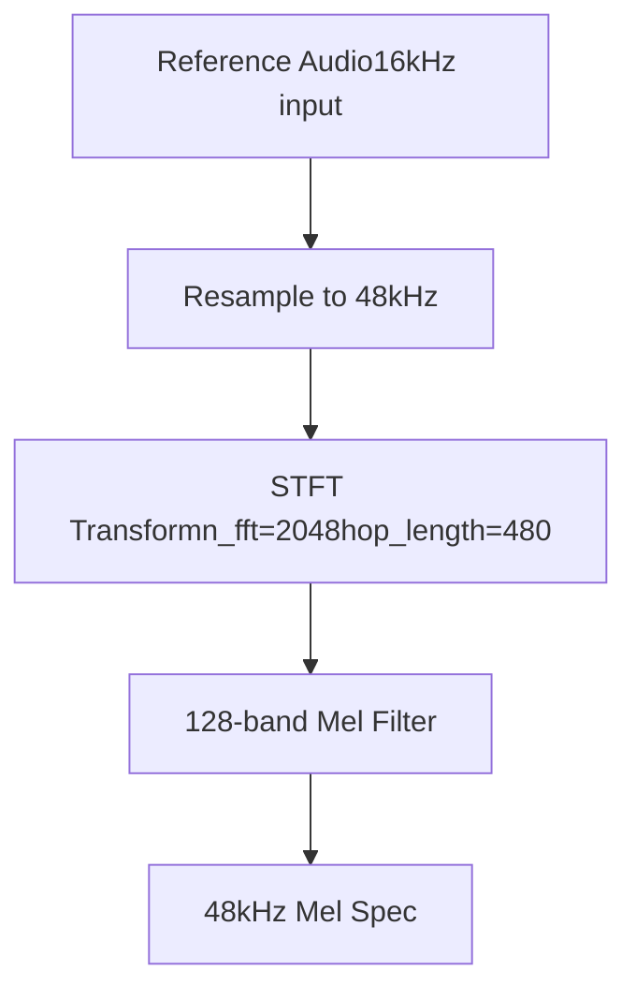
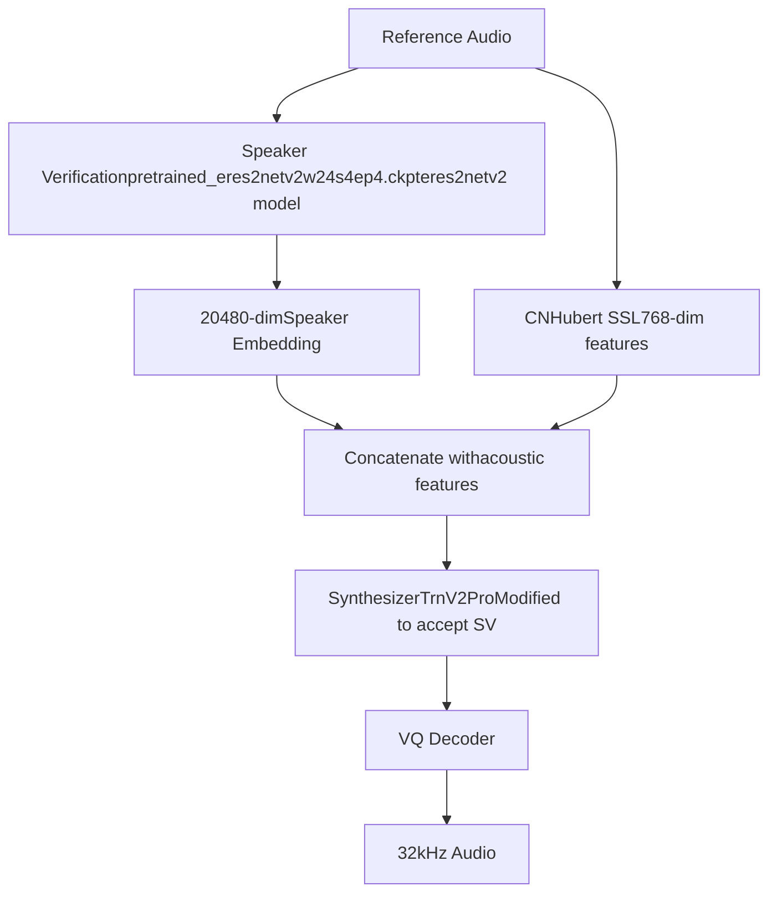
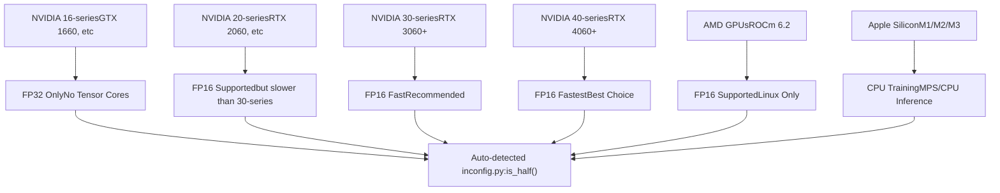
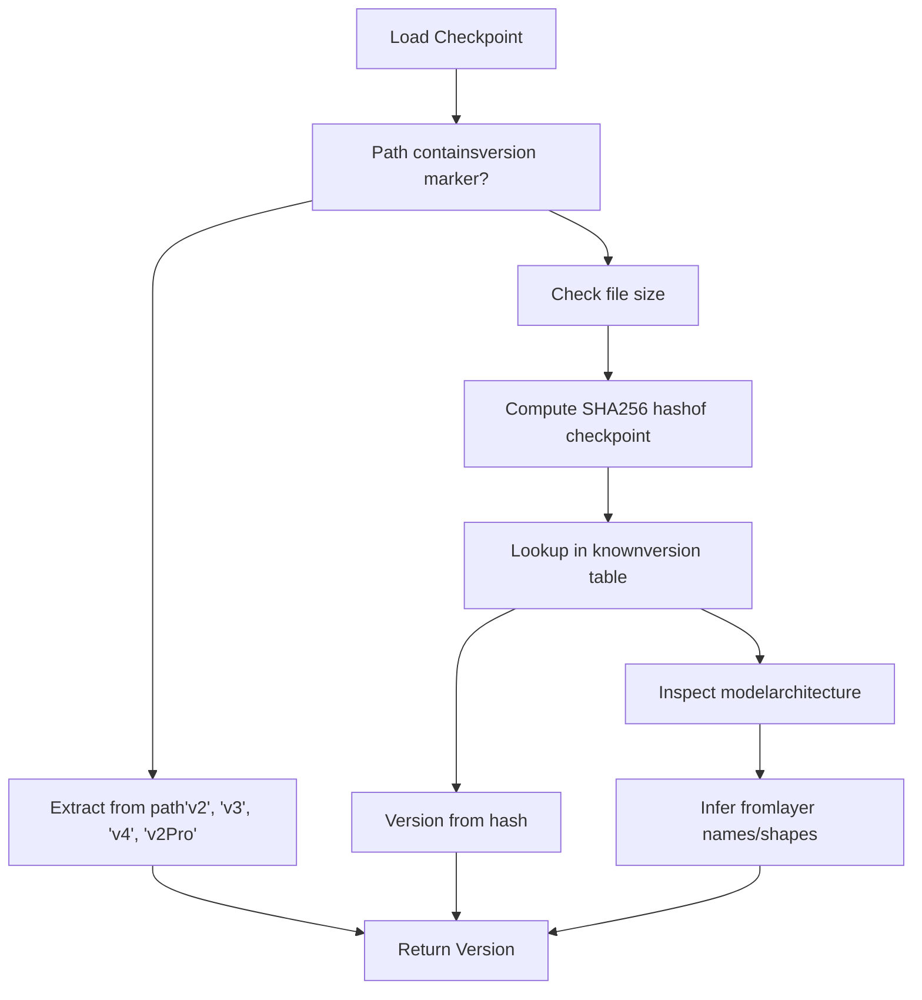
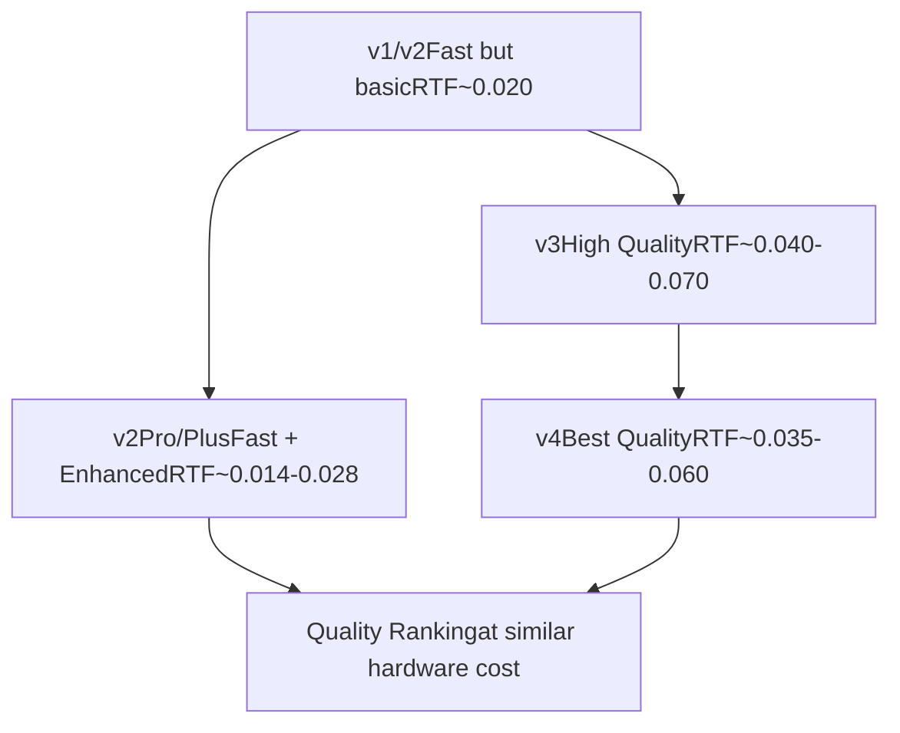

# Model Versions and Evolution

Relevant source files

-   [README.md](https://github.com/RVC-Boss/GPT-SoVITS/blob/c767f0b8/README.md?plain=1)
-   [docs/cn/Changelog\_CN.md](https://github.com/RVC-Boss/GPT-SoVITS/blob/c767f0b8/docs/cn/Changelog_CN.md?plain=1)
-   [docs/cn/README.md](https://github.com/RVC-Boss/GPT-SoVITS/blob/c767f0b8/docs/cn/README.md?plain=1)
-   [docs/en/Changelog\_EN.md](https://github.com/RVC-Boss/GPT-SoVITS/blob/c767f0b8/docs/en/Changelog_EN.md?plain=1)
-   [docs/ja/Changelog\_JA.md](https://github.com/RVC-Boss/GPT-SoVITS/blob/c767f0b8/docs/ja/Changelog_JA.md?plain=1)
-   [docs/ja/README.md](https://github.com/RVC-Boss/GPT-SoVITS/blob/c767f0b8/docs/ja/README.md?plain=1)
-   [docs/ko/Changelog\_KO.md](https://github.com/RVC-Boss/GPT-SoVITS/blob/c767f0b8/docs/ko/Changelog_KO.md?plain=1)
-   [docs/ko/README.md](https://github.com/RVC-Boss/GPT-SoVITS/blob/c767f0b8/docs/ko/README.md?plain=1)
-   [docs/tr/Changelog\_TR.md](https://github.com/RVC-Boss/GPT-SoVITS/blob/c767f0b8/docs/tr/Changelog_TR.md?plain=1)
-   [docs/tr/README.md](https://github.com/RVC-Boss/GPT-SoVITS/blob/c767f0b8/docs/tr/README.md?plain=1)
-   [install.ps1](https://github.com/RVC-Boss/GPT-SoVITS/blob/c767f0b8/install.ps1)
-   [install.sh](https://github.com/RVC-Boss/GPT-SoVITS/blob/c767f0b8/install.sh)
-   [requirements.txt](https://github.com/RVC-Boss/GPT-SoVITS/blob/c767f0b8/requirements.txt)

This document describes the different model versions in GPT-SoVITS, their architectural differences, hardware requirements, and how they evolved over time. It covers the technical implementation details of v1, v2, v3, v4, and v2Pro/v2ProPlus variants.

For information about training these models, see [Model Training](/RVC-Boss/GPT-SoVITS/6-model-training). For inference-specific implementation, see [TTS Inference Process](/RVC-Boss/GPT-SoVITS/7.1-tts-inference-process). For model file management and loading, see [Version Detection and Model Loading](/RVC-Boss/GPT-SoVITS/8.3-version-detection-and-model-loading).

---

## Version Timeline and Feature Overview

GPT-SoVITS has evolved through six major version families since its initial release, each addressing specific quality or performance goals:

| Version | Release Date | Output Sample Rate | Vocoder | Key Features | VRAM (Training) | Intended Use Case |
| --- | --- | --- | --- | --- | --- | --- |
| v1 | Jan 2024 | 32kHz | Direct decode | Original architecture | ~10GB | Initial release |
| v2 | Aug 2024 | 32kHz | Direct decode | Korean/Cantonese, 5k hours pretrain | ~10GB | Multi-language baseline |
| v3 | Feb 2025 | 24kHz | BigVGAN | CFM architecture, LoRA support | 8GB (LoRA) / 14GB (full) | High similarity, low VRAM |
| v4 | Apr 2025 | 48kHz | HiFiGAN | Fixed metallic artifacts | 8GB (LoRA) / 14GB (full) | Production quality |
| v2Pro | Jun 2025 | 32kHz | Direct decode | Speaker verification layer | ~12GB | Enhanced similarity |
| v2ProPlus | Jun 2025 | 32kHz | Direct decode | Enhanced speaker verification | ~12GB | Maximum similarity |

**Sources:** [README.md293-368](https://github.com/RVC-Boss/GPT-SoVITS/blob/c767f0b8/README.md?plain=1#L293-L368) [docs/cn/Changelog\_CN.md360-625](https://github.com/RVC-Boss/GPT-SoVITS/blob/c767f0b8/docs/cn/Changelog_CN.md?plain=1#L360-L625) [docs/en/Changelog\_EN.md1-626](https://github.com/RVC-Boss/GPT-SoVITS/blob/c767f0b8/docs/en/Changelog_EN.md?plain=1#L1-L626)

---

## Architecture Evolution Diagram


**Sources:** [README.md293-368](https://github.com/RVC-Boss/GPT-SoVITS/blob/c767f0b8/README.md?plain=1#L293-L368) [GPT\_SoVITS/module/models.py1-1500](https://github.com/RVC-Boss/GPT-SoVITS/blob/c767f0b8/GPT_SoVITS/module/models.py#L1-L1500) [docs/cn/Changelog\_CN.md408-625](https://github.com/RVC-Boss/GPT-SoVITS/blob/c767f0b8/docs/cn/Changelog_CN.md?plain=1#L408-L625)

---

## Version 1 & 2: Foundation Architecture

### Core Characteristics

v1 and v2 share the same fundamental architecture, with v2 adding language support and expanding pretraining data:

-   **Direct waveform generation** via VQ-VAE decoder without separate vocoder
-   **32kHz sampling rate** throughout the pipeline
-   **SynthesizerTrn architecture** based on VITS with modifications
-   **Pretrained weights**: v1 uses 2k hours, v2 uses 5k hours of training data

### Model Components

**GPT Model (Text2Semantic):**

-   Config: `s1longer.yaml` for both versions
-   Checkpoint format: `.ckpt` files in `GPT_weights/` or `GPT_weights_v2/`
-   Architecture: Transformer-based autoregressive model
-   Purpose: Converts phoneme sequences + BERT features → semantic token sequences

**SoVITS Model (Acoustic):**

-   Config: `s2.json` for both versions
-   Checkpoint format: `.pth` files in `SoVITS_weights/` or `SoVITS_weights_v2/`
-   Key classes: `SynthesizerTrn`, `ResidualCouplingBlock`, `Generator`
-   VQ component: Integrated quantizer with `vq.decode()` method for direct audio generation

### Version 2 Enhancements

Released August 2024 with the following improvements:

1.  **Language Support Expansion**

    -   Added Korean (`ko`) and Cantonese (`yue`) language codes
    -   Updated `g2p` processing with `g2pk2`, `ko_pron`, `ToJyutping` dependencies
2.  **Text Processing Improvements**

    -   Enhanced Chinese text frontend with `g2pW` polyphone disambiguation
    -   Better number and symbol normalization from PaddleSpeech
3.  **Training Data**

    -   Expanded from 2k to 5k hours of multilingual speech
    -   Improved handling of low-quality reference audio

**Sources:** [README.md293-316](https://github.com/RVC-Boss/GPT-SoVITS/blob/c767f0b8/README.md?plain=1#L293-L316) [docs/cn/Changelog\_CN.md360-406](https://github.com/RVC-Boss/GPT-SoVITS/blob/c767f0b8/docs/cn/Changelog_CN.md?plain=1#L360-L406) [requirements.txt1-44](https://github.com/RVC-Boss/GPT-SoVITS/blob/c767f0b8/requirements.txt#L1-L44)

---

## Version 3: CFM Architecture with LoRA

### Architectural Changes

Released February 2025, v3 introduced a fundamental shift from direct decoding to a two-stage generation process:


### Key Technical Improvements

**1\. Conditional Flow Matching (CFM)**

-   Replaces direct VQ decoding with flow-based generation
-   Better captures prosody and timbre variations
-   Architecture borrowed from F5-TTS and adapted for voice cloning

**2\. BigVGAN v2 Vocoder**

-   Model: `models--nvidia--bigvgan_v2_24khz_100band_256x/` directory
-   100-band mel spectrogram input
-   Generator with anti-aliased periodic and multi-period discriminators
-   Higher quality than v1/v2 VQ decoder, especially for zero-shot scenarios

**3\. LoRA Training Support**

-   Training script: `s2_train_v3_lora.py` (added 2025-02-23)
-   Config parameter: `lora_rank` in JSON config files
-   **VRAM requirement reduced from 14GB to 8GB**
-   Uses `peft` library for parameter-efficient fine-tuning

**4\. Audio Super-Resolution**

-   Optional upsampling from 24kHz → 48kHz
-   Model: AP-BWE (Audio-Prompt Bandwidth Extension)
-   Location: `tools/AP_BWE_main/24kto48k/`
-   Addresses "muffled" sound issue of 24kHz output

### Training Configuration

v3 introduces version-specific config files:

-   GPT config: `s1longer-v2.yaml` (same as v2)
-   SoVITS config: `s2v3.json` for full training, `s2v3_lora.json` for LoRA
-   Pretrained weights: `s1v3.ckpt`, `s2Gv3.pth`

### Known Issues and v4 Motivation

v3 exhibits **metallic artifacts** due to non-integer-ratio upsampling in BigVGAN:

-   24kHz input → 48kHz output requires 2× upsampling
-   BigVGAN's architecture introduces spectral artifacts at certain frequencies
-   Issue documented in [docs/cn/Changelog\_CN.md435-464](https://github.com/RVC-Boss/GPT-SoVITS/blob/c767f0b8/docs/cn/Changelog_CN.md?plain=1#L435-L464)

**Sources:** [README.md317-336](https://github.com/RVC-Boss/GPT-SoVITS/blob/c767f0b8/README.md?plain=1#L317-L336) [docs/cn/Changelog\_CN.md408-464](https://github.com/RVC-Boss/GPT-SoVITS/blob/c767f0b8/docs/cn/Changelog_CN.md?plain=1#L408-L464) [GPT\_SoVITS/module/models\_v3.py1-1000](https://github.com/RVC-Boss/GPT-SoVITS/blob/c767f0b8/GPT_SoVITS/module/models_v3.py#L1-L1000)

---

## Version 4: Production Quality with HiFiGAN

### Problem Statement and Solution

Released April 2025, v4 directly addresses v3's metallic artifact issue:

**Root Cause:**

-   BigVGAN's upsampling layers introduce aliasing at non-integer ratios
-   24kHz → 48kHz is technically 2×, but internal processing caused artifacts

**Solution:**

-   Replace BigVGAN with **HiFiGAN v4** vocoder
-   Native 48kHz mel spectrogram generation (no upsampling needed)
-   Redesigned SoVITS generator: `SynthesizerTrnV4` class

### Architecture Comparison: v3 vs v4

| Component | v3 | v4 |
| --- | --- | --- |
| Mel Spectrogram | 24kHz, 100-band | 48kHz, 128-band |
| Vocoder | BigVGAN v2 | HiFiGAN v4 |
| Vocoder Checkpoint | `models--nvidia--bigvgan_v2_24khz_100band_256x/` | `gsv-v4-pretrained/vocoder.pth` |
| Generator Class | `SynthesizerTrnV3` | `SynthesizerTrnV4` |
| Output Quality | Metallic artifacts present | Clean, no artifacts |
| Super-resolution | Recommended (24k→48k) | Not needed |

### Implementation Details

**Mel Spectrogram Generation:**


**Model Files:**

-   GPT: Same as v3 (`s1v3.ckpt`)
-   SoVITS Generator: `gsv-v4-pretrained/s2v4.pth`
-   Vocoder: `gsv-v4-pretrained/vocoder.pth`

**Training Configuration:**

-   Config file: `s2v4.json` (full) or `s2v4_lora.json` (LoRA)
-   LoRA support: Same 8GB VRAM as v3
-   Training script: Shares `s2_train_v3_lora.py` with version detection

**Sources:** [README.md337-351](https://github.com/RVC-Boss/GPT-SoVITS/blob/c767f0b8/README.md?plain=1#L337-L351) [docs/cn/Changelog\_CN.md490-525](https://github.com/RVC-Boss/GPT-SoVITS/blob/c767f0b8/docs/cn/Changelog_CN.md?plain=1#L490-L525) [GPT\_SoVITS/module/models\_v4.py1-1000](https://github.com/RVC-Boss/GPT-SoVITS/blob/c767f0b8/GPT_SoVITS/module/models_v4.py#L1-L1000)

---

## Version 2Pro/2ProPlus: Enhanced Speaker Verification

### Design Philosophy

Released June 2025, the v2Pro series addresses a specific limitation:

**Observation:**

-   v1/v2 work well with average-quality training data
-   v3/v4 require high-quality data and lean toward reference audio rather than training set
-   Trade-off: v3/v4 have better quality but are more sensitive to data quality

**Solution:**

-   Maintain v2's robustness and hardware efficiency
-   Add explicit **speaker verification** embeddings for better similarity
-   Achieve quality between v2 and v4 without v3/v4's data sensitivity

### Architecture Additions


### Speaker Verification Module

**Model:** `pretrained_eres2netv2w24s4ep4.ckpt`

-   Based on eres2netv2 architecture (ERes2Net-W24-S4-EP4 variant)
-   Trained on Chinese speech for speaker recognition tasks
-   Extracts 20,480-dimensional speaker embeddings

**Integration Points:**

-   Feature extraction: `2-get-sv.py` script (data preparation stage)
-   Storage: `5.1-sv/*.pt` files alongside other features
-   Inference: Loaded in `TTS.py` and concatenated with acoustic features

### v2Pro vs v2ProPlus

| Aspect | v2Pro | v2ProPlus |
| --- | --- | --- |
| Base Model | `s2Gv2Pro.pth` / `s2Dv2Pro.pth` | `s2Gv2ProPlus.pth` / `s2Dv2ProPlus.pth` |
| SV Integration | Standard concatenation | Enhanced fusion mechanism |
| Similarity Performance | Better than v4 | Best overall |
| VRAM Usage | ~12GB | ~12GB |

### Training Requirements

**Data Preparation:**

1.  Standard v1/v2 pipeline (BERT, Hubert, semantic tokens)
2.  **Additional:** Speaker verification extraction via `2-get-sv.py`
3.  Output directory: `logs/{exp_name}/5.1-sv/`

**Training Configuration:**

-   Config: `s2v2Pro.json` or `s2v2ProPlus.json`
-   Training script: `s2_train.py` (detects v2Pro via config)
-   Pretrained weights: Four files total (G and D for both Pro and ProPlus)

**Sources:** [README.md352-368](https://github.com/RVC-Boss/GPT-SoVITS/blob/c767f0b8/README.md?plain=1#L352-L368) [docs/cn/Changelog\_CN.md559-625](https://github.com/RVC-Boss/GPT-SoVITS/blob/c767f0b8/docs/cn/Changelog_CN.md?plain=1#L559-L625) [GPT\_SoVITS/pretrained\_models/sv/](https://github.com/RVC-Boss/GPT-SoVITS/blob/c767f0b8/GPT_SoVITS/pretrained_models/sv/)

---

## Hardware Requirements Comparison

### VRAM Requirements by Version and Use Case

| Version | Inference (FP16) | Inference (FP32) | Training (Full) | Training (LoRA) |
| --- | --- | --- | --- | --- |
| v1 | 4GB | 6GB | 10GB | N/A |
| v2 | 4GB | 6GB | 10GB | N/A |
| v3 | 5GB | 8GB | 14GB | **8GB** |
| v4 | 5GB | 8GB | 14GB | **8GB** |
| v2Pro | 4.5GB | 7GB | 12GB | N/A |
| v2ProPlus | 4.5GB | 7GB | 12GB | N/A |

### Precision Support by GPU Architecture


**Auto-detection Logic:** The system automatically determines precision support:

-   16-series and older: Forces FP32 via `torch.cuda.get_device_capability()`
-   20-series and newer: Enables FP16 by default
-   Mac: Always uses FP32 for training, CPU for inference (MPS slower than CPU)

**Sources:** [config.py1-200](https://github.com/RVC-Boss/GPT-SoVITS/blob/c767f0b8/config.py#L1-L200) [README.md57-101](https://github.com/RVC-Boss/GPT-SoVITS/blob/c767f0b8/README.md?plain=1#L57-L101) [docs/cn/README.md52-94](https://github.com/RVC-Boss/GPT-SoVITS/blob/c767f0b8/docs/cn/README.md?plain=1#L52-L94)

---

## Model File Structure and Naming Conventions

### Directory Organization

```
GPT_SoVITS/pretrained_models/
├── gsv-v2final-pretrained/           # v2 base models
│   ├── s1bert25hz-2kh-longer-epoch=68e-step=50232.ckpt
│   └── s2G488k.pth
├── s1v3.ckpt                         # v3 GPT
├── s2Gv3.pth                         # v3 SoVITS Generator
├── models--nvidia--bigvgan_v2_24khz_100band_256x/  # v3 vocoder
│   └── [HuggingFace model files]
├── gsv-v4-pretrained/                # v4 models
│   ├── s2v4.pth                      # v4 SoVITS Generator
│   └── vocoder.pth                   # v4 HiFiGAN vocoder
├── v2Pro/                            # v2Pro models
│   ├── s2Gv2Pro.pth
│   ├── s2Dv2Pro.pth
│   ├── s2Gv2ProPlus.pth
│   └── s2Dv2ProPlus.pth
└── sv/                               # Speaker verification
    └── pretrained_eres2netv2w24s4ep4.ckpt
```
### Custom Trained Models

User-trained checkpoints follow these patterns:

**GPT Models:**

```
GPT_weights_v2/{exp_name}-e{epoch}.ckpt
GPT_weights_v3/{exp_name}-e{epoch}.ckpt
GPT_weights_v4/{exp_name}-e{epoch}.ckpt
```
**SoVITS Models:**

```
SoVITS_weights_v2/{exp_name}_e{epoch}_s{step}.pth
SoVITS_weights_v3/{exp_name}_e{epoch}_s{step}.pth
SoVITS_weights_v4/{exp_name}_e{epoch}_s{step}.pth
SoVITS_weights_v2Pro/{exp_name}_e{epoch}_s{step}.pth
```
**LoRA Adapters (v3/v4):**

```
SoVITS_weights_v3/{exp_name}_lora_e{epoch}_s{step}.pth
SoVITS_weights_v4/{exp_name}_lora_e{epoch}_s{step}.pth
```
**Sources:** [GPT\_SoVITS/pretrained\_models/](https://github.com/RVC-Boss/GPT-SoVITS/blob/c767f0b8/GPT_SoVITS/pretrained_models/) [GPT\_weights/](https://github.com/RVC-Boss/GPT-SoVITS/blob/c767f0b8/GPT_weights/) [SoVITS\_weights/](https://github.com/RVC-Boss/GPT-SoVITS/blob/c767f0b8/SoVITS_weights/)

---

## Version Detection Mechanisms

### Automatic Version Identification

The system uses multiple strategies to detect model versions, implemented in `process_ckpt.py`:


### Detection Strategy Implementation

**1\. Path-based Detection:**

-   Checks if path contains `'v2'`, `'v3'`, `'v4'`, `'v2Pro'`, `'v2ProPlus'`
-   Most reliable method for explicitly versioned checkpoints

**2\. Hash-based Detection:**

-   Computes SHA256 of checkpoint file
-   Maintains table of known pretrained model hashes
-   Used for official pretrained models

**3\. Architecture Inspection:**

-   Loads checkpoint and examines `state_dict` keys
-   v3/v4 detection: Presence of `flow_matching` modules
-   v2Pro detection: Presence of `sv_proj` (speaker verification projection) layers
-   LoRA detection: Presence of `lora_A` and `lora_B` keys

### Code References for Version Detection

The version detection logic is distributed across:

-   Main detection: [GPT\_SoVITS/process\_ckpt.py1-200](https://github.com/RVC-Boss/GPT-SoVITS/blob/c767f0b8/GPT_SoVITS/process_ckpt.py#L1-L200)
-   Config loading: [GPT\_SoVITS/inference\_webui.py100-300](https://github.com/RVC-Boss/GPT-SoVITS/blob/c767f0b8/GPT_SoVITS/inference_webui.py#L100-L300)
-   Model instantiation: [GPT\_SoVITS/module/models.py1-100](https://github.com/RVC-Boss/GPT-SoVITS/blob/c767f0b8/GPT_SoVITS/module/models.py#L1-L100) [GPT\_SoVITS/module/models\_v3.py1-100](https://github.com/RVC-Boss/GPT-SoVITS/blob/c767f0b8/GPT_SoVITS/module/models_v3.py#L1-L100) [GPT\_SoVITS/module/models\_v4.py1-100](https://github.com/RVC-Boss/GPT-SoVITS/blob/c767f0b8/GPT_SoVITS/module/models_v4.py#L1-L100)

**Sources:** [GPT\_SoVITS/process\_ckpt.py](https://github.com/RVC-Boss/GPT-SoVITS/blob/c767f0b8/GPT_SoVITS/process_ckpt.py) [GPT\_SoVITS/inference\_webui.py100-500](https://github.com/RVC-Boss/GPT-SoVITS/blob/c767f0b8/GPT_SoVITS/inference_webui.py#L100-L500)

---

## Version Selection Guidelines

### Decision Matrix by Use Case

| Use Case | Recommended Version | Rationale |
| --- | --- | --- |
| **Low VRAM (8GB)** | v3 or v4 with LoRA | LoRA training reduces VRAM from 14GB to 8GB |
| **Average quality training data** | v1, v2, or v2Pro | More robust to noise, works with imperfect recordings |
| **High quality training data** | v3 or v4 | Superior quality with clean recordings |
| **Zero-shot (no training)** | v3 or v4 | Better timbre capture from reference audio alone |
| **Maximum similarity to reference** | v2ProPlus | Best speaker matching, v2's robustness |
| **Production deployment** | v4 | No artifacts, 48kHz native, clean output |
| **Fast inference CPU** | v1 or v2 | No vocoder overhead |
| **Multilingual (Korean/Cantonese)** | v2 or later | v1 lacks Korean/Cantonese support |

### Migration Paths

**From v1 to v2:**

1.  Update dependencies: `pip install -r requirements.txt`
2.  Download v2 pretrained models from HuggingFace
3.  Download G2PWModel for Chinese text processing
4.  Re-train or continue training with v2 base model

**From v2 to v3:**

1.  Update dependencies (adds `peft`, `rotary_embedding_torch`, etc.)
2.  Download v3 pretrained models: `s1v3.ckpt`, `s2Gv3.pth`
3.  Download BigVGAN vocoder: `models--nvidia--bigvgan_v2_24khz_100band_256x/`
4.  Optionally download AP-BWE super-resolution model
5.  Use `s2_train_v3_lora.py` for 8GB VRAM training

**From v3 to v4:**

1.  Update dependencies: `pip install -r requirements.txt`
2.  Download v4 models: `gsv-v4-pretrained/s2v4.pth`, `vocoder.pth`
3.  GPT model: Can reuse v3 GPT checkpoint (`s1v3.ckpt`)
4.  SoVITS: Must train new v4 model or use v4 pretrained base

**From v2 to v2Pro:**

1.  Update dependencies
2.  Download speaker verification model: `sv/pretrained_eres2netv2w24s4ep4.ckpt`
3.  Download v2Pro models (4 files: Pro and ProPlus, G and D)
4.  **Important:** Re-run data preparation with `2-get-sv.py` to extract speaker embeddings
5.  Training uses `s2v2Pro.json` config

**Sources:** [README.md293-368](https://github.com/RVC-Boss/GPT-SoVITS/blob/c767f0b8/README.md?plain=1#L293-L368) [docs/cn/Changelog\_CN.md360-625](https://github.com/RVC-Boss/GPT-SoVITS/blob/c767f0b8/docs/cn/Changelog_CN.md?plain=1#L360-L625) [install.sh1-400](https://github.com/RVC-Boss/GPT-SoVITS/blob/c767f0b8/install.sh#L1-L400)

---

## Version-Specific Configuration Files

### Configuration File Mapping

| Version | GPT Config | SoVITS Config | Training Script |
| --- | --- | --- | --- |
| v1 | `s1longer.yaml` | `s2.json` | `s1_train.py`, `s2_train.py` |
| v2 | `s1longer-v2.yaml` | `s2.json` | `s1_train.py`, `s2_train.py` |
| v3 | `s1longer-v2.yaml` | `s2v3.json` or `s2v3_lora.json` | `s1_train.py`, `s2_train_v3_lora.py` |
| v4 | `s1longer-v2.yaml` | `s2v4.json` or `s2v4_lora.json` | `s1_train.py`, `s2_train_v3_lora.py` |
| v2Pro | `s1longer-v2.yaml` | `s2v2Pro.json` | `s1_train.py`, `s2_train.py` |
| v2ProPlus | `s1longer-v2.yaml` | `s2v2ProPlus.json` | `s1_train.py`, `s2_train.py` |

### Key Configuration Differences

**GPT Configuration (YAML):**

-   `s1longer.yaml`: v1 base configuration
-   `s1longer-v2.yaml`: v2+ configuration with expanded vocabulary and language support
-   Key parameters: `batch_size`, `epochs`, `learning_rate`, `use_dpo_loss`

**SoVITS Configuration (JSON):**

v1/v2 (`s2.json`):

-   Standard VITS-based architecture
-   No LoRA, no CFM, no speaker verification

v3 (`s2v3.json`, `s2v3_lora.json`):

-   Adds `flow_matching` section
-   `lora_rank`: Enables LoRA (typically 32 or 64)
-   `text_lr_rate`: Separate learning rate for text encoder

v4 (`s2v4.json`, `s2v4_lora.json`):

-   Similar to v3 but with different mel spectrogram parameters
-   `n_fft`: 2048 (vs 1024 in v3)
-   `hop_length`: 480 (vs 320 in v3)
-   `sampling_rate`: 48000 (vs 24000 in v3)

v2Pro/v2ProPlus (`s2v2Pro.json`, `s2v2ProPlus.json`):

-   Adds `use_sv`: true (enables speaker verification)
-   `sv_dim`: 20480 (speaker embedding dimension)

**Sources:** [configs/s1longer.yaml](https://github.com/RVC-Boss/GPT-SoVITS/blob/c767f0b8/configs/s1longer.yaml) [configs/s1longer-v2.yaml](https://github.com/RVC-Boss/GPT-SoVITS/blob/c767f0b8/configs/s1longer-v2.yaml) [configs/s2.json](https://github.com/RVC-Boss/GPT-SoVITS/blob/c767f0b8/configs/s2.json) [configs/s2v3.json](https://github.com/RVC-Boss/GPT-SoVITS/blob/c767f0b8/configs/s2v3.json) [configs/s2v4.json](https://github.com/RVC-Boss/GPT-SoVITS/blob/c767f0b8/configs/s2v4.json) [configs/s2v2Pro.json](https://github.com/RVC-Boss/GPT-SoVITS/blob/c767f0b8/configs/s2v2Pro.json)

---

## Performance Characteristics

### Inference Speed Comparison (RTF)

Real-Time Factor (RTF) measurements on reference hardware:

| Version | RTX 4090 | RTX 4060 Ti | M4 CPU | Notes |
| --- | --- | --- | --- | --- |
| v1 | ~0.020 | ~0.035 | ~0.650 | Fastest, no vocoder |
| v2 | ~0.020 | ~0.035 | ~0.650 | Same as v1 |
| v2ProPlus | **0.014** | **0.028** | ~0.526 | Fastest overall (demo: [huggingface space](https://lj1995-gpt-sovits-proplus.hf.space/)) |
| v3 | ~0.040 | ~0.070 | ~1.200 | Slower due to BigVGAN |
| v4 | ~0.035 | ~0.060 | ~1.100 | Slightly faster than v3 |

**RTF Interpretation:**

-   RTF < 1.0: Faster than real-time (can generate audio faster than its duration)
-   RTF = 0.028: Can synthesize 1 minute of audio in 1.68 seconds
-   Lower is better

### Quality vs Speed Trade-off


**Sources:** [README.md46-49](https://github.com/RVC-Boss/GPT-SoVITS/blob/c767f0b8/README.md?plain=1#L46-L49) [docs/cn/README.md343-358](https://github.com/RVC-Boss/GPT-SoVITS/blob/c767f0b8/docs/cn/README.md?plain=1#L343-L358)

---

## Common Issues and Solutions by Version

### v3: Muffled/Dull Sound

**Problem:** Output sounds "muffled" or lacks high-frequency detail
**Cause:** Native 24kHz output has limited frequency range (max 12kHz)
**Solutions:**

1.  Enable audio super-resolution (AP-BWE) to upsample 24kHz → 48kHz
2.  Or upgrade to v4 which natively outputs 48kHz

### v3: Metallic Artifacts

**Problem:** Output contains metallic/robotic artifacts, especially on sustained notes
**Cause:** BigVGAN's non-integer upsampling introduces spectral aliasing
**Solution:** Upgrade to v4, which uses HiFiGAN to eliminate this issue entirely

### v2Pro: Missing Speaker Features

**Problem:** Training fails with "file not found" error for `5.1-sv/*.pt`
**Cause:** Speaker verification features not extracted during data preparation
**Solution:** Run `2-get-sv.py` to generate speaker embeddings before training

### v1/v2: Poor Quality on Clean Data

**Problem:** Training on high-quality studio recordings produces worse results than v3/v4
**Cause:** v1/v2 architecture less capable of capturing fine details
**Solution:** Use v3 or v4 for high-quality datasets; reserve v1/v2 for noisy data

### All Versions: 16-series GPU Training

**Problem:** Training fails with "RuntimeError: CUDA error: invalid configuration argument"
**Cause:** 16-series GPUs lack tensor cores, half-precision not properly handled
**Solution:** System auto-detects and forces FP32 in [config.py](https://github.com/RVC-Boss/GPT-SoVITS/blob/c767f0b8/config.py#LNaN-LNaN)

**Sources:** [docs/cn/Changelog\_CN.md435-464](https://github.com/RVC-Boss/GPT-SoVITS/blob/c767f0b8/docs/cn/Changelog_CN.md?plain=1#L435-L464) [GitHub Issues](https://github.com/RVC-Boss/GPT-SoVITS/blob/c767f0b8/GitHub Issues) [config.py1-200](https://github.com/RVC-Boss/GPT-SoVITS/blob/c767f0b8/config.py#L1-L200)

---

This document provides a comprehensive technical overview of GPT-SoVITS model versions. For training procedures, see [Model Training](/RVC-Boss/GPT-SoVITS/6-model-training). For deployment and inference optimization, see [Inference and Deployment](/RVC-Boss/GPT-SoVITS/7-inference-and-deployment).
