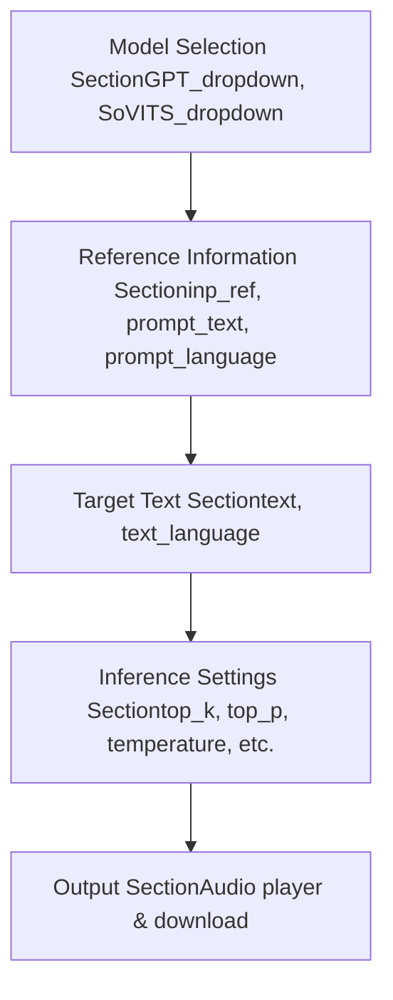
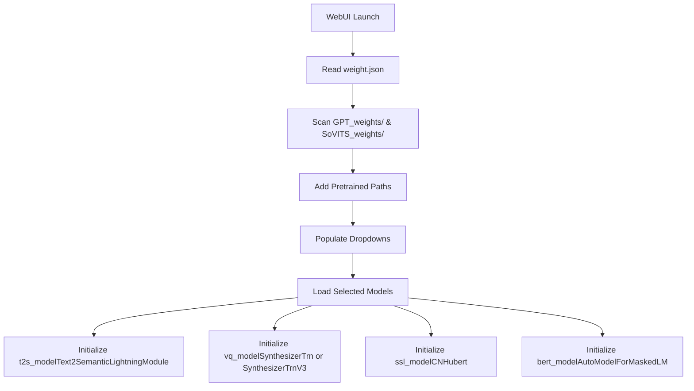
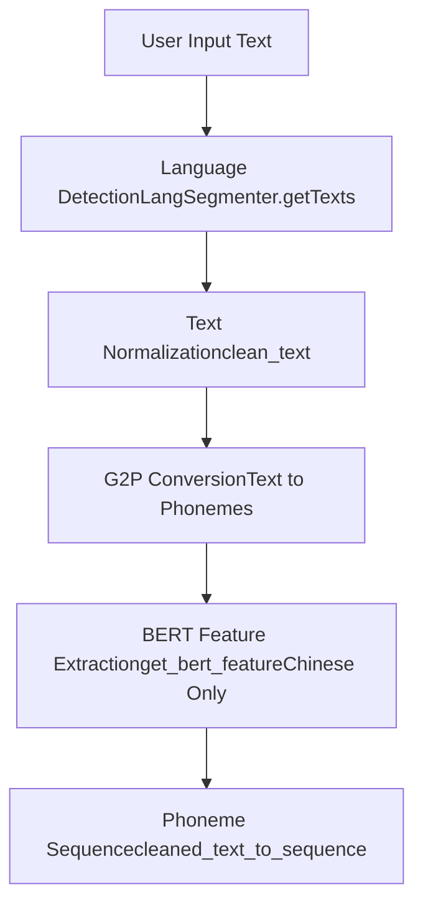
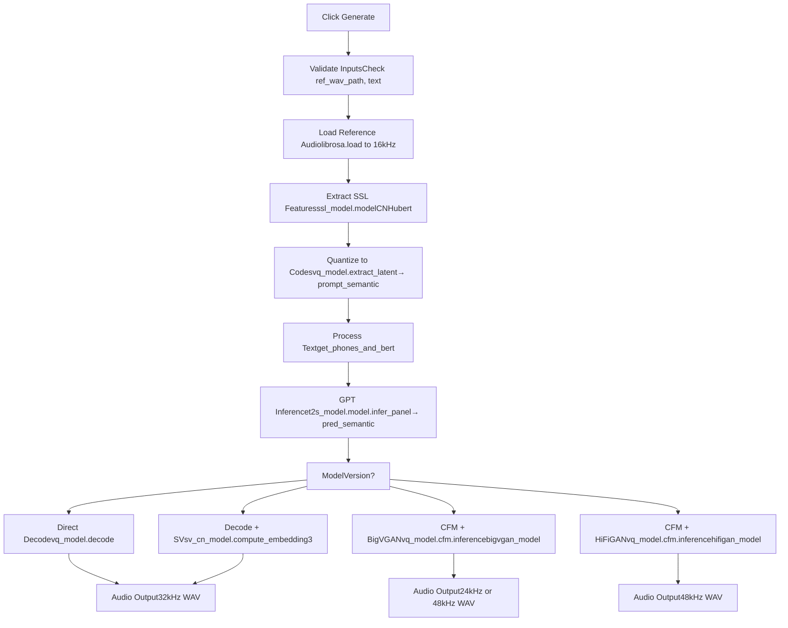
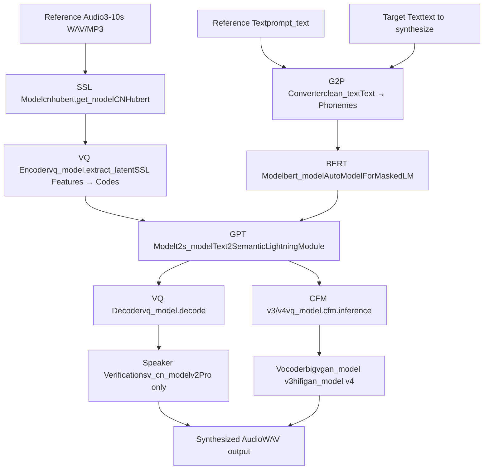

# Quick Start Guide

Relevant source files

-   [GPT\_SoVITS/inference\_webui.py](https://github.com/RVC-Boss/GPT-SoVITS/blob/c767f0b8/GPT_SoVITS/inference_webui.py)
-   [GPT\_SoVITS/inference\_webui\_fast.py](https://github.com/RVC-Boss/GPT-SoVITS/blob/c767f0b8/GPT_SoVITS/inference_webui_fast.py)
-   [GPT\_SoVITS/process\_ckpt.py](https://github.com/RVC-Boss/GPT-SoVITS/blob/c767f0b8/GPT_SoVITS/process_ckpt.py)
-   [README.md](https://github.com/RVC-Boss/GPT-SoVITS/blob/c767f0b8/README.md?plain=1)
-   [docs/cn/README.md](https://github.com/RVC-Boss/GPT-SoVITS/blob/c767f0b8/docs/cn/README.md?plain=1)
-   [docs/ja/README.md](https://github.com/RVC-Boss/GPT-SoVITS/blob/c767f0b8/docs/ja/README.md?plain=1)
-   [docs/ko/README.md](https://github.com/RVC-Boss/GPT-SoVITS/blob/c767f0b8/docs/ko/README.md?plain=1)
-   [docs/tr/README.md](https://github.com/RVC-Boss/GPT-SoVITS/blob/c767f0b8/docs/tr/README.md?plain=1)
-   [install.ps1](https://github.com/RVC-Boss/GPT-SoVITS/blob/c767f0b8/install.ps1)
-   [install.sh](https://github.com/RVC-Boss/GPT-SoVITS/blob/c767f0b8/install.sh)
-   [requirements.txt](https://github.com/RVC-Boss/GPT-SoVITS/blob/c767f0b8/requirements.txt)
-   [tools/assets.py](https://github.com/RVC-Boss/GPT-SoVITS/blob/c767f0b8/tools/assets.py)

This guide walks first-time users through generating their first text-to-speech output using GPT-SoVITS with pretrained models. It covers launching the inference interface, preparing input materials, configuring basic parameters, and generating synthesized speech. This guide assumes installation is complete (see [Installation and Setup](/RVC-Boss/GPT-SoVITS/1.1-installation-and-setup)).

For training custom models, see [Training Pipeline](/RVC-Boss/GPT-SoVITS/2.3-training-pipeline). For advanced inference configuration and API usage, see [Inference WebUI](/RVC-Boss/GPT-SoVITS/3.2-inference-webui) and [REST API](/RVC-Boss/GPT-SoVITS/3.3-rest-api).

---

## Prerequisites

Before starting, verify the following:

**Installation Complete:**

-   GPT-SoVITS installed via `install.sh`, `install.ps1`, integrated package, or manual installation
-   Python environment activated (typically `conda activate GPTSoVits`)
-   FFmpeg available in PATH

**Pretrained Models Downloaded:** The pretrained models should be located in `GPT_SoVITS/pretrained_models/`. If `install.sh` or `install.ps1` ran successfully, these are already present. The required files include:

| Model Version | Files | Location |
| --- | --- | --- |
| v2 (default) | `s1bert25hz-2kh-longer-epoch=68e-step=50232.ckpt`
`s2G488k.pth` or `s2G2333k.pth` | `GPT_SoVITS/pretrained_models/gsv-v2final-pretrained/` |
| v3 | `s1v3.ckpt`
`s2Gv3.pth`
`models--nvidia--bigvgan_v2_24khz_100band_256x/` | `GPT_SoVITS/pretrained_models/` |
| v4 | `s2v4.pth`
`vocoder.pth` | `GPT_SoVITS/pretrained_models/gsv-v4-pretrained/` |
| v2Pro/Plus | `s2Gv2Pro.pth` or `s2Gv2ProPlus.pth`
`pretrained_eres2netv2w24s4ep4.ckpt` | `GPT_SoVITS/pretrained_models/v2Pro/`
`GPT_SoVITS/pretrained_models/sv/` |

**Additional Models (Chinese TTS):**

-   `G2PWModel/` directory in `GPT_SoVITS/text/` for Chinese polyphone disambiguation

**Reference Audio:**

-   A 3-10 second audio clip of the target voice
-   Clean speech (minimal background noise)
-   Clear pronunciation
-   Supported formats: WAV, MP3, OGG, FLAC

Sources: [README.md193-212](https://github.com/RVC-Boss/GPT-SoVITS/blob/c767f0b8/README.md?plain=1#L193-L212) [install.sh255-261](https://github.com/RVC-Boss/GPT-SoVITS/blob/c767f0b8/install.sh#L255-L261)

---

## Launching the Inference Interface

GPT-SoVITS provides two inference interfaces. For quick start, use the **Inference WebUI** (simpler, inference-only).

### Method 1: Inference WebUI (Recommended for Quick Start)

**Windows Integrated Package:**

```
# Double-click in file explorergo-webui-v2.bat# Or use PowerShellgo-webui-v2.ps1
```
**Other Platforms:**

```
python GPT_SoVITS/inference_webui.py
```
The interface will launch at `http://localhost:9872` by default.

**Alternative Launch (Fast Version):**

```
python GPT_SoVITS/inference_webui_fast.py
```
The fast version uses the optimized TTS pipeline from [TTS\_infer\_pack/TTS.py](https://github.com/RVC-Boss/GPT-SoVITS/blob/c767f0b8/TTS_infer_pack/TTS.py) with better performance.

### Method 2: Main WebUI (All-in-One Interface)

If you prefer the full interface with training tools:

**Windows:**

```
go-webui.bat  # or go-webui.ps1
```
**Other Platforms:**

```
python webui.py
```
Navigate to the **1-GPT-SoVITS-TTS** → **1C-Inference** tab.

Sources: [README.md273-291](https://github.com/RVC-Boss/GPT-SoVITS/blob/c767f0b8/README.md?plain=1#L273-L291) [GPT\_SoVITS/inference\_webui.py84-86](https://github.com/RVC-Boss/GPT-SoVITS/blob/c767f0b8/GPT_SoVITS/inference_webui.py#L84-L86) [GPT\_SoVITS/inference\_webui\_fast.py45-46](https://github.com/RVC-Boss/GPT-SoVITS/blob/c767f0b8/GPT_SoVITS/inference_webui_fast.py#L45-L46)

---

## Interface Overview

The inference interface consists of four main sections:


**Key UI Components Mapping:**

| UI Element | Code Variable | Purpose |
| --- | --- | --- |
| GPT Model List | `GPT_dropdown` | Select GPT checkpoint path |
| SoVITS Model List | `SoVITS_dropdown` | Select SoVITS checkpoint path |
| Primary Reference Audio | `inp_ref` | Main 3-10s voice sample |
| Auxiliary Reference Audio | `inp_refs` | Optional additional samples (v1/v2 only) |
| Reference Text | `prompt_text` | Transcript of reference audio |
| Reference Language | `prompt_language` | Language of reference audio |
| Target Text | `text` | Text to synthesize |
| Target Language | `text_language` | Language of target text |
| Generate Button | Triggers `get_tts_wav()` or `inference()` | Start synthesis |

Sources: [GPT\_SoVITS/inference\_webui.py306-420](https://github.com/RVC-Boss/GPT-SoVITS/blob/c767f0b8/GPT_SoVITS/inference_webui.py#L306-L420) [GPT\_SoVITS/inference\_webui\_fast.py306-420](https://github.com/RVC-Boss/GPT-SoVITS/blob/c767f0b8/GPT_SoVITS/inference_webui_fast.py#L306-L420)

---

## Step-by-Step: Your First TTS Generation

### Step 1: Verify Models Are Loaded

When the interface launches, the pretrained models are automatically loaded. Check the model dropdowns:

-   **GPT Model List**: Should show available `.ckpt` files from `GPT_weights/` and pretrained paths
-   **SoVITS Model List**: Should show available `.pth` files from `SoVITS_weights/` and pretrained paths

The default selections will be the pretrained v2 models if no custom models exist.

**Model Loading Flow:**


Sources: [GPT\_SoVITS/inference\_webui.py45-72](https://github.com/RVC-Boss/GPT-SoVITS/blob/c767f0b8/GPT_SoVITS/inference_webui.py#L45-L72) [GPT\_SoVITS/inference\_webui.py376-400](https://github.com/RVC-Boss/GPT-SoVITS/blob/c767f0b8/GPT_SoVITS/inference_webui.py#L376-L400) [config.py](https://github.com/RVC-Boss/GPT-SoVITS/blob/c767f0b8/config.py)

### Step 2: Prepare Reference Audio

The reference audio is the voice sample that the system will clone. Requirements:

-   **Duration**: 3-10 seconds (enforced by code check at [GPT\_SoVITS/inference\_webui.py814-816](https://github.com/RVC-Boss/GPT-SoVITS/blob/c767f0b8/GPT_SoVITS/inference_webui.py#L814-L816))
-   **Format**: WAV, MP3, or other formats supported by librosa
-   **Quality**: Clean, clear speech with minimal noise
-   **Content**: Natural speech with normal prosody (avoid monotone or overly dramatic readings)

**File Selection:**

1.  Click the **Primary Reference Audio** upload button
2.  Select your audio file
3.  The file path will populate in `inp_ref`

**Optional: Multiple References (v1/v2 only):** For v1 and v2 models, you can upload additional reference audios in the **Auxiliary Reference Audio** section. These provide more voice characteristics. Not available for v3/v4.

Sources: [GPT\_SoVITS/inference\_webui.py813-816](https://github.com/RVC-Boss/GPT-SoVITS/blob/c767f0b8/GPT_SoVITS/inference_webui.py#L813-L816) [GPT\_SoVITS/inference\_webui.py896-914](https://github.com/RVC-Boss/GPT-SoVITS/blob/c767f0b8/GPT_SoVITS/inference_webui.py#L896-L914)

### Step 3: Enter Reference Text

The reference text is the transcript of what is said in the reference audio. This helps the model understand the phonetic content.

1.  In the **Reference Text** field (`prompt_text`), type the exact words spoken in the reference audio
2.  Select the **Reference Language** from the dropdown:
    -   中文 (Chinese - all\_zh)
    -   英文 (English - en)
    -   日文 (Japanese - all\_ja)
    -   粤语 (Cantonese - all\_yue) \[v2+\]
    -   韩文 (Korean - all\_ko) \[v2+\]
    -   Mixed language options (中英混合, 日英混合, etc.)
    -   多语种混合 (Auto language detection)

**Reference-Free Mode:** If you cannot determine what the reference audio says, enable the **"开启无参考文本模式"** (Enable reference-free mode) checkbox. In this mode, `prompt_text` is ignored. This is recommended only with fine-tuned GPT models and is NOT supported in v3/v4.

Sources: [GPT\_SoVITS/inference\_webui.py344-360](https://github.com/RVC-Boss/GPT-SoVITS/blob/c767f0b8/GPT_SoVITS/inference_webui.py#L344-L360) [GPT\_SoVITS/inference\_webui.py779-781](https://github.com/RVC-Boss/GPT-SoVITS/blob/c767f0b8/GPT_SoVITS/inference_webui.py#L779-L781) [GPT\_SoVITS/inference\_webui.py793-796](https://github.com/RVC-Boss/GPT-SoVITS/blob/c767f0b8/GPT_SoVITS/inference_webui.py#L793-L796)

### Step 4: Enter Target Text

The target text is what you want the synthesized voice to say.

1.  In the **Target Text** field (`text`), enter the text to synthesize
2.  Select the **Target Language** - should match the language of your target text
3.  The text can be multiple sentences or paragraphs (will be automatically segmented)

**Text Processing:** The system will:

-   Normalize the text (numbers to words, symbols to text)
-   Segment into sentences based on the **"怎么切"** (How to cut) setting
-   Convert text to phonemes using language-specific G2P models
-   Extract BERT features for Chinese text


Sources: [GPT\_SoVITS/inference\_webui.py601-668](https://github.com/RVC-Boss/GPT-SoVITS/blob/c767f0b8/GPT_SoVITS/inference_webui.py#L601-L668) [GPT\_SoVITS/inference\_webui.py552-556](https://github.com/RVC-Boss/GPT-SoVITS/blob/c767f0b8/GPT_SoVITS/inference_webui.py#L552-L556) [text/cleaner.py](https://github.com/RVC-Boss/GPT-SoVITS/blob/c767f0b8/text/cleaner.py)

### Step 5: Configure Basic Parameters

For your first generation, you can use the default parameters. Key parameters:

| Parameter | Default | Purpose |
| --- | --- | --- |
| **top\_k** | 15 | Limits vocabulary sampling (lower = more conservative) |
| **top\_p** | 1.0 | Nucleus sampling threshold (lower = more focused) |
| **temperature** | 1.0 | Sampling randomness (lower = more deterministic) |
| **Speed Factor** | 1.0 | Speaking rate multiplier (0.6-1.65) |
| **Fragment Interval** | 0.3s | Pause between sentences |
| **How to Cut** | 凑四句一切 | Text segmentation strategy |

**Model-Specific Parameters:**

-   **Sample Steps (v3/v4 only)**: Number of CFM (Conditional Flow Matching) diffusion steps. Options: 4, 8, 16, 32 (v3 default), 64, 128. Higher = better quality but slower.
-   **Audio Super-sampling (v3 only)**: Upsample 24kHz output to 48kHz using AP-BWE model

Sources: [GPT\_SoVITS/inference\_webui.py374-397](https://github.com/RVC-Boss/GPT-SoVITS/blob/c767f0b8/GPT_SoVITS/inference_webui.py#L374-L397) [GPT\_SoVITS/inference\_webui\_fast.py374-416](https://github.com/RVC-Boss/GPT-SoVITS/blob/c767f0b8/GPT_SoVITS/inference_webui_fast.py#L374-L416)

### Step 6: Generate Speech

1.  Click the **"合成语音"** (Synthesize Speech) button
2.  The system will process through the following stages:


3.  Progress is shown in the console with timing information
4.  When complete, the audio player will display with the generated speech
5.  Use the download button to save the output

\*\*Processing Times (from [GPT\_SoVITS/inference\_webui.py985](https://github.com/RVC-Boss/GPT-SoVITS/blob/c767f0b8/GPT_SoVITS/inference_webui.py#L985-L985)):

-   Stage 1: Reference audio processing
-   Stage 2: Text processing per segment
-   Stage 3: GPT semantic generation per segment
-   Stage 4: SoVITS audio synthesis per segment

Sources: [GPT\_SoVITS/inference\_webui.py751-1001](https://github.com/RVC-Boss/GPT-SoVITS/blob/c767f0b8/GPT_SoVITS/inference_webui.py#L751-L1001) [GPT\_SoVITS/inference\_webui\_fast.py150-202](https://github.com/RVC-Boss/GPT-SoVITS/blob/c767f0b8/GPT_SoVITS/inference_webui_fast.py#L150-L202)

---

## Understanding the Inference Pipeline

The complete inference pipeline involves several models working in sequence:


**Key Model Components:**

| Component | Class/Function | Location | Purpose |
| --- | --- | --- | --- |
| SSL Feature Extractor | `cnhubert.get_model()` | [feature\_extractor/cnhubert.py](https://github.com/RVC-Boss/GPT-SoVITS/blob/c767f0b8/feature_extractor/cnhubert.py) | Extract acoustic features from reference audio |
| BERT Model | `AutoModelForMaskedLM` | [GPT\_SoVITS/inference\_webui.py164](https://github.com/RVC-Boss/GPT-SoVITS/blob/c767f0b8/GPT_SoVITS/inference_webui.py#L164-L164) | Extract contextual text features (Chinese only) |
| GPT Model | `Text2SemanticLightningModule` | [AR/models/t2s\_lightning\_module.py](https://github.com/RVC-Boss/GPT-SoVITS/blob/c767f0b8/AR/models/t2s_lightning_module.py) | Generate semantic token sequence from text |
| VQ Model (v1/v2) | `SynthesizerTrn` | [GPT\_SoVITS/module/models.py](https://github.com/RVC-Boss/GPT-SoVITS/blob/c767f0b8/GPT_SoVITS/module/models.py) | Encode/decode between audio and semantic tokens |
| VQ Model (v3/v4) | `SynthesizerTrnV3` | [GPT\_SoVITS/module/models.py](https://github.com/RVC-Boss/GPT-SoVITS/blob/c767f0b8/GPT_SoVITS/module/models.py) | CFM-based acoustic model |
| BigVGAN (v3) | `bigvgan.BigVGAN` | [BigVGAN/](https://github.com/RVC-Boss/GPT-SoVITS/blob/c767f0b8/BigVGAN/) | Neural vocoder (mel to waveform, 24kHz) |
| HiFiGAN (v4) | `Generator` | [GPT\_SoVITS/module/models.py](https://github.com/RVC-Boss/GPT-SoVITS/blob/c767f0b8/GPT_SoVITS/module/models.py) | Neural vocoder (mel to waveform, 48kHz) |
| Speaker Verification | `SV` | [sv/](https://github.com/RVC-Boss/GPT-SoVITS/blob/c767f0b8/sv/) | Extract speaker embeddings (v2Pro) |

Sources: [GPT\_SoVITS/inference\_webui.py96-220](https://github.com/RVC-Boss/GPT-SoVITS/blob/c767f0b8/GPT_SoVITS/inference_webui.py#L96-L220) [GPT\_SoVITS/inference\_webui.py376-405](https://github.com/RVC-Boss/GPT-SoVITS/blob/c767f0b8/GPT_SoVITS/inference_webui.py#L376-L405) [GPT\_SoVITS/inference\_webui.py440-505](https://github.com/RVC-Boss/GPT-SoVITS/blob/c767f0b8/GPT_SoVITS/inference_webui.py#L440-L505)

---

## Model Version Comparison

GPT-SoVITS has evolved through multiple versions, each with different characteristics:

| Feature | v1/v2 | v3 | v4 | v2Pro/Plus |
| --- | --- | --- | --- | --- |
| **Output Sample Rate** | 32kHz | 24kHz native | 48kHz native | 32kHz |
| **Synthesis Method** | Direct VQ decode | CFM + BigVGAN | CFM + HiFiGAN | VQ decode + SV |
| **Min Training Data** | 1 minute | < 1 minute | < 1 minute | 1 minute |
| **Timbre Similarity** | Good | Excellent | Excellent | Excellent |
| **VRAM (Training)** | ~14GB | ~8GB (LoRA) | ~8GB (LoRA) | ~14GB |
| **Inference Speed** | Fast | Medium | Medium | Fast |
| **Audio Quality** | Good | High (may sound muffled) | High (no artifacts) | High |
| **Aux References** | ✓ | ✗ | ✗ | ✓ |
| **Ref-Free Mode** | ✓ | ✗ | ✗ | ✓ |
| **Sample Steps Param** | ✗ | ✓ (4-128) | ✓ (4-32) | ✗ |
| **Super-sampling** | ✗ | ✓ (24→48kHz) | ✗ (native 48kHz) | ✗ |

**Version Selection Guidance:**

-   **v2**: Best for fast inference and low VRAM. Works well with average audio quality training sets.
-   **v3**: Best timbre similarity, good for minimal training data. May sound muffled at native 24kHz (use super-sampling).
-   **v4**: Fixes v3's metallic artifacts, native 48kHz output. Current recommended version.
-   **v2Pro/Plus**: Enhanced speaker verification, better similarity than v2 with similar speed. Best for high-quality voice cloning.

**Version Detection:** The system automatically detects model version from checkpoint metadata using [process\_ckpt.py100-127](https://github.com/RVC-Boss/GPT-SoVITS/blob/c767f0b8/process_ckpt.py#L100-L127) Detection methods:

1.  MD5 hash match for known pretrained models
2.  File header bytes (custom format)
3.  File size heuristics (fallback for old models)

Sources: [README.md293-367](https://github.com/RVC-Boss/GPT-SoVITS/blob/c767f0b8/README.md?plain=1#L293-L367) [docs/cn/README.md281-356](https://github.com/RVC-Boss/GPT-SoVITS/blob/c767f0b8/docs/cn/README.md?plain=1#L281-L356) [process\_ckpt.py72-126](https://github.com/RVC-Boss/GPT-SoVITS/blob/c767f0b8/process_ckpt.py#L72-L126) [GPT\_SoVITS/inference\_webui.py229-243](https://github.com/RVC-Boss/GPT-SoVITS/blob/c767f0b8/GPT_SoVITS/inference_webui.py#L229-L243)

---

## Common Parameters Explained

### Sampling Parameters

**top\_k** (default: 15, range: 1-100)

-   Controls vocabulary size during sampling
-   Lower values = more conservative predictions (safer but less creative)
-   Higher values = more vocabulary options (more creative but potentially unstable)
-   Code: [GPT\_SoVITS/inference\_webui.py884](https://github.com/RVC-Boss/GPT-SoVITS/blob/c767f0b8/GPT_SoVITS/inference_webui.py#L884-L884)

**top\_p** (default: 1.0, range: 0-1)

-   Nucleus sampling threshold
-   Considers tokens with cumulative probability up to `top_p`
-   Lower values = more focused on likely tokens
-   1.0 = considers all tokens (no filtering)
-   Code: [GPT\_SoVITS/inference\_webui.py885](https://github.com/RVC-Boss/GPT-SoVITS/blob/c767f0b8/GPT_SoVITS/inference_webui.py#L885-L885)

**temperature** (default: 1.0, range: 0-1)

-   Controls randomness of predictions
-   Lower values = more deterministic (repeatable, safer)
-   Higher values = more random (more variation, potentially unstable)
-   0.6-0.8 recommended for stable generation
-   Code: [GPT\_SoVITS/inference\_webui.py886](https://github.com/RVC-Boss/GPT-SoVITS/blob/c767f0b8/GPT_SoVITS/inference_webui.py#L886-L886)

**repetition\_penalty** (default: 1.35, range: 0-2)

-   Penalizes repeated tokens to avoid loops
-   Values > 1.0 discourage repetition
-   Higher values = stronger penalty
-   Helps prevent stuttering or infinite loops
-   Code: [GPT\_SoVITS/inference\_webui\_fast.py395](https://github.com/RVC-Boss/GPT-SoVITS/blob/c767f0b8/GPT_SoVITS/inference_webui_fast.py#L395-L395)

### Text Segmentation

The **"怎么切"** (How to cut) parameter controls text segmentation strategy:

| Option | Method | Code Function |
| --- | --- | --- |
| 不切 | No splitting | Return as-is |
| 凑四句一切 | Every 4 sentences | [GPT\_SoVITS/inference\_webui.py1023-1036](https://github.com/RVC-Boss/GPT-SoVITS/blob/c767f0b8/GPT_SoVITS/inference_webui.py#L1023-L1036) |
| 凑50字一切 | Every 50 characters | [GPT\_SoVITS/inference\_webui.py1038-1061](https://github.com/RVC-Boss/GPT-SoVITS/blob/c767f0b8/GPT_SoVITS/inference_webui.py#L1038-L1061) |
| 按中文句号。切 | Split on Chinese period | [GPT\_SoVITS/inference\_webui.py1063-1068](https://github.com/RVC-Boss/GPT-SoVITS/blob/c767f0b8/GPT_SoVITS/inference_webui.py#L1063-L1068) |
| 按英文句号.切 | Split on English period | [GPT\_SoVITS/inference\_webui.py1070-1075](https://github.com/RVC-Boss/GPT-SoVITS/blob/c767f0b8/GPT_SoVITS/inference_webui.py#L1070-L1075) |
| 按标点符号切 | Split on all punctuation | [GPT\_SoVITS/inference\_webui.py1078-1106](https://github.com/RVC-Boss/GPT-SoVITS/blob/c767f0b8/GPT_SoVITS/inference_webui.py#L1078-L1106) |

Segmentation affects:

-   Memory usage (longer segments = more memory)
-   Prosody continuity (shorter segments = more natural pauses)
-   Processing parallelization

Sources: [GPT\_SoVITS/inference\_webui.py831-846](https://github.com/RVC-Boss/GPT-SoVITS/blob/c767f0b8/GPT_SoVITS/inference_webui.py#L831-L846) [GPT\_SoVITS/inference\_webui.py1004-1106](https://github.com/RVC-Boss/GPT-SoVITS/blob/c767f0b8/GPT_SoVITS/inference_webui.py#L1004-L1106)

### Speed and Quality

**speed\_factor** (default: 1.0, range: 0.6-1.65)

-   Adjusts speaking rate through resampling
-   < 1.0 = slower speech
-   > 1.0 = faster speech

-   Does not affect pitch (unlike time-stretching)
-   Code: [GPT\_SoVITS/inference\_webui.py917-922](https://github.com/RVC-Boss/GPT-SoVITS/blob/c767f0b8/GPT_SoVITS/inference_webui.py#L917-L922)

**batch\_size** (default: 20, range: 1-200)

-   Number of semantic tokens processed together
-   Higher = faster but more memory
-   Lower = slower but less memory
-   Primarily affects GPT inference stage
-   Code: [GPT\_SoVITS/inference\_webui\_fast.py186](https://github.com/RVC-Boss/GPT-SoVITS/blob/c767f0b8/GPT_SoVITS/inference_webui_fast.py#L186-L186)

**sample\_steps** (v3: 4-128, v4: 4-32, default: 32 for v3, 8 for v4)

-   Number of CFM diffusion steps
-   Higher = better quality but slower
-   v3: 32-64 recommended for quality
-   v4: 8-16 sufficient due to improved architecture
-   Code: [GPT\_SoVITS/inference\_webui.py958-959](https://github.com/RVC-Boss/GPT-SoVITS/blob/c767f0b8/GPT_SoVITS/inference_webui.py#L958-L959)

Sources: [GPT\_SoVITS/inference\_webui\_fast.py174-196](https://github.com/RVC-Boss/GPT-SoVITS/blob/c767f0b8/GPT_SoVITS/inference_webui_fast.py#L174-L196) [GPT\_SoVITS/inference\_webui.py272-273](https://github.com/RVC-Boss/GPT-SoVITS/blob/c767f0b8/GPT_SoVITS/inference_webui.py#L272-L273)

---

## Troubleshooting

### Reference Audio Length Error

**Error Message:** "参考音频在3~10秒范围外，请更换！"

**Cause:** Reference audio duration outside 3-10 second range

**Solution:**

1.  Check audio duration: `48000 < len(wav16k) < 160000` samples at 16kHz
2.  Trim audio to 3-10 seconds using audio editor
3.  Ensure audio isn't corrupted (try re-encoding)

**Code Check:** [GPT\_SoVITS/inference\_webui.py814-816](https://github.com/RVC-Boss/GPT-SoVITS/blob/c767f0b8/GPT_SoVITS/inference_webui.py#L814-L816)

### Empty Output or No Audio

**Possible Causes:**

1.  **Empty reference text in v3/v4:** These versions require reference text
    -   Solution: Fill in `prompt_text` or switch to v1/v2
2.  **Model not loaded:** Check console for loading errors
    -   Solution: Verify model files exist and restart interface
3.  **Text too short:** Very short inputs may be filtered out
    -   Solution: Use at least 5 characters per segment

**Related Code:** [GPT\_SoVITS/inference\_webui.py770-777](https://github.com/RVC-Boss/GPT-SoVITS/blob/c767f0b8/GPT_SoVITS/inference_webui.py#L770-L777) [GPT\_SoVITS/inference\_webui.py781-783](https://github.com/RVC-Boss/GPT-SoVITS/blob/c767f0b8/GPT_SoVITS/inference_webui.py#L781-L783)

### V3 Model LoRA Loading Error

**Error Message:** "SoVITS v3 底模缺失，无法加载相应 LoRA 权重"

**Cause:** Attempting to load v3 LoRA checkpoint without base model

**Solution:**

1.  Download v3 pretrained base model `s2Gv3.pth` from [HuggingFace](https://huggingface.co/lj1995/GPT-SoVITS)
2.  Place in `GPT_SoVITS/pretrained_models/`
3.  Restart interface

**Code Check:** [GPT\_SoVITS/inference\_webui.py237-240](https://github.com/RVC-Boss/GPT-SoVITS/blob/c767f0b8/GPT_SoVITS/inference_webui.py#L237-L240) [GPT\_SoVITS/inference\_webui\_fast.py241-244](https://github.com/RVC-Boss/GPT-SoVITS/blob/c767f0b8/GPT_SoVITS/inference_webui_fast.py#L241-L244)

### Model Version Mismatch

**Symptom:** Model loads but synthesis fails or produces garbled audio

**Cause:** Incorrect version detection or mixing v1/v2 symbols with v3/v4 models

**Solution:**

1.  Check version detection in console output
2.  Ensure GPT and SoVITS models are compatible versions
3.  For custom models, verify version metadata in checkpoint

**Version Detection:** [process\_ckpt.py100-127](https://github.com/RVC-Boss/GPT-SoVITS/blob/c767f0b8/process_ckpt.py#L100-L127)

### Out of Memory (CUDA OOM)

**Symptom:** `RuntimeError: CUDA out of memory`

**Solutions:**

1.  **Lower batch\_size:** Reduce from 20 to 10 or 5
2.  **Use FP16:** Enable half-precision via `is_half=True` environment variable
3.  **Shorter text segments:** Use more aggressive segmentation
4.  **Use v3/v4 LoRA:** Requires only ~8GB VRAM vs 14GB for full fine-tuning
5.  **Close other GPU applications**

**Memory Usage by Version:**

-   v1/v2 inference: ~4-6GB
-   v3 inference: ~5-7GB
-   v4 inference: ~5-7GB
-   v2Pro inference: ~6-8GB

### Language Not Supported

**Symptom:** Incorrect pronunciation or missing language option

**Supported Languages (v2+):**

-   Chinese (Mandarin): all\_zh, zh
-   English: en
-   Japanese: all\_ja, ja
-   Cantonese: all\_yue, yue
-   Korean: all\_ko, ko
-   Mixed: auto, auto\_yue

**v1 Supported Languages:** Chinese, English, Japanese only

**Code:** [GPT\_SoVITS/inference\_webui.py140-162](https://github.com/RVC-Boss/GPT-SoVITS/blob/c767f0b8/GPT_SoVITS/inference_webui.py#L140-L162)

Sources: [GPT\_SoVITS/inference\_webui.py770-890](https://github.com/RVC-Boss/GPT-SoVITS/blob/c767f0b8/GPT_SoVITS/inference_webui.py#L770-L890) [GPT\_SoVITS/inference\_webui.py237-240](https://github.com/RVC-Boss/GPT-SoVITS/blob/c767f0b8/GPT_SoVITS/inference_webui.py#L237-L240) [process\_ckpt.py100-127](https://github.com/RVC-Boss/GPT-SoVITS/blob/c767f0b8/process_ckpt.py#L100-L127)

---

## Next Steps

After successfully generating your first TTS output:

1.  **Experiment with Parameters:** Try different `top_k`, `temperature`, and `speed_factor` values to understand their effects

2.  **Test Multiple Languages:** If multilingual, try different language combinations and the auto-detection mode

3.  **Prepare Custom Training Data:** To train models for specific voices, see [Data Preparation](/RVC-Boss/GPT-SoVITS/5-data-preparation) for preparing training datasets

4.  **Fine-tune Models:** Follow the [Training Pipeline](/RVC-Boss/GPT-SoVITS/2.3-training-pipeline) to train custom GPT and SoVITS models with your own voice data

5.  **Integrate via API:** For production use, see [REST API](/RVC-Boss/GPT-SoVITS/3.3-rest-api) for programmatic access with JSON requests

6.  **Optimize for Production:** Export models to ONNX format using [Model Export and ONNX](/RVC-Boss/GPT-SoVITS/7.2-model-export-and-onnx) for faster inference

7.  **Batch Processing:** Process multiple texts efficiently using [Batch Processing](/RVC-Boss/GPT-SoVITS/7.3-batch-processing)


**Additional Resources:**

-   Detailed user guide: [简体中文](https://www.yuque.com/baicaigongchang1145haoyuangong/ib3g1e) | [English](https://rentry.co/GPT-SoVITS-guide#/)
-   Model version comparison: [Model Versions and Evolution](/RVC-Boss/GPT-SoVITS/1.2-model-versions-and-evolution)
-   Advanced inference configuration: [Inference WebUI](/RVC-Boss/GPT-SoVITS/3.2-inference-webui)

Sources: [README.md238-291](https://github.com/RVC-Boss/GPT-SoVITS/blob/c767f0b8/README.md?plain=1#L238-L291) [README.md369-388](https://github.com/RVC-Boss/GPT-SoVITS/blob/c767f0b8/README.md?plain=1#L369-L388)

---

## File References Summary

Key files involved in quick start inference:

| File | Purpose |
| --- | --- |
| [GPT\_SoVITS/inference\_webui.py1-1207](https://github.com/RVC-Boss/GPT-SoVITS/blob/c767f0b8/GPT_SoVITS/inference_webui.py#L1-L1207) | Main inference interface with integrated model loading |
| [GPT\_SoVITS/inference\_webui\_fast.py1-523](https://github.com/RVC-Boss/GPT-SoVITS/blob/c767f0b8/GPT_SoVITS/inference_webui_fast.py#L1-L523) | Optimized inference interface using TTS pipeline |
| [config.py](https://github.com/RVC-Boss/GPT-SoVITS/blob/c767f0b8/config.py) | Configuration management, model path detection |
| [process\_ckpt.py100-139](https://github.com/RVC-Boss/GPT-SoVITS/blob/c767f0b8/process_ckpt.py#L100-L139) | Model version detection and loading utilities |
| [GPT\_SoVITS/module/models.py](https://github.com/RVC-Boss/GPT-SoVITS/blob/c767f0b8/GPT_SoVITS/module/models.py) | SynthesizerTrn, SynthesizerTrnV3, Generator (vocoder) |
| [AR/models/t2s\_lightning\_module.py](https://github.com/RVC-Boss/GPT-SoVITS/blob/c767f0b8/AR/models/t2s_lightning_module.py) | Text2SemanticLightningModule (GPT model) |
| [feature\_extractor/cnhubert.py](https://github.com/RVC-Boss/GPT-SoVITS/blob/c767f0b8/feature_extractor/cnhubert.py) | CNHubert SSL feature extraction |
| [text/cleaner.py](https://github.com/RVC-Boss/GPT-SoVITS/blob/c767f0b8/text/cleaner.py) | Text normalization and G2P conversion |
| [TTS\_infer\_pack/TTS.py](https://github.com/RVC-Boss/GPT-SoVITS/blob/c767f0b8/TTS_infer_pack/TTS.py) | Unified TTS inference pipeline (fast version) |

Sources: All files listed above
