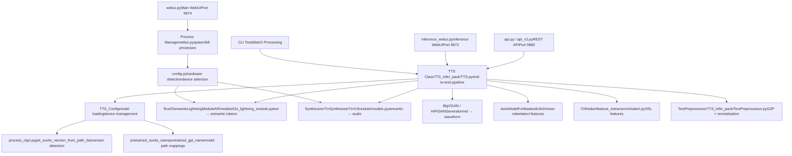
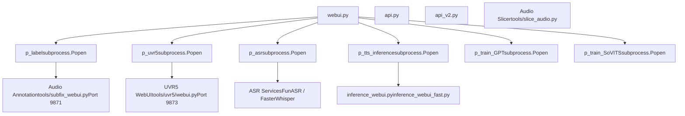
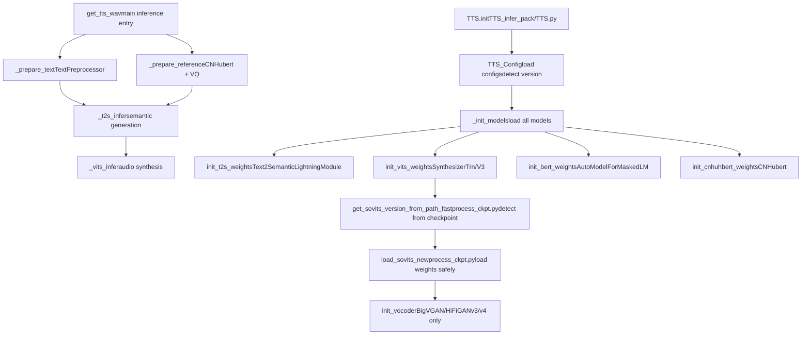
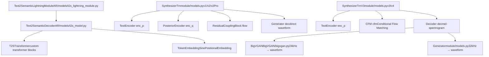
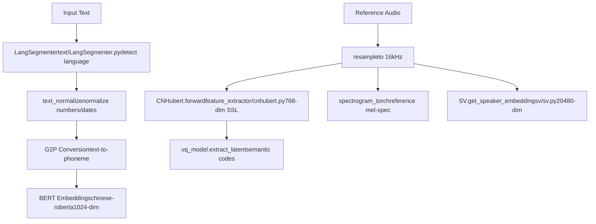
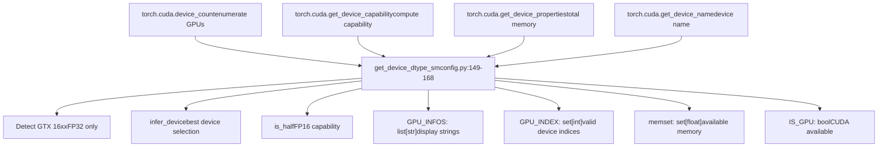
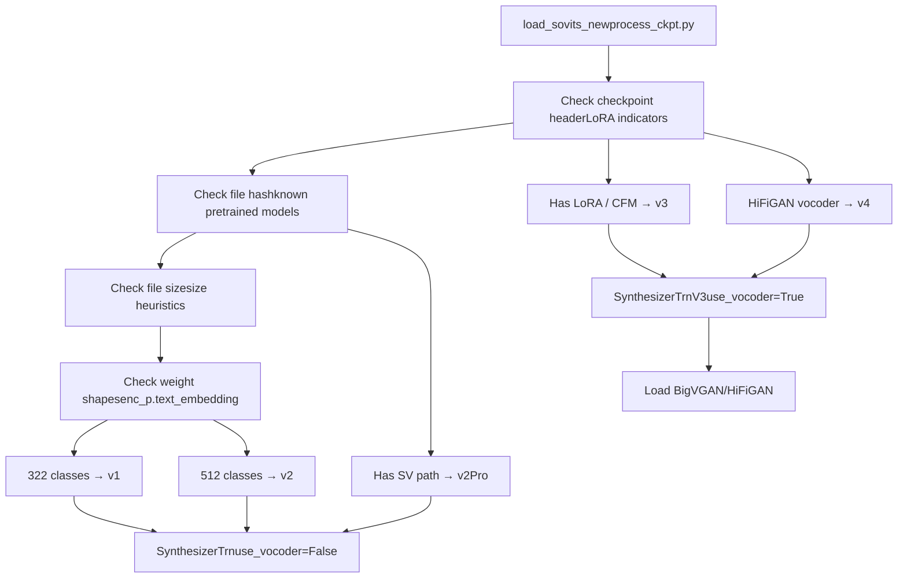
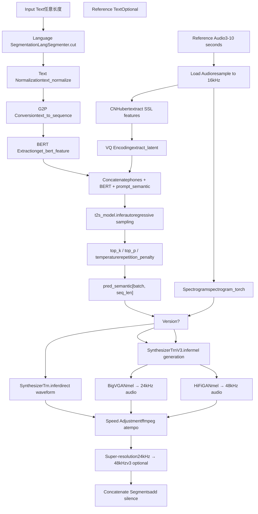
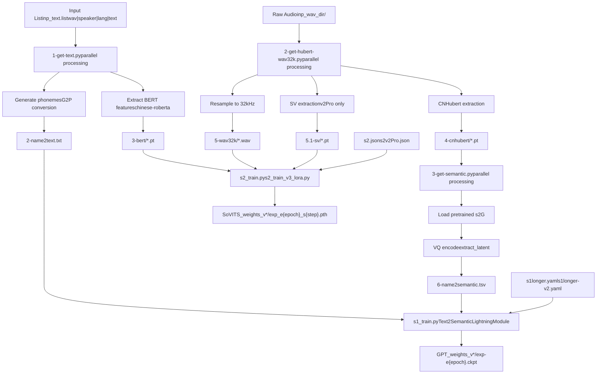

# System Architecture

Relevant source files

-   [.gitignore](https://github.com/RVC-Boss/GPT-SoVITS/blob/c767f0b8/.gitignore)
-   [GPT\_SoVITS/AR/models/t2s\_model.py](https://github.com/RVC-Boss/GPT-SoVITS/blob/c767f0b8/GPT_SoVITS/AR/models/t2s_model.py)
-   [GPT\_SoVITS/AR/models/utils.py](https://github.com/RVC-Boss/GPT-SoVITS/blob/c767f0b8/GPT_SoVITS/AR/models/utils.py)
-   [GPT\_SoVITS/TTS\_infer\_pack/TTS.py](https://github.com/RVC-Boss/GPT-SoVITS/blob/c767f0b8/GPT_SoVITS/TTS_infer_pack/TTS.py)
-   [GPT\_SoVITS/configs/tts\_infer.yaml](https://github.com/RVC-Boss/GPT-SoVITS/blob/c767f0b8/GPT_SoVITS/configs/tts_infer.yaml)
-   [README.md](https://github.com/RVC-Boss/GPT-SoVITS/blob/c767f0b8/README.md?plain=1)
-   [api.py](https://github.com/RVC-Boss/GPT-SoVITS/blob/c767f0b8/api.py)
-   [api\_v2.py](https://github.com/RVC-Boss/GPT-SoVITS/blob/c767f0b8/api_v2.py)
-   [config.py](https://github.com/RVC-Boss/GPT-SoVITS/blob/c767f0b8/config.py)
-   [docs/cn/README.md](https://github.com/RVC-Boss/GPT-SoVITS/blob/c767f0b8/docs/cn/README.md?plain=1)
-   [docs/ja/README.md](https://github.com/RVC-Boss/GPT-SoVITS/blob/c767f0b8/docs/ja/README.md?plain=1)
-   [docs/ko/README.md](https://github.com/RVC-Boss/GPT-SoVITS/blob/c767f0b8/docs/ko/README.md?plain=1)
-   [docs/tr/README.md](https://github.com/RVC-Boss/GPT-SoVITS/blob/c767f0b8/docs/tr/README.md?plain=1)
-   [install.ps1](https://github.com/RVC-Boss/GPT-SoVITS/blob/c767f0b8/install.ps1)
-   [install.sh](https://github.com/RVC-Boss/GPT-SoVITS/blob/c767f0b8/install.sh)
-   [requirements.txt](https://github.com/RVC-Boss/GPT-SoVITS/blob/c767f0b8/requirements.txt)
-   [webui.py](https://github.com/RVC-Boss/GPT-SoVITS/blob/c767f0b8/webui.py)

## Purpose and Scope

This document describes the high-level architecture of the GPT-SoVITS system, focusing on how major components interact and the layered design of the codebase. It covers the interface layer, model layer, orchestration layer, and configuration systems that enable training and inference workflows.

For detailed information about specific subsystems:

-   Core model architectures (SynthesizerTrn, Text2SemanticLightningModule) → See [Core Model Architectures](/RVC-Boss/GPT-SoVITS/2.1-core-model-architectures)
-   Text processing pipeline → See [Text Processing Pipeline](/RVC-Boss/GPT-SoVITS/2.2-text-processing-pipeline)
-   Training workflows → See [Training Pipeline](/RVC-Boss/GPT-SoVITS/2.3-training-pipeline)
-   Inference workflows → See [Inference Pipeline](/RVC-Boss/GPT-SoVITS/2.4-inference-pipeline)

---

## Architectural Overview

GPT-SoVITS follows a layered architecture with clear separation between interface, orchestration, model, and configuration concerns. The system supports multiple model versions (v1/v2/v3/v4/v2Pro/v2ProPlus) with version-specific code paths managed through configuration and dynamic loading.


**Key Architectural Principles:**

1.  **Version Polymorphism**: Models are loaded dynamically based on checkpoint metadata, with different execution paths for v1/v2 (direct decode) vs v3/v4 (CFM + vocoder)
2.  **Process Isolation**: WebUI spawns separate processes for training, preprocessing, and inference to prevent resource conflicts
3.  **Hardware Abstraction**: `config.py` detects GPU capabilities (compute capability, memory) and selects appropriate device/precision
4.  **Modular Pipeline**: TTS inference is broken into discrete stages (text processing, semantic generation, acoustic synthesis) that can be reused

Sources: [webui.py1-300](https://github.com/RVC-Boss/GPT-SoVITS/blob/c767f0b8/webui.py#L1-L300) [GPT\_SoVITS/TTS\_infer\_pack/TTS.py421-475](https://github.com/RVC-Boss/GPT-SoVITS/blob/c767f0b8/GPT_SoVITS/TTS_infer_pack/TTS.py#L421-L475) [config.py1-219](https://github.com/RVC-Boss/GPT-SoVITS/blob/c767f0b8/config.py#L1-L219) [GPT\_SoVITS/AR/models/t2s\_lightning\_module.py1-50](https://github.com/RVC-Boss/GPT-SoVITS/blob/c767f0b8/GPT_SoVITS/AR/models/t2s_lightning_module.py#L1-L50)

---

## Component Layers

### Interface Layer

The interface layer provides multiple entry points for users and programs to access GPT-SoVITS functionality.


**Component Descriptions:**

| Component | File | Purpose | Port |
| --- | --- | --- | --- |
| Main WebUI | [webui.py1-300](https://github.com/RVC-Boss/GPT-SoVITS/blob/c767f0b8/webui.py#L1-L300) | Training + inference + tools orchestration | 9874 |
| REST API v1 | [api.py1-200](https://github.com/RVC-Boss/GPT-SoVITS/blob/c767f0b8/api.py#L1-L200) | Programmatic TTS inference | 9880 |
| REST API v2 | [api\_v2.py1-200](https://github.com/RVC-Boss/GPT-SoVITS/blob/c767f0b8/api_v2.py#L1-L200) | Enhanced API with streaming support | 9880 |
| Inference WebUI | [inference\_webui.py](https://github.com/RVC-Boss/GPT-SoVITS/blob/c767f0b8/inference_webui.py) | Lightweight TTS-only interface | 9872 |
| UVR5 WebUI | [tools/uvr5/webui.py](https://github.com/RVC-Boss/GPT-SoVITS/blob/c767f0b8/tools/uvr5/webui.py) | Vocal separation interface | 9873 |
| Subfix WebUI | [tools/subfix\_webui.py](https://github.com/RVC-Boss/GPT-SoVITS/blob/c767f0b8/tools/subfix_webui.py) | Audio annotation/correction | 9871 |

**Process Management Pattern:**

The main WebUI uses a global process registry to track spawned subprocesses:

```
# Global process handles in webui.pyp_label = None      # Audio annotation processp_uvr5 = None       # UVR5 separation processp_asr = None        # ASR transcription processp_tts_inference = None  # TTS inference WebUIp_train_GPT = None  # GPT training processp_train_SoVITS = None   # SoVITS training process
```
Each process is spawned using `subprocess.Popen` with shell=True and can be terminated using `kill_process()` which sends SIGTERM signals to the process tree.

Sources: [webui.py204-295](https://github.com/RVC-Boss/GPT-SoVITS/blob/c767f0b8/webui.py#L204-L295) [webui.py301-326](https://github.com/RVC-Boss/GPT-SoVITS/blob/c767f0b8/webui.py#L301-L326) [webui.py331-363](https://github.com/RVC-Boss/GPT-SoVITS/blob/c767f0b8/webui.py#L331-L363) [api.py1-142](https://github.com/RVC-Boss/GPT-SoVITS/blob/c767f0b8/api.py#L1-L142) [api\_v2.py1-50](https://github.com/RVC-Boss/GPT-SoVITS/blob/c767f0b8/api_v2.py#L1-L50)

---

### Orchestration Layer

The orchestration layer manages model lifecycle, coordinates multi-stage pipelines, and handles version-specific routing.

#### TTS Class Architecture


**TTS\_Config Class:**

Manages configuration and model paths for different versions:

```
# Default configurations per versiondefault_configs = {    "v1": {        "t2s_weights_path": "GPT_SoVITS/pretrained_models/s1bert25hz-2kh-...",        "vits_weights_path": "GPT_SoVITS/pretrained_models/s2G488k.pth",        ...    },    "v2": { ... },    "v3": { ... },    "v4": { ... },    "v2Pro": { ... },    "v2ProPlus": { ... }}
```
The `TTS_Config` class:

-   Validates paths and falls back to defaults if missing
-   Detects CUDA availability and sets device
-   Determines whether half-precision is supported
-   Maintains version-specific parameters (sampling\_rate, hop\_length, etc.)

**Model Loading Strategy:**

1.  **Version Detection**: [process\_ckpt.py](https://github.com/RVC-Boss/GPT-SoVITS/blob/c767f0b8/process_ckpt.py) analyzes checkpoint headers/hashes to determine version
2.  **Dynamic Instantiation**: Creates `SynthesizerTrn` for v1/v2 or `SynthesizerTrnV3` for v3/v4
3.  **Conditional Vocoder**: Only v3/v4 load external vocoders (BigVGAN/HiFiGAN)
4.  **LoRA Support**: v3/v4 detect LoRA checkpoints and apply PEFT wrappers

Sources: [GPT\_SoVITS/TTS\_infer\_pack/TTS.py217-419](https://github.com/RVC-Boss/GPT-SoVITS/blob/c767f0b8/GPT_SoVITS/TTS_infer_pack/TTS.py#L217-L419) [GPT\_SoVITS/TTS\_infer\_pack/TTS.py421-475](https://github.com/RVC-Boss/GPT-SoVITS/blob/c767f0b8/GPT_SoVITS/TTS_infer_pack/TTS.py#L421-L475) [GPT\_SoVITS/TTS\_infer\_pack/TTS.py476-680](https://github.com/RVC-Boss/GPT-SoVITS/blob/c767f0b8/GPT_SoVITS/TTS_infer_pack/TTS.py#L476-L680) [process\_ckpt.py1-200](https://github.com/RVC-Boss/GPT-SoVITS/blob/c767f0b8/process_ckpt.py#L1-L200)

---

### Model Layer

The model layer implements the core neural networks for text-to-speech synthesis.

#### Model Architecture by Version


**Version-Specific Routing:**

The `TTS` class uses conditional logic to route inference based on model version:

```
# Version detection from checkpointversion, model_version, if_lora_v3 = get_sovits_version_from_path_fast(weights_path) # Model instantiationif model_version not in {"v3", "v4"}:    vits_model = SynthesizerTrn(...)  # v1/v2/v2Pro    self.configs.use_vocoder = Falseelse:    vits_model = SynthesizerTrnV3(...)  # v3/v4    self.configs.use_vocoder = True    self.init_vocoder(model_version)
```
**Key Model Components:**

| Component | File | Purpose | Versions |
| --- | --- | --- | --- |
| Text2SemanticLightningModule | [AR/models/t2s\_lightning\_module.py](https://github.com/RVC-Boss/GPT-SoVITS/blob/c767f0b8/AR/models/t2s_lightning_module.py) | GPT-based semantic token prediction | All |
| SynthesizerTrn | [module/models.py](https://github.com/RVC-Boss/GPT-SoVITS/blob/c767f0b8/module/models.py) | Direct waveform synthesis | v1/v2/v2Pro |
| SynthesizerTrnV3 | [module/models.py](https://github.com/RVC-Boss/GPT-SoVITS/blob/c767f0b8/module/models.py) | Mel-spectrogram generation | v3/v4 |
| BigVGAN | [BigVGAN/bigvgan.py](https://github.com/RVC-Boss/GPT-SoVITS/blob/c767f0b8/BigVGAN/bigvgan.py) | Neural vocoder (24kHz) | v3 |
| Generator (HiFiGAN) | [module/models.py](https://github.com/RVC-Boss/GPT-SoVITS/blob/c767f0b8/module/models.py) | Neural vocoder (32kHz) | v4 |

**Speaker Verification (v2Pro/v2ProPlus):**

v2Pro variants include speaker verification embeddings for enhanced similarity:

-   Uses `eres2netv2` model from [sv/sv.py](https://github.com/RVC-Boss/GPT-SoVITS/blob/c767f0b8/sv/sv.py)
-   Extracts 20480-dim speaker vectors
-   Concatenated with acoustic features during synthesis
-   Requires `5.1-sv/*.pt` features during training

Sources: [GPT\_SoVITS/AR/models/t2s\_lightning\_module.py1-100](https://github.com/RVC-Boss/GPT-SoVITS/blob/c767f0b8/GPT_SoVITS/AR/models/t2s_lightning_module.py#L1-L100) [GPT\_SoVITS/AR/models/t2s\_model.py1-100](https://github.com/RVC-Boss/GPT-SoVITS/blob/c767f0b8/GPT_SoVITS/AR/models/t2s_model.py#L1-L100) [module/models.py1-200](https://github.com/RVC-Boss/GPT-SoVITS/blob/c767f0b8/module/models.py#L1-L200) [GPT\_SoVITS/TTS\_infer\_pack/TTS.py493-680](https://github.com/RVC-Boss/GPT-SoVITS/blob/c767f0b8/GPT_SoVITS/TTS_infer_pack/TTS.py#L493-L680)

---

### Feature Processing Layer

The feature processing layer extracts multi-modal representations from text and audio.


**TextPreprocessor Class:**

Coordinates multi-language text processing:

```
class TextPreprocessor:    def __init__(self, bert_model, tokenizer, device):        self.bert_model = bert_model        self.tokenizer = tokenizer        self.device = device            def preprocess(self, text, lang, version):        # 1. Language segmentation        segments = self.segment_by_language(text, lang)                # 2. Text normalization        normalized = self.normalize_text(segments)                # 3. G2P conversion        phones = self.text_to_phonemes(normalized)                # 4. BERT feature extraction (Chinese only)        bert_features = self.extract_bert_features(phones)                return phones, bert_features
```
**CNHubert Feature Extraction:**

Self-supervised learning features from audio:

```
# In TTS classdef get_prompt_semantic(self, ref_audio_path):    # Load and resample to 16kHz    audio16k = self.load_audio(ref_audio_path, 16000)        # Extract SSL features    ssl_content = self.cnhuhbert_model(audio16k.unsqueeze(0))  # [1, T, 768]        # Quantize to discrete codes    codes = self.vq_model.extract_latent(ssl_content)  # [1, T]        return codes
```
**G2P Support by Language:**

| Language | Library | File |
| --- | --- | --- |
| Chinese | g2pW (polyphone) | [GPT\_SoVITS/text/G2PWModel/](https://github.com/RVC-Boss/GPT-SoVITS/blob/c767f0b8/GPT_SoVITS/text/G2PWModel/) |
| English | g2p\_en | [GPT\_SoVITS/text/english.py](https://github.com/RVC-Boss/GPT-SoVITS/blob/c767f0b8/GPT_SoVITS/text/english.py) |
| Japanese | pyopenjtalk | [GPT\_SoVITS/text/japanese.py](https://github.com/RVC-Boss/GPT-SoVITS/blob/c767f0b8/GPT_SoVITS/text/japanese.py) |
| Korean | g2pk2 | [GPT\_SoVITS/text/korean.py](https://github.com/RVC-Boss/GPT-SoVITS/blob/c767f0b8/GPT_SoVITS/text/korean.py) |
| Cantonese | ToJyutping | [GPT\_SoVITS/text/cantonese.py](https://github.com/RVC-Boss/GPT-SoVITS/blob/c767f0b8/GPT_SoVITS/text/cantonese.py) |

Sources: [GPT\_SoVITS/TTS\_infer\_pack/TextPreprocessor.py1-200](https://github.com/RVC-Boss/GPT-SoVITS/blob/c767f0b8/GPT_SoVITS/TTS_infer_pack/TextPreprocessor.py#L1-L200) [feature\_extractor/cnhubert.py1-100](https://github.com/RVC-Boss/GPT-SoVITS/blob/c767f0b8/feature_extractor/cnhubert.py#L1-L100) [GPT\_SoVITS/TTS\_infer\_pack/TTS.py776-850](https://github.com/RVC-Boss/GPT-SoVITS/blob/c767f0b8/GPT_SoVITS/TTS_infer_pack/TTS.py#L776-L850) [text/LangSegmenter.py1-100](https://github.com/RVC-Boss/GPT-SoVITS/blob/c767f0b8/text/LangSegmenter.py#L1-L100)

---

### Configuration Layer

The configuration layer handles hardware detection, model path management, and version-specific settings.

#### Hardware Abstraction


**Hardware Detection Logic:**

The `get_device_dtype_sm` function determines optimal device and precision:

```
def get_device_dtype_sm(idx: int) -> tuple[torch.device, torch.dtype, float, float]:    cpu = torch.device("cpu")    cuda = torch.device(f"cuda:{idx}")        if not torch.cuda.is_available():        return cpu, torch.float32, 0.0, 0.0        # Get device properties    capability = torch.cuda.get_device_capability(idx)    name = torch.cuda.get_device_name(idx)    mem_gb = torch.cuda.get_device_properties(idx).total_memory / (1024**3)        major, minor = capability    sm_version = major + minor / 10.0        # GTX 16xx series: no tensor cores, FP32 only    is_16_series = bool(re.search(r"16\d{2}", name)) and sm_version == 7.5        # Insufficient memory or old GPU    if mem_gb < 4 or sm_version < 5.3:        return cpu, torch.float32, 0.0, 0.0        # GTX 16xx or compute capability 6.1: FP32 only    if sm_version == 6.1 or is_16_series:        return cuda, torch.float32, sm_version, mem_gb        # Modern GPU: FP16 supported    if sm_version > 6.1:        return cuda, torch.float16, sm_version, mem_gb        return cpu, torch.float32, 0.0, 0.0
```
**Model Path Management:**

Configuration maps version strings to pretrained model paths:

| Version | GPT Model Path | SoVITS Model Path |
| --- | --- | --- |
| v1 | `s1bert25hz-2kh-longer-...ckpt` | `s2G488k.pth` |
| v2 | `s1bert25hz-5kh-longer-...ckpt` | `gsv-v2final.../s2G2333k.pth` |
| v3 | `s1v3.ckpt` | `s2Gv3.pth` |
| v4 | `s1v3.ckpt` | `gsv-v4.../s2Gv4.pth` |
| v2Pro | `s1v3.ckpt` | `v2Pro/s2Gv2Pro.pth` |
| v2ProPlus | `s1v3.ckpt` | `v2Pro/s2Gv2ProPlus.pth` |

User-trained weights are organized in version-specific directories:

-   `SoVITS_weights/` (v1), `SoVITS_weights_v2/` (v2), etc.
-   `GPT_weights/` (v1), `GPT_weights_v2/` (v2), etc.

**Dynamic Batch Size Calculation:**

WebUI calculates default batch sizes based on GPU memory:

```
def set_default():    if is_gpu_ok:        minmem = min(mem)  # Minimum memory across GPUs        default_batch_size = int(minmem // 2 if version not in {"v3", "v4"} else minmem // 8)        default_batch_size_s1 = int(minmem // 2)    else:        # CPU: use system RAM / 4        default_batch_size = int(psutil.virtual_memory().total / 1024 / 1024 / 1024 / 4)
```
v3/v4 use smaller batch sizes (memory // 8) due to higher memory requirements from CFM architecture.

Sources: [config.py1-219](https://github.com/RVC-Boss/GPT-SoVITS/blob/c767f0b8/config.py#L1-L219) [config.py148-196](https://github.com/RVC-Boss/GPT-SoVITS/blob/c767f0b8/config.py#L148-L196) [webui.py104-139](https://github.com/RVC-Boss/GPT-SoVITS/blob/c767f0b8/webui.py#L104-L139) [GPT\_SoVITS/configs/tts\_infer.yaml1-57](https://github.com/RVC-Boss/GPT-SoVITS/blob/c767f0b8/GPT_SoVITS/configs/tts_infer.yaml#L1-L57)

---

## Model Version Architecture

GPT-SoVITS supports six distinct model versions with different architectural characteristics and hardware requirements.

### Version Comparison

| Version | Sample Rate | Architecture | Vocoder | VRAM (Training) | VRAM (Inference) | Key Feature |
| --- | --- | --- | --- | --- | --- | --- |
| v1 | 32kHz | SynthesizerTrn | None (direct) | ~10GB | ~4GB | Original baseline |
| v2 | 32kHz | SynthesizerTrn | None (direct) | ~10GB | ~4GB | 2k→5k hours pretrain |
| v3 | 24kHz | SynthesizerTrnV3 + CFM | BigVGAN | ~8GB (LoRA) / ~14GB | ~6GB | Flow matching + LoRA |
| v4 | 48kHz | SynthesizerTrnV3 + CFM | HiFiGAN | ~8GB (LoRA) / ~14GB | ~6GB | Fixes v3 artifacts |
| v2Pro | 32kHz | SynthesizerTrn + SV | None (direct) | ~12GB | ~5GB | Speaker verification |
| v2ProPlus | 32kHz | SynthesizerTrn + SV | None (direct) | ~12GB | ~5GB | Enhanced SV |

### Version Detection and Loading


**Version-Specific Code Paths:**

```
# In TTS.init_vits_weightsversion, model_version, if_lora_v3 = get_sovits_version_from_path_fast(weights_path) if model_version not in {"v3", "v4"}:    # v1/v2/v2Pro: Direct waveform generation    vits_model = SynthesizerTrn(        filter_length // 2 + 1,        segment_size // hop_length,        n_speakers=n_speakers,        **kwargs    )    self.configs.use_vocoder = False    else:    # v3/v4: Mel-spectrogram + external vocoder    kwargs["version"] = model_version    vits_model = SynthesizerTrnV3(        filter_length // 2 + 1,        segment_size // hop_length,        n_speakers=n_speakers,        **kwargs    )    self.configs.use_vocoder = True    self.init_vocoder(model_version)        # Remove encoder_q for inference-only checkpoints    if "pretrained" not in weights_path and hasattr(vits_model, "enc_q"):        del vits_model.enc_q
```
**LoRA Support (v3/v4):**

LoRA checkpoints contain only low-rank adapter weights, requiring base model for initialization:

```
if if_lora_v3 == True:    # Load base model    path_sovits = pretrained_sovits_name[model_version]    if not os.path.exists(path_sovits):        raise FileExistsError(f"Base model {path_sovits} missing for LoRA")        # Load base weights first    dict_s2_base = torch.load(path_sovits)    vq_model.load_state_dict(dict_s2_base["weight"], strict=False)        # Apply LoRA adapters    peft_config = LoraConfig(...)    vq_model = get_peft_model(vq_model, peft_config)    vq_model.load_state_dict(dict_s2["weight"], strict=False)
```
Sources: [process\_ckpt.py1-200](https://github.com/RVC-Boss/GPT-SoVITS/blob/c767f0b8/process_ckpt.py#L1-L200) [GPT\_SoVITS/TTS\_infer\_pack/TTS.py493-680](https://github.com/RVC-Boss/GPT-SoVITS/blob/c767f0b8/GPT_SoVITS/TTS_infer_pack/TTS.py#L493-L680) [api.py378-460](https://github.com/RVC-Boss/GPT-SoVITS/blob/c767f0b8/api.py#L378-L460) [config.py12-28](https://github.com/RVC-Boss/GPT-SoVITS/blob/c767f0b8/config.py#L12-L28)

---

## Data Flow Patterns

### Inference Data Flow


**Key Pipeline Methods:**

```
class TTS:    def get_tts_wav(self, text, text_lang, ref_audio_path, prompt_text, prompt_lang, ...):        # 1. Text preparation        phones, bert_features, norm_text = self._prepare_text(text, text_lang)                # 2. Reference audio preparation        prompt_semantic, refer_spec = self._prepare_reference(            ref_audio_path, prompt_text, prompt_lang        )                # 3. GPT inference        pred_semantic = self._t2s_infer(            phones, bert_features, prompt_semantic,            top_k, top_p, temperature, ...        )                # 4. SoVITS inference        audio = self._vits_infer(            pred_semantic, refer_spec, ...        )                # 5. Post-processing        if speed_factor != 1.0:            audio = speed_change(audio, speed_factor, self.configs.sampling_rate)                return audio, self.configs.sampling_rate
```
**Streaming Modes:**

The system supports four streaming modes for low-latency inference:

| Mode | Description | Latency | Quality |
| --- | --- | --- | --- |
| 0 / False | Complete generation before output | Highest | Best |
| 1 / True | Stream per sentence segment | High | Best |
| 2 | Stream per semantic chunk | Medium | Good |
| 3 | Stream per token | Lowest | Good |

Sources: [GPT\_SoVITS/TTS\_infer\_pack/TTS.py822-1100](https://github.com/RVC-Boss/GPT-SoVITS/blob/c767f0b8/GPT_SoVITS/TTS_infer_pack/TTS.py#L822-L1100) [GPT\_SoVITS/TTS\_infer\_pack/TTS.py1102-1400](https://github.com/RVC-Boss/GPT-SoVITS/blob/c767f0b8/GPT_SoVITS/TTS_infer_pack/TTS.py#L1102-L1400) [GPT\_SoVITS/AR/models/t2s\_model.py250-500](https://github.com/RVC-Boss/GPT-SoVITS/blob/c767f0b8/GPT_SoVITS/AR/models/t2s_model.py#L250-L500)

---

### Training Data Flow


**Parallel Processing Strategy:**

Feature extraction scripts support parallel processing across multiple GPUs:

```
# In webui.py open1a functiongpu_names = gpu_numbers.split("-")  # e.g., "0-1-2"all_parts = len(gpu_names) for i_part in range(all_parts):    config = {        "i_part": str(i_part),        "all_parts": str(all_parts),        "_CUDA_VISIBLE_DEVICES": str(fix_gpu_number(gpu_names[i_part])),        ...    }    os.environ.update(config)    cmd = f'"{python_exec}" -s GPT_SoVITS/prepare_datasets/1-get-text.py'    p = Popen(cmd, shell=True)    ps1a.append(p) # Wait for all processesfor p in ps1a:    p.wait() # Merge outputsfor i_part in range(all_parts):    txt_path = f"{opt_dir}/2-name2text-{i_part}.txt"    with open(txt_path, "r") as f:        opt += f.read().strip("\n").split("\n")    os.remove(txt_path)
```
**Dataset File Structure:**

Training expects data organized in `logs/exp_name/`:

```
logs/exp_name/
├── 2-name2text.txt          # Phoneme sequences
├── 3-bert/                  # BERT features per audio
│   ├── audio1.pt
│   └── audio2.pt
├── 4-cnhubert/              # SSL features per audio
│   ├── audio1.pt
│   └── audio2.pt
├── 5-wav32k/                # Resampled audio
│   ├── audio1.wav
│   └── audio2.wav
├── 5.1-sv/                  # Speaker vectors (v2Pro only)
│   ├── audio1.pt
│   └── audio2.pt
└── 6-name2semantic.tsv      # Semantic token IDs
```
Sources: [webui.py780-862](https://github.com/RVC-Boss/GPT-SoVITS/blob/c767f0b8/webui.py#L780-L862) [webui.py870-937](https://github.com/RVC-Boss/GPT-SoVITS/blob/c767f0b8/webui.py#L870-L937) [webui.py960-1039](https://github.com/RVC-Boss/GPT-SoVITS/blob/c767f0b8/webui.py#L960-L1039) [GPT\_SoVITS/prepare\_datasets/1-get-text.py](https://github.com/RVC-Boss/GPT-SoVITS/blob/c767f0b8/GPT_SoVITS/prepare_datasets/1-get-text.py) [GPT\_SoVITS/prepare\_datasets/2-get-hubert-wav32k.py](https://github.com/RVC-Boss/GPT-SoVITS/blob/c767f0b8/GPT_SoVITS/prepare_datasets/2-get-hubert-wav32k.py)

---

## Hardware Abstraction and Deployment

### Multi-Device Support

The system abstracts hardware differences through the configuration layer, supporting:

**Device Types:**

-   NVIDIA GPUs (CUDA 12.6, 12.8)
-   AMD GPUs (ROCm 6.2)
-   Apple Silicon (MPS)
-   CPU fallback

**Precision Modes:**

-   FP16 (half precision): 2x faster, 50% memory, requires tensor cores
-   FP32 (full precision): Universal compatibility, better stability

**Device Selection Logic:**

```
# In config.pyfor i in range(max(GPU_COUNT, 1)):    device, dtype, sm_version, mem_gb = get_device_dtype_sm(i)        if device.type != "cpu":        GPU_INFOS.append(f"{device.index}\t{torch.cuda.get_device_name(device.index)}")        GPU_INDEX.add(device.index) # Select best device (highest compute capability and memory)infer_device = max(tmp, key=lambda x: (x[2], x[3]))[0] # Global half-precision flagis_half = any(dtype == torch.float16 for _, dtype, _, _ in tmp)
```
**Installation Variants:**

The `install.sh` script supports multiple deployment configurations:

```
# CUDA 12.6bash install.sh --device CU126 --source HF --download-uvr5 # CUDA 12.8bash install.sh --device CU128 --source ModelScope # AMD ROCmbash install.sh --device ROCM --source HF # Apple Silicon / CPUbash install.sh --device MPS --source HF-Mirror
```
**Docker Architecture:**

Four Docker service variants in `docker-compose.yaml`:

| Service | Base | Contents | Use Case |
| --- | --- | --- | --- |
| GPT-SoVITS-CU126 | CUDA 12.6 | Full (ASR + UVR5) | Complete system |
| GPT-SoVITS-CU128 | CUDA 12.8 | Full (ASR + UVR5) | Latest CUDA |
| GPT-SoVITS-CU126-Lite | CUDA 12.6 | Base only | User downloads models |
| GPT-SoVITS-CU128-Lite | CUDA 12.8 | Base only | User downloads models |

Sources: [config.py148-196](https://github.com/RVC-Boss/GPT-SoVITS/blob/c767f0b8/config.py#L148-L196) [install.sh1-200](https://github.com/RVC-Boss/GPT-SoVITS/blob/c767f0b8/install.sh#L1-L200) [docker-compose.yaml](https://github.com/RVC-Boss/GPT-SoVITS/blob/c767f0b8/docker-compose.yaml) [Dockerfile](https://github.com/RVC-Boss/GPT-SoVITS/blob/c767f0b8/Dockerfile)
