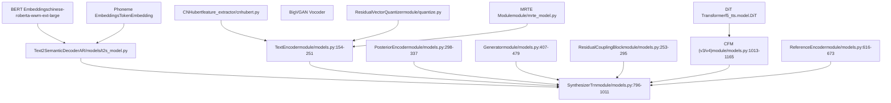
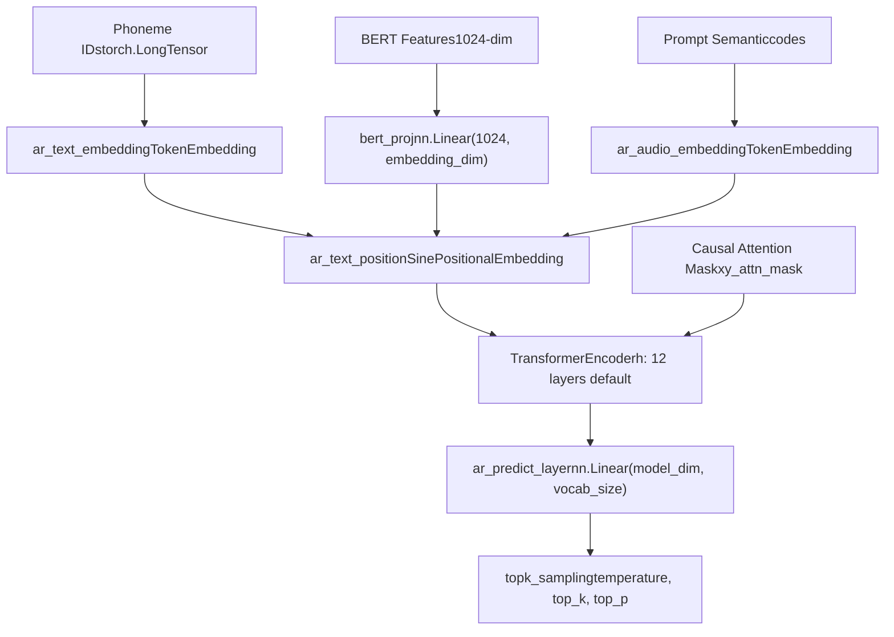
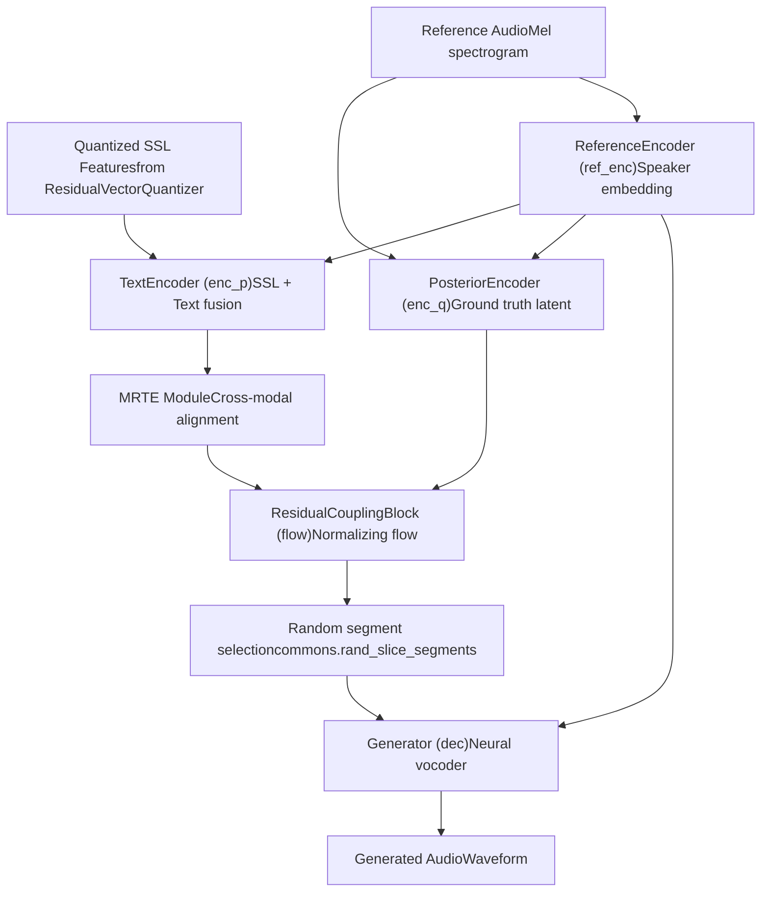
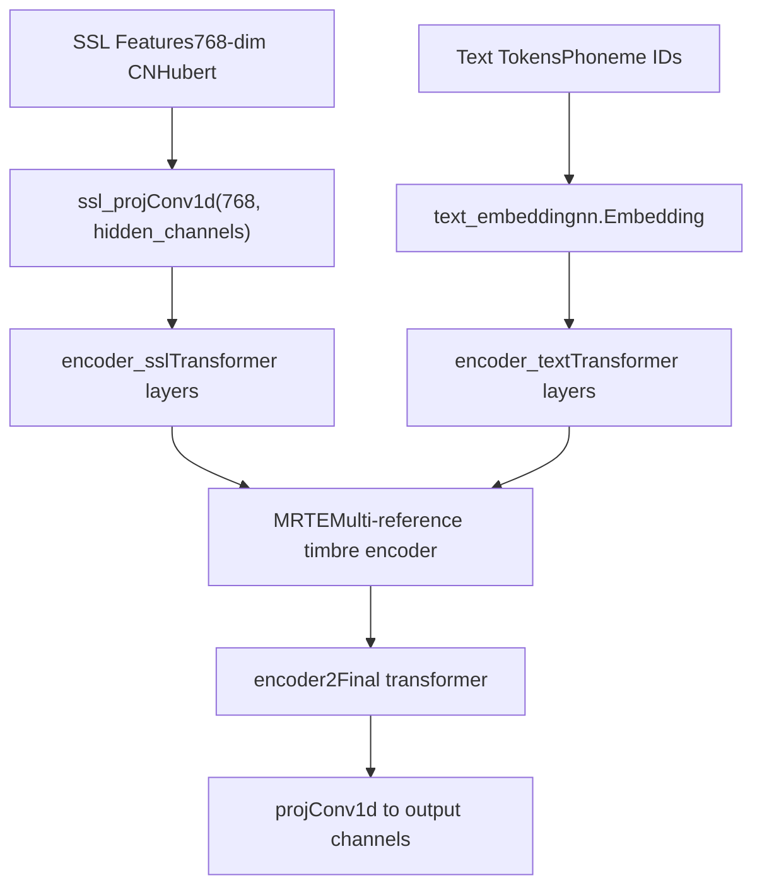
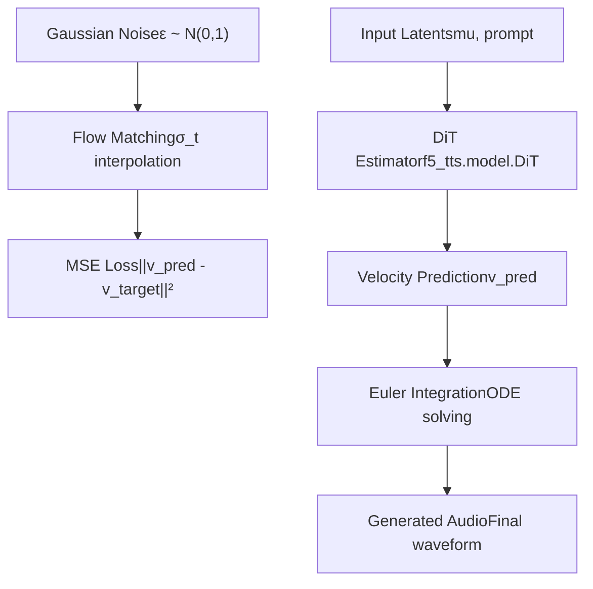
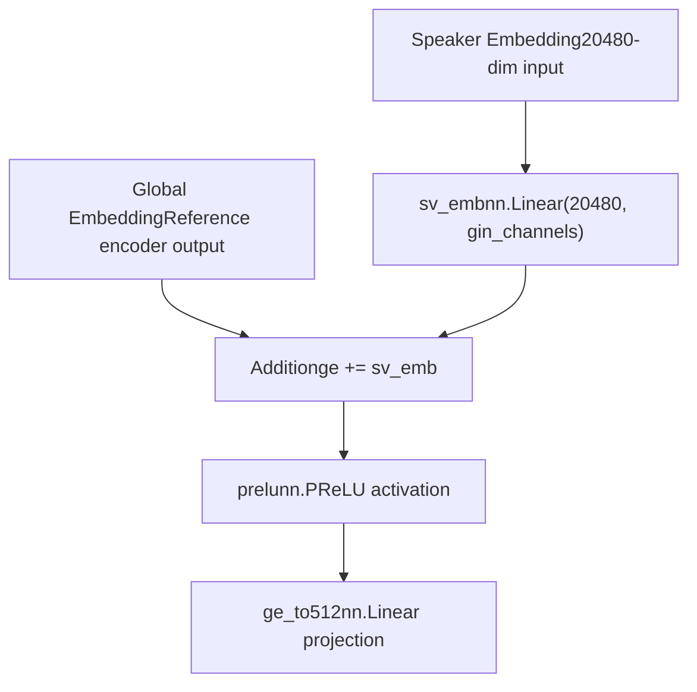
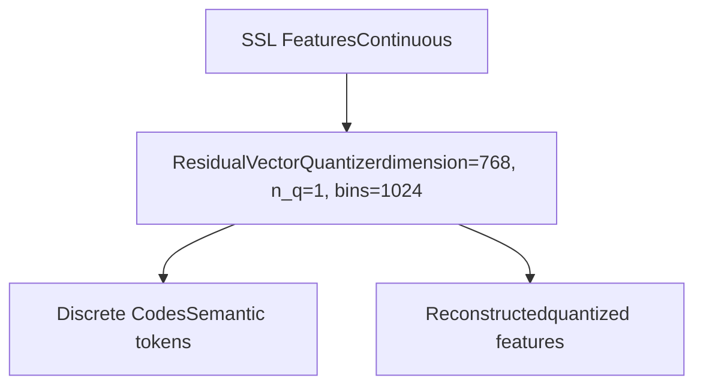
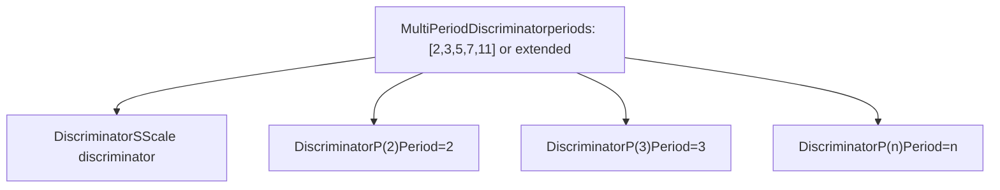

# Core Models

Relevant source files

-   [.gitignore](https://github.com/RVC-Boss/GPT-SoVITS/blob/c767f0b8/.gitignore)
-   [GPT\_SoVITS/AR/models/t2s\_model.py](https://github.com/RVC-Boss/GPT-SoVITS/blob/c767f0b8/GPT_SoVITS/AR/models/t2s_model.py)
-   [GPT\_SoVITS/AR/models/utils.py](https://github.com/RVC-Boss/GPT-SoVITS/blob/c767f0b8/GPT_SoVITS/AR/models/utils.py)
-   [GPT\_SoVITS/TTS\_infer\_pack/TTS.py](https://github.com/RVC-Boss/GPT-SoVITS/blob/c767f0b8/GPT_SoVITS/TTS_infer_pack/TTS.py)
-   [GPT\_SoVITS/configs/tts\_infer.yaml](https://github.com/RVC-Boss/GPT-SoVITS/blob/c767f0b8/GPT_SoVITS/configs/tts_infer.yaml)
-   [GPT\_SoVITS/module/data\_utils.py](https://github.com/RVC-Boss/GPT-SoVITS/blob/c767f0b8/GPT_SoVITS/module/data_utils.py)
-   [GPT\_SoVITS/module/mel\_processing.py](https://github.com/RVC-Boss/GPT-SoVITS/blob/c767f0b8/GPT_SoVITS/module/mel_processing.py)
-   [GPT\_SoVITS/module/models.py](https://github.com/RVC-Boss/GPT-SoVITS/blob/c767f0b8/GPT_SoVITS/module/models.py)
-   [GPT\_SoVITS/onnx\_export.py](https://github.com/RVC-Boss/GPT-SoVITS/blob/c767f0b8/GPT_SoVITS/onnx_export.py)
-   [api\_v2.py](https://github.com/RVC-Boss/GPT-SoVITS/blob/c767f0b8/api_v2.py)

This page documents the neural network architectures that form the foundation of GPT-SoVITS, including the Text2Semantic models (GPT) and synthesizer models (SoVITS). For information about the complete training pipeline, see [Training Pipeline](/RVC-Boss/GPT-SoVITS/2.3-training-pipeline). For details about inference orchestration, see [Inference Pipeline](/RVC-Boss/GPT-SoVITS/2.4-inference-pipeline).

## Architecture Overview

GPT-SoVITS employs a two-stage neural architecture consisting of autoregressive text-to-semantic conversion followed by semantic-to-audio synthesis. The system supports multiple model versions with different capabilities and architectural improvements.

### Core Model Components

**Sources:** [GPT\_SoVITS/module/models.py796-1011](https://github.com/RVC-Boss/GPT-SoVITS/blob/c767f0b8/GPT_SoVITS/module/models.py#L796-L1011) [GPT\_SoVITS/AR/models/t2s\_model.py260-582](https://github.com/RVC-Boss/GPT-SoVITS/blob/c767f0b8/GPT_SoVITS/AR/models/t2s_model.py#L260-L582)

## Text2Semantic Models

The Text2Semantic component converts phoneme sequences and BERT features into semantic tokens using a GPT-style autoregressive transformer.

### Text2SemanticDecoder Architecture

**Sources:** [GPT\_SoVITS/AR/models/t2s\_model.py260-582](https://github.com/RVC-Boss/GPT-SoVITS/blob/c767f0b8/GPT_SoVITS/AR/models/t2s_model.py#L260-L582) [GPT\_SoVITS/AR/models/t2s\_model.py408-511](https://github.com/RVC-Boss/GPT-SoVITS/blob/c767f0b8/GPT_SoVITS/AR/models/t2s_model.py#L408-L511)

### Model Configuration

| Parameter | Default Value | Description |
| --- | --- | --- |
| `embedding_dim` | 512 | Token embedding dimension |
| `hidden_dim` | 512 | Transformer hidden dimension |
| `num_head` | 8 | Number of attention heads |
| `num_layers` | 12 | Number of transformer layers |
| `vocab_size` | 1025 | Semantic token vocabulary size |
| `phoneme_vocab_size` | 512 | Phoneme vocabulary size |
| `EOS` | 1024 | End-of-sequence token |

**Sources:** [GPT\_SoVITS/AR/models/t2s\_model.py24-34](https://github.com/RVC-Boss/GPT-SoVITS/blob/c767f0b8/GPT_SoVITS/AR/models/t2s_model.py#L24-L34)

## Synthesizer Models

The `SynthesizerTrn` class implements the core synthesis model that converts semantic tokens to audio using a VITS-based architecture with various enhancements.

### SynthesizerTrn Components

**Sources:** [GPT\_SoVITS/module/models.py796-938](https://github.com/RVC-Boss/GPT-SoVITS/blob/c767f0b8/GPT_SoVITS/module/models.py#L796-L938) [GPT\_SoVITS/module/models.py940-1011](https://github.com/RVC-Boss/GPT-SoVITS/blob/c767f0b8/GPT_SoVITS/module/models.py#L940-L1011)

### TextEncoder Architecture

The `TextEncoder` processes SSL features and phoneme sequences with cross-modal alignment:

**Sources:** [GPT\_SoVITS/module/models.py154-251](https://github.com/RVC-Boss/GPT-SoVITS/blob/c767f0b8/GPT_SoVITS/module/models.py#L154-L251)

## Model Versions and Variants

GPT-SoVITS supports multiple model versions with different capabilities and architectural improvements.

### Version Comparison

| Version | Architecture | Key Features |
| --- | --- | --- |
| v1 | Standard VITS | Basic synthesis with 322 symbols |
| v2 | Enhanced VITS | Improved with 347 symbols |
| v2Pro/v2ProPlus | Speaker-enhanced | Additional speaker verification embeddings |
| v3 | CFM + DiT | Conditional Flow Matching with DiT |
| v4 | Advanced CFM | Enhanced flow matching architecture |

**Sources:** [GPT\_SoVITS/module/models.py590](https://github.com/RVC-Boss/GPT-SoVITS/blob/c767f0b8/GPT_SoVITS/module/models.py#L590-L590) [GPT\_SoVITS/module/models.py895-901](https://github.com/RVC-Boss/GPT-SoVITS/blob/c767f0b8/GPT_SoVITS/module/models.py#L895-L901)

### Conditional Flow Matching (v3/v4)

**Sources:** [GPT\_SoVITS/module/models.py1013-1165](https://github.com/RVC-Boss/GPT-SoVITS/blob/c767f0b8/GPT_SoVITS/module/models.py#L1013-L1165)

### v2Pro Speaker Enhancement

The v2Pro variants include additional speaker verification embeddings:

**Sources:** [GPT\_SoVITS/module/models.py895-911](https://github.com/RVC-Boss/GPT-SoVITS/blob/c767f0b8/GPT_SoVITS/module/models.py#L895-L911)

## Supporting Components

### Vector Quantization

The system uses residual vector quantization for SSL feature discretization:

**Sources:** [GPT\_SoVITS/module/models.py892-1011](https://github.com/RVC-Boss/GPT-SoVITS/blob/c767f0b8/GPT_SoVITS/module/models.py#L892-L1011)

### Multi-Scale Discriminator

Training uses a multi-period discriminator for adversarial learning:

**Sources:** [GPT\_SoVITS/module/models.py590-613](https://github.com/RVC-Boss/GPT-SoVITS/blob/c767f0b8/GPT_SoVITS/module/models.py#L590-L613) [GPT\_SoVITS/module/models.py481-587](https://github.com/RVC-Boss/GPT-SoVITS/blob/c767f0b8/GPT_SoVITS/module/models.py#L481-L587)
