# Text Processing Pipeline

Relevant source files

-   [.gitignore](https://github.com/RVC-Boss/GPT-SoVITS/blob/c767f0b8/.gitignore)
-   [GPT\_SoVITS/AR/models/t2s\_model.py](https://github.com/RVC-Boss/GPT-SoVITS/blob/c767f0b8/GPT_SoVITS/AR/models/t2s_model.py)
-   [GPT\_SoVITS/AR/models/utils.py](https://github.com/RVC-Boss/GPT-SoVITS/blob/c767f0b8/GPT_SoVITS/AR/models/utils.py)
-   [GPT\_SoVITS/TTS\_infer\_pack/TTS.py](https://github.com/RVC-Boss/GPT-SoVITS/blob/c767f0b8/GPT_SoVITS/TTS_infer_pack/TTS.py)
-   [GPT\_SoVITS/TTS\_infer\_pack/TextPreprocessor.py](https://github.com/RVC-Boss/GPT-SoVITS/blob/c767f0b8/GPT_SoVITS/TTS_infer_pack/TextPreprocessor.py)
-   [GPT\_SoVITS/configs/tts\_infer.yaml](https://github.com/RVC-Boss/GPT-SoVITS/blob/c767f0b8/GPT_SoVITS/configs/tts_infer.yaml)
-   [GPT\_SoVITS/text/chinese.py](https://github.com/RVC-Boss/GPT-SoVITS/blob/c767f0b8/GPT_SoVITS/text/chinese.py)
-   [GPT\_SoVITS/text/chinese2.py](https://github.com/RVC-Boss/GPT-SoVITS/blob/c767f0b8/GPT_SoVITS/text/chinese2.py)
-   [GPT\_SoVITS/text/zh\_normalization/num.py](https://github.com/RVC-Boss/GPT-SoVITS/blob/c767f0b8/GPT_SoVITS/text/zh_normalization/num.py)
-   [GPT\_SoVITS/text/zh\_normalization/text\_normlization.py](https://github.com/RVC-Boss/GPT-SoVITS/blob/c767f0b8/GPT_SoVITS/text/zh_normalization/text_normlization.py)
-   [api\_v2.py](https://github.com/RVC-Boss/GPT-SoVITS/blob/c767f0b8/api_v2.py)

This document covers the multi-language text processing pipeline in GPT-SoVITS, which converts raw text input into phonetic representations suitable for TTS synthesis. The pipeline handles language detection, text normalization, and grapheme-to-phoneme (G2P) conversion for Chinese, Japanese, Korean, English, and Cantonese.

For information about the overall TTS inference process, see [Inference Pipeline](/RVC-Boss/GPT-SoVITS/2.4-inference-pipeline). For training data preparation workflows, see [Data Preparation](/RVC-Boss/GPT-SoVITS/5-data-preparation).

## Overview

The text processing pipeline transforms raw multi-language text into phonetic sequences and BERT features consumed by the TTS models. The main orchestrator is the `TextPreprocessor` class in [GPT\_SoVITS/TTS\_infer\_pack/TextPreprocessor.py](https://github.com/RVC-Boss/GPT-SoVITS/blob/c767f0b8/GPT_SoVITS/TTS_infer_pack/TextPreprocessor.py) which coordinates language detection, normalization, G2P conversion, and BERT feature extraction.

The pipeline consists of five key stages:

1.  **Text Segmentation** - `pre_seg_text()` splits input by punctuation and length constraints
2.  **Language Detection** - `LangSegmenter.getTexts()` identifies language segments
3.  **Text Normalization** - Language-specific `text_normalize()` functions convert numbers, dates, symbols
4.  **G2P Conversion** - Language-specific `g2p()` generates phoneme sequences with tone markers
5.  **BERT Feature Extraction** - `get_bert_feature()` produces contextual embeddings for Chinese text

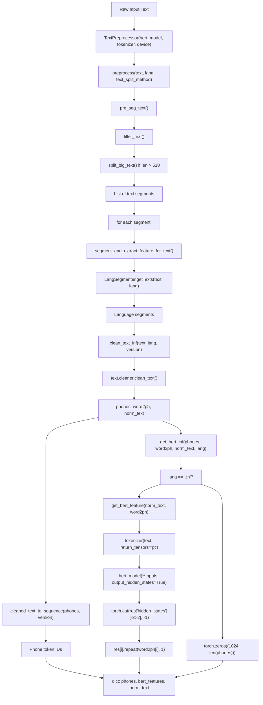
**TextPreprocessor Pipeline with Code Function Names**

Sources: [GPT\_SoVITS/TTS\_infer\_pack/TextPreprocessor.py52-75](https://github.com/RVC-Boss/GPT-SoVITS/blob/c767f0b8/GPT_SoVITS/TTS_infer_pack/TextPreprocessor.py#L52-L75) [GPT\_SoVITS/TTS\_infer\_pack/TextPreprocessor.py117-189](https://github.com/RVC-Boss/GPT-SoVITS/blob/c767f0b8/GPT_SoVITS/TTS_infer_pack/TextPreprocessor.py#L117-L189) [GPT\_SoVITS/TTS\_infer\_pack/TextPreprocessor.py191-222](https://github.com/RVC-Boss/GPT-SoVITS/blob/c767f0b8/GPT_SoVITS/TTS_infer_pack/TextPreprocessor.py#L191-L222)

## Language Detection and Segmentation

The `LangSegmenter` class automatically detects and segments mixed-language text into homogeneous language blocks using the `fast_langdetect` library and custom heuristics.

### LangSegmenter Architecture

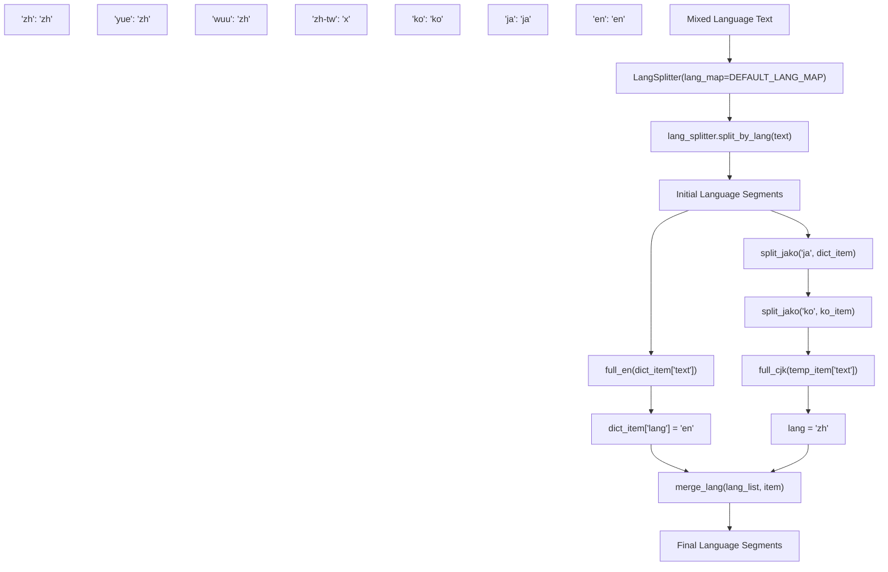
**Language Detection and Segmentation Implementation Details** </old\_str>

<old\_str>

### Normalization Process

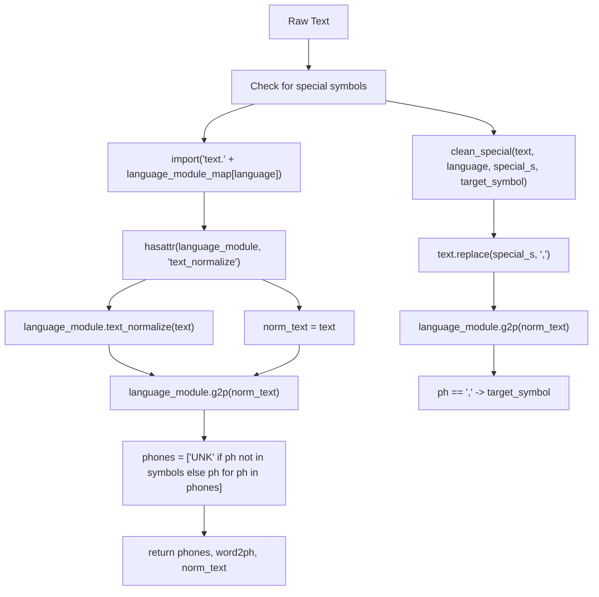
**Text Cleaning and Normalization Implementation Flow** </old\_str> <new\_str> The segmentation process handles several edge cases through specific utility functions:

| Function | Purpose | Implementation Details |
| --- | --- | --- |
| `full_en()` | Detect pure English text | `r'^(?=.*[A-Za-z])[A-Za-z0-9\s\u0020-\u007E\u2000-\u206F\u3000-\u303F\uFF00-\uFFEF]+$'` |
| `full_cjk()` | Extract CJK characters | Unicode ranges: `0x4E00-0x9FFF`, `0x3400-0x4DB5`, etc. |
| `split_jako()` | Separate Japanese/Korean | Pattern: `r"([\u3041-\u3096\u3099...]+...)"` for Japanese |
| `merge_lang()` | Consolidate adjacent segments | Check `lang_list[-1]['lang'] == item['lang']` |

### LangSegmenter Class Structure

**LangSegmenter Class and Dependency Structure**

Sources: [GPT\_SoVITS/text/LangSegmenter/langsegmenter.py17-46](https://github.com/RVC-Boss/GPT-SoVITS/blob/c767f0b8/GPT_SoVITS/text/LangSegmenter/langsegmenter.py#L17-L46) [GPT\_SoVITS/text/LangSegmenter/langsegmenter.py77-213](https://github.com/RVC-Boss/GPT-SoVITS/blob/c767f0b8/GPT_SoVITS/text/LangSegmenter/langsegmenter.py#L77-L213)

The segmentation process handles several edge cases:

| Function | Purpose | Implementation |
| --- | --- | --- |
| `full_en()` | Detect pure English text | Regex pattern matching ASCII + punctuation |
| `full_cjk()` | Extract CJK characters | Unicode range detection for Chinese/Japanese/Korean |
| `split_jako()` | Separate Japanese/Korean | Language-specific character pattern matching |
| `merge_lang()` | Consolidate adjacent segments | Merge segments with same language tag |

Sources: [GPT\_SoVITS/text/LangSegmenter/langsegmenter.py17-75](https://github.com/RVC-Boss/GPT-SoVITS/blob/c767f0b8/GPT_SoVITS/text/LangSegmenter/langsegmenter.py#L17-L75) [GPT\_SoVITS/text/LangSegmenter/langsegmenter.py91-167](https://github.com/RVC-Boss/GPT-SoVITS/blob/c767f0b8/GPT_SoVITS/text/LangSegmenter/langsegmenter.py#L91-L167)

## Text Normalization

Text normalization is handled by the `clean_text()` function in the cleaner module, which applies language-specific preprocessing and handles special symbols.

### Chinese Text Normalization (zh\_normalization)

Chinese text normalization converts numbers, dates, and symbols to speakable text using the `TextNormalizer` class:

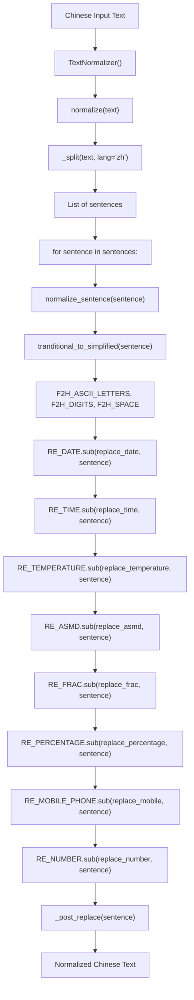
**Chinese Text Normalization Pipeline in zh\_normalization**

Key normalization patterns handled:

-   **Dates**: `2023年12月25日` → `二零二三年十二月二十五日`
-   **Numbers**: `3.14` → `三点一四`, `42` → `四十二`
-   **Fractions**: `1/2` → `二分之一`
-   **Percentages**: `85%` → `百分之八十五`
-   **Phone Numbers**: `13812345678` → `一三八 一二三四 五六七八` (grouped)
-   **Math**: `2+3=5` → `二加三等于五`

Sources: [GPT\_SoVITS/text/zh\_normalization/text\_normlization.py61-176](https://github.com/RVC-Boss/GPT-SoVITS/blob/c767f0b8/GPT_SoVITS/text/zh_normalization/text_normlization.py#L61-L176) [GPT\_SoVITS/text/zh\_normalization/num.py317-340](https://github.com/RVC-Boss/GPT-SoVITS/blob/c767f0b8/GPT_SoVITS/text/zh_normalization/num.py#L317-L340)

### Chinese G2P Processing (chinese2.py)

The Chinese v2 module uses G2PW for polyphone disambiguation and tone sandhi processing:

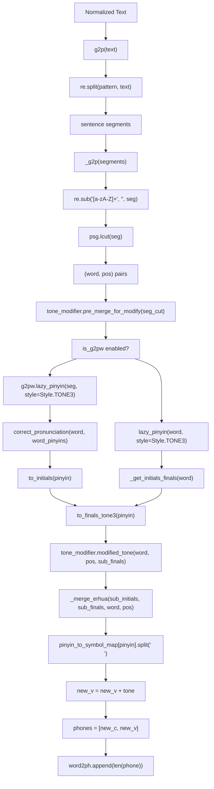
**Chinese G2P Pipeline with Tone Processing**

Key components:

-   **G2PW Model**: BERT-based polyphone disambiguation at [GPT\_SoVITS/text/G2PWModel](https://github.com/RVC-Boss/GPT-SoVITS/blob/c767f0b8/GPT_SoVITS/text/G2PWModel)
-   **Tone Sandhi**: `ToneSandhi` class applies tone change rules (e.g., 不 + 4th tone → 2nd tone)
-   **Erhua Handling**: `_merge_erhua()` merges 儿 suffix: `花儿` → `h ua r1`
-   **Symbol Mapping**: `pinyin_to_symbol_map` from [GPT\_SoVITS/text/opencpop-strict.txt](https://github.com/RVC-Boss/GPT-SoVITS/blob/c767f0b8/GPT_SoVITS/text/opencpop-strict.txt)

Sources: [GPT\_SoVITS/text/chinese2.py73-295](https://github.com/RVC-Boss/GPT-SoVITS/blob/c767f0b8/GPT_SoVITS/text/chinese2.py#L73-L295) [GPT\_SoVITS/text/chinese2.py142-178](https://github.com/RVC-Boss/GPT-SoVITS/blob/c767f0b8/GPT_SoVITS/text/chinese2.py#L142-L178) [GPT\_SoVITS/text/g2pw/\_\_init\_\_.py85-120](https://github.com/RVC-Boss/GPT-SoVITS/blob/c767f0b8/GPT_SoVITS/text/g2pw/__init__.py#L85-L120)

### Text Segmentation and Preprocessing

Before language-specific processing, `TextPreprocessor.pre_seg_text()` performs critical text preparation:

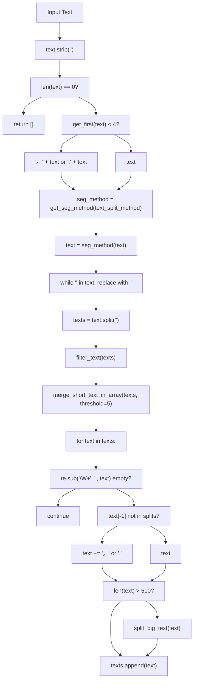
**Text Segmentation and Validation Process in TextPreprocessor**

Key segmentation parameters:

-   **Threshold**: Minimum length 5 characters per segment (prevents over-fragmentation)
-   **Max Length**: 510 characters (BERT input limit minus special tokens)
-   **Punctuation Handling**: Ensures all segments end with punctuation for proper prosody

Sources: [GPT\_SoVITS/TTS\_infer\_pack/TextPreprocessor.py77-115](https://github.com/RVC-Boss/GPT-SoVITS/blob/c767f0b8/GPT_SoVITS/TTS_infer_pack/TextPreprocessor.py#L77-L115) [GPT\_SoVITS/TTS\_infer\_pack/text\_segmentation\_method.py90-107](https://github.com/RVC-Boss/GPT-SoVITS/blob/c767f0b8/GPT_SoVITS/TTS_infer_pack/text_segmentation_method.py#L90-L107)

### Language Module Mapping and Clean Text Flow

The `clean_text()` function in [GPT\_SoVITS/text/cleaner.py](https://github.com/RVC-Boss/GPT-SoVITS/blob/c767f0b8/GPT_SoVITS/text/cleaner.py) dynamically imports language modules:

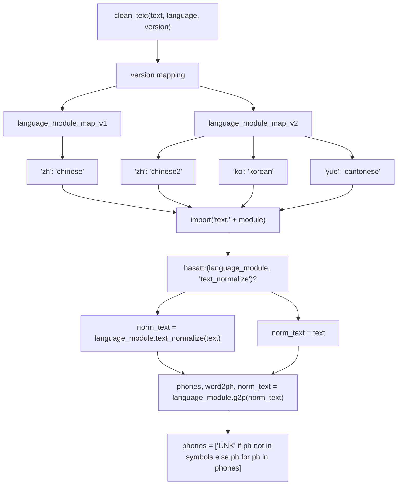
**clean\_text() Language Module Resolution**

| Language | v1 Module | v2 Module | text\_normalize | Special Features |
| --- | --- | --- | --- | --- |
| Chinese (zh) | `chinese` | `chinese2` | ✓ | G2PW polyphone, tone sandhi, erhua |
| Japanese (ja) | `japanese` | `japanese` | ✓ | OpenJTalk, user dictionary |
| English (en) | `english` | `english` | ✗ | CMU Dict, ARPA phones |
| Korean (ko) | N/A | `korean` | ✓ | G2pK, Hangul decomposition |
| Cantonese (yue) | N/A | `cantonese` | ✓ | Jyutping, Y-prefix system |

Sources: [GPT\_SoVITS/text/cleaner.py21-55](https://github.com/RVC-Boss/GPT-SoVITS/blob/c767f0b8/GPT_SoVITS/text/cleaner.py#L21-L55) [GPT\_SoVITS/text/cleaner.py58-82](https://github.com/RVC-Boss/GPT-SoVITS/blob/c767f0b8/GPT_SoVITS/text/cleaner.py#L58-L82)

## Language-Specific G2P Processing

Each language module implements specialized grapheme-to-phoneme conversion with language-specific features.

### Japanese Processing (japanese.py)

Japanese processing uses OpenJTalk for morphological analysis and prosodic feature extraction. The module handles user dictionary loading and Windows path compatibility.

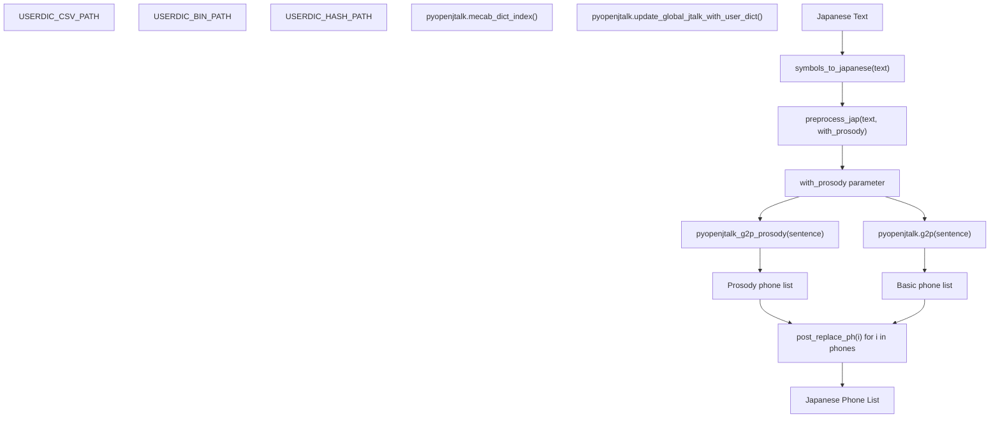
**Japanese G2P Processing with OpenJTalk Functions**

### Japanese User Dictionary System

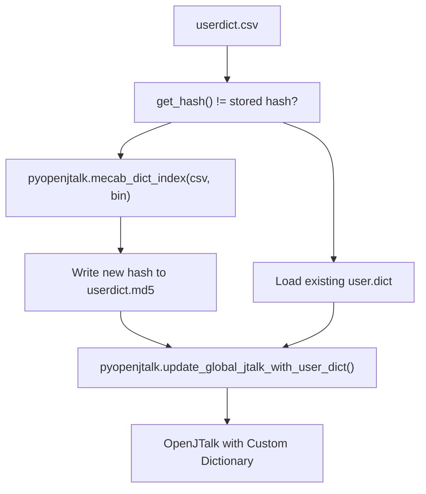
**Japanese User Dictionary Loading Process**

Key implementation details:

-   **User Dictionary**: Automatic loading from `ja_userdic/userdict.csv` with MD5 hash verification
-   **Windows Compatibility**: Special handling for non-ASCII paths using TEMP directory
-   **Prosody Analysis**: `pyopenjtalk_g2p_prosody()` extracts pitch accent patterns with `[`, `]`, `#` symbols
-   **Symbol Replacement**: `post_replace_ph()` normalizes punctuation and special characters

Sources: [GPT\_SoVITS/text/japanese.py50-77](https://github.com/RVC-Boss/GPT-SoVITS/blob/c767f0b8/GPT_SoVITS/text/japanese.py#L50-L77) [GPT\_SoVITS/text/japanese.py151-171](https://github.com/RVC-Boss/GPT-SoVITS/blob/c767f0b8/GPT_SoVITS/text/japanese.py#L151-L171) [GPT\_SoVITS/text/japanese.py267-271](https://github.com/RVC-Boss/GPT-SoVITS/blob/c767f0b8/GPT_SoVITS/text/japanese.py#L267-L271)

### Korean Processing (korean.py)

Korean processing handles Hangul phonetic transformations and number normalization using the G2pK library with Windows compatibility fixes.

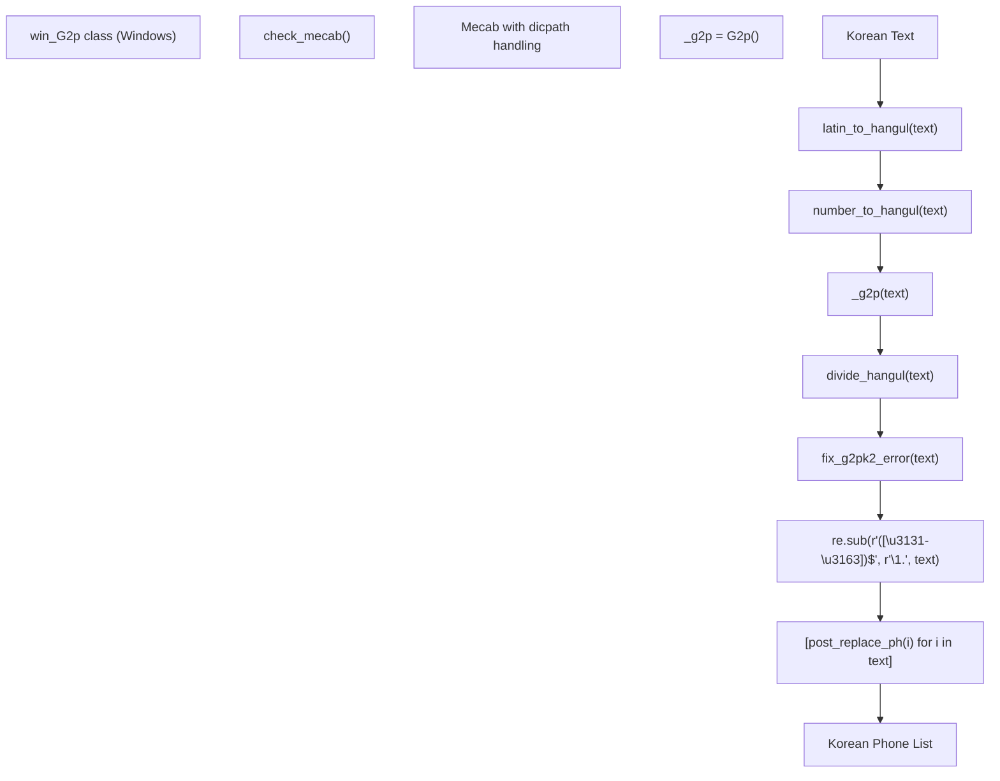
**Korean G2P Processing with G2pK Functions**

### Korean Number Processing

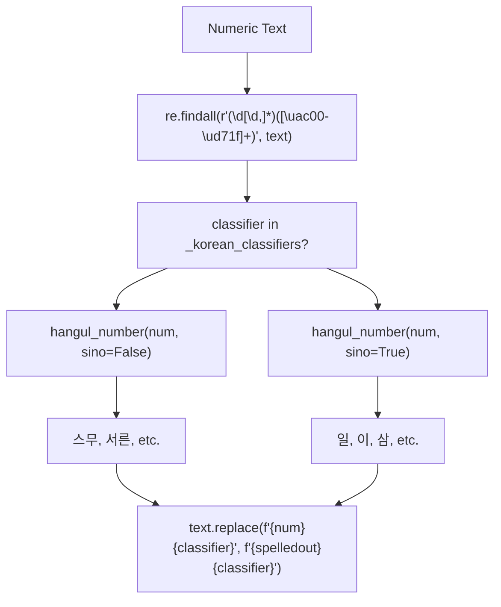
**Korean Number-to-Hangul Conversion Logic**

Key implementation details:

-   **G2pK Integration**: Uses `G2p()` class with custom Windows path handling for eunjeon MeCab
-   **Hangul Decomposition**: `j2hcj(h2j(text))` from jamo library for character decomposition
-   **Number Systems**: Distinguishes between pure Korean (한국어) and Sino-Korean (한자어) numbers
-   **Error Correction**: `fix_g2pk2_error()` handles specific G2pK output issues with ㅇㅡㄹ/ㄹㅡㄹ patterns
-   **IPA Conversion**: Maps complex IPA symbols to simplified representations

Sources: [GPT\_SoVITS/text/korean.py324-332](https://github.com/RVC-Boss/GPT-SoVITS/blob/c767f0b8/GPT_SoVITS/text/korean.py#L324-L332) [GPT\_SoVITS/text/korean.py183-277](https://github.com/RVC-Boss/GPT-SoVITS/blob/c767f0b8/GPT_SoVITS/text/korean.py#L183-L277) [GPT\_SoVITS/text/korean.py155-167](https://github.com/RVC-Boss/GPT-SoVITS/blob/c767f0b8/GPT_SoVITS/text/korean.py#L155-L167)

### Cantonese Processing (cantonese.py)

Cantonese processing uses Jyutping romanization with ToJyutping library and applies Y-prefix to distinguish from Mandarin phones.

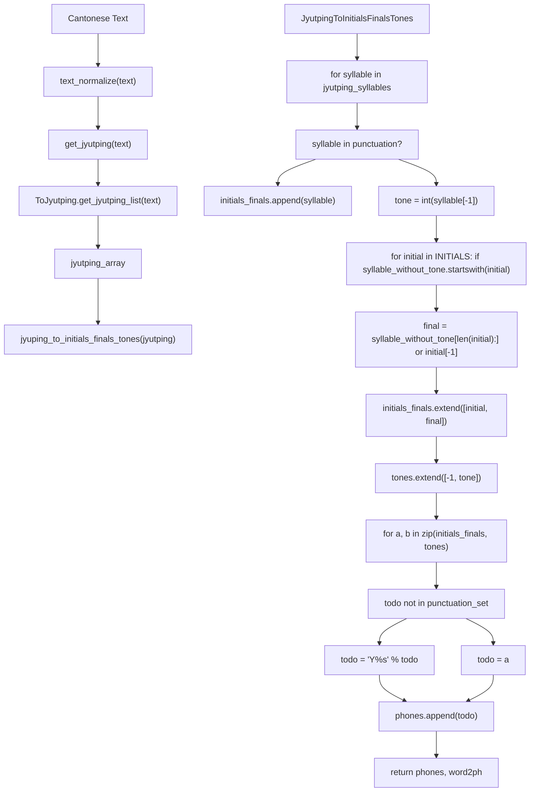
**Cantonese G2P Processing with Jyutping Functions**

### Cantonese INITIALS Constants

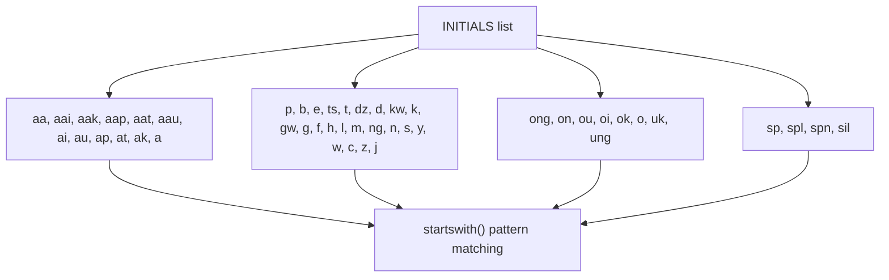
**Cantonese INITIALS Pattern Matching System**

Key implementation details:

-   **Jyutping Parsing**: `ToJyutping.get_jyutping_list()` returns (word, syllable) tuples with tone numbers
-   **Initial-Final Split**: Pattern matching against 56 predefined INITIALS including special cases
-   **Tone Processing**: Six-tone system (1-6) with -1 for consonants and 0 for punctuation
-   **Y-Prefix System**: All non-punctuation phones get "Y" prefix to distinguish from Mandarin
-   **Text Normalization**: Uses `TextNormalizer` from zh\_normalization module

Sources: [GPT\_SoVITS/text/cantonese.py203-212](https://github.com/RVC-Boss/GPT-SoVITS/blob/c767f0b8/GPT_SoVITS/text/cantonese.py#L203-L212) [GPT\_SoVITS/text/cantonese.py118-173](https://github.com/RVC-Boss/GPT-SoVITS/blob/c767f0b8/GPT_SoVITS/text/cantonese.py#L118-L173) [GPT\_SoVITS/text/cantonese.py12-57](https://github.com/RVC-Boss/GPT-SoVITS/blob/c767f0b8/GPT_SoVITS/text/cantonese.py#L12-L57)

### BERT Feature Extraction for Chinese

Chinese text receives contextual BERT embeddings to improve prosody and pronunciation:

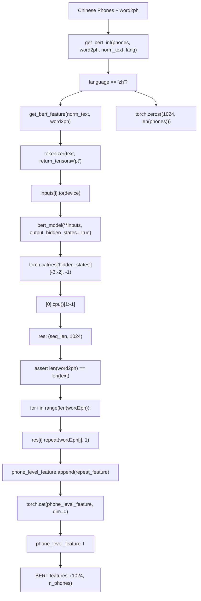
**BERT Feature Extraction Process in TextPreprocessor**

Implementation details:

-   **Model**: `chinese-roberta-wwm-ext-large` from HuggingFace
-   **Layer Selection**: Concatenates hidden states from layers -3 and -2 (total 1024 dims)
-   **Phone-Level Alignment**: Each character's BERT vector is repeated `word2ph[i]` times
-   **Non-Chinese Handling**: Zero tensors for languages without BERT support

Sources: [GPT\_SoVITS/TTS\_infer\_pack/TextPreprocessor.py191-222](https://github.com/RVC-Boss/GPT-SoVITS/blob/c767f0b8/GPT_SoVITS/TTS_infer_pack/TextPreprocessor.py#L191-L222) [GPT\_SoVITS/TTS\_infer\_pack/TTS.py484-491](https://github.com/RVC-Boss/GPT-SoVITS/blob/c767f0b8/GPT_SoVITS/TTS_infer_pack/TTS.py#L484-L491)

## Symbol System and Token Conversion

The pipeline converts phonetic representations to token sequences using versioned symbol systems.

### Symbol System Architecture

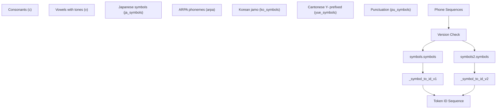
**Symbol System and Token Conversion**

### Symbol Set Comparison

| Symbol Type | v1 Support | v2 Support | Count (v2) |
| --- | --- | --- | --- |
| Chinese consonants | ✓ | ✓ | 25 |
| Chinese vowels | ✓ | ✓ | 195 (5 tones × 39 finals) |
| Japanese phonemes | ✓ | ✓ | 39 |
| English ARPA | ✓ | ✓ | 71 |
| Korean jamo | ✗ | ✓ | 28 |
| Cantonese Jyutping | ✗ | ✓ | 379 |
| Punctuation | ✓ | ✓ | 10 |

Sources: [GPT\_SoVITS/text/\_\_init\_\_.py14-28](https://github.com/RVC-Boss/GPT-SoVITS/blob/c767f0b8/GPT_SoVITS/text/__init__.py#L14-L28) [GPT\_SoVITS/text/symbols2.py782-788](https://github.com/RVC-Boss/GPT-SoVITS/blob/c767f0b8/GPT_SoVITS/text/symbols2.py#L782-L788) [GPT\_SoVITS/text/symbols.py396-397](https://github.com/RVC-Boss/GPT-SoVITS/blob/c767f0b8/GPT_SoVITS/text/symbols.py#L396-L397)

## Error Handling and Edge Cases

The text processing pipeline includes robust error handling for common issues through specific validation and fallback mechanisms.

### Common Processing Issues and Solutions

| Issue | Detection Method | Resolution Function | Implementation |
| --- | --- | --- | --- |
| Unknown phonemes | Symbol validation | `clean_text()` line 54 | `phones = ["UNK" if ph not in symbols else ph for ph in phones]` |
| Short English sequences | Length check | `clean_text()` line 48-49 | `if len(phones) < 4: phones = [","] + phones` |
| Mixed encoding | Character filtering | Language-specific | `re.sub(r"[^\u4e00-\u9fa5" + "".join(punctuation) + r"]+", "", text)` |
| Punctuation clustering | Regex replacement | `replace_consecutive_punctuation()` | `re.sub(pattern, r"\1", text)` |
| Special symbols | Pattern matching | `clean_special()` | Replace `special_s` with `target_symbol` |

### Word-to-Phone Alignment Implementation

The `word2ph` output provides character-to-phone alignment crucial for TTS synthesis, implemented differently by each language module:

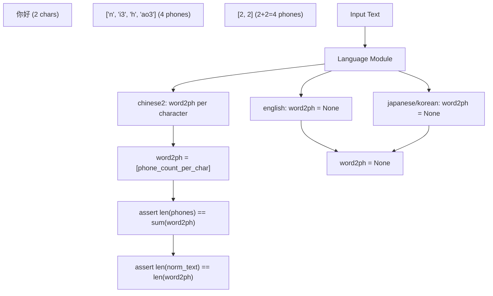
**Language-Specific Word-to-Phone Alignment**

### Error Handling in Language Modules

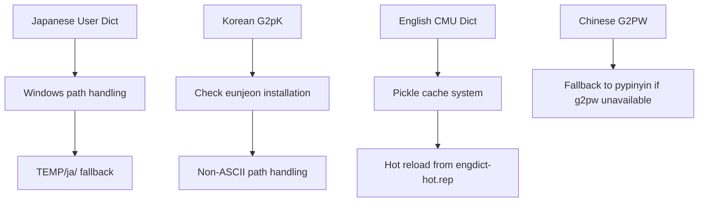
**Language-Specific Error Handling Mechanisms**

Key error handling implementations:

-   **Japanese**: Windows path compatibility with automatic TEMP directory fallback for non-ASCII paths
-   **Korean**: `eunjeon` dependency checking and MeCab dictionary path handling
-   **English**: Dictionary caching system with hot-reload capability for custom pronunciations
-   **Chinese**: Graceful fallback from G2PW to pypinyin when advanced models unavailable

Sources: [GPT\_SoVITS/text/cleaner.py42-55](https://github.com/RVC-Boss/GPT-SoVITS/blob/c767f0b8/GPT_SoVITS/text/cleaner.py#L42-L55) [GPT\_SoVITS/text/japanese.py11-77](https://github.com/RVC-Boss/GPT-SoVITS/blob/c767f0b8/GPT_SoVITS/text/japanese.py#L11-L77) [GPT\_SoVITS/text/korean.py12-56](https://github.com/RVC-Boss/GPT-SoVITS/blob/c767f0b8/GPT_SoVITS/text/korean.py#L12-L56) [GPT\_SoVITS/text/english.py210-220](https://github.com/RVC-Boss/GPT-SoVITS/blob/c767f0b8/GPT_SoVITS/text/english.py#L210-L220)

## Integration Points

The text processing pipeline integrates with other system components:

-   **TTS Inference**: Provides tokenized input sequences for GPT models
-   **Training Pipeline**: Generates phone sequences for dataset preparation
-   **API Endpoints**: Handles text preprocessing for REST API requests
-   **WebUI**: Powers real-time text processing in the user interface

For details on how processed text flows into model inference, see [Inference Pipeline](/RVC-Boss/GPT-SoVITS/2.4-inference-pipeline). For training data preparation using this pipeline, see [Feature Extraction](/RVC-Boss/GPT-SoVITS/5.3-feature-extraction-scripts).
