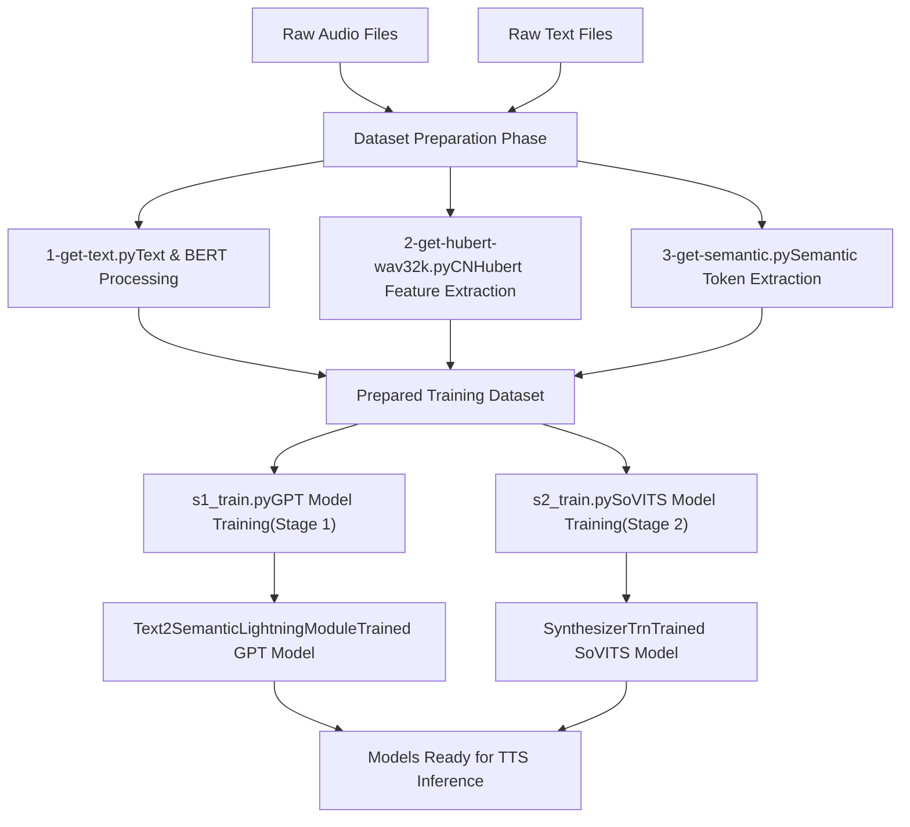
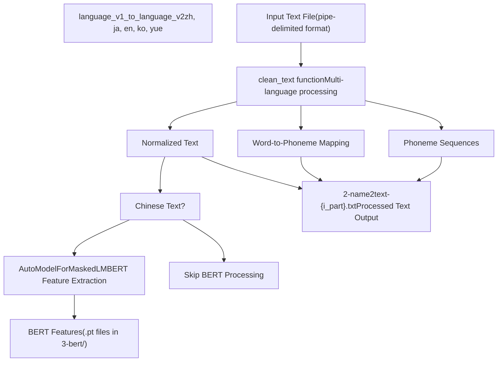
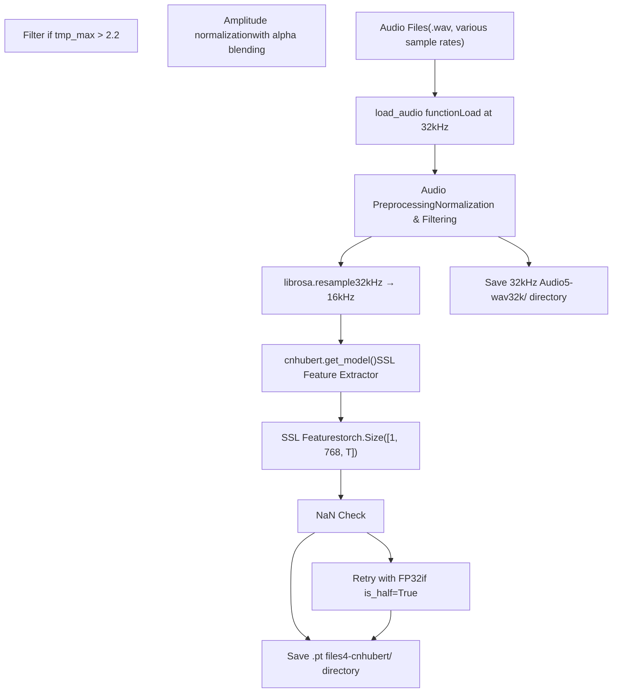
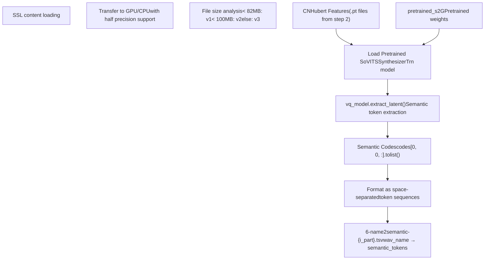
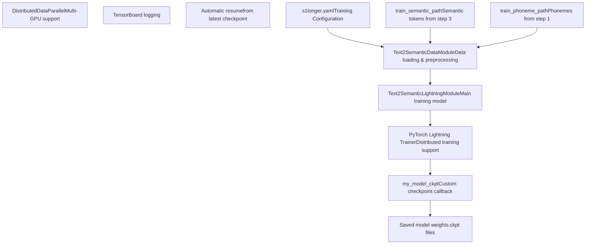
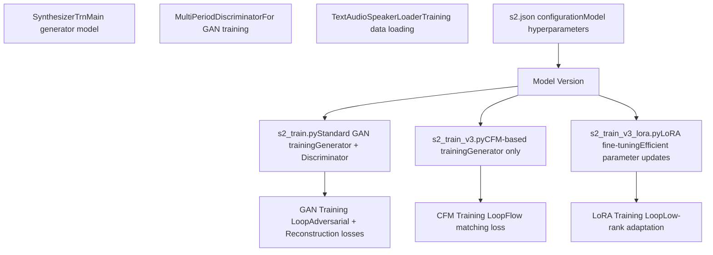
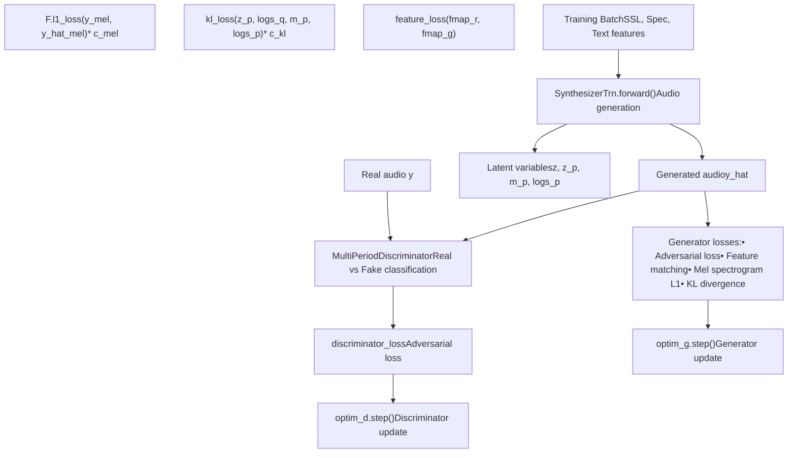
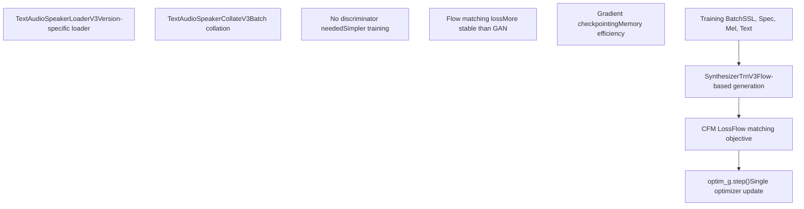
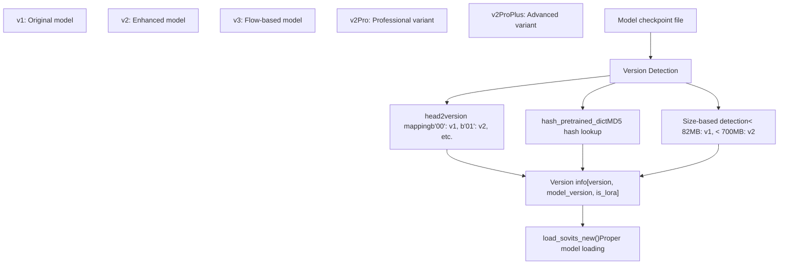
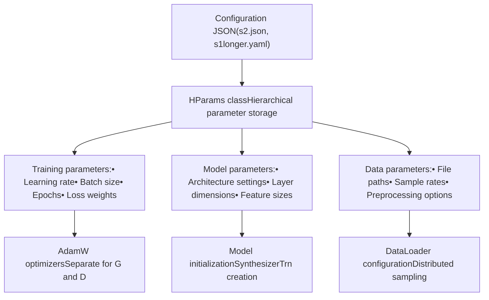

# Training Pipeline

Relevant source files

-   [GPT\_SoVITS/prepare\_datasets/1-get-text.py](https://github.com/RVC-Boss/GPT-SoVITS/blob/c767f0b8/GPT_SoVITS/prepare_datasets/1-get-text.py)
-   [GPT\_SoVITS/prepare\_datasets/2-get-hubert-wav32k.py](https://github.com/RVC-Boss/GPT-SoVITS/blob/c767f0b8/GPT_SoVITS/prepare_datasets/2-get-hubert-wav32k.py)
-   [GPT\_SoVITS/prepare\_datasets/3-get-semantic.py](https://github.com/RVC-Boss/GPT-SoVITS/blob/c767f0b8/GPT_SoVITS/prepare_datasets/3-get-semantic.py)
-   [GPT\_SoVITS/s1\_train.py](https://github.com/RVC-Boss/GPT-SoVITS/blob/c767f0b8/GPT_SoVITS/s1_train.py)
-   [api.py](https://github.com/RVC-Boss/GPT-SoVITS/blob/c767f0b8/api.py)
-   [config.py](https://github.com/RVC-Boss/GPT-SoVITS/blob/c767f0b8/config.py)
-   [webui.py](https://github.com/RVC-Boss/GPT-SoVITS/blob/c767f0b8/webui.py)

## Purpose and Scope

This document describes the complete training pipeline for GPT-SoVITS, covering data preparation workflows, model training procedures, and checkpoint management. The pipeline consists of three main phases: dataset preparation, GPT model training (Stage 1), and SoVITS model training (Stage 2).

For information about the inference process using trained models, see [Inference Pipeline](/RVC-Boss/GPT-SoVITS/2.4-inference-pipeline). For details about the underlying neural network architectures, see [Core Models](/RVC-Boss/GPT-SoVITS/2.1-core-model-architectures).

## Overview

The training pipeline transforms raw audio and text data into trained text-to-speech models through a structured multi-stage process:

Sources: [GPT\_SoVITS/prepare\_datasets/1-get-text.py1-144](https://github.com/RVC-Boss/GPT-SoVITS/blob/c767f0b8/GPT_SoVITS/prepare_datasets/1-get-text.py#L1-L144) [GPT\_SoVITS/prepare\_datasets/2-get-hubert-wav32k.py1-135](https://github.com/RVC-Boss/GPT-SoVITS/blob/c767f0b8/GPT_SoVITS/prepare_datasets/2-get-hubert-wav32k.py#L1-L135) [GPT\_SoVITS/prepare\_datasets/3-get-semantic.py1-119](https://github.com/RVC-Boss/GPT-SoVITS/blob/c767f0b8/GPT_SoVITS/prepare_datasets/3-get-semantic.py#L1-L119) [GPT\_SoVITS/s1\_train.py1-172](https://github.com/RVC-Boss/GPT-SoVITS/blob/c767f0b8/GPT_SoVITS/s1_train.py#L1-L172) [GPT\_SoVITS/s2\_train.py1-685](https://github.com/RVC-Boss/GPT-SoVITS/blob/c767f0b8/GPT_SoVITS/s2_train.py#L1-L685)

## Dataset Preparation Phase

The dataset preparation phase consists of three sequential scripts that extract different types of features from raw audio and text data.

### Text Processing and BERT Feature Extraction

The first step processes text data and extracts BERT features for Chinese text using `1-get-text.py`:

The script processes input files in the format: `wav_name|spk_name|language|text` and outputs phoneme sequences, word-to-phoneme mappings, and BERT features for Chinese text.

Sources: [GPT\_SoVITS/prepare\_datasets/1-get-text.py86-144](https://github.com/RVC-Boss/GPT-SoVITS/blob/c767f0b8/GPT_SoVITS/prepare_datasets/1-get-text.py#L86-L144) [GPT\_SoVITS/prepare\_datasets/1-get-text.py61-84](https://github.com/RVC-Boss/GPT-SoVITS/blob/c767f0b8/GPT_SoVITS/prepare_datasets/1-get-text.py#L61-L84) [GPT\_SoVITS/prepare\_datasets/1-get-text.py110-126](https://github.com/RVC-Boss/GPT-SoVITS/blob/c767f0b8/GPT_SoVITS/prepare_datasets/1-get-text.py#L110-L126)

### CNHubert Feature Extraction

The second step extracts CNHubert SSL (Self-Supervised Learning) features from audio files using `2-get-hubert-wav32k.py`:

This step creates two outputs: processed 32kHz audio files and CNHubert SSL features stored as PyTorch tensors.

Sources: [GPT\_SoVITS/prepare\_datasets/2-get-hubert-wav32k.py78-106](https://github.com/RVC-Boss/GPT-SoVITS/blob/c767f0b8/GPT_SoVITS/prepare_datasets/2-get-hubert-wav32k.py#L78-L106) [GPT\_SoVITS/prepare\_datasets/2-get-hubert-wav32k.py54-74](https://github.com/RVC-Boss/GPT-SoVITS/blob/c767f0b8/GPT_SoVITS/prepare_datasets/2-get-hubert-wav32k.py#L54-L74) [GPT\_SoVITS/prepare\_datasets/2-get-hubert-wav32k.py127-134](https://github.com/RVC-Boss/GPT-SoVITS/blob/c767f0b8/GPT_SoVITS/prepare_datasets/2-get-hubert-wav32k.py#L127-L134)

### Semantic Token Extraction

The final preparation step extracts semantic tokens using a pretrained SoVITS model via `3-get-semantic.py`:

This step converts CNHubert features into discrete semantic tokens that serve as intermediate representations for the GPT model training.

Sources: [GPT\_SoVITS/prepare\_datasets/3-get-semantic.py89-101](https://github.com/RVC-Boss/GPT-SoVITS/blob/c767f0b8/GPT_SoVITS/prepare_datasets/3-get-semantic.py#L89-L101) [GPT\_SoVITS/prepare\_datasets/3-get-semantic.py68-87](https://github.com/RVC-Boss/GPT-SoVITS/blob/c767f0b8/GPT_SoVITS/prepare_datasets/3-get-semantic.py#L68-L87) [GPT\_SoVITS/prepare\_datasets/3-get-semantic.py18-28](https://github.com/RVC-Boss/GPT-SoVITS/blob/c767f0b8/GPT_SoVITS/prepare_datasets/3-get-semantic.py#L18-L28)

## Stage 1: GPT Model Training

Stage 1 training uses PyTorch Lightning to train the Text2Semantic model, which learns to convert text into semantic token sequences.

### Training Architecture

The training process uses PyTorch Lightning's `Trainer` class with custom checkpoint management through `my_model_ckpt`.

Sources: [GPT\_SoVITS/s1\_train.py85-148](https://github.com/RVC-Boss/GPT-SoVITS/blob/c767f0b8/GPT_SoVITS/s1_train.py#L85-L148) [GPT\_SoVITS/s1\_train.py29-83](https://github.com/RVC-Boss/GPT-SoVITS/blob/c767f0b8/GPT_SoVITS/s1_train.py#L29-L83) [GPT\_SoVITS/s1\_train.py130-138](https://github.com/RVC-Boss/GPT-SoVITS/blob/c767f0b8/GPT_SoVITS/s1_train.py#L130-L138)

### Checkpoint Management

The GPT training implements sophisticated checkpoint management:

| Feature | Implementation | Purpose |
| --- | --- | --- |
| Latest Only | `if_save_latest=True` | Saves disk space by keeping only most recent checkpoint |
| Weight Saving | `if_save_every_weights=True` | Saves model weights in half precision |
| Auto Resume | `get_newest_ckpt()` | Automatically resumes from latest checkpoint |
| Distributed | `LOCAL_RANK` check | Prevents multiple processes from saving simultaneously |

Sources: [GPT\_SoVITS/s1\_train.py52-82](https://github.com/RVC-Boss/GPT-SoVITS/blob/c767f0b8/GPT_SoVITS/s1_train.py#L52-L82) [GPT\_SoVITS/s1\_train.py140-147](https://github.com/RVC-Boss/GPT-SoVITS/blob/c767f0b8/GPT_SoVITS/s1_train.py#L140-L147)

## Stage 2: SoVITS Model Training

Stage 2 training focuses on the speech synthesis model (`SynthesizerTrn`) using various training configurations and model versions.

### Training Variants

Sources: [GPT\_SoVITS/s2\_train.py135-155](https://github.com/RVC-Boss/GPT-SoVITS/blob/c767f0b8/GPT_SoVITS/s2_train.py#L135-L155) [GPT\_SoVITS/s2\_train\_v3.py135-149](https://github.com/RVC-Boss/GPT-SoVITS/blob/c767f0b8/GPT_SoVITS/s2_train_v3.py#L135-L149) [GPT\_SoVITS/s2\_train\_v3\_lora.py141-148](https://github.com/RVC-Boss/GPT-SoVITS/blob/c767f0b8/GPT_SoVITS/s2_train_v3_lora.py#L141-L148)

### GAN Training Process (v1/v2)

The standard SoVITS training uses a GAN approach with both generator and discriminator:

The training alternates between discriminator and generator updates, using multiple loss components for high-quality audio synthesis.

Sources: [GPT\_SoVITS/s2\_train.py318-450](https://github.com/RVC-Boss/GPT-SoVITS/blob/c767f0b8/GPT_SoVITS/s2_train.py#L318-L450) [GPT\_SoVITS/s2\_train.py419-442](https://github.com/RVC-Boss/GPT-SoVITS/blob/c767f0b8/GPT_SoVITS/s2_train.py#L419-L442) [GPT\_SoVITS/s2\_train.py433-448](https://github.com/RVC-Boss/GPT-SoVITS/blob/c767f0b8/GPT_SoVITS/s2_train.py#L433-L448)

### CFM Training Process (v3)

Version 3 models use Conditional Flow Matching (CFM) instead of GAN training:

CFM training simplifies the process by removing the adversarial component while maintaining generation quality.

Sources: [GPT\_SoVITS/s2\_train\_v3.py345-357](https://github.com/RVC-Boss/GPT-SoVITS/blob/c767f0b8/GPT_SoVITS/s2_train_v3.py#L345-L357) [GPT\_SoVITS/s2\_train\_v3.py90-118](https://github.com/RVC-Boss/GPT-SoVITS/blob/c767f0b8/GPT_SoVITS/s2_train_v3.py#L90-L118) [GPT\_SoVITS/s2\_train\_v3.py294-310](https://github.com/RVC-Boss/GPT-SoVITS/blob/c767f0b8/GPT_SoVITS/s2_train_v3.py#L294-L310)

## Checkpoint and Model Management

The training pipeline includes comprehensive checkpoint management through `process_ckpt.py` and `utils.py`:

### Model Version Handling

Sources: [GPT\_SoVITS/process\_ckpt.py72-126](https://github.com/RVC-Boss/GPT-SoVITS/blob/c767f0b8/GPT_SoVITS/process_ckpt.py#L72-L126) [GPT\_SoVITS/process\_ckpt.py129-139](https://github.com/RVC-Boss/GPT-SoVITS/blob/c767f0b8/GPT_SoVITS/process_ckpt.py#L129-L139) [GPT\_SoVITS/process\_ckpt.py81-88](https://github.com/RVC-Boss/GPT-SoVITS/blob/c767f0b8/GPT_SoVITS/process_ckpt.py#L81-L88)

### Checkpoint Saving and Loading

The training system provides robust checkpoint management with automatic resume capabilities:

| Function | File | Purpose |
| --- | --- | --- |
| `save_checkpoint()` | utils.py:75-91 | Standard PyTorch checkpoint saving |
| `load_checkpoint()` | utils.py:23-61 | Checkpoint loading with state dict matching |
| `savee()` | process\_ckpt.py:41-61 | Custom save with version headers and compression |
| `my_save()` | utils.py:67-73 | Chinese path-safe saving utility |
| `latest_checkpoint_path()` | utils.py:112-118 | Find most recent checkpoint |

The checkpoint system handles device compatibility, precision conversion, and automatic resume from the latest available checkpoint.

Sources: [GPT\_SoVITS/utils.py75-91](https://github.com/RVC-Boss/GPT-SoVITS/blob/c767f0b8/GPT_SoVITS/utils.py#L75-L91) [GPT\_SoVITS/utils.py23-61](https://github.com/RVC-Boss/GPT-SoVITS/blob/c767f0b8/GPT_SoVITS/utils.py#L23-L61) [GPT\_SoVITS/process\_ckpt.py41-61](https://github.com/RVC-Boss/GPT-SoVITS/blob/c767f0b8/GPT_SoVITS/process_ckpt.py#L41-L61) [GPT\_SoVITS/utils.py112-118](https://github.com/RVC-Boss/GPT-SoVITS/blob/c767f0b8/GPT_SoVITS/utils.py#L112-L118)

## Training Configuration and Optimization

### Hyperparameter Management

Training configurations are managed through JSON files and the `HParams` class:

Sources: [GPT\_SoVITS/utils.py189-234](https://github.com/RVC-Boss/GPT-SoVITS/blob/c767f0b8/GPT_SoVITS/utils.py#L189-L234) [GPT\_SoVITS/utils.py324-354](https://github.com/RVC-Boss/GPT-SoVITS/blob/c767f0b8/GPT_SoVITS/utils.py#L324-L354) [GPT\_SoVITS/s2\_train.py172-198](https://github.com/RVC-Boss/GPT-SoVITS/blob/c767f0b8/GPT_SoVITS/s2_train.py#L172-L198)

### Distributed Training Support

Both training stages support distributed training across multiple GPUs:

| Feature | Implementation | Benefits |
| --- | --- | --- |
| Data Parallel | `DistributedDataParallel` | Multi-GPU model training |
| Distributed Sampling | `DistributedBucketSampler` | Efficient batch distribution |
| Process Groups | `dist.init_process_group()` | Inter-process communication |
| Gradient Synchronization | Automatic via DDP | Consistent parameter updates |

The training scripts automatically detect available GPUs and configure distributed training accordingly.

Sources: [GPT\_SoVITS/s2\_train.py80-88](https://github.com/RVC-Boss/GPT-SoVITS/blob/c767f0b8/GPT_SoVITS/s2_train.py#L80-L88) [GPT\_SoVITS/s2\_train.py91-117](https://github.com/RVC-Boss/GPT-SoVITS/blob/c767f0b8/GPT_SoVITS/s2_train.py#L91-L117) [GPT\_SoVITS/s2\_train.py200-204](https://github.com/RVC-Boss/GPT-SoVITS/blob/c767f0b8/GPT_SoVITS/s2_train.py#L200-L204) [GPT\_SoVITS/s1\_train.py111-128](https://github.com/RVC-Boss/GPT-SoVITS/blob/c767f0b8/GPT_SoVITS/s1_train.py#L111-L128)
