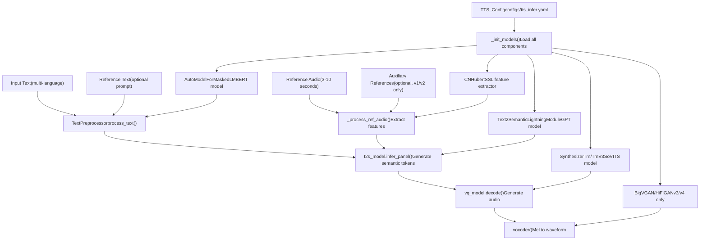
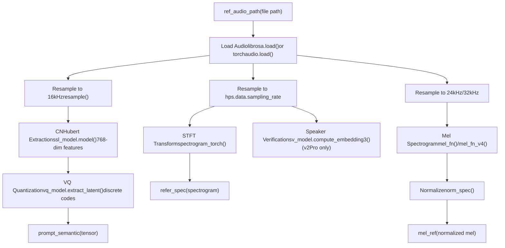
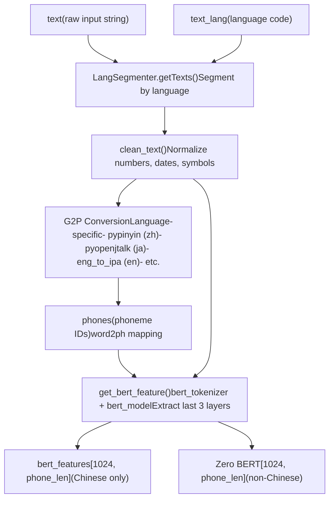
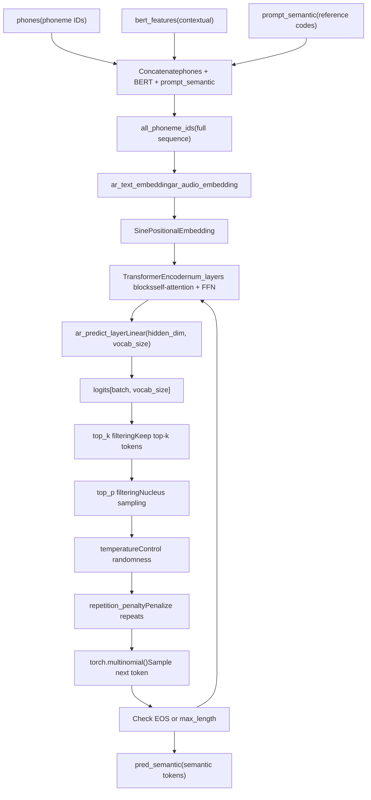
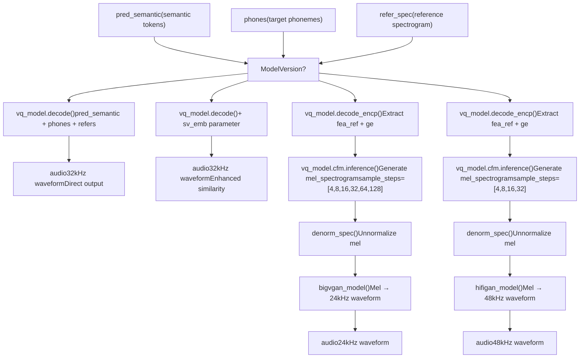
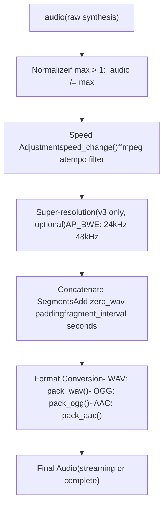
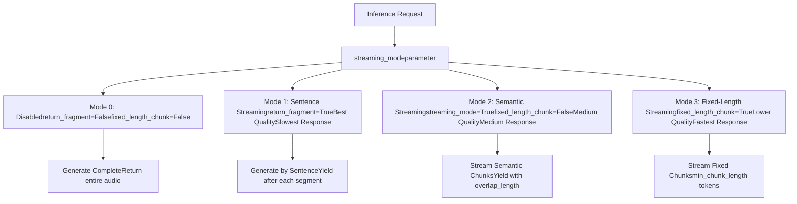
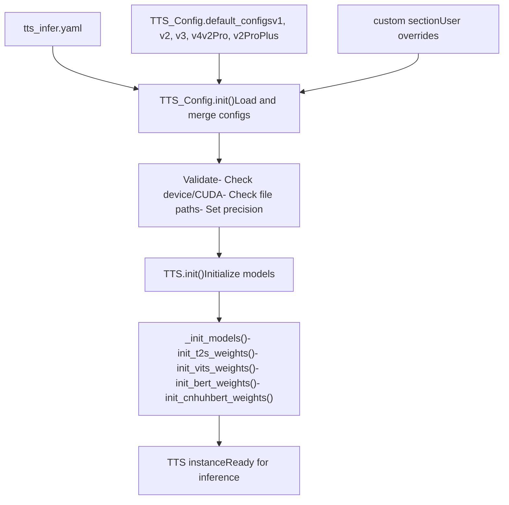

# Inference Pipeline

Relevant source files

-   [.gitignore](https://github.com/RVC-Boss/GPT-SoVITS/blob/c767f0b8/.gitignore)
-   [GPT\_SoVITS/AR/models/t2s\_model.py](https://github.com/RVC-Boss/GPT-SoVITS/blob/c767f0b8/GPT_SoVITS/AR/models/t2s_model.py)
-   [GPT\_SoVITS/AR/models/utils.py](https://github.com/RVC-Boss/GPT-SoVITS/blob/c767f0b8/GPT_SoVITS/AR/models/utils.py)
-   [GPT\_SoVITS/TTS\_infer\_pack/TTS.py](https://github.com/RVC-Boss/GPT-SoVITS/blob/c767f0b8/GPT_SoVITS/TTS_infer_pack/TTS.py)
-   [GPT\_SoVITS/configs/tts\_infer.yaml](https://github.com/RVC-Boss/GPT-SoVITS/blob/c767f0b8/GPT_SoVITS/configs/tts_infer.yaml)
-   [GPT\_SoVITS/inference\_webui.py](https://github.com/RVC-Boss/GPT-SoVITS/blob/c767f0b8/GPT_SoVITS/inference_webui.py)
-   [GPT\_SoVITS/inference\_webui\_fast.py](https://github.com/RVC-Boss/GPT-SoVITS/blob/c767f0b8/GPT_SoVITS/inference_webui_fast.py)
-   [GPT\_SoVITS/process\_ckpt.py](https://github.com/RVC-Boss/GPT-SoVITS/blob/c767f0b8/GPT_SoVITS/process_ckpt.py)
-   [api\_v2.py](https://github.com/RVC-Boss/GPT-SoVITS/blob/c767f0b8/api_v2.py)
-   [tools/assets.py](https://github.com/RVC-Boss/GPT-SoVITS/blob/c767f0b8/tools/assets.py)

This page documents the complete inference flow from input text and reference audio through semantic token generation to final audio synthesis. For information about training models that are used during inference, see [Training Pipeline](/RVC-Boss/GPT-SoVITS/2.3-training-pipeline). For details on text processing components, see [Text Processing Pipeline](/RVC-Boss/GPT-SoVITS/2.2-text-processing-pipeline).

## Overview

The inference pipeline in GPT-SoVITS transforms raw text input into synthesized speech by:

1.  Processing a reference audio file to extract voice characteristics
2.  Converting input text to phoneme sequences with contextual features
3.  Using the GPT model to generate semantic tokens autoregressively
4.  Synthesizing audio from semantic tokens using the SoVITS model
5.  Applying post-processing (speed adjustment, super-resolution, concatenation)

The pipeline is implemented primarily in the `TTS` class and exposed through multiple interfaces: WebUI, REST API, and command-line tools.

Sources: [GPT\_SoVITS/TTS\_infer\_pack/TTS.py421-1556](https://github.com/RVC-Boss/GPT-SoVITS/blob/c767f0b8/GPT_SoVITS/TTS_infer_pack/TTS.py#L421-L1556) [GPT\_SoVITS/inference\_webui.py751-1002](https://github.com/RVC-Boss/GPT-SoVITS/blob/c767f0b8/GPT_SoVITS/inference_webui.py#L751-L1002)

## Core Pipeline Components


**TTS Pipeline Execution Flow**

The `TTS.run()` method orchestrates the entire pipeline, handling both streaming and non-streaming modes.

Sources: [GPT\_SoVITS/TTS\_infer\_pack/TTS.py467-475](https://github.com/RVC-Boss/GPT-SoVITS/blob/c767f0b8/GPT_SoVITS/TTS_infer_pack/TTS.py#L467-L475) [GPT\_SoVITS/TTS\_infer\_pack/TTS.py1190-1556](https://github.com/RVC-Boss/GPT-SoVITS/blob/c767f0b8/GPT_SoVITS/TTS_infer_pack/TTS.py#L1190-L1556)

## Reference Audio Processing

Reference audio processing extracts voice characteristics that will be cloned during synthesis:


**Reference Audio Validation**

The reference audio must be 3-10 seconds in duration (48,000-160,000 samples at 16kHz). This constraint ensures sufficient context without overwhelming the model.

| Feature Type | Extraction Method | Dimensions | Purpose |
| --- | --- | --- | --- |
| SSL Features | `cnhubert_model.model()` | \[batch, 768, time\] | Acoustic content representation |
| Semantic Tokens | `vq_model.extract_latent()` | \[batch, 1, time\] | Discrete semantic codes |
| Spectrogram (v1/v2) | `spectrogram_torch()` | \[batch, freq, time\] | Timbre and prosody |
| Mel Spectrogram (v3/v4) | `mel_fn()` / `mel_fn_v4()` | \[batch, 100, time\] | Reference for CFM |
| Speaker Embedding (v2Pro) | `sv_model.compute_embedding3()` | \[20480\] | Speaker identity |

Sources: [GPT\_SoVITS/TTS\_infer\_pack/TTS.py764-830](https://github.com/RVC-Boss/GPT-SoVITS/blob/c767f0b8/GPT_SoVITS/TTS_infer_pack/TTS.py#L764-L830) [GPT\_SoVITS/inference\_webui.py812-826](https://github.com/RVC-Boss/GPT-SoVITS/blob/c767f0b8/GPT_SoVITS/inference_webui.py#L812-L826) [GPT\_SoVITS/TTS\_infer\_pack/TTS.py831-882](https://github.com/RVC-Boss/GPT-SoVITS/blob/c767f0b8/GPT_SoVITS/TTS_infer_pack/TTS.py#L831-L882)

## Text Processing Pipeline

Text processing converts input text into phoneme sequences with contextual embeddings:


**Text Splitting and Segmentation**

Long texts are split into segments before processing to ensure generation quality:

| Split Method | Implementation | Description |
| --- | --- | --- |
| `cut0` | No splitting | Process entire text as one segment |
| `cut1` | `cut1()` | Combine every 4 sentences |
| `cut2` | `cut2()` | Split every 50 characters |
| `cut3` | `cut3()` | Split on Chinese period `。` |
| `cut4` | `cut4()` | Split on English period `.` |
| `cut5` | `cut5()` | Split on all punctuation marks |

**Language Detection and Mixed-Language Support**

The pipeline supports automatic language detection and mixed-language synthesis:

```
# Language mode examples"all_zh"      # Treat all as Chinese"all_ja"      # Treat all as Japanese  "all_yue"     # Treat all as Cantonese"zh"          # Chinese-English mixed"ja"          # Japanese-English mixed"auto"        # Automatic detection"auto_yue"    # Auto with Cantonese preference
```
Sources: [GPT\_SoVITS/TTS\_infer\_pack/TTS.py1062-1141](https://github.com/RVC-Boss/GPT-SoVITS/blob/c767f0b8/GPT_SoVITS/TTS_infer_pack/TTS.py#L1062-L1141) [GPT\_SoVITS/inference\_webui.py601-668](https://github.com/RVC-Boss/GPT-SoVITS/blob/c767f0b8/GPT_SoVITS/inference_webui.py#L601-L668) [GPT\_SoVITS/TTS\_infer\_pack/TextPreprocessor.py1-200](https://github.com/RVC-Boss/GPT-SoVITS/blob/c767f0b8/GPT_SoVITS/TTS_infer_pack/TextPreprocessor.py#L1-L200)

## GPT Semantic Token Generation

The GPT model generates semantic tokens autoregressively from text and reference features:


**Inference Methods**

The `Text2SemanticDecoder` class provides multiple inference methods:

| Method | Use Case | Key Parameters |
| --- | --- | --- |
| `infer()` | Basic autoregressive generation | `top_k`, `temperature`, `early_stop_num` |
| `infer_panel()` | WebUI inference with ref\_free support | `top_k`, `top_p`, `temperature` |
| `infer_panel_batch_infer()` | Parallel batch processing | `batch_size`, `repetition_penalty` |
| `infer_panel_naive_batched()` | Streaming-optimized inference | `stream_mode`, `fixed_length_chunk` |

**Sampling Parameters**

| Parameter | Range | Default | Effect |
| --- | --- | --- | --- |
| `top_k` | 1-100 | 15 | Limits vocabulary to top-k most probable tokens |
| `top_p` | 0.0-1.0 | 1.0 | Nucleus sampling threshold (cumulative probability) |
| `temperature` | 0.0-2.0 | 1.0 | Controls randomness (higher = more random) |
| `repetition_penalty` | 0.0-2.0 | 1.35 | Penalizes token repetition |
| `early_stop_num` | \-1 or positive int | `hz * max_sec` | Maximum tokens to generate (-1 = disabled) |

**Prompt-Free Mode**

When `prompt_semantic` is `None`, the model operates in prompt-free mode, generating from text alone without reference audio conditioning. This mode is supported in v1/v2/v2Pro but not in v3/v4.

Sources: [GPT\_SoVITS/AR/models/t2s\_model.py513-576](https://github.com/RVC-Boss/GPT-SoVITS/blob/c767f0b8/GPT_SoVITS/AR/models/t2s_model.py#L513-L576) [GPT\_SoVITS/AR/models/t2s\_model.py583-896](https://github.com/RVC-Boss/GPT-SoVITS/blob/c767f0b8/GPT_SoVITS/AR/models/t2s_model.py#L583-L896) [GPT\_SoVITS/TTS\_infer\_pack/TTS.py1296-1409](https://github.com/RVC-Boss/GPT-SoVITS/blob/c767f0b8/GPT_SoVITS/TTS_infer_pack/TTS.py#L1296-L1409)

## Version-Specific Audio Synthesis

The audio synthesis stage differs significantly across model versions:


**Version Comparison Table**

| Feature | v1/v2 | v2Pro/ProPlus | v3 | v4 |
| --- | --- | --- | --- | --- |
| **Synthesis Method** | Direct VQ decode | Direct VQ + SV | CFM + BigVGAN | CFM + HiFiGAN |
| **Output Sample Rate** | 32kHz | 32kHz | 24kHz | 48kHz |
| **Vocoder Required** | No | No | Yes | Yes |
| **Sample Steps** | N/A | N/A | 4-128 | 4-32 |
| **Speaker Verification** | No | Yes | No | No |
| **Auxiliary References** | Yes | Yes | No | No |
| **LoRA Support** | No | No | Yes | Yes |
| **Super-resolution** | No | No | Yes (optional) | No |
| **Quality** | Good | Enhanced similarity | High (may have artifacts) | Best (no artifacts) |

**v3/v4 Chunked Processing**

For v3/v4 models, audio generation uses chunked processing to handle long sequences:

```
# Configuration valuesv3_config = {    "sr": 24000,    "T_ref": 468,      # Reference frames    "T_chunk": 934,    # Chunk size    "overlapped_len": 12} v4_config = {    "sr": 48000,    "T_ref": 500,    "T_chunk": 1000,    "overlapped_len": 12}
```
The chunking process:

1.  Take last `T_ref` frames from reference mel as context
2.  Generate `chunk_len = T_chunk - T_ref` new frames
3.  Use last `T_ref` frames of generated audio as context for next chunk
4.  Concatenate all chunks

Sources: [GPT\_SoVITS/inference\_webui.py895-976](https://github.com/RVC-Boss/GPT-SoVITS/blob/c767f0b8/GPT_SoVITS/inference_webui.py#L895-L976) [GPT\_SoVITS/TTS\_infer\_pack/TTS.py1410-1511](https://github.com/RVC-Boss/GPT-SoVITS/blob/c767f0b8/GPT_SoVITS/TTS_infer_pack/TTS.py#L1410-L1511) [GPT\_SoVITS/TTS\_infer\_pack/TTS.py615-674](https://github.com/RVC-Boss/GPT-SoVITS/blob/c767f0b8/GPT_SoVITS/TTS_infer_pack/TTS.py#L615-L674)

## Post-Processing Pipeline

After synthesis, audio undergoes several post-processing steps:


**Post-Processing Parameters**

| Parameter | Default | Description |
| --- | --- | --- |
| `speed_factor` | 1.0 | Speed multiplier (0.6-1.65) using ffmpeg atempo |
| `fragment_interval` | 0.3 | Silence duration (seconds) between segments |
| `super_sampling` | False | Enable 24→48kHz upsampling (v3 only) |
| `media_type` | "wav" | Output format: wav, ogg, aac, raw |

**Segment Concatenation**

For multi-sentence synthesis, segments are concatenated with configurable pauses:

```
zero_wav = np.zeros(    int(hps.data.sampling_rate * pause_second),    dtype=np.float16 if is_half else np.float32) audio_opt = []for segment in segments:    audio_opt.append(segment_audio)    audio_opt.append(zero_wav)  # Add pause    final_audio = torch.cat(audio_opt, 0)
```
Sources: [GPT\_SoVITS/TTS\_infer\_pack/TTS.py1512-1541](https://github.com/RVC-Boss/GPT-SoVITS/blob/c767f0b8/GPT_SoVITS/TTS_infer_pack/TTS.py#L1512-L1541) [GPT\_SoVITS/inference\_webui.py977-1001](https://github.com/RVC-Boss/GPT-SoVITS/blob/c767f0b8/GPT_SoVITS/inference_webui.py#L977-L1001) [api\_v2.py181-278](https://github.com/RVC-Boss/GPT-SoVITS/blob/c767f0b8/api_v2.py#L181-L278)

## Streaming Modes

The inference pipeline supports multiple streaming modes for different latency/quality trade-offs:


**Streaming Configuration Parameters**

| Parameter | Type | Range | Description |
| --- | --- | --- | --- |
| `streaming_mode` | bool/int | 0,1,2,3 or True/False | Streaming mode selector |
| `overlap_length` | int | 0-10 | Overlapping semantic tokens between chunks (mode 2/3) |
| `min_chunk_length` | int | 4-64 | Minimum semantic tokens per chunk (mode 3) |
| `return_fragment` | bool | True/False | Return audio per sentence segment (mode 1) |

**Streaming Implementation**

For streaming modes 2 and 3, the pipeline uses overlapping chunks:

```
# Mode 2/3: Semantic token streaminglast_output = Nonefor chunk_semantic in semantic_chunks:    # Overlap with previous chunk    if last_output is not None:        chunk_semantic = torch.cat([            last_output[-overlap_length:],            chunk_semantic        ], dim=-1)        audio_chunk = synthesize(chunk_semantic)    yield audio_chunk        last_output = chunk_semantic
```
**WAV Header for Streaming**

When streaming WAV format, the first chunk includes a WAV header:

```
def wave_header_chunk(frame_input=b"", channels=1,                       sample_width=2, sample_rate=32000):    wav_buf = BytesIO()    with wave.open(wav_buf, "wb") as vfout:        vfout.setnchannels(channels)        vfout.setsampwidth(sample_width)        vfout.setframerate(sample_rate)        vfout.writeframes(frame_input)    return wav_buf.read()
```
Sources: [api\_v2.py388-424](https://github.com/RVC-Boss/GPT-SoVITS/blob/c767f0b8/api_v2.py#L388-L424) [GPT\_SoVITS/TTS\_infer\_pack/TTS.py1190-1295](https://github.com/RVC-Boss/GPT-SoVITS/blob/c767f0b8/GPT_SoVITS/TTS_infer_pack/TTS.py#L1190-L1295) [api\_v2.py282-294](https://github.com/RVC-Boss/GPT-SoVITS/blob/c767f0b8/api_v2.py#L282-L294)

## Configuration and Initialization

The inference pipeline is configured through the `TTS_Config` class:


**TTS\_Config Structure**

```
class TTS_Config:    # Model paths    t2s_weights_path: str        # GPT model checkpoint    vits_weights_path: str       # SoVITS model checkpoint    bert_base_path: str          # BERT model directory    cnhuhbert_base_path: str     # CNHubert model directory        # Runtime settings    device: torch.device         # cuda/cpu/mps    is_half: bool                # FP16/FP32    version: str                 # v1/v2/v3/v4/v2Pro/v2ProPlus        # Audio settings (from VITS config)    sampling_rate: int           # 32000 (v1/v2), 24000 (v3), 48000 (v4)    hop_length: int              # 640 (v1/v2), 256 (v3), 320 (v4)    filter_length: int           # 2048    win_length: int              # 2048        # Generation settings    max_sec: int                 # Maximum generation length    hz: int                      # 50 (semantic token Hz)    languages: list              # Supported languages
```
**Version Auto-Detection**

Model version is detected from checkpoint files using multiple strategies:

```
# Strategy 1: Check hash for pretrained modelshash_pretrained_dict = {    "dc3c97e17592963677a4a1681f30c653": ["v2", "v2", False],  # v1    "6642b37f3dbb1f76882b69937c95a5f3": ["v2", "v2", False],  # v2    "43797be674a37c1c83ee81081941ed0f": ["v2", "v3", False],  # v3    "4f26b9476d0c5033e04162c486074374": ["v2", "v4", False],  # v4    # ...} # Strategy 2: Check 2-byte header for new weightshead2version = {    b"00": ["v1", "v1", False],    b"01": ["v2", "v2", False],    b"02": ["v2", "v3", False],    b"03": ["v2", "v3", True],   # LoRA    b"04": ["v2", "v4", True],   # LoRA    b"05": ["v2", "v2Pro", False],    b"06": ["v2", "v2ProPlus", False],} # Strategy 3: Check file size for old weights# v1: ~82942KB, v2: ~83014KB, v3: ~750MB
```
Returns: `(version, model_version, if_lora_v3)` tuple

Sources: [GPT\_SoVITS/TTS\_infer\_pack/TTS.py217-419](https://github.com/RVC-Boss/GPT-SoVITS/blob/c767f0b8/GPT_SoVITS/TTS_infer_pack/TTS.py#L217-L419) [GPT\_SoVITS/TTS\_infer\_pack/TTS.py467-590](https://github.com/RVC-Boss/GPT-SoVITS/blob/c767f0b8/GPT_SoVITS/TTS_infer_pack/TTS.py#L467-L590) [GPT\_SoVITS/process\_ckpt.py22-127](https://github.com/RVC-Boss/GPT-SoVITS/blob/c767f0b8/GPT_SoVITS/process_ckpt.py#L22-L127) [GPT\_SoVITS/configs/tts\_infer.yaml1-57](https://github.com/RVC-Boss/GPT-SoVITS/blob/c767f0b8/GPT_SoVITS/configs/tts_infer.yaml#L1-L57)

## Inference Interfaces

The inference pipeline is exposed through multiple interfaces:

**1\. TTS Class (Programmatic)**

```
from TTS_infer_pack.TTS import TTS, TTS_Config config = TTS_Config("configs/tts_infer.yaml")tts = TTS(config) inputs = {    "text": "你好，世界",    "text_lang": "zh",    "ref_audio_path": "reference.wav",    "prompt_text": "参考音频文本",    "prompt_lang": "zh",    "top_k": 15,    "top_p": 1.0,    "temperature": 1.0,} for sr, audio in tts.run(inputs):    # Process audio chunks    pass
```
**2\. Inference WebUI**

-   `inference_webui.py`: Full-featured UI with model switching
-   `inference_webui_fast.py`: Optimized UI using `TTS` class
-   Port: 9872 (configurable via `infer_ttswebui` env var)

**3\. REST API (api\_v2.py)**

```
# GET requestcurl "http://127.0.0.1:9880/tts?text=你好&text_lang=zh&ref_audio_path=ref.wav&prompt_lang=zh&streaming_mode=true" # POST request (JSON)curl -X POST http://127.0.0.1:9880/tts \  -H "Content-Type: application/json" \  -d '{    "text": "你好，世界",    "text_lang": "zh",    "ref_audio_path": "reference.wav",    "prompt_text": "参考音频",    "prompt_lang": "zh",    "streaming_mode": 2  }'
```
**API Endpoints**

| Endpoint | Method | Purpose |
| --- | --- | --- |
| `/tts` | GET/POST | Text-to-speech synthesis |
| `/set_gpt_weights` | GET/POST | Switch GPT model |
| `/set_sovits_weights` | GET/POST | Switch SoVITS model |
| `/control` | GET/POST | Control commands (restart/exit) |

**4\. Batch Inference**

```
python batch_inference.py \  --gpt_path GPT_weights/model.ckpt \  --sovits_path SoVITS_weights/model.pth \  --input_file texts.txt \  --ref_audio reference.wav
```
Sources: [GPT\_SoVITS/inference\_webui.py1-200](https://github.com/RVC-Boss/GPT-SoVITS/blob/c767f0b8/GPT_SoVITS/inference_webui.py#L1-L200) [GPT\_SoVITS/inference\_webui\_fast.py1-200](https://github.com/RVC-Boss/GPT-SoVITS/blob/c767f0b8/GPT_SoVITS/inference_webui_fast.py#L1-L200) [api\_v2.py1-102](https://github.com/RVC-Boss/GPT-SoVITS/blob/c767f0b8/api_v2.py#L1-L102) [api\_v2.py345-463](https://github.com/RVC-Boss/GPT-SoVITS/blob/c767f0b8/api_v2.py#L345-L463)

## Performance Optimization

**Prompt Caching**

The pipeline caches processed reference audio to avoid redundant computation:

```
prompt_cache = {    "ref_audio_path": None,    "prompt_semantic": None,      # Cached semantic tokens    "refer_spec": [],             # Cached spectrograms    "prompt_text": None,    "prompt_lang": None,    "phones": None,               # Cached phonemes    "bert_features": None,        # Cached BERT features    "norm_text": None,    "aux_ref_audio_paths": [],}
```
When the same reference audio is used repeatedly, cached features are reused.

**Parallel Inference**

When `parallel_infer=True`, the pipeline processes multiple text segments in parallel:

```
if parallel_infer and len(texts) > 1:    # Use infer_panel_batch_infer for parallel processing    results = t2s_model.infer_panel_batch_infer(        x_list, x_lens, prompts, bert_features,        batch_size=batch_size,        # ...    )else:    # Sequential processing    for text in texts:        result = t2s_model.infer_panel(...)
```
**GPU Memory Management**

```
def empty_cache():    if torch.cuda.is_available():        torch.cuda.empty_cache()    gc.collect()
```
Called between model loading operations to free GPU memory.

**Half Precision (FP16)**

When `is_half=True` and CUDA is available, all models use FP16:

```
if is_half and torch.cuda.is_available():    model = model.half()
```
This reduces memory usage by ~50% and increases inference speed on modern GPUs.

Sources: [GPT\_SoVITS/TTS\_infer\_pack/TTS.py452-463](https://github.com/RVC-Boss/GPT-SoVITS/blob/c767f0b8/GPT_SoVITS/TTS_infer_pack/TTS.py#L452-L463) [GPT\_SoVITS/TTS\_infer\_pack/TTS.py691-728](https://github.com/RVC-Boss/GPT-SoVITS/blob/c767f0b8/GPT_SoVITS/TTS_infer_pack/TTS.py#L691-L728) [GPT\_SoVITS/TTS\_infer\_pack/TTS.py1190-1295](https://github.com/RVC-Boss/GPT-SoVITS/blob/c767f0b8/GPT_SoVITS/TTS_infer_pack/TTS.py#L1190-L1295)
