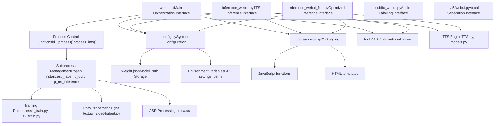
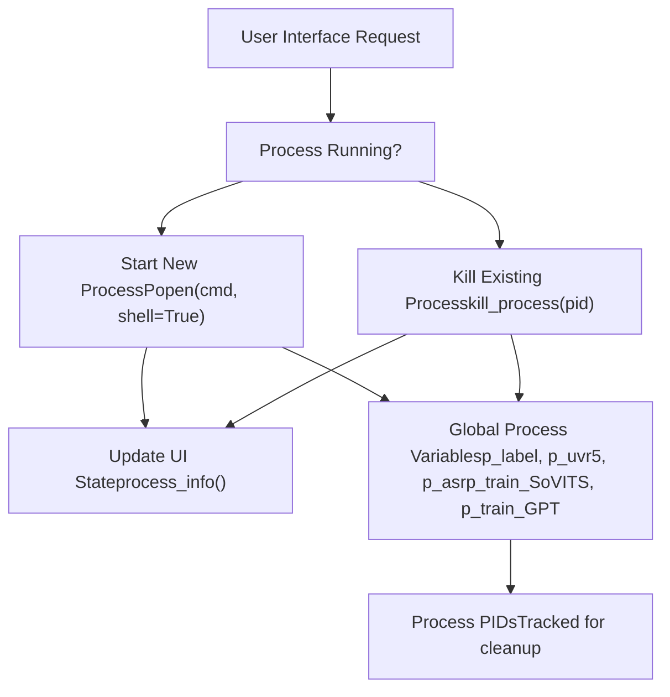
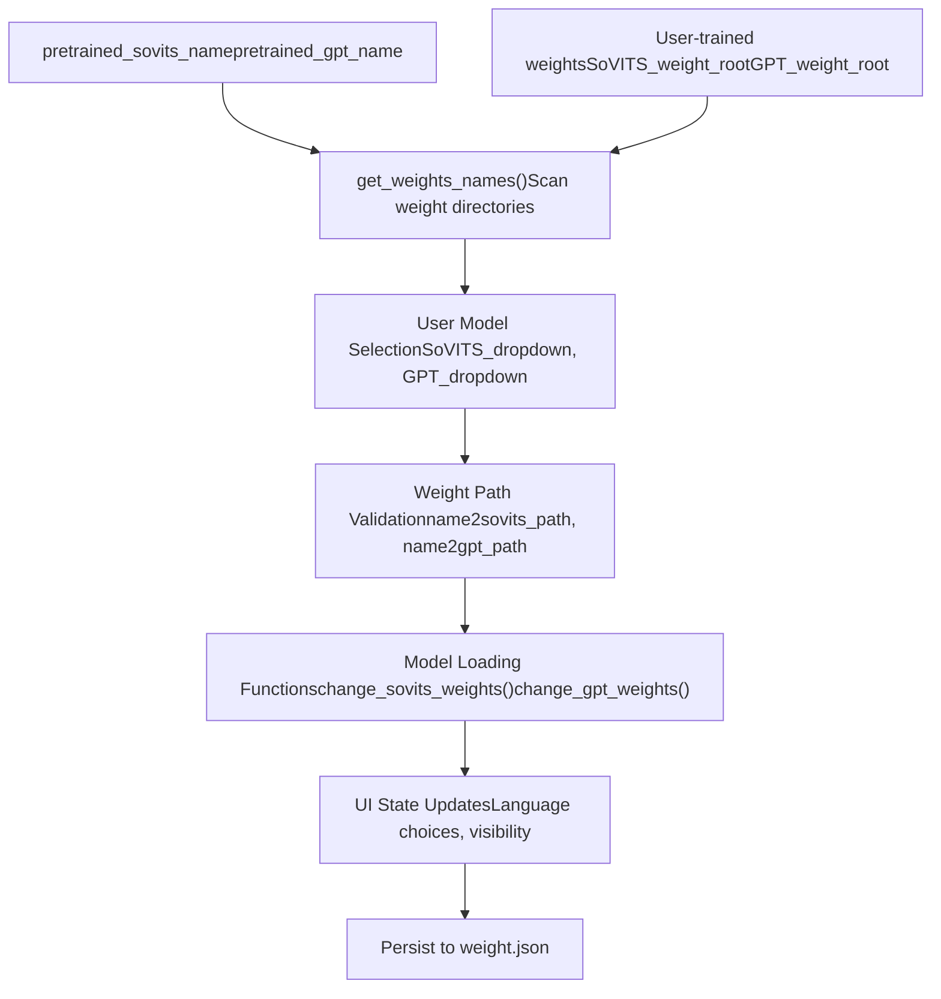

# Web Interface

Relevant source files

-   [GPT\_SoVITS/inference\_webui.py](https://github.com/RVC-Boss/GPT-SoVITS/blob/c767f0b8/GPT_SoVITS/inference_webui.py)
-   [GPT\_SoVITS/inference\_webui\_fast.py](https://github.com/RVC-Boss/GPT-SoVITS/blob/c767f0b8/GPT_SoVITS/inference_webui_fast.py)
-   [GPT\_SoVITS/process\_ckpt.py](https://github.com/RVC-Boss/GPT-SoVITS/blob/c767f0b8/GPT_SoVITS/process_ckpt.py)
-   [api.py](https://github.com/RVC-Boss/GPT-SoVITS/blob/c767f0b8/api.py)
-   [config.py](https://github.com/RVC-Boss/GPT-SoVITS/blob/c767f0b8/config.py)
-   [tools/assets.py](https://github.com/RVC-Boss/GPT-SoVITS/blob/c767f0b8/tools/assets.py)
-   [webui.py](https://github.com/RVC-Boss/GPT-SoVITS/blob/c767f0b8/webui.py)

The GPT-SoVITS system provides multiple web-based interfaces for different aspects of text-to-speech model training and inference. This document covers the architecture and components of the web interface subsystem, which enables user interaction through browser-based GUIs built with Gradio.

For detailed information about specific interfaces, see [Main WebUI](/RVC-Boss/GPT-SoVITS/3.1-main-webui) for training orchestration, [Inference WebUI](/RVC-Boss/GPT-SoVITS/3.2-inference-webui) for TTS synthesis, [API Reference](/RVC-Boss/GPT-SoVITS/3.3-rest-api) for programmatic access, and [Configuration Management](/RVC-Boss/GPT-SoVITS/3.4-configuration-management) for system settings.

## System Overview

The web interface subsystem consists of multiple independent Gradio applications that can be launched separately or together. Each interface serves a specific purpose in the GPT-SoVITS workflow, from data preparation and model training to inference and system configuration.

## Web Interface Architecture


Sources: [webui.py1-1660](https://github.com/RVC-Boss/GPT-SoVITS/blob/c767f0b8/webui.py#L1-L1660) [GPT\_SoVITS/inference\_webui.py1-1200](https://github.com/RVC-Boss/GPT-SoVITS/blob/c767f0b8/GPT_SoVITS/inference_webui.py#L1-L1200) [GPT\_SoVITS/inference\_webui\_fast.py1-524](https://github.com/RVC-Boss/GPT-SoVITS/blob/c767f0b8/GPT_SoVITS/inference_webui_fast.py#L1-L524) [config.py1-219](https://github.com/RVC-Boss/GPT-SoVITS/blob/c767f0b8/config.py#L1-L219) [tools/assets.py1-74](https://github.com/RVC-Boss/GPT-SoVITS/blob/c767f0b8/tools/assets.py#L1-L74)

## Core Web Interface Components

### Main Orchestration Interface

The primary web interface is implemented in `webui.py` and serves as the central hub for managing the entire GPT-SoVITS workflow. It provides controls for:

-   **Process Management**: Functions like `change_label()`, `change_uvr5()`, `change_tts_inference()` manage subprocess lifecycle
-   **Training Orchestration**: `open1Ba()` for SoVITS training, `open1Bb()` for GPT training
-   **Data Pipeline Control**: `open1a()`, `open1b()`, `open1c()` for the three-stage data preparation
-   **Audio Processing**: `open_slice()`, `open_asr()`, `open_denoise()` for audio preprocessing

### Inference Interfaces

Two separate interfaces handle TTS inference:

-   **Standard Interface** (`inference_webui.py`): Full-featured interface with all model options
-   **Fast Interface** (`inference_webui_fast.py`): Optimized interface using the `TTS_infer_pack.TTS` pipeline for better performance

Both interfaces share similar functionality but use different backend implementations.

### Process Management System


Sources: [webui.py212-243](https://github.com/RVC-Boss/GPT-SoVITS/blob/c767f0b8/webui.py#L212-L243) [webui.py271-296](https://github.com/RVC-Boss/GPT-SoVITS/blob/c767f0b8/webui.py#L271-L296) [webui.py302-326](https://github.com/RVC-Boss/GPT-SoVITS/blob/c767f0b8/webui.py#L302-L326)

## Configuration and Asset Management

### Configuration System

The web interfaces rely on a centralized configuration system:

-   **`config.py`**: Defines system-wide settings including GPU configuration, model paths, and port assignments
-   **`weight.json`**: Stores user-selected model paths for persistence across sessions
-   **Environment Variables**: Used for runtime configuration like `CUDA_VISIBLE_DEVICES`, `is_half`, `version`

Key configuration elements:

| Component | Purpose | Default Value |
| --- | --- | --- |
| `webui_port_main` | Main interface port | 9874 |
| `webui_port_infer_tts` | Inference interface port | 9872 |
| `webui_port_uvr5` | UVR5 interface port | 9873 |
| `webui_port_subfix` | Audio labeling port | 9871 |
| `exp_root` | Experiment directory | "logs" |
| `python_exec` | Python executable path | `sys.executable` |

### Asset Management

The `tools/assets.py` module provides:

-   **CSS Styling**: Responsive design with dark/light theme support
-   **JavaScript Functions**: Client-side functionality like theme deletion
-   **HTML Templates**: Common header templates with project links and branding

Sources: [config.py138-146](https://github.com/RVC-Boss/GPT-SoVITS/blob/c767f0b8/config.py#L138-L146) [tools/assets.py14-50](https://github.com/RVC-Boss/GPT-SoVITS/blob/c767f0b8/tools/assets.py#L14-L50) [tools/assets.py52-73](https://github.com/RVC-Boss/GPT-SoVITS/blob/c767f0b8/tools/assets.py#L52-L73)

## Interface Integration Points

### Model Weight Management

Both inference interfaces implement dynamic model switching:


Sources: [GPT\_SoVITS/inference\_webui.py229-368](https://github.com/RVC-Boss/GPT-SoVITS/blob/c767f0b8/GPT_SoVITS/inference_webui.py#L229-L368) [GPT\_SoVITS/inference\_webui\_fast.py233-298](https://github.com/RVC-Boss/GPT-SoVITS/blob/c767f0b8/GPT_SoVITS/inference_webui_fast.py#L233-L298) [config.py86-113](https://github.com/RVC-Boss/GPT-SoVITS/blob/c767f0b8/config.py#L86-L113)

### Internationalization Support

All web interfaces support multiple languages through the `tools/i18n` system:

-   **Language Detection**: Automatic detection from system locale or command line arguments
-   **Dynamic Text**: All UI text uses `i18n()` function calls for translation
-   **Supported Languages**: Multiple languages with fallback to Auto-detection

The language system is initialized in each interface with:

```
language = os.environ.get("language", "Auto")language = sys.argv[-1] if sys.argv[-1] in scan_language_list() else languagei18n = I18nAuto(language=language)
```
Sources: [GPT\_SoVITS/inference\_webui.py129-131](https://github.com/RVC-Boss/GPT-SoVITS/blob/c767f0b8/GPT_SoVITS/inference_webui.py#L129-L131) [webui.py66-68](https://github.com/RVC-Boss/GPT-SoVITS/blob/c767f0b8/webui.py#L66-L68) [tools/i18n/i18n.py](https://github.com/RVC-Boss/GPT-SoVITS/blob/c767f0b8/tools/i18n/i18n.py)

## Deployment and Access

The web interfaces are designed for both local and remote access:

-   **Local Development**: Interfaces bind to `0.0.0.0` for network access
-   **Shared Access**: Optional sharing through Gradio's sharing mechanism controlled by `is_share` environment variable
-   **Process Isolation**: Each interface runs as an independent process for stability
-   **Resource Management**: GPU assignment and memory management through environment variables

The main orchestration interface can launch and manage all other interfaces as needed, providing a unified entry point for the GPT-SoVITS system while maintaining modularity and independence of individual components.

Sources: [webui.py332-364](https://github.com/RVC-Boss/GPT-SoVITS/blob/c767f0b8/webui.py#L332-L364) [GPT\_SoVITS/inference\_webui.py84-90](https://github.com/RVC-Boss/GPT-SoVITS/blob/c767f0b8/GPT_SoVITS/inference_webui.py#L84-L90) [GPT\_SoVITS/inference\_webui\_fast.py45-52](https://github.com/RVC-Boss/GPT-SoVITS/blob/c767f0b8/GPT_SoVITS/inference_webui_fast.py#L45-L52)
