# Main WebUI

Relevant source files

-   [README.md](https://github.com/RVC-Boss/GPT-SoVITS/blob/c767f0b8/README.md?plain=1)
-   [api.py](https://github.com/RVC-Boss/GPT-SoVITS/blob/c767f0b8/api.py)
-   [config.py](https://github.com/RVC-Boss/GPT-SoVITS/blob/c767f0b8/config.py)
-   [docs/cn/README.md](https://github.com/RVC-Boss/GPT-SoVITS/blob/c767f0b8/docs/cn/README.md?plain=1)
-   [docs/ja/README.md](https://github.com/RVC-Boss/GPT-SoVITS/blob/c767f0b8/docs/ja/README.md?plain=1)
-   [docs/ko/README.md](https://github.com/RVC-Boss/GPT-SoVITS/blob/c767f0b8/docs/ko/README.md?plain=1)
-   [docs/tr/README.md](https://github.com/RVC-Boss/GPT-SoVITS/blob/c767f0b8/docs/tr/README.md?plain=1)
-   [install.ps1](https://github.com/RVC-Boss/GPT-SoVITS/blob/c767f0b8/install.ps1)
-   [install.sh](https://github.com/RVC-Boss/GPT-SoVITS/blob/c767f0b8/install.sh)
-   [requirements.txt](https://github.com/RVC-Boss/GPT-SoVITS/blob/c767f0b8/requirements.txt)
-   [webui.py](https://github.com/RVC-Boss/GPT-SoVITS/blob/c767f0b8/webui.py)

## Purpose and Scope

The Main WebUI (`webui.py`) is the central orchestration interface for GPT-SoVITS, providing unified access to data preparation, model training, and system management. It serves as a process manager that spawns and controls various sub-tools and training processes. This interface is designed for users preparing datasets and training custom voice models.

For interactive TTS generation after training, see [Inference WebUI](/RVC-Boss/GPT-SoVITS/3.2-inference-webui). For programmatic access to trained models, see [REST API](/RVC-Boss/GPT-SoVITS/3.3-rest-api). For dataset annotation specifically, see [Audio Annotation and Management](/RVC-Boss/GPT-SoVITS/5.4-audio-annotation-tools).

---

## Architecture Overview

The Main WebUI is implemented as a Gradio application that manages multiple subprocess-based tools and training pipelines. It provides tab-based organization for different workflow stages and maintains global process state for resource coordination.

### System Organization

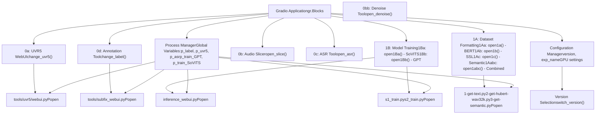
**Sources:** [webui.py1-100](https://github.com/RVC-Boss/GPT-SoVITS/blob/c767f0b8/webui.py#L1-L100) [webui.py1305-1475](https://github.com/RVC-Boss/GPT-SoVITS/blob/c767f0b8/webui.py#L1305-L1475)

---

## Process Management System

The Main WebUI maintains global process references and provides lifecycle management for all spawned subprocesses. This prevents resource conflicts and allows proper cleanup.

### Process State Management

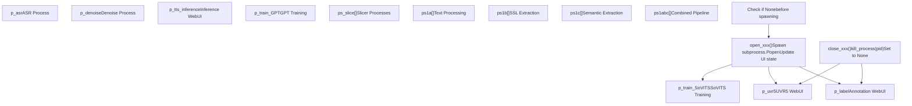
**Key Process Management Functions:**

| Function | Purpose | Process Variable | Lines |
| --- | --- | --- | --- |
| `change_label()` | Toggle annotation WebUI | `p_label` | [webui.py270-295](https://github.com/RVC-Boss/GPT-SoVITS/blob/c767f0b8/webui.py#L270-L295) |
| `change_uvr5()` | Toggle UVR5 separation UI | `p_uvr5` | [webui.py301-325](https://github.com/RVC-Boss/GPT-SoVITS/blob/c767f0b8/webui.py#L301-L325) |
| `change_tts_inference()` | Toggle inference WebUI | `p_tts_inference` | [webui.py331-363](https://github.com/RVC-Boss/GPT-SoVITS/blob/c767f0b8/webui.py#L331-L363) |
| `open_asr()` / `close_asr()` | Control ASR process | `p_asr` | [webui.py371-426](https://github.com/RVC-Boss/GPT-SoVITS/blob/c767f0b8/webui.py#L371-L426) |
| `open_denoise()` / `close_denoise()` | Control denoising | `p_denoise` | [webui.py432-482](https://github.com/RVC-Boss/GPT-SoVITS/blob/c767f0b8/webui.py#L432-L482) |
| `open_slice()` / `close_slice()` | Control audio slicing | `ps_slice` | [webui.py682-773](https://github.com/RVC-Boss/GPT-SoVITS/blob/c767f0b8/webui.py#L682-L773) |
| `open1Ba()` / `close1Ba()` | Control SoVITS training | `p_train_SoVITS` | [webui.py489-583](https://github.com/RVC-Boss/GPT-SoVITS/blob/c767f0b8/webui.py#L489-L583) |
| `open1Bb()` / `close1Bb()` | Control GPT training | `p_train_GPT` | [webui.py590-675](https://github.com/RVC-Boss/GPT-SoVITS/blob/c767f0b8/webui.py#L590-L675) |

### Process Lifecycle Pattern

All process management follows a consistent pattern:

> **[Mermaid stateDiagram]**
> *(图表结构无法解析)*

**Kill Process Implementation:**

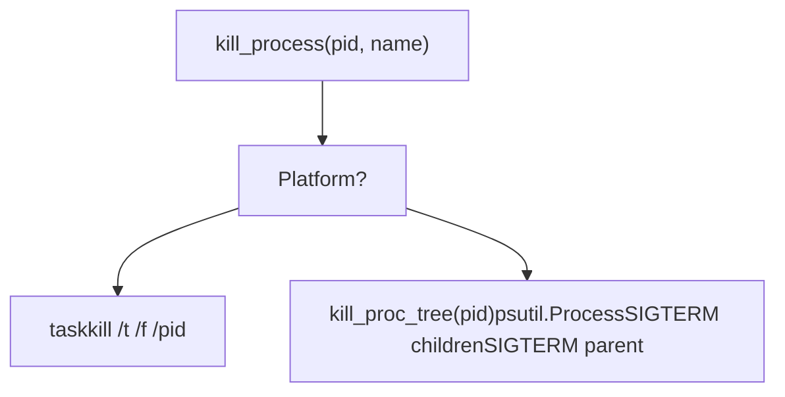
**Sources:** [webui.py204-265](https://github.com/RVC-Boss/GPT-SoVITS/blob/c767f0b8/webui.py#L204-L265) [webui.py211-241](https://github.com/RVC-Boss/GPT-SoVITS/blob/c767f0b8/webui.py#L211-L241)

---

## Data Preparation Tools (Tab 0)

Tab 0 provides access to four preprocessing tools that prepare raw audio and text for training. Each tool runs as an independent subprocess.

### Tool Architecture

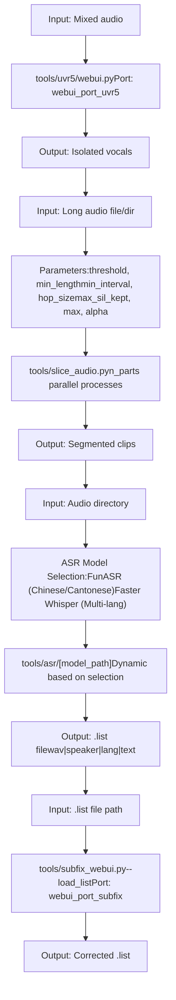
### ASR Model Selection Logic

The ASR tool dynamically selects appropriate models based on user choice:

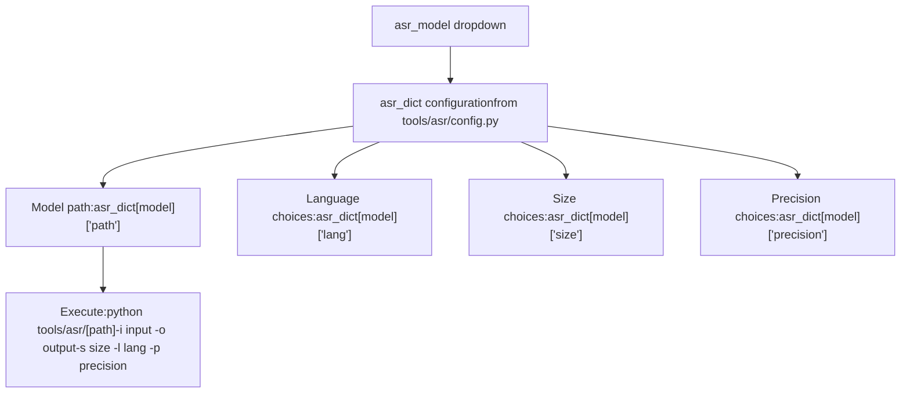
**Dynamic UI Updates:**

-   `change_lang_choices()`: Updates available languages when model changes
-   `change_size_choices()`: Updates available model sizes
-   `change_precision_choices()`: Auto-selects precision based on GPU memory and `is_half`

**Sources:** [webui.py1315-1475](https://github.com/RVC-Boss/GPT-SoVITS/blob/c767f0b8/webui.py#L1315-L1475) [webui.py371-414](https://github.com/RVC-Boss/GPT-SoVITS/blob/c767f0b8/webui.py#L371-L414) [webui.py1434-1454](https://github.com/RVC-Boss/GPT-SoVITS/blob/c767f0b8/webui.py#L1434-L1454)

---

## Training Pipeline (Tab 1)

Tab 1 orchestrates the complete training workflow from dataset formatting through model training. It consists of two main sections: dataset preparation (1A) and model training (1B).

### Dataset Formatting Pipeline (1A)

The dataset formatting stage consists of three sequential feature extraction steps that can be run individually or as a combined pipeline.

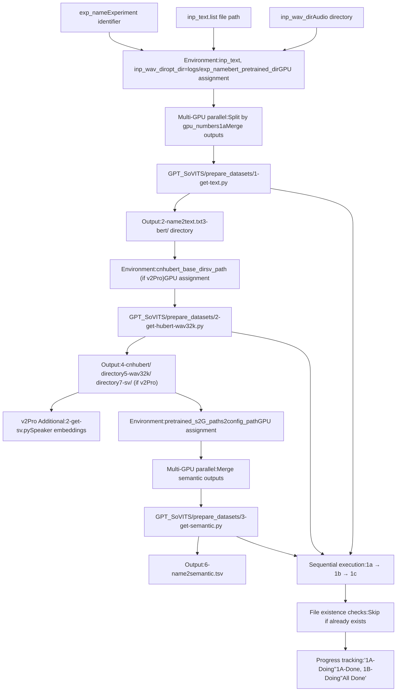
**Process Management Pattern:**

Each feature extraction step (`open1a`, `open1b`, `open1c`) follows this pattern:

1.  Check if process list is empty (`ps1a == []`, etc.)
2.  Build configuration dictionary with paths and GPU assignments
3.  Parse GPU string (e.g., "0-1-2") to create parallel processes
4.  Set environment variables for each process
5.  Spawn `subprocess.Popen` for each GPU
6.  Wait for all processes to complete
7.  Merge output files if split across GPUs
8.  Clear process list

**Combined Pipeline (`open1abc`):**

The combined pipeline function executes all three steps sequentially with smart skipping:

-   Checks if `2-name2text.txt` exists before running 1a
-   Checks if `6-name2semantic.tsv` exists before running 1c
-   Always runs 1b (SSL extraction)
-   Handles v2Pro additional SV extraction
-   Provides progress updates through UI

**Sources:** [webui.py780-862](https://github.com/RVC-Boss/GPT-SoVITS/blob/c767f0b8/webui.py#L780-L862) [webui.py870-953](https://github.com/RVC-Boss/GPT-SoVITS/blob/c767f0b8/webui.py#L870-L953) [webui.py960-1039](https://github.com/RVC-Boss/GPT-SoVITS/blob/c767f0b8/webui.py#L960-L1039) [webui.py1046-1261](https://github.com/RVC-Boss/GPT-SoVITS/blob/c767f0b8/webui.py#L1046-L1261)

### Model Training Pipeline (1B)

After dataset formatting, models are trained using the extracted features.

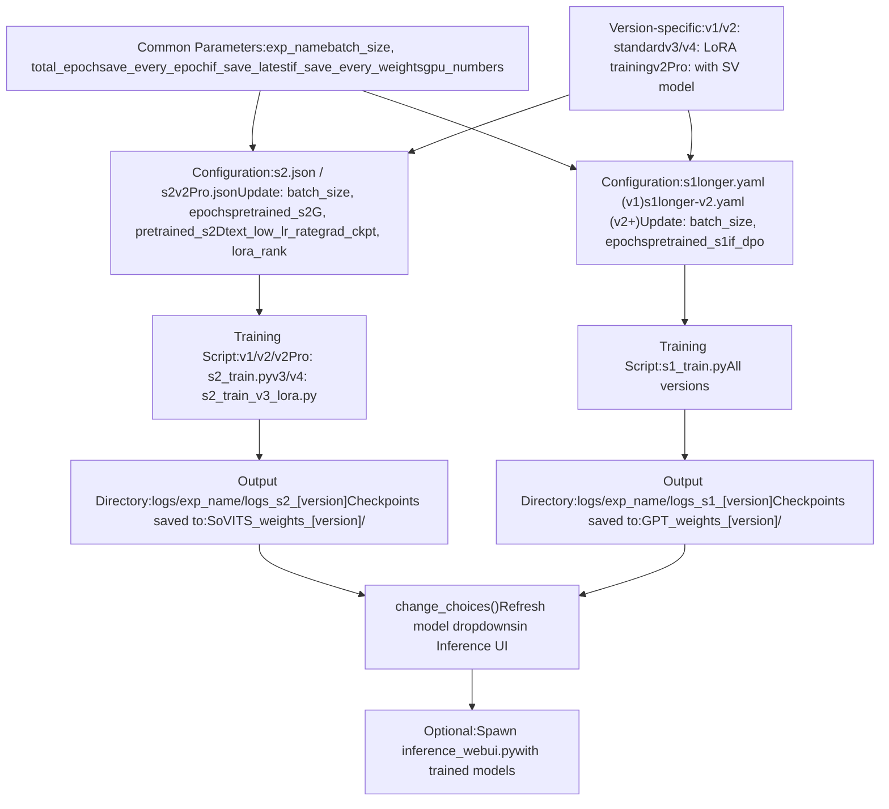
**Training Configuration Construction:**

Both training functions (`open1Ba` for SoVITS, `open1Bb` for GPT) follow this pattern:

1.  Check if training process is None
2.  Load base configuration (JSON for SoVITS, YAML for GPT)
3.  Update configuration with user parameters
4.  Adjust for half-precision (`is_half == False` halves batch size)
5.  Set version-specific paths and parameters
6.  Write temporary config to `TEMP/tmp_s1.yaml` or `TEMP/tmp_s2.json`
7.  Build command with Python executable and config path
8.  Spawn training process and wait for completion
9.  Refresh model weight dropdowns
10.  Clear process variable

**Version-Specific Training Differences:**

| Version | SoVITS Script | Config | Training Type | Notes |
| --- | --- | --- | --- | --- |
| v1/v2 | `s2_train.py` | `s2.json` | Standard | Full model training |
| v2Pro/ProPlus | `s2_train.py` | `s2v2Pro.json` | Standard + SV | Speaker verification integrated |
| v3 | `s2_train_v3_lora.py` | `s2.json` | LoRA | Efficient 8GB training |
| v4 | `s2_train_v3_lora.py` | `s2.json` | LoRA | Same as v3 |

**Sources:** [webui.py489-583](https://github.com/RVC-Boss/GPT-SoVITS/blob/c767f0b8/webui.py#L489-L583) [webui.py590-675](https://github.com/RVC-Boss/GPT-SoVITS/blob/c767f0b8/webui.py#L590-L675)

---

## Model Version Management

The Main WebUI provides unified version selection that configures all dependent paths and parameters.

### Version Switching Mechanism

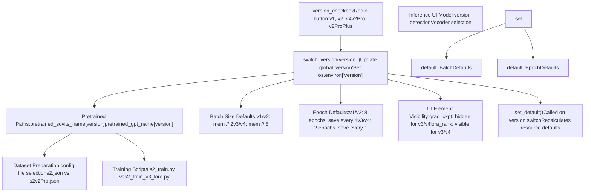
**Version-Specific Resource Allocation:**

The `set_default()` function adjusts training parameters based on version and GPU memory:

```
# Memory-based batch size calculationif version not in v3v4set:  # v1, v2, v2Pro, v2ProPlus    default_batch_size = minmem // 2    default_sovits_epoch = 8    default_sovits_save_every_epoch = 4else:  # v3, v4    default_batch_size = minmem // 8  # LoRA uses less memory    default_sovits_epoch = 2    default_sovits_save_every_epoch = 1
```
**Version Detection and Validation:**

On startup, the WebUI checks for pretrained model existence:

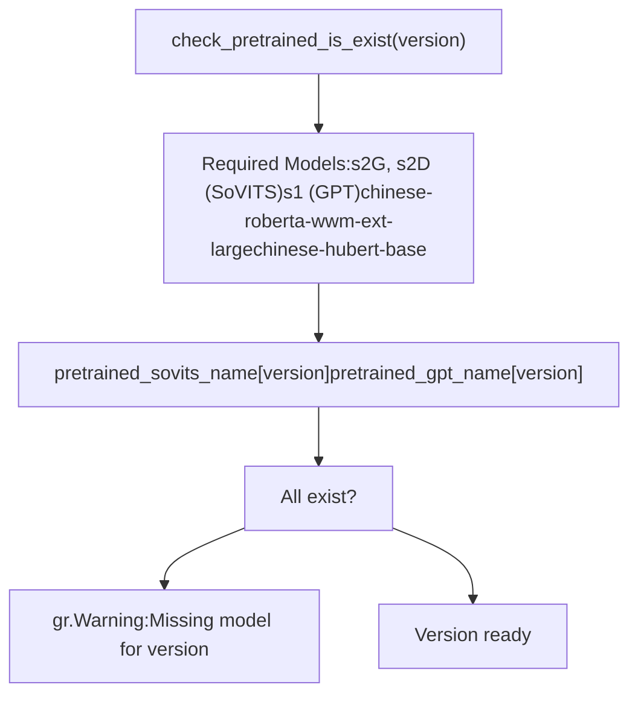
**Sources:** [webui.py104-139](https://github.com/RVC-Boss/GPT-SoVITS/blob/c767f0b8/webui.py#L104-L139) [webui.py1264-1290](https://github.com/RVC-Boss/GPT-SoVITS/blob/c767f0b8/webui.py#L1264-L1290) [webui.py167-189](https://github.com/RVC-Boss/GPT-SoVITS/blob/c767f0b8/webui.py#L167-L189)

---

## Configuration and Resource Management

The Main WebUI integrates with `config.py` for system-wide settings and manages GPU resources.

### Configuration Integration

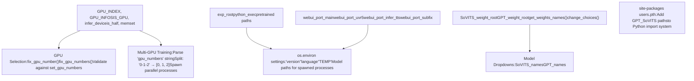
**GPU Assignment Strategy:**

The WebUI uses two GPU selection mechanisms:

1.  **Single GPU Selection:** For processes requiring one GPU (inference, denoise)

    -   `fix_gpu_number(input)`: Validates and constrains to available GPUs
    -   Falls back to `default_gpu_numbers` if invalid
2.  **Multi-GPU Selection:** For parallel data processing and training

    -   Format: "0-1-2" for GPUs 0, 1, and 2
    -   Each GPU gets its own process
    -   `_CUDA_VISIBLE_DEVICES` environment variable set per process

**Model Weight Discovery:**

The weight discovery system scans directories and provides dropdown choices:

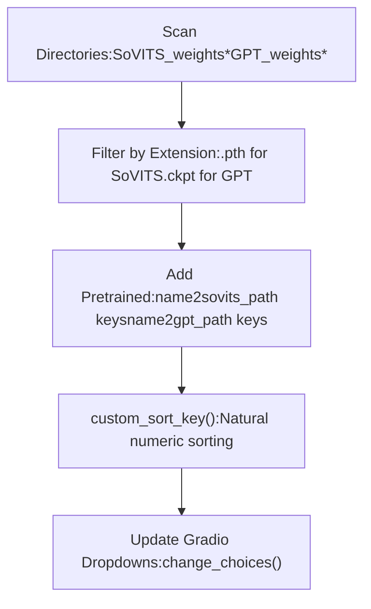
**Sources:** [webui.py71-100](https://github.com/RVC-Boss/GPT-SoVITS/blob/c767f0b8/webui.py#L71-L100) [webui.py145-161](https://github.com/RVC-Boss/GPT-SoVITS/blob/c767f0b8/webui.py#L145-L161) [webui.py191-202](https://github.com/RVC-Boss/GPT-SoVITS/blob/c767f0b8/webui.py#L191-L202) [config.py86-121](https://github.com/RVC-Boss/GPT-SoVITS/blob/c767f0b8/config.py#L86-L121)

---

## Process Execution and Environment Setup

Each subprocess spawned by the Main WebUI follows a consistent execution pattern with careful environment configuration.

### Subprocess Command Construction

**Example: Feature Extraction Process Setup**

For `1-get-text.py` (BERT feature extraction):

1.  **Configuration Dictionary:**

    ```
    config = {    "inp_text": inp_text,    "inp_wav_dir": inp_wav_dir,    "exp_name": exp_name,    "opt_dir": f"{exp_root}/{exp_name}",    "bert_pretrained_dir": bert_pretrained_dir,    "i_part": "0",  # Process index    "all_parts": "3",  # Total processes    "_CUDA_VISIBLE_DEVICES": "1",  # GPU assignment    "is_half": "True"}
    ```

2.  **Environment Update:**

    ```
    os.environ.update(config)
    ```

3.  **Command Construction:**

    ```
    cmd = '"%s" -s GPT_SoVITS/prepare_datasets/1-get-text.py' % python_exec
    ```

4.  **Execution:**

    ```
    p = Popen(cmd, shell=True)ps1a.append(p)  # Track process
    ```


**Training Process Configuration:**

Training processes receive configuration via temporary files instead of environment variables:

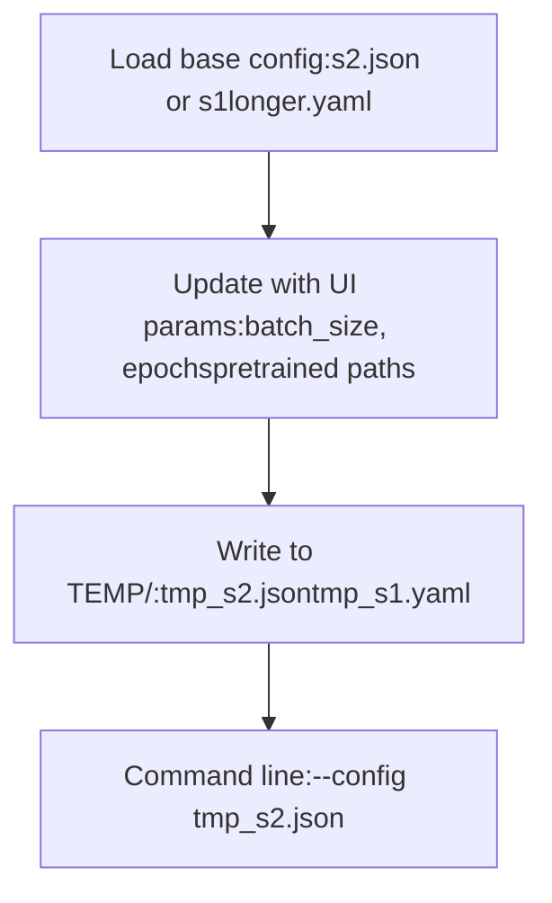
**Sources:** [webui.py808-811](https://github.com/RVC-Boss/GPT-SoVITS/blob/c767f0b8/webui.py#L808-L811) [webui.py542-544](https://github.com/RVC-Boss/GPT-SoVITS/blob/c767f0b8/webui.py#L542-L544) [webui.py636](https://github.com/RVC-Boss/GPT-SoVITS/blob/c767f0b8/webui.py#L636-L636) [webui.py504-540](https://github.com/RVC-Boss/GPT-SoVITS/blob/c767f0b8/webui.py#L504-L540)

---

## UI Structure and State Management

The Main WebUI uses Gradio's component system with careful state management for process control.

### Gradio Application Structure

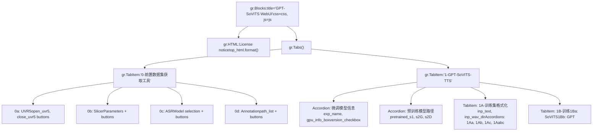
**Button State Management Pattern:**

Each process control uses paired buttons with visibility toggling:

> **[Mermaid stateDiagram]**
> *(图表结构无法解析)*

**Event Handlers:**

All button clicks use `.click()` handlers that yield multiple UI updates:

```
button_open.click(    open_function,    [input1, input2, ...],  # Input components    [info_box, button_open, button_close, output1, ...]  # Output components)
```
**Update Dictionary Format:**

Functions yield update dictionaries to modify UI components:

```
yield (    "Process started",  # info_box text    {"__type__": "update", "visible": False},  # Hide open button    {"__type__": "update", "visible": True},   # Show close button    {"__type__": "update", "value": result}    # Update output)
```
**Sources:** [webui.py1305-1650](https://github.com/RVC-Boss/GPT-SoVITS/blob/c767f0b8/webui.py#L1305-L1650) [webui.py270-295](https://github.com/RVC-Boss/GPT-SoVITS/blob/c767f0b8/webui.py#L270-L295) [webui.py545-571](https://github.com/RVC-Boss/GPT-SoVITS/blob/c767f0b8/webui.py#L545-L571)

---

## Internationalization Support

The Main WebUI supports multiple languages through the i18n system, with dynamic language selection.

### Language System Integration

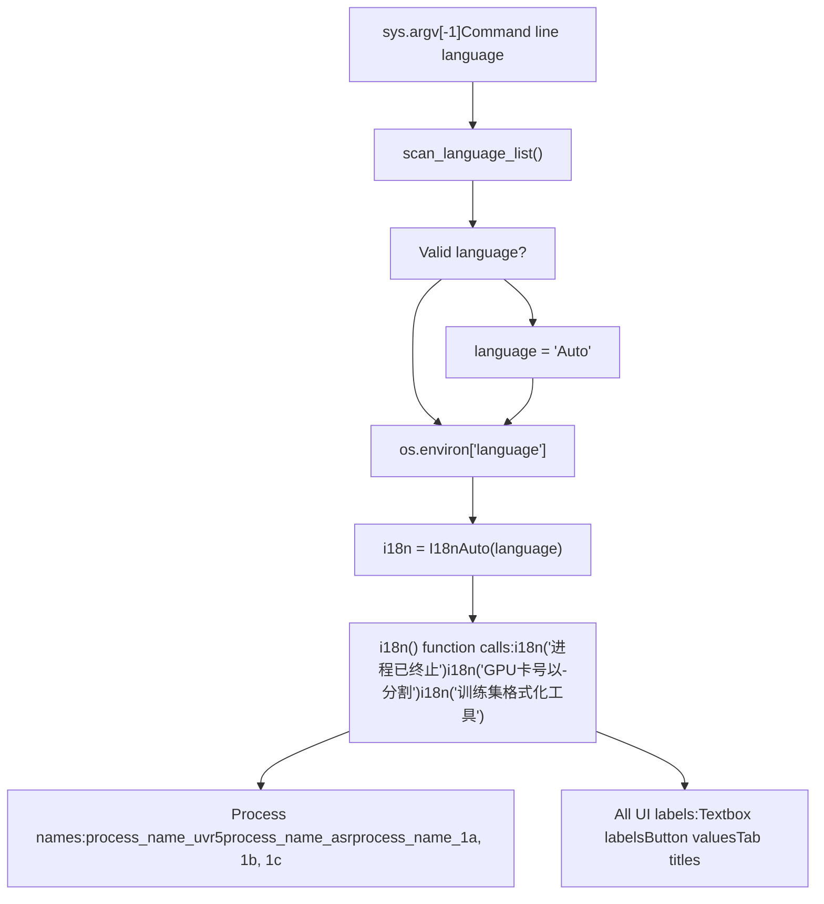
**Process Status Messages:**

The `process_info()` function translates status indicators:

| Indicator | Chinese Example | Function |
| --- | --- | --- |
| "opened" | "已开启" | Process started |
| "closed" | "已关闭" | Process terminated |
| "running" | "运行中" | Process executing |
| "occupy" | "占用中,需先终止才能开启下一次任务" | Cannot start (busy) |
| "finish" | "已完成" | Completed successfully |
| "failed" | "失败" | Execution failed |

**Sources:** [webui.py64-68](https://github.com/RVC-Boss/GPT-SoVITS/blob/c767f0b8/webui.py#L64-L68) [webui.py244-264](https://github.com/RVC-Boss/GPT-SoVITS/blob/c767f0b8/webui.py#L244-L264) [webui.py267](https://github.com/RVC-Boss/GPT-SoVITS/blob/c767f0b8/webui.py#L267-L267)

---

## Integration Points

The Main WebUI serves as the central hub that integrates with all other system components.

### System Integration Map

```mermaid
flowchart TD
    CoreUI["Process ManagementTab OrganizationVersion Control"]
    UVR5UI["tools/uvr5/webui.pyPort: 9873"]
    SubfixUI["tools/subfix_webui.pyPort: 9871"]
    InferUI["inference_webui.pyinference_webui_fast.pyPort: 9872"]
    GetText["1-get-text.pyBERT features"]
    GetHubert["2-get-hubert-wav32k.pySSL features"]
    GetSV["2-get-sv.pySpeaker embeddings"]
    GetSemantic["3-get-semantic.pySemantic tokens"]
    SliceAudio["slice_audio.pyAudio segmentation"]
    ASRScripts["tools/asr/*.pyFunASR/Whisper"]
    Denoise["cmd-denoise.pyNoise reduction"]
    S1Train["s1_train.pyGPT training"]
    S2Train["s2_train.pySoVITS v1/v2"]
    S2TrainLora["s2_train_v3_lora.pySoVITS v3/v4"]
    ConfigPy["config.pyGlobal settingsPath managementGPU detection"]
    WeightMgmt["Weight directories:SoVITS_weights_*GPT_weights_*"]
    PretrainedMgmt["pretrained_models/Base modelsBERT, HuBERT"]
    MyUtils["tools/my_utils.pyclean_path()check_for_existance()"]
    ProcessCkpt["process_ckpt.pyVersion detectionModel loading"]
    I18nSystem["tools/i18n/Multi-language support"]

    CoreUI --> UVR5UI
    CoreUI --> SubfixUI
    CoreUI --> InferUI
    CoreUI --> GetText
    CoreUI --> GetHubert
    CoreUI --> GetSV
    CoreUI --> GetSemantic
    CoreUI --> SliceAudio
    CoreUI --> ASRScripts
    CoreUI --> Denoise
    CoreUI --> S1Train
    CoreUI --> S2Train
    CoreUI --> S2TrainLora
    CoreUI --> ConfigPy
    CoreUI --> MyUtils
    CoreUI --> I18nSystem
    ConfigPy --> WeightMgmt
    ConfigPy --> PretrainedMgmt
    S1Train --> WeightMgmt
    S2Train --> WeightMgmt
    S2TrainLora --> WeightMgmt
```
**Port Allocation:**

| Interface | Port | Config Variable |
| --- | --- | --- |
| Main WebUI | 9874 | `webui_port_main` |
| Inference WebUI | 9872 | `webui_port_infer_tts` |
| UVR5 WebUI | 9873 | `webui_port_uvr5` |
| Annotation WebUI | 9871 | `webui_port_subfix` |
| REST API | 9880 | `api_port` |

**Cross-Component Communication:**

1.  **Model Weight Updates:** After training completes, `change_choices()` scans weight directories and updates inference UI dropdowns

2.  **Environment Variable Passing:** Inference WebUI receives model paths via environment variables:

    ```
    os.environ["gpt_path"] = gpt_pathos.environ["sovits_path"] = sovits_pathos.environ["cnhubert_base_path"] = cnhubert_base_path
    ```

3.  **Temporary File Communication:** Training scripts receive configuration through temporary JSON/YAML files in `TEMP/`

4.  **File-Based Output:** Data processing scripts write to experiment directory (`logs/exp_name/`), which training scripts read


**Sources:** [webui.py331-363](https://github.com/RVC-Boss/GPT-SoVITS/blob/c767f0b8/webui.py#L331-L363) [config.py140-146](https://github.com/RVC-Boss/GPT-SoVITS/blob/c767f0b8/config.py#L140-L146) [webui.py556-562](https://github.com/RVC-Boss/GPT-SoVITS/blob/c767f0b8/webui.py#L556-L562)

---

## Summary

The Main WebUI (`webui.py`) provides centralized orchestration for the entire GPT-SoVITS workflow through:

-   **Process Management:** Global variables track spawned subprocesses, with consistent open/close patterns and resource cleanup
-   **Tab-Based Organization:** Tab 0 for data preparation tools, Tab 1 for dataset formatting and training
-   **Version Control:** Unified version selection adjusts paths, resource allocation, and training scripts
-   **Multi-GPU Support:** Parallel process spawning for data preparation with GPU-specific environment configuration
-   **Configuration Integration:** Deep integration with `config.py` for system-wide settings and model discovery
-   **Subprocess Coordination:** Standardized command building, environment setup, and process lifecycle management

The Main WebUI is designed for training workflows. After models are trained, use the Inference WebUI for interactive generation or the REST API for programmatic access.
