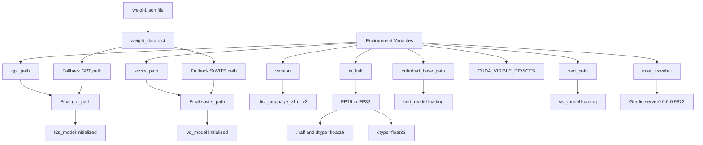
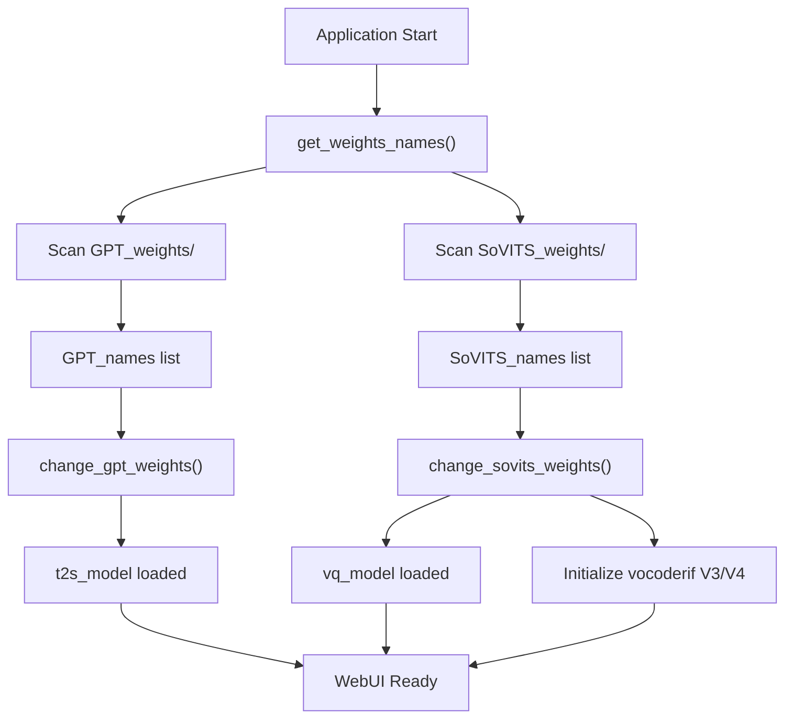
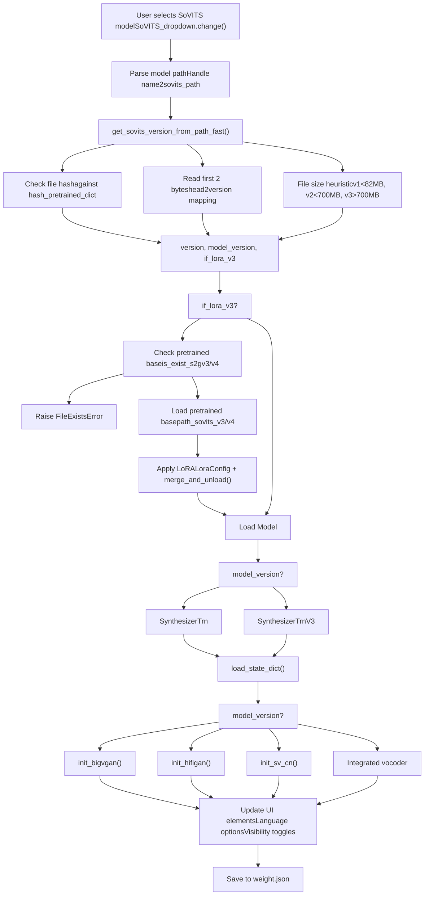
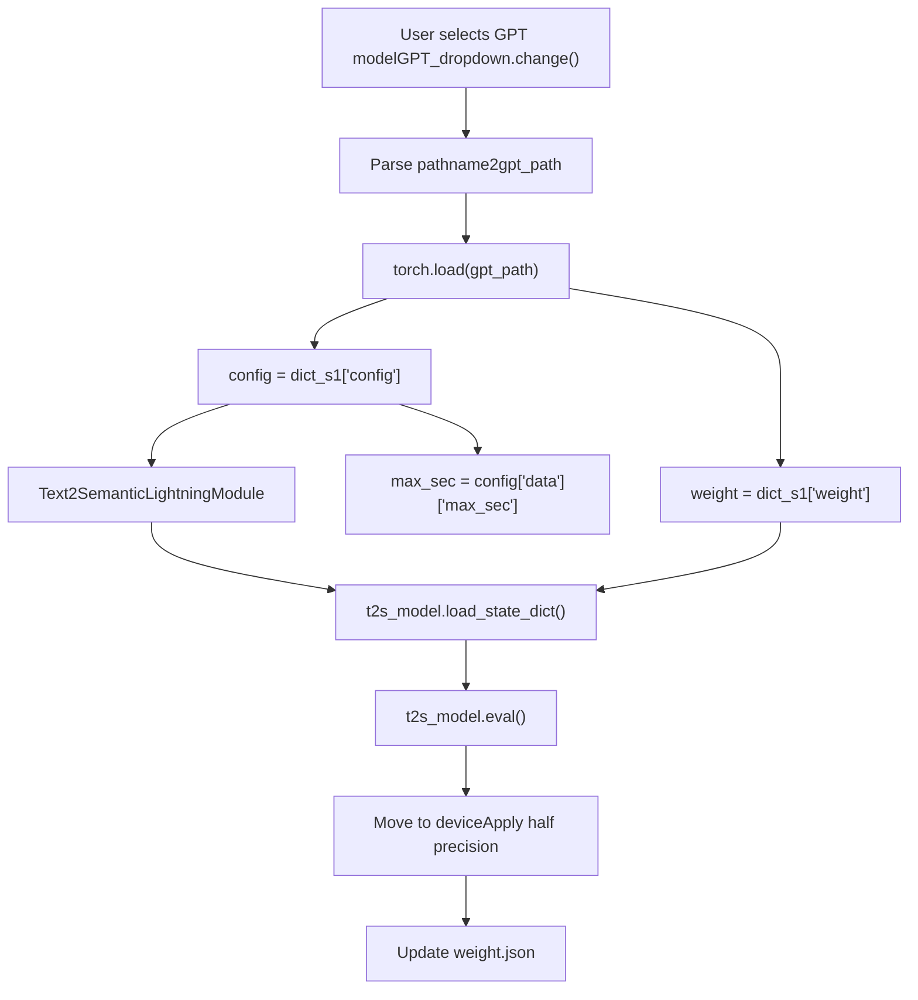
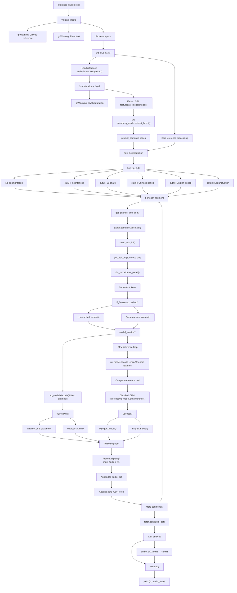
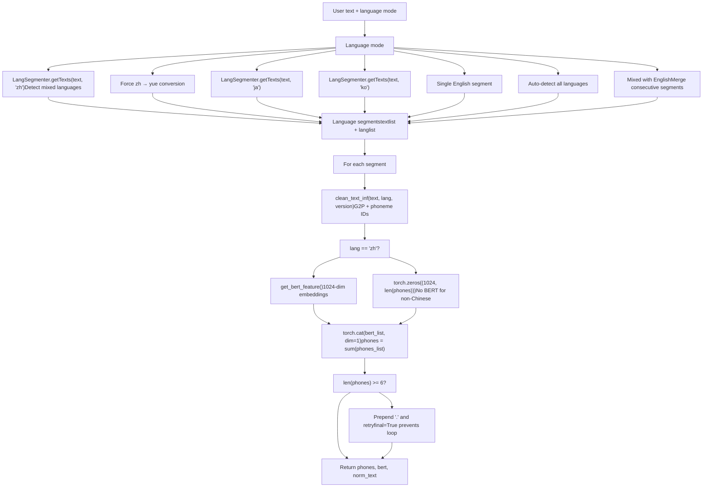
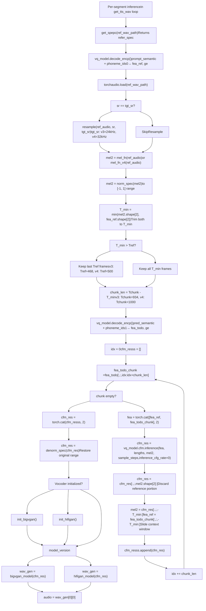
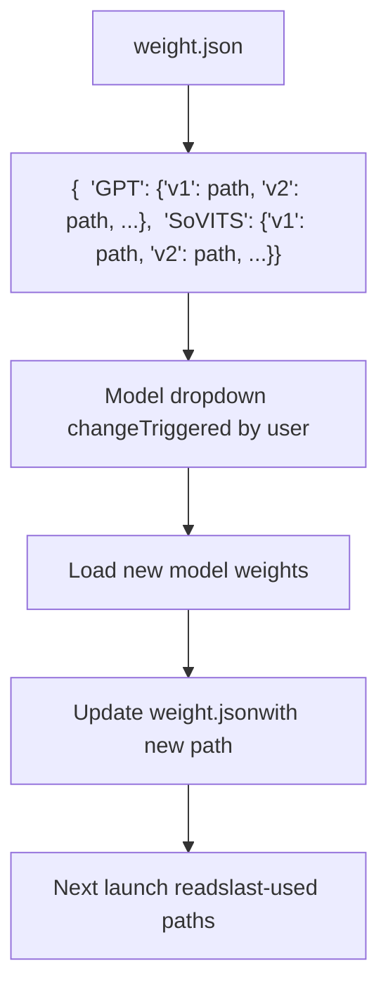
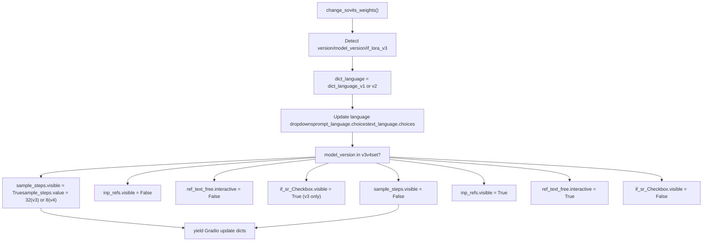
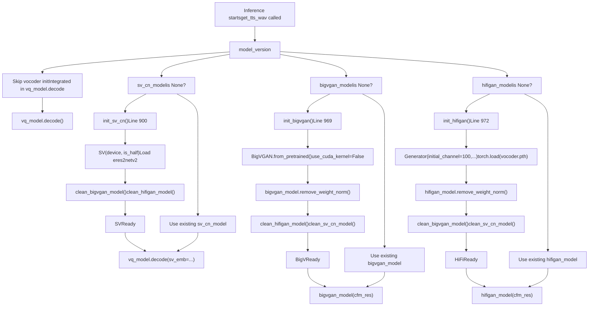

# Inference WebUI

Relevant source files

-   [GPT\_SoVITS/inference\_webui.py](https://github.com/RVC-Boss/GPT-SoVITS/blob/c767f0b8/GPT_SoVITS/inference_webui.py)
-   [GPT\_SoVITS/inference\_webui\_fast.py](https://github.com/RVC-Boss/GPT-SoVITS/blob/c767f0b8/GPT_SoVITS/inference_webui_fast.py)
-   [GPT\_SoVITS/process\_ckpt.py](https://github.com/RVC-Boss/GPT-SoVITS/blob/c767f0b8/GPT_SoVITS/process_ckpt.py)
-   [tools/assets.py](https://github.com/RVC-Boss/GPT-SoVITS/blob/c767f0b8/tools/assets.py)

The Inference WebUI is a dedicated Gradio-based interface for TTS generation, separate from the comprehensive [Main WebUI](/RVC-Boss/GPT-SoVITS/3.1-main-webui). It provides a streamlined experience focused exclusively on inference with trained GPT-SoVITS models. Users can upload reference audio, configure synthesis parameters, and generate speech without training capabilities.

This interface serves as the interactive frontend, while programmatic access is available via [REST API](/RVC-Boss/GPT-SoVITS/3.3-rest-api). The underlying inference implementation is documented in [TTS Inference Process](/RVC-Boss/GPT-SoVITS/7.1-tts-inference-process).

## Overview and Architecture

GPT-SoVITS provides two inference WebUI implementations with different architectural philosophies:

### Architecture Comparison: Direct vs Pipeline


**Sources:** [GPT\_SoVITS/inference\_webui.py1-220](https://github.com/RVC-Boss/GPT-SoVITS/blob/c767f0b8/GPT_SoVITS/inference_webui.py#L1-L220) [GPT\_SoVITS/inference\_webui\_fast.py1-148](https://github.com/RVC-Boss/GPT-SoVITS/blob/c767f0b8/GPT_SoVITS/inference_webui_fast.py#L1-L148) [TTS\_infer\_pack/TTS.py](https://github.com/RVC-Boss/GPT-SoVITS/blob/c767f0b8/TTS_infer_pack/TTS.py)

**Implementation Selection Guide:**

| Aspect | inference\_webui.py | inference\_webui\_fast.py |
| --- | --- | --- |
| **Code organization** | Models loaded as global variables | Encapsulated in `TTS` class |
| **Inference logic** | Inline in `get_tts_wav()` [751-1001](https://github.com/RVC-Boss/GPT-SoVITS/blob/c767f0b8/751-1001) | Delegated to `tts_pipeline.run()` [198-199](https://github.com/RVC-Boss/GPT-SoVITS/blob/c767f0b8/198-199) |
| **Model loading** | Manual `torch.load()` + `load_state_dict()` [281-342](https://github.com/RVC-Boss/GPT-SoVITS/blob/c767f0b8/281-342) | `tts_pipeline.init_vits_weights()` [279](https://github.com/RVC-Boss/GPT-SoVITS/blob/c767f0b8/279) |
| **Customization** | Direct access to all model operations | Limited by `TTS` API surface |
| **Maintenance** | Requires understanding full inference flow | Higher-level abstractions |
| **Use when** | Debugging, research, custom modifications | Production deployments, standard inference |
| **Code size** | ~1350 lines | ~520 lines |

The fast implementation is recommended for most users. The standard implementation provides lower-level access for advanced use cases requiring custom inference logic.

## Application Initialization

### Startup Configuration Flow


**Sources:** [GPT\_SoVITS/inference\_webui.py45-92](https://github.com/RVC-Boss/GPT-SoVITS/blob/c767f0b8/GPT_SoVITS/inference_webui.py#L45-L92) [GPT\_SoVITS/inference\_webui.py163-169](https://github.com/RVC-Boss/GPT-SoVITS/blob/c767f0b8/GPT_SoVITS/inference_webui.py#L163-L169) [GPT\_SoVITS/inference\_webui\_fast.py45-148](https://github.com/RVC-Boss/GPT-SoVITS/blob/c767f0b8/GPT_SoVITS/inference_webui_fast.py#L45-L148)

**Configuration Priority:**

1.  Environment variables (highest)
2.  `weight.json` persisted paths
3.  Default values from `get_weights_names()` scan

**Key Initialization Steps:**

-   `set_high_priority()` [12-22](https://github.com/RVC-Boss/GPT-SoVITS/blob/c767f0b8/12-22): Sets process priority on Windows
-   `get_weights_names()` [49](https://github.com/RVC-Boss/GPT-SoVITS/blob/c767f0b8/49): Scans `GPT_weights/` and `SoVITS_weights/` directories
-   `change_gpt_weights(gpt_path)` [376-398](https://github.com/RVC-Boss/GPT-SoVITS/blob/c767f0b8/376-398): Loads GPT checkpoint
-   `change_sovits_weights(sovits_path)` [229-368](https://github.com/RVC-Boss/GPT-SoVITS/blob/c767f0b8/229-368): Loads SoVITS model and initializes vocoders

### Model Loading on Startup


**Sources:** [GPT\_SoVITS/inference\_webui.py376-400](https://github.com/RVC-Boss/GPT-SoVITS/blob/c767f0b8/GPT_SoVITS/inference_webui.py#L376-L400) [GPT\_SoVITS/inference\_webui\_fast.py125-148](https://github.com/RVC-Boss/GPT-SoVITS/blob/c767f0b8/GPT_SoVITS/inference_webui_fast.py#L125-L148) [config.py](https://github.com/RVC-Boss/GPT-SoVITS/blob/c767f0b8/config.py)

## Gradio Interface Structure

### Main Interface Layout

The Gradio interface is organized into four main sections:

**Sources:** [GPT\_SoVITS/inference\_webui.py1134-1327](https://github.com/RVC-Boss/GPT-SoVITS/blob/c767f0b8/GPT_SoVITS/inference_webui.py#L1134-L1327) [GPT\_SoVITS/inference\_webui\_fast.py306-480](https://github.com/RVC-Boss/GPT-SoVITS/blob/c767f0b8/GPT_SoVITS/inference_webui_fast.py#L306-L480)

### Interface Component Details

| Component | Type | Purpose | Key Parameters |
| --- | --- | --- | --- |
| `GPT_dropdown` | Dropdown | Select GPT checkpoint | Sorted by `custom_sort_key()` |
| `SoVITS_dropdown` | Dropdown | Select SoVITS checkpoint | Auto-updates language options |
| `inp_ref` | Audio | Upload reference audio | 3-10 second range enforced |
| `prompt_text` | Textbox | Reference audio transcript | Lines: 5, validates in inference |
| `ref_text_free` | Checkbox | Enable no-prompt mode | Disabled for V3/V4 models |
| `inp_refs` | File | Multiple reference audios | Hidden for V3/V4, average fusion |
| `text` | Textbox | Target synthesis text | Lines: 26, supports newlines |
| `how_to_cut` | Dropdown | Text segmentation method | 6 options from `cut1`\-`cut5` |
| `sample_steps` | Radio | CFM sampling steps V3/V4 | V3: \[4,8,16,32,64,128\], V4: \[4,8,16,32\] |
| `if_sr_Checkbox` | Checkbox | Super-resolution 24→48kHz | V3 only, optional |

## Model Loading and Switching

### SoVITS Model Loading Process


**Sources:** [GPT\_SoVITS/inference\_webui.py229-368](https://github.com/RVC-Boss/GPT-SoVITS/blob/c767f0b8/GPT_SoVITS/inference_webui.py#L229-L368) [GPT\_SoVITS/process\_ckpt.py100-139](https://github.com/RVC-Boss/GPT-SoVITS/blob/c767f0b8/GPT_SoVITS/process_ckpt.py#L100-L139)

Key functions:

-   **`change_sovits_weights(sovits_path)`** [inference\_webui.py229-368](https://github.com/RVC-Boss/GPT-SoVITS/blob/c767f0b8/inference_webui.py#L229-L368): Main orchestrator
-   **`get_sovits_version_from_path_fast()`** [process\_ckpt.py100-126](https://github.com/RVC-Boss/GPT-SoVITS/blob/c767f0b8/process_ckpt.py#L100-L126): Determines version via hash/header/size
-   **`load_sovits_new()`** [process\_ckpt.py129-138](https://github.com/RVC-Boss/GPT-SoVITS/blob/c767f0b8/process_ckpt.py#L129-L138): Handles custom header format

### Version Detection Strategy

| Method | Check | Version Result |
| --- | --- | --- |
| Hash lookup | First 8KB MD5 hash | Exact pretrained model identification |
| Header bytes | First 2 bytes | `b"03"`→v3 LoRA, `b"04"`→v4 LoRA, `b"05"`→v2Pro |
| File size | Total bytes | <82MB→v1, <700MB→v2, >700MB→v3 |

**Sources:** [GPT\_SoVITS/process\_ckpt.py72-126](https://github.com/RVC-Boss/GPT-SoVITS/blob/c767f0b8/GPT_SoVITS/process_ckpt.py#L72-L126)

### GPT Model Loading


**Sources:** [GPT\_SoVITS/inference\_webui.py376-398](https://github.com/RVC-Boss/GPT-SoVITS/blob/c767f0b8/GPT_SoVITS/inference_webui.py#L376-L398) [GPT\_SoVITS/inference\_webui\_fast.py300-304](https://github.com/RVC-Boss/GPT-SoVITS/blob/c767f0b8/GPT_SoVITS/inference_webui_fast.py#L300-L304)

The GPT model uses a checkpoint dictionary with:

-   `config`: Training configuration including `max_sec` duration limit
-   `weight`: Model state dictionary

## Inference Process

### End-to-End TTS Generation Flow


**Sources:** [GPT\_SoVITS/inference\_webui.py751-1001](https://github.com/RVC-Boss/GPT-SoVITS/blob/c767f0b8/GPT_SoVITS/inference_webui.py#L751-L1001) [GPT\_SoVITS/inference\_webui\_fast.py150-202](https://github.com/RVC-Boss/GPT-SoVITS/blob/c767f0b8/GPT_SoVITS/inference_webui_fast.py#L150-L202)

### Text Segmentation Methods

The `how_to_cut` dropdown controls how long input text is split into manageable segments for synthesis:

| UI Label | Function | Implementation Logic |
| --- | --- | --- |
| 不切 | No segmentation | Text processed as single segment |
| 凑四句一切 | `cut1()` [1023-1035](https://github.com/RVC-Boss/GPT-SoVITS/blob/c767f0b8/1023-1035) | `split()` on punctuation → group 4 segments → `merge_short_text_in_array()` |
| 凑50字一切 | `cut2()` [1038-1060](https://github.com/RVC-Boss/GPT-SoVITS/blob/c767f0b8/1038-1060) | Accumulate chars until >50 → merge last if <50 |
| 按中文句号。切 | `cut3()` [1063-1067](https://github.com/RVC-Boss/GPT-SoVITS/blob/c767f0b8/1063-1067) | `inp.strip("。").split("。")` |
| 按英文句号.切 | `cut4()` [1070-1074](https://github.com/RVC-Boss/GPT-SoVITS/blob/c767f0b8/1070-1074) | `re.split(r"(?<!\d)\.(?!\d)")` (excludes decimals) |
| 按标点符号切 | `cut5()` [1078-1099](https://github.com/RVC-Boss/GPT-SoVITS/blob/c767f0b8/1078-1099) | Split on any punctuation, preserve decimal points |

**Filtering:** All methods remove punctuation-only segments via `set(item).issubset(punctuation)` [1034, 1059, 1066, 1073, 1098](https://github.com/RVC-Boss/GPT-SoVITS/blob/c767f0b8/1034, 1059, 1066, 1073, 1098)

**Processing flow:**

1.  User text passes through selected cut function
2.  Results split on `\n` → `texts.split("\n")` [844](https://github.com/RVC-Boss/GPT-SoVITS/blob/c767f0b8/844)
3.  Empty segments filtered by `process_text()` [1110-1119](https://github.com/RVC-Boss/GPT-SoVITS/blob/c767f0b8/1110-1119)
4.  Short segments merged by `merge_short_text_in_array(texts, 5)` [846](https://github.com/RVC-Boss/GPT-SoVITS/blob/c767f0b8/846)

**Sources:** [GPT\_SoVITS/inference\_webui.py831-846](https://github.com/RVC-Boss/GPT-SoVITS/blob/c767f0b8/GPT_SoVITS/inference_webui.py#L831-L846) [GPT\_SoVITS/inference\_webui.py1004-1119](https://github.com/RVC-Boss/GPT-SoVITS/blob/c767f0b8/GPT_SoVITS/inference_webui.py#L1004-L1119) [TTS\_infer\_pack/text\_segmentation\_method.py](https://github.com/RVC-Boss/GPT-SoVITS/blob/c767f0b8/TTS_infer_pack/text_segmentation_method.py)

### Language Processing Pipeline


**Sources:** [GPT\_SoVITS/inference\_webui.py601-667](https://github.com/RVC-Boss/GPT-SoVITS/blob/c767f0b8/GPT_SoVITS/inference_webui.py#L601-L667) [text/LangSegmenter.py](https://github.com/RVC-Boss/GPT-SoVITS/blob/c767f0b8/text/LangSegmenter.py)

Key observation: BERT features are **only extracted for Chinese text** (`lang == "zh"`). All other languages receive zero-filled tensors.

## Parameter Tuning Guide

### GPT Sampling Parameters

These parameters control the GPT model's semantic token generation in `t2s_model.model.infer_panel()` [878-888](https://github.com/RVC-Boss/GPT-SoVITS/blob/c767f0b8/878-888):

| Parameter | Range | Default | Purpose | Tuning Advice |
| --- | --- | --- | --- | --- |
| `top_k` | 1-100 | 15-20 | Limits token sampling pool | Lower = more deterministic, higher = more variety |
| `top_p` | 0.0-1.0 | 0.6-1.0 | Nucleus sampling cutoff | Lower = safer tokens, higher = riskier |
| `temperature` | 0.0-1.0 | 0.6-1.0 | Sampling distribution sharpness | Lower = stable, higher = creative but unstable |
| `repetition_penalty` | 0.0-2.0 | 1.35 | Penalizes repeated tokens | Only in fast mode; increase if stuttering |

**No-reference mode warning:** When `ref_text_free=True`, avoid very low values (top\_k<5, top\_p<0.4, temperature<0.4) as GPT lacks guidance from prompt context [1271](https://github.com/RVC-Boss/GPT-SoVITS/blob/c767f0b8/1271)

### Synthesis Control Parameters

| Parameter | Range | Default | Purpose | Notes |
| --- | --- | --- | --- | --- |
| `speed` | 0.6-1.65 | 1.0 | Playback speed multiplier | Applied via audio resampling [917, 921](https://github.com/RVC-Boss/GPT-SoVITS/blob/c767f0b8/917, 921) |
| `pause_second` | 0.1-0.5 | 0.3 | Inter-segment silence duration | Creates `zero_wav_torch` buffer [802-810](https://github.com/RVC-Boss/GPT-SoVITS/blob/c767f0b8/802-810) |
| `sample_steps` | v3: \[4,8,16,32,64,128\]
v4: \[4,8,16,32\] | v3: 32
v4: 8 | CFM sampling iterations | Higher = better quality but slower [958-960](https://github.com/RVC-Boss/GPT-SoVITS/blob/c767f0b8/958-960) |
| `if_sr` | Boolean | False | Super-resolution 24→48kHz | v3 only; helps with muffled output [993-998](https://github.com/RVC-Boss/GPT-SoVITS/blob/c767f0b8/993-998) |
| `if_freeze` | Boolean | False | Cache semantic tokens | Enables experimenting with synthesis params without re-running GPT [874-890](https://github.com/RVC-Boss/GPT-SoVITS/blob/c767f0b8/874-890) |

**Sources:** [GPT\_SoVITS/inference\_webui.py751-1001](https://github.com/RVC-Boss/GPT-SoVITS/blob/c767f0b8/GPT_SoVITS/inference_webui.py#L751-L1001) [GPT\_SoVITS/inference\_webui.py1250-1280](https://github.com/RVC-Boss/GPT-SoVITS/blob/c767f0b8/GPT_SoVITS/inference_webui.py#L1250-L1280) [GPT\_SoVITS/inference\_webui\_fast.py372-396](https://github.com/RVC-Boss/GPT-SoVITS/blob/c767f0b8/GPT_SoVITS/inference_webui_fast.py#L372-L396)

### V3/V4 CFM Inference Flow

Models v3 and v4 use Conditional Flow Matching with external vocoders instead of integrated synthesis:


**Sources:** [GPT\_SoVITS/inference\_webui.py923-976](https://github.com/RVC-Boss/GPT-SoVITS/blob/c767f0b8/GPT_SoVITS/inference_webui.py#L923-L976)

**Key Constants:**

| Version | Tref (reference frames) | Tchunk (total chunk) | chunk\_len | Sample rate | Mel function |
| --- | --- | --- | --- | --- | --- |
| v3 | 468 | 934 | 466 | 24kHz | `mel_fn()` [684-696](https://github.com/RVC-Boss/GPT-SoVITS/blob/c767f0b8/684-696) |
| v4 | 500 | 1000 | 500 | 32kHz | `mel_fn_v4()` [697-709](https://github.com/RVC-Boss/GPT-SoVITS/blob/c767f0b8/697-709) |

**Chunking Strategy:**

-   **fea\_ref**: Context from previous chunk (last T\_min frames)
-   **fea\_todo\_chunk**: New content to synthesize (chunk\_len frames)
-   **mel2**: Mel-spectrogram context for conditioning
-   Sliding window maintains coherence across long sequences

**CFM Parameters:**

-   `sample_steps` [958](https://github.com/RVC-Boss/GPT-SoVITS/blob/c767f0b8/958): Number of ODE integration steps (v3: 4-128, v4: 4-32)
-   `inference_cfg_rate=0` [959](https://github.com/RVC-Boss/GPT-SoVITS/blob/c767f0b8/959): Classifier-free guidance disabled

## Parameter Persistence and Caching

### Weight Persistence


**Sources:** [GPT\_SoVITS/inference\_webui.py57-71](https://github.com/RVC-Boss/GPT-SoVITS/blob/c767f0b8/GPT_SoVITS/inference_webui.py#L57-L71) [GPT\_SoVITS/inference\_webui.py362-367](https://github.com/RVC-Boss/GPT-SoVITS/blob/c767f0b8/GPT_SoVITS/inference_webui.py#L362-L367)

The `weight.json` file stores the most recently used model paths per version, allowing the WebUI to restore the previous session's model selection on restart.

### Inference Result Caching

The `if_freeze` checkbox enables caching of GPT-generated semantic tokens:

```
cache = {}  # Global cache dictionary # In get_tts_wav():if i_text in cache and if_freeze == True:    pred_semantic = cache[i_text]  # Use cached resultelse:    # Generate new semantic tokens    pred_semantic, idx = t2s_model.model.infer_panel(...)    cache[i_text] = pred_semantic  # Store for future use
```
**Sources:** [GPT\_SoVITS/inference\_webui.py748-890](https://github.com/RVC-Boss/GPT-SoVITS/blob/c767f0b8/GPT_SoVITS/inference_webui.py#L748-L890)

This allows users to adjust only SoVITS parameters (speed, vocoder, etc.) without re-running expensive GPT inference, useful for parameter experimentation.

## UI State Management

### Dynamic UI Updates

The SoVITS model change triggers multiple UI updates:


**Sources:** [GPT\_SoVITS/inference\_webui.py256-279](https://github.com/RVC-Boss/GPT-SoVITS/blob/c767f0b8/GPT_SoVITS/inference_webui.py#L256-L279) [GPT\_SoVITS/inference\_webui\_fast.py260-276](https://github.com/RVC-Boss/GPT-SoVITS/blob/c767f0b8/GPT_SoVITS/inference_webui_fast.py#L260-L276)

This ensures UI controls match model capabilities:

-   V3/V4 require `sample_steps` configuration
-   V3/V4 don't support multiple references (`inp_refs`)
-   V3/V4 don't support reference-free mode
-   V3 supports super-resolution

## Vocoder Management

Different model versions require different vocoders and auxiliary models:

### Model Version Requirements

| Model Version | Vocoder Type | Initialization Function | Model Path | Output Sample Rate |
| --- | --- | --- | --- | --- |
| v1 | Integrated | None | N/A (in SynthesizerTrn) | 32kHz |
| v2 | Integrated | None | N/A (in SynthesizerTrn) | 32kHz |
| v2Pro | Integrated + SV | `init_sv_cn()` [491-495](https://github.com/RVC-Boss/GPT-SoVITS/blob/c767f0b8/491-495) | `pretrained_eres2netv2w24s4ep4.ckpt` | 32kHz |
| v2ProPlus | Integrated + SV | `init_sv_cn()` [491-495](https://github.com/RVC-Boss/GPT-SoVITS/blob/c767f0b8/491-495) | `pretrained_eres2netv2w24s4ep4.ckpt` | 32kHz |
| v3 | BigVGAN v2 | `init_bigvgan()` [440-456](https://github.com/RVC-Boss/GPT-SoVITS/blob/c767f0b8/440-456) | `models--nvidia--bigvgan_v2_24khz_100band_256x` | 24kHz |
| v4 | HiFi-GAN v4 | `init_hifigan()` [459-485](https://github.com/RVC-Boss/GPT-SoVITS/blob/c767f0b8/459-485) | `gsv-v4-pretrained/vocoder.pth` | 48kHz |

**Sources:** [GPT\_SoVITS/inference\_webui.py440-504](https://github.com/RVC-Boss/GPT-SoVITS/blob/c767f0b8/GPT_SoVITS/inference_webui.py#L440-L504)

### Lazy Initialization Strategy


**Sources:** [GPT\_SoVITS/inference\_webui.py895-976](https://github.com/RVC-Boss/GPT-SoVITS/blob/c767f0b8/GPT_SoVITS/inference_webui.py#L895-L976)

### Memory Management Functions

Vocoder cleanup functions ensure only one vocoder occupies GPU memory:

```
def clean_bigvgan_model():  # Lines 418-426    global bigvgan_model    if bigvgan_model:        bigvgan_model = bigvgan_model.cpu()        bigvgan_model = None        torch.cuda.empty_cache() def clean_hifigan_model():  # Lines 407-415    # Similar pattern def clean_sv_cn_model():  # Lines 429-437    # Similar pattern, moves embedding_model to CPU
```
**Cleanup Trigger Points:**

-   `init_bigvgan()` calls `clean_hifigan_model()` + `clean_sv_cn_model()` [451-452](https://github.com/RVC-Boss/GPT-SoVITS/blob/c767f0b8/451-452)
-   `init_hifigan()` calls `clean_bigvgan_model()` + `clean_sv_cn_model()` [480-481](https://github.com/RVC-Boss/GPT-SoVITS/blob/c767f0b8/480-481)
-   `init_sv_cn()` calls `clean_bigvgan_model()` + `clean_hifigan_model()` [494-495](https://github.com/RVC-Boss/GPT-SoVITS/blob/c767f0b8/494-495)

This mutual exclusion prevents running multiple vocoders simultaneously.

## Implementation Comparison

### Feature Matrix

| Feature | inference\_webui.py | inference\_webui\_fast.py |
| --- | --- | --- |
| **Model loading** | Manual `torch.load()` [381](https://github.com/RVC-Boss/GPT-SoVITS/blob/c767f0b8/381) | `tts_pipeline.init_vits_weights()` [279](https://github.com/RVC-Boss/GPT-SoVITS/blob/c767f0b8/279) |
| **Version detection** | `get_sovits_version_from_path_fast()` [233](https://github.com/RVC-Boss/GPT-SoVITS/blob/c767f0b8/233) | Same [237](https://github.com/RVC-Boss/GPT-SoVITS/blob/c767f0b8/237) |
| **BERT extraction** | `get_bert_feature()` [171-184](https://github.com/RVC-Boss/GPT-SoVITS/blob/c767f0b8/171-184) | Inside `TTS.run()` |
| **SSL extraction** | `ssl_model.model()` [823](https://github.com/RVC-Boss/GPT-SoVITS/blob/c767f0b8/823) | Inside `TTS.run()` |
| **Text segmentation** | `cut1()`\-`cut5()` [1023-1099](https://github.com/RVC-Boss/GPT-SoVITS/blob/c767f0b8/1023-1099) | `get_method(cut_method)` [509](https://github.com/RVC-Boss/GPT-SoVITS/blob/c767f0b8/509) |
| **GPT inference** | `t2s_model.model.infer_panel()` [878](https://github.com/RVC-Boss/GPT-SoVITS/blob/c767f0b8/878) | Inside `TTS.run()` |
| **v1/v2 decode** | `vq_model.decode()` [916-922](https://github.com/RVC-Boss/GPT-SoVITS/blob/c767f0b8/916-922) | Inside `TTS.run()` |
| **v3/v4 CFM** | Inline loop [952-976](https://github.com/RVC-Boss/GPT-SoVITS/blob/c767f0b8/952-976) | Inside `TTS.run()` |
| **Caching** | Manual `cache[i_text]` dict [748, 874-890](https://github.com/RVC-Boss/GPT-SoVITS/blob/c767f0b8/748, 874-890) | Not supported |
| **Streaming** | Single yield [1001](https://github.com/RVC-Boss/GPT-SoVITS/blob/c767f0b8/1001) | Generator per segment [198-199](https://github.com/RVC-Boss/GPT-SoVITS/blob/c767f0b8/198-199) |
| **Parallel inference** | Not supported | `parallel_infer` parameter [419](https://github.com/RVC-Boss/GPT-SoVITS/blob/c767f0b8/419) |
| **Seed control** | Not supported | `seed` and `keep_random` [428-429](https://github.com/RVC-Boss/GPT-SoVITS/blob/c767f0b8/428-429) |
| **Repetition penalty** | Not supported | GPT parameter [394](https://github.com/RVC-Boss/GPT-SoVITS/blob/c767f0b8/394) |
| **Lines of code** | ~1350 | ~520 |

**Sources:** [GPT\_SoVITS/inference\_webui.py1-1350](https://github.com/RVC-Boss/GPT-SoVITS/blob/c767f0b8/GPT_SoVITS/inference_webui.py#L1-L1350) [GPT\_SoVITS/inference\_webui\_fast.py1-524](https://github.com/RVC-Boss/GPT-SoVITS/blob/c767f0b8/GPT_SoVITS/inference_webui_fast.py#L1-L524) [TTS\_infer\_pack/TTS.py](https://github.com/RVC-Boss/GPT-SoVITS/blob/c767f0b8/TTS_infer_pack/TTS.py)

### When to Use Each Implementation

**Use `inference_webui.py` when:**

-   Debugging inference issues at a low level
-   Modifying inference logic (custom sampling strategies)
-   Understanding the complete flow for research purposes
-   Needing the `if_freeze` caching feature for parameter experiments

**Use `inference_webui_fast.py` when:**

-   Standard inference workflows
-   Production deployments requiring cleaner code
-   Leveraging newer features (parallel inference, seed control, repetition penalty)
-   Maintaining the codebase with fewer lines to manage

The fast version delegates to `TTS` class [TTS\_infer\_pack/TTS.py](https://github.com/RVC-Boss/GPT-SoVITS/blob/c767f0b8/TTS_infer_pack/TTS.py) which uses configuration from [GPT\_SoVITS/configs/tts\_infer.yaml](https://github.com/RVC-Boss/GPT-SoVITS/blob/c767f0b8/GPT_SoVITS/configs/tts_infer.yaml)

## Launch Configuration

### Environment Variables

| Variable | Default | Purpose |
| --- | --- | --- |
| `version` | `"v2"` | Default model version to load |
| `gpt_path` | From weight.json | GPT checkpoint path |
| `sovits_path` | From weight.json | SoVITS checkpoint path |
| `cnhubert_base_path` | `"GPT_SoVITS/pretrained_models/chinese-hubert-base"` | SSL model location |
| `bert_path` | `"GPT_SoVITS/pretrained_models/chinese-roberta-wwm-ext-large"` | BERT model location |
| `infer_ttswebui` | `9872` | Port number |
| `is_share` | `"False"` | Gradio share link |
| `is_half` | `"True"` | FP16 precision |
| `_CUDA_VISIBLE_DEVICES` | \- | GPU device selection |
| `language` | `"Auto"` | UI language |

**Sources:** [GPT\_SoVITS/inference\_webui.py45-90](https://github.com/RVC-Boss/GPT-SoVITS/blob/c767f0b8/GPT_SoVITS/inference_webui.py#L45-L90) [GPT\_SoVITS/inference\_webui\_fast.py45-68](https://github.com/RVC-Boss/GPT-SoVITS/blob/c767f0b8/GPT_SoVITS/inference_webui_fast.py#L45-L68)

### Command Line Launch

```
# Standard inference UIpython GPT_SoVITS/inference_webui.py # Fast inference UIpython GPT_SoVITS/inference_webui_fast.py # With environment variablesversion=v3 gpt_path=/path/to/gpt.ckpt sovits_path=/path/to/sovits.pth python GPT_SoVITS/inference_webui.py # With language settingpython GPT_SoVITS/inference_webui.py zh_CN
```
The last command-line argument overrides the `language` environment variable for UI localization.

**Sources:** [GPT\_SoVITS/inference\_webui.py129-131](https://github.com/RVC-Boss/GPT-SoVITS/blob/c767f0b8/GPT_SoVITS/inference_webui.py#L129-L131) [tools/i18n/i18n.py](https://github.com/RVC-Boss/GPT-SoVITS/blob/c767f0b8/tools/i18n/i18n.py)

## Special Features

### Process Priority Adjustment (Windows)

```
def set_high_priority():    """Set current Python process to HIGH_PRIORITY_CLASS"""    if os.name != "nt":        return  # Windows only    p = psutil.Process(os.getpid())    try:        p.nice(psutil.HIGH_PRIORITY_CLASS)        print("Process priority set to High")    except psutil.AccessDenied:        print("Insufficient permission (run as administrator)")
```
**Sources:** [GPT\_SoVITS/inference\_webui.py12-22](https://github.com/RVC-Boss/GPT-SoVITS/blob/c767f0b8/GPT_SoVITS/inference_webui.py#L12-L22)

Attempts to elevate process priority on Windows for better real-time performance, called immediately at module import.

### Language Support Matrix

| Version | Supported Languages |
| --- | --- |
| V1 | Chinese, English, Japanese, Chinese-English mix, Japanese-English mix, Auto |
| V2+ | V1 languages + Cantonese, Korean, Cantonese-English mix, Korean-English mix, Auto-Cantonese |

**Sources:** [GPT\_SoVITS/inference\_webui.py140-161](https://github.com/RVC-Boss/GPT-SoVITS/blob/c767f0b8/GPT_SoVITS/inference_webui.py#L140-L161)

The language dropdown is dynamically updated when switching between V1 and V2+ models via `change_sovits_weights()`.

### Super-Resolution (V3 Only)

```
def audio_sr(audio, sr):    global sr_model    if sr_model == None:        from tools.audio_sr import AP_BWE        try:            sr_model = AP_BWE(device, DictToAttrRecursive)        except FileNotFoundError:            gr.Warning("Super-resolution model not downloaded")            return audio.cpu().detach().numpy(), sr    return sr_model(audio, sr)
```
**Sources:** [GPT\_SoVITS/inference\_webui.py733-743](https://github.com/RVC-Boss/GPT-SoVITS/blob/c767f0b8/GPT_SoVITS/inference_webui.py#L733-L743)

V3 models output 24kHz audio. The optional super-resolution upsamples to 48kHz using the Audio Perceptual Bandwidth Extension (AP\_BWE) model from [tools/audio\_sr.py](https://github.com/RVC-Boss/GPT-SoVITS/blob/c767f0b8/tools/audio_sr.py)

## Error Handling

Common validation checks:

| Condition | Error Message | Implementation |
| --- | --- | --- |
| Missing reference audio | "请上传参考音频" | [inference\_webui.py770-773](https://github.com/RVC-Boss/GPT-SoVITS/blob/c767f0b8/inference_webui.py#L770-L773) |
| Missing synthesis text | "请填入推理文本" | [inference\_webui.py774-777](https://github.com/RVC-Boss/GPT-SoVITS/blob/c767f0b8/inference_webui.py#L774-L777) |
| Reference audio not 3-10s | "参考音频在3~10秒范围外，请更换！" | [inference\_webui.py814-816](https://github.com/RVC-Boss/GPT-SoVITS/blob/c767f0b8/inference_webui.py#L814-L816) |
| V3 with ref\_text\_free | "V3不支持无参考文本模式" | [inference\_webui\_fast.py201](https://github.com/RVC-Boss/GPT-SoVITS/blob/c767f0b8/inference_webui_fast.py#L201-L201) |
| LoRA without base model | "底模缺失，无法加载相应 LoRA 权重" | [inference\_webui.py238-240](https://github.com/RVC-Boss/GPT-SoVITS/blob/c767f0b8/inference_webui.py#L238-L240) |

All errors use `gr.Warning()` for non-blocking user notifications in the Gradio interface.
