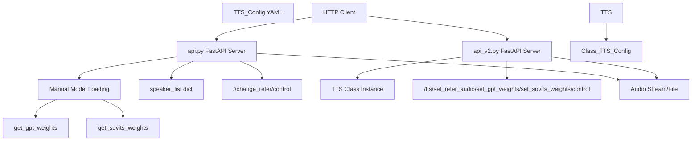
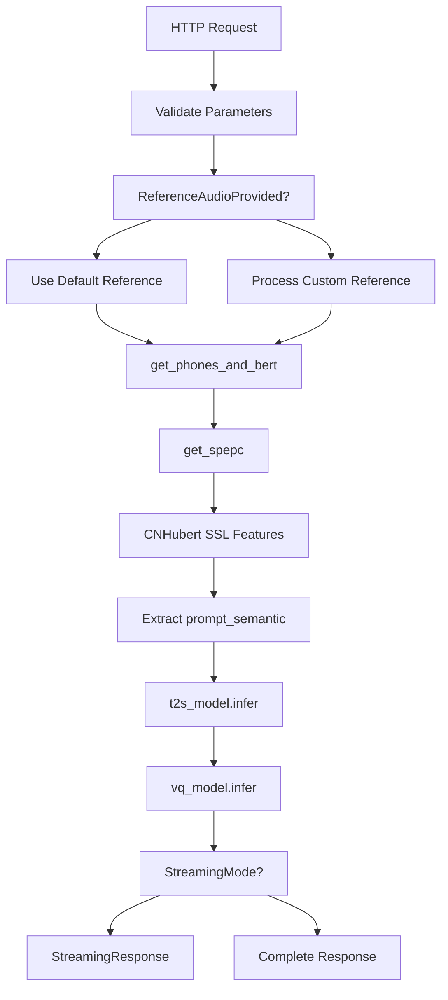
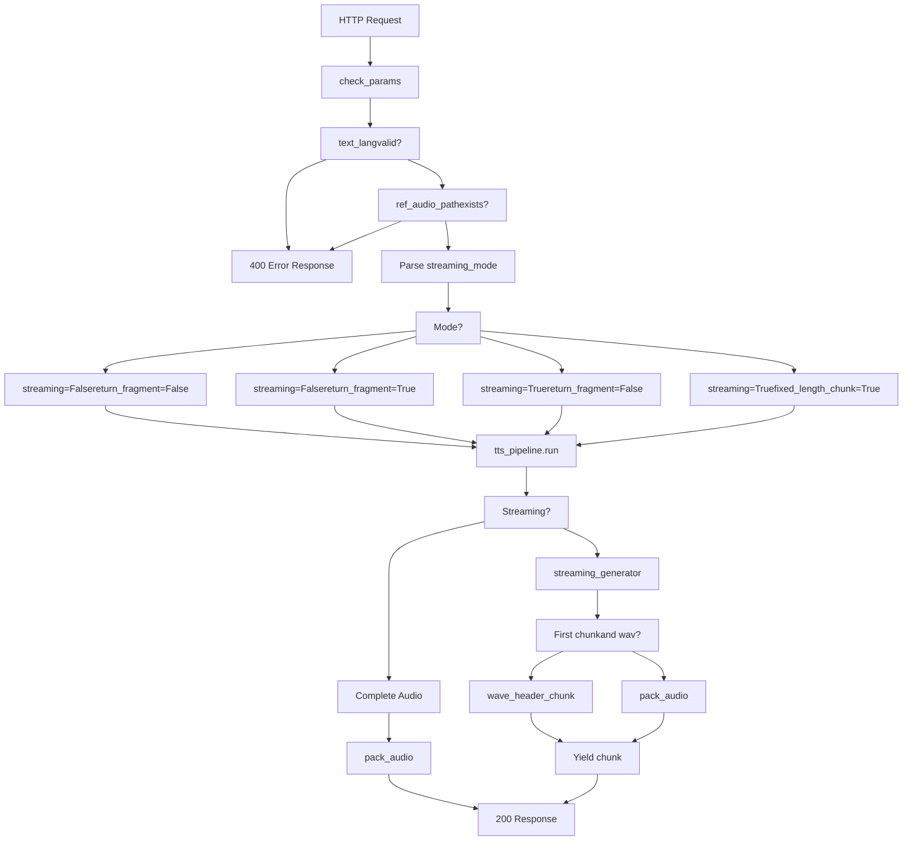
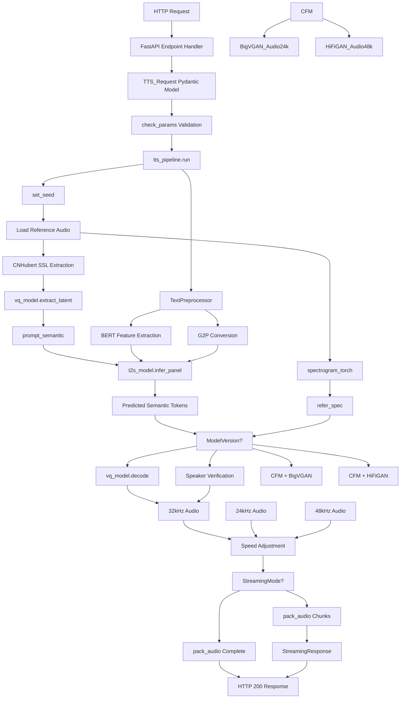
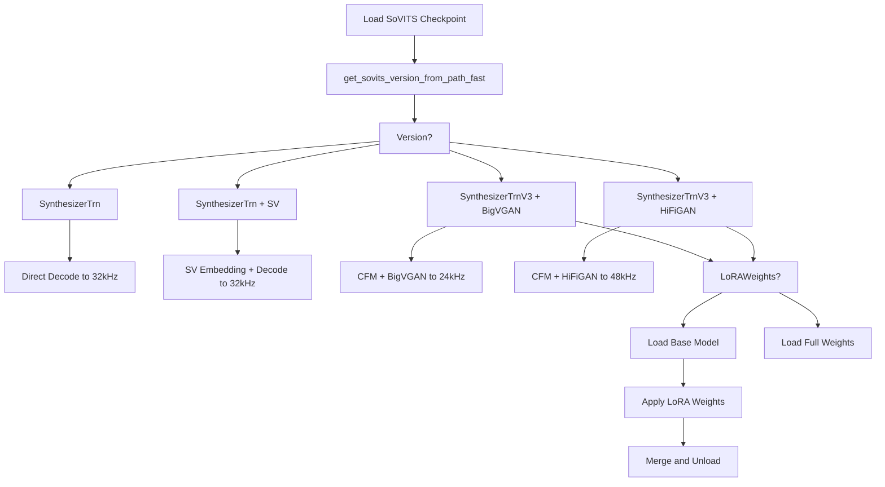

# REST API

Relevant source files

-   [.gitignore](https://github.com/RVC-Boss/GPT-SoVITS/blob/c767f0b8/.gitignore)
-   [GPT\_SoVITS/AR/models/t2s\_model.py](https://github.com/RVC-Boss/GPT-SoVITS/blob/c767f0b8/GPT_SoVITS/AR/models/t2s_model.py)
-   [GPT\_SoVITS/AR/models/utils.py](https://github.com/RVC-Boss/GPT-SoVITS/blob/c767f0b8/GPT_SoVITS/AR/models/utils.py)
-   [GPT\_SoVITS/TTS\_infer\_pack/TTS.py](https://github.com/RVC-Boss/GPT-SoVITS/blob/c767f0b8/GPT_SoVITS/TTS_infer_pack/TTS.py)
-   [GPT\_SoVITS/configs/tts\_infer.yaml](https://github.com/RVC-Boss/GPT-SoVITS/blob/c767f0b8/GPT_SoVITS/configs/tts_infer.yaml)
-   [api.py](https://github.com/RVC-Boss/GPT-SoVITS/blob/c767f0b8/api.py)
-   [api\_v2.py](https://github.com/RVC-Boss/GPT-SoVITS/blob/c767f0b8/api_v2.py)
-   [config.py](https://github.com/RVC-Boss/GPT-SoVITS/blob/c767f0b8/config.py)
-   [webui.py](https://github.com/RVC-Boss/GPT-SoVITS/blob/c767f0b8/webui.py)

## Purpose and Scope

This page documents the REST API interfaces for programmatic access to GPT-SoVITS TTS inference. The REST API enables applications to generate speech by sending HTTP requests, supporting both synchronous and streaming response modes. Two API implementations are available: the original `api.py` and the newer `api_v2.py`, both built on FastAPI.

For interactive web-based inference, see [Inference WebUI](/RVC-Boss/GPT-SoVITS/3.2-inference-webui). For batch processing of multiple texts, see [Batch Processing](/RVC-Boss/GPT-SoVITS/7.3-batch-processing).

---

## API Versions Overview

GPT-SoVITS provides two REST API implementations with different architectures and capabilities:


**Comparison Table:**

| Feature | api.py | api\_v2.py |
| --- | --- | --- |
| Model Management | Manual loading via functions | `TTS` class with config file |
| Configuration | Command-line arguments | YAML config + CLI args |
| Main Endpoint | `/` | `/tts` |
| Model Switching | Via `/change_refer` | Via `/set_gpt_weights`, `/set_sovits_weights` |
| Streaming Modes | 3 modes (string flags) | 4 modes (0, 1, 2, 3 or bool) |
| Default Reference Audio | CLI arguments | Config file or set dynamically |
| Recommended | Legacy | ✓ Current |

Sources: [api.py1-141](https://github.com/RVC-Boss/GPT-SoVITS/blob/c767f0b8/api.py#L1-L141) [api\_v2.py1-102](https://github.com/RVC-Boss/GPT-SoVITS/blob/c767f0b8/api_v2.py#L1-L102)

---

## Starting the API Server

### api.py (Original)

```
python api.py \  -s SoVITS_weights_v2/model.pth \  -g GPT_weights_v2/model.ckpt \  -dr "reference_audio.wav" \  -dt "Reference text here." \  -dl "zh" \  -a "127.0.0.1" \  -p 9880
```
**Command-Line Arguments:**

| Argument | Description | Default |
| --- | --- | --- |
| `-s` | SoVITS model path | From config.py |
| `-g` | GPT model path | From config.py |
| `-dr` | Default reference audio path | Required if not in request |
| `-dt` | Default reference text | Required if not in request |
| `-dl` | Default reference language | Required if not in request |
| `-d` | Device (`cuda`, `cpu`) | Auto-detected |
| `-a` | Bind address | `127.0.0.1` |
| `-p` | Port | `9880` |
| `-fp` | Force full precision | False |
| `-hp` | Force half precision | Auto-detected |
| `-sm` | Streaming mode | `close` |
| `-mt` | Media type | `wav` |
| `-hb` | CNHubert path | From config.py |
| `-b` | BERT path | From config.py |

Sources: [api.py1-141](https://github.com/RVC-Boss/GPT-SoVITS/blob/c767f0b8/api.py#L1-L141)

### api\_v2.py (Recommended)

```
python api_v2.py \  -c GPT_SoVITS/configs/tts_infer.yaml \  -a "127.0.0.1" \  -p 9880
```
**Command-Line Arguments:**

| Argument | Description | Default |
| --- | --- | --- |
| `-c` | TTS config file path | `GPT_SoVITS/configs/tts_infer.yaml` |
| `-a` | Bind address | `127.0.0.1` |
| `-p` | Port | `9880` |

The configuration file [GPT\_SoVITS/configs/tts\_infer.yaml1-57](https://github.com/RVC-Boss/GPT-SoVITS/blob/c767f0b8/GPT_SoVITS/configs/tts_infer.yaml#L1-L57) specifies model paths, device settings, and version. The API automatically loads the model configuration on startup.

Sources: [api\_v2.py133-142](https://github.com/RVC-Boss/GPT-SoVITS/blob/c767f0b8/api_v2.py#L133-L142) [config.py145](https://github.com/RVC-Boss/GPT-SoVITS/blob/c767f0b8/config.py#L145-L145)

---

## Core Concepts

### Model Configuration Architecture

```mermaid
flowchart TD
    ConfigFile["tts_infer.yaml"]
    TTS_Config_Class["TTS_Config"]
    version["version: v1/v2/v3/v4/v2Pro"]
    device["device: cuda/cpu"]
    is_half["is_half: bool"]
    t2s_weights_path["t2s_weights_path"]
    vits_weights_path["vits_weights_path"]
    bert_base_path["bert_base_path"]
    cnhuhbert_base_path["cnhuhbert_base_path"]
    TTS_Instance["TTS Pipeline Instance"]
    t2s_model["Text2SemanticLightningModule"]
    vits_model["SynthesizerTrn/V3"]
    bert_model["AutoModelForMaskedLM"]
    cnhuhbert_model["CNHubert"]
    vocoder["BigVGAN/HiFiGAN"]

    ConfigFile --> TTS_Config_Class
    TTS --> Config_Class_version
    TTS --> Config_Class_device
    TTS --> Config_Class_is_half
    TTS --> Config_Class_t2s_weights_path
    TTS --> Config_Class_vits_weights_path
    TTS --> Config_Class_bert_base_path
    TTS --> Config_Class_cnhuhbert_base_path
    TTS --> Config_Class_TTS_Instance
    TTS --> Instance_t2s_model
    TTS --> Instance_vits_model
    TTS --> Instance_bert_model
    TTS --> Instance_cnhuhbert_model
    TTS --> Instance_vocoder
```


Sources: [GPT\_SoVITS/configs/tts\_infer.yaml1-57](https://github.com/RVC-Boss/GPT-SoVITS/blob/c767f0b8/GPT_SoVITS/configs/tts_infer.yaml#L1-L57) [GPT\_SoVITS/TTS\_infer\_pack/TTS.py217-419](https://github.com/RVC-Boss/GPT-SoVITS/blob/c767f0b8/GPT_SoVITS/TTS_infer_pack/TTS.py#L217-L419)

### Streaming Modes

Both APIs support streaming responses where audio is sent chunk-by-chunk rather than waiting for complete generation.

**api\_v2.py Streaming Modes:**

| Mode | Value | Behavior | Use Case |
| --- | --- | --- | --- |
| Disabled | `0` or `False` | Complete audio returned at once | Short texts, file downloads |
| Best Quality | `1` or `True` | Stream by sentence segments | Balanced quality/latency |
| Medium Quality | `2` | Stream by semantic chunks, medium chunks | Lower latency |
| Lower Quality | `3` | Stream by semantic chunks, small chunks | Lowest latency |

**api.py Streaming Modes:**

| Mode | Value | Behavior |
| --- | --- | --- |
| Disabled | `close`, `c` | Complete audio returned |
| Normal | `normal`, `n` | Stream with connection close after completion |
| Keep-Alive | `keepalive`, `k` | Stream with persistent connection |

Sources: [api\_v2.py388-410](https://github.com/RVC-Boss/GPT-SoVITS/blob/c767f0b8/api_v2.py#L388-L410) [api.py21](https://github.com/RVC-Boss/GPT-SoVITS/blob/c767f0b8/api.py#L21-L21)

### Media Types

Both APIs support multiple audio encoding formats:

| Format | Streaming | Non-Streaming | Notes |
| --- | --- | --- | --- |
| `wav` | ✓ | ✓ | PCM uncompressed |
| `ogg` | ✓ | ✓ | Vorbis compressed, may cause stack overflow on large chunks |
| `aac` | ✓ | ✓ | AAC compressed via FFmpeg |
| `raw` | ✓ | ✓ | Raw PCM bytes without header |

Sources: [api.py670-780](https://github.com/RVC-Boss/GPT-SoVITS/blob/c767f0b8/api.py#L670-L780) [api\_v2.py268-279](https://github.com/RVC-Boss/GPT-SoVITS/blob/c767f0b8/api_v2.py#L268-L279)

---

## API Endpoints Reference

### api.py Endpoints

#### `POST/GET /` - TTS Inference

Primary inference endpoint that generates speech from text.


**Request Parameters (GET or POST JSON):**

| Parameter | Type | Required | Default | Description |
| --- | --- | --- | --- | --- |
| `text` | string | ✓ | \- | Text to synthesize |
| `text_language` | string | ✓ | \- | Language: `zh`, `en`, `ja`, `ko`, `yue`, `auto` |
| `refer_wav_path` | string | Optional | CLI default | Reference audio file path |
| `prompt_text` | string | Optional | \- | Transcript of reference audio |
| `prompt_language` | string | Optional | \- | Language of reference audio |
| `cut_punc` | string | Optional | \- | Custom punctuation for text splitting |
| `top_k` | int | Optional | 15 | Top-k sampling |
| `top_p` | float | Optional | 1.0 | Nucleus sampling threshold |
| `temperature` | float | Optional | 1.0 | Sampling temperature |
| `speed` | float | Optional | 1.0 | Playback speed multiplier |
| `inp_refs` | list\[string\] | Optional | \[\] | Auxiliary reference audio paths |

**GET Example:**

```
GET http://127.0.0.1:9880?text=你好世界&text_language=zh&refer_wav_path=ref.wav&prompt_text=测试&prompt_language=zh
```
**POST Example:**

```
{    "text": "先帝创业未半而中道崩殂，今天下三分，益州疲弊，此诚危急存亡之秋也。",    "text_language": "zh",    "refer_wav_path": "123.wav",    "prompt_text": "一二三。",    "prompt_language": "zh",    "top_k": 20,    "top_p": 0.6,    "temperature": 0.6}
```
**Response:**

-   **Success (200)**: Audio stream (WAV/OGG/AAC format)
-   **Error (400)**: JSON with error message

Sources: [api.py809-1010](https://github.com/RVC-Boss/GPT-SoVITS/blob/c767f0b8/api.py#L809-L1010)

#### `POST/GET /change_refer` - Update Default Reference

Updates the default reference audio used when requests don't specify custom reference.

**Request Parameters:**

| Parameter | Type | Required | Description |
| --- | --- | --- | --- |
| `refer_wav_path` | string | ✓ | New reference audio path |
| `prompt_text` | string | ✓ | Transcript of reference |
| `prompt_language` | string | ✓ | Language of reference |

**Response:**

-   **Success (200)**: `{"code": 0, "message": "Success"}`
-   **Error (400)**: JSON with error details

Sources: [api.py100-120](https://github.com/RVC-Boss/GPT-SoVITS/blob/c767f0b8/api.py#L100-L120)

#### `POST/GET /control` - Server Control

Controls server lifecycle.

**Request Parameters:**

| Parameter | Type | Values | Description |
| --- | --- | --- | --- |
| `command` | string | `restart`, `exit` | Server command |

**Response:** No response (server restarts or exits)

Sources: [api.py122-140](https://github.com/RVC-Boss/GPT-SoVITS/blob/c767f0b8/api.py#L122-L140)

---

### api\_v2.py Endpoints

#### `POST/GET /tts` - TTS Inference

Primary inference endpoint with enhanced parameter control.


**Request Parameters:**

| Parameter | Type | Required | Default | Description |
| --- | --- | --- | --- | --- |
| `text` | string | ✓ | \- | Text to synthesize |
| `text_lang` | string | ✓ | \- | `auto`, `zh`, `en`, `ja`, `ko`, `yue`, etc. |
| `ref_audio_path` | string | ✓ | \- | Reference audio file path |
| `prompt_lang` | string | ✓ | \- | Language of reference audio |
| `prompt_text` | string | Optional | "" | Reference audio transcript |
| `aux_ref_audio_paths` | list\[string\] | Optional | \[\] | Additional reference audios for tone fusion |
| `top_k` | int | Optional | 15 | Top-k sampling for GPT |
| `top_p` | float | Optional | 1.0 | Nucleus sampling threshold |
| `temperature` | float | Optional | 1.0 | Sampling temperature |
| `text_split_method` | string | Optional | `cut5` | Text segmentation method |
| `batch_size` | int | Optional | 1 | Inference batch size |
| `batch_threshold` | float | Optional | 0.75 | Batch splitting threshold |
| `split_bucket` | bool | Optional | True | Enable batch bucketing |
| `speed_factor` | float | Optional | 1.0 | Playback speed multiplier |
| `fragment_interval` | float | Optional | 0.3 | Silence interval between fragments (seconds) |
| `seed` | int | Optional | \-1 | Random seed (-1 for random) |
| `media_type` | string | Optional | `wav` | `wav`, `ogg`, `aac`, `raw` |
| `streaming_mode` | int/bool | Optional | False | 0/False, 1/True, 2, 3 |
| `parallel_infer` | bool | Optional | True | Parallel batch inference |
| `repetition_penalty` | float | Optional | 1.35 | Repetition penalty for T2S |
| `sample_steps` | int | Optional | 32 | Sampling steps (v3/v4) |
| `super_sampling` | bool | Optional | False | Super-resolution 24kHz→48kHz (v3) |
| `overlap_length` | int | Optional | 2 | Semantic token overlap for streaming |
| `min_chunk_length` | int | Optional | 16 | Minimum chunk size for streaming |

**POST Example:**

```
{    "text": "这是一段测试文本。",    "text_lang": "zh",    "ref_audio_path": "reference.wav",    "prompt_lang": "zh",    "prompt_text": "参考音频文本",    "top_k": 15,    "top_p": 1.0,    "temperature": 1.0,    "streaming_mode": 2,    "media_type": "ogg"}
```
**Response:**

-   **Success (200)**:
    -   Non-streaming: Complete audio file
    -   Streaming: `StreamingResponse` with chunked audio
-   **Error (400)**: JSON with error details

Sources: [api\_v2.py345-446](https://github.com/RVC-Boss/GPT-SoVITS/blob/c767f0b8/api_v2.py#L345-L446) [api\_v2.py455-515](https://github.com/RVC-Boss/GPT-SoVITS/blob/c767f0b8/api_v2.py#L455-L515)

#### `GET /set_refer_audio` - Set Reference Audio

Configures reference audio for the TTS pipeline instance.

**Request Parameters:**

| Parameter | Type | Required | Description |
| --- | --- | --- | --- |
| `refer_audio_path` | string | ✓ | Reference audio file path |

**Response:**

-   **Success (200)**: `{"message": "success"}`
-   **Error (400)**: `{"message": "set refer audio failed", "Exception": "..."}`

Sources: [api\_v2.py517-523](https://github.com/RVC-Boss/GPT-SoVITS/blob/c767f0b8/api_v2.py#L517-L523)

#### `GET /set_gpt_weights` - Switch GPT Model

Hot-swaps the Text2Semantic (GPT) model without restarting the server.

**Request Parameters:**

| Parameter | Type | Required | Description |
| --- | --- | --- | --- |
| `weights_path` | string | ✓ | Path to GPT checkpoint (.ckpt) |

**Response:**

-   **Success (200)**: `{"message": "success"}`
-   **Error (400)**: `{"message": "change gpt weight failed", "Exception": "..."}`

Sources: [api\_v2.py545-554](https://github.com/RVC-Boss/GPT-SoVITS/blob/c767f0b8/api_v2.py#L545-L554)

#### `GET /set_sovits_weights` - Switch SoVITS Model

Hot-swaps the acoustic (SoVITS) model without restarting the server.

**Request Parameters:**

| Parameter | Type | Required | Description |
| --- | --- | --- | --- |
| `weights_path` | string | ✓ | Path to SoVITS checkpoint (.pth) |

**Response:**

-   **Success (200)**: `{"message": "success"}`
-   **Error (400)**: `{"message": "change sovits weight failed", "Exception": "..."}`

Sources: [api\_v2.py557-565](https://github.com/RVC-Boss/GPT-SoVITS/blob/c767f0b8/api_v2.py#L557-L565)

#### `POST/GET /control` - Server Control

Identical to api.py implementation.

Sources: [api\_v2.py448-452](https://github.com/RVC-Boss/GPT-SoVITS/blob/c767f0b8/api_v2.py#L448-L452)

---

## Request/Response Flow

### Complete Inference Pipeline (api\_v2.py)


Sources: [api\_v2.py345-446](https://github.com/RVC-Boss/GPT-SoVITS/blob/c767f0b8/api_v2.py#L345-L446) [GPT\_SoVITS/TTS\_infer\_pack/TTS.py1162-1400](https://github.com/RVC-Boss/GPT-SoVITS/blob/c767f0b8/GPT_SoVITS/TTS_infer_pack/TTS.py#L1162-L1400)

---

## Language Support

Both APIs support the same language codes, with availability depending on model version:

| Language Code | Language | v1 | v2/v2Pro/v3/v4 |
| --- | --- | --- | --- |
| `zh` | Chinese (Mandarin) | ✓ | ✓ |
| `en` | English | ✓ | ✓ |
| `ja` | Japanese | ✓ | ✓ |
| `ko` | Korean | \- | ✓ |
| `yue` | Cantonese | \- | ✓ |
| `auto` | Auto-detect multi-language | \- | ✓ |
| `auto_yue` | Auto-detect (treat zh as yue) | \- | ✓ |
| `all_zh` | Force all as Chinese | ✓ | ✓ |
| `all_ja` | Force all as Japanese | ✓ | ✓ |
| `all_ko` | Force all as Korean | \- | ✓ |
| `all_yue` | Force all as Cantonese | \- | ✓ |

Sources: [GPT\_SoVITS/TTS\_infer\_pack/TTS.py275-277](https://github.com/RVC-Boss/GPT-SoVITS/blob/c767f0b8/GPT_SoVITS/TTS_infer_pack/TTS.py#L275-L277) [api.py545-610](https://github.com/RVC-Boss/GPT-SoVITS/blob/c767f0b8/api.py#L545-L610)

---

## Error Handling

### Common Error Responses

Both APIs return JSON error responses with HTTP 400 status code:

```
{    "message": "Error description",    "Exception": "Detailed exception message (if available)"}
```
**Common Error Scenarios:**

| Error | Cause | Solution |
| --- | --- | --- |
| `ref_audio_path is required` | Missing reference audio | Provide `ref_audio_path` or set default |
| `text is required` | Missing text parameter | Provide `text` parameter |
| `text_lang is not supported` | Invalid language code | Use valid language code for model version |
| `Model loading failed` | Invalid checkpoint path | Verify model file exists and is compatible |
| `tts failed` | Inference error | Check reference audio format and model compatibility |

Sources: [api\_v2.py305-343](https://github.com/RVC-Boss/GPT-SoVITS/blob/c767f0b8/api_v2.py#L305-L343) [api.py809-1010](https://github.com/RVC-Boss/GPT-SoVITS/blob/c767f0b8/api.py#L809-L1010)

---

## Integration Examples

### Python Client Example (api\_v2.py)

```
import requestsimport ioimport soundfile as sf # Non-streaming requestdef tts_request(text, ref_audio_path, output_path):    url = "http://127.0.0.1:9880/tts"        payload = {        "text": text,        "text_lang": "zh",        "ref_audio_path": ref_audio_path,        "prompt_lang": "zh",        "prompt_text": "参考文本",        "media_type": "wav",        "streaming_mode": 0    }        response = requests.post(url, json=payload)        if response.status_code == 200:        with open(output_path, 'wb') as f:            f.write(response.content)        print(f"Audio saved to {output_path}")    else:        print(f"Error: {response.json()}") # Streaming requestdef tts_streaming(text, ref_audio_path):    url = "http://127.0.0.1:9880/tts"        payload = {        "text": text,        "text_lang": "zh",        "ref_audio_path": ref_audio_path,        "prompt_lang": "zh",        "media_type": "wav",        "streaming_mode": 2  # Medium quality streaming    }        with requests.post(url, json=payload, stream=True) as response:        if response.status_code == 200:            for chunk in response.iter_content(chunk_size=8192):                if chunk:                    # Process audio chunk (e.g., play or save)                    process_audio_chunk(chunk)        else:            print(f"Error: {response.text}") # Model switchingdef switch_models(gpt_path, sovits_path):    requests.get(        "http://127.0.0.1:9880/set_gpt_weights",        params={"weights_path": gpt_path}    )    requests.get(        "http://127.0.0.1:9880/set_sovits_weights",        params={"weights_path": sovits_path}    )
```
### cURL Example

```
# Simple POST requestcurl -X POST "http://127.0.0.1:9880/tts" \  -H "Content-Type: application/json" \  -d '{    "text": "你好，世界",    "text_lang": "zh",    "ref_audio_path": "reference.wav",    "prompt_lang": "zh"  }' \  --output output.wav # GET request with parameterscurl -X GET "http://127.0.0.1:9880/tts?text=测试文本&text_lang=zh&ref_audio_path=ref.wav&prompt_lang=zh&media_type=ogg" \  --output output.ogg # Switch modelscurl "http://127.0.0.1:9880/set_gpt_weights?weights_path=GPT_weights_v2/model.ckpt"curl "http://127.0.0.1:9880/set_sovits_weights?weights_path=SoVITS_weights_v2/model.pth"
```
Sources: [api\_v2.py455-515](https://github.com/RVC-Boss/GPT-SoVITS/blob/c767f0b8/api_v2.py#L455-L515)

---

## Performance Considerations

### Streaming vs Non-Streaming

**Non-Streaming (Mode 0/1):**

-   Complete generation before response
-   Higher latency but complete quality control
-   Suitable for: File downloads, batch processing, quality-critical applications

**Streaming (Mode 2/3):**

-   Incremental response as generation proceeds
-   Lower latency, faster time-to-first-audio
-   Suitable for: Real-time applications, conversational AI, live playback

### Model Hot-Swapping

The `/set_gpt_weights` and `/set_sovits_weights` endpoints in api\_v2.py enable dynamic model switching without server restart:

This allows:

-   Testing different models without downtime
-   Serving multiple speakers/styles from a single server
-   A/B testing of model versions

Sources: [api\_v2.py545-565](https://github.com/RVC-Boss/GPT-SoVITS/blob/c767f0b8/api_v2.py#L545-L565) [GPT\_SoVITS/TTS\_infer\_pack/TTS.py594-608](https://github.com/RVC-Boss/GPT-SoVITS/blob/c767f0b8/GPT_SoVITS/TTS_infer_pack/TTS.py#L594-L608)

### Connection Management

**api.py** provides keep-alive streaming mode for persistent connections, useful when generating multiple audio clips in sequence without reconnecting.

**api\_v2.py** uses FastAPI's built-in connection management with HTTP/1.1 keep-alive by default.

Sources: [api.py21](https://github.com/RVC-Boss/GPT-SoVITS/blob/c767f0b8/api.py#L21-L21) [api\_v2.py568-576](https://github.com/RVC-Boss/GPT-SoVITS/blob/c767f0b8/api_v2.py#L568-L576)

---

## Configuration Management

### TTS Config File Structure

The [GPT\_SoVITS/configs/tts\_infer.yaml1-57](https://github.com/RVC-Boss/GPT-SoVITS/blob/c767f0b8/GPT_SoVITS/configs/tts_infer.yaml#L1-L57) file defines presets for each model version:

```
custom:  device: cuda  is_half: true  version: v2  t2s_weights_path: GPT_SoVITS/pretrained_models/.../s1....ckpt  vits_weights_path: GPT_SoVITS/pretrained_models/.../s2G....pth  bert_base_path: GPT_SoVITS/pretrained_models/chinese-roberta-wwm-ext-large  cnhuhbert_base_path: GPT_SoVITS/pretrained_models/chinese-hubert-base v1:  # v1 preset configuration  v2:  # v2 preset configuration  v3:  # v3 preset configuration
```
The `custom` section is loaded by default. To use a different version preset, modify the paths and version in the `custom` section.

Sources: [GPT\_SoVITS/configs/tts\_infer.yaml1-57](https://github.com/RVC-Boss/GPT-SoVITS/blob/c767f0b8/GPT_SoVITS/configs/tts_infer.yaml#L1-L57) [GPT\_SoVITS/TTS\_infer\_pack/TTS.py299-354](https://github.com/RVC-Boss/GPT-SoVITS/blob/c767f0b8/GPT_SoVITS/TTS_infer_pack/TTS.py#L299-L354)

### Environment Variables

Both APIs respect configuration from [config.py1-219](https://github.com/RVC-Boss/GPT-SoVITS/blob/c767f0b8/config.py#L1-L219):

| Variable | Source | Description |
| --- | --- | --- |
| `is_half` | Environment or auto-detect | Enable FP16 precision |
| `infer_device` | Auto-detect | GPU device for inference |
| `api_port` | config.py | Default API port (9880) |

Sources: [config.py127-145](https://github.com/RVC-Boss/GPT-SoVITS/blob/c767f0b8/config.py#L127-L145)

---

## Model Version Compatibility

Different model versions have different inference paths and capabilities:


**Version-Specific Features:**

| Version | Architecture | Output SR | Vocoder | LoRA Support | Special Features |
| --- | --- | --- | --- | --- | --- |
| v1 | SynthesizerTrn | 32kHz | None | No | Original architecture |
| v2 | SynthesizerTrn | 32kHz | None | No | Improved training |
| v2Pro/Plus | SynthesizerTrn | 32kHz | None | No | Speaker verification embedding |
| v3 | SynthesizerTrnV3 | 24kHz | BigVGAN | Yes | CFM, 8GB VRAM training |
| v4 | SynthesizerTrnV3 | 48kHz | HiFiGAN | Yes | Fixed metallic artifacts |

Sources: [api.py381-464](https://github.com/RVC-Boss/GPT-SoVITS/blob/c767f0b8/api.py#L381-L464) [GPT\_SoVITS/TTS\_infer\_pack/TTS.py493-591](https://github.com/RVC-Boss/GPT-SoVITS/blob/c767f0b8/GPT_SoVITS/TTS_infer_pack/TTS.py#L493-L591) [process\_ckpt.py](https://github.com/RVC-Boss/GPT-SoVITS/blob/c767f0b8/process_ckpt.py)

---

## Deployment Recommendations

### Production Deployment

For production use, consider:

1.  **Use api\_v2.py**: More modern architecture, better parameter control
2.  **Enable HTTPS**: Place behind reverse proxy (nginx, Apache)
3.  **Set appropriate bind address**: Use `-a 0.0.0.0` for network access
4.  **Resource limits**: Monitor GPU memory, implement request queuing
5.  **Model caching**: Pre-load models on startup to avoid cold start latency
6.  **Error logging**: Implement comprehensive error tracking

### Docker Deployment Example

```
# Build container with API exposeddocker run -it --gpus all \  -p 9880:9880 \  -v /path/to/models:/workspace/models \  gpt-sovits:latest \  python api_v2.py -c /workspace/configs/tts_infer.yaml -a 0.0.0.0 -p 9880
```
### Load Balancing

For high-throughput scenarios:

-   Deploy multiple API instances across different GPUs
-   Use load balancer (nginx, HAProxy) for request distribution
-   Implement model sharding for different languages/speakers

Sources: [config.py145](https://github.com/RVC-Boss/GPT-SoVITS/blob/c767f0b8/config.py#L145-L145) [api\_v2.py568-576](https://github.com/RVC-Boss/GPT-SoVITS/blob/c767f0b8/api_v2.py#L568-L576)
