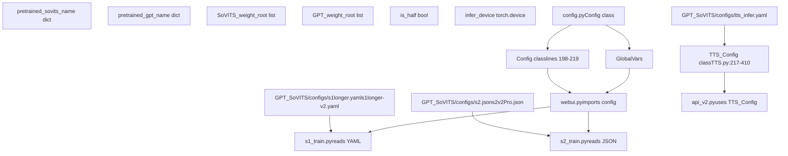
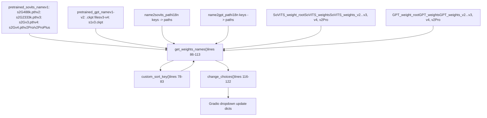
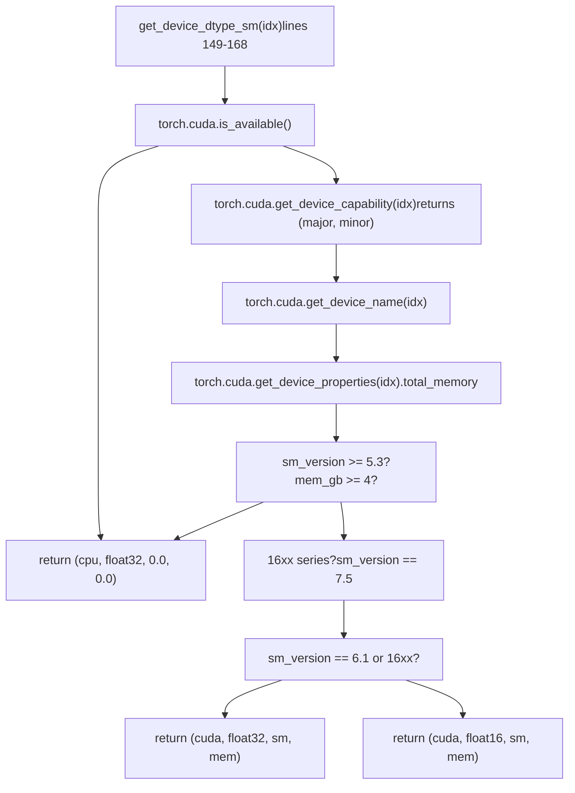
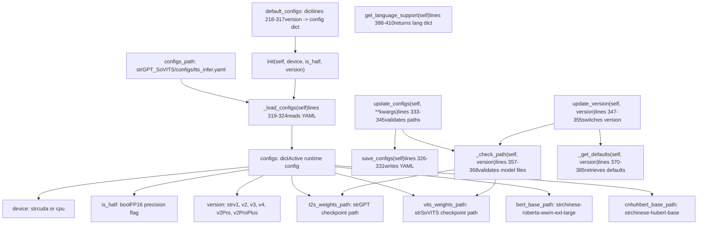
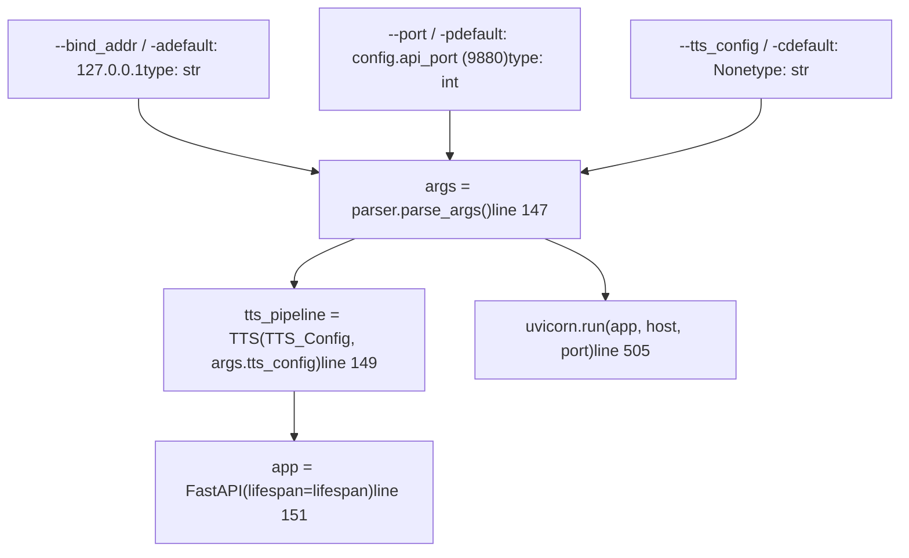
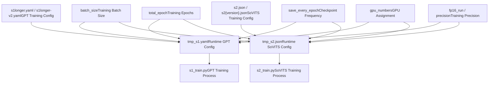

# Configuration Management

Relevant source files

-   [README.md](https://github.com/RVC-Boss/GPT-SoVITS/blob/c767f0b8/README.md?plain=1)
-   [api.py](https://github.com/RVC-Boss/GPT-SoVITS/blob/c767f0b8/api.py)
-   [config.py](https://github.com/RVC-Boss/GPT-SoVITS/blob/c767f0b8/config.py)
-   [docs/cn/README.md](https://github.com/RVC-Boss/GPT-SoVITS/blob/c767f0b8/docs/cn/README.md?plain=1)
-   [docs/ja/README.md](https://github.com/RVC-Boss/GPT-SoVITS/blob/c767f0b8/docs/ja/README.md?plain=1)
-   [docs/ko/README.md](https://github.com/RVC-Boss/GPT-SoVITS/blob/c767f0b8/docs/ko/README.md?plain=1)
-   [docs/tr/README.md](https://github.com/RVC-Boss/GPT-SoVITS/blob/c767f0b8/docs/tr/README.md?plain=1)
-   [install.ps1](https://github.com/RVC-Boss/GPT-SoVITS/blob/c767f0b8/install.ps1)
-   [install.sh](https://github.com/RVC-Boss/GPT-SoVITS/blob/c767f0b8/install.sh)
-   [requirements.txt](https://github.com/RVC-Boss/GPT-SoVITS/blob/c767f0b8/requirements.txt)
-   [webui.py](https://github.com/RVC-Boss/GPT-SoVITS/blob/c767f0b8/webui.py)

This document covers the configuration system in GPT-SoVITS, including global system settings, model configurations, device management, and runtime parameters. The configuration system manages multiple interconnected components that control training, inference, and deployment settings.

For information about the web interfaces that use these configurations, see [Web Interface](/RVC-Boss/GPT-SoVITS/3-user-interfaces). For details about the TTS inference pipeline configuration, see [Inference Pipeline](/RVC-Boss/GPT-SoVITS/2.4-inference-pipeline).

## Configuration Architecture

GPT-SoVITS uses a multi-layered configuration system with three primary sources: global settings in `config.py`, inference-specific settings in `TTS_Config` class, and training configurations in JSON/YAML files.

**Configuration Hierarchy and Code Entities**


Sources: [config.py1-219](https://github.com/RVC-Boss/GPT-SoVITS/blob/c767f0b8/config.py#L1-L219) [GPT\_SoVITS/TTS\_infer\_pack/TTS.py217-410](https://github.com/RVC-Boss/GPT-SoVITS/blob/c767f0b8/GPT_SoVITS/TTS_infer_pack/TTS.py#L217-L410) [webui.py71-85](https://github.com/RVC-Boss/GPT-SoVITS/blob/c767f0b8/webui.py#L71-L85) [api\_v2.py129-145](https://github.com/RVC-Boss/GPT-SoVITS/blob/c767f0b8/api_v2.py#L129-L145)

## Global System Configuration

The `Config` class in [config.py198-219](https://github.com/RVC-Boss/GPT-SoVITS/blob/c767f0b8/config.py#L198-L219) provides a simple container for system-wide settings. Most configuration logic uses module-level variables rather than class instances.

### Module-Level Configuration Variables

| Variable | Type | Purpose | Set By |
| --- | --- | --- | --- |
| `pretrained_sovits_name` | `dict[str, str]` | Maps version strings to pretrained SoVITS paths | Static definition |
| `pretrained_gpt_name` | `dict[str, str]` | Maps version strings to pretrained GPT paths | Static definition |
| `SoVITS_weight_root` | `list[str]` | Directories for SoVITS checkpoints | Static definition |
| `GPT_weight_root` | `list[str]` | Directories for GPT checkpoints | Static definition |
| `is_half` | `bool` | FP16 mode enabled | `get_device_dtype_sm()` or env var |
| `infer_device` | `torch.device` | Primary inference device | `get_device_dtype_sm()` |
| `IS_GPU` | `bool` | GPU available flag | Hardware detection loop |
| `GPU_INFOS` | `list[str]` | GPU device descriptions | Hardware detection loop |
| `GPU_INDEX` | `set[int]` | Available GPU indices | Hardware detection loop |

Sources: [config.py12-28](https://github.com/RVC-Boss/GPT-SoVITS/blob/c767f0b8/config.py#L12-L28) [config.py44-75](https://github.com/RVC-Boss/GPT-SoVITS/blob/c767f0b8/config.py#L44-L75) [config.py127-131](https://github.com/RVC-Boss/GPT-SoVITS/blob/c767f0b8/config.py#L127-L131) [config.py171-195](https://github.com/RVC-Boss/GPT-SoVITS/blob/c767f0b8/config.py#L171-L195) </old\_str>

<new\_str>

## Configuration Architecture

GPT-SoVITS uses a multi-layered configuration system with three primary sources: global settings in `config.py`, inference-specific settings in `TTS_Config` class, and training configurations in JSON/YAML files.

**Configuration Hierarchy and Code Entities**


Sources: [config.py1-219](https://github.com/RVC-Boss/GPT-SoVITS/blob/c767f0b8/config.py#L1-L219) [GPT\_SoVITS/TTS\_infer\_pack/TTS.py217-410](https://github.com/RVC-Boss/GPT-SoVITS/blob/c767f0b8/GPT_SoVITS/TTS_infer_pack/TTS.py#L217-L410) [webui.py71-85](https://github.com/RVC-Boss/GPT-SoVITS/blob/c767f0b8/webui.py#L71-L85) [api\_v2.py129-145](https://github.com/RVC-Boss/GPT-SoVITS/blob/c767f0b8/api_v2.py#L129-L145)

## Global System Configuration

The `Config` class in [config.py198-219](https://github.com/RVC-Boss/GPT-SoVITS/blob/c767f0b8/config.py#L198-L219) provides a simple container for system-wide settings. Most configuration logic uses module-level variables rather than class instances.

### Module-Level Configuration Variables

| Variable | Type | Purpose | Set By |
| --- | --- | --- | --- |
| `pretrained_sovits_name` | `dict[str, str]` | Maps version strings to pretrained SoVITS paths | Static definition [config.py12-19](https://github.com/RVC-Boss/GPT-SoVITS/blob/c767f0b8/config.py#L12-L19) |
| `pretrained_gpt_name` | `dict[str, str]` | Maps version strings to pretrained GPT paths | Static definition [config.py21-28](https://github.com/RVC-Boss/GPT-SoVITS/blob/c767f0b8/config.py#L21-L28) |
| `SoVITS_weight_root` | `list[str]` | Directories for SoVITS checkpoints | Static definition [config.py44-51](https://github.com/RVC-Boss/GPT-SoVITS/blob/c767f0b8/config.py#L44-L51) |
| `GPT_weight_root` | `list[str]` | Directories for GPT checkpoints | Static definition [config.py52-59](https://github.com/RVC-Boss/GPT-SoVITS/blob/c767f0b8/config.py#L52-L59) |
| `is_half` | `bool` | FP16 mode enabled | `get_device_dtype_sm()` or env var [config.py127-128](https://github.com/RVC-Boss/GPT-SoVITS/blob/c767f0b8/config.py#L127-L128) |
| `infer_device` | `torch.device` | Primary inference device | `get_device_dtype_sm()` [config.py194](https://github.com/RVC-Boss/GPT-SoVITS/blob/c767f0b8/config.py#L194-L194) |
| `IS_GPU` | `bool` | GPU available flag | Hardware detection loop [config.py189-192](https://github.com/RVC-Boss/GPT-SoVITS/blob/c767f0b8/config.py#L189-L192) |
| `GPU_INFOS` | `list[str]` | GPU device descriptions | Hardware detection loop [config.py186](https://github.com/RVC-Boss/GPT-SoVITS/blob/c767f0b8/config.py#L186-L186) |
| `GPU_INDEX` | `set[int]` | Available GPU indices | Hardware detection loop [config.py187](https://github.com/RVC-Boss/GPT-SoVITS/blob/c767f0b8/config.py#L187-L187) |

Sources: [config.py12-28](https://github.com/RVC-Boss/GPT-SoVITS/blob/c767f0b8/config.py#L12-L28) [config.py44-75](https://github.com/RVC-Boss/GPT-SoVITS/blob/c767f0b8/config.py#L44-L75) [config.py127-131](https://github.com/RVC-Boss/GPT-SoVITS/blob/c767f0b8/config.py#L127-L131) [config.py171-195](https://github.com/RVC-Boss/GPT-SoVITS/blob/c767f0b8/config.py#L171-L195)

## Global System Configuration

The primary system configuration is managed through the `Config` class in `config.py`, which defines system-wide defaults and hardware detection.

### Core Configuration Parameters

| Parameter | Description | Default Value |
| --- | --- | --- |
| `exp_root` | Root directory for experiments | `"logs"` |
| `python_exec` | Python executable path | System executable |
| `is_half` | Half precision mode | Auto-detected |
| `infer_device` | Primary inference device | Auto-detected |
| `webui_port_main` | Main WebUI port | `9874` |
| `api_port` | API service port | `9880` |

### Model Path Configuration

**Path Resolution Functions and Data Flow**


The `get_weights_names()` function scans weight directories and returns sorted lists of available checkpoints. It checks `os.path.exists()` for each pretrained path and scans directories for `.pth` (SoVITS) and `.ckpt` (GPT) files.

Sources: [config.py12-28](https://github.com/RVC-Boss/GPT-SoVITS/blob/c767f0b8/config.py#L12-L28) [config.py29-43](https://github.com/RVC-Boss/GPT-SoVITS/blob/c767f0b8/config.py#L29-L43) [config.py44-75](https://github.com/RVC-Boss/GPT-SoVITS/blob/c767f0b8/config.py#L44-L75) [config.py78-122](https://github.com/RVC-Boss/GPT-SoVITS/blob/c767f0b8/config.py#L78-L122)

### Hardware Detection and Device Management

The `get_device_dtype_sm(idx: int)` function at [config.py149-168](https://github.com/RVC-Boss/GPT-SoVITS/blob/c767f0b8/config.py#L149-L168) returns a 4-tuple: `(device, dtype, sm_version, mem_gb)`.

**Hardware Detection Logic**


The function identifies 16-series GPUs by regex `r"16\d{2}"` and SM 7.5, forcing float32 for these cards. SM version is calculated as `major + minor / 10.0`.

Sources: [config.py149-168](https://github.com/RVC-Boss/GPT-SoVITS/blob/c767f0b8/config.py#L149-L168)

### Device Selection and Initialization

At module load, [config.py174-195](https://github.com/RVC-Boss/GPT-SoVITS/blob/c767f0b8/config.py#L174-L195) executes a loop that:

1.  Calls `get_device_dtype_sm(i)` for each GPU index
2.  Populates `GPU_INFOS` with device names for valid GPUs
3.  Adds valid indices to `GPU_INDEX` set
4.  Collects memory values in `memset`
5.  Selects `infer_device` as the GPU with highest `(sm_version, mem_gb)` tuple
6.  Sets `is_half = True` if any GPU supports float16

Sources: [config.py174-195](https://github.com/RVC-Boss/GPT-SoVITS/blob/c767f0b8/config.py#L174-L195)

## TTS Configuration System

The `TTS_Config` class in [GPT\_SoVITS/TTS\_infer\_pack/TTS.py217-410](https://github.com/RVC-Boss/GPT-SoVITS/blob/c767f0b8/GPT_SoVITS/TTS_infer_pack/TTS.py#L217-L410) manages inference-specific configuration with automatic validation and version-specific fallbacks.

### TTS\_Config Class Structure and Methods


Sources: [GPT\_SoVITS/TTS\_infer\_pack/TTS.py217-410](https://github.com/RVC-Boss/GPT-SoVITS/blob/c767f0b8/GPT_SoVITS/TTS_infer_pack/TTS.py#L217-L410)

### Configuration Validation and Fallback Logic

The `_check_path()` method at [GPT\_SoVITS/TTS\_infer\_pack/TTS.py357-368](https://github.com/RVC-Boss/GPT-SoVITS/blob/c767f0b8/GPT_SoVITS/TTS_infer_pack/TTS.py#L357-L368) validates model file existence:

1.  Checks `os.path.isfile(self.configs["t2s_weights_path"])`
2.  Checks `os.path.isfile(self.configs["vits_weights_path"])`
3.  On failure, calls `_get_defaults(version)` to retrieve fallback paths
4.  Calls `save_configs()` to persist corrected configuration

The `update_configs()` method at [GPT\_SoVITS/TTS\_infer\_pack/TTS.py333-345](https://github.com/RVC-Boss/GPT-SoVITS/blob/c767f0b8/GPT_SoVITS/TTS_infer_pack/TTS.py#L333-L345) accepts `**kwargs` and:

-   Updates `self.configs` dictionary with provided keys
-   Calls `_check_path()` for validation
-   Calls `save_configs()` to persist changes

Sources: [GPT\_SoVITS/TTS\_infer\_pack/TTS.py333-368](https://github.com/RVC-Boss/GPT-SoVITS/blob/c767f0b8/GPT_SoVITS/TTS_infer_pack/TTS.py#L333-L368)

### Configuration File Format

The YAML file at [GPT\_SoVITS/configs/tts\_infer.yaml](https://github.com/RVC-Boss/GPT-SoVITS/blob/c767f0b8/GPT_SoVITS/configs/tts_infer.yaml) stores user configuration under the `custom` key:

```
custom:  device: cuda  is_half: true  version: v2  t2s_weights_path: GPT_SoVITS/pretrained_models/gsv-v2final-pretrained/s1bert25hz-5kh-longer-epoch=12-step=369668.ckpt  vits_weights_path: GPT_SoVITS/pretrained_models/gsv-v2final-pretrained/s2G2333k.pth  bert_base_path: GPT_SoVITS/pretrained_models/chinese-roberta-wwm-ext-large  cnhuhbert_base_path: GPT_SoVITS/pretrained_models/chinese-hubert-base
```
The file is read via `yaml.safe_load()` in `_load_configs()` and written via `yaml.safe_dump()` in `save_configs()`.

Sources: [GPT\_SoVITS/configs/tts\_infer.yaml1-57](https://github.com/RVC-Boss/GPT-SoVITS/blob/c767f0b8/GPT_SoVITS/configs/tts_infer.yaml#L1-L57) [GPT\_SoVITS/TTS\_infer\_pack/TTS.py319-331](https://github.com/RVC-Boss/GPT-SoVITS/blob/c767f0b8/GPT_SoVITS/TTS_infer_pack/TTS.py#L319-L331)

### Language Support Configuration

The `get_language_support()` method at [GPT\_SoVITS/TTS\_infer\_pack/TTS.py388-410](https://github.com/RVC-Boss/GPT-SoVITS/blob/c767f0b8/GPT_SoVITS/TTS_infer_pack/TTS.py#L388-L410) returns version-specific language dictionaries:

| Version | Supported Languages | Dictionary Keys |
| --- | --- | --- |
| v1 | zh, en, ja | `all_zh`, `en`, `ja`, `zh`, `auto` |
| v2, v2Pro, v2ProPlus | zh, en, ja, ko, yue | `all_zh`, `all_yue`, `en`, `ja`, `ko`, `yue`, `zh`, `auto`, `auto_yue` |
| v3, v4 | zh, en, ja, ko, yue | Same as v2 |

Sources: [GPT\_SoVITS/TTS\_infer\_pack/TTS.py388-410](https://github.com/RVC-Boss/GPT-SoVITS/blob/c767f0b8/GPT_SoVITS/TTS_infer_pack/TTS.py#L388-L410)

## Runtime Configuration Management

The [webui.py](https://github.com/RVC-Boss/GPT-SoVITS/blob/c767f0b8/webui.py) file manages runtime configuration via environment variables set with `os.environ[]` before spawning subprocesses via `subprocess.Popen()`.

### Environment Variable System

**Environment Variables Set by webui.py**

```mermaid
flowchart TD
    versionEnv["os.environ['version'] = 'v2Pro'line 4"]
    tempEnv["os.environ['TEMP'] = tmp_dirlines 21-34"]
    languageEnv["os.environ['language'] = languageline 67"]
    proxyEnv["os.environ['no_proxy'] = 'localhost...'os.environ['all_proxy'] = ''lines 45-46"]
    cudaVisible["os.environ['_CUDA_VISIBLE_DEVICES']set in open1a, open1b, open1clines 803, 894, 988"]
    isHalfEnv["os.environ['is_half']set in open1a, open1b, open1clines 804, 885, 979"]
    bertPathEnv["os.environ['bert_pretrained_dir']set in open1a, line 794"]
    cnhubertPathEnv["os.environ['cnhubert_base_dir']set in open1b, line 883"]
    s2ConfigEnv["os.environ['s2config_path']set in open1c, line 978"]
    gptPathEnv["os.environ['gpt_path']set in change_tts_inferenceline 341"]
    sovitsPathEnv["os.environ['sovits_path']line 342"]
    cnhubertBaseEnv["os.environ['cnhubert_base_path']line 343"]
    bertPathEnv2["os.environ['bert_path']line 344"]
    cudaVisibleInfer["os.environ['_CUDA_VISIBLE_DEVICES']line 345"]
    isHalfInfer["os.environ['is_half']line 346"]
    inferWebUIPort["os.environ['infer_ttswebui']line 347"]
    isShareEnv["os.environ['is_share']line 348"]
    s1TrainPopen["Popen s1_train.pyline 645"]
    s2TrainPopen["Popen s2_train.pyline 553"]
    inferWebUIPopen["Popen inference_webui.pyline 355"]
    datasetPopen["Popen 1-get-text.py2-get-hubert.py3-get-semantic.py"]

    versionEnv --> s1TrainPopen
    versionEnv --> s2TrainPopen
    cudaVisible --> datasetPopen
    isHalfEnv --> datasetPopen
    bertPathEnv --> datasetPopen
    cnhubertPathEnv --> datasetPopen
    s2ConfigEnv --> datasetPopen
    gptPathEnv --> inferWebUIPopen
    sovitsPathEnv --> inferWebUIPopen
    cnhubertBaseEnv --> inferWebUIPopen
    bertPathEnv2 --> inferWebUIPopen
    cudaVisibleInfer --> inferWebUIPopen
    isHalfInfer --> inferWebUIPopen
    inferWebUIPort --> inferWebUIPopen
    isShareEnv --> inferWebUIPopen
```


Sources: [webui.py1-90](https://github.com/RVC-Boss/GPT-SoVITS/blob/c767f0b8/webui.py#L1-L90) [webui.py332-364](https://github.com/RVC-Boss/GPT-SoVITS/blob/c767f0b8/webui.py#L332-L364) [webui.py780-811](https://github.com/RVC-Boss/GPT-SoVITS/blob/c767f0b8/webui.py#L780-L811) [webui.py870-901](https://github.com/RVC-Boss/GPT-SoVITS/blob/c767f0b8/webui.py#L870-L901) [webui.py960-995](https://github.com/RVC-Boss/GPT-SoVITS/blob/c767f0b8/webui.py#L960-L995)

### Dynamic Configuration Functions

**Key Configuration Functions in webui.py**

| Function | Lines | Purpose | Env Vars Set |
| --- | --- | --- | --- |
| `set_default()` | 104-139 | Calculates batch sizes based on GPU memory | None (sets globals) |
| `fix_gpu_number(input)` | 145-151 | Validates GPU index | None |
| `fix_gpu_numbers(inputs)` | 154-161 | Validates GPU list | None |
| `change_tts_inference()` | 331-364 | Launches inference WebUI | `gpt_path`, `sovits_path`, `cnhubert_base_path`, `bert_path`, `_CUDA_VISIBLE_DEVICES`, `is_half`, `infer_ttswebui`, `is_share` |
| `open1a()` | 780-846 | BERT feature extraction | `inp_text`, `inp_wav_dir`, `exp_name`, `opt_dir`, `bert_pretrained_dir`, `i_part`, `all_parts`, `_CUDA_VISIBLE_DEVICES`, `is_half` |
| `open1b()` | 870-937 | Hubert/SV feature extraction | `inp_text`, `inp_wav_dir`, `exp_name`, `opt_dir`, `cnhubert_base_dir`, `sv_path`, `is_half`, `i_part`, `all_parts`, `_CUDA_VISIBLE_DEVICES` |
| `open1c()` | 960-1023 | Semantic token extraction | `inp_text`, `exp_name`, `opt_dir`, `pretrained_s2G`, `s2config_path`, `is_half`, `i_part`, `all_parts`, `_CUDA_VISIBLE_DEVICES` |
| `open1Ba()` | 489-572 | SoVITS training | None (writes tmp JSON config) |
| `open1Bb()` | 590-663 | GPT training | `_CUDA_VISIBLE_DEVICES`, `hz` |

The `set_default()` function at [webui.py104-139](https://github.com/RVC-Boss/GPT-SoVITS/blob/c767f0b8/webui.py#L104-L139) calculates:

-   `default_batch_size = int(minmem // 2)` for v1/v2
-   `default_batch_size = int(minmem // 8)` for v3/v4 (higher memory usage)
-   `default_batch_size_s1 = int(minmem // 2)` for GPT training

Sources: [webui.py104-161](https://github.com/RVC-Boss/GPT-SoVITS/blob/c767f0b8/webui.py#L104-L161) [webui.py331-364](https://github.com/RVC-Boss/GPT-SoVITS/blob/c767f0b8/webui.py#L331-L364) [webui.py489-572](https://github.com/RVC-Boss/GPT-SoVITS/blob/c767f0b8/webui.py#L489-L572) [webui.py590-663](https://github.com/RVC-Boss/GPT-SoVITS/blob/c767f0b8/webui.py#L590-L663) [webui.py780-1023](https://github.com/RVC-Boss/GPT-SoVITS/blob/c767f0b8/webui.py#L780-L1023)

## API Configuration

The [api\_v2.py](https://github.com/RVC-Boss/GPT-SoVITS/blob/c767f0b8/api_v2.py) file uses `argparse` for command-line arguments and `pydantic` for request validation.

### Command-Line Arguments

**ArgumentParser Configuration (lines 129-145)**


Sources: [api\_v2.py129-151](https://github.com/RVC-Boss/GPT-SoVITS/blob/c767f0b8/api_v2.py#L129-L151) [api\_v2.py505](https://github.com/RVC-Boss/GPT-SoVITS/blob/c767f0b8/api_v2.py#L505-L505)

### Request Model Configuration

**TTS\_Request Pydantic Model (lines 150-173)**

| Field | Type | Default | Required | Description |
| --- | --- | --- | --- | --- |
| `text` | `str` | \- | Yes | Text to synthesize |
| `text_lang` | `str` | \- | Yes | Target language |
| `ref_audio_path` | `str` | \- | Yes | Reference audio path |
| `prompt_lang` | `str` | `""` | No | Reference audio language |
| `prompt_text` | `str` | `""` | No | Reference audio text |
| `top_k` | `int` | `5` | No | Top-k sampling |
| `top_p` | `float` | `1.0` | No | Top-p sampling |
| `temperature` | `float` | `1.0` | No | Sampling temperature |
| `text_split_method` | `str` | `"cut5"` | No | Text segmentation method |
| `batch_size` | `int` | `1` | No | Parallel inference batch size |
| `speed_factor` | `float` | `1.0` | No | Speech speed multiplier |
| `split_bucket` | `bool` | `True` | No | Bucket splitting |
| `fragment_interval` | `float` | `0.3` | No | Pause duration between segments |
| `seed` | `int` | `-1` | No | Random seed |
| `parallel_infer` | `bool` | `True` | No | Enable parallel inference |
| `repetition_penalty` | `float` | `1.35` | No | Repetition penalty |

The model inherits from `pydantic.BaseModel` and provides automatic validation.

Sources: [api\_v2.py150-173](https://github.com/RVC-Boss/GPT-SoVITS/blob/c767f0b8/api_v2.py#L150-L173)

### API Configuration Endpoints

**Dynamic Configuration Endpoints**

| Endpoint | Lines | Method | Parameters | Effect |
| --- | --- | --- | --- | --- |
| `/set_gpt_weights` | 469-475 | GET | `weights_path: str` | Calls `tts_pipeline.init_t2s_weights(weights_path)` |
| `/set_sovits_weights` | 477-483 | GET | `weights_path: str` | Calls `tts_pipeline.init_vits_weights(weights_path)` |
| `/set_refer_audio` | 441-447 | GET | `refer_audio_path: str` | Sets `tts_pipeline.refer_audio_path` |
| `/control` | 485-489 | GET | `command: Literal["restart", "exit"]` | Calls `os.execl()` or `os._exit(0)` |
| `/tts` | 263-373 | POST | `TTS_Request` body | Main inference endpoint |
| `/health` | 492 | GET | None | Returns `{"status": "ok"}` |

The `/tts` endpoint at [api\_v2.py263-373](https://github.com/RVC-Boss/GPT-SoVITS/blob/c767f0b8/api_v2.py#L263-L373) performs:

1.  Request validation via `TTS_Request` pydantic model
2.  Parameter checking via `check_params()` at [api\_v2.py260-297](https://github.com/RVC-Boss/GPT-SoVITS/blob/c767f0b8/api_v2.py#L260-L297)
3.  Audio streaming via `handle()` generator at [api\_v2.py176-257](https://github.com/RVC-Boss/GPT-SoVITS/blob/c767f0b8/api_v2.py#L176-L257)

Sources: [api\_v2.py176-257](https://github.com/RVC-Boss/GPT-SoVITS/blob/c767f0b8/api_v2.py#L176-L257) [api\_v2.py260-297](https://github.com/RVC-Boss/GPT-SoVITS/blob/c767f0b8/api_v2.py#L260-L297) [api\_v2.py263-373](https://github.com/RVC-Boss/GPT-SoVITS/blob/c767f0b8/api_v2.py#L263-L373) [api\_v2.py441-492](https://github.com/RVC-Boss/GPT-SoVITS/blob/c767f0b8/api_v2.py#L441-L492)

## Training Configuration Management

Training processes use JSON and YAML configuration files with version-specific parameters.

### Training Configuration Flow


Sources: [webui.py490-584](https://github.com/RVC-Boss/GPT-SoVITS/blob/c767f0b8/webui.py#L490-L584) [webui.py591-676](https://github.com/RVC-Boss/GPT-SoVITS/blob/c767f0b8/webui.py#L591-L676)

### Configuration Parameter Validation

Training configuration includes automatic parameter validation and adjustment:

-   Batch size adjustment based on memory constraints
-   Precision mode validation for device compatibility
-   GPU availability checking
-   Model path existence verification
-   Automatic fallback to safe defaults

Sources: [webui.py105-140](https://github.com/RVC-Boss/GPT-SoVITS/blob/c767f0b8/webui.py#L105-L140) [webui.py520-534](https://github.com/RVC-Boss/GPT-SoVITS/blob/c767f0b8/webui.py#L520-L534) [webui.py614-616](https://github.com/RVC-Boss/GPT-SoVITS/blob/c767f0b8/webui.py#L614-L616)
