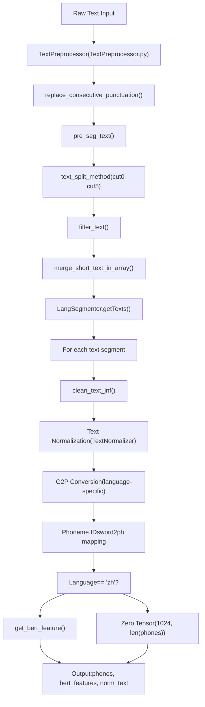
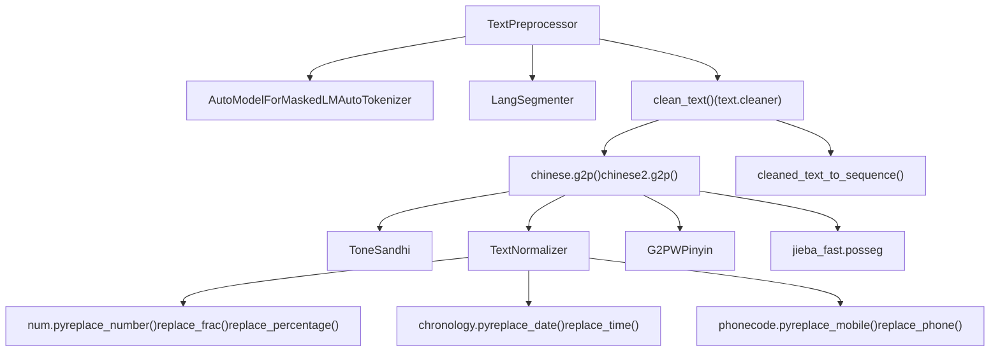
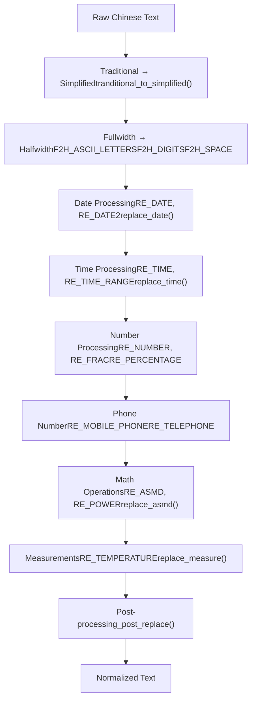
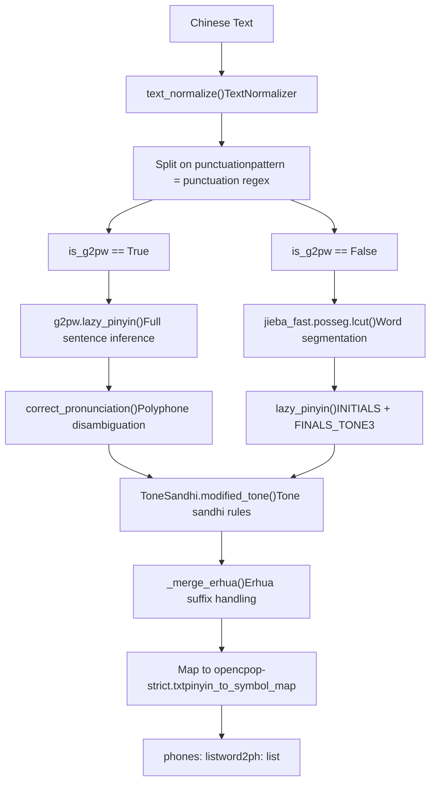
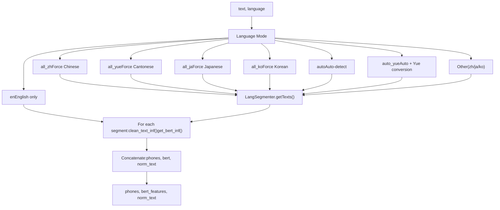

# Text Processing

Relevant source files

-   [.gitignore](https://github.com/RVC-Boss/GPT-SoVITS/blob/c767f0b8/.gitignore)
-   [GPT\_SoVITS/AR/models/t2s\_model.py](https://github.com/RVC-Boss/GPT-SoVITS/blob/c767f0b8/GPT_SoVITS/AR/models/t2s_model.py)
-   [GPT\_SoVITS/AR/models/utils.py](https://github.com/RVC-Boss/GPT-SoVITS/blob/c767f0b8/GPT_SoVITS/AR/models/utils.py)
-   [GPT\_SoVITS/TTS\_infer\_pack/TTS.py](https://github.com/RVC-Boss/GPT-SoVITS/blob/c767f0b8/GPT_SoVITS/TTS_infer_pack/TTS.py)
-   [GPT\_SoVITS/TTS\_infer\_pack/TextPreprocessor.py](https://github.com/RVC-Boss/GPT-SoVITS/blob/c767f0b8/GPT_SoVITS/TTS_infer_pack/TextPreprocessor.py)
-   [GPT\_SoVITS/configs/tts\_infer.yaml](https://github.com/RVC-Boss/GPT-SoVITS/blob/c767f0b8/GPT_SoVITS/configs/tts_infer.yaml)
-   [GPT\_SoVITS/text/chinese.py](https://github.com/RVC-Boss/GPT-SoVITS/blob/c767f0b8/GPT_SoVITS/text/chinese.py)
-   [GPT\_SoVITS/text/chinese2.py](https://github.com/RVC-Boss/GPT-SoVITS/blob/c767f0b8/GPT_SoVITS/text/chinese2.py)
-   [GPT\_SoVITS/text/zh\_normalization/num.py](https://github.com/RVC-Boss/GPT-SoVITS/blob/c767f0b8/GPT_SoVITS/text/zh_normalization/num.py)
-   [GPT\_SoVITS/text/zh\_normalization/text\_normlization.py](https://github.com/RVC-Boss/GPT-SoVITS/blob/c767f0b8/GPT_SoVITS/text/zh_normalization/text_normlization.py)
-   [api\_v2.py](https://github.com/RVC-Boss/GPT-SoVITS/blob/c767f0b8/api_v2.py)

## Overview

The Text Processing system converts raw text input into phoneme sequences, BERT features, and normalized text suitable for TTS generation. This system handles multi-language text with language-specific processing pipelines, text normalization, grapheme-to-phoneme (G2P) conversion, and linguistic feature extraction.

**Scope**: This page covers the general text processing architecture and normalization subsystems. For detailed language-specific implementations, see:

-   Language detection and segmentation: [Language Detection and Segmentation](/RVC-Boss/GPT-SoVITS/4.1-language-detection-and-segmentation)
-   Chinese text processing: [Chinese Text Processing](/RVC-Boss/GPT-SoVITS/4.2-chinese-text-processing)
-   Other language support: [Other Language Support](/RVC-Boss/GPT-SoVITS/4.3-multi-language-support)

## Text Processing Pipeline

The text processing pipeline transforms raw text through multiple stages to produce model-ready features:


**Sources**: [GPT\_SoVITS/TTS\_infer\_pack/TextPreprocessor.py52-239](https://github.com/RVC-Boss/GPT-SoVITS/blob/c767f0b8/GPT_SoVITS/TTS_infer_pack/TextPreprocessor.py#L52-L239)

## Core Components

### TextPreprocessor Class

The `TextPreprocessor` class [GPT\_SoVITS/TTS\_infer\_pack/TextPreprocessor.py52-58](https://github.com/RVC-Boss/GPT-SoVITS/blob/c767f0b8/GPT_SoVITS/TTS_infer_pack/TextPreprocessor.py#L52-L58) orchestrates the entire text processing workflow. It requires a BERT model, tokenizer, and device for initialization.

**Key Methods**:

| Method | Purpose | Line Reference |
| --- | --- | --- |
| `preprocess()` | Main entry point for batch text processing | [GPT\_SoVITS/TTS\_infer\_pack/TextPreprocessor.py59-75](https://github.com/RVC-Boss/GPT-SoVITS/blob/c767f0b8/GPT_SoVITS/TTS_infer_pack/TextPreprocessor.py#L59-L75) |
| `pre_seg_text()` | Text segmentation and validation | [GPT\_SoVITS/TTS\_infer\_pack/TextPreprocessor.py77-115](https://github.com/RVC-Boss/GPT-SoVITS/blob/c767f0b8/GPT_SoVITS/TTS_infer_pack/TextPreprocessor.py#L77-L115) |
| `get_phones_and_bert()` | Language-aware processing pipeline | [GPT\_SoVITS/TTS\_infer\_pack/TextPreprocessor.py122-189](https://github.com/RVC-Boss/GPT-SoVITS/blob/c767f0b8/GPT_SoVITS/TTS_infer_pack/TextPreprocessor.py#L122-L189) |
| `clean_text_inf()` | Text normalization and G2P conversion | [GPT\_SoVITS/TTS\_infer\_pack/TextPreprocessor.py206-210](https://github.com/RVC-Boss/GPT-SoVITS/blob/c767f0b8/GPT_SoVITS/TTS_infer_pack/TextPreprocessor.py#L206-L210) |
| `get_bert_feature()` | BERT embedding extraction | [GPT\_SoVITS/TTS\_infer\_pack/TextPreprocessor.py191-204](https://github.com/RVC-Boss/GPT-SoVITS/blob/c767f0b8/GPT_SoVITS/TTS_infer_pack/TextPreprocessor.py#L191-L204) |

### Code Entity Relationships


**Sources**: [GPT\_SoVITS/TTS\_infer\_pack/TextPreprocessor.py1-239](https://github.com/RVC-Boss/GPT-SoVITS/blob/c767f0b8/GPT_SoVITS/TTS_infer_pack/TextPreprocessor.py#L1-L239) [GPT\_SoVITS/text/chinese.py1-195](https://github.com/RVC-Boss/GPT-SoVITS/blob/c767f0b8/GPT_SoVITS/text/chinese.py#L1-L195) [GPT\_SoVITS/text/chinese2.py1-340](https://github.com/RVC-Boss/GPT-SoVITS/blob/c767f0b8/GPT_SoVITS/text/chinese2.py#L1-L340)

### Text Segmentation Strategy

The system provides multiple text splitting methods to handle different input formats:

| Method | Description | Implementation |
| --- | --- | --- |
| `cut0` | No splitting | Returns text as-is |
| `cut1` | Split on 4 punctuation marks | Splits on `。，？！` |
| `cut2` | Split on 2 punctuation marks | Splits on `。？` |
| `cut3` | Split on Chinese sentence-end marks | Splits on `。！？` |
| `cut4` | Split on English sentence-end marks | Splits on `.!?` |
| `cut5` | Custom split method | Based on `\n` splits |

Merged short segments are combined if below a threshold [GPT\_SoVITS/TTS\_infer\_pack/TextPreprocessor.py34-49](https://github.com/RVC-Boss/GPT-SoVITS/blob/c767f0b8/GPT_SoVITS/TTS_infer_pack/TextPreprocessor.py#L34-L49) to ensure efficient processing.

**Sources**: [GPT\_SoVITS/TTS\_infer\_pack/text\_segmentation\_method.py](https://github.com/RVC-Boss/GPT-SoVITS/blob/c767f0b8/GPT_SoVITS/TTS_infer_pack/text_segmentation_method.py)

## Text Normalization System

### TextNormalizer Architecture

The `TextNormalizer` class [GPT\_SoVITS/text/zh\_normalization/text\_normlization.py61-176](https://github.com/RVC-Boss/GPT-SoVITS/blob/c767f0b8/GPT_SoVITS/text/zh_normalization/text_normlization.py#L61-L176) provides comprehensive Chinese text normalization through a rule-based pipeline:


**Sources**: [GPT\_SoVITS/text/zh\_normalization/text\_normlization.py61-176](https://github.com/RVC-Boss/GPT-SoVITS/blob/c767f0b8/GPT_SoVITS/text/zh_normalization/text_normlization.py#L61-L176)

### Number Normalization

The number normalization module [GPT\_SoVITS/text/zh\_normalization/num.py](https://github.com/RVC-Boss/GPT-SoVITS/blob/c767f0b8/GPT_SoVITS/text/zh_normalization/num.py) converts various numeric expressions to Chinese characters:

**Supported Number Formats**:

| Format | Regular Expression | Handler Function | Example |
| --- | --- | --- | --- |
| Fractions | `RE_FRAC` | `replace_frac()` | `3/4` → `四分之三` |
| Percentages | `RE_PERCENTAGE` | `replace_percentage()` | `50%` → `百分之五十` |
| Negative numbers | `RE_INTEGER` | `replace_negative_num()` | `-10` → `负十` |
| Decimals | `RE_DECIMAL_NUM` | `replace_number()` | `3.14` → `三点一四` |
| Ranges | `RE_RANGE` | `replace_range()` | `10-20` → `十到二十` |
| Math operations | `RE_ASMD` | `replace_asmd()` | `3+5` → `3加5` |
| Version numbers | `RE_VERSION_NUM` | `replace_vrsion_num()` | `1.2.3` → `一点二点三` |

**Cardinal Number Conversion**:

The `verbalize_cardinal()` function [GPT\_SoVITS/text/zh\_normalization/num.py293-306](https://github.com/RVC-Boss/GPT-SoVITS/blob/c767f0b8/GPT_SoVITS/text/zh_normalization/num.py#L293-L306) converts numeric strings to Chinese using place-value units:

```
DIGITS = {str(i): tran for i, tran in enumerate("零一二三四五六七八九")}UNITS = OrderedDict({1: "十", 2: "百", 3: "千", 4: "万", 8: "亿"})
```
Example: `1234` → `一千二百三十四`

**Sources**: [GPT\_SoVITS/text/zh\_normalization/num.py1-340](https://github.com/RVC-Boss/GPT-SoVITS/blob/c767f0b8/GPT_SoVITS/text/zh_normalization/num.py#L1-L340)

### Quantifier Handling

Positive integers followed by quantifiers [GPT\_SoVITS/text/zh\_normalization/num.py175-191](https://github.com/RVC-Boss/GPT-SoVITS/blob/c767f0b8/GPT_SoVITS/text/zh_normalization/num.py#L175-L191) receive special treatment:

-   Pattern: `(\d+)([多余几\+])?` + quantifier
-   `二` is converted to `两` before measure words
-   Example: `2个` → `两个`, `3多天` → `三多天`

**Sources**: [GPT\_SoVITS/text/zh\_normalization/num.py34-191](https://github.com/RVC-Boss/GPT-SoVITS/blob/c767f0b8/GPT_SoVITS/text/zh_normalization/num.py#L34-L191)

## Chinese G2P Conversion

### Two Implementation Variants

The system provides two Chinese G2P implementations with different pinyin prediction strategies:

| File | Pinyin Method | Features | Use Case |
| --- | --- | --- | --- |
| `chinese.py` | `pypinyin` | Basic pinyin, fast | Default, simpler texts |
| `chinese2.py` | `G2PWPinyin` (optional) | Context-aware polyphone disambiguation | Better accuracy, configurable via `is_g2pw` flag |

**Sources**: [GPT\_SoVITS/text/chinese.py1-195](https://github.com/RVC-Boss/GPT-SoVITS/blob/c767f0b8/GPT_SoVITS/text/chinese.py#L1-L195) [GPT\_SoVITS/text/chinese2.py1-340](https://github.com/RVC-Boss/GPT-SoVITS/blob/c767f0b8/GPT_SoVITS/text/chinese2.py#L1-L340)

### G2P Pipeline


**Sources**: [GPT\_SoVITS/text/chinese.py76-168](https://github.com/RVC-Boss/GPT-SoVITS/blob/c767f0b8/GPT_SoVITS/text/chinese.py#L76-L168) [GPT\_SoVITS/text/chinese2.py73-295](https://github.com/RVC-Boss/GPT-SoVITS/blob/c767f0b8/GPT_SoVITS/text/chinese2.py#L73-L295)

### Tone Sandhi Processing

The `ToneSandhi` class [GPT\_SoVITS/text/tone\_sandhi.py](https://github.com/RVC-Boss/GPT-SoVITS/blob/c767f0b8/GPT_SoVITS/text/tone_sandhi.py) applies Chinese tone change rules:

-   **Third tone sandhi**: Two consecutive third tones → first becomes second tone
-   **"一" (one) tone changes**: Context-dependent tone variations
-   **"不" (not) tone changes**: Tone varies based on following syllable
-   **Pre-merge processing**: Combines certain word patterns before tone modification

**Sources**: [GPT\_SoVITS/text/tone\_sandhi.py](https://github.com/RVC-Boss/GPT-SoVITS/blob/c767f0b8/GPT_SoVITS/text/tone_sandhi.py)

### Erhua (儿化音) Handling

The `_merge_erhua()` function [GPT\_SoVITS/text/chinese2.py142-177](https://github.com/RVC-Boss/GPT-SoVITS/blob/c767f0b8/GPT_SoVITS/text/chinese2.py#L142-L177) handles the "r-coloring" suffix common in Beijing Mandarin:

-   Checks word against `must_erhua` and `not_erhua` sets [GPT\_SoVITS/text/chinese2.py93-139](https://github.com/RVC-Boss/GPT-SoVITS/blob/c767f0b8/GPT_SoVITS/text/chinese2.py#L93-L139)
-   Merges "儿" suffix with preceding syllable
-   Adjusts final to match preceding syllable's tone
-   Example: `小院儿` → special merged pronunciation

**Sources**: [GPT\_SoVITS/text/chinese2.py93-177](https://github.com/RVC-Boss/GPT-SoVITS/blob/c767f0b8/GPT_SoVITS/text/chinese2.py#L93-L177)

### Pinyin Symbol Mapping

Pinyin syllables are mapped to phonetic symbols via `opencpop-strict.txt` [GPT\_SoVITS/text/chinese.py14-17](https://github.com/RVC-Boss/GPT-SoVITS/blob/c767f0b8/GPT_SoVITS/text/chinese.py#L14-L17):

```
Format: pinyin\tinitial final
Example: ni\tn i
```
The G2P process:

1.  Splits pinyin into initial and final
2.  Applies syllable-specific transformations [GPT\_SoVITS/text/chinese.py121-160](https://github.com/RVC-Boss/GPT-SoVITS/blob/c767f0b8/GPT_SoVITS/text/chinese.py#L121-L160)
3.  Maps to symbols: `new_c, new_v = pinyin_to_symbol_map[pinyin].split(" ")`
4.  Appends tone number to final: `new_v = new_v + tone`

**Sources**: [GPT\_SoVITS/text/chinese.py14-168](https://github.com/RVC-Boss/GPT-SoVITS/blob/c767f0b8/GPT_SoVITS/text/chinese.py#L14-L168)

## Punctuation Handling

### Punctuation Replacement

The system normalizes punctuation marks to a standardized set [GPT\_SoVITS/text/chinese.py26-55](https://github.com/RVC-Boss/GPT-SoVITS/blob/c767f0b8/GPT_SoVITS/text/chinese.py#L26-L55):

```
rep_map = {    "：": ",", "；": ",", "，": ",", "。": ".",    "！": "!", "？": "?", "\n": ".",    "·": ",", "、": ",", "...": "…",    "$": ".", "/": ",", "—": "-",    "~": "…", "～": "…"}
```
After replacement:

-   Filters non-Chinese characters and non-punctuation [GPT\_SoVITS/text/chinese.py53](https://github.com/RVC-Boss/GPT-SoVITS/blob/c767f0b8/GPT_SoVITS/text/chinese.py#L53-L53)
-   Collapses consecutive punctuation marks [GPT\_SoVITS/text/chinese.py69-73](https://github.com/RVC-Boss/GPT-SoVITS/blob/c767f0b8/GPT_SoVITS/text/chinese.py#L69-L73)

**Sources**: [GPT\_SoVITS/text/chinese.py26-74](https://github.com/RVC-Boss/GPT-SoVITS/blob/c767f0b8/GPT_SoVITS/text/chinese.py#L26-L74)

## Language-Specific Processing Flow

The `get_phones_and_bert()` method [GPT\_SoVITS/TTS\_infer\_pack/TextPreprocessor.py122-189](https://github.com/RVC-Boss/GPT-SoVITS/blob/c767f0b8/GPT_SoVITS/TTS_infer_pack/TextPreprocessor.py#L122-L189) routes text through language-specific pipelines:


**Sources**: [GPT\_SoVITS/TTS\_infer\_pack/TextPreprocessor.py122-189](https://github.com/RVC-Boss/GPT-SoVITS/blob/c767f0b8/GPT_SoVITS/TTS_infer_pack/TextPreprocessor.py#L122-L189)

## BERT Feature Extraction

### Feature Extraction Process

For Chinese text only, the system extracts BERT embeddings [GPT\_SoVITS/TTS\_infer\_pack/TextPreprocessor.py191-222](https://github.com/RVC-Boss/GPT-SoVITS/blob/c767f0b8/GPT_SoVITS/TTS_infer_pack/TextPreprocessor.py#L191-L222):

1.  **Tokenization**: Text is tokenized using `AutoTokenizer`
2.  **Model inference**: BERT model produces hidden states
3.  **Layer selection**: Concatenates last 2 hidden layers [GPT\_SoVITS/TTS\_infer\_pack/TextPreprocessor.py197](https://github.com/RVC-Boss/GPT-SoVITS/blob/c767f0b8/GPT_SoVITS/TTS_infer_pack/TextPreprocessor.py#L197-L197)
4.  **Phone-level alignment**: Features are repeated according to `word2ph` mapping [GPT\_SoVITS/TTS\_infer\_pack/TextPreprocessor.py199-203](https://github.com/RVC-Boss/GPT-SoVITS/blob/c767f0b8/GPT_SoVITS/TTS_infer_pack/TextPreprocessor.py#L199-L203)
5.  **Output shape**: `(1024, num_phones)` tensor

**Non-Chinese languages**: Zero tensor of shape `(1024, len(phones))` [GPT\_SoVITS/TTS\_infer\_pack/TextPreprocessor.py217-220](https://github.com/RVC-Boss/GPT-SoVITS/blob/c767f0b8/GPT_SoVITS/TTS_infer_pack/TextPreprocessor.py#L217-L220)

**Sources**: [GPT\_SoVITS/TTS\_infer\_pack/TextPreprocessor.py191-222](https://github.com/RVC-Boss/GPT-SoVITS/blob/c767f0b8/GPT_SoVITS/TTS_infer_pack/TextPreprocessor.py#L191-L222)

## Output Format

The text processing system produces three outputs for each text segment:

### Phones (Phoneme Sequence)

-   **Type**: `List[int]`
-   **Content**: Phoneme IDs mapped from symbol strings
-   **Mapping**: Via `cleaned_text_to_sequence()` [GPT\_SoVITS/TTS\_infer\_pack/TextPreprocessor.py209](https://github.com/RVC-Boss/GPT-SoVITS/blob/c767f0b8/GPT_SoVITS/TTS_infer_pack/TextPreprocessor.py#L209-L209)
-   **Version-dependent**: Symbol sets vary by model version (v1, v2)

### Word2ph Mapping

-   **Type**: `List[int]`
-   **Content**: Number of phonemes per character/word
-   **Purpose**: Aligns character-level features to phone-level
-   **Example**: `"你好"` with word2ph `[2, 2]` means 2 phones each

### BERT Features

-   **Type**: `torch.Tensor`
-   **Shape**: `(1024, num_phones)`
-   **Content**:
    -   Chinese: Contextualized embeddings from BERT
    -   Other languages: Zero tensor
-   **Device**: Moved to model device (CPU/CUDA)

### Normalized Text

-   **Type**: `str`
-   **Content**: Cleaned, normalized text after all transformations
-   **Purpose**: Human-readable reference of processed text

**Complete Output Structure**:

```
{    "phones": [23, 45, 67, ...],           # List of phoneme IDs    "bert_features": torch.Tensor(1024, N), # BERT embeddings    "norm_text": "你好世界"                   # Normalized text}
```
**Sources**: [GPT\_SoVITS/TTS\_infer\_pack/TextPreprocessor.py59-75](https://github.com/RVC-Boss/GPT-SoVITS/blob/c767f0b8/GPT_SoVITS/TTS_infer_pack/TextPreprocessor.py#L59-L75) [GPT\_SoVITS/TTS\_infer\_pack/TextPreprocessor.py206-222](https://github.com/RVC-Boss/GPT-SoVITS/blob/c767f0b8/GPT_SoVITS/TTS_infer_pack/TextPreprocessor.py#L206-L222)
