# Language Detection and Segmentation

Relevant source files

-   [GPT\_SoVITS/TTS\_infer\_pack/TextPreprocessor.py](https://github.com/RVC-Boss/GPT-SoVITS/blob/c767f0b8/GPT_SoVITS/TTS_infer_pack/TextPreprocessor.py)
-   [GPT\_SoVITS/text/chinese.py](https://github.com/RVC-Boss/GPT-SoVITS/blob/c767f0b8/GPT_SoVITS/text/chinese.py)
-   [GPT\_SoVITS/text/chinese2.py](https://github.com/RVC-Boss/GPT-SoVITS/blob/c767f0b8/GPT_SoVITS/text/chinese2.py)
-   [GPT\_SoVITS/text/zh\_normalization/num.py](https://github.com/RVC-Boss/GPT-SoVITS/blob/c767f0b8/GPT_SoVITS/text/zh_normalization/num.py)
-   [GPT\_SoVITS/text/zh\_normalization/text\_normlization.py](https://github.com/RVC-Boss/GPT-SoVITS/blob/c767f0b8/GPT_SoVITS/text/zh_normalization/text_normlization.py)

GPT-SoVITS provides automatic language detection and text segmentation to handle mixed-language input. The system segments text into language-specific chunks and routes each segment to the appropriate text processing pipeline. This enables seamless handling of multilingual text without manual language annotation.

The language detection system supports Chinese (Simplified), English, Japanese, Korean, and Cantonese, with different operating modes for single-language, mixed-language, and auto-detection scenarios.

## Overview

The language detection and segmentation system operates through several components:

**Language Detection Pipeline**

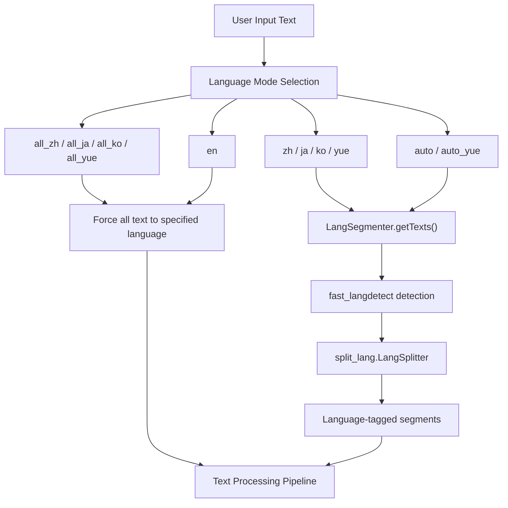
Sources: [GPT\_SoVITS/TTS\_infer\_pack/TextPreprocessor.py122-189](https://github.com/RVC-Boss/GPT-SoVITS/blob/c767f0b8/GPT_SoVITS/TTS_infer_pack/TextPreprocessor.py#L122-L189) [GPT\_SoVITS/text/LangSegmenter/langsegmenter.py77-213](https://github.com/RVC-Boss/GPT-SoVITS/blob/c767f0b8/GPT_SoVITS/text/LangSegmenter/langsegmenter.py#L77-L213)

## Language Modes

The TTS system supports multiple language modes configured through the `text_lang` parameter. The available modes depend on the model version:

### Version-Specific Language Support

| Mode | v1 Support | v2+ Support | Description |
| --- | --- | --- | --- |
| `auto` | ✓ | ✓ | Auto-detect languages and segment |
| `auto_yue` | ✗ | ✓ | Auto-detect, treat Chinese as Cantonese |
| `en` | ✓ | ✓ | Treat all text as English |
| `zh` | ✓ | ✓ | Mixed Chinese-English, detect boundaries |
| `ja` | ✓ | ✓ | Mixed Japanese-English, detect boundaries |
| `yue` | ✗ | ✓ | Mixed Cantonese-English, detect boundaries |
| `ko` | ✗ | ✓ | Mixed Korean-English, detect boundaries |
| `all_zh` | ✓ | ✓ | Force all text as Chinese |
| `all_ja` | ✓ | ✓ | Force all text as Japanese |
| `all_yue` | ✗ | ✓ | Force all text as Cantonese |
| `all_ko` | ✗ | ✓ | Force all text as Korean |

Sources: [GPT\_SoVITS/TTS\_infer\_pack/TTS.py275-277](https://github.com/RVC-Boss/GPT-SoVITS/blob/c767f0b8/GPT_SoVITS/TTS_infer_pack/TTS.py#L275-L277)

### Language Mode Processing

**Mode-Based Text Processing Flow**

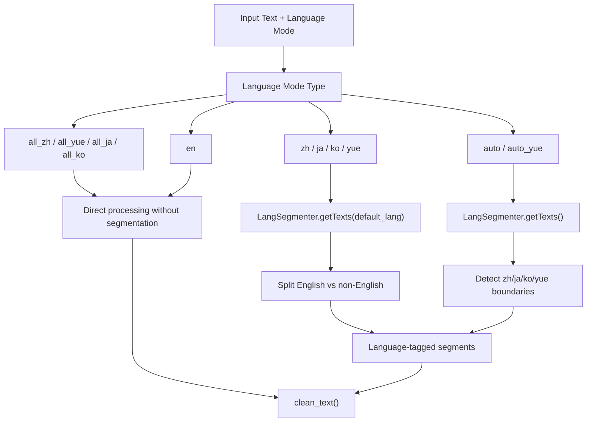
In mixed language modes (e.g., `zh`, `ja`), the system distinguishes between English segments and the specified language, but treats the specified language uniformly. For example, in `zh` mode, Japanese characters would be processed as Chinese.

Sources: [GPT\_SoVITS/TTS\_infer\_pack/TextPreprocessor.py127-169](https://github.com/RVC-Boss/GPT-SoVITS/blob/c767f0b8/GPT_SoVITS/TTS_infer_pack/TextPreprocessor.py#L127-L169)

## LangSegmenter Architecture

The `LangSegmenter` class in [GPT\_SoVITS/text/LangSegmenter/langsegmenter.py](https://github.com/RVC-Boss/GPT-SoVITS/blob/c767f0b8/GPT_SoVITS/text/LangSegmenter/langsegmenter.py) implements the core language detection and segmentation logic. It uses two external libraries:

1.  **fast\_langdetect**: Detects language of text segments
2.  **split\_lang.LangSplitter**: Splits text into character-level language boundaries

**LangSegmenter Component Architecture**

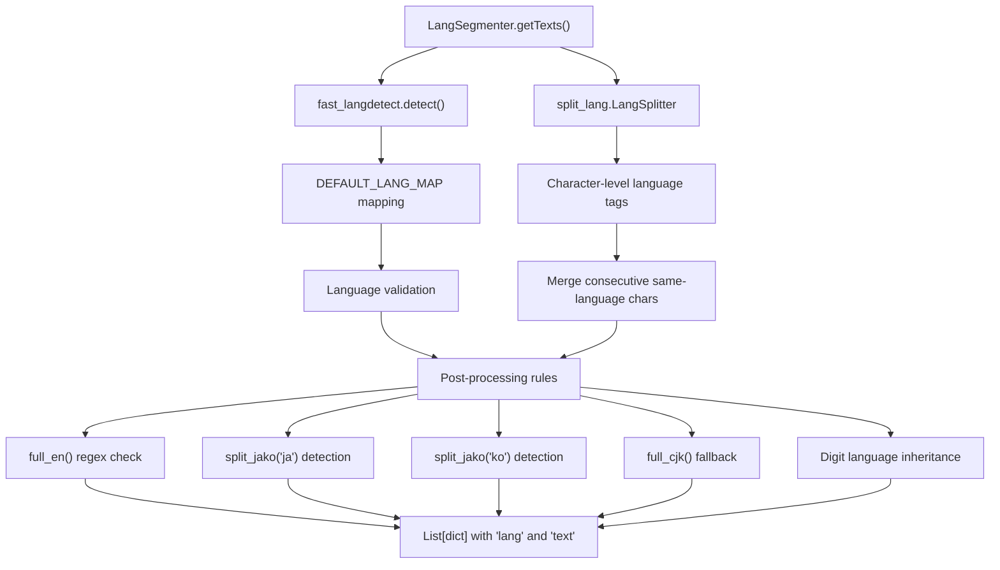
Sources: [GPT\_SoVITS/text/LangSegmenter/langsegmenter.py77-213](https://github.com/RVC-Boss/GPT-SoVITS/blob/c767f0b8/GPT_SoVITS/text/LangSegmenter/langsegmenter.py#L77-L213)

### Language Code Mapping

The `DEFAULT_LANG_MAP` normalizes language detection results into supported language codes:

| Detected Code | Mapped Code | Notes |
| --- | --- | --- |
| `zh` | `zh` | Chinese Simplified |
| `yue` | `zh` | Cantonese mapped to Chinese |
| `wuu` | `zh` | Wu Chinese mapped to Chinese |
| `zh-cn` | `zh` | Mainland Chinese |
| `zh-tw` | `x` | Traditional Chinese marked as unknown |
| `ko` | `ko` | Korean |
| `ja` | `ja` | Japanese |
| `en` | `en` | English |

Sources: [GPT\_SoVITS/text/LangSegmenter/langsegmenter.py78-88](https://github.com/RVC-Boss/GPT-SoVITS/blob/c767f0b8/GPT_SoVITS/text/LangSegmenter/langsegmenter.py#L78-L88)

## Language Detection Process

The language detection process involves multiple stages of analysis and refinement:

### Stage 1: Initial Detection

**Initial Language Detection**

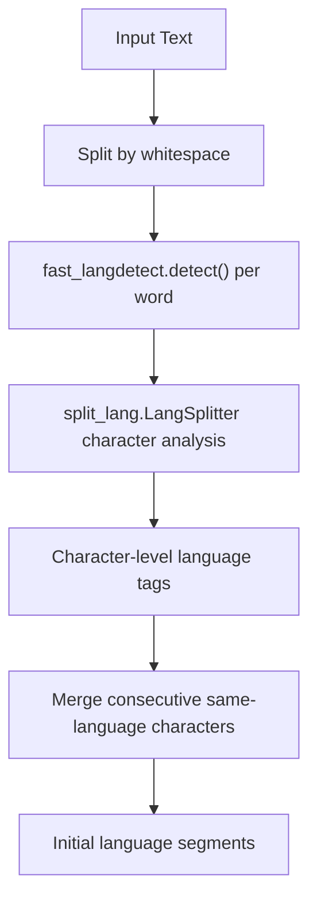
Sources: [GPT\_SoVITS/text/LangSegmenter/langsegmenter.py90-130](https://github.com/RVC-Boss/GPT-SoVITS/blob/c767f0b8/GPT_SoVITS/text/LangSegmenter/langsegmenter.py#L90-L130)

### Stage 2: Refinement and Pattern Matching

After initial detection, the system applies pattern-based refinement:

**Pattern-Based Refinement**

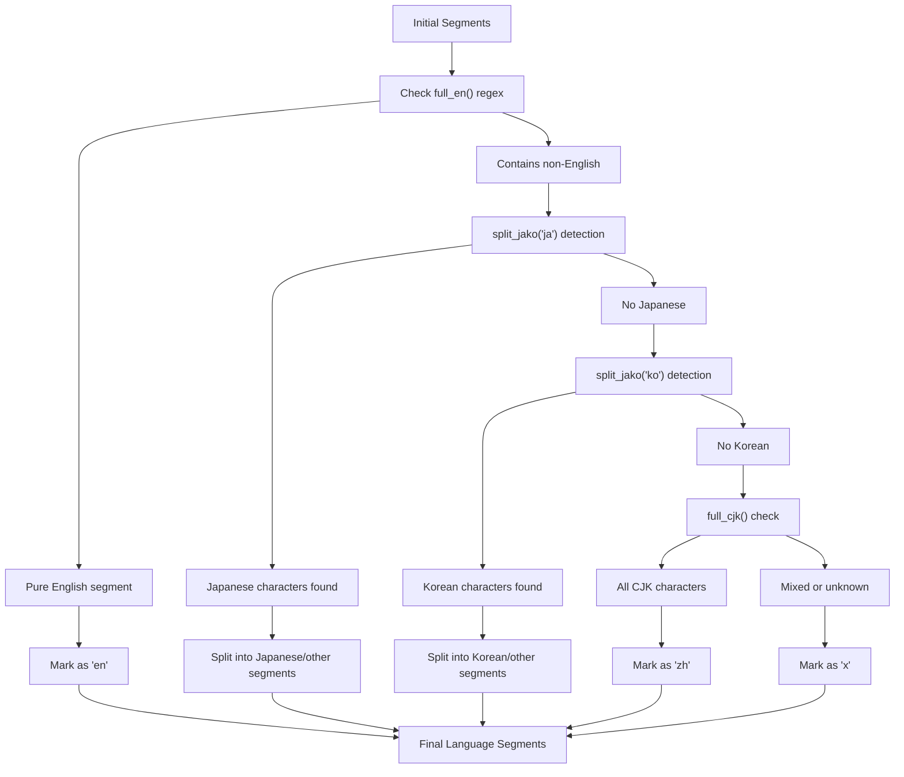
Sources: [GPT\_SoVITS/text/LangSegmenter/langsegmenter.py131-213](https://github.com/RVC-Boss/GPT-SoVITS/blob/c767f0b8/GPT_SoVITS/text/LangSegmenter/langsegmenter.py#L131-L213)

### Pattern Detection Functions

The system uses specialized pattern detection functions:

| Function | Purpose | Pattern |
| --- | --- | --- |
| `full_en()` | Detect pure English | `^[a-zA-Z\s.,!?;:'"\-()]+$` |
| `full_cjk()` | Detect CJK characters | `^[\u4e00-\u9fff\u3040-\u309f\u30a0-\u30ff]+$` |
| `split_jako()` | Detect Japanese/Korean | Character range analysis |

Sources: [GPT\_SoVITS/text/LangSegmenter/langsegmenter.py17-66](https://github.com/RVC-Boss/GPT-SoVITS/blob/c767f0b8/GPT_SoVITS/text/LangSegmenter/langsegmenter.py#L17-L66)

### Special Cases

**Digit Language Assignment**

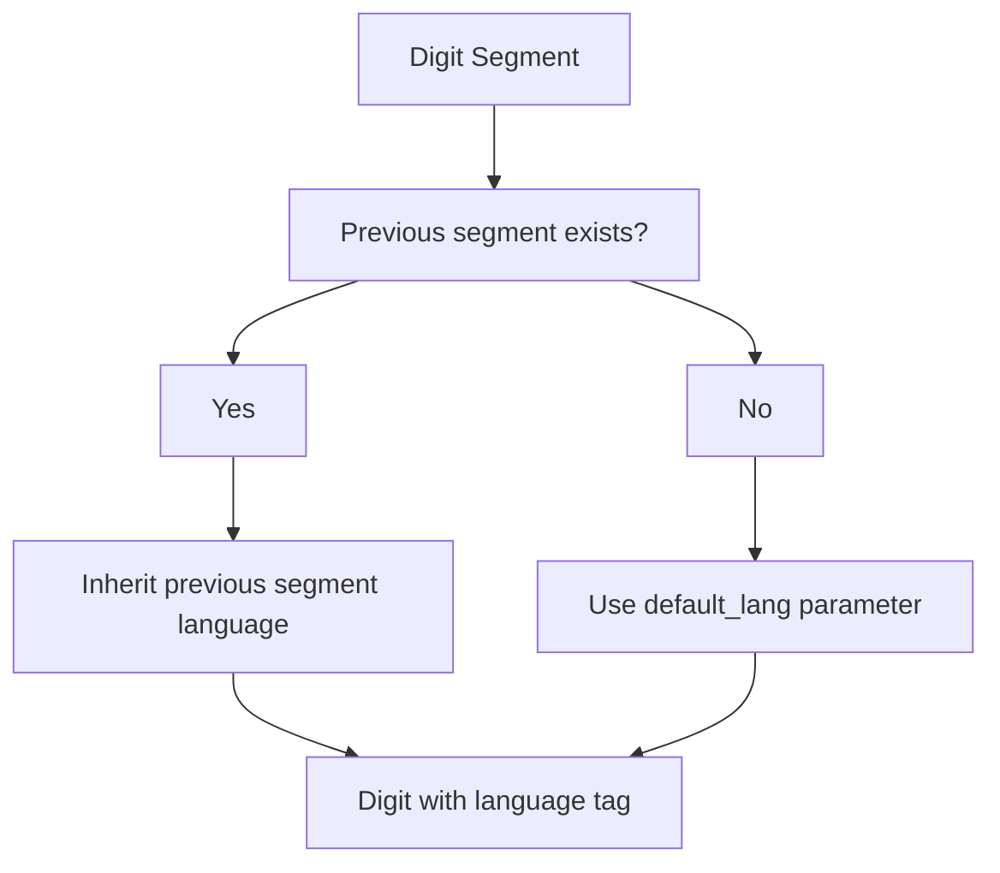
Digits and numbers inherit the language of the preceding text segment. If no previous segment exists, they use the `default_lang` parameter passed to `getTexts()`.

Sources: [GPT\_SoVITS/text/LangSegmenter/langsegmenter.py175-186](https://github.com/RVC-Boss/GPT-SoVITS/blob/c767f0b8/GPT_SoVITS/text/LangSegmenter/langsegmenter.py#L175-L186)

## Segment Output Format

The `LangSegmenter.getTexts()` method returns a list of dictionaries:

```
[    {"lang": "zh", "text": "这是中文"},    {"lang": "en", "text": "This is English"},    {"lang": "ja", "text": "これは日本語です"}]
```
Each segment contains:

-   `lang`: Language code (`zh`, `en`, `ja`, `ko`, `yue`, or `x` for unknown)
-   `text`: Text content for that segment

Sources: [GPT\_SoVITS/text/LangSegmenter/langsegmenter.py90-213](https://github.com/RVC-Boss/GPT-SoVITS/blob/c767f0b8/GPT_SoVITS/text/LangSegmenter/langsegmenter.py#L90-L213)

## Integration with Text Processing

The segmented output flows into the text processing pipeline via `TextPreprocessor.get_phones_and_bert()`:

**Segment Processing Integration**

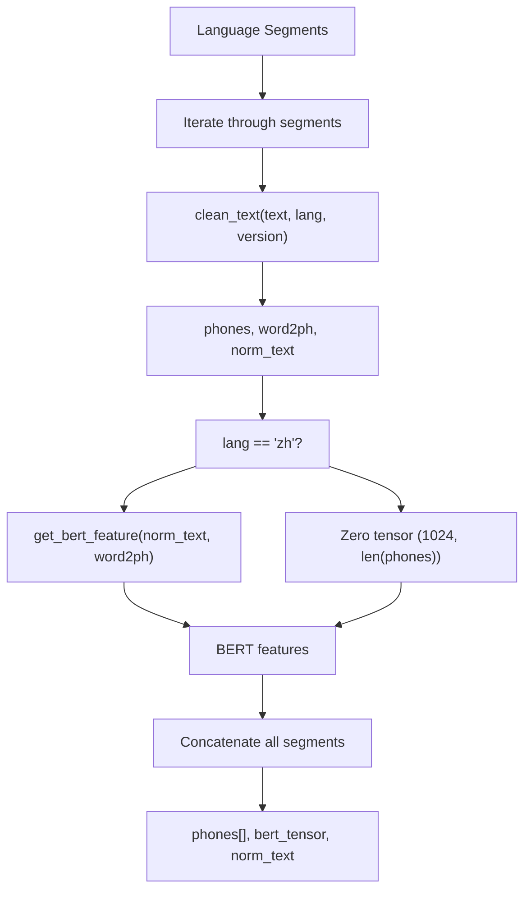
For Chinese segments, BERT features are extracted using `get_bert_feature()`. For all other languages, zero tensors are used as placeholder BERT features.

Sources: [GPT\_SoVITS/TTS\_infer\_pack/TextPreprocessor.py172-189](https://github.com/RVC-Boss/GPT-SoVITS/blob/c767f0b8/GPT_SoVITS/TTS_infer_pack/TextPreprocessor.py#L172-L189) [GPT\_SoVITS/TTS\_infer\_pack/TextPreprocessor.py212-222](https://github.com/RVC-Boss/GPT-SoVITS/blob/c767f0b8/GPT_SoVITS/TTS_infer_pack/TextPreprocessor.py#L212-L222)

## Language-Specific Processing Modules

Each supported language has a dedicated processing module that handles text normalization and G2P conversion.

### Japanese Processing (`japanese.py`)

**Japanese G2P Pipeline**

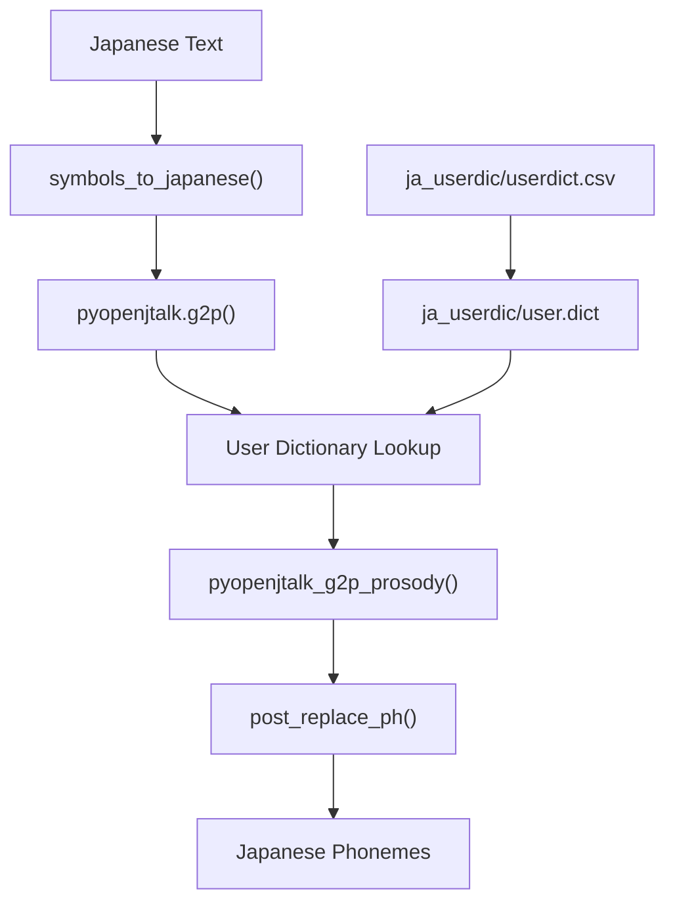
Key functions:

-   `preprocess_jap()`: Main preprocessing with optional prosody
-   `pyopenjtalk_g2p_prosody()`: Extracts phonemes with prosodic symbols
-   `g2p()`: Entry point function returning phoneme list

Sources: [GPT\_SoVITS/text/japanese.py151-171](https://github.com/RVC-Boss/GPT-SoVITS/blob/c767f0b8/GPT_SoVITS/text/japanese.py#L151-L171) [GPT\_SoVITS/text/japanese.py183-256](https://github.com/RVC-Boss/GPT-SoVITS/blob/c767f0b8/GPT_SoVITS/text/japanese.py#L183-L256) [GPT\_SoVITS/text/japanese.py267-271](https://github.com/RVC-Boss/GPT-SoVITS/blob/c767f0b8/GPT_SoVITS/text/japanese.py#L267-L271)

### Korean Processing (`korean.py`)

The Korean module uses `g2pk2.G2p` for romanization and handles number-to-Hangul conversion:

Key features:

-   **Number Normalization**: `hangul_number()` converts digits to Korean numerals
-   **Jamo Decomposition**: `divide_hangul()` splits Hangul into constituent parts
-   **Windows Compatibility**: Special handling for path encoding issues
-   **IPA Conversion**: `korean_to_ipa()` for phonetic representation

Sources: [GPT\_SoVITS/text/korean.py183-259](https://github.com/RVC-Boss/GPT-SoVITS/blob/c767f0b8/GPT_SoVITS/text/korean.py#L183-L259) [GPT\_SoVITS/text/korean.py292-298](https://github.com/RVC-Boss/GPT-SoVITS/blob/c767f0b8/GPT_SoVITS/text/korean.py#L292-L298) [GPT\_SoVITS/text/korean.py324-332](https://github.com/RVC-Boss/GPT-SoVITS/blob/c767f0b8/GPT_SoVITS/text/korean.py#L324-L332)

### Cantonese Processing (`cantonese.py`)

**Cantonese Processing Flow**

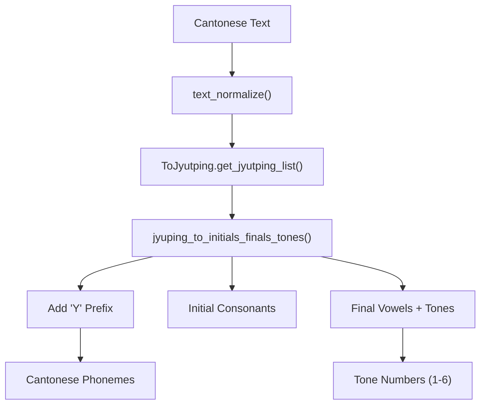
The Cantonese module adds a "Y" prefix to phonemes to prevent conflicts with Mandarin Chinese phonemes in the symbol system.

Sources: [GPT\_SoVITS/text/cantonese.py118-173](https://github.com/RVC-Boss/GPT-SoVITS/blob/c767f0b8/GPT_SoVITS/text/cantonese.py#L118-L173) [GPT\_SoVITS/text/cantonese.py176-194](https://github.com/RVC-Boss/GPT-SoVITS/blob/c767f0b8/GPT_SoVITS/text/cantonese.py#L176-L194) [GPT\_SoVITS/text/cantonese.py203-212](https://github.com/RVC-Boss/GPT-SoVITS/blob/c767f0b8/GPT_SoVITS/text/cantonese.py#L203-L212)

## Symbol System and Version Management

The system supports two symbol set versions with different language coverage:

### Symbol Set Comparison

| Component | Version 1 (`symbols.py`) | Version 2 (`symbols2.py`) |
| --- | --- | --- |
| Chinese Phonemes | ✓ (with tones 1-5) | ✓ (with tones 1-5) |
| Japanese Phonemes | ✓ (basic set) | ✓ (with prosody markers) |
| English ARPA | ✓ | ✓ |
| Korean Phonemes | ✗ | ✓ (`ko_symbols`) |
| Cantonese Phonemes | ✗ | ✓ (`yue_symbols`) |
| Prosody Markers | ✗ | ✓ (`[`, `]`) |

**Symbol Integration Architecture**

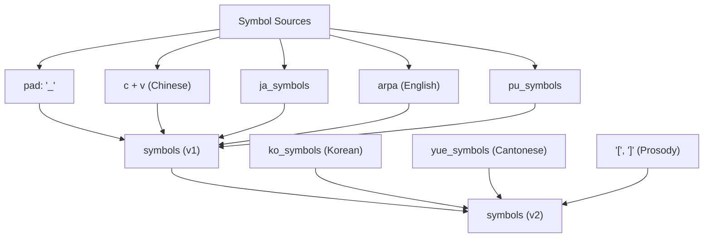
Sources: [GPT\_SoVITS/text/symbols.py396-397](https://github.com/RVC-Boss/GPT-SoVITS/blob/c767f0b8/GPT_SoVITS/text/symbols.py#L396-L397) [GPT\_SoVITS/text/symbols2.py782-788](https://github.com/RVC-Boss/GPT-SoVITS/blob/c767f0b8/GPT_SoVITS/text/symbols2.py#L782-L788)

## Integration with Text Cleaner

The `clean_text()` function in `cleaner.py` orchestrates the entire multi-language processing pipeline:

**Text Cleaning Pipeline**

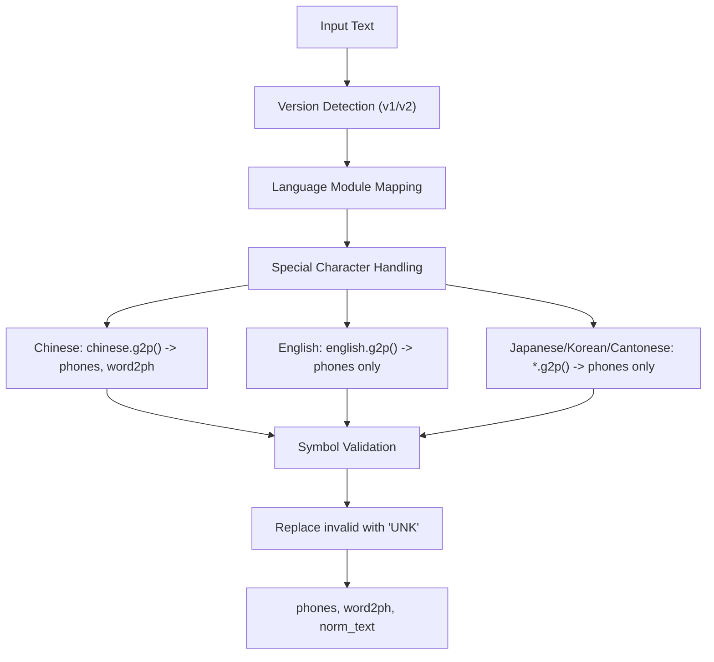
### Special Character Processing

The system handles special characters like `￥` (Chinese currency) and `^` as special pause markers:

```
special = [    ("￥", "zh", "SP2"),  # Chinese currency -> SP2 pause    ("^", "zh", "SP3"),  # Caret -> SP3 pause  ]
```
Sources: [GPT\_SoVITS/text/cleaner.py13-18](https://github.com/RVC-Boss/GPT-SoVITS/blob/c767f0b8/GPT_SoVITS/text/cleaner.py#L13-L18) [GPT\_SoVITS/text/cleaner.py21-55](https://github.com/RVC-Boss/GPT-SoVITS/blob/c767f0b8/GPT_SoVITS/text/cleaner.py#L21-L55) [GPT\_SoVITS/text/cleaner.py58-82](https://github.com/RVC-Boss/GPT-SoVITS/blob/c767f0b8/GPT_SoVITS/text/cleaner.py#L58-L82)

## Text-to-Sequence Conversion

The final step converts processed phonemes to integer sequences for model input:

**Phoneme-to-ID Conversion**

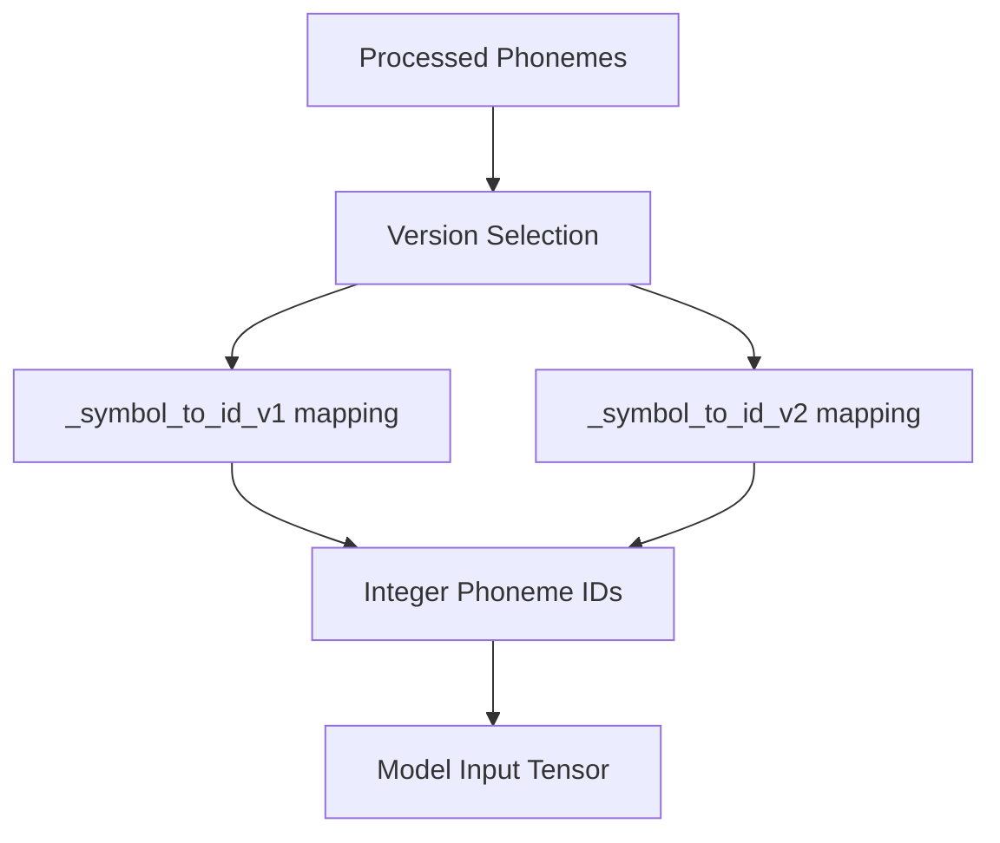
The conversion uses pre-built symbol-to-ID mappings created at module initialization time.

Sources: [GPT\_SoVITS/text/\_\_init\_\_.py10-28](https://github.com/RVC-Boss/GPT-SoVITS/blob/c767f0b8/GPT_SoVITS/text/__init__.py#L10-L28)
