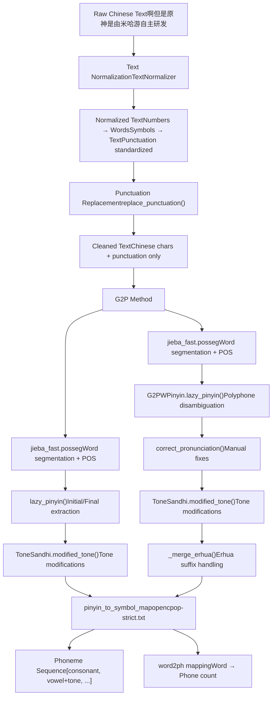
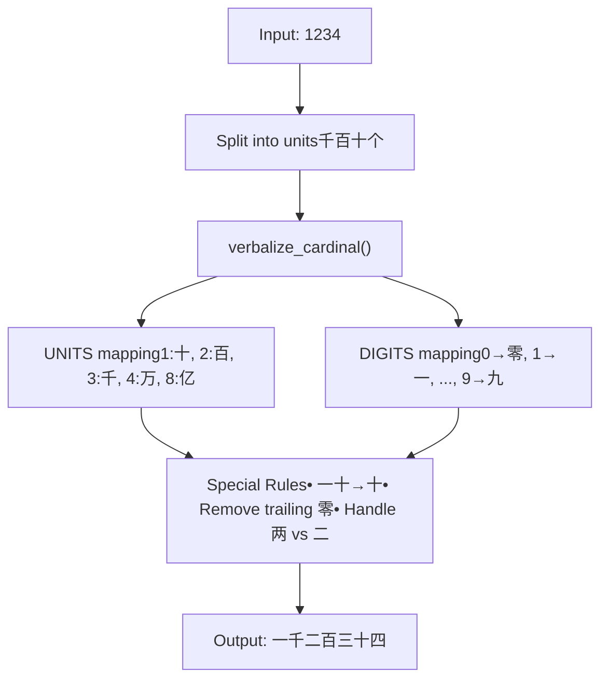
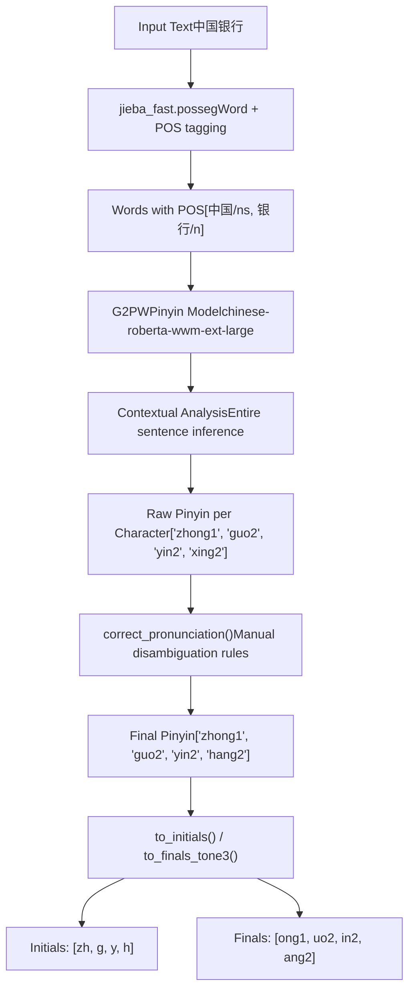
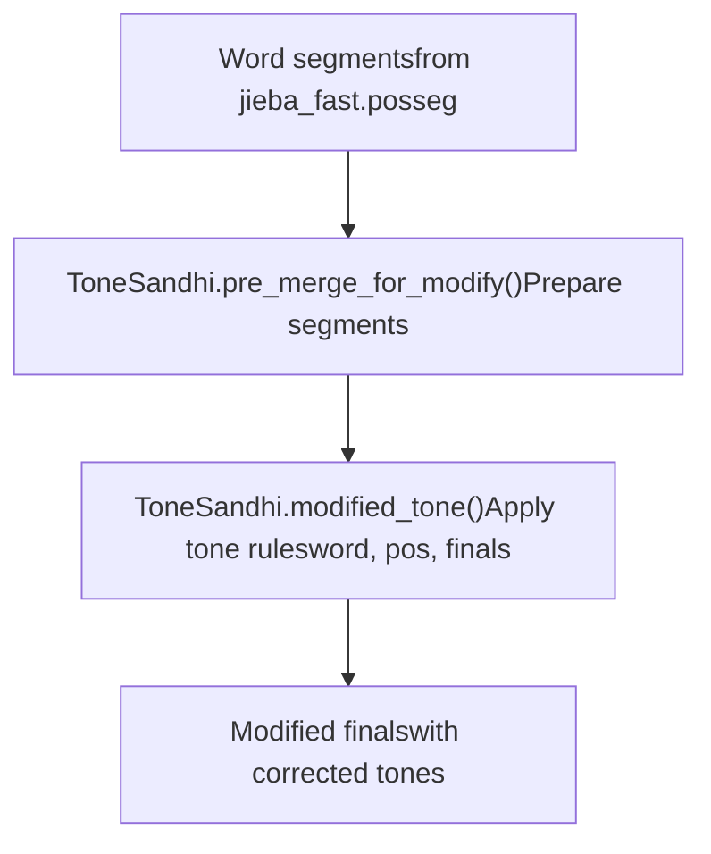
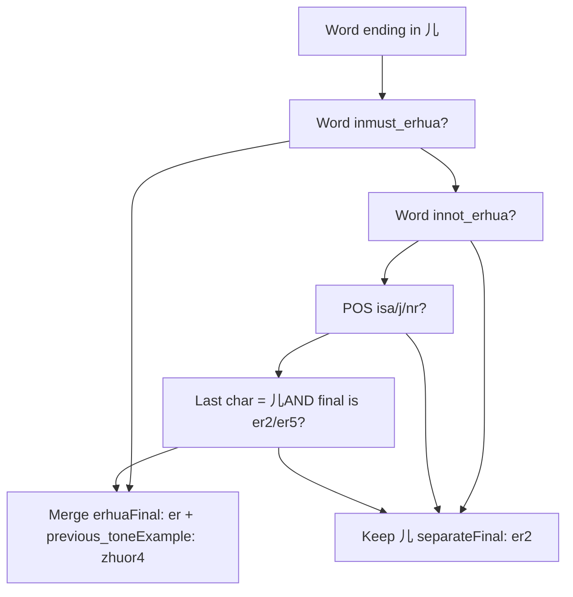
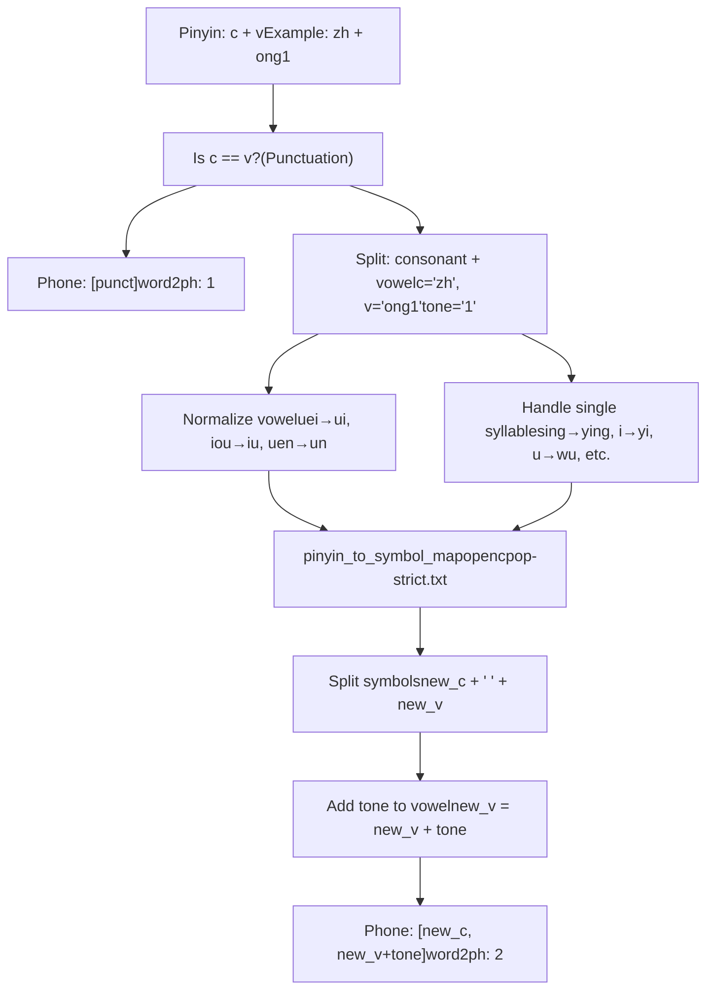
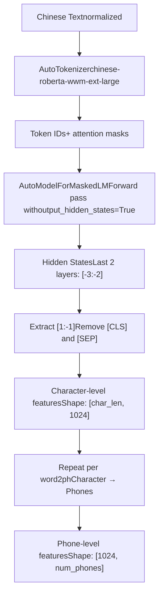
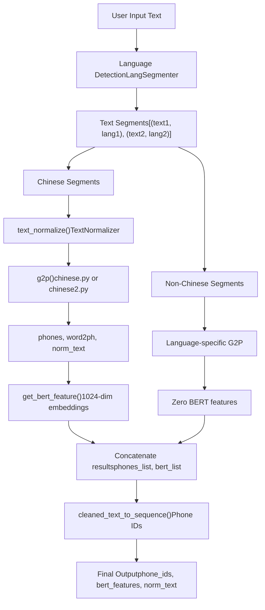

# Chinese Text Processing

Relevant source files

-   [GPT\_SoVITS/TTS\_infer\_pack/TextPreprocessor.py](https://github.com/RVC-Boss/GPT-SoVITS/blob/c767f0b8/GPT_SoVITS/TTS_infer_pack/TextPreprocessor.py)
-   [GPT\_SoVITS/text/chinese.py](https://github.com/RVC-Boss/GPT-SoVITS/blob/c767f0b8/GPT_SoVITS/text/chinese.py)
-   [GPT\_SoVITS/text/chinese2.py](https://github.com/RVC-Boss/GPT-SoVITS/blob/c767f0b8/GPT_SoVITS/text/chinese2.py)
-   [GPT\_SoVITS/text/zh\_normalization/num.py](https://github.com/RVC-Boss/GPT-SoVITS/blob/c767f0b8/GPT_SoVITS/text/zh_normalization/num.py)
-   [GPT\_SoVITS/text/zh\_normalization/text\_normlization.py](https://github.com/RVC-Boss/GPT-SoVITS/blob/c767f0b8/GPT_SoVITS/text/zh_normalization/text_normlization.py)

## Purpose and Scope

This document describes the Chinese text processing pipeline in GPT-SoVITS, covering text normalization, grapheme-to-phoneme (G2P) conversion, tone sandhi handling, and BERT feature extraction. This processing is specific to Mandarin Chinese and Cantonese (when configured). For language detection and segmentation across multiple languages, see [Language Detection and Segmentation](/RVC-Boss/GPT-SoVITS/4.1-language-detection-and-segmentation). For other language support (English, Japanese, Korean), see [Other Language Support](/RVC-Boss/GPT-SoVITS/4.3-multi-language-support).

## Overview

Chinese text processing in GPT-SoVITS follows a multi-stage pipeline that converts raw Chinese text into phoneme sequences and linguistic features suitable for TTS synthesis. The system provides two G2P implementations: a simpler `pypinyin`\-based approach and an advanced G2PW (Grapheme-to-Phoneme with Word segmentation) approach that uses a BERT model for polyphone disambiguation.

### Processing Pipeline


**Sources:** [GPT\_SoVITS/text/chinese.py1-195](https://github.com/RVC-Boss/GPT-SoVITS/blob/c767f0b8/GPT_SoVITS/text/chinese.py#L1-L195) [GPT\_SoVITS/text/chinese2.py1-340](https://github.com/RVC-Boss/GPT-SoVITS/blob/c767f0b8/GPT_SoVITS/text/chinese2.py#L1-L340) [GPT\_SoVITS/TTS\_infer\_pack/TextPreprocessor.py117-223](https://github.com/RVC-Boss/GPT-SoVITS/blob/c767f0b8/GPT_SoVITS/TTS_infer_pack/TextPreprocessor.py#L117-L223)

## Text Normalization

The `TextNormalizer` class handles comprehensive Chinese text normalization, converting various non-standard written forms (NSW) into verbalized Chinese characters.

### Normalization Components

| Component | Regular Expression | Function | Example |
| --- | --- | --- | --- |
| Numbers | `RE_NUMBER` | `replace_number()` | "123" → "一百二十三" |
| Fractions | `RE_FRAC` | `replace_frac()` | "3/4" → "四分之三" |
| Percentages | `RE_PERCENTAGE` | `replace_percentage()` | "85%" → "百分之八十五" |
| Dates | `RE_DATE`, `RE_DATE2` | `replace_date()` | "2024-01-15" → "二零二四年一月十五日" |
| Time | `RE_TIME` | `replace_time()` | "14:30" → "十四点三十分" |
| Ranges | `RE_RANGE` | `replace_range()` | "10-20" → "十到二十" |
| Phone Numbers | `RE_MOBILE_PHONE` | `replace_mobile()` | "13812345678" → "幺三八..." |
| Version Numbers | `RE_VERSION_NUM` | `replace_vrsion_num()` | "3.1.4" → "三点一点四" |
| Math Expressions | `RE_ASMD` | `replace_asmd()` | "2+3" → "二加三" |
| Powers | `RE_POWER` | `replace_power()` | "x²" → "x的二次方" |
| Temperatures | `RE_TEMPERATURE` | `replace_temperature()` | "25℃" → "二十五摄氏度" |
| Quantifiers | `RE_POSITIVE_QUANTIFIERS` | `replace_positive_quantifier()` | "3个" → "三个" |

### Number Verbalization

The system uses a sophisticated number-to-word conversion that follows Chinese linguistic rules:


**Key Functions:**

-   `verbalize_cardinal()`: Converts integers to Chinese words [GPT\_SoVITS/text/zh\_normalization/num.py293-306](https://github.com/RVC-Boss/GPT-SoVITS/blob/c767f0b8/GPT_SoVITS/text/zh_normalization/num.py#L293-L306)
-   `verbalize_digit()`: Converts digits to Chinese characters one-by-one [GPT\_SoVITS/text/zh\_normalization/num.py309-314](https://github.com/RVC-Boss/GPT-SoVITS/blob/c767f0b8/GPT_SoVITS/text/zh_normalization/num.py#L309-L314)
-   `num2str()`: Main entry point handling integers and decimals [GPT\_SoVITS/text/zh\_normalization/num.py317-339](https://github.com/RVC-Boss/GPT-SoVITS/blob/c767f0b8/GPT_SoVITS/text/zh_normalization/num.py#L317-L339)

### Character Conversions

The normalizer also handles special character replacements:

```
# Greek lettersα → 阿尔法, β → 贝塔, γ → 伽玛, θ → 西塔, π → 派 # Math operators+ → 加, - → 减, × → 乘, ÷ → 除, = → 等 # Numbered circles① → 一, ② → 二, ③ → 三, ..., ⑩ → 十
```
**Sources:** [GPT\_SoVITS/text/zh\_normalization/text\_normlization.py130-170](https://github.com/RVC-Boss/GPT-SoVITS/blob/c767f0b8/GPT_SoVITS/text/zh_normalization/text_normlization.py#L130-L170) [GPT\_SoVITS/text/zh\_normalization/num.py1-340](https://github.com/RVC-Boss/GPT-SoVITS/blob/c767f0b8/GPT_SoVITS/text/zh_normalization/num.py#L1-L340)

## Punctuation Processing

### Punctuation Mapping

Chinese punctuation is standardized to a consistent set used by the TTS system:

```
rep_map = {    "：": ",",  "；": ",",  "，": ",",    "。": ".",  "！": "!",  "？": "?",    "\n": ".",  "·": ",",  "、": ",",    "...": "…", "$": ".",  "/": ",",    "—": "-",   "~": "…",  "～": "…",}
```
### Processing Functions

**`replace_punctuation(text)`**: Standardizes punctuation and filters to Chinese characters only

-   Replaces "嗯" → "恩", "呣" → "母" (common speech patterns)
-   Applies `rep_map` transformations
-   Filters to keep only Chinese characters and allowed punctuation
-   Pattern: `[^\u4e00-\u9fa5" + punctuation + "]+`

**`replace_punctuation_with_en(text)`**: Variant that preserves English letters

-   Same as above but allows `[A-Za-z]` in the filter

**`replace_consecutive_punctuation(text)`**: Removes duplicate punctuation

-   Prevents reference leakage in training from repeated punctuation
-   Collapses sequences like "!!!" → "!"

**Sources:** [GPT\_SoVITS/text/chinese.py26-73](https://github.com/RVC-Boss/GPT-SoVITS/blob/c767f0b8/GPT_SoVITS/text/chinese.py#L26-L73) [GPT\_SoVITS/text/chinese2.py41-313](https://github.com/RVC-Boss/GPT-SoVITS/blob/c767f0b8/GPT_SoVITS/text/chinese2.py#L41-L313)

## G2P Conversion

### Two Implementation Paths

The system provides two G2P implementations selected via the `is_g2pw` flag:

| Implementation | File | Model | Accuracy | Performance |
| --- | --- | --- | --- | --- |
| **pypinyin** | `chinese.py` | Rule-based | Lower | Fast |
| **G2PW** | `chinese2.py` | BERT-based | Higher | Slower |

### G2PW Architecture


**G2PWPinyin Initialization:**

```
g2pw = G2PWPinyin(    model_dir="GPT_SoVITS/text/G2PWModel",    model_source="GPT_SoVITS/pretrained_models/chinese-roberta-wwm-ext-large",    v_to_u=False,    neutral_tone_with_five=True,)
```
**Key Advantages of G2PW:**

-   Contextual understanding of polyphones (多音字)
-   Word-level disambiguation using POS tags
-   BERT-based semantic analysis
-   Manual correction layer for known exceptions

**Sources:** [GPT\_SoVITS/text/chinese2.py26-40](https://github.com/RVC-Boss/GPT-SoVITS/blob/c767f0b8/GPT_SoVITS/text/chinese2.py#L26-L40) [GPT\_SoVITS/text/chinese2.py206-243](https://github.com/RVC-Boss/GPT-SoVITS/blob/c767f0b8/GPT_SoVITS/text/chinese2.py#L206-L243)

### Pypinyin Path

The simpler implementation uses `lazy_pinyin()` with immediate initial/final extraction:

```
def _get_initials_finals(word):    initials = lazy_pinyin(word, neutral_tone_with_five=True, style=Style.INITIALS)    finals = lazy_pinyin(word, neutral_tone_with_five=True, style=Style.FINALS_TONE3)    return initials, finals
```
This approach:

-   Processes each word independently without full context
-   May misidentify polyphones in ambiguous contexts
-   Faster but less accurate for complex text

**Sources:** [GPT\_SoVITS/text/chinese.py83-91](https://github.com/RVC-Boss/GPT-SoVITS/blob/c767f0b8/GPT_SoVITS/text/chinese.py#L83-L91)

## Tone Sandhi Processing

The `ToneSandhi` class handles tone changes that occur in natural Chinese speech. These are linguistic rules where tones change based on adjacent syllables.

### Common Tone Sandhi Rules

| Rule | Condition | Transformation | Example |
| --- | --- | --- | --- |
| Third tone sandhi | Two 3rd tones in sequence | First becomes 2nd | 你好 (ni3 hao3 → ni2 hao3) |
| "一" tone changes | Context-dependent | 1→2 or 1→4 | 一个 (yi1 ge → yi2 ge) |
| "不" tone changes | Before 4th tone | bu4 → bu2 | 不去 (bu4 qu4 → bu2 qu4) |
| Neural tone | Weak syllables | Tone 5 (neutral) | 桌子 (zhuo1 zi3 → zhuo1 zi5) |

### Processing Flow


The `modified_tone()` function takes three parameters:

-   `word`: The word being processed
-   `pos`: Part-of-speech tag from jieba
-   `finals`: List of final sounds with tones

**Sources:** [GPT\_SoVITS/text/chinese.py104-111](https://github.com/RVC-Boss/GPT-SoVITS/blob/c767f0b8/GPT_SoVITS/text/chinese.py#L104-L111) [GPT\_SoVITS/text/chinese2.py234-238](https://github.com/RVC-Boss/GPT-SoVITS/blob/c767f0b8/GPT_SoVITS/text/chinese2.py#L234-L238)

## Erhua (儿化音) Processing

Erhua is a phonological phenomenon in Mandarin where the suffix "儿" (er) merges with the preceding syllable. The G2PW implementation includes comprehensive erhua handling.

### Erhua Rules


### Erhua Lists

**`must_erhua`**: Words that must undergo erhua

```
{"小院儿", "胡同儿", "范儿", "老汉儿", "撒欢儿", "寻老礼儿", "妥妥儿", "媳妇儿"}
```
**`not_erhua`**: Words where 儿 is pronounced separately (kinship terms, names, etc.)

```
{"女儿", "男儿", "儿子", "婴儿", "幼儿", "孤儿", "患儿", "流浪儿", ...}
```
**`_merge_erhua()` Logic:**

1.  Fix tone: Final 儿 with `er1` → `er2`
2.  Check whitelist/blacklist and POS tags
3.  If merge conditions met: Replace final with `er + previous_tone`
4.  Return modified initials and finals

**Sources:** [GPT\_SoVITS/text/chinese2.py93-177](https://github.com/RVC-Boss/GPT-SoVITS/blob/c767f0b8/GPT_SoVITS/text/chinese2.py#L93-L177) [GPT\_SoVITS/text/chinese2.py199-236](https://github.com/RVC-Boss/GPT-SoVITS/blob/c767f0b8/GPT_SoVITS/text/chinese2.py#L199-L236)

## Pinyin to Phoneme Mapping

After obtaining pinyin (initials + finals), the system maps to the phone symbol set used by the TTS model.

### Mapping Process


### Special Normalizations

**Multi-syllable (with consonant):**

```
v_rep_map = {    "uei": "ui",  # zhui (zh + uei → zh + ui)    "iou": "iu",  # liu (l + iou → l + iu)    "uen": "un",  # zhun (zh + uen → zh + un)}
```
**Single-syllable (no consonant):**

```
pinyin_rep_map = {    "ing": "ying",  # 英    "i": "yi",      # 一    "in": "yin",    # 因    "u": "wu",      # 五} single_rep_map = {    "v": "yu",  # ü → yu    "e": "e",    "i": "y",   # i* → y*    "u": "w",   # u* → w*}
```
### opencpop-strict.txt Format

The mapping file contains pinyin-to-phoneme pairs:

```
zh_ong	zh ong
x_i	x i
y_i	y i
...
```
Each line maps a pinyin (with underscore separator) to space-separated initial and final symbols.

**Sources:** [GPT\_SoVITS/text/chinese.py117-168](https://github.com/RVC-Boss/GPT-SoVITS/blob/c767f0b8/GPT_SoVITS/text/chinese.py#L117-L168) [GPT\_SoVITS/text/chinese2.py244-294](https://github.com/RVC-Boss/GPT-SoVITS/blob/c767f0b8/GPT_SoVITS/text/chinese2.py#L244-L294)

## BERT Feature Extraction

BERT features are extracted **only for Chinese text** and provide contextual embeddings that improve prosody and naturalness.

### BERT Processing in TextPreprocessor


### Implementation Details

**`get_bert_feature()` in TextPreprocessor:**

1.  **Tokenization**: Convert text to token IDs
2.  **Model Inference**: Forward pass with `output_hidden_states=True`
3.  **Layer Extraction**: Concatenate last 2 hidden layers (1024-dim each → 2048-dim, but actually uses \[-3:-2\] which gives 1024-dim)
4.  **Phone Mapping**: Repeat character features according to `word2ph` mapping
5.  **Transpose**: Output shape `[1024, num_phones]`

**Zero Features for Non-Chinese:**

```
if language == "zh":    feature = self.get_bert_feature(norm_text, word2ph).to(self.device)else:    feature = torch.zeros((1024, len(phones)), dtype=torch.float32).to(self.device)
```
This ensures consistent tensor shapes across languages while only computing BERT for Chinese.

**Sources:** [GPT\_SoVITS/TTS\_infer\_pack/TextPreprocessor.py191-222](https://github.com/RVC-Boss/GPT-SoVITS/blob/c767f0b8/GPT_SoVITS/TTS_infer_pack/TextPreprocessor.py#L191-L222)

## Integration with TTS Pipeline

### Complete Processing Chain


### TextPreprocessor Usage

The `TextPreprocessor` class orchestrates all Chinese text processing:

**Key Methods:**

| Method | Purpose | Input | Output |
| --- | --- | --- | --- |
| `preprocess()` | Main entry point | Raw text, lang, split method | List of `{phones, bert_features, norm_text}` dicts |
| `get_phones_and_bert()` | Process single text segment | Text, language, version | phones, bert\_tensor, norm\_text |
| `clean_text_inf()` | Normalize and convert to IDs | Text, language, version | phone\_ids, word2ph, norm\_text |
| `get_bert_inf()` | Extract BERT or zero features | phones, word2ph, norm\_text, lang | bert\_tensor \[1024, n\_phones\] |

**Processing Flow in `get_phones_and_bert()`:**

1.  **Language Segmentation**: Split mixed-language text
2.  **Per-Segment Processing**:
    -   Call `clean_text_inf()` → phones, word2ph, norm\_text
    -   Call `get_bert_inf()` → BERT features or zeros
3.  **Concatenation**: Merge all segments
4.  **Validation**: Ensure minimum 6 phones (add "." prefix if needed)

**Sources:** [GPT\_SoVITS/TTS\_infer\_pack/TextPreprocessor.py52-239](https://github.com/RVC-Boss/GPT-SoVITS/blob/c767f0b8/GPT_SoVITS/TTS_infer_pack/TextPreprocessor.py#L52-L239)

## Configuration and Variants

### Environment Variables

| Variable | Default | Purpose |
| --- | --- | --- |
| `is_g2pw` | `True` | Enable G2PW model (in chinese2.py) |
| `bert_path` | `GPT_SoVITS/pretrained_models/chinese-roberta-wwm-ext-large` | BERT model path |

### File Selection

The system uses `chinese2.py` by default in most inference paths. The older `chinese.py` (without G2PW) is kept for compatibility.

**Import pattern in clean\_text():**

```
from text import chinese # In inference, chinese2 is typically imported:# import text.chinese2 as chinese
```
### Language Modes

When processing Chinese in `TextPreprocessor.get_phones_and_bert()`:

| Mode | Behavior |
| --- | --- |
| `"all_zh"` | Force all text to Chinese (zh), use LangSegmenter with target="zh" |
| `"all_yue"` | Force all to Cantonese (yue), convert zh → yue |
| `"zh"` | Process as pure Chinese, but allow English segments |
| `"auto"` | Automatic language detection per segment |
| `"auto_yue"` | Auto detection, convert zh → yue |

**Sources:** [GPT\_SoVITS/TTS\_infer\_pack/TextPreprocessor.py127-169](https://github.com/RVC-Boss/GPT-SoVITS/blob/c767f0b8/GPT_SoVITS/TTS_infer_pack/TextPreprocessor.py#L127-L169)

## Key Classes and Functions

### Core Classes

| Class | File | Purpose |
| --- | --- | --- |
| `TextNormalizer` | [text/zh\_normalization/text\_normlization.py61-176](https://github.com/RVC-Boss/GPT-SoVITS/blob/c767f0b8/text/zh_normalization/text_normlization.py#L61-L176) | Comprehensive text normalization |
| `ToneSandhi` | [text/tone\_sandhi.py](https://github.com/RVC-Boss/GPT-SoVITS/blob/c767f0b8/text/tone_sandhi.py) | Tone change rule application |
| `G2PWPinyin` | [text/g2pw.py](https://github.com/RVC-Boss/GPT-SoVITS/blob/c767f0b8/text/g2pw.py) | BERT-based polyphone disambiguation |
| `TextPreprocessor` | [TTS\_infer\_pack/TextPreprocessor.py52-239](https://github.com/RVC-Boss/GPT-SoVITS/blob/c767f0b8/TTS_infer_pack/TextPreprocessor.py#L52-L239) | Main orchestration class |

### Core Functions

| Function | File | Purpose |
| --- | --- | --- |
| `text_normalize(text)` | [chinese.py171-181](https://github.com/RVC-Boss/GPT-SoVITS/blob/c767f0b8/chinese.py#L171-L181) [chinese2.py316-326](https://github.com/RVC-Boss/GPT-SoVITS/blob/c767f0b8/chinese2.py#L316-L326) | Entry point for normalization |
| `g2p(text)` | [chinese.py76-80](https://github.com/RVC-Boss/GPT-SoVITS/blob/c767f0b8/chinese.py#L76-L80) [chinese2.py73-77](https://github.com/RVC-Boss/GPT-SoVITS/blob/c767f0b8/chinese2.py#L73-L77) | Convert text to phones and word2ph |
| `_g2p(segments)` | [chinese.py94-168](https://github.com/RVC-Boss/GPT-SoVITS/blob/c767f0b8/chinese.py#L94-L168) [chinese2.py180-295](https://github.com/RVC-Boss/GPT-SoVITS/blob/c767f0b8/chinese2.py#L180-L295) | Internal G2P processing |
| `replace_punctuation(text)` | [chinese.py47-55](https://github.com/RVC-Boss/GPT-SoVITS/blob/c767f0b8/chinese.py#L47-L55) [chinese2.py62-70](https://github.com/RVC-Boss/GPT-SoVITS/blob/c767f0b8/chinese2.py#L62-L70) | Standardize punctuation |
| `_merge_erhua()` | [chinese2.py142-177](https://github.com/RVC-Boss/GPT-SoVITS/blob/c767f0b8/chinese2.py#L142-L177) | Handle erhua suffix merging |
| `num2str(value_string)` | [zh\_normalization/num.py317-339](https://github.com/RVC-Boss/GPT-SoVITS/blob/c767f0b8/zh_normalization/num.py#L317-L339) | Convert numbers to Chinese words |
| `get_bert_feature()` | [TextPreprocessor.py191-204](https://github.com/RVC-Boss/GPT-SoVITS/blob/c767f0b8/TextPreprocessor.py#L191-L204) | Extract BERT embeddings |

### Data Files

| File | Purpose |
| --- | --- |
| `opencpop-strict.txt` | Pinyin to phoneme symbol mapping |
| `chinese-roberta-wwm-ext-large/` | Pretrained BERT model for Chinese |
| `G2PWModel/` | G2PW polyphone disambiguation model |

**Sources:** All file references above
