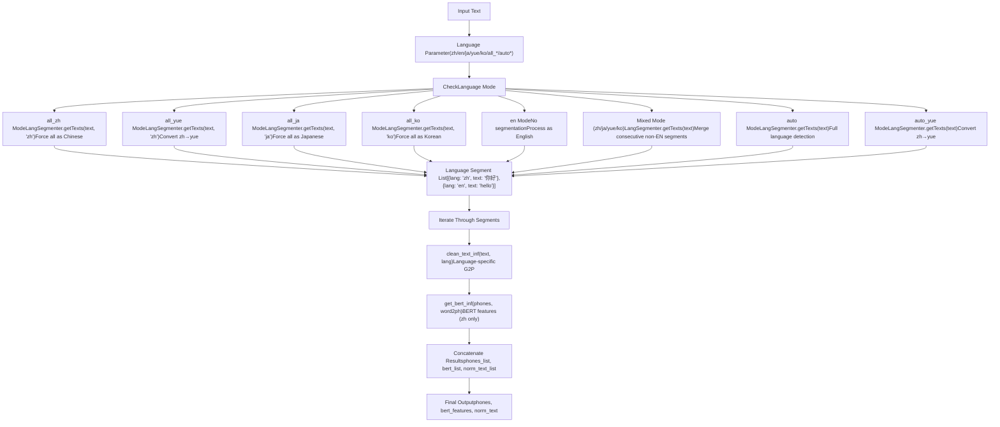
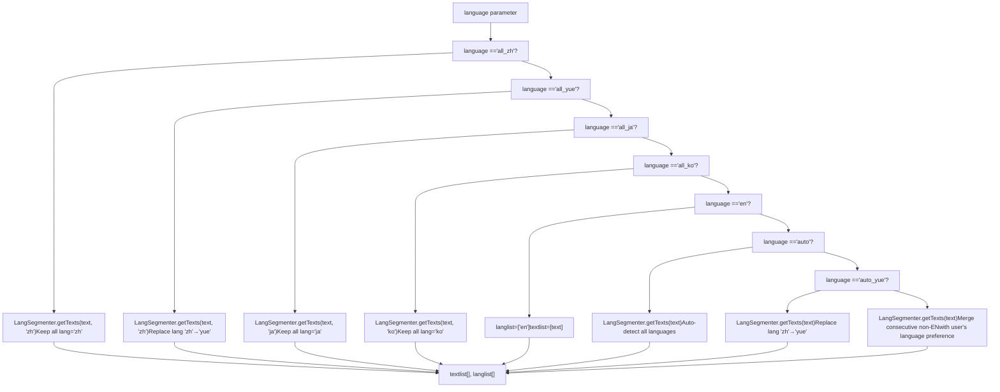
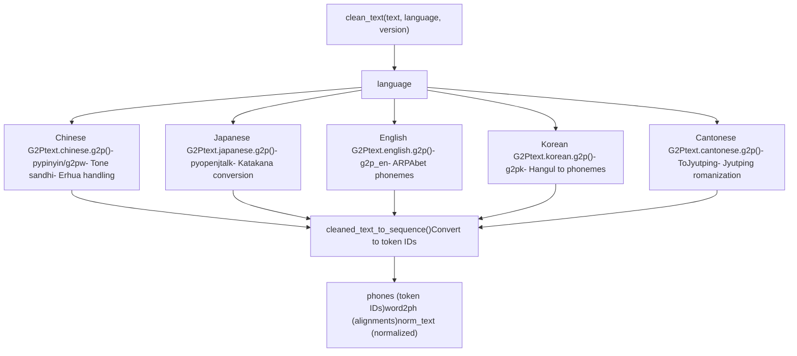
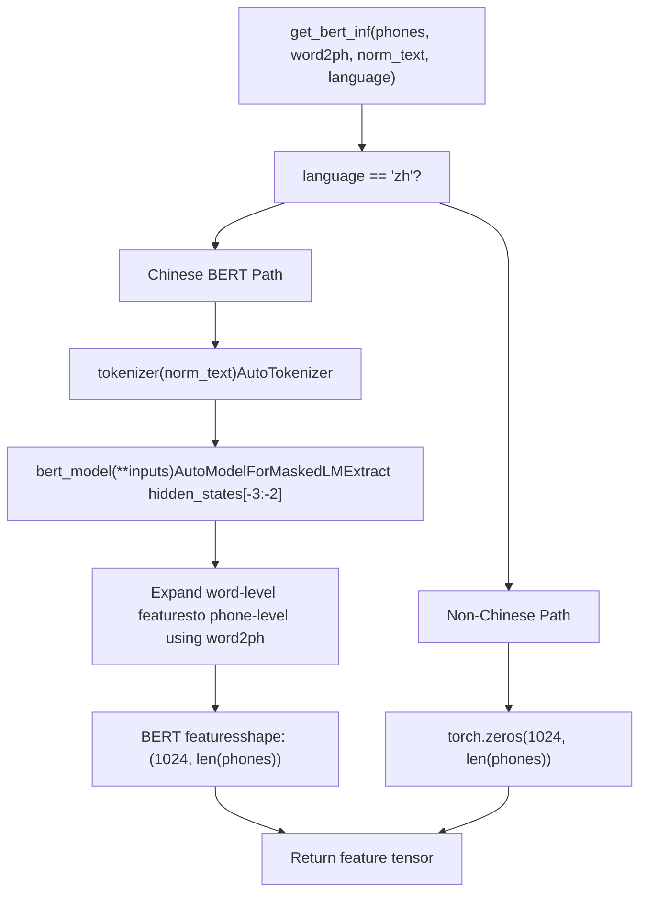
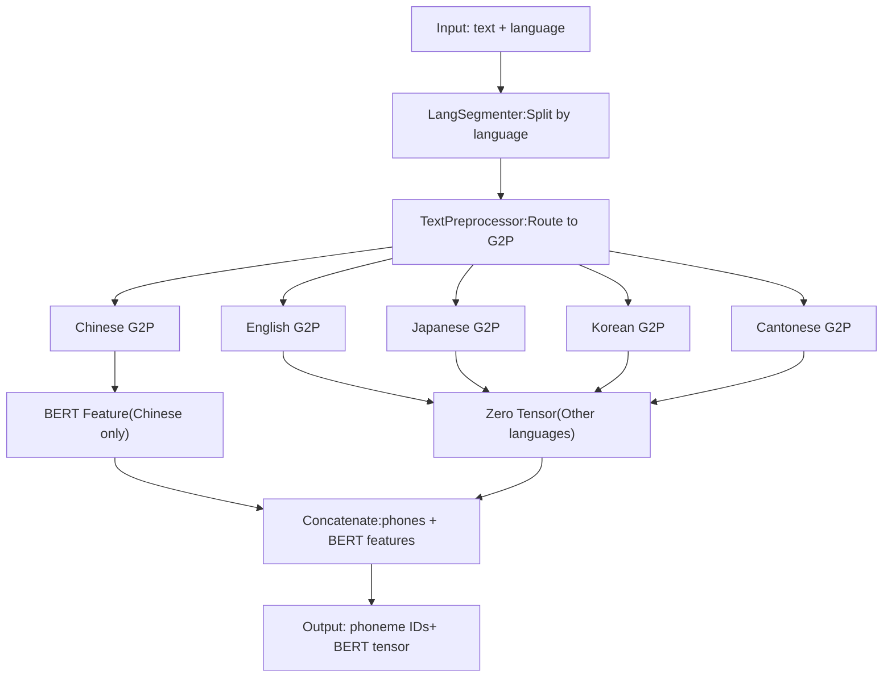

# Multi-language Support

Relevant source files

-   [.gitignore](https://github.com/RVC-Boss/GPT-SoVITS/blob/c767f0b8/.gitignore)
-   [GPT\_SoVITS/AR/models/t2s\_model.py](https://github.com/RVC-Boss/GPT-SoVITS/blob/c767f0b8/GPT_SoVITS/AR/models/t2s_model.py)
-   [GPT\_SoVITS/AR/models/utils.py](https://github.com/RVC-Boss/GPT-SoVITS/blob/c767f0b8/GPT_SoVITS/AR/models/utils.py)
-   [GPT\_SoVITS/TTS\_infer\_pack/TTS.py](https://github.com/RVC-Boss/GPT-SoVITS/blob/c767f0b8/GPT_SoVITS/TTS_infer_pack/TTS.py)
-   [GPT\_SoVITS/TTS\_infer\_pack/TextPreprocessor.py](https://github.com/RVC-Boss/GPT-SoVITS/blob/c767f0b8/GPT_SoVITS/TTS_infer_pack/TextPreprocessor.py)
-   [GPT\_SoVITS/configs/tts\_infer.yaml](https://github.com/RVC-Boss/GPT-SoVITS/blob/c767f0b8/GPT_SoVITS/configs/tts_infer.yaml)
-   [GPT\_SoVITS/text/chinese.py](https://github.com/RVC-Boss/GPT-SoVITS/blob/c767f0b8/GPT_SoVITS/text/chinese.py)
-   [GPT\_SoVITS/text/chinese2.py](https://github.com/RVC-Boss/GPT-SoVITS/blob/c767f0b8/GPT_SoVITS/text/chinese2.py)
-   [GPT\_SoVITS/text/zh\_normalization/num.py](https://github.com/RVC-Boss/GPT-SoVITS/blob/c767f0b8/GPT_SoVITS/text/zh_normalization/num.py)
-   [GPT\_SoVITS/text/zh\_normalization/text\_normlization.py](https://github.com/RVC-Boss/GPT-SoVITS/blob/c767f0b8/GPT_SoVITS/text/zh_normalization/text_normlization.py)
-   [api\_v2.py](https://github.com/RVC-Boss/GPT-SoVITS/blob/c767f0b8/api_v2.py)

This document describes the multi-language text processing capabilities of GPT-SoVITS, including supported languages, language detection, segmentation, and language-specific grapheme-to-phoneme (G2P) conversion. For general text processing architecture, see [Text Processing Pipeline](/RVC-Boss/GPT-SoVITS/2.2-text-processing-pipeline). For Chinese-specific G2P and normalization details, see [Chinese Text Processing](/RVC-Boss/GPT-SoVITS/4.2-chinese-text-processing). For language detection and segmentation implementation, see [Language Detection and Segmentation](/RVC-Boss/GPT-SoVITS/4.1-language-detection-and-segmentation).

## Overview

GPT-SoVITS supports multiple languages with version-dependent capabilities. The system can process:

-   Pure single-language text
-   Mixed-language text with automatic language detection
-   Forced language interpretation modes

Language support varies by model version:

-   **v1**: Chinese, English, Japanese (limited)
-   **v2+**: Chinese, English, Japanese, Korean, Cantonese (extended)

The multi-language system consists of three main components:

1.  **Language detection and segmentation** - identifies language boundaries in mixed text
2.  **Language-specific G2P conversion** - converts text to phonemes using language-appropriate rules
3.  **BERT feature extraction** - generates contextual embeddings (Chinese only)

Sources: [GPT\_SoVITS/TTS\_infer\_pack/TTS.py275-277](https://github.com/RVC-Boss/GPT-SoVITS/blob/c767f0b8/GPT_SoVITS/TTS_infer_pack/TTS.py#L275-L277) [GPT\_SoVITS/TTS\_infer\_pack/TextPreprocessor.py52-222](https://github.com/RVC-Boss/GPT-SoVITS/blob/c767f0b8/GPT_SoVITS/TTS_infer_pack/TextPreprocessor.py#L52-L222)

## Supported Languages and Language Codes

### Version-Specific Language Support

The `TTS_Config` class defines two language lists based on model version:

```
v1_languages: ["auto", "en", "zh", "ja", "all_zh", "all_ja"]v2_languages: ["auto", "auto_yue", "en", "zh", "ja", "yue", "ko", "all_zh", "all_ja", "all_yue", "all_ko"]
```
| Language Code | Full Name | Mode Type | v1 Support | v2+ Support | Description |
| --- | --- | --- | --- | --- | --- |
| `zh` | Chinese | Mixed | ✓ | ✓ | Chinese with English mixing allowed |
| `en` | English | Pure | ✓ | ✓ | English only |
| `ja` | Japanese | Mixed | ✓ | ✓ | Japanese with English mixing allowed |
| `yue` | Cantonese | Mixed | ✗ | ✓ | Cantonese with English mixing allowed |
| `ko` | Korean | Mixed | ✗ | ✓ | Korean with English mixing allowed |
| `all_zh` | All Chinese | Forced | ✓ | ✓ | Force interpret all text as Chinese |
| `all_ja` | All Japanese | Forced | ✓ | ✓ | Force interpret all text as Japanese |
| `all_yue` | All Cantonese | Forced | ✗ | ✓ | Force interpret all text as Cantonese |
| `all_ko` | All Korean | Forced | ✗ | ✓ | Force interpret all text as Korean |
| `auto` | Auto-detect | Automatic | ✓ | ✓ | Detect Chinese/Japanese/English/Korean |
| `auto_yue` | Auto-detect (Yue) | Automatic | ✗ | ✓ | Like `auto` but treat Chinese as Cantonese |

Sources: [GPT\_SoVITS/TTS\_infer\_pack/TTS.py275-277](https://github.com/RVC-Boss/GPT-SoVITS/blob/c767f0b8/GPT_SoVITS/TTS_infer_pack/TTS.py#L275-L277) [GPT\_SoVITS/TTS\_infer\_pack/TTS.py338](https://github.com/RVC-Boss/GPT-SoVITS/blob/c767f0b8/GPT_SoVITS/TTS_infer_pack/TTS.py#L338-L338)

### Language Mode Categories

**Mixed Language Modes** (`zh`, `ja`, `yue`, `ko`): These modes use `LangSegmenter` to detect language boundaries. English segments embedded in the text are preserved and processed separately, while the primary language is interpreted according to the specified code.

**Forced Language Modes** (`all_zh`, `all_ja`, `all_yue`, `all_ko`): These modes force the entire input to be interpreted as a single language, ignoring actual language detection. Useful for handling ambiguous characters (CJK characters that could be Chinese, Japanese, or Korean).

**Automatic Detection Modes** (`auto`, `auto_yue`): These modes invoke `LangSegmenter` without language hints, allowing full multi-language detection. The `auto_yue` variant replaces detected Chinese segments with Cantonese processing.

Sources: [GPT\_SoVITS/TTS\_infer\_pack/TextPreprocessor.py122-169](https://github.com/RVC-Boss/GPT-SoVITS/blob/c767f0b8/GPT_SoVITS/TTS_infer_pack/TextPreprocessor.py#L122-L169)

## Language Detection and Text Segmentation Flow

### Language Processing Pipeline


**Key Processing Logic**:

1.  **Language Parameter Check** [TextPreprocessor.py127-169](https://github.com/RVC-Boss/GPT-SoVITS/blob/c767f0b8/TextPreprocessor.py#L127-L169): Routes to appropriate segmentation strategy
2.  **LangSegmenter Invocation**: Returns list of `{lang: str, text: str}` dictionaries
3.  **Segment Processing**: Each segment processed with language-specific G2P and BERT extraction
4.  **Feature Concatenation**: Results merged into single phoneme sequence and BERT feature tensor

Sources: [GPT\_SoVITS/TTS\_infer\_pack/TextPreprocessor.py122-189](https://github.com/RVC-Boss/GPT-SoVITS/blob/c767f0b8/GPT_SoVITS/TTS_infer_pack/TextPreprocessor.py#L122-L189)

### Language Mode Decision Logic


**Mixed Language Mode Special Logic** [TextPreprocessor.py159-169](https://github.com/RVC-Boss/GPT-SoVITS/blob/c767f0b8/TextPreprocessor.py#L159-L169): When user specifies `zh`, `ja`, `yue`, or `ko`, the system:

1.  Runs `LangSegmenter.getTexts(text)` to detect all languages
2.  Preserves English segments as separate entries
3.  Merges consecutive non-English segments with user's specified language
4.  Prevents fragmentation of non-English text

Sources: [GPT\_SoVITS/TTS\_infer\_pack/TextPreprocessor.py127-169](https://github.com/RVC-Boss/GPT-SoVITS/blob/c767f0b8/GPT_SoVITS/TTS_infer_pack/TextPreprocessor.py#L127-L169)

## Language-Specific Text Processing

### G2P and Phoneme Conversion by Language

Each language uses a different G2P (Grapheme-to-Phoneme) conversion method through the `clean_text` function:


Sources: [GPT\_SoVITS/TTS\_infer\_pack/TextPreprocessor.py206-210](https://github.com/RVC-Boss/GPT-SoVITS/blob/c767f0b8/GPT_SoVITS/TTS_infer_pack/TextPreprocessor.py#L206-L210)

### Language-Specific Processing Details

| Language | G2P Library | Phoneme System | Key Features | Text Module |
| --- | --- | --- | --- | --- |
| Chinese (zh) | pypinyin / g2pw | Pinyin with tones | • Polyphone disambiguation via BERT
• Tone sandhi rules
• Erhua (儿化) handling
• Text normalization | `text.chinese` |
| English (en) | g2p\_en | ARPAbet | • Standard American English pronunciation
• Grapheme-to-ARPAbet conversion | `text.english` |
| Japanese (ja) | pyopenjtalk | Romaji | • Katakana/Hiragana/Kanji support
• Accent marking
• MeCab tokenization | `text.japanese` |
| Korean (ko) | g2pk | Romanized Korean | • Hangul to phoneme conversion
• Korean phonological rules | `text.korean` |
| Cantonese (yue) | ToJyutping | Jyutping | • Cantonese-specific tones
• Traditional character support | `text.cantonese` |

Sources: [GPT\_SoVITS/TTS\_infer\_pack/TextPreprocessor.py206-210](https://github.com/RVC-Boss/GPT-SoVITS/blob/c767f0b8/GPT_SoVITS/TTS_infer_pack/TextPreprocessor.py#L206-L210) [GPT\_SoVITS/text/chinese.py76-80](https://github.com/RVC-Boss/GPT-SoVITS/blob/c767f0b8/GPT_SoVITS/text/chinese.py#L76-L80) [GPT\_SoVITS/text/chinese2.py73-77](https://github.com/RVC-Boss/GPT-SoVITS/blob/c767f0b8/GPT_SoVITS/text/chinese2.py#L73-L77)

## BERT Feature Extraction (Chinese-Only)

### BERT Feature Processing Logic


**BERT Model Configuration**: The system uses `chinese-roberta-wwm-ext-large` (RoBERTa trained on Chinese text with Whole Word Masking). Model path is specified in `tts_infer.yaml`:

```
bert_base_path: GPT_SoVITS/pretrained_models/chinese-roberta-wwm-ext-large
```
**Feature Extraction Process** [TextPreprocessor.py191-222](https://github.com/RVC-Boss/GPT-SoVITS/blob/c767f0b8/TextPreprocessor.py#L191-L222):

1.  **Tokenization**: Input text tokenized using BERT tokenizer
2.  **Model Inference**: Forward pass through BERT model with `output_hidden_states=True`
3.  **Layer Selection**: Extracts hidden states from layer -3 (concatenated with -2 in some versions)
4.  **Token Alignment**: Maps word-level BERT features to phone-level using `word2ph` alignment array
5.  **Feature Expansion**: Each word's feature repeated according to number of phones in that word
6.  **Transpose**: Final shape is `(1024, num_phones)` for compatibility with model input

**Non-Chinese Languages**: For all non-Chinese languages, the system generates zero tensors of shape `(1024, num_phones)` since BERT features are not meaningful for non-Chinese text.

Sources: [GPT\_SoVITS/TTS\_infer\_pack/TextPreprocessor.py191-222](https://github.com/RVC-Boss/GPT-SoVITS/blob/c767f0b8/GPT_SoVITS/TTS_infer_pack/TextPreprocessor.py#L191-L222) [GPT\_SoVITS/TTS\_infer\_pack/TTS.py484-491](https://github.com/RVC-Boss/GPT-SoVITS/blob/c767f0b8/GPT_SoVITS/TTS_infer_pack/TTS.py#L484-L491)

## Chinese G2P Implementation Details

Chinese text processing has two variants: `text.chinese` (basic) and `text.chinese2` (with g2pw).

### G2PW Polyphone Disambiguation

The advanced Chinese processor (`chinese2.py`) uses g2pw (BERT-based polyphone disambiguation):

```
is_g2pw = True  # Enable g2pw by defaultg2pw = G2PWPinyin(    model_dir="GPT_SoVITS/text/G2PWModel",    model_source="GPT_SoVITS/pretrained_models/chinese-roberta-wwm-ext-large",    v_to_u=False,    neutral_tone_with_five=True,)
```
**g2pw vs pypinyin**:

-   **pypinyin** [chinese.py](https://github.com/RVC-Boss/GPT-SoVITS/blob/c767f0b8/chinese.py): Rule-based, fast but less accurate for polyphones
-   **g2pw** [chinese2.py](https://github.com/RVC-Boss/GPT-SoVITS/blob/c767f0b8/chinese2.py): BERT-based context-aware, more accurate for ambiguous characters

### Chinese Text Normalization

The `TextNormalizer` class handles number, date, time, and special character normalization:

**Normalization Pipeline**:

1.  Traditional to simplified Chinese conversion
2.  Full-width to half-width ASCII/digit conversion
3.  Date/time expression verbalization (e.g., "2024年1月1日" → "二零二四年一月一日")
4.  Number verbalization (e.g., "123" → "一百二十三")
5.  Fraction/percentage verbalization
6.  Phone number verbalization
7.  Mathematical expression verbalization
8.  Special symbol replacement (Greek letters → Chinese names)

Sources: [GPT\_SoVITS/text/chinese.py171-181](https://github.com/RVC-Boss/GPT-SoVITS/blob/c767f0b8/GPT_SoVITS/text/chinese.py#L171-L181) [GPT\_SoVITS/text/chinese2.py316-326](https://github.com/RVC-Boss/GPT-SoVITS/blob/c767f0b8/GPT_SoVITS/text/chinese2.py#L316-L326) [GPT\_SoVITS/text/zh\_normalization/text\_normlization.py130-170](https://github.com/RVC-Boss/GPT-SoVITS/blob/c767f0b8/GPT_SoVITS/text/zh_normalization/text_normlization.py#L130-L170)

### Erhua Handling

Erhua (儿化音, "r-coloring") is handled specially in `chinese2.py`:

```
must_erhua = {"小院儿", "胡同儿", "范儿", ...}not_erhua = {"虐儿", "为儿", "护儿", ...} def _merge_erhua(initials, finals, word, pos):    # Merge "er" sound with previous syllable for erhua words    # e.g., "玩儿" → "wan2" + "er5" → "wanr2"    ...
```
The system maintains whitelist (`must_erhua`) and blacklist (`not_erhua`) to correctly handle ambiguous cases.

Sources: [GPT\_SoVITS/text/chinese2.py93-178](https://github.com/RVC-Boss/GPT-SoVITS/blob/c767f0b8/GPT_SoVITS/text/chinese2.py#L93-L178)

## API Usage and Validation

### Language Parameter Validation

The REST API validates language codes against version-specific supported languages:

```
# In api_v2.py check_params()if text_lang.lower() not in tts_config.languages:    return JSONResponse(        status_code=400,        content={"message": f"text_lang: {text_lang} is not supported in version {tts_config.version}"}    ) if prompt_lang.lower() not in tts_config.languages:    return JSONResponse(        status_code=400,        content={"message": f"prompt_lang: {prompt_lang} is not supported in version {tts_config.version}"}    )
```
### API Request Examples

**Single Language (Chinese)**:

```
{    "text": "你好世界",    "text_lang": "zh",    "prompt_text": "大家好",    "prompt_lang": "zh",    "ref_audio_path": "reference.wav"}
```
**Mixed Language (Chinese with English)**:

```
{    "text": "我喜欢Python programming",    "text_lang": "zh",    "prompt_lang": "zh"}
```
The system automatically detects "Python" and "programming" as English segments.

**Multi-language Auto-detection**:

```
{    "text": "你好world こんにちは",    "text_lang": "auto",    "prompt_lang": "zh"}
```
Automatically detects Chinese, English, and Japanese segments.

**Forced Language Interpretation**:

```
{    "text": "今日はいい天気",    "text_lang": "all_ja",    "prompt_lang": "ja"}
```
Forces all characters to be interpreted as Japanese, even if they're also valid Chinese.

Sources: [api\_v2.py305-341](https://github.com/RVC-Boss/GPT-SoVITS/blob/c767f0b8/api_v2.py#L305-L341) [api\_v2.py456-508](https://github.com/RVC-Boss/GPT-SoVITS/blob/c767f0b8/api_v2.py#L456-L508)

## Configuration and Model Paths

### Language-Related Configuration

The `tts_infer.yaml` configuration specifies paths for all language-processing models:

```
custom:  bert_base_path: GPT_SoVITS/pretrained_models/chinese-roberta-wwm-ext-large  cnhuhbert_base_path: GPT_SoVITS/pretrained_models/chinese-hubert-base  version: v2
```
All model versions (v1-v4, v2Pro, v2ProPlus) use the same BERT and CNHubert models, ensuring consistent multi-language support across versions.

### Version-Specific Language Lists

The `TTS_Config.__init__` method sets the appropriate language list based on version:

```
def __init__(self, configs):    ...    self.version = configs.get("version", None)    self.languages = self.v1_languages if self.version == "v1" else self.v2_languages
```
This ensures that API validation and UI options reflect the correct language capabilities for the loaded model version.

Sources: [GPT\_SoVITS/configs/tts\_infer.yaml1-57](https://github.com/RVC-Boss/GPT-SoVITS/blob/c767f0b8/GPT_SoVITS/configs/tts_infer.yaml#L1-L57) [GPT\_SoVITS/TTS\_infer\_pack/TTS.py299-338](https://github.com/RVC-Boss/GPT-SoVITS/blob/c767f0b8/GPT_SoVITS/TTS_infer_pack/TTS.py#L299-L338)

## Implementation Summary

### Key Classes and Methods

| Component | File | Key Method/Class | Responsibility |
| --- | --- | --- | --- |
| Language routing | `TextPreprocessor.py` | `get_phones_and_bert()` | Routes text segments to language-specific processors |
| Chinese G2P | `chinese.py`, `chinese2.py` | `g2p()`, `_g2p()` | Converts Chinese text to pinyin phonemes |
| BERT extraction | `TextPreprocessor.py` | `get_bert_feature()`, `get_bert_inf()` | Extracts BERT embeddings for Chinese |
| Text cleaning | `cleaner.py` | `clean_text()` | Dispatches to language-specific G2P |
| Normalization | `zh_normalization/` | `TextNormalizer` | Normalizes numbers, dates, symbols |
| Configuration | `TTS.py` | `TTS_Config` | Manages language lists and validation |
| API validation | `api_v2.py` | `check_params()` | Validates language codes |

### Processing Flow Summary


Sources: [GPT\_SoVITS/TTS\_infer\_pack/TextPreprocessor.py52-222](https://github.com/RVC-Boss/GPT-SoVITS/blob/c767f0b8/GPT_SoVITS/TTS_infer_pack/TextPreprocessor.py#L52-L222) [GPT\_SoVITS/TTS\_infer\_pack/TTS.py421-463](https://github.com/RVC-Boss/GPT-SoVITS/blob/c767f0b8/GPT_SoVITS/TTS_infer_pack/TTS.py#L421-L463)
