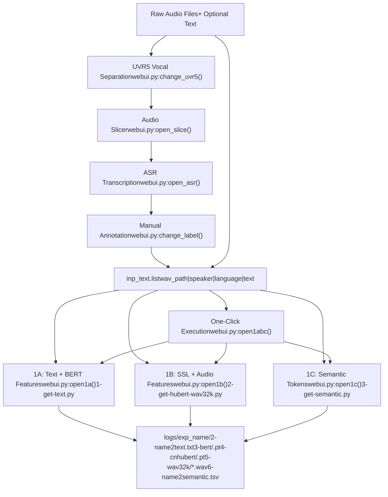
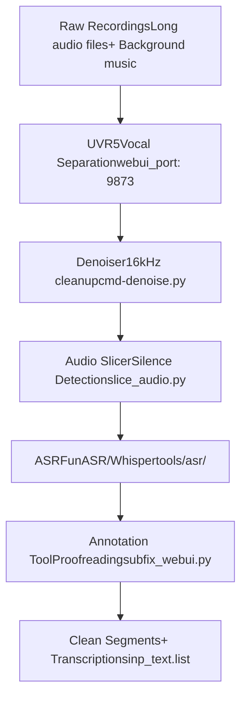
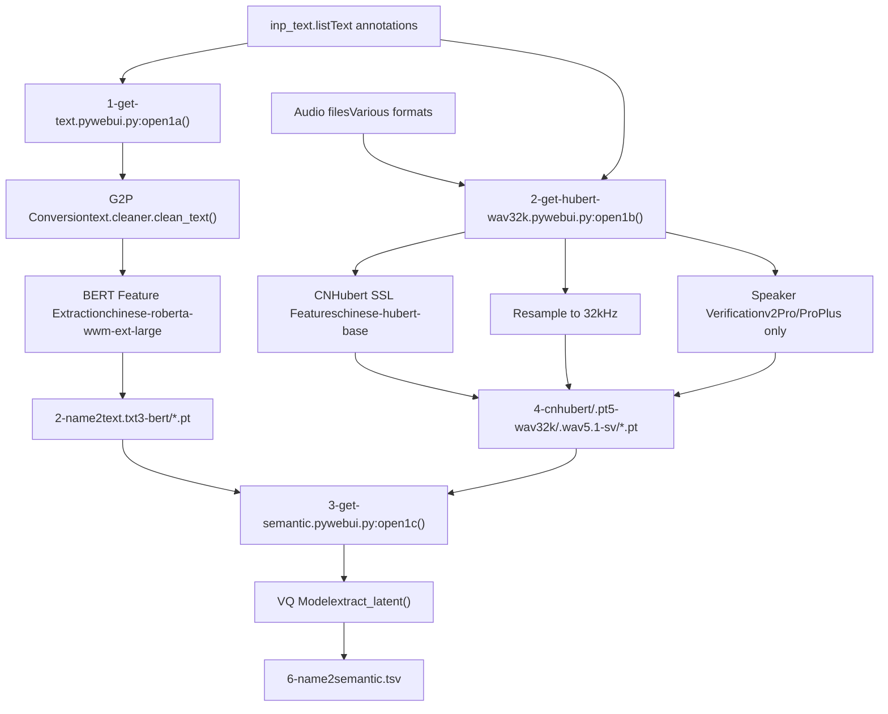
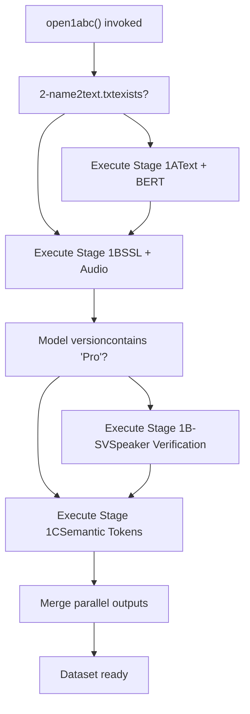

# Data Preparation

Relevant source files

-   [GPT\_SoVITS/prepare\_datasets/1-get-text.py](https://github.com/RVC-Boss/GPT-SoVITS/blob/c767f0b8/GPT_SoVITS/prepare_datasets/1-get-text.py)
-   [GPT\_SoVITS/prepare\_datasets/2-get-hubert-wav32k.py](https://github.com/RVC-Boss/GPT-SoVITS/blob/c767f0b8/GPT_SoVITS/prepare_datasets/2-get-hubert-wav32k.py)
-   [GPT\_SoVITS/prepare\_datasets/3-get-semantic.py](https://github.com/RVC-Boss/GPT-SoVITS/blob/c767f0b8/GPT_SoVITS/prepare_datasets/3-get-semantic.py)
-   [GPT\_SoVITS/s1\_train.py](https://github.com/RVC-Boss/GPT-SoVITS/blob/c767f0b8/GPT_SoVITS/s1_train.py)
-   [api.py](https://github.com/RVC-Boss/GPT-SoVITS/blob/c767f0b8/api.py)
-   [config.py](https://github.com/RVC-Boss/GPT-SoVITS/blob/c767f0b8/config.py)
-   [webui.py](https://github.com/RVC-Boss/GPT-SoVITS/blob/c767f0b8/webui.py)

## Purpose and Scope

Data preparation is the process of converting raw audio files and their corresponding text transcriptions into the structured feature representations required for training GPT-SoVITS models. This page provides an overview of the complete data preparation workflow.

For details on specific tools and processes:

-   Audio preprocessing tools (UVR5, slicing, denoising): see [Audio Preprocessing Tools](/RVC-Boss/GPT-SoVITS/5.1-audio-preprocessing-tools)
-   Automatic speech recognition (ASR): see [Automatic Speech Recognition](/RVC-Boss/GPT-SoVITS/5.2-automatic-speech-recognition)
-   Feature extraction scripts: see [Feature Extraction Scripts](/RVC-Boss/GPT-SoVITS/5.3-feature-extraction-scripts)
-   Manual annotation and correction: see [Audio Annotation Tools](/RVC-Boss/GPT-SoVITS/5.4-audio-annotation-tools)

For information about using prepared data for training, see [Model Training](/RVC-Boss/GPT-SoVITS/6-model-training).

## Overview

The data preparation workflow transforms raw audio recordings into a structured dataset ready for model training. The process consists of two main stages:

1.  **Stage 0 (Optional)**: Audio preprocessing to clean and segment raw recordings
2.  **Stage 1 (Required)**: Feature extraction to generate training data from clean audio segments

The entire workflow can be executed through the main WebUI or via individual command-line scripts for advanced use cases.


**Sources:** [webui.py1-1500](https://github.com/RVC-Boss/GPT-SoVITS/blob/c767f0b8/webui.py#L1-L1500) [GPT\_SoVITS/prepare\_datasets/1-get-text.py](https://github.com/RVC-Boss/GPT-SoVITS/blob/c767f0b8/GPT_SoVITS/prepare_datasets/1-get-text.py) [GPT\_SoVITS/prepare\_datasets/2-get-hubert-wav32k.py](https://github.com/RVC-Boss/GPT-SoVITS/blob/c767f0b8/GPT_SoVITS/prepare_datasets/2-get-hubert-wav32k.py) [GPT\_SoVITS/prepare\_datasets/3-get-semantic.py](https://github.com/RVC-Boss/GPT-SoVITS/blob/c767f0b8/GPT_SoVITS/prepare_datasets/3-get-semantic.py)

## Input Requirements

### Input Text List Format

The primary input is a text file (`inp_text.list`) where each line describes one audio file using pipe-separated values:

```
wav_path|speaker_name|language|text_content
```
**Field Descriptions:**

| Field | Description | Example |
| --- | --- | --- |
| `wav_path` | Absolute or relative path to audio file | `/data/audio/sample001.wav` |
| `speaker_name` | Speaker identifier (used for multi-speaker models) | `speaker1` |
| `language` | Language code: `zh`, `en`, `ja`, `ko`, `yue` | `zh` |
| `text_content` | Text transcription of the audio | `你好世界` |

**Example:**

```
/data/audio/001.wav|speaker1|zh|今天天气很好。
/data/audio/002.wav|speaker1|en|Hello world.
/data/audio/003.wav|speaker2|ja|こんにちは。
```
**Sources:** [webui.py780-829](https://github.com/RVC-Boss/GPT-SoVITS/blob/c767f0b8/webui.py#L780-L829) [GPT\_SoVITS/prepare\_datasets/1-get-text.py127-136](https://github.com/RVC-Boss/GPT-SoVITS/blob/c767f0b8/GPT_SoVITS/prepare_datasets/1-get-text.py#L127-L136)

### Supported Languages

The system supports five languages with backward compatibility for v1 format:

| v2 Code | v1 Code | Language |
| --- | --- | --- |
| `zh` | `ZH` | Mandarin Chinese |
| `en` | `EN` | English |
| `ja` | `JP`, `JA` | Japanese |
| `ko` | `KO` | Korean |
| `yue` | `YUE` | Cantonese |

**Sources:** [GPT\_SoVITS/prepare\_datasets/1-get-text.py110-126](https://github.com/RVC-Boss/GPT-SoVITS/blob/c767f0b8/GPT_SoVITS/prepare_datasets/1-get-text.py#L110-L126)

### Audio File Requirements

-   **Format:** WAV, MP3, or other formats supported by librosa
-   **Recommended Duration:** 2-15 seconds per segment
-   **Sample Rate:** Any (will be resampled to 32kHz during processing)
-   **Channels:** Mono or stereo (stereo will be converted to mono)
-   **Quality:** Clean vocal recordings without background music (use UVR5 if needed)

**Sources:** [GPT\_SoVITS/prepare\_datasets/2-get-hubert-wav32k.py82-106](https://github.com/RVC-Boss/GPT-SoVITS/blob/c767f0b8/GPT_SoVITS/prepare_datasets/2-get-hubert-wav32k.py#L82-L106)

## Stage 0: Audio Preprocessing (Optional)

Stage 0 encompasses optional preprocessing steps that improve data quality before feature extraction. While not strictly required, these steps significantly enhance training results.

### Preprocessing Tools Overview


**Workflow Explanation:**

1.  **UVR5 Vocal Separation:** Removes background music and reverb from recordings
2.  **Denoising:** Reduces noise artifacts (optional, for noisy recordings)
3.  **Audio Slicer:** Segments long recordings into training-suitable clips based on silence detection
4.  **ASR:** Automatically transcribes audio segments
5.  **Manual Annotation:** Proofreading interface for correcting ASR errors and managing segments

These tools are integrated into the main WebUI and can be accessed sequentially or independently.

**Sources:** [webui.py298-483](https://github.com/RVC-Boss/GPT-SoVITS/blob/c767f0b8/webui.py#L298-L483) [webui.py678-773](https://github.com/RVC-Boss/GPT-SoVITS/blob/c767f0b8/webui.py#L678-L773)

For detailed documentation of each preprocessing tool, see [Audio Preprocessing Tools](/RVC-Boss/GPT-SoVITS/5.1-audio-preprocessing-tools) and [Automatic Speech Recognition](/RVC-Boss/GPT-SoVITS/5.2-automatic-speech-recognition).

## Stage 1: Feature Extraction (Required)

Stage 1 is the core data preparation phase that extracts multiple feature representations from clean audio segments. This stage consists of three parallel substages that process text and audio data.

### Feature Extraction Pipeline


**Sources:** [webui.py780-1151](https://github.com/RVC-Boss/GPT-SoVITS/blob/c767f0b8/webui.py#L780-L1151) [GPT\_SoVITS/prepare\_datasets/1-get-text.py](https://github.com/RVC-Boss/GPT-SoVITS/blob/c767f0b8/GPT_SoVITS/prepare_datasets/1-get-text.py) [GPT\_SoVITS/prepare\_datasets/2-get-hubert-wav32k.py](https://github.com/RVC-Boss/GPT-SoVITS/blob/c767f0b8/GPT_SoVITS/prepare_datasets/2-get-hubert-wav32k.py) [GPT\_SoVITS/prepare\_datasets/3-get-semantic.py](https://github.com/RVC-Boss/GPT-SoVITS/blob/c767f0b8/GPT_SoVITS/prepare_datasets/3-get-semantic.py)

### Stage 1A: Text and BERT Features

**Script:** [GPT\_SoVITS/prepare\_datasets/1-get-text.py](https://github.com/RVC-Boss/GPT-SoVITS/blob/c767f0b8/GPT_SoVITS/prepare_datasets/1-get-text.py)
**WebUI Function:** [webui.py780-862](https://github.com/RVC-Boss/GPT-SoVITS/blob/c767f0b8/webui.py#L780-L862) `open1a()`

**Process:**

1.  Reads input text list and parses language codes
2.  Cleans and normalizes text (numbers to words, symbol handling)
3.  Converts text to phoneme sequences using language-specific G2P models
4.  Extracts BERT contextual features (Chinese text only)

**Outputs:**

-   `2-name2text.txt`: Phoneme sequences with word-to-phone mappings
    -   Format: `filename\tphones\tword2ph\tnorm_text`
-   `3-bert/*.pt`: BERT feature tensors (1024-dim, Chinese only)

**Key Code Entities:**

-   `clean_text()`: Text normalization and G2P conversion
-   `get_bert_feature()`: BERT feature extraction using `chinese-roberta-wwm-ext-large`
-   `process()`: Main processing loop for parallel execution

**Sources:** [GPT\_SoVITS/prepare\_datasets/1-get-text.py1-144](https://github.com/RVC-Boss/GPT-SoVITS/blob/c767f0b8/GPT_SoVITS/prepare_datasets/1-get-text.py#L1-L144) [webui.py780-862](https://github.com/RVC-Boss/GPT-SoVITS/blob/c767f0b8/webui.py#L780-L862)

### Stage 1B: SSL and Audio Features

**Script:** [GPT\_SoVITS/prepare\_datasets/2-get-hubert-wav32k.py](https://github.com/RVC-Boss/GPT-SoVITS/blob/c767f0b8/GPT_SoVITS/prepare_datasets/2-get-hubert-wav32k.py)
**WebUI Function:** [webui.py870-953](https://github.com/RVC-Boss/GPT-SoVITS/blob/c767f0b8/webui.py#L870-L953) `open1b()`

**Process:**

1.  Loads audio files using librosa
2.  Normalizes audio amplitude with adaptive scaling
3.  Resamples audio to 16kHz for CNHubert processing
4.  Extracts 768-dim SSL features using `chinese-hubert-base`
5.  Saves resampled 32kHz audio for training
6.  (v2Pro/ProPlus only) Extracts speaker verification embeddings

**Outputs:**

-   `4-cnhubert/*.pt`: SSL feature tensors (768-dim)
-   `5-wav32k/*.wav`: Resampled audio at 32kHz
-   `5.1-sv/*.pt`: Speaker verification features (20480-dim, v2Pro only)

**Audio Normalization:**

```
# Adaptive amplitude normalizationtmp_audio32 = (tmp_audio / tmp_max * (0.95 * 0.5 * 32768)) + ((1 - 0.5) * 32768) * tmp_audio
```
**NaN Handling:** If SSL extraction produces NaN values with FP16, the script automatically falls back to FP32 processing.

**Sources:** [GPT\_SoVITS/prepare\_datasets/2-get-hubert-wav32k.py1-135](https://github.com/RVC-Boss/GPT-SoVITS/blob/c767f0b8/GPT_SoVITS/prepare_datasets/2-get-hubert-wav32k.py#L1-L135) [webui.py870-953](https://github.com/RVC-Boss/GPT-SoVITS/blob/c767f0b8/webui.py#L870-L953)

### Stage 1C: Semantic Token Extraction

**Script:** [GPT\_SoVITS/prepare\_datasets/3-get-semantic.py](https://github.com/RVC-Boss/GPT-SoVITS/blob/c767f0b8/GPT_SoVITS/prepare_datasets/3-get-semantic.py)
**WebUI Function:** [webui.py960-1039](https://github.com/RVC-Boss/GPT-SoVITS/blob/c767f0b8/webui.py#L960-L1039) `open1c()`

**Process:**

1.  Loads pretrained SoVITS-G model as VQ quantizer
2.  Reads SSL features from Stage 1B output
3.  Encodes continuous SSL features to discrete semantic tokens
4.  Saves token sequences for GPT training

**Outputs:**

-   `6-name2semantic.tsv`: Semantic token IDs
    -   Format: `filename\ttoken_id1 token_id2 token_id3 ...`

**Model Version Detection:** The script automatically detects model version based on file size:

-   < 82978 KB: v1
-   82978-100000 KB: v2
-   100000-103520 KB: v1
-   103520-700000 KB: v2
-   \> 700000 KB: v3/v4

**Key Code Entities:**

-   `vq_model.extract_latent()`: Converts SSL features to discrete codes
-   `SynthesizerTrn` / `SynthesizerTrnV3`: Version-specific model classes

**Sources:** [GPT\_SoVITS/prepare\_datasets/3-get-semantic.py1-119](https://github.com/RVC-Boss/GPT-SoVITS/blob/c767f0b8/GPT_SoVITS/prepare_datasets/3-get-semantic.py#L1-L119) [webui.py960-1039](https://github.com/RVC-Boss/GPT-SoVITS/blob/c767f0b8/webui.py#L960-L1039)

### One-Click Execution

**WebUI Function:** [webui.py1046-1151](https://github.com/RVC-Boss/GPT-SoVITS/blob/c767f0b8/webui.py#L1046-L1151) `open1abc()`

The "1Aabc" button in the WebUI executes all three feature extraction stages sequentially:


**Parallel Processing:** Each stage can be executed across multiple GPUs by specifying GPU numbers (e.g., `0-1-2` for 3 GPUs).

**Sources:** [webui.py1046-1151](https://github.com/RVC-Boss/GPT-SoVITS/blob/c767f0b8/webui.py#L1046-L1151)

## Output Dataset Structure

After completing Stage 1, the dataset is organized in the `logs/exp_name/` directory:

```
logs/exp_name/
├── 2-name2text.txt          # Phoneme sequences
├── 3-bert/                  # BERT features (Chinese only)
│   ├── audio001.wav.pt
│   ├── audio002.wav.pt
│   └── ...
├── 4-cnhubert/              # SSL features
│   ├── audio001.wav.pt
│   ├── audio002.wav.pt
│   └── ...
├── 5-wav32k/                # Resampled audio
│   ├── audio001.wav
│   ├── audio002.wav
│   └── ...
├── 5.1-sv/                  # Speaker verification (v2Pro only)
│   ├── audio001.wav.pt
│   ├── audio002.wav.pt
│   └── ...
└── 6-name2semantic.tsv      # Semantic tokens
```
### File Format Details

**2-name2text.txt:**

```
audio001.wav	p h o n e1 p h o n e2	[2, 1, 3, 1, 2]	normalized_text
audio002.wav	p h o n e3 p h o n e4	[1, 2, 1, 3]	normalized_text
```
Fields (tab-separated):

1.  Filename
2.  Space-separated phoneme sequence
3.  Word-to-phone mapping (list of phone counts per word)
4.  Normalized text

**6-name2semantic.tsv:**

```
item_name	semantic_audio
audio001.wav	142 523 234 156 789 ...
audio002.wav	234 567 123 890 456 ...
```
Fields (tab-separated):

1.  Filename
2.  Space-separated semantic token IDs

**Binary Feature Files (.pt):**

-   BERT features: `[1024, num_phones]` tensor
-   SSL features: `[768, num_frames]` tensor
-   Speaker verification: `[20480]` tensor (v2Pro only)

**Sources:** [webui.py819-828](https://github.com/RVC-Boss/GPT-SoVITS/blob/c767f0b8/webui.py#L819-L828) [webui.py1003-1011](https://github.com/RVC-Boss/GPT-SoVITS/blob/c767f0b8/webui.py#L1003-L1011) [GPT\_SoVITS/prepare\_datasets/1-get-text.py139-143](https://github.com/RVC-Boss/GPT-SoVITS/blob/c767f0b8/GPT_SoVITS/prepare_datasets/1-get-text.py#L139-L143) [GPT\_SoVITS/prepare\_datasets/3-get-semantic.py99-100](https://github.com/RVC-Boss/GPT-SoVITS/blob/c767f0b8/GPT_SoVITS/prepare_datasets/3-get-semantic.py#L99-L100)

## Parallel Processing

All feature extraction stages support multi-GPU parallel processing to accelerate dataset preparation.

### GPU Distribution Strategy

**Configuration:** Specify GPUs as hyphen-separated indices (e.g., `0-1-2` for 3 GPUs)

**Workload Distribution:**

```
for line in lines[int(i_part) :: int(all_parts)]:    # Process every all_parts-th line starting from i_part
```
Each GPU processes a disjoint subset of the input list using round-robin distribution.

**Example with 3 GPUs:**

-   GPU 0: processes lines 0, 3, 6, 9, ...
-   GPU 1: processes lines 1, 4, 7, 10, ...
-   GPU 2: processes lines 2, 5, 8, 11, ...

### Output Merging

After parallel processing completes, the WebUI automatically merges partial outputs:

**Stage 1A (Text):**

```
# Merge 2-name2text-{i}.txt filesfor i_part in range(all_parts):    txt_path = "%s/2-name2text-%s.txt" % (opt_dir, i_part)    with open(txt_path, "r", encoding="utf8") as f:        opt += f.read().strip("\n").split("\n")    os.remove(txt_path)# Write merged outputwith open("%s/2-name2text.txt" % opt_dir, "w", encoding="utf8") as f:    f.write("\n".join(opt) + "\n")
```
**Stage 1C (Semantic):**

```
# Merge 6-name2semantic-{i}.tsv filesfor i_part in range(all_parts):    semantic_path = "%s/6-name2semantic-%s.tsv" % (opt_dir, i_part)    with open(semantic_path, "r", encoding="utf8") as f:        opt += f.read().strip("\n").split("\n")    os.remove(semantic_path)# Write merged outputwith open("%s/6-name2semantic.tsv" % opt_dir, "w", encoding="utf8") as f:    f.write("\n".join(opt) + "\n")
```
**Sources:** [webui.py817-828](https://github.com/RVC-Boss/GPT-SoVITS/blob/c767f0b8/webui.py#L817-L828) [webui.py1003-1011](https://github.com/RVC-Boss/GPT-SoVITS/blob/c767f0b8/webui.py#L1003-L1011) [GPT\_SoVITS/prepare\_datasets/1-get-text.py108-109](https://github.com/RVC-Boss/GPT-SoVITS/blob/c767f0b8/GPT_SoVITS/prepare_datasets/1-get-text.py#L108-L109) [GPT\_SoVITS/prepare\_datasets/2-get-hubert-wav32k.py111](https://github.com/RVC-Boss/GPT-SoVITS/blob/c767f0b8/GPT_SoVITS/prepare_datasets/2-get-hubert-wav32k.py#L111-L111) [GPT\_SoVITS/prepare\_datasets/3-get-semantic.py106](https://github.com/RVC-Boss/GPT-SoVITS/blob/c767f0b8/GPT_SoVITS/prepare_datasets/3-get-semantic.py#L106-L106)

## Environment Configuration

Feature extraction scripts receive configuration through environment variables set by the WebUI:

| Variable | Description | Example |
| --- | --- | --- |
| `inp_text` | Path to input text list | `/data/project/input.list` |
| `inp_wav_dir` | Directory containing audio files | `/data/project/audio/` |
| `exp_name` | Experiment name | `my_speaker` |
| `opt_dir` | Output directory | `logs/my_speaker` |
| `i_part` | Current GPU index (0-based) | `0` |
| `all_parts` | Total number of GPUs | `3` |
| `_CUDA_VISIBLE_DEVICES` | GPU device ID | `0` |
| `is_half` | Use FP16 precision | `True` |
| `bert_pretrained_dir` | BERT model path | `GPT_SoVITS/pretrained_models/chinese-roberta-wwm-ext-large` |
| `cnhubert_base_dir` | CNHubert model path | `GPT_SoVITS/pretrained_models/chinese-hubert-base` |
| `pretrained_s2G` | SoVITS-G model path for semantic extraction | `GPT_SoVITS/pretrained_models/s2G488k.pth` |
| `s2config_path` | SoVITS config path | `GPT_SoVITS/configs/s2.json` |

**Sources:** [webui.py788-806](https://github.com/RVC-Boss/GPT-SoVITS/blob/c767f0b8/webui.py#L788-L806) [webui.py878-897](https://github.com/RVC-Boss/GPT-SoVITS/blob/c767f0b8/webui.py#L878-L897) [webui.py973-991](https://github.com/RVC-Boss/GPT-SoVITS/blob/c767f0b8/webui.py#L973-L991) [GPT\_SoVITS/prepare\_datasets/1-get-text.py5-13](https://github.com/RVC-Boss/GPT-SoVITS/blob/c767f0b8/GPT_SoVITS/prepare_datasets/1-get-text.py#L5-L13) [GPT\_SoVITS/prepare\_datasets/2-get-hubert-wav32k.py6-16](https://github.com/RVC-Boss/GPT-SoVITS/blob/c767f0b8/GPT_SoVITS/prepare_datasets/2-get-hubert-wav32k.py#L6-L16) [GPT\_SoVITS/prepare\_datasets/3-get-semantic.py3-11](https://github.com/RVC-Boss/GPT-SoVITS/blob/c767f0b8/GPT_SoVITS/prepare_datasets/3-get-semantic.py#L3-L11)

## Next Steps

After completing data preparation:

1.  **Verify Output:** Check that all output directories contain files matching your input list count
2.  **Configure Training:** Set up training parameters in the WebUI or configuration files
3.  **Train GPT Model:** See [GPT Model Training](/RVC-Boss/GPT-SoVITS/6.2-gpt-model-training)
4.  **Train SoVITS Model:** See [SoVITS Model Training](/RVC-Boss/GPT-SoVITS/6.3-sovits-model-training)

For troubleshooting common data preparation issues, refer to the WebUI error messages which perform automatic validation of input paths and outputs.

**Sources:** [webui.py784-785](https://github.com/RVC-Boss/GPT-SoVITS/blob/c767f0b8/webui.py#L784-L785) [webui.py874-875](https://github.com/RVC-Boss/GPT-SoVITS/blob/c767f0b8/webui.py#L874-L875) [webui.py963-964](https://github.com/RVC-Boss/GPT-SoVITS/blob/c767f0b8/webui.py#L963-L964) [webui.py1061-1062](https://github.com/RVC-Boss/GPT-SoVITS/blob/c767f0b8/webui.py#L1061-L1062)
