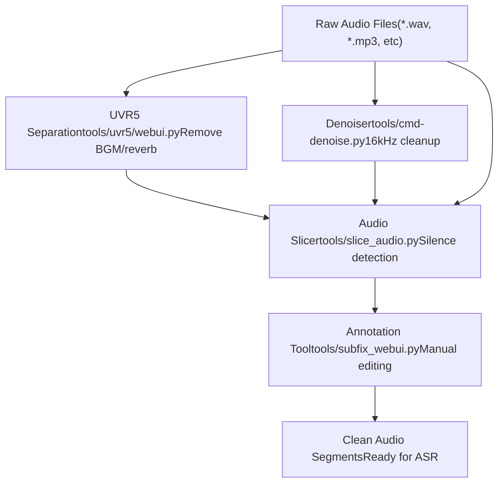
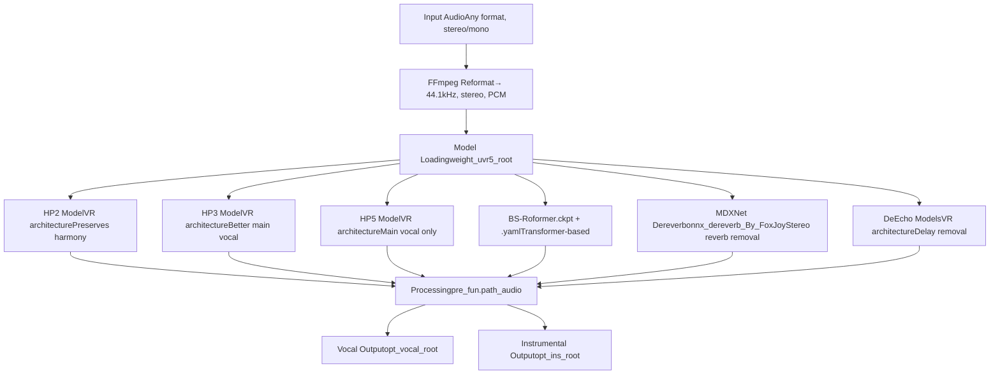
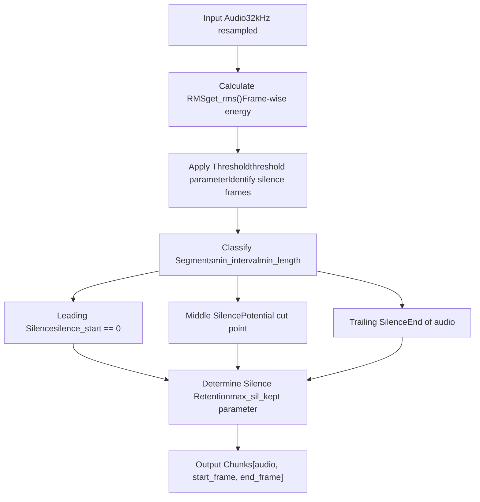
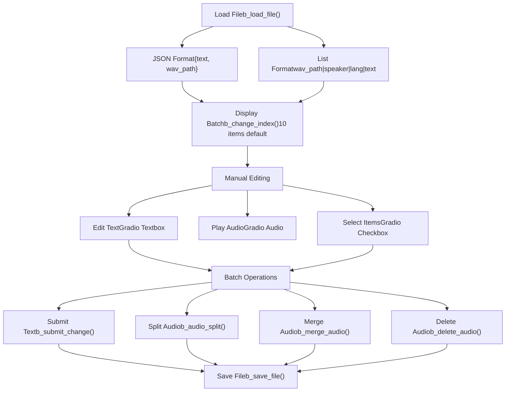

# Audio Preprocessing Tools

Relevant source files

-   [api.py](https://github.com/RVC-Boss/GPT-SoVITS/blob/c767f0b8/api.py)
-   [config.py](https://github.com/RVC-Boss/GPT-SoVITS/blob/c767f0b8/config.py)
-   [tools/my\_utils.py](https://github.com/RVC-Boss/GPT-SoVITS/blob/c767f0b8/tools/my_utils.py)
-   [tools/slice\_audio.py](https://github.com/RVC-Boss/GPT-SoVITS/blob/c767f0b8/tools/slice_audio.py)
-   [tools/slicer2.py](https://github.com/RVC-Boss/GPT-SoVITS/blob/c767f0b8/tools/slicer2.py)
-   [tools/subfix\_webui.py](https://github.com/RVC-Boss/GPT-SoVITS/blob/c767f0b8/tools/subfix_webui.py)
-   [tools/uvr5/webui.py](https://github.com/RVC-Boss/GPT-SoVITS/blob/c767f0b8/tools/uvr5/webui.py)
-   [webui.py](https://github.com/RVC-Boss/GPT-SoVITS/blob/c767f0b8/webui.py)

This page documents the audio preprocessing utilities used to prepare raw audio recordings for training in GPT-SoVITS. These tools clean, segment, and organize audio data before feature extraction.

**Scope**: This page covers vocal separation (UVR5), audio slicing, denoising, and annotation tools. For automatic speech recognition used in transcription, see [Automatic Speech Recognition](/RVC-Boss/GPT-SoVITS/5.2-automatic-speech-recognition). For subsequent feature extraction steps, see [Feature Extraction Scripts](/RVC-Boss/GPT-SoVITS/5.3-feature-extraction-scripts).

## Overview

The preprocessing pipeline transforms raw recordings into training-ready segments through four main tools:

| Tool | Purpose | Port | Entry Point |
| --- | --- | --- | --- |
| UVR5 | Vocal/accompaniment separation, reverb/echo removal | 9873 | [tools/uvr5/webui.py](https://github.com/RVC-Boss/GPT-SoVITS/blob/c767f0b8/tools/uvr5/webui.py) |
| Audio Slicer | Silence-based segmentation | N/A | [tools/slice\_audio.py](https://github.com/RVC-Boss/GPT-SoVITS/blob/c767f0b8/tools/slice_audio.py) |
| Denoiser | 16kHz noise reduction | N/A | [tools/cmd-denoise.py](https://github.com/RVC-Boss/GPT-SoVITS/blob/c767f0b8/tools/cmd-denoise.py) |
| Annotation Tool | Manual transcription correction, segment editing | 9871 | [tools/subfix\_webui.py](https://github.com/RVC-Boss/GPT-SoVITS/blob/c767f0b8/tools/subfix_webui.py) |

All tools are integrated into the main WebUI ([webui.py](https://github.com/RVC-Boss/GPT-SoVITS/blob/c767f0b8/webui.py)) and can be launched as separate processes or invoked programmatically.

Sources: [webui.py1-484](https://github.com/RVC-Boss/GPT-SoVITS/blob/c767f0b8/webui.py#L1-L484) [config.py140-143](https://github.com/RVC-Boss/GPT-SoVITS/blob/c767f0b8/config.py#L140-L143)

## Processing Workflow


**Typical workflow**:

1.  **UVR5**: Remove background music and reverb from recordings
2.  **Denoiser**: Reduce environmental noise (optional)
3.  **Slicer**: Split long audio into training-length segments (2-15 seconds)
4.  **Annotation**: Review and edit segmentation, correct transcriptions

Sources: [webui.py298-326](https://github.com/RVC-Boss/GPT-SoVITS/blob/c767f0b8/webui.py#L298-L326) [webui.py432-482](https://github.com/RVC-Boss/GPT-SoVITS/blob/c767f0b8/webui.py#L432-L482) [webui.py682-757](https://github.com/RVC-Boss/GPT-SoVITS/blob/c767f0b8/webui.py#L682-L757) [webui.py270-295](https://github.com/RVC-Boss/GPT-SoVITS/blob/c767f0b8/webui.py#L270-L295)

## UVR5 Vocal Separation

UVR5 (Ultimate Vocal Remover 5) separates vocals from accompaniment and removes acoustic artifacts like reverb and echo. Essential for preparing recordings with background music or environmental effects.

### Architecture


Sources: [tools/uvr5/webui.py45-125](https://github.com/RVC-Boss/GPT-SoVITS/blob/c767f0b8/tools/uvr5/webui.py#L45-L125)

### Model Categories

**1\. Vocal Preservation (HP2, HP3)**

-   Retain harmonies and backing vocals
-   HP3 may leak slight accompaniment but preserves main vocal better than HP2
-   Use case: Solo vocal recordings without harmonies

**2\. Main Vocal Only (HP5)**

-   Isolates lead vocal, suppresses harmonies
-   May slightly weaken main vocal quality
-   Use case: Recordings with multiple vocal tracks

**3\. Dereverb/DeEcho**

-   **MDXNet Dereverb**: Best for stereo reverb, cannot remove mono reverb
-   **DeEcho-Normal**: Standard delay removal
-   **DeEcho-Aggressive**: More thorough delay removal
-   **DeEcho-DeReverb**: Combined delay and reverb removal, ~2x slower, can remove mono reverb

Recommended clean configuration: MDXNet Dereverb → DeEcho-Aggressive

Sources: [tools/uvr5/webui.py137-168](https://github.com/RVC-Boss/GPT-SoVITS/blob/c767f0b8/tools/uvr5/webui.py#L137-L168)

### Implementation Details

Model loading logic:

```
# tools/uvr5/webui.py:52-74if model_name == "onnx_dereverb_By_FoxJoy":    pre_fun = MDXNetDereverb(15)elif "roformer" in model_name.lower():    func = Roformer_Loader    pre_fun = func(        model_path=os.path.join(weight_uvr5_root, model_name + ".ckpt"),        config_path=os.path.join(weight_uvr5_root, model_name + ".yaml"),        device=device, is_half=is_half    )else:    func = AudioPre if "DeEcho" not in model_name else AudioPreDeEcho    pre_fun = func(        agg=int(agg),        model_path=os.path.join(weight_uvr5_root, model_name + ".pth"),        device=device, is_half=is_half    )
```
Processing pipeline:

1.  Check if audio is 44.1kHz stereo; if not, reformat with ffmpeg ([tools/uvr5/webui.py86-100](https://github.com/RVC-Boss/GPT-SoVITS/blob/c767f0b8/tools/uvr5/webui.py#L86-L100))
2.  Process through selected model's `_path_audio_` method ([tools/uvr5/webui.py103](https://github.com/RVC-Boss/GPT-SoVITS/blob/c767f0b8/tools/uvr5/webui.py#L103-L103))
3.  Output to separate directories for vocal and instrumental tracks

**Aggression parameter** (`agg`): Controls vocal extraction aggressiveness (0-20), currently not exposed in UI ([tools/uvr5/webui.py182-190](https://github.com/RVC-Boss/GPT-SoVITS/blob/c767f0b8/tools/uvr5/webui.py#L182-L190))

Sources: [tools/uvr5/webui.py45-125](https://github.com/RVC-Boss/GPT-SoVITS/blob/c767f0b8/tools/uvr5/webui.py#L45-L125)

### WebUI Integration

Launched from main WebUI via `change_uvr5()`:

```
# webui.py:301-325def change_uvr5():    global p_uvr5    if p_uvr5 is None:        cmd = '"%s" -s tools/uvr5/webui.py "%s" %s %s %s' % (            python_exec, infer_device, is_half, webui_port_uvr5, is_share        )        p_uvr5 = Popen(cmd, shell=True)        # ... yield status updates    else:        kill_process(p_uvr5.pid, process_name_uvr5)        p_uvr5 = None
```
The UVR5 WebUI runs as a separate Gradio app on port 9873 (configurable via `webui_port_uvr5`).

Sources: [webui.py298-325](https://github.com/RVC-Boss/GPT-SoVITS/blob/c767f0b8/webui.py#L298-L325) [config.py141](https://github.com/RVC-Boss/GPT-SoVITS/blob/c767f0b8/config.py#L141-L141)

## Audio Slicer

The audio slicer segments long recordings into training-appropriate chunks (typically 2-15 seconds) based on silence detection.

### Algorithm Overview


Sources: [tools/slicer2.py67-152](https://github.com/RVC-Boss/GPT-SoVITS/blob/c767f0b8/tools/slicer2.py#L67-L152)

### Core Parameters

| Parameter | Default | Unit | Description |
| --- | --- | --- | --- |
| `threshold` | \-40 | dB | RMS threshold below which frame is considered silent |
| `min_length` | 5000 | ms | Minimum duration for each output segment |
| `min_interval` | 300 | ms | Minimum silence duration to trigger a cut |
| `hop_size` | 20 | ms | RMS calculation frame step size (precision vs speed) |
| `max_sil_kept` | 5000 | ms | Maximum silence retained around each segment |

Sources: [tools/slicer2.py39-58](https://github.com/RVC-Boss/GPT-SoVITS/blob/c767f0b8/tools/slicer2.py#L39-L58)

### Slicer Class Implementation

The `Slicer` class in [tools/slicer2.py](https://github.com/RVC-Boss/GPT-SoVITS/blob/c767f0b8/tools/slicer2.py) implements the core algorithm:

**Initialization** ([tools/slicer2.py39-58](https://github.com/RVC-Boss/GPT-SoVITS/blob/c767f0b8/tools/slicer2.py#L39-L58)):

```
class Slicer:    def __init__(self, sr: int, threshold: float = -40.0,                  min_length: int = 5000, min_interval: int = 300,                 hop_size: int = 20, max_sil_kept: int = 5000):        # Convert milliseconds to samples/frames        min_interval = sr * min_interval / 1000        self.threshold = 10 ** (threshold / 20.0)  # dB to linear        self.hop_size = round(sr * hop_size / 1000)        self.win_size = min(round(min_interval), 4 * self.hop_size)        self.min_length = round(sr * min_length / 1000 / self.hop_size)        self.min_interval = round(min_interval / self.hop_size)        self.max_sil_kept = round(sr * max_sil_kept / 1000 / self.hop_size)
```
**Slicing logic** ([tools/slicer2.py67-152](https://github.com/RVC-Boss/GPT-SoVITS/blob/c767f0b8/tools/slicer2.py#L67-L152)):

1.  Calculate RMS for each frame using `get_rms()` ([tools/slicer2.py5-35](https://github.com/RVC-Boss/GPT-SoVITS/blob/c767f0b8/tools/slicer2.py#L5-L35))
2.  Iterate through frames, tracking silence regions
3.  When non-silent frame follows sufficient silence:
    -   Check if interval ≥ `min_interval` AND clip ≥ `min_length`
    -   Record cut point based on `max_sil_kept` constraints
4.  Return list of `[waveform_chunk, start_sample, end_sample]`

Sources: [tools/slicer2.py38-152](https://github.com/RVC-Boss/GPT-SoVITS/blob/c767f0b8/tools/slicer2.py#L38-L152)

### Usage in Pipeline

The `slice()` function in [tools/slice\_audio.py](https://github.com/RVC-Boss/GPT-SoVITS/blob/c767f0b8/tools/slice_audio.py) wraps the Slicer class:

```
# tools/slice_audio.py:13-50def slice(inp, opt_root, threshold, min_length, min_interval,           hop_size, max_sil_kept, _max, alpha, i_part, all_part):    # Initialize slicer at 32kHz    slicer = Slicer(sr=32000, threshold=int(threshold),                     min_length=int(min_length), ...)        # Process files (supports parallel processing)    for inp_path in input[int(i_part)::int(all_part)]:        audio = load_audio(inp_path, 32000)        for chunk, start, end in slicer.slice(audio):            # Normalize and save chunk            tmp_max = np.abs(chunk).max()            chunk = (chunk / tmp_max * (_max * alpha)) + (1 - alpha) * chunk            wavfile.write(f"{opt_root}/{name}_{start:010d}_{end:010d}.wav",                         32000, (chunk * 32767).astype(np.int16))
```
**Normalization parameters**:

-   `_max`: Target maximum amplitude (typically 0.9)
-   `alpha`: Blend factor between normalized and original (0-1)

Sources: [tools/slice\_audio.py13-50](https://github.com/RVC-Boss/GPT-SoVITS/blob/c767f0b8/tools/slice_audio.py#L13-L50)

### WebUI Integration

Launched via `open_slice()` in main WebUI:

```
# webui.py:682-757def open_slice(inp, opt_root, threshold, min_length, min_interval,                hop_size, max_sil_kept, _max, alpha, n_parts):    # Support parallel processing across n_parts workers    for i_part in range(n_parts):        cmd = '"%s" -s tools/slice_audio.py "%s" "%s" %s %s %s %s %s %s %s %s %s' % (            python_exec, inp, opt_root, threshold, min_length,             min_interval, hop_size, max_sil_kept, _max, alpha,             i_part, n_parts        )        p = Popen(cmd, shell=True)        ps_slice.append(p)
```
The function supports:

-   Single file or directory input
-   Parallel processing across multiple workers (specified by `n_parts`)
-   Output files named with start/end frame positions

Sources: [webui.py682-757](https://github.com/RVC-Boss/GPT-SoVITS/blob/c767f0b8/webui.py#L682-L757)

## Denoiser

The denoiser removes background noise from audio recordings, operating at 16kHz for efficiency.

### Implementation

Invoked via `open_denoise()` in main WebUI:

```
# webui.py:432-470def open_denoise(denoise_inp_dir, denoise_opt_dir):    global p_denoise    if p_denoise == None:        cmd = '"%s" -s tools/cmd-denoise.py -i "%s" -o "%s" -p %s' % (            python_exec, denoise_inp_dir, denoise_opt_dir,            "float16" if is_half == True else "float32"        )        p_denoise = Popen(cmd, shell=True)        p_denoise.wait()        # ... status updates
```
**Parameters**:

-   `-i`: Input directory path
-   `-o`: Output directory path
-   `-p`: Precision (`float16` or `float32`)

The actual denoising implementation is in [tools/cmd-denoise.py](https://github.com/RVC-Boss/GPT-SoVITS/blob/c767f0b8/tools/cmd-denoise.py) (not shown in provided files).

Sources: [webui.py429-482](https://github.com/RVC-Boss/GPT-SoVITS/blob/c767f0b8/webui.py#L429-L482)

## Audio Annotation Tool

The annotation WebUI (`tools/subfix_webui.py`) provides manual correction and editing of segmented audio with transcriptions.

### Architecture


Sources: [tools/subfix\_webui.py1-425](https://github.com/RVC-Boss/GPT-SoVITS/blob/c767f0b8/tools/subfix_webui.py#L1-L425)

### Core Functionality

**Data Loading**:

-   Supports JSON (one object per line) or List (pipe-delimited) formats
-   Global variables track current state: `g_data_json`, `g_index`, `g_max_json_index`
-   Configurable batch size (`g_batch`, default 10)

Sources: [tools/subfix\_webui.py238-273](https://github.com/RVC-Boss/GPT-SoVITS/blob/c767f0b8/tools/subfix_webui.py#L238-L273)

**Text Submission** (`b_submit_change`):

```
# tools/subfix_webui.py:96-107def b_submit_change(*text_list):    change = False    for i, new_text in enumerate(text_list):        if g_index + i <= g_max_json_index:            new_text = new_text.strip() + " "            if g_data_json[g_index + i][g_json_key_text] != new_text:                g_data_json[g_index + i][g_json_key_text] = new_text                change = True    if change:        b_save_file()
```
**Audio Splitting** (`b_audio_split`):

-   Select one audio item via checkbox
-   Specify split point in seconds
-   Creates new file with suffix `_00.wav`, `_01.wav`, etc.
-   Inserts new entry into data list

Sources: [tools/subfix\_webui.py149-175](https://github.com/RVC-Boss/GPT-SoVITS/blob/c767f0b8/tools/subfix_webui.py#L149-L175)

**Audio Merging** (`b_merge_audio`):

-   Select multiple audio items
-   Concatenates audio with specified silence interval
-   Combines text fields
-   Overwrites first file, deletes others

Sources: [tools/subfix\_webui.py178-219](https://github.com/RVC-Boss/GPT-SoVITS/blob/c767f0b8/tools/subfix_webui.py#L178-L219)

**Deletion** (`b_delete_audio`):

-   Removes selected items from data list
-   Does NOT delete actual audio files
-   Updates index if necessary

Sources: [tools/subfix\_webui.py110-131](https://github.com/RVC-Boss/GPT-SoVITS/blob/c767f0b8/tools/subfix_webui.py#L110-L131)

### Navigation Controls

| Control | Function | Behavior |
| --- | --- | --- |
| Index Slider | Jump to position | Display batch starting at index |
| Previous Index | Navigate backward | Move back by batch size |
| Next Index | Navigate forward | Auto-saves before moving |
| Batch Size | Control display | Fixed at initialization (default 10) |
| Submit Text | Save edits | Write changes to memory and file |

Sources: [tools/subfix\_webui.py38-93](https://github.com/RVC-Boss/GPT-SoVITS/blob/c767f0b8/tools/subfix_webui.py#L38-L93) [tools/subfix\_webui.py311-417](https://github.com/RVC-Boss/GPT-SoVITS/blob/c767f0b8/tools/subfix_webui.py#L311-L417)

### Integration with Main WebUI

Launched via `change_label()`:

```
# webui.py:270-295def change_label(path_list):    global p_label    if p_label is None:        cmd = '"%s" -s tools/subfix_webui.py --load_list "%s" --webui_port %s --is_share %s' % (            python_exec, path_list, webui_port_subfix, is_share        )        p_label = Popen(cmd, shell=True)
```
Runs on port 9871 (configurable via `webui_port_subfix`).

Sources: [webui.py267-295](https://github.com/RVC-Boss/GPT-SoVITS/blob/c767f0b8/webui.py#L267-L295) [config.py143](https://github.com/RVC-Boss/GPT-SoVITS/blob/c767f0b8/config.py#L143-L143)

## Process Management in WebUI

The main WebUI manages preprocessing tools as separate subprocesses:

### Process Variables

```
# webui.py:204-208p_label = None      # Annotation tool (subfix_webui)p_uvr5 = None       # UVR5 vocal separationp_asr = None        # ASR transcription (see 5.2)p_denoise = None    # Denoiserps_slice = []       # Audio slicer (can be multiple parallel processes)
```
### Process Lifecycle

**Launch pattern**:

```
def change_tool():    global p_tool    if p_tool is None:        cmd = '"%s" -s tool_script.py <args>' % python_exec        p_tool = Popen(cmd, shell=True)        yield (status_message, button_visibility_updates)    else:        kill_process(p_tool.pid, process_name)        p_tool = None
```
**Termination** (`kill_process`):

-   Windows: Uses `taskkill /t /f /pid <pid>` ([webui.py235-238](https://github.com/RVC-Boss/GPT-SoVITS/blob/c767f0b8/webui.py#L235-L238))
-   Unix: Kills process tree recursively via `psutil` ([webui.py211-228](https://github.com/RVC-Boss/GPT-SoVITS/blob/c767f0b8/webui.py#L211-L228))

Sources: [webui.py211-241](https://github.com/RVC-Boss/GPT-SoVITS/blob/c767f0b8/webui.py#L211-L241) [webui.py234-241](https://github.com/RVC-Boss/GPT-SoVITS/blob/c767f0b8/webui.py#L234-L241)

### Status Reporting

The `process_info()` helper generates internationalized status messages:

```
# webui.py:244-264def process_info(process_name="", indicator=""):    if indicator == "opened":        return process_name + i18n("已开启")    elif indicator == "running":        return process_name + i18n("运行中")    elif indicator == "finish":        return process_name + i18n("已完成")    # ... more states
```
Sources: [webui.py244-264](https://github.com/RVC-Boss/GPT-SoVITS/blob/c767f0b8/webui.py#L244-L264)

## Integration with Training Pipeline

After preprocessing, audio segments proceed through:

1.  **ASR** (see [Automatic Speech Recognition](/RVC-Boss/GPT-SoVITS/5.2-automatic-speech-recognition)): Generate transcriptions
2.  **Feature Extraction** (see [Feature Extraction Scripts](/RVC-Boss/GPT-SoVITS/5.3-feature-extraction-scripts)):
    -   Stage 1A: BERT text features
    -   Stage 1B: CNHubert SSL features
    -   Stage 1C: Semantic tokens

Preprocessed audio must meet these requirements:

-   **Sampling rate**: Will be resampled to 32kHz during feature extraction
-   **Duration**: 2-15 seconds optimal (enforced by slicer)
-   **Quality**: Clean vocals without BGM, reverb, or significant noise
-   **Format**: Any format supported by `ffmpeg` (converted during loading)

Sources: [webui.py780-1039](https://github.com/RVC-Boss/GPT-SoVITS/blob/c767f0b8/webui.py#L780-L1039)

## File Format Specifications

### List Format (`.list`)

Pipe-delimited format used throughout the pipeline:

```
wav_path|speaker_name|language|text
```
Example:

```
output/sliced/audio_0000000000_0000032000.wav|speaker1|zh|你好世界
output/sliced/audio_0000032000_0000064000.wav|speaker1|zh|这是测试
```
Fields:

-   `wav_path`: Absolute or relative path to audio file
-   `speaker_name`: Speaker identifier (can be arbitrary)
-   `language`: Language code (`zh`, `en`, `ja`, `ko`, `yue`)
-   `text`: Transcription text (auto-generated by ASR or manual)

Sources: [tools/subfix\_webui.py246-259](https://github.com/RVC-Boss/GPT-SoVITS/blob/c767f0b8/tools/subfix_webui.py#L246-L259)

### JSON Format

Alternative format for annotation tool:

```
{"text": "transcription", "wav_path": "/path/to/audio.wav"}
```
Each line is a separate JSON object (not a JSON array).

Sources: [tools/subfix\_webui.py238-243](https://github.com/RVC-Boss/GPT-SoVITS/blob/c767f0b8/tools/subfix_webui.py#L238-L243)

## Utility Functions

### Path Cleaning

```
# tools/my_utils.py:40-46def clean_path(path_str: str):    if path_str.endswith(("\\", "/")):        return clean_path(path_str[0:-1])    path_str = path_str.replace("/", os.sep).replace("\\", os.sep)    return path_str.strip(" '\n\"\u202a")
```
Removes:

-   Leading/trailing spaces, quotes, newlines
-   Unicode left-to-right mark (`\u202a`)
-   Trailing slashes

Sources: [tools/my\_utils.py40-46](https://github.com/RVC-Boss/GPT-SoVITS/blob/c767f0b8/tools/my_utils.py#L40-L46)

### Audio Loading

```
# tools/my_utils.py:16-37def load_audio(file, sr):    out, _ = (        ffmpeg.input(file, threads=0)        .output("-", format="f32le", acodec="pcm_f32le", ac=1, ar=sr)        .run(cmd=["ffmpeg", "-nostdin"], capture_stdout=True, capture_stderr=True)    )    return np.frombuffer(out, np.float32).flatten()
```
Returns mono float32 audio at specified sample rate using `ffmpeg`.

Sources: [tools/my\_utils.py16-37](https://github.com/RVC-Boss/GPT-SoVITS/blob/c767f0b8/tools/my_utils.py#L16-L37)

### Existence Checking

```
# tools/my_utils.py:49-87def check_for_existance(file_list: list = None,                        is_train=False,                        is_dataset_processing=False):    # Validates file/directory existence    # Shows Gradio warnings for missing items
```
Used throughout WebUI to validate inputs before launching processes.

Sources: [tools/my\_utils.py49-87](https://github.com/RVC-Boss/GPT-SoVITS/blob/c767f0b8/tools/my_utils.py#L49-L87)

## Summary

The audio preprocessing tools form a complete pipeline for preparing raw recordings:

1.  **UVR5**: Remove unwanted audio (BGM, reverb, echo) using neural models
2.  **Slicer**: Segment into training-appropriate lengths via silence detection
3.  **Denoiser**: Clean environmental noise at 16kHz
4.  **Annotation**: Manual review, correction, and segment editing

All tools integrate into the main WebUI as managed subprocesses, with automatic path handling, error checking, and internationalized status reporting. The output—clean, segmented audio with transcriptions in `.list` format—feeds directly into the feature extraction pipeline.
