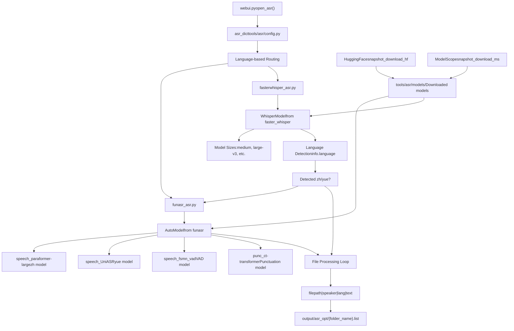
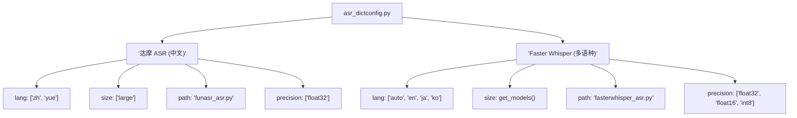
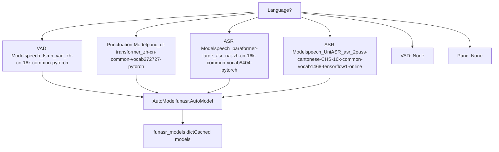
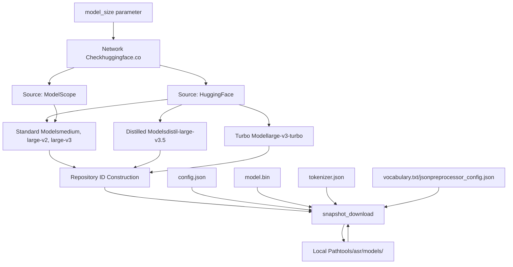
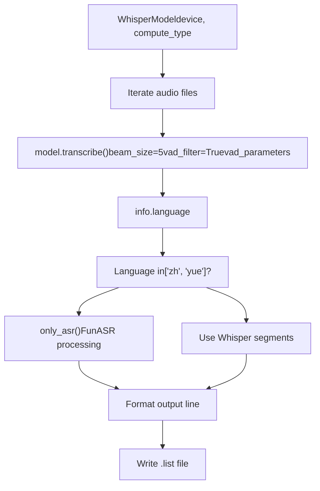
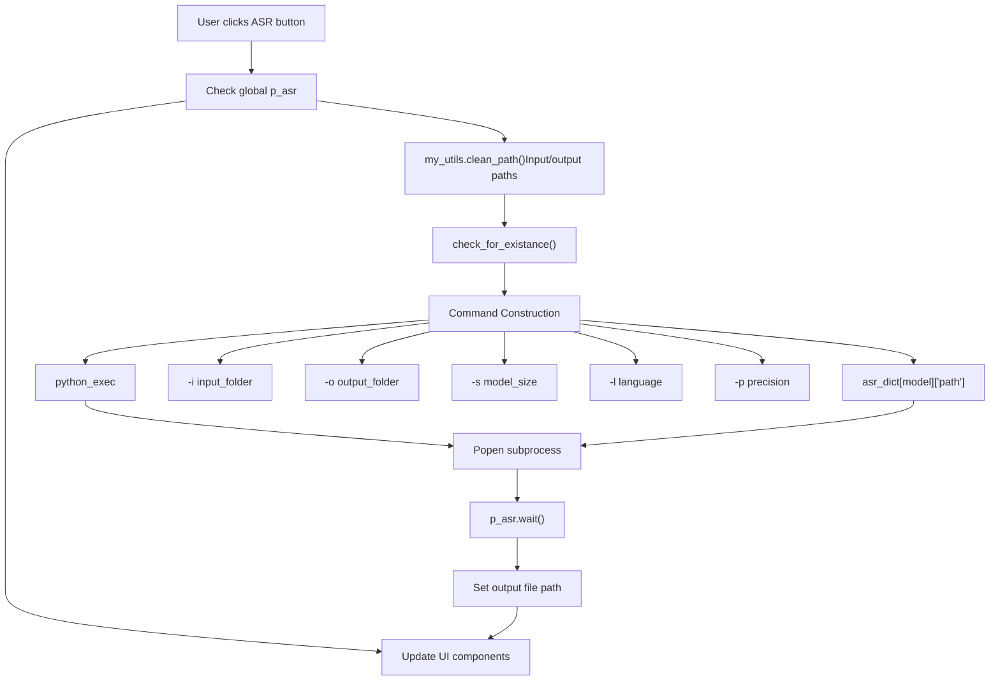
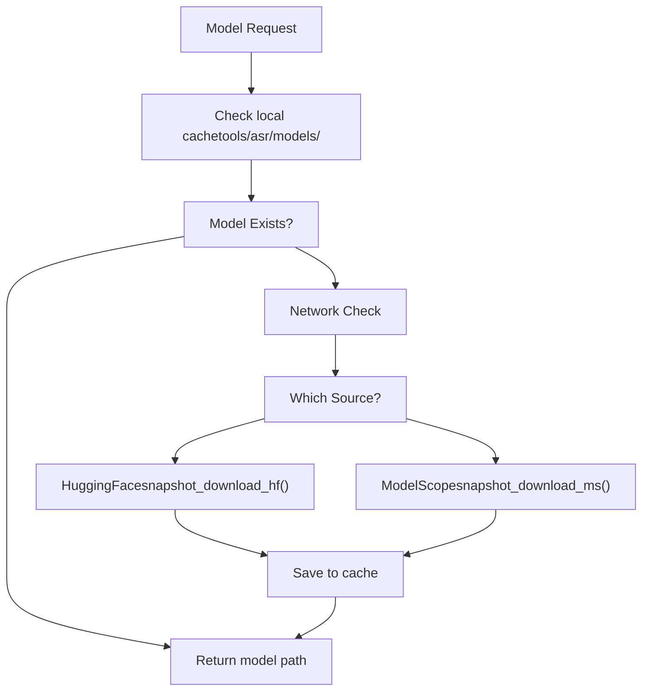
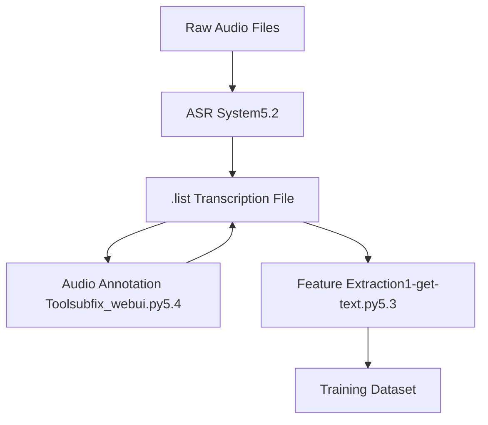

# Automatic Speech Recognition

Relevant source files

-   [GPT\_SoVITS/text/.gitignore](https://github.com/RVC-Boss/GPT-SoVITS/blob/c767f0b8/GPT_SoVITS/text/.gitignore)
-   [api.py](https://github.com/RVC-Boss/GPT-SoVITS/blob/c767f0b8/api.py)
-   [config.py](https://github.com/RVC-Boss/GPT-SoVITS/blob/c767f0b8/config.py)
-   [tools/asr/config.py](https://github.com/RVC-Boss/GPT-SoVITS/blob/c767f0b8/tools/asr/config.py)
-   [tools/asr/fasterwhisper\_asr.py](https://github.com/RVC-Boss/GPT-SoVITS/blob/c767f0b8/tools/asr/fasterwhisper_asr.py)
-   [tools/asr/funasr\_asr.py](https://github.com/RVC-Boss/GPT-SoVITS/blob/c767f0b8/tools/asr/funasr_asr.py)
-   [tools/asr/models/.gitignore](https://github.com/RVC-Boss/GPT-SoVITS/blob/c767f0b8/tools/asr/models/.gitignore)
-   [webui.py](https://github.com/RVC-Boss/GPT-SoVITS/blob/c767f0b8/webui.py)

## Purpose and Scope

This page documents the Automatic Speech Recognition (ASR) subsystem used in GPT-SoVITS for generating text transcriptions from audio files during the data preparation phase. The ASR system is part of Phase 0 preprocessing and produces annotated transcription files that serve as input for subsequent feature extraction steps.

For information about the complete data preparation workflow, see [Data Preparation](/RVC-Boss/GPT-SoVITS/5-data-preparation). For manual text correction and annotation tools, see [Audio Annotation and Management](/RVC-Boss/GPT-SoVITS/5.4-audio-annotation-tools).

## Overview

GPT-SoVITS integrates two complementary ASR systems that are automatically selected based on the target language:

| ASR System | Languages Supported | Model Sizes | Precision Options |
| --- | --- | --- | --- |
| **FunASR (达摩 ASR)** | Chinese (`zh`), Cantonese (`yue`) | Large | float32 |
| **Faster Whisper** | Multi-language (`auto`, `en`, `ja`, `ko`, etc.) | medium, medium.en, large-v2, large-v3, large-v3-turbo | float32, float16, int8 |

The system automatically routes Chinese and Cantonese audio through FunASR for optimal recognition quality, while other languages use Faster Whisper. This language-specific routing occurs even when Faster Whisper initially detects Chinese text.

**Sources:** [tools/asr/config.py15-23](https://github.com/RVC-Boss/GPT-SoVITS/blob/c767f0b8/tools/asr/config.py#L15-L23) [tools/asr/fasterwhisper\_asr.py129-131](https://github.com/RVC-Boss/GPT-SoVITS/blob/c767f0b8/tools/asr/fasterwhisper_asr.py#L129-L131)

## System Architecture


**Sources:** [webui.py371-415](https://github.com/RVC-Boss/GPT-SoVITS/blob/c767f0b8/webui.py#L371-L415) [tools/asr/config.py15-23](https://github.com/RVC-Boss/GPT-SoVITS/blob/c767f0b8/tools/asr/config.py#L15-L23) [tools/asr/fasterwhisper\_asr.py104-148](https://github.com/RVC-Boss/GPT-SoVITS/blob/c767f0b8/tools/asr/fasterwhisper_asr.py#L104-L148) [tools/asr/funasr\_asr.py73-98](https://github.com/RVC-Boss/GPT-SoVITS/blob/c767f0b8/tools/asr/funasr_asr.py#L73-L98)

## ASR Configuration System

The ASR system configuration is centralized in `asr_dict`, which maps user-facing ASR names to their implementation details:


**Sources:** [tools/asr/config.py15-23](https://github.com/RVC-Boss/GPT-SoVITS/blob/c767f0b8/tools/asr/config.py#L15-L23)

## FunASR Implementation

FunASR is Alibaba's speech recognition framework optimized for Chinese and Cantonese languages. The system uses separate model pipelines for each language.

### Model Architecture


The Chinese pipeline includes Voice Activity Detection (VAD) and punctuation restoration, while the Cantonese pipeline uses a simpler unified model.

**Sources:** [tools/asr/funasr\_asr.py24-70](https://github.com/RVC-Boss/GPT-SoVITS/blob/c767f0b8/tools/asr/funasr_asr.py#L24-L70)

### Processing Workflow

The `execute_asr()` function in FunASR follows this workflow:

1.  **Model Initialization**: Load or retrieve cached model via `create_model(language)`
2.  **File Iteration**: Process each audio file in `input_folder`
3.  **Transcription**: Call `model.generate(input=file_path)[0]["text"]`
4.  **Output Formatting**: Format as `filepath|speaker|language|text`
5.  **File Writing**: Save to `{output_folder}/{folder_name}.list`

**Sources:** [tools/asr/funasr\_asr.py73-98](https://github.com/RVC-Boss/GPT-SoVITS/blob/c767f0b8/tools/asr/funasr_asr.py#L73-L98)

### Single-File ASR Function

The `only_asr()` function provides a standalone interface for processing individual files without generating list files:

```
def only_asr(input_file, language):    model = create_model(language)    text = model.generate(input=input_file)[0]["text"]    return text
```
This function is called by Faster Whisper when Chinese/Cantonese text is detected.

**Sources:** [tools/asr/funasr\_asr.py14-21](https://github.com/RVC-Boss/GPT-SoVITS/blob/c767f0b8/tools/asr/funasr_asr.py#L14-L21)

## Faster Whisper Implementation

Faster Whisper is an optimized implementation of OpenAI's Whisper model using CTranslate2 for faster inference.

### Model Management


**Sources:** [tools/asr/fasterwhisper\_asr.py42-101](https://github.com/RVC-Boss/GPT-SoVITS/blob/c767f0b8/tools/asr/fasterwhisper_asr.py#L42-L101)

### Language Detection and Routing

The Faster Whisper system implements intelligent language detection with automatic fallback to FunASR:


**Key Implementation Details:**

-   **VAD Parameters**: `min_silence_duration_ms=700` for better segmentation
-   **Beam Size**: 5 for balanced accuracy and speed
-   **Automatic Language Detection**: When `language=None` (user selects "auto")
-   **Chinese/Cantonese Fallback**: Lines 129-131 detect and redirect to FunASR

**Sources:** [tools/asr/fasterwhisper\_asr.py104-148](https://github.com/RVC-Boss/GPT-SoVITS/blob/c767f0b8/tools/asr/fasterwhisper_asr.py#L104-L148) [tools/asr/fasterwhisper\_asr.py129-131](https://github.com/RVC-Boss/GPT-SoVITS/blob/c767f0b8/tools/asr/fasterwhisper_asr.py#L129-L131)

### Supported Language Codes

Faster Whisper supports 100+ languages. The implementation defines supported codes in `language_code_list`:

| Code | Language | Code | Language | Code | Language |
| --- | --- | --- | --- | --- | --- |
| `zh` | Chinese | `en` | English | `ja` | Japanese |
| `ko` | Korean | `yue` | Cantonese | `auto` | Auto-detect |
| `ar` | Arabic | `de` | German | `fr` | French |
| `ru` | Russian | `es` | Spanish | `hi` | Hindi |

(Plus 90+ additional language codes)

**Sources:** [tools/asr/fasterwhisper\_asr.py17-38](https://github.com/RVC-Boss/GPT-SoVITS/blob/c767f0b8/tools/asr/fasterwhisper_asr.py#L17-L38)

## WebUI Integration

The ASR functionality is exposed through the main WebUI via the `open_asr()` function:


**Command Construction Example:**

```
"{python_exec}" -s tools/asr/{asr_script}
  -i "{input_dir}"
  -o "{output_dir}"
  -s {model_size}
  -l {language}
  -p {precision}
```
**Sources:** [webui.py371-415](https://github.com/RVC-Boss/GPT-SoVITS/blob/c767f0b8/webui.py#L371-L415)

### Process Lifecycle Management

The WebUI maintains a global `p_asr` variable to track the ASR subprocess:

-   **Start**: `p_asr = Popen(cmd, shell=True)` (line 395)
-   **Wait**: `p_asr.wait()` blocks until completion (line 396)
-   **Reset**: `p_asr = None` after completion (line 397)
-   **Terminate**: `close_asr()` function kills the process if needed (lines 417-426)

**Sources:** [webui.py395-397](https://github.com/RVC-Boss/GPT-SoVITS/blob/c767f0b8/webui.py#L395-L397) [webui.py417-426](https://github.com/RVC-Boss/GPT-SoVITS/blob/c767f0b8/webui.py#L417-L426)

## Output Format Specification

Both ASR systems generate output files in identical format, ensuring consistency across the pipeline.

### File Structure

**Output Path:** `{output_folder}/{input_folder_basename}.list`

**Line Format:** `filepath|speaker|language|text`

**Example:**

```
/path/to/audio/001.wav|dataset_name|ZH|这是一段中文语音。
/path/to/audio/002.wav|dataset_name|EN|This is English speech.
/path/to/audio/003.wav|dataset_name|JA|これは日本語です。
```
### Field Definitions

| Field | Source | Description |
| --- | --- | --- |
| `filepath` | `file_path` variable | Absolute path to audio file |
| `speaker` | `output_file_name` | Basename of input folder (used as speaker identifier) |
| `language` | `info.language.upper()` | Detected/specified language code (uppercase) |
| `text` | Transcription result | Raw transcribed text from ASR model |

**Sources:** [tools/asr/fasterwhisper\_asr.py136](https://github.com/RVC-Boss/GPT-SoVITS/blob/c767f0b8/tools/asr/fasterwhisper_asr.py#L136-L136) [tools/asr/funasr\_asr.py87](https://github.com/RVC-Boss/GPT-SoVITS/blob/c767f0b8/tools/asr/funasr_asr.py#L87-L87)

### Downstream Usage

This output format is consumed by:

1.  **Manual Correction Tool** (`tools/subfix_webui.py`) - loads `.list` file for editing
2.  **Feature Extraction** (`1-get-text.py`) - parses for BERT feature generation
3.  **Dataset Formatting** - structures training data

**Sources:** [webui.py270-295](https://github.com/RVC-Boss/GPT-SoVITS/blob/c767f0b8/webui.py#L270-L295)

## Model Download and Caching

Both ASR systems implement automatic model downloading with intelligent fallback.

### Download Strategy


### FunASR Model Downloads

FunASR uses ModelScope exclusively via `snapshot_download()`:

| Model Component | Repository ID | Local Directory |
| --- | --- | --- |
| Chinese ASR | `iic/speech_paraformer-large_asr_nat-zh-cn-16k-common-vocab8404-pytorch` | `tools/asr/models/speech_paraformer-large_asr_nat-zh-cn-16k-common-vocab8404-pytorch` |
| Chinese VAD | `iic/speech_fsmn_vad_zh-cn-16k-common-pytorch` | `tools/asr/models/speech_fsmn_vad_zh-cn-16k-common-pytorch` |
| Chinese Punctuation | `iic/punc_ct-transformer_zh-cn-common-vocab272727-pytorch` | `tools/asr/models/punc_ct-transformer_zh-cn-common-vocab272727-pytorch` |
| Cantonese ASR | `iic/speech_UniASR_asr_2pass-cantonese-CHS-16k-common-vocab1468-tensorflow1-online` | `tools/asr/models/speech_UniASR_asr_2pass-cantonese-CHS-16k-common-vocab1468-tensorflow1-online` |

**Sources:** [tools/asr/funasr\_asr.py29-46](https://github.com/RVC-Boss/GPT-SoVITS/blob/c767f0b8/tools/asr/funasr_asr.py#L29-L46)

### Faster Whisper Model Downloads

Faster Whisper supports both HuggingFace and ModelScope:

**HuggingFace Repositories:**

-   Standard: `Systran/faster-whisper-{model_size}`
-   Distilled: `Systran/faster-distil-whisper-{variant}` or `distil-whisper/distil-large-v3.5-ct2`
-   Turbo: `mobiuslabsgmbh/faster-whisper-large-v3-turbo`

**ModelScope Repository:**

-   All models: `XXXXRT/faster-whisper` with subdirectories

**Sources:** [tools/asr/fasterwhisper\_asr.py50-100](https://github.com/RVC-Boss/GPT-SoVITS/blob/c767f0b8/tools/asr/fasterwhisper_asr.py#L50-L100)

## Error Handling and Edge Cases

### FunASR Error Handling

FunASR wraps transcription in try-except blocks:

```
try:    text = model.generate(input=file_path)[0]["text"]except Exception:    print(traceback.format_exc())    # Continue to next file
```
**Sources:** [tools/asr/funasr\_asr.py83-89](https://github.com/RVC-Boss/GPT-SoVITS/blob/c767f0b8/tools/asr/funasr_asr.py#L83-L89)

### Faster Whisper Error Handling

Faster Whisper includes additional safeguards:

1.  **Empty Text Handling**: If FunASR fallback returns empty string, falls back to Whisper segments
2.  **Transcription Errors**: Wrapped in try-except, prints error and continues
3.  **Model Download Failures**: Checks network connectivity before attempting download

**Sources:** [tools/asr/fasterwhisper\_asr.py117-139](https://github.com/RVC-Boss/GPT-SoVITS/blob/c767f0b8/tools/asr/fasterwhisper_asr.py#L117-L139)

## Performance Considerations

### Device Selection

Both systems automatically select GPU if available:

```
device = "cuda" if torch.cuda.is_available() else "cpu"
```
**Sources:** [tools/asr/fasterwhisper\_asr.py108](https://github.com/RVC-Boss/GPT-SoVITS/blob/c767f0b8/tools/asr/fasterwhisper_asr.py#L108-L108)

### Precision Options

| Precision | Memory Usage | Speed | Accuracy | Supported By |
| --- | --- | --- | --- | --- |
| `float32` | Highest | Slowest | Best | Both |
| `float16` | Medium | Medium | Good | Faster Whisper |
| `int8` | Lowest | Fastest | Acceptable | Faster Whisper |

**Sources:** [tools/asr/config.py15-23](https://github.com/RVC-Boss/GPT-SoVITS/blob/c767f0b8/tools/asr/config.py#L15-L23)

### Model Caching

FunASR implements model caching via the `funasr_models` dictionary to avoid reloading:

```
if language in funasr_models:    return funasr_models[language]else:    model = AutoModel(...)    funasr_models[language] = model    return model
```
**Sources:** [tools/asr/funasr\_asr.py56-70](https://github.com/RVC-Boss/GPT-SoVITS/blob/c767f0b8/tools/asr/funasr_asr.py#L56-L70)

## Integration Points

The ASR system integrates with other GPT-SoVITS components:


**Sources:** [webui.py780-846](https://github.com/RVC-Boss/GPT-SoVITS/blob/c767f0b8/webui.py#L780-L846)
