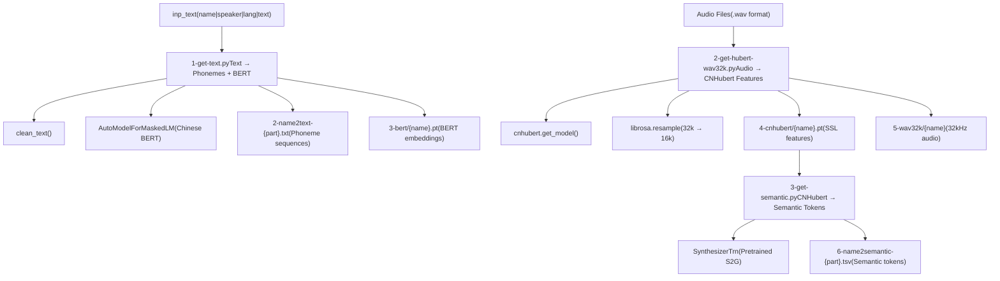
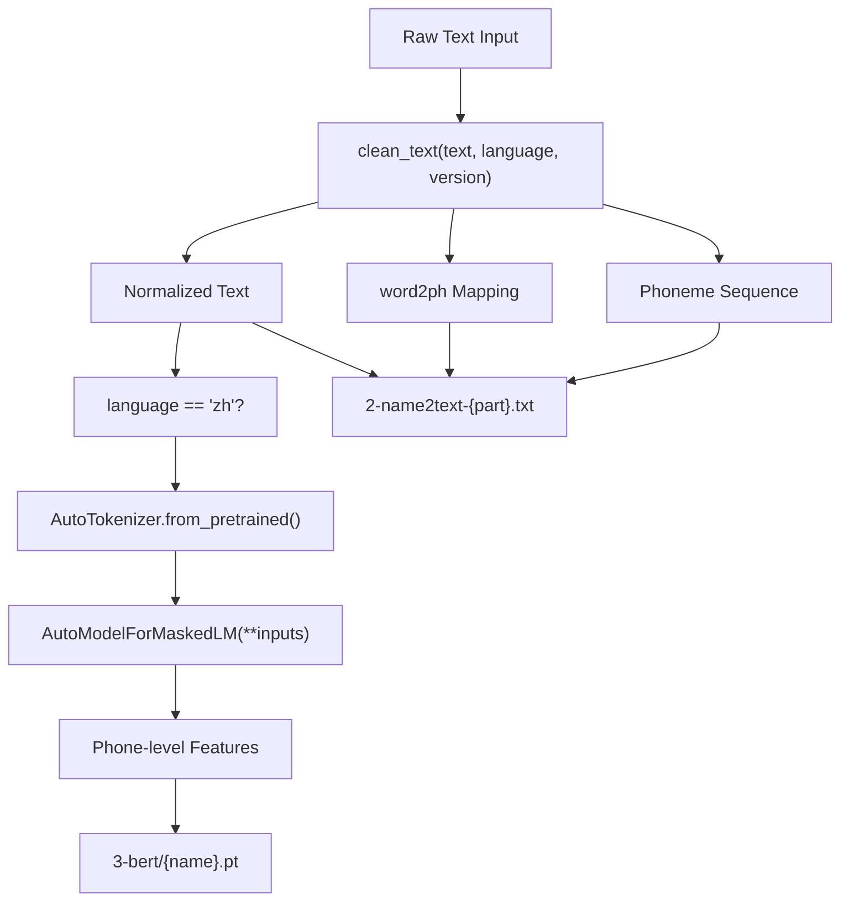
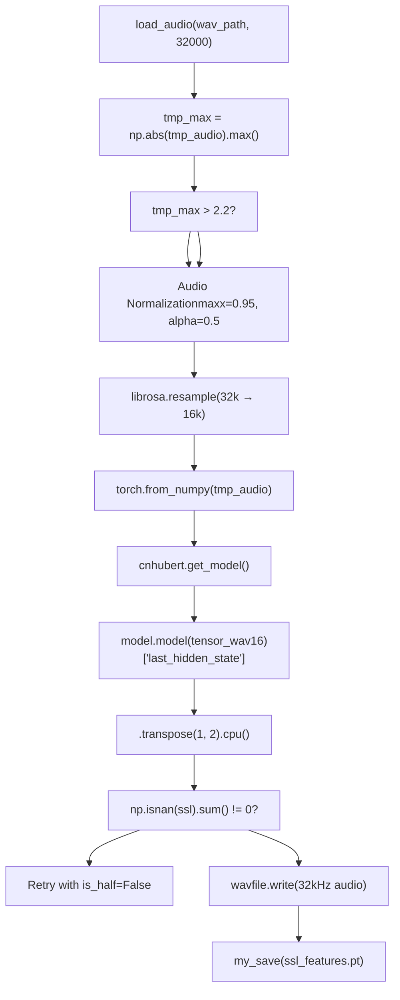
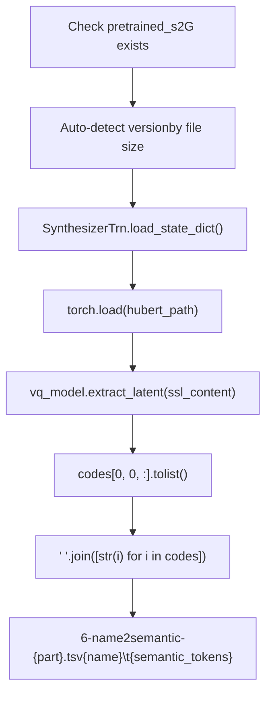

# Feature Extraction

Relevant source files

-   [GPT\_SoVITS/prepare\_datasets/1-get-text.py](https://github.com/RVC-Boss/GPT-SoVITS/blob/c767f0b8/GPT_SoVITS/prepare_datasets/1-get-text.py)
-   [GPT\_SoVITS/prepare\_datasets/2-get-hubert-wav32k.py](https://github.com/RVC-Boss/GPT-SoVITS/blob/c767f0b8/GPT_SoVITS/prepare_datasets/2-get-hubert-wav32k.py)
-   [GPT\_SoVITS/prepare\_datasets/3-get-semantic.py](https://github.com/RVC-Boss/GPT-SoVITS/blob/c767f0b8/GPT_SoVITS/prepare_datasets/3-get-semantic.py)
-   [GPT\_SoVITS/s1\_train.py](https://github.com/RVC-Boss/GPT-SoVITS/blob/c767f0b8/GPT_SoVITS/s1_train.py)

Feature extraction is the second phase of the data preparation pipeline, responsible for converting raw audio and text data into neural network-compatible representations. This process extracts three types of features: text phoneme sequences with BERT embeddings, CNHubert SSL features from audio, and semantic tokens for training the GPT-SoVITS models.

For information about audio preprocessing and data labeling, see [Audio Management Tools](/RVC-Boss/GPT-SoVITS/5.4-audio-annotation-tools). For the complete training dataset preparation workflow, see [Dataset Preparation](/RVC-Boss/GPT-SoVITS/6.1-dataset-format-and-structure).

## Overview

The feature extraction pipeline consists of three sequential scripts that transform raw training data into model-ready features:


Sources: [GPT\_SoVITS/prepare\_datasets/1-get-text.py1-144](https://github.com/RVC-Boss/GPT-SoVITS/blob/c767f0b8/GPT_SoVITS/prepare_datasets/1-get-text.py#L1-L144) [GPT\_SoVITS/prepare\_datasets/2-get-hubert-wav32k.py1-135](https://github.com/RVC-Boss/GPT-SoVITS/blob/c767f0b8/GPT_SoVITS/prepare_datasets/2-get-hubert-wav32k.py#L1-L135) [GPT\_SoVITS/prepare\_datasets/3-get-semantic.py1-119](https://github.com/RVC-Boss/GPT-SoVITS/blob/c767f0b8/GPT_SoVITS/prepare_datasets/3-get-semantic.py#L1-L119)

## Step 1: Text Feature Extraction

### Text Processing Pipeline

The `1-get-text.py` script processes text annotations to extract phoneme sequences and BERT features. It supports multiple languages through the `clean_text` function and generates Chinese BERT embeddings for enhanced text understanding.


### Key Components

| Component | Function | Implementation |
| --- | --- | --- |
| `clean_text()` | Text normalization and G2P conversion | [GPT\_SoVITS/prepare\_datasets/1-get-text.py92](https://github.com/RVC-Boss/GPT-SoVITS/blob/c767f0b8/GPT_SoVITS/prepare_datasets/1-get-text.py#L92-L92) |
| `get_bert_feature()` | BERT feature extraction for Chinese | [GPT\_SoVITS/prepare\_datasets/1-get-text.py68-84](https://github.com/RVC-Boss/GPT-SoVITS/blob/c767f0b8/GPT_SoVITS/prepare_datasets/1-get-text.py#L68-L84) |
| `AutoTokenizer` | Text tokenization | [GPT\_SoVITS/prepare\_datasets/1-get-text.py61](https://github.com/RVC-Boss/GPT-SoVITS/blob/c767f0b8/GPT_SoVITS/prepare_datasets/1-get-text.py#L61-L61) |
| `AutoModelForMaskedLM` | BERT model inference | [GPT\_SoVITS/prepare\_datasets/1-get-text.py62](https://github.com/RVC-Boss/GPT-SoVITS/blob/c767f0b8/GPT_SoVITS/prepare_datasets/1-get-text.py#L62-L62) |

The script processes input files with format `wav_name|spk_name|language|text` and supports language codes: `zh`, `ja`, `en`, `ko`, `yue` through the `language_v1_to_language_v2` mapping.

Sources: [GPT\_SoVITS/prepare\_datasets/1-get-text.py110-126](https://github.com/RVC-Boss/GPT-SoVITS/blob/c767f0b8/GPT_SoVITS/prepare_datasets/1-get-text.py#L110-L126) [GPT\_SoVITS/prepare\_datasets/1-get-text.py68-84](https://github.com/RVC-Boss/GPT-SoVITS/blob/c767f0b8/GPT_SoVITS/prepare_datasets/1-get-text.py#L68-L84) [GPT\_SoVITS/prepare\_datasets/1-get-text.py86-104](https://github.com/RVC-Boss/GPT-SoVITS/blob/c767f0b8/GPT_SoVITS/prepare_datasets/1-get-text.py#L86-L104)

## Step 2: CNHubert Audio Feature Extraction

### Audio Processing Pipeline

The `2-get-hubert-wav32k.py` script extracts CNHubert SSL (Self-Supervised Learning) features from audio files. It processes audio at multiple sample rates and applies normalization for optimal feature extraction.


### Audio Processing Parameters

| Parameter | Value | Purpose |
| --- | --- | --- |
| `maxx` | 0.95 | Maximum normalization threshold |
| `alpha` | 0.5 | Normalization blending factor |
| Input Sample Rate | 32kHz | Standard audio processing rate |
| CNHubert Sample Rate | 16kHz | Model input requirement |
| Feature Shape | `[1, 768, T]` | SSL feature dimensions |

The script includes robust error handling for NaN values in SSL features through precision fallback from half to full precision.

Sources: [GPT\_SoVITS/prepare\_datasets/2-get-hubert-wav32k.py78-106](https://github.com/RVC-Boss/GPT-SoVITS/blob/c767f0b8/GPT_SoVITS/prepare_datasets/2-get-hubert-wav32k.py#L78-L106) [GPT\_SoVITS/prepare\_datasets/2-get-hubert-wav32k.py60-61](https://github.com/RVC-Boss/GPT-SoVITS/blob/c767f0b8/GPT_SoVITS/prepare_datasets/2-get-hubert-wav32k.py#L60-L61) [GPT\_SoVITS/prepare\_datasets/2-get-hubert-wav32k.py127-134](https://github.com/RVC-Boss/GPT-SoVITS/blob/c767f0b8/GPT_SoVITS/prepare_datasets/2-get-hubert-wav32k.py#L127-L134)

## Step 3: Semantic Token Extraction

### Semantic Encoding Process

The `3-get-semantic.py` script uses a pretrained SoVITS model to extract semantic tokens from CNHubert features. This step creates discrete representations that the GPT model will learn to predict.


### Version Detection Logic

The script automatically detects the SoVITS model version based on file size:

| Version | File Size Range | Model Type |
| --- | --- | --- |
| v1 | < 82MB or 82MB-101MB | `SynthesizerTrn` |
| v2 | 101MB-700MB | `SynthesizerTrn` |
| v3 | \> 700MB | `SynthesizerTrnV3` |

### Semantic Token Format

The extracted semantic tokens are integers representing discrete latent codes from the VQ-VAE component of the SoVITS model. These tokens form the target sequence for GPT training.

Sources: [GPT\_SoVITS/prepare\_datasets/3-get-semantic.py18-28](https://github.com/RVC-Boss/GPT-SoVITS/blob/c767f0b8/GPT_SoVITS/prepare_datasets/3-get-semantic.py#L18-L28) [GPT\_SoVITS/prepare\_datasets/3-get-semantic.py89-100](https://github.com/RVC-Boss/GPT-SoVITS/blob/c767f0b8/GPT_SoVITS/prepare_datasets/3-get-semantic.py#L89-L100) [GPT\_SoVITS/prepare\_datasets/3-get-semantic.py40-43](https://github.com/RVC-Boss/GPT-SoVITS/blob/c767f0b8/GPT_SoVITS/prepare_datasets/3-get-semantic.py#L40-L43)

## Parallel Processing and Environment Configuration

All three feature extraction scripts support parallel processing through environment variables:

| Variable | Purpose | Usage |
| --- | --- | --- |
| `i_part` | Current partition index | Distributed processing |
| `all_parts` | Total number of partitions | Load balancing |
| `_CUDA_VISIBLE_DEVICES` | GPU device selection | Hardware optimization |
| `is_half` | Mixed precision training | Memory optimization |

The scripts process subsets of the input data using: `lines[int(i_part)::int(all_parts)]` for distributed workload splitting.

Sources: [GPT\_SoVITS/prepare\_datasets/1-get-text.py127](https://github.com/RVC-Boss/GPT-SoVITS/blob/c767f0b8/GPT_SoVITS/prepare_datasets/1-get-text.py#L127-L127) [GPT\_SoVITS/prepare\_datasets/2-get-hubert-wav32k.py111](https://github.com/RVC-Boss/GPT-SoVITS/blob/c767f0b8/GPT_SoVITS/prepare_datasets/2-get-hubert-wav32k.py#L111-L111) [GPT\_SoVITS/prepare\_datasets/3-get-semantic.py106](https://github.com/RVC-Boss/GPT-SoVITS/blob/c767f0b8/GPT_SoVITS/prepare_datasets/3-get-semantic.py#L106-L106)

## Output File Structure

The feature extraction process creates a structured dataset directory:

```
{opt_dir}/
├── 2-name2text-{part}.txt     # Phoneme sequences
├── 3-bert/{name}.pt            # BERT embeddings (Chinese only)
├── 4-cnhubert/{name}.pt        # CNHubert SSL features
├── 5-wav32k/{name}             # 32kHz normalized audio
└── 6-name2semantic-{part}.tsv  # Semantic token sequences
```
These files serve as training inputs for the GPT and SoVITS models in subsequent training phases.

Sources: [GPT\_SoVITS/prepare\_datasets/1-get-text.py46](https://github.com/RVC-Boss/GPT-SoVITS/blob/c767f0b8/GPT_SoVITS/prepare_datasets/1-get-text.py#L46-L46) [GPT\_SoVITS/prepare\_datasets/2-get-hubert-wav32k.py54-58](https://github.com/RVC-Boss/GPT-SoVITS/blob/c767f0b8/GPT_SoVITS/prepare_datasets/2-get-hubert-wav32k.py#L54-L58) [GPT\_SoVITS/prepare\_datasets/3-get-semantic.py58](https://github.com/RVC-Boss/GPT-SoVITS/blob/c767f0b8/GPT_SoVITS/prepare_datasets/3-get-semantic.py#L58-L58)
