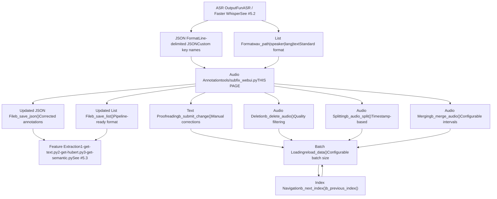
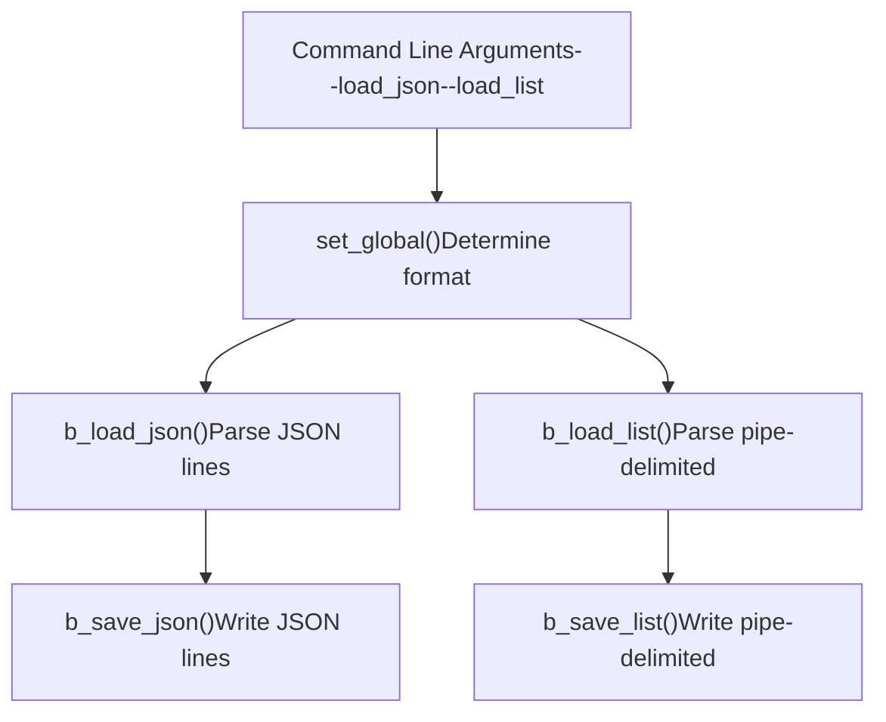
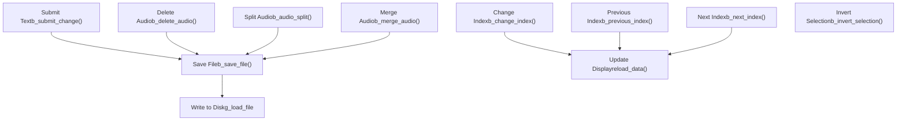
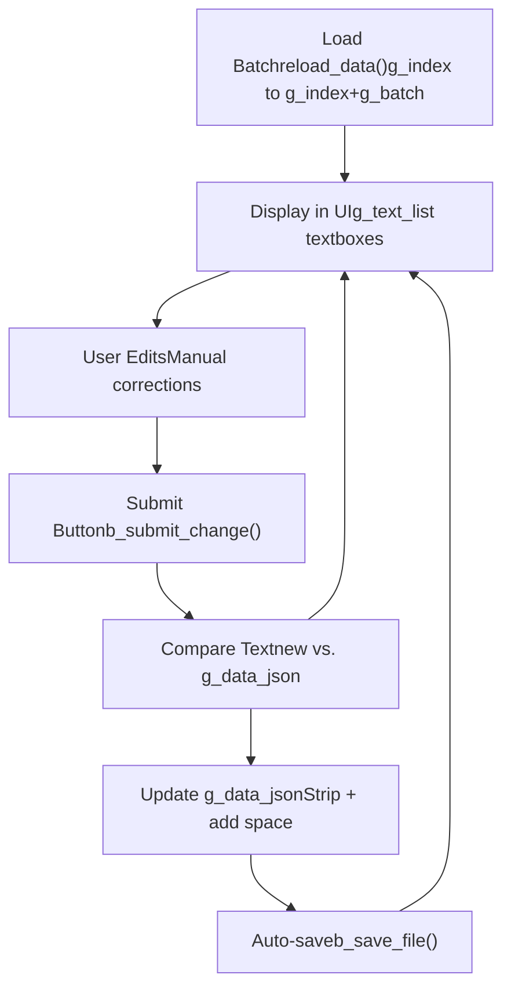
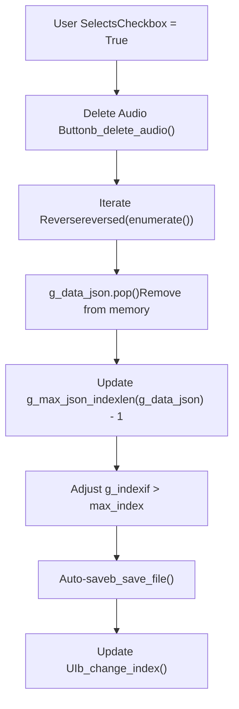
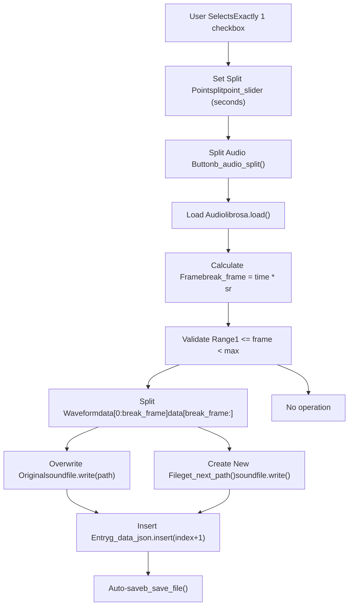
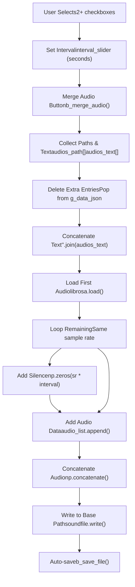
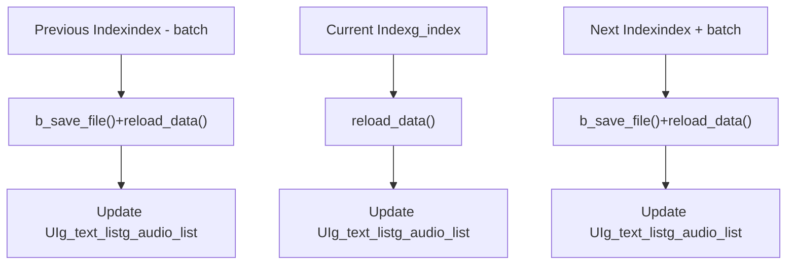
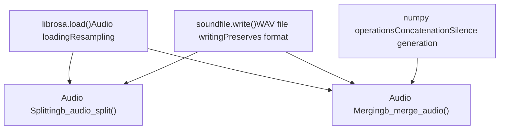
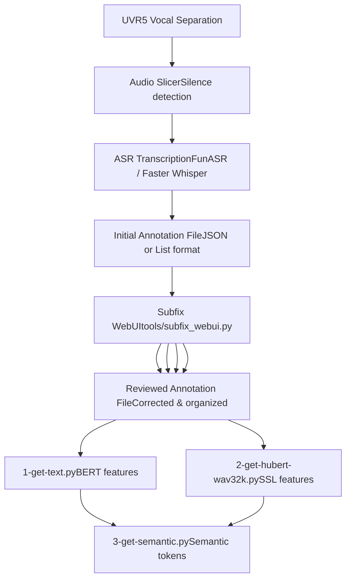

# Audio Annotation Tools

Relevant source files

-   [tools/my\_utils.py](https://github.com/RVC-Boss/GPT-SoVITS/blob/c767f0b8/tools/my_utils.py)
-   [tools/slice\_audio.py](https://github.com/RVC-Boss/GPT-SoVITS/blob/c767f0b8/tools/slice_audio.py)
-   [tools/slicer2.py](https://github.com/RVC-Boss/GPT-SoVITS/blob/c767f0b8/tools/slicer2.py)
-   [tools/subfix\_webui.py](https://github.com/RVC-Boss/GPT-SoVITS/blob/c767f0b8/tools/subfix_webui.py)
-   [tools/uvr5/webui.py](https://github.com/RVC-Boss/GPT-SoVITS/blob/c767f0b8/tools/uvr5/webui.py)

This document describes the audio annotation system used for proofreading and managing training data. The annotation interface provides tools for reviewing ASR transcriptions, splitting and merging audio segments, and organizing datasets before feature extraction.

For audio preprocessing operations (vocal separation, silence-based slicing, denoising), see [Audio Preprocessing Tools](/RVC-Boss/GPT-SoVITS/5.1-audio-preprocessing-tools). For automatic speech recognition, see [Automatic Speech Recognition](/RVC-Boss/GPT-SoVITS/5.2-automatic-speech-recognition). For the subsequent feature extraction process, see [Feature Extraction Scripts](/RVC-Boss/GPT-SoVITS/5.3-feature-extraction-scripts).

## Purpose and Scope

The audio annotation tools enable manual quality control of automatically transcribed data. After ASR generates initial transcriptions, this interface allows users to:

-   Proofread and correct transcription errors
-   Delete low-quality audio segments
-   Split long audio clips at specified timestamps
-   Merge short segments with configurable silence intervals
-   Navigate through large datasets efficiently
-   Maintain synchronization between audio files and text annotations

The primary tool is `subfix_webui.py`, which provides a Gradio-based web interface for these operations.

## System Architecture


**Sources:** [tools/subfix\_webui.py1-426](https://github.com/RVC-Boss/GPT-SoVITS/blob/c767f0b8/tools/subfix_webui.py#L1-L426)

## Data Format Support

The annotation tool supports two file formats for loading and saving training data.

### JSON Format

Line-delimited JSON format where each line represents one audio-text pair:

```
{"text": "transcription text", "wav_path": "/path/to/audio.wav"}{"text": "another transcription", "wav_path": "/path/to/audio2.wav"}
```
Key names are configurable via command-line arguments:

-   `--json_key_text`: Key name for text field (default: `"text"`)
-   `--json_key_path`: Key name for audio path field (default: `"wav_path"`)

**Sources:** [tools/subfix\_webui.py238-243](https://github.com/RVC-Boss/GPT-SoVITS/blob/c767f0b8/tools/subfix_webui.py#L238-L243) [tools/subfix\_webui.py303-304](https://github.com/RVC-Boss/GPT-SoVITS/blob/c767f0b8/tools/subfix_webui.py#L303-L304)

### List Format

Pipe-delimited format used throughout the GPT-SoVITS pipeline:

```
/path/to/audio.wav|speaker_name|language|transcription text
/path/to/audio2.wav|speaker_name|language|another transcription
```
Fields are parsed in order:

1.  `wav_path`: Absolute or relative path to audio file
2.  `speaker_name`: Speaker identifier
3.  `language`: Language code (e.g., `zh`, `en`, `ja`)
4.  `text`: Transcription text

**Sources:** [tools/subfix\_webui.py246-260](https://github.com/RVC-Boss/GPT-SoVITS/blob/c767f0b8/tools/subfix_webui.py#L246-L260) [tools/subfix\_webui.py228-236](https://github.com/RVC-Boss/GPT-SoVITS/blob/c767f0b8/tools/subfix_webui.py#L228-L236)

### Format Selection


**Sources:** [tools/subfix\_webui.py276-294](https://github.com/RVC-Boss/GPT-SoVITS/blob/c767f0b8/tools/subfix_webui.py#L276-L294) [tools/subfix\_webui.py262-274](https://github.com/RVC-Boss/GPT-SoVITS/blob/c767f0b8/tools/subfix_webui.py#L262-L274)

## User Interface Components

The Gradio interface displays audio-text pairs in configurable batches with controls for editing and management.

### Interface Layout

| Component Type | Purpose | Implementation |
| --- | --- | --- |
| Text Fields | Display and edit transcriptions | `gr.Textbox` in `g_text_list` |
| Audio Players | Play reference audio | `gr.Audio` in `g_audio_list` |
| Checkboxes | Select items for batch operations | `gr.Checkbox` in `g_checkbox_list` |
| Index Slider | Navigate to specific batch position | `index_slider` |
| Batch Size Slider | Configure items per page | `batchsize_slider` |
| Split Point Slider | Specify audio split timestamp | `splitpoint_slider` |
| Interval Slider | Configure merge silence duration | `interval_slider` |

**Sources:** [tools/subfix\_webui.py326-351](https://github.com/RVC-Boss/GPT-SoVITS/blob/c767f0b8/tools/subfix_webui.py#L326-L351)

### Control Buttons


**Sources:** [tools/subfix\_webui.py318-324](https://github.com/RVC-Boss/GPT-SoVITS/blob/c767f0b8/tools/subfix_webui.py#L318-L324) [tools/subfix\_webui.py353-408](https://github.com/RVC-Boss/GPT-SoVITS/blob/c767f0b8/tools/subfix_webui.py#L353-L408)

## Core Operations

### Text Annotation and Proofreading

The primary workflow for correcting ASR transcription errors.


The `b_submit_change()` function processes all text fields in the current batch:

```
def b_submit_change(*text_list):    for i, new_text in enumerate(text_list):        if g_index + i <= g_max_json_index:            new_text = new_text.strip() + " "            if g_data_json[g_index + i][g_json_key_text] != new_text:                g_data_json[g_index + i][g_json_key_text] = new_text
```
**Important:** The interface does not auto-save changes. Users must click "Submit Text" before navigating away or the changes will be lost.

**Sources:** [tools/subfix\_webui.py96-107](https://github.com/RVC-Boss/GPT-SoVITS/blob/c767f0b8/tools/subfix_webui.py#L96-L107) [tools/subfix\_webui.py362-368](https://github.com/RVC-Boss/GPT-SoVITS/blob/c767f0b8/tools/subfix_webui.py#L362-L368)

### Audio Deletion

Remove low-quality or incorrect audio segments from the dataset.

**Process:**

1.  User selects audio items using checkboxes
2.  Click "Delete Audio" button
3.  Selected items are removed from `g_data_json` in reverse order
4.  Index is adjusted if necessary to stay in valid range
5.  Changes are saved automatically


**Note:** Deletion only removes the entry from the annotation file. The physical audio file on disk is not deleted.

**Sources:** [tools/subfix\_webui.py110-131](https://github.com/RVC-Boss/GPT-SoVITS/blob/c767f0b8/tools/subfix_webui.py#L110-L131) [tools/subfix\_webui.py388-392](https://github.com/RVC-Boss/GPT-SoVITS/blob/c767f0b8/tools/subfix_webui.py#L388-L392)

### Audio Splitting

Split a single audio file at a specified timestamp into two separate segments.

**Operation:**

1.  Select exactly one audio item (checkbox)
2.  Set split point in seconds using "Audio Split Point(s)" slider
3.  Click "Split Audio" button


**File Naming:** New files are named with incrementing suffixes:

-   Original: `audio.wav`
-   First split: `audio.wav` (overwritten)
-   Second split: `audio_00.wav`, `audio_01.wav`, etc.

If `audio_00.wav` through `audio_99.wav` all exist, a UUID is used instead.

**Sources:** [tools/subfix\_webui.py149-175](https://github.com/RVC-Boss/GPT-SoVITS/blob/c767f0b8/tools/subfix_webui.py#L149-L175) [tools/subfix\_webui.py139-146](https://github.com/RVC-Boss/GPT-SoVITS/blob/c767f0b8/tools/subfix_webui.py#L139-L146) [tools/subfix\_webui.py400-404](https://github.com/RVC-Boss/GPT-SoVITS/blob/c767f0b8/tools/subfix_webui.py#L400-L404)

### Audio Merging

Combine multiple selected audio segments into a single file with configurable silence intervals.

**Process:**

1.  Select two or more audio items (checkboxes)
2.  Set silence interval in seconds using "Interval" slider
3.  Click "Merge Audio" button


**Merge Behavior:**

-   Text from all segments is concatenated without delimiters
-   Audio segments are joined with silence intervals between them
-   The first selected audio file is overwritten with the merged result
-   All other selected entries are removed from the dataset
-   The merged entry retains the first selected item's position

**Sources:** [tools/subfix\_webui.py178-219](https://github.com/RVC-Boss/GPT-SoVITS/blob/c767f0b8/tools/subfix_webui.py#L178-L219) [tools/subfix\_webui.py394-398](https://github.com/RVC-Boss/GPT-SoVITS/blob/c767f0b8/tools/subfix_webui.py#L394-L398)

### Navigation and Batch Management

The interface displays data in batches for efficient processing of large datasets.

**Global State Variables:**

-   `g_index`: Current starting index in the dataset
-   `g_batch`: Number of items to display per page (configurable, default: 10)
-   `g_max_json_index`: Maximum valid index (length - 1)
-   `g_data_json`: Complete dataset in memory

**Navigation Functions:**

| Function | Behavior | Auto-save |
| --- | --- | --- |
| `b_change_index()` | Jump to specific index | No |
| `b_next_index()` | Advance by batch size | Yes |
| `b_previous_index()` | Go back by batch size | Yes |
| `reload_data()` | Load batch for display | No |


**Boundary Handling:**

-   Previous at index 0 → stay at 0
-   Next beyond max → stay at current position
-   Changes that reduce dataset size adjust `g_index` if needed

**Sources:** [tools/subfix\_webui.py38-93](https://github.com/RVC-Boss/GPT-SoVITS/blob/c767f0b8/tools/subfix_webui.py#L38-L93) [tools/subfix\_webui.py370-386](https://github.com/RVC-Boss/GPT-SoVITS/blob/c767f0b8/tools/subfix_webui.py#L370-L386)

## Implementation Details

### Startup and Configuration

The annotation tool is launched with command-line arguments:

```
python tools/subfix_webui.py \    --load_list path/to/inp_text.list \    --json_key_text text \    --json_key_path wav_path \    --g_batch 10 \    --webui_port_subfix 9871 \    --is_share False
```
**Arguments:**

| Argument | Purpose | Default |
| --- | --- | --- |
| `--load_json` | Path to JSON file | `"None"` |
| `--load_list` | Path to list file | `"None"` |
| `--json_key_text` | JSON key for text | `"text"` |
| `--json_key_path` | JSON key for path | `"wav_path"` |
| `--g_batch` | Items per batch | `10` |
| `--webui_port_subfix` | Web server port | `9871` |
| `--is_share` | Gradio share mode | `"False"` |

**Sources:** [tools/subfix\_webui.py297-309](https://github.com/RVC-Boss/GPT-SoVITS/blob/c767f0b8/tools/subfix_webui.py#L297-L309)

### Audio Processing Dependencies

The tool relies on several libraries for audio manipulation:


**Key Operations:**

-   `librosa.load(path, sr=None, mono=True)`: Load audio with automatic resampling
-   `np.zeros(int(sample_rate * seconds))`: Generate silence
-   `np.concatenate(audio_list)`: Join audio segments
-   `soundfile.write(path, data, sample_rate)`: Write audio file

**Sources:** [tools/subfix\_webui.py159-168](https://github.com/RVC-Boss/GPT-SoVITS/blob/c767f0b8/tools/subfix_webui.py#L159-L168) [tools/subfix\_webui.py199-212](https://github.com/RVC-Boss/GPT-SoVITS/blob/c767f0b8/tools/subfix_webui.py#L199-L212)

### Selection Inversion

The interface includes a convenience function for inverting checkbox selections:

```
def b_invert_selection(*checkbox_list):    new_list = [not item if item is True else True for item in checkbox_list]    return new_list
```
This allows users to:

1.  Select a few items to keep
2.  Invert selection
3.  Delete everything else

**Sources:** [tools/subfix\_webui.py134-136](https://github.com/RVC-Boss/GPT-SoVITS/blob/c767f0b8/tools/subfix_webui.py#L134-L136) [tools/subfix\_webui.py406](https://github.com/RVC-Boss/GPT-SoVITS/blob/c767f0b8/tools/subfix_webui.py#L406-L406)

## Integration with Training Pipeline

The annotation tool fits between ASR transcription and feature extraction in the data preparation workflow.


**Typical Workflow:**

1.  **Preprocessing**: UVR5 removes background music, slicer segments audio
2.  **ASR**: Automatic transcription generates initial annotations
3.  **Annotation** (this stage): Manual review and correction
    -   Fix transcription errors
    -   Split clips that are too long (>30s recommended)
    -   Merge clips that are too short (<2s recommended)
    -   Remove poor quality audio
4.  **Feature Extraction**: Process reviewed data for training

**Quality Guidelines:**

-   Audio clips should be 2-30 seconds for optimal training
-   Transcriptions must exactly match audio (character-level accuracy)
-   Remove clips with background noise, crosstalk, or unclear speech
-   Ensure consistent speaker identity across merged segments

**Sources:** [tools/subfix\_webui.py1-426](https://github.com/RVC-Boss/GPT-SoVITS/blob/c767f0b8/tools/subfix_webui.py#L1-L426)

## Common Usage Patterns

### Correcting ASR Errors

```
1. Load batch containing errors
2. Edit text in textboxes
3. Click "Submit Text" (crucial - changes not saved otherwise)
4. Navigate to next batch
```
### Removing Bad Quality Audio

```
1. Play audio clips to identify quality issues
2. Check checkboxes for clips to remove
3. Click "Delete Audio"
4. Deleted entries are auto-saved
```
### Splitting Long Segments

```
1. Select one long audio clip (>30s)
2. Play audio to identify natural break point
3. Set "Audio Split Point(s)" slider to timestamp
4. Click "Split Audio"
5. Two entries created: original + _00.wav
```
### Merging Short Segments

```
1. Select multiple consecutive short clips (<2s each)
2. Set "Interval" slider for silence between clips (0-2s)
3. Click "Merge Audio"
4. First clip overwritten with merged result
5. Other clips deleted from dataset
```
**Sources:** [tools/subfix\_webui.py1-426](https://github.com/RVC-Boss/GPT-SoVITS/blob/c767f0b8/tools/subfix_webui.py#L1-L426)
