# Model Training

Relevant source files

-   [GPT\_SoVITS/prepare\_datasets/1-get-text.py](https://github.com/RVC-Boss/GPT-SoVITS/blob/c767f0b8/GPT_SoVITS/prepare_datasets/1-get-text.py)
-   [GPT\_SoVITS/prepare\_datasets/2-get-hubert-wav32k.py](https://github.com/RVC-Boss/GPT-SoVITS/blob/c767f0b8/GPT_SoVITS/prepare_datasets/2-get-hubert-wav32k.py)
-   [GPT\_SoVITS/prepare\_datasets/3-get-semantic.py](https://github.com/RVC-Boss/GPT-SoVITS/blob/c767f0b8/GPT_SoVITS/prepare_datasets/3-get-semantic.py)
-   [GPT\_SoVITS/s1\_train.py](https://github.com/RVC-Boss/GPT-SoVITS/blob/c767f0b8/GPT_SoVITS/s1_train.py)
-   [api.py](https://github.com/RVC-Boss/GPT-SoVITS/blob/c767f0b8/api.py)
-   [config.py](https://github.com/RVC-Boss/GPT-SoVITS/blob/c767f0b8/config.py)
-   [webui.py](https://github.com/RVC-Boss/GPT-SoVITS/blob/c767f0b8/webui.py)

This page provides an overview of the complete model training workflow for GPT-SoVITS. For detailed information about data preparation stages including audio preprocessing and feature extraction, see [Data Preparation](/RVC-Boss/GPT-SoVITS/5-data-preparation). For specifics on dataset structure and file formats, see [Dataset Format and Structure](/RVC-Boss/GPT-SoVITS/6.1-dataset-format-and-structure). For detailed configuration of GPT training, see [GPT Model Training](/RVC-Boss/GPT-SoVITS/6.2-gpt-model-training). For SoVITS training specifics, see [SoVITS Model Training](/RVC-Boss/GPT-SoVITS/6.3-sovits-model-training).

The GPT-SoVITS training system consists of two independent models trained sequentially: a GPT-based Text2Semantic model and a SoVITS acoustic model. Both require preprocessed datasets with extracted features (BERT embeddings, CNHubert features, and semantic tokens).

## Training Architecture Overview

The training workflow orchestrates data preparation, feature extraction, and model training through the main WebUI. The system is designed to work across different model versions (v1, v2, v3, v4, v2Pro, v2ProPlus), each with specific architectural differences and training requirements.

```mermaid
flowchart TD
    open1abc["open1abc()webui.py:1046-1162One-click preprocessing"]
    open1a["open1a()webui.py:780-846Text feature extraction"]
    open1b["open1b()webui.py:870-937Audio feature extraction"]
    open1c["open1c()webui.py:960-1023Semantic token extraction"]
    open1Bb["open1Bb()webui.py:590-663GPT training launcher"]
    open1Ba["open1Ba()webui.py:489-571SoVITS training launcher"]
    get_text["1-get-text.pyBERT + phoneme extractionWrites: 2-name2text.txt, 3-bert/*.pt"]
    get_hubert["2-get-hubert-wav32k.pyCNHubert SSL featuresWrites: 4-cnhubert/.pt, 5-wav32k/.wav"]
    get_sv["2-get-sv.pySpeaker verificationWrites: 5.1-sv/*.pt"]
    get_semantic["3-get-semantic.pyVQ quantizationWrites: 6-name2semantic.tsv"]
    s1_train["s1_train.pyText2SemanticLightningModulePyTorch Lightning + DDP"]
    s2_train["s2_train.pySynthesizerTrnv1/v2/v2Pro"]
    s2_train_v3["s2_train_v3_lora.pySynthesizerTrnV3v3/v4 LoRA"]
    s1_config["s1longer.yaml / s1longer-v2.yamlGPT hyperparametersPaths, batch size, epochs"]
    s2_config["s2.json / s2v2Pro.jsonSoVITS hyperparametersLoRA rank, learning rates"]
    gpt_weights["GPT_weights_v*/exp_name-e{epoch}.ckpt"]
    sovits_weights["SoVITS_weights_v*/exp_name_e{epoch}_s{step}.pth"]

    open1abc --> open1a
    open1abc --> open1b
    open1abc --> open1c
    open1a --> get_text
    open1b --> get_hubert
    open1b --> get_sv
    open1c --> get_semantic
    get --> text_open1Bb
    get --> semantic_open1Bb
    get --> hubert_open1Ba
    get --> text_open1Ba
    open1Bb --> s1_train
    open1Ba --> s2_train
    open1Ba --> s2_train_v3
    s1 --> config_s1_train
    s2 --> config_s2_train
    s2 --> config_s2_train_v3
    s1 --> train_gpt_weights
    s2 --> train_sovits_weights
    s2 --> train_v3_sovits_weights
```


**Training Workflow Orchestration**

Sources: [webui.py489-1162](https://github.com/RVC-Boss/GPT-SoVITS/blob/c767f0b8/webui.py#L489-L1162) [GPT\_SoVITS/s1\_train.py1-172](https://github.com/RVC-Boss/GPT-SoVITS/blob/c767f0b8/GPT_SoVITS/s1_train.py#L1-L172) [config.py1-219](https://github.com/RVC-Boss/GPT-SoVITS/blob/c767f0b8/config.py#L1-L219)

The training process is controlled through launcher functions in the WebUI that spawn separate Python processes for each stage. The `open1abc` function provides one-click execution of all three data preparation stages, while `open1Bb` and `open1Ba` launch the GPT and SoVITS training processes respectively.

## Data Preparation Pipeline

Before training can begin, raw audio and text data must be processed through three sequential stages that extract different types of features. Each stage can be parallelized across multiple GPUs using the `i_part` and `all_parts` parameters.

```mermaid
flowchart TD
    inp_text["inp_text.listwav_path|speaker|lang|text"]
    inp_wav["inp_wav_dir/Raw audio files"]
    clean_text_fn["clean_text()text/cleaner.pyPhoneme conversion"]
    tokenizer["AutoTokenizerchinese-roberta-wwm-ext-large"]
    bert_model["AutoModelForMaskedLMHidden states extraction"]
    load_audio_fn["load_audio()32kHz resample"]
    cnhubert_model["cnhubert.get_model()SSL feature extractor"]
    vq_model["SynthesizerTrn.extract_latent()Pretrained VQ-VAE"]
    name2text["2-name2text.txtphonemes + word2ph"]
    bert_dir["3-bert/*.pt1024-dim tensors"]
    hubert_dir["4-cnhubert/*.pt768-dim tensors"]
    wav32k["5-wav32k/*.wavResampled audio"]
    semantic["6-name2semantic.tsvDiscrete codes"]

    inp --> text_clean_text_fn
    inp --> text_tokenizer
    clean --> text_fn_bert_model
    tokenizer --> bert_model
    inp --> wav_load_audio_fn
    load --> audio_fn_cnhubert_model
    hubert --> dir_vq_model
    bert --> model_name2text
    bert --> model_bert_dir
    cnhubert --> model_hubert_dir
    cnhubert --> model_wav32k
    vq --> model_semantic
```


**Feature Extraction Stages**

Sources: [GPT\_SoVITS/prepare\_datasets/1-get-text.py1-144](https://github.com/RVC-Boss/GPT-SoVITS/blob/c767f0b8/GPT_SoVITS/prepare_datasets/1-get-text.py#L1-L144) [GPT\_SoVITS/prepare\_datasets/2-get-hubert-wav32k.py1-135](https://github.com/RVC-Boss/GPT-SoVITS/blob/c767f0b8/GPT_SoVITS/prepare_datasets/2-get-hubert-wav32k.py#L1-L135) [GPT\_SoVITS/prepare\_datasets/3-get-semantic.py1-119](https://github.com/RVC-Boss/GPT-SoVITS/blob/c767f0b8/GPT_SoVITS/prepare_datasets/3-get-semantic.py#L1-L119)

### Stage 1A: Text and BERT Features

The `process()` function in `1-get-text.py` reads the input list and calls `clean_text()` for each entry to obtain phonemes and word-to-phoneme mappings. For Chinese text, it extracts BERT features using `get_bert_feature()`, which concatenates the last three hidden layers of the BERT model and expands features according to word2ph ratios.

| Output | Description | Dimensions |
| --- | --- | --- |
| `2-name2text.txt` | Tab-separated: name, phones, word2ph, normalized text | Text file |
| `3-bert/*.pt` | BERT contextual embeddings, one per audio file | \[1024, num\_phones\] |

### Stage 1B: Audio Features

The `name2go()` function in `2-get-hubert-wav32k.py` loads audio at 32kHz, applies normalization, and extracts SSL features using CNHubert. Audio is resampled to 16kHz for CNHubert processing, then the original 32kHz version is saved. For v2Pro variants, an additional `2-get-sv.py` script extracts speaker verification embeddings.

| Output | Description | Dimensions |
| --- | --- | --- |
| `4-cnhubert/*.pt` | Self-supervised learning features | \[768, num\_frames\] |
| `5-wav32k/*.wav` | Standardized audio | 32kHz WAV |
| `5.1-sv/*.pt` | Speaker verification vectors (v2Pro only) | \[20480\] |

### Stage 1C: Semantic Tokens

The `name2go()` function in `3-get-semantic.py` loads the pretrained SoVITS model and calls `extract_latent()` on CNHubert features to obtain discrete VQ codes. These codes serve as the target sequence for GPT training.

| Output | Description | Format |
| --- | --- | --- |
| `6-name2semantic.tsv` | Space-separated token IDs per audio file | TSV: name\\tsemantic\_codes |

Sources: [GPT\_SoVITS/prepare\_datasets/1-get-text.py68-98](https://github.com/RVC-Boss/GPT-SoVITS/blob/c767f0b8/GPT_SoVITS/prepare_datasets/1-get-text.py#L68-L98) [GPT\_SoVITS/prepare\_datasets/2-get-hubert-wav32k.py78-105](https://github.com/RVC-Boss/GPT-SoVITS/blob/c767f0b8/GPT_SoVITS/prepare_datasets/2-get-hubert-wav32k.py#L78-L105) [GPT\_SoVITS/prepare\_datasets/3-get-semantic.py89-100](https://github.com/RVC-Boss/GPT-SoVITS/blob/c767f0b8/GPT_SoVITS/prepare_datasets/3-get-semantic.py#L89-L100)

## Training Configuration System

Both GPT and SoVITS training use version-specific configuration files that are modified programmatically before training begins. The WebUI functions populate these configs with user-selected parameters and write temporary copies to the `TEMP` directory.

```mermaid
flowchart TD
    version_env["os.environ['version']webui.py:4Global version: v2Pro"]
    check_pretrained["check_pretrained_is_exist()webui.py:167-183Validates model files"]
    s1_yaml_v1["s1longer.yamlFor v1 only"]
    s1_yaml_v2["s1longer-v2.yamlFor v2/v3/v4/v2Pro"]
    s1_populate["open1Bb()Populates config:batch_size, epochstrain_semantic_pathtrain_phoneme_path"]
    tmp_s1["TEMP/tmp_s1.yamlWritten for training"]
    s2_json["s2.jsonFor v1/v2"]
    s2_json_pro["s2v2Pro.json / s2v2ProPlus.jsonFor v2Pro variants"]
    s1_populate_s2["open1Ba()Populates config:batch_size, epochspretrained pathslora_rank (v3/v4)"]
    tmp_s2["TEMP/tmp_s2.jsonWritten for training"]
    pretrained_sovits["pretrained_sovits_nameconfig.py:12-19Version-specific paths"]
    pretrained_gpt["pretrained_gpt_nameconfig.py:21-28Version-specific paths"]

    version --> env_check_pretrained
    check --> pretrained_pretrained_sovits
    check --> pretrained_pretrained_gpt
    version --> env_s1_populate
    s1 --> yaml_v1_s1_populate
    s1 --> yaml_v2_s1_populate
    s1 --> populate_tmp_s1
    version --> env_s1_populate_s2
    s2 --> json_s1_populate_s2
    s2 --> json_pro_s1_populate_s2
    s1 --> populate_s2_tmp_s2
    pretrained --> sovits_s1_populate_s2
```


**Configuration Flow**

Sources: [webui.py4-189](https://github.com/RVC-Boss/GPT-SoVITS/blob/c767f0b8/webui.py#L4-L189) [webui.py590-675](https://github.com/RVC-Boss/GPT-SoVITS/blob/c767f0b8/webui.py#L590-L675) [webui.py489-583](https://github.com/RVC-Boss/GPT-SoVITS/blob/c767f0b8/webui.py#L489-L583) [config.py12-75](https://github.com/RVC-Boss/GPT-SoVITS/blob/c767f0b8/config.py#L12-L75)

### GPT Configuration Parameters

The `open1Bb()` function loads the base YAML configuration and modifies it with user inputs before saving to `TEMP/tmp_s1.yaml`. Key parameters include:

| Parameter | Default | Description |
| --- | --- | --- |
| `batch_size` | Auto-calculated from GPU memory | Training batch size, halved if `is_half=False` |
| `epochs` | User-specified | Total training epochs |
| `save_every_n_epoch` | User-specified | Checkpoint frequency |
| `if_dpo` | User toggle | Enable DPO loss for repetition reduction |
| `train_semantic_path` | `{exp_dir}/6-name2semantic.tsv` | Path to semantic tokens |
| `train_phoneme_path` | `{exp_dir}/2-name2text.txt` | Path to phoneme sequences |
| `precision` | "32" if `is_half=False`, else from config | Training precision (16/32/bf16) |

### SoVITS Configuration Parameters

The `open1Ba()` function handles version-specific configuration loading, using `s2.json` for v1/v2 and `s2{version}.json` for v2Pro variants:

| Parameter | Version-Specific Defaults | Description |
| --- | --- | --- |
| `batch_size` | v1/v2: mem//2, v3/v4: mem//8 | Smaller batches for v3/v4 due to CFM |
| `epochs` | v1/v2: 8, v3/v4: 2 | Fewer epochs needed for v3/v4 |
| `save_every_epoch` | v1/v2: 4, v3/v4: 1 | More frequent checkpoints for v3/v4 |
| `text_low_lr_rate` | User-specified | Learning rate multiplier for text encoder |
| `lora_rank` | User-specified (v3/v4 only) | LoRA rank for memory-efficient training |
| `pretrained_s2G` | Version-specific path | Generator initialization weights |
| `pretrained_s2D` | Derived from s2G path | Discriminator initialization weights |
| `grad_ckpt` | User toggle | Gradient checkpointing for memory savings |

Sources: [webui.py604-634](https://github.com/RVC-Boss/GPT-SoVITS/blob/c767f0b8/webui.py#L604-L634) [webui.py507-540](https://github.com/RVC-Boss/GPT-SoVITS/blob/c767f0b8/webui.py#L507-L540)

## Training Process Execution

Both GPT and SoVITS training are launched as separate Python processes using `subprocess.Popen`, allowing the WebUI to remain responsive while training runs. The processes are monitored and can be terminated via the WebUI.

### GPT Training Launch

The GPT training process is spawned by `open1Bb()`:

```
cmd = '"%s" -s GPT_SoVITS/s1_train.py --config_file "%s"' % (python_exec, tmp_config_path)p_train_GPT = Popen(cmd, shell=True)p_train_GPT.wait()
```
The `s1_train.py` script uses PyTorch Lightning's `Trainer` with the `Text2SemanticLightningModule`. Training uses DDP (Distributed Data Parallel) for multi-GPU setups, with process group backend set to "nccl" on Linux and "gloo" on Windows.

Key training components from `s1_train.py`:

-   **Model**: `Text2SemanticLightningModule` (AR/models/t2s\_lightning\_module.py)
-   **Data Module**: `Text2SemanticDataModule` reads semantic tokens and phonemes
-   **Checkpoint Callback**: `my_model_ckpt` extends `ModelCheckpoint` to save both full checkpoints and half-precision weights
-   **Resume Logic**: Automatically finds newest checkpoint in `{output_dir}/ckpt/` using `get_newest_ckpt()`

Sources: [webui.py636-655](https://github.com/RVC-Boss/GPT-SoVITS/blob/c767f0b8/webui.py#L636-L655) [GPT\_SoVITS/s1\_train.py85-148](https://github.com/RVC-Boss/GPT-SoVITS/blob/c767f0b8/GPT_SoVITS/s1_train.py#L85-L148)

### SoVITS Training Launch

The SoVITS training process selection is version-dependent:

```
if version in ["v1", "v2", "v2Pro", "v2ProPlus"]:    cmd = '"%s" -s GPT_SoVITS/s2_train.py --config "%s"' % (python_exec, tmp_config_path)else:    cmd = '"%s" -s GPT_SoVITS/s2_train_v3_lora.py --config "%s"' % (python_exec, tmp_config_path)
```
The distinction is critical:

-   **v1/v2/v2Pro**: Use `s2_train.py` for full fine-tuning of `SynthesizerTrn`
-   **v3/v4**: Use `s2_train_v3_lora.py` for LoRA fine-tuning of `SynthesizerTrnV3`

LoRA training enables v3/v4 training on 8GB VRAM GPUs compared to 14GB+ for full fine-tuning.

Sources: [webui.py541-563](https://github.com/RVC-Boss/GPT-SoVITS/blob/c767f0b8/webui.py#L541-L563) [webui.py119-132](https://github.com/RVC-Boss/GPT-SoVITS/blob/c767f0b8/webui.py#L119-L132)

## Multi-GPU Training Support

Both training stages support distributed training across multiple GPUs. GPU allocation is managed through environment variables and process spawning.

### Data Preparation Parallelization

Data preparation stages (1A, 1B, 1C) use manual parallelization by spawning multiple processes, one per GPU:

```
gpu_names = gpu_numbers.split("-")all_parts = len(gpu_names)for i_part in range(all_parts):    config.update({        "i_part": str(i_part),        "all_parts": str(all_parts),        "_CUDA_VISIBLE_DEVICES": str(fix_gpu_number(gpu_names[i_part])),    })    os.environ.update(config)    cmd = '"%s" -s GPT_SoVITS/prepare_datasets/1-get-text.py' % python_exec    p = Popen(cmd, shell=True)    ps1a.append(p)
```
Each process handles `lines[int(i_part)::int(all_parts)]`, ensuring even distribution of workload.

### Training Parallelization

GPT training uses PyTorch Lightning's built-in DDP:

```
trainer = Trainer(    devices=-1 if torch.cuda.is_available() else 1,    strategy=DDPStrategy(process_group_backend="nccl" if platform.system() != "Windows" else "gloo"),)
```
GPU visibility is controlled via `CUDA_VISIBLE_DEVICES`:

```
os.environ["_CUDA_VISIBLE_DEVICES"] = str(fix_gpu_numbers(gpu_numbers.replace("-", ",")))
```
Sources: [webui.py796-811](https://github.com/RVC-Boss/GPT-SoVITS/blob/c767f0b8/webui.py#L796-L811) [GPT\_SoVITS/s1\_train.py111-128](https://github.com/RVC-Boss/GPT-SoVITS/blob/c767f0b8/GPT_SoVITS/s1_train.py#L111-L128) [webui.py630-631](https://github.com/RVC-Boss/GPT-SoVITS/blob/c767f0b8/webui.py#L630-L631)

## Version-Specific Training Considerations

Training behavior varies significantly across model versions due to architectural differences:

| Version | Architecture | Training Script | VRAM Required | Typical Epochs | Key Features |
| --- | --- | --- | --- | --- | --- |
| v1 | SynthesizerTrn (direct decode) | s2\_train.py | 14GB+ | 8-25 | Original 32kHz architecture |
| v2 | SynthesizerTrn (direct decode) | s2\_train.py | 14GB+ | 8-25 | Improved training stability |
| v2Pro | SynthesizerTrn + SV embeddings | s2\_train.py | 14GB+ | 8-25 | Enhanced speaker similarity |
| v2ProPlus | SynthesizerTrn + enhanced SV | s2\_train.py | 14GB+ | 8-25 | Further improved cloning |
| v3 | SynthesizerTrnV3 + CFM + BigVGAN | s2\_train\_v3\_lora.py | 8GB (LoRA) | 2-16 | 24kHz with vocoder |
| v4 | SynthesizerTrnV3 + CFM + HiFiGAN | s2\_train\_v3\_lora.py | 8GB (LoRA) | 2-16 | 48kHz, no metallic artifacts |

### Batch Size Auto-Calculation

The `set_default()` function calculates appropriate batch sizes based on GPU memory:

```
if is_gpu_ok:    minmem = min(mem)    default_batch_size = int(minmem // 2 if version not in v3v4set else minmem // 8)    default_batch_size_s1 = int(minmem // 2)
```
v3/v4 use 1/8 of GPU memory for batch size due to the additional memory overhead of the CFM (Conditional Flow Matching) architecture.

### Training Duration Adjustments

Default epoch counts are reduced for v3/v4:

```
if version not in v3v4set:    default_sovits_epoch = 8    max_sovits_epoch = 25else:    default_sovits_epoch = 2    max_sovits_epoch = 16
```
This prevents overfitting as v3/v4 models learn faster due to the more powerful CFM architecture.

Sources: [webui.py104-137](https://github.com/RVC-Boss/GPT-SoVITS/blob/c767f0b8/webui.py#L104-L137) [webui.py119-132](https://github.com/RVC-Boss/GPT-SoVITS/blob/c767f0b8/webui.py#L119-L132)

## Checkpoint Management and Output Structure

Training outputs are organized in version-specific directories defined in `config.py`:

```
SoVITS_weights_v2/
├── exp_name_e1_s100.pth
├── exp_name_e2_s200.pth
└── exp_name_e8_s800.pth

GPT_weights_v2/
├── exp_name-e1.ckpt
├── exp_name-e5.ckpt
└── exp_name-e12.ckpt
```
The mapping from version to output directory is managed by `SoVITS_weight_version2root` and `GPT_weight_version2root` dictionaries.

### Checkpoint Saving Strategy

Both training scripts support three checkpoint saving modes:

1.  **Save Latest Only** (`if_save_latest=True`): Deletes previous checkpoints before saving new ones
2.  **Save Every N Epochs** (`save_every_epoch`): Regular checkpoint intervals
3.  **Save Every Weights** (`if_save_every_weights=True`): Saves half-precision copies to weights directory

The `my_model_ckpt` callback in `s1_train.py` implements custom saving logic:

```
if self.if_save_latest == True:    to_clean = list(os.listdir(self.dirpath))self._save_topk_checkpoint(trainer, monitor_candidates)if self.if_save_latest == True:    for name in to_clean:        os.remove("%s/%s" % (self.dirpath, name))
```
After training completes, the WebUI calls `change_choices()` to refresh the dropdown menus with newly available checkpoints.

Sources: [config.py44-75](https://github.com/RVC-Boss/GPT-SoVITS/blob/c767f0b8/config.py#L44-L75) [GPT\_SoVITS/s1\_train.py29-83](https://github.com/RVC-Boss/GPT-SoVITS/blob/c767f0b8/GPT_SoVITS/s1_train.py#L29-L83) [webui.py556-562](https://github.com/RVC-Boss/GPT-SoVITS/blob/c767f0b8/webui.py#L556-L562)
