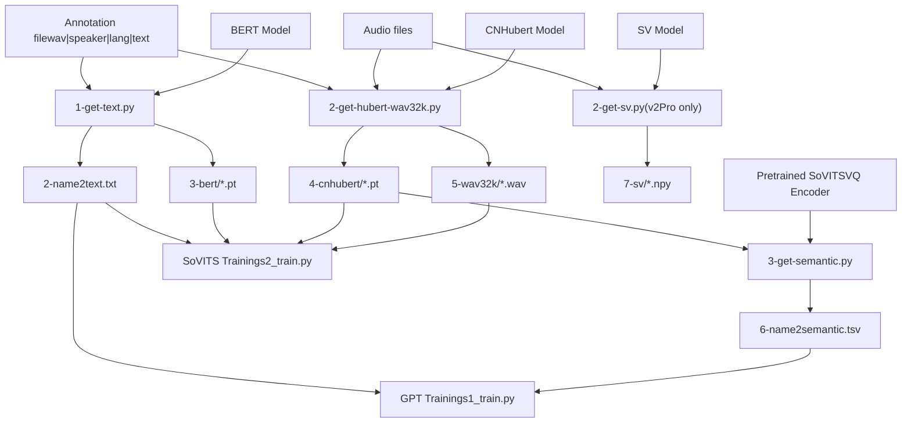
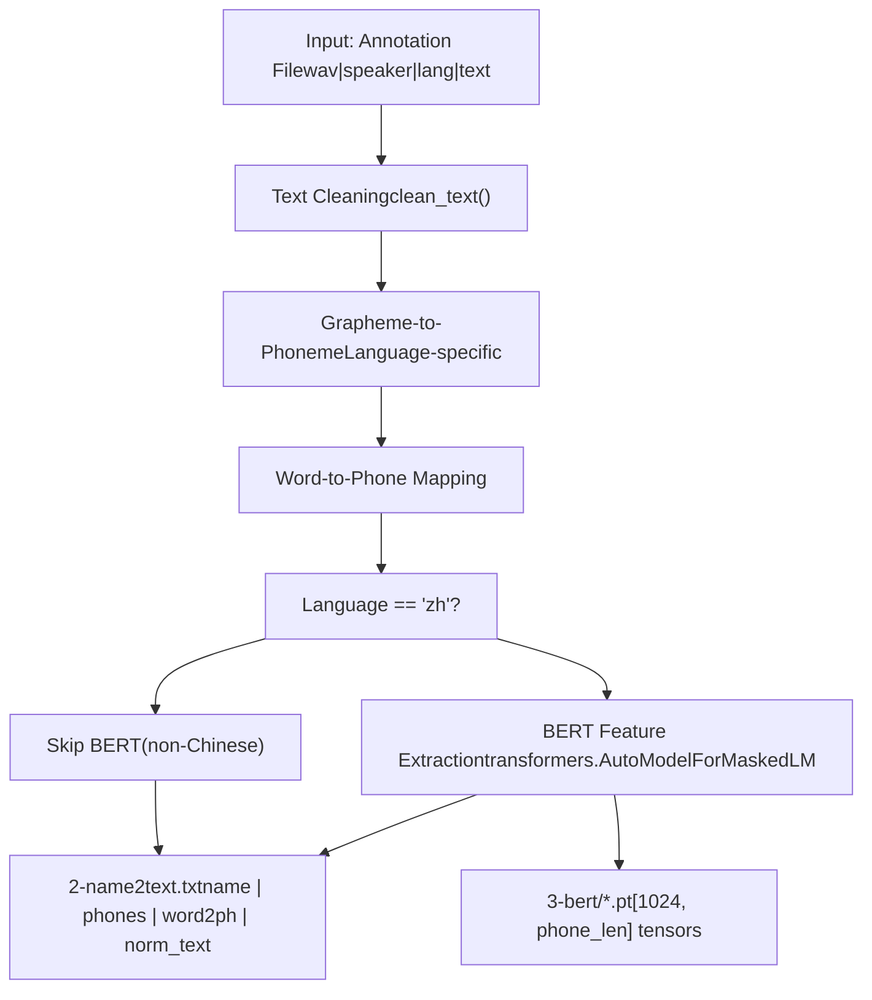
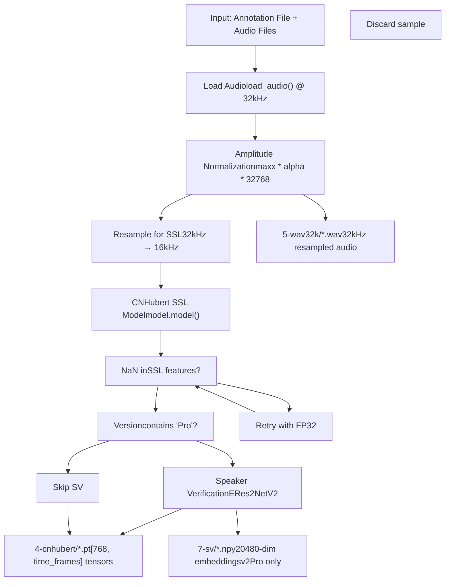
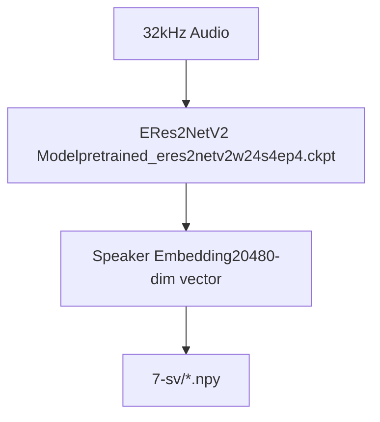
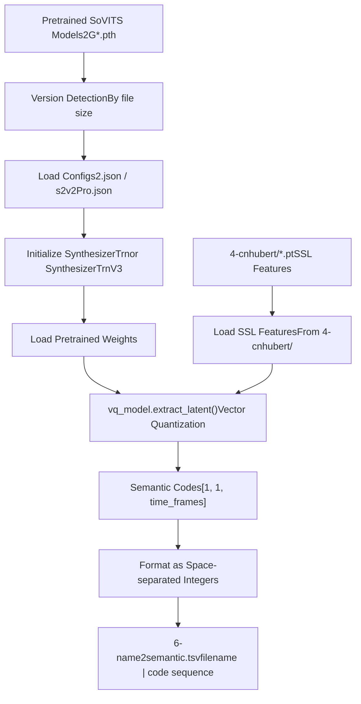
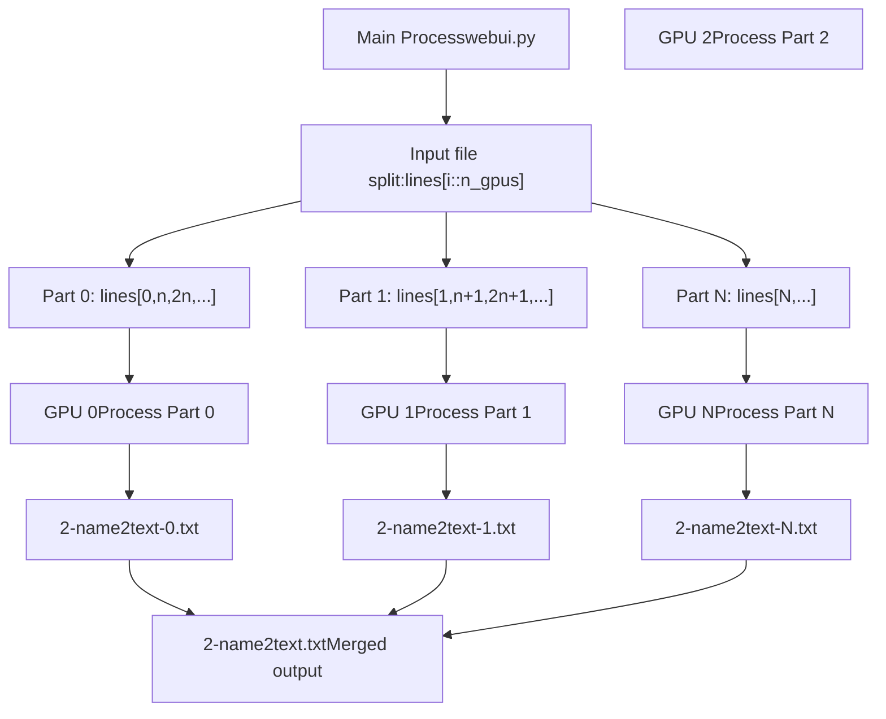
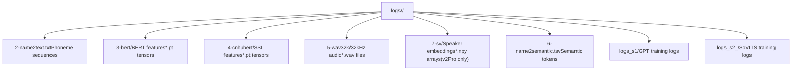
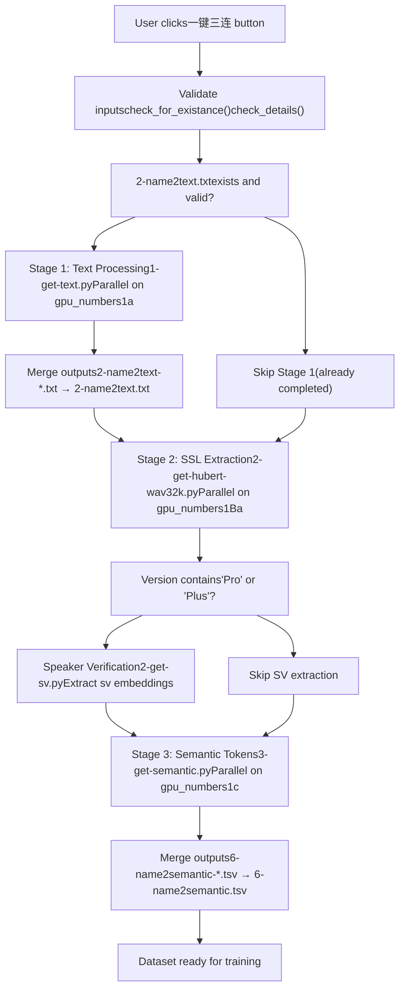
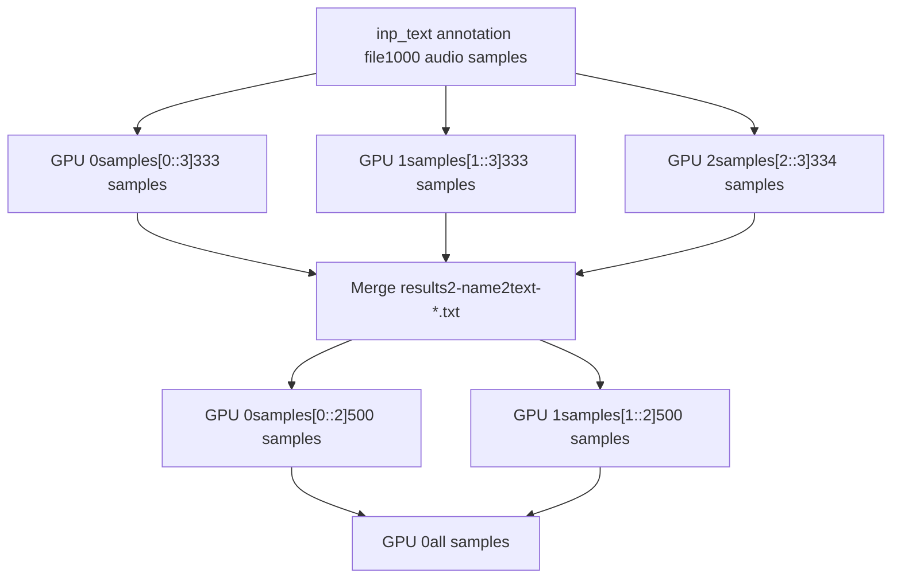
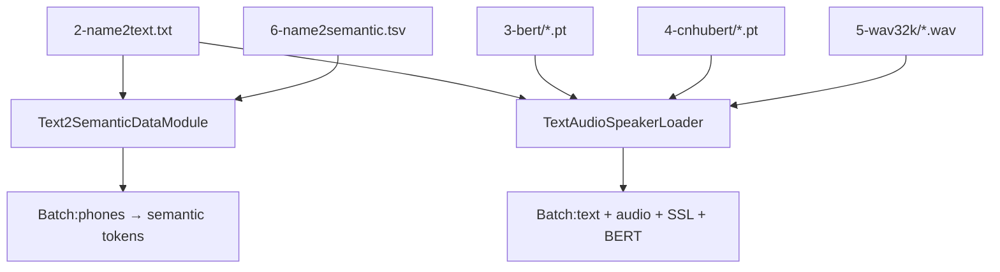

# Dataset Format and Structure

Relevant source files

-   [GPT\_SoVITS/prepare\_datasets/1-get-text.py](https://github.com/RVC-Boss/GPT-SoVITS/blob/c767f0b8/GPT_SoVITS/prepare_datasets/1-get-text.py)
-   [GPT\_SoVITS/prepare\_datasets/2-get-hubert-wav32k.py](https://github.com/RVC-Boss/GPT-SoVITS/blob/c767f0b8/GPT_SoVITS/prepare_datasets/2-get-hubert-wav32k.py)
-   [GPT\_SoVITS/prepare\_datasets/3-get-semantic.py](https://github.com/RVC-Boss/GPT-SoVITS/blob/c767f0b8/GPT_SoVITS/prepare_datasets/3-get-semantic.py)
-   [GPT\_SoVITS/s1\_train.py](https://github.com/RVC-Boss/GPT-SoVITS/blob/c767f0b8/GPT_SoVITS/s1_train.py)
-   [README.md](https://github.com/RVC-Boss/GPT-SoVITS/blob/c767f0b8/README.md?plain=1)
-   [docs/cn/README.md](https://github.com/RVC-Boss/GPT-SoVITS/blob/c767f0b8/docs/cn/README.md?plain=1)
-   [docs/ja/README.md](https://github.com/RVC-Boss/GPT-SoVITS/blob/c767f0b8/docs/ja/README.md?plain=1)
-   [docs/ko/README.md](https://github.com/RVC-Boss/GPT-SoVITS/blob/c767f0b8/docs/ko/README.md?plain=1)
-   [docs/tr/README.md](https://github.com/RVC-Boss/GPT-SoVITS/blob/c767f0b8/docs/tr/README.md?plain=1)
-   [install.ps1](https://github.com/RVC-Boss/GPT-SoVITS/blob/c767f0b8/install.ps1)
-   [install.sh](https://github.com/RVC-Boss/GPT-SoVITS/blob/c767f0b8/install.sh)
-   [requirements.txt](https://github.com/RVC-Boss/GPT-SoVITS/blob/c767f0b8/requirements.txt)

## Overview

This document describes the expected dataset structure for GPT-SoVITS training, the file naming conventions used throughout the codebase, and the one-click preparation workflow available in the WebUI. A properly prepared dataset follows a standardized directory structure under `logs/<exp_name>/` with numbered subdirectories containing different types of preprocessed features.

The dataset preparation process transforms raw audio files and text transcriptions into a structured format through three sequential feature extraction stages. The WebUI provides a one-click workflow that handles all stages automatically, ensuring consistency and simplifying dataset preparation for users.

For information about the initial audio preprocessing steps (vocal separation, slicing, ASR transcription), see [Audio Preprocessing Tools](/RVC-Boss/GPT-SoVITS/5.1-audio-preprocessing-tools). For details about the feature extraction scripts, see [Feature Extraction Scripts](/RVC-Boss/GPT-SoVITS/5.3-feature-extraction-scripts). For the actual model training process, see [GPT Model Training](/RVC-Boss/GPT-SoVITS/6.2-gpt-model-training) and [SoVITS Model Training](/RVC-Boss/GPT-SoVITS/6.3-sovits-model-training).

## Input Data Format

The dataset preparation workflow requires a properly formatted input annotation file following this structure:

**Format**: `wav_path|speaker_name|language|transcription_text`

**Example**:

```
output/slicer_opt/vocal_0001.wav|speaker1|zh|这是一段中文文本。
output/slicer_opt/vocal_0002.wav|speaker1|en|This is English text.
output/slicer_opt/vocal_0003.wav|speaker1|ja|これは日本語のテキストです。
```
**Requirements**:

-   **Audio files**: WAV format, sampling rate will be resampled to 32kHz internally
-   **Language codes**: `zh` (Chinese), `en` (English), `ja` (Japanese), `ko` (Korean), `yue` (Cantonese)
-   **Text**: Clean transcriptions matching the audio content, special characters `%` and `￥` will be normalized
-   **File organization**: All audio files should be accessible from the paths specified in the annotation file

Sources: [GPT\_SoVITS/prepare\_datasets/1-get-text.py127-136](https://github.com/RVC-Boss/GPT-SoVITS/blob/c767f0b8/GPT_SoVITS/prepare_datasets/1-get-text.py#L127-L136) [GPT\_SoVITS/prepare\_datasets/2-get-hubert-wav32k.py108-123](https://github.com/RVC-Boss/GPT-SoVITS/blob/c767f0b8/GPT_SoVITS/prepare_datasets/2-get-hubert-wav32k.py#L108-L123)

## Manual Stage Execution

For advanced users or debugging purposes, each stage can be executed independently. This is useful when:

-   Reprocessing only specific stages after fixing data issues
-   Testing different configurations for individual stages
-   Debugging feature extraction problems

### Stage 1: Text Processing

**Script**: `GPT_SoVITS/prepare_datasets/1-get-text.py`
**WebUI Function**: `open1a()`
**Location**: Tab `1Aa-数据集格式处理` → Button `中文批量一键处理` (or language-specific button)

**Purpose**: Convert text to phonemes and extract BERT features (Chinese only)

**Outputs**:

-   `2-name2text-*.txt` (temporary, one per GPU)
-   `2-name2text.txt` (merged final output)
-   `3-bert/*.pt` (BERT features, Chinese only)

**Dependencies**:

-   Input: Annotation file (`inp_text`)
-   Models: BERT model at `bert_pretrained_dir`

Sources: [webui.py780-846](https://github.com/RVC-Boss/GPT-SoVITS/blob/c767f0b8/webui.py#L780-L846) [GPT\_SoVITS/prepare\_datasets/1-get-text.py1-144](https://github.com/RVC-Boss/GPT-SoVITS/blob/c767f0b8/GPT_SoVITS/prepare_datasets/1-get-text.py#L1-L144)

### Stage 2: SSL Feature Extraction

**Scripts**:

-   Main: `GPT_SoVITS/prepare_datasets/2-get-hubert-wav32k.py`
-   SV (v2Pro): `GPT_SoVITS/prepare_datasets/2-get-sv.py`

**WebUI Function**: `open1b()`
**Location**: Tab `1Aa-数据集格式处理` → Button `自动获取SSL特征和波形` (not exposed as standalone in default UI)

**Purpose**: Extract CNHubert features, resample audio, optionally extract speaker verification embeddings

**Outputs**:

-   `4-cnhubert/*.pt` (SSL features)
-   `5-wav32k/*.wav` (resampled audio)
-   `7-sv/*.npy` (speaker verification, v2Pro/v2ProPlus only)

**Dependencies**:

-   Input: Annotation file, audio files
-   Models: CNHubert at `ssl_pretrained_dir`, optionally SV model

Sources: [webui.py870-937](https://github.com/RVC-Boss/GPT-SoVITS/blob/c767f0b8/webui.py#L870-L937) [GPT\_SoVITS/prepare\_datasets/2-get-hubert-wav32k.py1-135](https://github.com/RVC-Boss/GPT-SoVITS/blob/c767f0b8/GPT_SoVITS/prepare_datasets/2-get-hubert-wav32k.py#L1-L135)

### Stage 3: Semantic Token Extraction

**Script**: `GPT_SoVITS/prepare_datasets/3-get-semantic.py`
**WebUI Function**: `open1c()`
**Location**: Tab `1Aa-数据集格式处理` → Button `自动获取语义token` (not exposed as standalone in default UI)

**Purpose**: Extract semantic tokens (VQ codes) from SSL features using pretrained SoVITS VQ encoder

**Outputs**:

-   `6-name2semantic-*.tsv` (temporary, one per GPU)
-   `6-name2semantic.tsv` (merged final output)

**Dependencies**:

-   Input: `4-cnhubert/*.pt` (from Stage 2)
-   Models: Pretrained SoVITS at `pretrained_s2G_path`

Sources: [webui.py960-1023](https://github.com/RVC-Boss/GPT-SoVITS/blob/c767f0b8/webui.py#L960-L1023) [GPT\_SoVITS/prepare\_datasets/3-get-semantic.py1-119](https://github.com/RVC-Boss/GPT-SoVITS/blob/c767f0b8/GPT_SoVITS/prepare_datasets/3-get-semantic.py#L1-L119)

### Dependency Graph

**Stage Dependencies**:


Sources: [webui.py1046-1130](https://github.com/RVC-Boss/GPT-SoVITS/blob/c767f0b8/webui.py#L1046-L1130)

## Stage 1: Text Processing and BERT Feature Extraction

### Overview

Stage 1 (`1-get-text.py`) processes text transcriptions into phoneme sequences and extracts BERT contextual embeddings for Chinese text. This stage handles text normalization, phoneme conversion, and linguistic feature extraction.


### Key Functions

| Function | Purpose | Location |
| --- | --- | --- |
| `open1a()` | Orchestrates parallel execution across GPUs | [webui.py780-846](https://github.com/RVC-Boss/GPT-SoVITS/blob/c767f0b8/webui.py#L780-L846) |
| `process()` | Processes each text sample | [GPT\_SoVITS/prepare\_datasets/1-get-text.py86-103](https://github.com/RVC-Boss/GPT-SoVITS/blob/c767f0b8/GPT_SoVITS/prepare_datasets/1-get-text.py#L86-L103) |
| `get_bert_feature()` | Extracts BERT embeddings using word2ph mapping | [GPT\_SoVITS/prepare\_datasets/1-get-text.py68-84](https://github.com/RVC-Boss/GPT-SoVITS/blob/c767f0b8/GPT_SoVITS/prepare_datasets/1-get-text.py#L68-L84) |
| `clean_text()` | Language-specific text normalization and G2P | [text/cleaner.py](https://github.com/RVC-Boss/GPT-SoVITS/blob/c767f0b8/text/cleaner.py) |

### Execution

The stage is invoked through the WebUI or can be run independently:

```
# Environment configuration in webui.pyconfig = {    "inp_text": inp_text,           # Path to annotation file    "inp_wav_dir": inp_wav_dir,     # Audio directory    "exp_name": exp_name,           # Experiment name    "opt_dir": opt_dir,             # Output directory    "bert_pretrained_dir": bert_pretrained_dir,  # BERT model path    "i_part": str(i_part),          # Current part index (for parallelization)    "all_parts": str(all_parts),    # Total parts    "_CUDA_VISIBLE_DEVICES": gpu_id,    "is_half": str(is_half),}
```
Sources: [webui.py788-807](https://github.com/RVC-Boss/GPT-SoVITS/blob/c767f0b8/webui.py#L788-L807) [GPT\_SoVITS/prepare\_datasets/1-get-text.py5-13](https://github.com/RVC-Boss/GPT-SoVITS/blob/c767f0b8/GPT_SoVITS/prepare_datasets/1-get-text.py#L5-L13)

### Output Files

1.  **`2-name2text.txt`**: Tab-separated file containing processed text data

    -   Format: `filename\tphones\tword2ph\tnorm_text`
    -   Phones: Space-separated phoneme IDs
    -   word2ph: List indicating phoneme count per word
    -   norm\_text: Normalized text after cleaning
2.  **`3-bert/*.pt`**: PyTorch tensors containing BERT features (Chinese only)

    -   Shape: `[1024, num_phonemes]`
    -   Extracted from the second-to-last hidden layer of BERT
    -   Each phoneme gets repeated features based on word2ph mapping

Sources: [GPT\_SoVITS/prepare\_datasets/1-get-text.py139-143](https://github.com/RVC-Boss/GPT-SoVITS/blob/c767f0b8/GPT_SoVITS/prepare_datasets/1-get-text.py#L139-L143) [GPT\_SoVITS/prepare\_datasets/1-get-text.py93-101](https://github.com/RVC-Boss/GPT-SoVITS/blob/c767f0b8/GPT_SoVITS/prepare_datasets/1-get-text.py#L93-L101)

### Language Support and Version Compatibility

The text processing supports multiple languages with version-specific handling:

| Language | BERT Features | G2P System | Notes |
| --- | --- | --- | --- |
| Chinese (`zh`) | ✓ Yes | G2PW (polyphone disambiguation) | Full support with BERT embeddings |
| English (`en`) | ✗ No | g2p\_en | Zero BERT features during training |
| Japanese (`ja`) | ✗ No | pyopenjtalk | Zero BERT features during training |
| Korean (`ko`) | ✗ No | g2pk | Zero BERT features during training |
| Cantonese (`yue`) | ✗ No | Custom | Zero BERT features during training |

**Version Compatibility**: The `version` parameter is passed to `clean_text()` to ensure phoneme vocabulary compatibility with the target model version (v1/v2/v3/v4).

Sources: [GPT\_SoVITS/prepare\_datasets/1-get-text.py110-126](https://github.com/RVC-Boss/GPT-SoVITS/blob/c767f0b8/GPT_SoVITS/prepare_datasets/1-get-text.py#L110-L126) [GPT\_SoVITS/prepare\_datasets/1-get-text.py92](https://github.com/RVC-Boss/GPT-SoVITS/blob/c767f0b8/GPT_SoVITS/prepare_datasets/1-get-text.py#L92-L92)

## Stage 2: SSL Feature Extraction and Audio Resampling

### Overview

Stage 2 (`2-get-hubert-wav32k.py`) extracts self-supervised learning (SSL) features using the CNHubert model and resamples audio to 32kHz. For v2Pro/v2ProPlus versions, this stage also extracts speaker verification embeddings via a separate script (`2-get-sv.py`).


### Key Components

| Component | Purpose | Details |
| --- | --- | --- |
| `cnhubert.get_model()` | Loads CNHubert SSL model | 768-dimensional features at ~50Hz frame rate |
| `load_audio()` | Audio loading utility | Handles multiple formats, resamples to target rate |
| `open1b()` | Orchestration function | Manages parallel GPU execution |
| NaN detection | Quality control | Retries with FP32 if FP16 produces NaN values |

Sources: [GPT\_SoVITS/prepare\_datasets/2-get-hubert-wav32k.py68-73](https://github.com/RVC-Boss/GPT-SoVITS/blob/c767f0b8/GPT_SoVITS/prepare_datasets/2-get-hubert-wav32k.py#L68-L73) [GPT\_SoVITS/prepare\_datasets/2-get-hubert-wav32k.py78-106](https://github.com/RVC-Boss/GPT-SoVITS/blob/c767f0b8/GPT_SoVITS/prepare_datasets/2-get-hubert-wav32k.py#L78-L106)

### Audio Processing Pipeline

The audio processing involves careful normalization to ensure consistent feature extraction:

```
# Audio normalization strategy (from 2-get-hubert-wav32k.py:82-88)maxx = 0.95alpha = 0.5 # Two normalized versions are created:# 1. For 32kHz output file:tmp_audio32 = (audio / tmp_max * (maxx * alpha * 32768)) + ((1 - alpha) * 32768) * audio # 2. For SSL feature extraction (different scaling factor):tmp_audio32b = (audio / tmp_max * (maxx * alpha * 1145.14)) + ((1 - alpha) * 1145.14) * audio
```
This dual normalization ensures both high-quality 32kHz audio output and optimal SSL feature extraction.

Sources: [GPT\_SoVITS/prepare\_datasets/2-get-hubert-wav32k.py60-89](https://github.com/RVC-Boss/GPT-SoVITS/blob/c767f0b8/GPT_SoVITS/prepare_datasets/2-get-hubert-wav32k.py#L60-L89)

### Speaker Verification (v2Pro/v2ProPlus Only)

For v2Pro and v2ProPlus versions, an additional speaker verification extraction step runs after SSL extraction:


The speaker verification embeddings provide additional conditioning information for improved voice similarity during inference.

Sources: [webui.py910-926](https://github.com/RVC-Boss/GPT-SoVITS/blob/c767f0b8/webui.py#L910-L926) [webui.py865](https://github.com/RVC-Boss/GPT-SoVITS/blob/c767f0b8/webui.py#L865-L865)

### Output Files

1.  **`4-cnhubert/*.pt`**: SSL feature tensors

    -   Shape: `[768, time_frames]` where time\_frames ≈ audio\_duration \* 50
    -   PyTorch tensors containing contextualized audio representations
    -   Used for semantic token extraction in Stage 3
2.  **`5-wav32k/*.wav`**: Resampled audio files

    -   Sampling rate: 32kHz
    -   16-bit PCM format
    -   Used during SoVITS training
3.  **`7-sv/*.npy`** (v2Pro/v2ProPlus only): Speaker verification embeddings

    -   Shape: `[20480]`
    -   NumPy arrays containing speaker-discriminative features
    -   Used during v2Pro/v2ProPlus inference for better speaker conditioning

Sources: [GPT\_SoVITS/prepare\_datasets/2-get-hubert-wav32k.py54-58](https://github.com/RVC-Boss/GPT-SoVITS/blob/c767f0b8/GPT_SoVITS/prepare_datasets/2-get-hubert-wav32k.py#L54-L58) [GPT\_SoVITS/prepare\_datasets/2-get-hubert-wav32k.py100-105](https://github.com/RVC-Boss/GPT-SoVITS/blob/c767f0b8/GPT_SoVITS/prepare_datasets/2-get-hubert-wav32k.py#L100-L105)

### Error Handling

The script implements robust NaN detection and recovery:

```
# NaN detection and retry logic (from 2-get-hubert-wav32k.py:96-134)if np.isnan(ssl.detach().numpy()).sum() != 0:    nan_fails.append((wav_name, wav_path))    print("nan filtered:%s" % wav_name)    return # After processing all files, retry NaN failures with FP32if len(nan_fails) > 0 and is_half == True:    is_half = False    model = model.float()    for wav in nan_fails:        name2go(wav[0], wav[1])
```
This ensures maximum data utilization while maintaining feature quality.

Sources: [GPT\_SoVITS/prepare\_datasets/2-get-hubert-wav32k.py75-134](https://github.com/RVC-Boss/GPT-SoVITS/blob/c767f0b8/GPT_SoVITS/prepare_datasets/2-get-hubert-wav32k.py#L75-L134)

## Stage 3: Semantic Token Extraction

### Overview

Stage 3 (`3-get-semantic.py`) uses a pretrained SoVITS model to extract semantic tokens (VQ codes) from the SSL features. These tokens represent discrete acoustic units that bridge the gap between text and audio in the GPT model.


### Version Detection

The script automatically detects the SoVITS model version based on file size to ensure compatibility:

| File Size Range | Detected Version | Model Class |
| --- | --- | --- |
| < 82978 KB | v1 | SynthesizerTrn |
| 82978 KB - 100 MB | v2 | SynthesizerTrn |
| 100 MB - 103520 KB | v1 | SynthesizerTrn |
| 103520 KB - 700 MB | v2 | SynthesizerTrn |
| \> 700 MB | v3 | SynthesizerTrnV3 |

**Note**: v4 models use the same extraction logic as v3.

Sources: [GPT\_SoVITS/prepare\_datasets/3-get-semantic.py18-28](https://github.com/RVC-Boss/GPT-SoVITS/blob/c767f0b8/GPT_SoVITS/prepare_datasets/3-get-semantic.py#L18-L28)

### Vector Quantization Process

The semantic token extraction uses the pretrained VQ encoder:

```
# Extraction process (from 3-get-semantic.py:89-100)def name2go(wav_name, lines):    hubert_path = "%s/%s.pt" % (hubert_dir, wav_name)    ssl_content = torch.load(hubert_path, map_location="cpu")    ssl_content = ssl_content.half().to(device)  # or float()        # Extract VQ codes from SSL features    codes = vq_model.extract_latent(ssl_content)        # Format: codes shape is [1, 1, time_frames]    semantic = " ".join([str(i) for i in codes[0, 0, :].tolist()])    lines.append("%s\t%s" % (wav_name, semantic))
```
The `extract_latent()` method performs vector quantization, mapping continuous SSL features to discrete codes from a learned codebook (typically 1024 codes).

Sources: [GPT\_SoVITS/prepare\_datasets/3-get-semantic.py89-100](https://github.com/RVC-Boss/GPT-SoVITS/blob/c767f0b8/GPT_SoVITS/prepare_datasets/3-get-semantic.py#L89-L100)

### Model Initialization

The script initializes the SoVITS model based on the detected version:

| Version | Config File | Model Class | Notes |
| --- | --- | --- | --- |
| v1/v2 | `GPT_SoVITS/configs/s2.json` | `SynthesizerTrn` | Standard VITS architecture |
| v2Pro | `GPT_SoVITS/configs/s2v2Pro.json` | `SynthesizerTrn` | With speaker verification |
| v2ProPlus | `GPT_SoVITS/configs/s2v2ProPlus.json` | `SynthesizerTrn` | Enhanced v2Pro |
| v3/v4 | `GPT_SoVITS/configs/s2.json` | `SynthesizerTrnV3` | CFM-based architecture |

Sources: [webui.py968-972](https://github.com/RVC-Boss/GPT-SoVITS/blob/c767f0b8/webui.py#L968-L972) [GPT\_SoVITS/prepare\_datasets/3-get-semantic.py40-43](https://github.com/RVC-Boss/GPT-SoVITS/blob/c767f0b8/GPT_SoVITS/prepare_datasets/3-get-semantic.py#L40-L43) [GPT\_SoVITS/prepare\_datasets/3-get-semantic.py68-75](https://github.com/RVC-Boss/GPT-SoVITS/blob/c767f0b8/GPT_SoVITS/prepare_datasets/3-get-semantic.py#L68-L75)

### Output Format

**`6-name2semantic.tsv`**: Tab-separated file containing semantic token sequences

```
item_name	semantic_audio
vocal_0001.wav	143 256 892 445 223 ... (space-separated integers)
vocal_0002.wav	892 445 667 123 456 ...
```
Each integer represents a discrete acoustic unit from the VQ codebook. These sequences are used by the GPT model during training to learn the text-to-semantic mapping.

Sources: [GPT\_SoVITS/prepare\_datasets/3-get-semantic.py103-111](https://github.com/RVC-Boss/GPT-SoVITS/blob/c767f0b8/GPT_SoVITS/prepare_datasets/3-get-semantic.py#L103-L111)

## Parallel Processing and GPU Distribution

All three feature extraction stages support parallel processing across multiple GPUs to accelerate dataset preparation for large datasets.

### Parallelization Strategy


### Implementation Details

The parallelization is implemented through environment variable configuration:

```
# GPU distribution logic (from webui.py:796-811)gpu_names = gpu_numbers.split("-")  # e.g., "0-1-2" for 3 GPUsall_parts = len(gpu_names) for i_part in range(all_parts):    config.update({        "i_part": str(i_part),           # Current part index        "all_parts": str(all_parts),     # Total parts        "_CUDA_VISIBLE_DEVICES": str(fix_gpu_number(gpu_names[i_part])),    })    os.environ.update(config)    cmd = f'"{python_exec}" -s GPT_SoVITS/prepare_datasets/1-get-text.py'    p = Popen(cmd, shell=True)    ps1a.append(p) # Wait for all processesfor p in ps1a:    p.wait()
```
Each subprocess processes a subset of the input file using Python's slice notation: `lines[int(i_part)::int(all_parts)]`

Sources: [webui.py796-819](https://github.com/RVC-Boss/GPT-SoVITS/blob/c767f0b8/webui.py#L796-L819) [GPT\_SoVITS/prepare\_datasets/1-get-text.py127](https://github.com/RVC-Boss/GPT-SoVITS/blob/c767f0b8/GPT_SoVITS/prepare_datasets/1-get-text.py#L127-L127) [GPT\_SoVITS/prepare\_datasets/2-get-hubert-wav32k.py111](https://github.com/RVC-Boss/GPT-SoVITS/blob/c767f0b8/GPT_SoVITS/prepare_datasets/2-get-hubert-wav32k.py#L111-L111)

### Output Merging

After parallel processing completes, temporary output files are merged:

```
# Merge logic for Stage 1 (from webui.py:819-827)opt = []for i_part in range(all_parts):    txt_path = "%s/2-name2text-%s.txt" % (opt_dir, i_part)    with open(txt_path, "r", encoding="utf8") as f:        opt += f.read().strip("\n").split("\n")    os.remove(txt_path)  # Clean up temporary file path_text = "%s/2-name2text.txt" % opt_dirwith open(path_text, "w", encoding="utf8") as f:    f.write("\n".join(opt) + "\n")
```
Similar merging logic is applied for Stage 3 semantic tokens.

Sources: [webui.py819-827](https://github.com/RVC-Boss/GPT-SoVITS/blob/c767f0b8/webui.py#L819-L827) [webui.py1003-1011](https://github.com/RVC-Boss/GPT-SoVITS/blob/c767f0b8/webui.py#L1003-L1011)

### Performance Considerations

| Factor | Impact | Recommendation |
| --- | --- | --- |
| Number of GPUs | Linear speedup (near-ideal) | Use all available GPUs |
| Batch distribution | Automatic via slice indexing | No manual configuration needed |
| Memory usage | ~4-8GB per GPU for FP16 | Monitor with `nvidia-smi` |
| I/O bottleneck | Can limit speedup with many GPUs | Use SSD storage |

Sources: [webui.py780-846](https://github.com/RVC-Boss/GPT-SoVITS/blob/c767f0b8/webui.py#L780-L846) [webui.py870-937](https://github.com/RVC-Boss/GPT-SoVITS/blob/c767f0b8/webui.py#L870-L937) [webui.py960-1023](https://github.com/RVC-Boss/GPT-SoVITS/blob/c767f0b8/webui.py#L960-L1023)

## Dataset Directory Structure

A complete GPT-SoVITS dataset follows a standardized directory structure under `logs/<exp_name>/`. The numbered prefixes (2-, 3-, 4-, etc.) indicate the processing order and dependencies between different feature extraction stages.

**Complete Directory Structure**:

```
logs/<exp_name>/
├── 2-name2text.txt          # Phoneme sequences and text normalization
├── 3-bert/                  # BERT contextual embeddings (Chinese only)
│   ├── audio_001.wav.pt
│   ├── audio_002.wav.pt
│   └── ...
├── 4-cnhubert/              # CNHubert SSL features
│   ├── audio_001.wav.pt
│   ├── audio_002.wav.pt
│   └── ...
├── 5-wav32k/                # Resampled audio at 32kHz
│   ├── audio_001.wav
│   ├── audio_002.wav
│   └── ...
├── 6-name2semantic.tsv      # Semantic token sequences (VQ codes)
├── 7-sv/                    # Speaker verification embeddings (v2Pro/v2ProPlus only)
│   ├── audio_001.wav.npy
│   ├── audio_002.wav.npy
│   └── ...
├── logs_s1/                 # Created during GPT training (optional)
│   └── ...
└── logs_s2_<version>/       # Created during SoVITS training (optional)
    └── ...
```
**Directory Structure Diagram**:


Sources: [GPT\_SoVITS/prepare\_datasets/1-get-text.py46-50](https://github.com/RVC-Boss/GPT-SoVITS/blob/c767f0b8/GPT_SoVITS/prepare_datasets/1-get-text.py#L46-L50) [GPT\_SoVITS/prepare\_datasets/2-get-hubert-wav32k.py54-58](https://github.com/RVC-Boss/GPT-SoVITS/blob/c767f0b8/GPT_SoVITS/prepare_datasets/2-get-hubert-wav32k.py#L54-L58) [GPT\_SoVITS/prepare\_datasets/3-get-semantic.py57-58](https://github.com/RVC-Boss/GPT-SoVITS/blob/c767f0b8/GPT_SoVITS/prepare_datasets/3-get-semantic.py#L57-L58) [webui.py533-534](https://github.com/RVC-Boss/GPT-SoVITS/blob/c767f0b8/webui.py#L533-L534) [webui.py625-626](https://github.com/RVC-Boss/GPT-SoVITS/blob/c767f0b8/webui.py#L625-L626)

## File Naming Conventions

The dataset uses a consistent naming scheme across all directories to maintain file correspondence:

### Base Filename Preservation

All feature files use the same base filename as the original audio file, with appropriate extensions:

```
Original: output/slicer_opt/vocal_segment_001.wav

↓ Processing stages ↓

3-bert/vocal_segment_001.wav.pt        # BERT features
4-cnhubert/vocal_segment_001.wav.pt    # SSL features
5-wav32k/vocal_segment_001.wav         # Resampled audio
7-sv/vocal_segment_001.wav.npy         # Speaker verification (v2Pro)
```
This naming convention ensures that features for the same audio sample can be easily matched across directories.

### Text File Formats

The two text files use different naming patterns:

| File | Naming Pattern | Example Entry |
| --- | --- | --- |
| `2-name2text.txt` | One entry per line | `vocal_001.wav\tph1 ph2 ph3\t[1,2,1]\tNormalized text` |
| `6-name2semantic.tsv` | One entry per line | `vocal_001.wav\t143 256 892 445 223 ...` |

Both use the base filename (without path) as the identifier.

### Temporary Files During Parallel Processing

During parallel processing, temporary files are created with part numbers:

```
2-name2text-0.txt    # GPU 0 processing results
2-name2text-1.txt    # GPU 1 processing results
2-name2text-2.txt    # GPU 2 processing results

↓ Merged into ↓

2-name2text.txt      # Final combined output
```
These temporary files are automatically deleted after merging.

Sources: [GPT\_SoVITS/prepare\_datasets/1-get-text.py89-91](https://github.com/RVC-Boss/GPT-SoVITS/blob/c767f0b8/GPT_SoVITS/prepare_datasets/1-get-text.py#L89-L91) [GPT\_SoVITS/prepare\_datasets/2-get-hubert-wav32k.py79-80](https://github.com/RVC-Boss/GPT-SoVITS/blob/c767f0b8/GPT_SoVITS/prepare_datasets/2-get-hubert-wav32k.py#L79-L80) [webui.py819-827](https://github.com/RVC-Boss/GPT-SoVITS/blob/c767f0b8/webui.py#L819-L827)

## File Format Specifications

### 2-name2text.txt

**Format**: Tab-separated values (TSV) text file
**Encoding**: UTF-8

**Structure**:

```
filename\tphones\tword2ph\tnorm_text
```
**Example**:

```
vocal_001.wav	sil p i3 n g sh eng1 k e3 ai4 sil	[1, 1, 1, 1, 1, 1, 1, 1, 1, 1, 1]	拼声可爱
vocal_002.wav	sil w uo3 ai4 w an2 y uan2 sh en2 sil	[1, 1, 1, 1, 1, 1, 1, 1, 1, 1]	我爱玩原神
```
**Field Descriptions**:

-   **filename**: Base filename of the audio file (without directory path)
-   **phones**: Space-separated phoneme sequence generated by language-specific G2P
-   **word2ph**: Python list indicating number of phonemes per word/character
-   **norm\_text**: Normalized text after cleaning (numbers → words, symbols → text)

**Character Normalization**: The text cleaner normalizes special characters:

-   `%` → `-` (hyphen)
-   `￥` → `,` (comma)

Sources: [GPT\_SoVITS/prepare\_datasets/1-get-text.py92](https://github.com/RVC-Boss/GPT-SoVITS/blob/c767f0b8/GPT_SoVITS/prepare_datasets/1-get-text.py#L92-L92) [GPT\_SoVITS/prepare\_datasets/1-get-text.py139-143](https://github.com/RVC-Boss/GPT-SoVITS/blob/c767f0b8/GPT_SoVITS/prepare_datasets/1-get-text.py#L139-L143)

### 3-bert/\*.pt (PyTorch Tensors)

**Format**: PyTorch serialized tensor files
**File Extension**: `.pt`

**Content**: BERT contextual embeddings for Chinese text

-   **Shape**: `[1024, num_phonemes]`
-   **Data Type**: `torch.FloatTensor` or `torch.HalfTensor` (depending on `is_half` setting)
-   **Source Layer**: Concatenation of 2nd and 3rd layers from the end of BERT model

**Language Restriction**: Only generated for Chinese (`zh`) text. Non-Chinese samples have no corresponding BERT file.

**Feature Alignment**: Features are aligned to phonemes using the `word2ph` mapping, where each character's BERT embedding is repeated according to its phoneme count.

Sources: [GPT\_SoVITS/prepare\_datasets/1-get-text.py68-84](https://github.com/RVC-Boss/GPT-SoVITS/blob/c767f0b8/GPT_SoVITS/prepare_datasets/1-get-text.py#L68-L84) [GPT\_SoVITS/prepare\_datasets/1-get-text.py93-98](https://github.com/RVC-Boss/GPT-SoVITS/blob/c767f0b8/GPT_SoVITS/prepare_datasets/1-get-text.py#L93-L98)

### 4-cnhubert/\*.pt (SSL Features)

**Format**: PyTorch serialized tensor files
**File Extension**: `.pt`

**Content**: Self-supervised learning features from CNHubert model

-   **Shape**: `[768, time_frames]` where `time_frames ≈ audio_duration_seconds * 50`
-   **Data Type**: `torch.FloatTensor` or `torch.HalfTensor`
-   **Frame Rate**: ~50Hz (50 frames per second of audio)

**Extraction Process**: Audio is resampled to 16kHz, then processed through CNHubert's transformer layers. The final hidden state is transposed to `[768, time]` format.

Sources: [GPT\_SoVITS/prepare\_datasets/2-get-hubert-wav32k.py95](https://github.com/RVC-Boss/GPT-SoVITS/blob/c767f0b8/GPT_SoVITS/prepare_datasets/2-get-hubert-wav32k.py#L95-L95) [GPT\_SoVITS/prepare\_datasets/2-get-hubert-wav32k.py105](https://github.com/RVC-Boss/GPT-SoVITS/blob/c767f0b8/GPT_SoVITS/prepare_datasets/2-get-hubert-wav32k.py#L105-L105)

### 5-wav32k/\*.wav (Audio Files)

**Format**: WAV audio files
**File Extension**: `.wav`

**Audio Specifications**:

-   **Sampling Rate**: 32000 Hz (32kHz)
-   **Bit Depth**: 16-bit signed integer PCM
-   **Channels**: Mono (1 channel)
-   **Normalization**: Amplitude normalized using `maxx * alpha * 32768` formula

**Purpose**: Standardized audio format for SoVITS training. All audio is resampled to exactly 32kHz regardless of original sampling rate.

Sources: [GPT\_SoVITS/prepare\_datasets/2-get-hubert-wav32k.py87-88](https://github.com/RVC-Boss/GPT-SoVITS/blob/c767f0b8/GPT_SoVITS/prepare_datasets/2-get-hubert-wav32k.py#L87-L88) [GPT\_SoVITS/prepare\_datasets/2-get-hubert-wav32k.py100-104](https://github.com/RVC-Boss/GPT-SoVITS/blob/c767f0b8/GPT_SoVITS/prepare_datasets/2-get-hubert-wav32k.py#L100-L104)

### 6-name2semantic.tsv

**Format**: Tab-separated values (TSV) text file
**Encoding**: UTF-8

**Structure**:

```
filename\tsemantic_codes
```
**Example**:

```
vocal_001.wav	143 256 892 445 223 778 334 556 891 223
vocal_002.wav	556 891 223 445 778 143 256 334 892 667
```
**Field Descriptions**:

-   **filename**: Base filename of the audio file
-   **semantic\_codes**: Space-separated integer codes (typically 0-1023) representing discrete acoustic units

**Code Source**: Generated by passing CNHubert features through the pretrained SoVITS VQ encoder (`extract_latent()` method).

Sources: [GPT\_SoVITS/prepare\_datasets/3-get-semantic.py99-100](https://github.com/RVC-Boss/GPT-SoVITS/blob/c767f0b8/GPT_SoVITS/prepare_datasets/3-get-semantic.py#L99-L100) [GPT\_SoVITS/prepare\_datasets/3-get-semantic.py117-118](https://github.com/RVC-Boss/GPT-SoVITS/blob/c767f0b8/GPT_SoVITS/prepare_datasets/3-get-semantic.py#L117-L118)

### 7-sv/\*.npy (Speaker Verification Embeddings)

**Format**: NumPy array files
**File Extension**: `.npy`
**Version Requirement**: v2Pro and v2ProPlus only

**Content**: Speaker verification embeddings from ERes2NetV2 model

-   **Shape**: `[20480]` (1D array)
-   **Data Type**: `numpy.float32` or `numpy.float16`
-   **Model**: `pretrained_eres2netv2w24s4ep4.ckpt`

**Purpose**: Provides speaker-discriminative features for improved voice similarity during v2Pro/v2ProPlus inference.

Sources: [webui.py910-926](https://github.com/RVC-Boss/GPT-SoVITS/blob/c767f0b8/webui.py#L910-L926) [webui.py865](https://github.com/RVC-Boss/GPT-SoVITS/blob/c767f0b8/webui.py#L865-L865)

### Storage Requirements

Approximate storage requirements for various dataset sizes:

| Dataset Size | Original Audio | Complete Dataset | Notes |
| --- | --- | --- | --- |
| 100 samples (1 min each) | ~960 MB | ~4.6 GB | Without v2Pro: ~4.2 GB |
| 1 hour (3600 × 1s clips) | ~576 MB | ~2.8 GB | Without v2Pro: ~2.5 GB |
| 10 hours | ~5.8 GB | ~28 GB | Typical small dataset |
| 100 hours | ~58 GB | ~280 GB | Production dataset |

**Component Breakdown** (per minute of audio):

-   Original audio: ~960 KB
-   32kHz resampled: ~1.9 MB
-   SSL features: ~900 KB
-   BERT features (Chinese): ~480 KB
-   SV embeddings (v2Pro): ~480 KB
-   Text files: Negligible

Sources: Based on file format specifications and typical compression ratios.

## One-Click Preparation Workflow

The WebUI provides a streamlined one-click workflow that executes all three feature extraction stages automatically with intelligent dependency handling and error recovery.

### Accessing the Workflow

**Location in WebUI**: Tab `1-GPT-SoVITS-TTS` → Section `1Aa-数据集格式处理` (Dataset Format Processing)

**Button**: `一键三连` (One-Click Triple Process)

### Workflow Overview

The `open1abc()` function orchestrates the complete preparation pipeline:

**Complete Workflow Diagram**:


Sources: [webui.py1046-1130](https://github.com/RVC-Boss/GPT-SoVITS/blob/c767f0b8/webui.py#L1046-L1130) [webui.py1068-1095](https://github.com/RVC-Boss/GPT-SoVITS/blob/c767f0b8/webui.py#L1068-L1095)

### Required Parameters

**Input Parameters** (configured in WebUI):

| Parameter | Purpose | Example | Location |
| --- | --- | --- | --- |
| `version` | Model version | `"v2"`, `"v3"`, `"v2Pro"`, `"v4"` | Dropdown selection |
| `exp_name` | Experiment name | `"my_character_voice"` | Text input |
| `inp_text` | Annotation file | `"output/slicer_opt/output.list"` | File path |
| `inp_wav_dir` | Audio directory | `"output/slicer_opt"` | Directory path |
| `gpu_numbers1a` | GPUs for text processing | `"0-1"` | GPU selection |
| `gpu_numbers1Ba` | GPUs for SSL extraction | `"0"` | GPU selection |
| `gpu_numbers1c` | GPUs for semantic extraction | `"0"` | GPU selection |
| `bert_pretrained_dir` | BERT model location | Auto-detected | Read-only |
| `ssl_pretrained_dir` | CNHubert model location | Auto-detected | Read-only |
| `pretrained_s2G_path` | Pretrained SoVITS path | Version-specific | Dropdown |

**Output Location**: All outputs are saved to `logs/<exp_name>/`

Sources: [webui.py1046-1057](https://github.com/RVC-Boss/GPT-SoVITS/blob/c767f0b8/webui.py#L1046-L1057) [webui.py776-779](https://github.com/RVC-Boss/GPT-SoVITS/blob/c767f0b8/webui.py#L776-L779)

### Smart Skip Logic

The workflow implements intelligent skip logic to avoid reprocessing completed stages:

**Stage 1 Skip Condition**:

```
# From webui.py:1068-1072path_text = "%s/2-name2text.txt" % opt_dirif os.path.exists(path_text) == False or (    os.path.exists(path_text) == True    and len(open(path_text, "r", encoding="utf8").read().strip("\n").split("\n")) < 2):    # Execute Stage 1else:    # Skip Stage 1, already completed
```
**Skip Conditions**:

1.  File `2-name2text.txt` exists
2.  File contains at least 2 lines (header + data)

This allows:

-   Resuming interrupted workflows
-   Reprocessing only failed stages
-   Incremental dataset updates

Sources: [webui.py1068-1095](https://github.com/RVC-Boss/GPT-SoVITS/blob/c767f0b8/webui.py#L1068-L1095)

### Progress Monitoring

**Real-time Status Updates**: The WebUI displays status through Gradio components:

| Status | Display | Meaning |
| --- | --- | --- |
| `running` | Green progress indicator | Stage currently executing |
| `finish` | Success message | Stage completed successfully |
| Error | Red error message | Stage failed (with error details) |

**Progress Information**:

-   Current stage being executed
-   GPU utilization per subprocess
-   Estimated time remaining (for large datasets)
-   File counts (processed/total)

Sources: [webui.py1096-1130](https://github.com/RVC-Boss/GPT-SoVITS/blob/c767f0b8/webui.py#L1096-L1130)

### Version-Specific Behavior

The workflow automatically adapts based on the selected model version:

| Version | Text Processing | SSL Extraction | SV Extraction | Semantic Extraction |
| --- | --- | --- | --- | --- |
| v1/v2 | Standard | Standard | No | v1/v2 VQ model |
| v3/v4 | Standard | Standard | No | v3 VQ model |
| v2Pro | Standard | Standard | **Yes** | v2Pro VQ model |
| v2ProPlus | Standard | Standard | **Yes** | v2ProPlus VQ model |

**Automatic Version Detection**: The system detects the model version from:

1.  Explicit `version` parameter
2.  Pretrained model file size (for semantic extraction)
3.  Model filename patterns

Sources: [webui.py1046-1057](https://github.com/RVC-Boss/GPT-SoVITS/blob/c767f0b8/webui.py#L1046-L1057) [webui.py910-926](https://github.com/RVC-Boss/GPT-SoVITS/blob/c767f0b8/webui.py#L910-L926) [GPT\_SoVITS/prepare\_datasets/3-get-semantic.py18-28](https://github.com/RVC-Boss/GPT-SoVITS/blob/c767f0b8/GPT_SoVITS/prepare_datasets/3-get-semantic.py#L18-L28)

### Parallel Processing

**GPU Distribution**: Each stage can utilize multiple GPUs for parallel processing:


**Work Distribution Strategy**:

-   Each GPU processes every Nth sample: `samples[gpu_id::total_gpus]`
-   No data duplication between GPUs
-   Near-linear speedup with additional GPUs

**Example GPU Configuration**:

-   **Small dataset (< 100 samples)**: Use single GPU for all stages
-   **Medium dataset (100-1000 samples)**: `gpu_numbers1a="0-1"`, `gpu_numbers1Ba="0"`, `gpu_numbers1c="0"`
-   **Large dataset (> 1000 samples)**: `gpu_numbers1a="0-1-2-3"`, `gpu_numbers1Ba="0-1"`, `gpu_numbers1c="0"`

Sources: [webui.py796-819](https://github.com/RVC-Boss/GPT-SoVITS/blob/c767f0b8/webui.py#L796-L819) [webui.py880-903](https://github.com/RVC-Boss/GPT-SoVITS/blob/c767f0b8/webui.py#L880-L903) [webui.py970-991](https://github.com/RVC-Boss/GPT-SoVITS/blob/c767f0b8/webui.py#L970-L991)

## Integration with Training

The prepared dataset is consumed by the training scripts in a specific format:

### GPT Model Training (s1\_train.py)

The GPT model requires:

```
# Configuration from webui.py:609-627data["train_semantic_path"] = "%s/6-name2semantic.tsv" % s1_dirdata["train_phoneme_path"] = "%s/2-name2text.txt" % s1_dir
```
The `Text2SemanticDataModule` loads these files to create training batches that map phoneme sequences to semantic token sequences.

Sources: [webui.py625-626](https://github.com/RVC-Boss/GPT-SoVITS/blob/c767f0b8/webui.py#L625-L626) [GPT\_SoVITS/s1\_train.py132-138](https://github.com/RVC-Boss/GPT-SoVITS/blob/c767f0b8/GPT_SoVITS/s1_train.py#L132-L138)

### SoVITS Model Training (s2\_train.py)

The SoVITS model requires:

```
# Configuration from webui.py:533-534data["data"]["exp_dir"] = data["s2_ckpt_dir"] = s2_dir
```
The training script expects the following files in `exp_dir`:

-   `2-name2text.txt` - For text encoder conditioning
-   `3-bert/*.pt` - BERT features (Chinese samples only)
-   `4-cnhubert/*.pt` - SSL features for VQ training
-   `5-wav32k/*.wav` - Target audio for reconstruction
-   `6-name2semantic.tsv` - Semantic tokens for conditioning

Sources: [webui.py515-536](https://github.com/RVC-Boss/GPT-SoVITS/blob/c767f0b8/webui.py#L515-L536)

### Data Loading Flow


### Dataset Validation

Before training begins, the WebUI performs validation checks:

```
# Validation function from my_utils.pycheck_for_existance([s1_dir], is_train=True)check_details([s1_dir], is_train=True)
```
This verifies that all required files exist and are properly formatted.

Sources: [webui.py517-518](https://github.com/RVC-Boss/GPT-SoVITS/blob/c767f0b8/webui.py#L517-L518) [webui.py611-612](https://github.com/RVC-Boss/GPT-SoVITS/blob/c767f0b8/webui.py#L611-L612) [tools/my\_utils.py](https://github.com/RVC-Boss/GPT-SoVITS/blob/c767f0b8/tools/my_utils.py)

## Best Practices and Troubleshooting

### Recommended Workflow

1.  **Start with small test dataset** (~50 samples) to verify the pipeline works correctly
2.  **Use parallel processing** for datasets larger than 100 samples
3.  **Monitor disk space** - ensure 3-4x the raw audio size is available
4.  **Check intermediate outputs** - verify each stage produces valid files before proceeding
5.  **Use one-click workflow** for production datasets to ensure consistency

### Common Issues

| Issue | Symptom | Solution |
| --- | --- | --- |
| NaN in SSL features | Stage 2 reports "nan filtered" | Automatic retry with FP32, check audio quality |
| Missing BERT files | No `.pt` files in `3-bert/` for Chinese | Expected for non-Chinese text; check language codes |
| Empty semantic file | `6-name2semantic.tsv` has only header | Verify `4-cnhubert/` exists and pretrained model loaded |
| Mismatched versions | Training fails with shape mismatch | Ensure same version used for extraction and training |
| Out of memory | CUDA OOM during extraction | Reduce parallel GPU count or use lower batch size |

### File Existence Checks

The codebase includes utility functions for validation:

```
# From tools/my_utils.pycheck_for_existance([inp_text, inp_wav_dir], is_dataset_processing=True)check_details([inp_text, inp_wav_dir], is_dataset_processing=True)
```
These functions verify:

-   Annotation file exists and is readable
-   Audio directory exists and contains files
-   File paths in annotation file are valid

Sources: [webui.py784-785](https://github.com/RVC-Boss/GPT-SoVITS/blob/c767f0b8/webui.py#L784-L785) [webui.py874-875](https://github.com/RVC-Boss/GPT-SoVITS/blob/c767f0b8/webui.py#L874-L875) [tools/my\_utils.py](https://github.com/RVC-Boss/GPT-SoVITS/blob/c767f0b8/tools/my_utils.py)

### Version-Specific Considerations

| Version | Special Requirements | Notes |
| --- | --- | --- |
| v1/v2 | Standard pipeline | No special handling |
| v3/v4 | Larger pretrained model (>700MB) | Longer Stage 3 processing time |
| v2Pro | Speaker verification extraction | Requires additional `2-get-sv.py` step |
| v2ProPlus | Same as v2Pro | Enhanced model architecture |

Sources: [GPT\_SoVITS/prepare\_datasets/3-get-semantic.py18-28](https://github.com/RVC-Boss/GPT-SoVITS/blob/c767f0b8/GPT_SoVITS/prepare_datasets/3-get-semantic.py#L18-L28) [webui.py910-926](https://github.com/RVC-Boss/GPT-SoVITS/blob/c767f0b8/webui.py#L910-L926)

---

**Summary**: The dataset preparation workflow transforms raw audio and text into a structured format required for GPT-SoVITS training through three sequential feature extraction stages. The pipeline supports parallel processing, automatic error recovery, and version-specific handling to ensure robust dataset preparation for all model variants.

Sources: [webui.py776-1130](https://github.com/RVC-Boss/GPT-SoVITS/blob/c767f0b8/webui.py#L776-L1130) [GPT\_SoVITS/prepare\_datasets/1-get-text.py](https://github.com/RVC-Boss/GPT-SoVITS/blob/c767f0b8/GPT_SoVITS/prepare_datasets/1-get-text.py) [GPT\_SoVITS/prepare\_datasets/2-get-hubert-wav32k.py](https://github.com/RVC-Boss/GPT-SoVITS/blob/c767f0b8/GPT_SoVITS/prepare_datasets/2-get-hubert-wav32k.py) [GPT\_SoVITS/prepare\_datasets/3-get-semantic.py](https://github.com/RVC-Boss/GPT-SoVITS/blob/c767f0b8/GPT_SoVITS/prepare_datasets/3-get-semantic.py)
