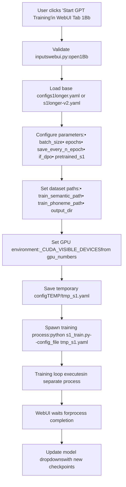
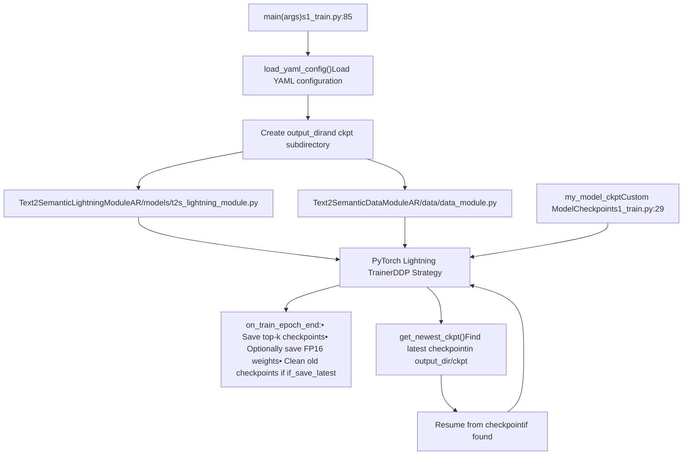
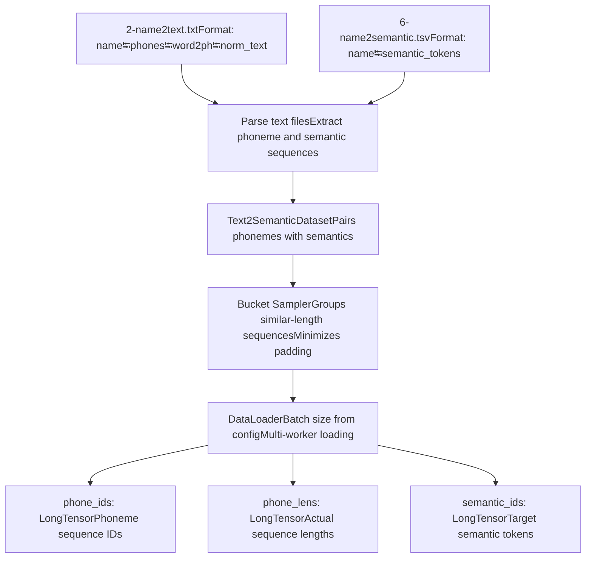
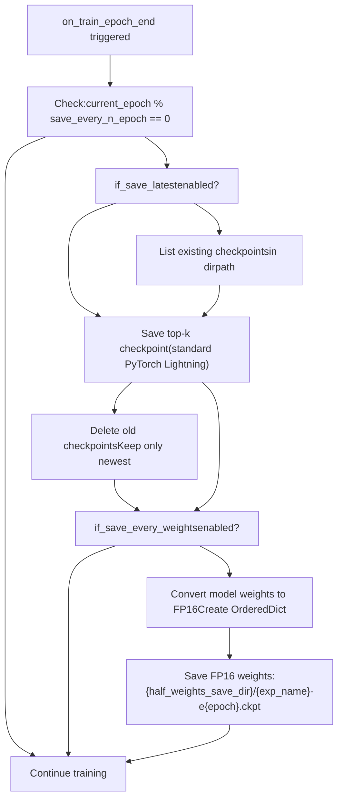

# GPT Model Training

Relevant source files

-   [GPT\_SoVITS/prepare\_datasets/1-get-text.py](https://github.com/RVC-Boss/GPT-SoVITS/blob/c767f0b8/GPT_SoVITS/prepare_datasets/1-get-text.py)
-   [GPT\_SoVITS/prepare\_datasets/2-get-hubert-wav32k.py](https://github.com/RVC-Boss/GPT-SoVITS/blob/c767f0b8/GPT_SoVITS/prepare_datasets/2-get-hubert-wav32k.py)
-   [GPT\_SoVITS/prepare\_datasets/3-get-semantic.py](https://github.com/RVC-Boss/GPT-SoVITS/blob/c767f0b8/GPT_SoVITS/prepare_datasets/3-get-semantic.py)
-   [GPT\_SoVITS/s1\_train.py](https://github.com/RVC-Boss/GPT-SoVITS/blob/c767f0b8/GPT_SoVITS/s1_train.py)
-   [api.py](https://github.com/RVC-Boss/GPT-SoVITS/blob/c767f0b8/api.py)
-   [config.py](https://github.com/RVC-Boss/GPT-SoVITS/blob/c767f0b8/config.py)
-   [webui.py](https://github.com/RVC-Boss/GPT-SoVITS/blob/c767f0b8/webui.py)

## Purpose and Scope

This page documents the training process for the GPT (Text2Semantic) model, which learns to convert phoneme sequences into semantic token sequences. The GPT model is the first stage of the two-stage TTS system and is trained using the script [GPT\_SoVITS/s1\_train.py](https://github.com/RVC-Boss/GPT-SoVITS/blob/c767f0b8/GPT_SoVITS/s1_train.py)

For information about preparing the training dataset (extracting BERT features, Hubert features, and semantic tokens), see [Dataset Format and Structure](/RVC-Boss/GPT-SoVITS/6.1-dataset-format-and-structure). For training the second-stage SoVITS acoustic model, see [SoVITS Model Training](/RVC-Boss/GPT-SoVITS/6.3-sovits-model-training).

The GPT model training process consumes:

-   **Input**: Phoneme sequences from `2-name2text.txt` and semantic token sequences from `6-name2semantic.tsv`
-   **Output**: Trained GPT checkpoint files (`.ckpt`) saved to version-specific weight directories

---

## Training Configuration Structure

GPT training is controlled by YAML configuration files located at [GPT\_SoVITS/configs/s1longer.yaml](https://github.com/RVC-Boss/GPT-SoVITS/blob/c767f0b8/GPT_SoVITS/configs/s1longer.yaml) (v1) and [GPT\_SoVITS/configs/s1longer-v2.yaml](https://github.com/RVC-Boss/GPT-SoVITS/blob/c767f0b8/GPT_SoVITS/configs/s1longer-v2.yaml) (v2+). The configuration is assembled by the WebUI function `open1Bb` in [webui.py590-675](https://github.com/RVC-Boss/GPT-SoVITS/blob/c767f0b8/webui.py#L590-L675)

### Configuration Parameters

| Parameter | Location | Description | Default/Range |
| --- | --- | --- | --- |
| `batch_size` | `train.batch_size` | Training batch size per GPU | Auto-calculated based on VRAM |
| `epochs` | `train.epochs` | Total training epochs | User-specified |
| `precision` | `train.precision` | Training precision ("32" or "16") | "16" if GPU supports FP16 |
| `save_every_n_epoch` | `train.save_every_n_epoch` | Checkpoint save frequency | User-specified |
| `if_save_latest` | `train.if_save_latest` | Only keep latest checkpoint | Boolean |
| `if_save_every_weights` | `train.if_save_every_weights` | Save FP16 weights each epoch | Boolean |
| `if_dpo` | `train.if_dpo` | Enable DPO loss for reducing repetitions | Boolean |
| `pretrained_s1` | Top-level | Path to pretrained GPT checkpoint | From `config.py` |
| `train_semantic_path` | Top-level | Path to `6-name2semantic.tsv` | `{exp_dir}/6-name2semantic.tsv` |
| `train_phoneme_path` | Top-level | Path to `2-name2text.txt` | `{exp_dir}/2-name2text.txt` |
| `output_dir` | Top-level | Training logs and checkpoints directory | `{exp_dir}/logs_s1_{version}` |
| `half_weights_save_dir` | `train.half_weights_save_dir` | Directory for FP16 weight saves | Version-specific GPT weights directory |
| `exp_name` | `train.exp_name` | Experiment name for checkpoint naming | User-specified |

Sources: [webui.py604-627](https://github.com/RVC-Boss/GPT-SoVITS/blob/c767f0b8/webui.py#L604-L627) [config.py68-75](https://github.com/RVC-Boss/GPT-SoVITS/blob/c767f0b8/config.py#L68-L75)

---

## WebUI Training Invocation Flow


**WebUI Training Launch Flow**

Sources: [webui.py590-675](https://github.com/RVC-Boss/GPT-SoVITS/blob/c767f0b8/webui.py#L590-L675)

---

## Training Script Architecture

The training process is implemented in [GPT\_SoVITS/s1\_train.py](https://github.com/RVC-Boss/GPT-SoVITS/blob/c767f0b8/GPT_SoVITS/s1_train.py) using PyTorch Lightning for distributed training support.

### Main Components


**Training Script Component Architecture**

Sources: [GPT\_SoVITS/s1\_train.py85-148](https://github.com/RVC-Boss/GPT-SoVITS/blob/c767f0b8/GPT_SoVITS/s1_train.py#L85-L148)

### Text2SemanticLightningModule

The GPT model is wrapped in a PyTorch Lightning module for simplified distributed training. Key responsibilities:

-   **Model initialization**: Creates the GPT transformer model
-   **Training step**: Computes cross-entropy loss on semantic token prediction
-   **Optional DPO loss**: Reduces repetition in generated sequences when `if_dpo=True`
-   **Optimizer configuration**: AdamW optimizer with learning rate scheduling
-   **Metric logging**: Tracks top-1, top-3, top-5 accuracy on semantic token prediction

The module loads pretrained weights from `pretrained_s1` if specified in the configuration.

Sources: [GPT\_SoVITS/s1\_train.py130](https://github.com/RVC-Boss/GPT-SoVITS/blob/c767f0b8/GPT_SoVITS/s1_train.py#L130-L130) [webui.py618](https://github.com/RVC-Boss/GPT-SoVITS/blob/c767f0b8/webui.py#L618-L618)

---

## Data Loading Pipeline

### Text2SemanticDataModule

The data module handles loading and batching of training data:


**Data Loading Architecture**

The dataset uses a custom bucket sampler to group sequences of similar lengths, reducing padding overhead and improving training efficiency. This is critical because:

-   Phoneme sequences vary from ~10 to 500+ tokens
-   Semantic sequences can be 50-1500+ tokens
-   Excessive padding wastes GPU memory and compute

Sources: [GPT\_SoVITS/s1\_train.py132-138](https://github.com/RVC-Boss/GPT-SoVITS/blob/c767f0b8/GPT_SoVITS/s1_train.py#L132-L138)

---

## Checkpoint Management

The custom `my_model_ckpt` class extends PyTorch Lightning's `ModelCheckpoint` to provide specialized checkpoint handling:

### Checkpoint Saving Behavior


**Checkpoint Saving Logic**

Sources: [GPT\_SoVITS/s1\_train.py46-82](https://github.com/RVC-Boss/GPT-SoVITS/blob/c767f0b8/GPT_SoVITS/s1_train.py#L46-L82)

### Checkpoint File Structure

GPT checkpoints are saved in two formats:

**1\. Full Training Checkpoint (for resuming)**

-   Location: `{output_dir}/ckpt/epoch={N}-step={M}.ckpt`
-   Contents: Full PyTorch Lightning state including optimizer, scheduler, epoch number
-   Precision: Matches training precision (FP16 or FP32)

**2\. Inference-Ready Checkpoint (optional)**

-   Location: `{half_weights_save_dir}/{exp_name}-e{epoch}.ckpt`
-   Created when `if_save_every_weights=True`
-   Structure:

    ```
    {    "weight": OrderedDict,  # FP16 model weights only    "config": dict,         # Full training config    "info": "GPT-e{epoch}"  # Metadata string}
    ```


The inference-ready format is used by the WebUI and API for model loading. It excludes optimizer states to reduce file size (~50% smaller).

Sources: [GPT\_SoVITS/s1\_train.py62-81](https://github.com/RVC-Boss/GPT-SoVITS/blob/c767f0b8/GPT_SoVITS/s1_train.py#L62-L81) [process\_ckpt.py26](https://github.com/RVC-Boss/GPT-SoVITS/blob/c767f0b8/process_ckpt.py#L26-L26)

---

## Multi-GPU Training with DDP

The training script supports distributed data parallel (DDP) training across multiple GPUs:

### DDP Configuration

The `Trainer` is configured with:

-   **Strategy**: `DDPStrategy` with backend selection:
    -   `nccl` on Linux (faster GPU communication)
    -   `gloo` on Windows (NCCL not supported)
-   **Devices**: `-1` (use all available GPUs) or specific GPU indices
-   **use\_distributed\_sampler**: `False` to use custom bucket sampler

GPU allocation is controlled by the `_CUDA_VISIBLE_DEVICES` environment variable set by the WebUI:

```
os.environ["_CUDA_VISIBLE_DEVICES"] = str(fix_gpu_numbers(gpu_numbers.replace("-", ",")))
```
Users specify GPU numbers in the WebUI using hyphen-separated indices (e.g., "0-1-2" for GPUs 0, 1, and 2).

Sources: [GPT\_SoVITS/s1\_train.py111-128](https://github.com/RVC-Boss/GPT-SoVITS/blob/c767f0b8/GPT_SoVITS/s1_train.py#L111-L128) [webui.py630](https://github.com/RVC-Boss/GPT-SoVITS/blob/c767f0b8/webui.py#L630-L630)

### Checkpoint Saving in DDP

In multi-GPU training, only rank 0 saves inference-ready checkpoints to avoid race conditions:

```
if os.environ.get("LOCAL_RANK", "0") == "0":    my_save(to_save_od, checkpoint_path)
```
This ensures a single consistent checkpoint is written even when multiple processes are training simultaneously.

Sources: [GPT\_SoVITS/s1\_train.py72](https://github.com/RVC-Boss/GPT-SoVITS/blob/c767f0b8/GPT_SoVITS/s1_train.py#L72-L72)

---

## DPO Loss for Repetition Reduction

The GPT model can optionally use Direct Preference Optimization (DPO) loss to reduce repetitive generation patterns. This is enabled by setting `if_dpo=True` in the training configuration.

### DPO Implementation

When enabled, DPO loss penalizes the model for generating repetitive semantic token sequences during training. The loss is computed alongside standard cross-entropy loss and helps the model learn to produce more diverse outputs.

This is particularly useful for:

-   Reducing stuttering in synthesized speech
-   Preventing the model from getting stuck in loops
-   Improving the naturalness of generated prosody

The DPO loss implementation is part of the `Text2SemanticLightningModule` training step.

Sources: [webui.py622](https://github.com/RVC-Boss/GPT-SoVITS/blob/c767f0b8/webui.py#L622-L622) [GPT\_SoVITS/s1\_train.py130](https://github.com/RVC-Boss/GPT-SoVITS/blob/c767f0b8/GPT_SoVITS/s1_train.py#L130-L130)

---

## Training Execution Methods

### Method 1: WebUI (Recommended)

The most common way to start GPT training is through the main WebUI:

1.  Navigate to the "GPT训练" (GPT Training) tab (1Bb)
2.  Configure parameters:
    -   **Batch Size**: Auto-calculated based on GPU VRAM (editable)
    -   **Total Epochs**: Number of training epochs
    -   **Experiment Name**: Name from dataset preparation
    -   **if\_dpo**: Enable DPO loss (checkbox)
    -   **Save Settings**: Latest only vs. every N epochs
    -   **GPU Selection**: Hyphen-separated GPU indices (e.g., "0-1")
    -   **Pretrained Model**: Select from dropdown
3.  Click the start button to launch training
4.  Monitor progress in the status indicator
5.  Stop training early using the stop button if needed

The WebUI handles:

-   Configuration file generation
-   Process spawning and monitoring
-   Checkpoint dropdown updates after training completes

Sources: [webui.py590-675](https://github.com/RVC-Boss/GPT-SoVITS/blob/c767f0b8/webui.py#L590-L675)

### Method 2: Direct Script Execution

For advanced users or automated pipelines:

```
python GPT_SoVITS/s1_train.py --config_file path/to/config.yaml
```
The YAML configuration file must contain all required parameters. This method is useful for:

-   Automated training pipelines
-   Custom training configurations
-   Integration with experiment tracking systems

Sources: [GPT\_SoVITS/s1\_train.py152-171](https://github.com/RVC-Boss/GPT-SoVITS/blob/c767f0b8/GPT_SoVITS/s1_train.py#L152-L171)

---

## Training Configuration Example

### Typical Configuration Structure

```
train:  batch_size: 12  epochs: 15  save_every_n_epoch: 5  if_save_latest: false  if_save_every_weights: true  if_dpo: true  precision: "16"  seed: 1234  half_weights_save_dir: "GPT_weights_v2"  exp_name: "my_speaker" pretrained_s1: "GPT_SoVITS/pretrained_models/gsv-v2final-pretrained/s1bert25hz-5kh-longer-epoch=12-step=369668.ckpt" train_semantic_path: "logs/my_speaker/6-name2semantic.tsv"train_phoneme_path: "logs/my_speaker/2-name2text.txt"output_dir: "logs/my_speaker/logs_s1_v2" data:  max_sec: 54  pad_val: 1024 model:  # Model architecture parameters  # (inherited from pretrained checkpoint)
```
Sources: [webui.py604-634](https://github.com/RVC-Boss/GPT-SoVITS/blob/c767f0b8/webui.py#L604-L634)

---

## Version-Specific Considerations

### Version Selection

The GPT model version is determined by the selected pretrained model:

| Version | Pretrained Checkpoint | Config File | Notes |
| --- | --- | --- | --- |
| v1 | `s1bert25hz-2kh-longer-epoch=68e-step=50232.ckpt` | `s1longer.yaml` | Legacy version |
| v2/v2Pro/v2ProPlus | `s1bert25hz-5kh-longer-epoch=12-step=369668.ckpt` | `s1longer-v2.yaml` | Current recommended version |
| v3 | `s1v3.ckpt` | `s1longer-v2.yaml` | Shares GPT with v2 |
| v4 | `s1v3.ckpt` | `s1longer-v2.yaml` | Shares GPT with v2 |

All recent versions (v2, v2Pro, v2ProPlus, v3, v4) use the same GPT architecture and pretrained weights. The differences are in the SoVITS model (second stage).

Sources: [config.py21-28](https://github.com/RVC-Boss/GPT-SoVITS/blob/c767f0b8/config.py#L21-L28) [webui.py605](https://github.com/RVC-Boss/GPT-SoVITS/blob/c767f0b8/webui.py#L605-L605)

---

## Monitoring Training Progress

### TensorBoard Logging

Training metrics are logged to TensorBoard:

```
tensorboard --logdir logs/{exp_name}/logs_s1_{version}
```
Logged metrics include:

-   **train/loss**: Total training loss (cross-entropy + optional DPO)
-   **train/top\_1\_acc**: Top-1 accuracy on semantic token prediction
-   **train/top\_3\_acc**: Top-3 accuracy (primary checkpoint metric)
-   **train/top\_5\_acc**: Top-5 accuracy
-   **train/learning\_rate**: Current learning rate

The checkpoint callback monitors `top_3_acc` in `max` mode, saving checkpoints when this metric improves.

Sources: [GPT\_SoVITS/s1\_train.py95-107](https://github.com/RVC-Boss/GPT-SoVITS/blob/c767f0b8/GPT_SoVITS/s1_train.py#L95-L107)

### Console Output

During training, the script outputs:

-   Current epoch and step numbers
-   Batch processing speed (batches/second)
-   Loss values
-   Accuracy metrics
-   Checkpoint save notifications

Sources: [GPT\_SoVITS/s1\_train.py111-147](https://github.com/RVC-Boss/GPT-SoVITS/blob/c767f0b8/GPT_SoVITS/s1_train.py#L111-L147)

---

## Troubleshooting Common Issues

### Out of Memory Errors

If training fails with CUDA OOM:

1.  Reduce `batch_size` in the configuration
2.  The WebUI auto-calculates batch size as `min(mem) // 2` for GPT training
3.  For manual training, start with batch\_size=4 and increase gradually
4.  Ensure no other processes are using GPU memory

### Training Not Resuming from Checkpoint

The script uses `get_newest_ckpt()` to find the latest checkpoint. Verify:

-   Checkpoints exist in `{output_dir}/ckpt/`
-   Checkpoint filenames follow pattern `epoch={N}-step={M}.ckpt`
-   No permission issues accessing the checkpoint directory

### Multi-GPU Training Hangs

Common causes:

-   Firewall blocking inter-GPU communication (check NCCL ports)
-   Mismatched CUDA versions across GPUs
-   Windows users should verify `gloo` backend is used (not `nccl`)
-   Ensure `MASTER_ADDR="localhost"` is set in environment

Sources: [GPT\_SoVITS/s1\_train.py109-122](https://github.com/RVC-Boss/GPT-SoVITS/blob/c767f0b8/GPT_SoVITS/s1_train.py#L109-L122) [GPT\_SoVITS/s1\_train.py140-147](https://github.com/RVC-Boss/GPT-SoVITS/blob/c767f0b8/GPT_SoVITS/s1_train.py#L140-L147)

---

## Integration with Inference Pipeline

After training completes:

1.  **Checkpoint Location**: Inference-ready checkpoints are saved to version-specific directories (e.g., `GPT_weights_v2/`)
2.  **Dropdown Update**: WebUI automatically refreshes model selection dropdowns using [config.py](https://github.com/RVC-Boss/GPT-SoVITS/blob/c767f0b8/config.py#LNaN-LNaN)
3.  **Model Loading**: Inference code loads checkpoints using [api.py](https://github.com/RVC-Boss/GPT-SoVITS/blob/c767f0b8/api.py#LNaN-LNaN)
4.  **Version Detection**: Model version is auto-detected from checkpoint metadata

The trained GPT model works in conjunction with a trained SoVITS model (see [SoVITS Model Training](/RVC-Boss/GPT-SoVITS/6.3-sovits-model-training)) to form the complete TTS pipeline.

Sources: [config.py86-121](https://github.com/RVC-Boss/GPT-SoVITS/blob/c767f0b8/config.py#L86-L121) [api.py477-491](https://github.com/RVC-Boss/GPT-SoVITS/blob/c767f0b8/api.py#L477-L491) [webui.py648-654](https://github.com/RVC-Boss/GPT-SoVITS/blob/c767f0b8/webui.py#L648-L654)
