# SoVITS Training

Relevant source files

-   [GPT\_SoVITS/module/data\_utils.py](https://github.com/RVC-Boss/GPT-SoVITS/blob/c767f0b8/GPT_SoVITS/module/data_utils.py)
-   [GPT\_SoVITS/module/mel\_processing.py](https://github.com/RVC-Boss/GPT-SoVITS/blob/c767f0b8/GPT_SoVITS/module/mel_processing.py)
-   [GPT\_SoVITS/module/models.py](https://github.com/RVC-Boss/GPT-SoVITS/blob/c767f0b8/GPT_SoVITS/module/models.py)
-   [GPT\_SoVITS/onnx\_export.py](https://github.com/RVC-Boss/GPT-SoVITS/blob/c767f0b8/GPT_SoVITS/onnx_export.py)
-   [GPT\_SoVITS/prepare\_datasets/1-get-text.py](https://github.com/RVC-Boss/GPT-SoVITS/blob/c767f0b8/GPT_SoVITS/prepare_datasets/1-get-text.py)
-   [GPT\_SoVITS/prepare\_datasets/2-get-hubert-wav32k.py](https://github.com/RVC-Boss/GPT-SoVITS/blob/c767f0b8/GPT_SoVITS/prepare_datasets/2-get-hubert-wav32k.py)
-   [GPT\_SoVITS/prepare\_datasets/3-get-semantic.py](https://github.com/RVC-Boss/GPT-SoVITS/blob/c767f0b8/GPT_SoVITS/prepare_datasets/3-get-semantic.py)
-   [GPT\_SoVITS/s1\_train.py](https://github.com/RVC-Boss/GPT-SoVITS/blob/c767f0b8/GPT_SoVITS/s1_train.py)
-   [api.py](https://github.com/RVC-Boss/GPT-SoVITS/blob/c767f0b8/api.py)
-   [config.py](https://github.com/RVC-Boss/GPT-SoVITS/blob/c767f0b8/config.py)
-   [webui.py](https://github.com/RVC-Boss/GPT-SoVITS/blob/c767f0b8/webui.py)

This page provides comprehensive documentation on training the SoVITS (Synthesizer of Voice using Implicit/Intermediate Token-based Synthesis) component of the GPT-SoVITS system. SoVITS is the second stage in the two-stage TTS system, responsible for converting semantic tokens into high-quality audio while preserving the voice characteristics of a reference audio. For information about training the text-to-semantic model (first stage), see [GPT Training](/RVC-Boss/GPT-SoVITS/5.1-audio-preprocessing-tools).

## 1\. Overview of SoVITS Training

SoVITS is a generative voice synthesis model based on the VITS architecture with significant modifications. The training process involves teaching the model to:

1.  Convert semantic tokens into mel-spectrograms
2.  Generate high-quality audio waveforms from these spectrograms
3.  Preserve the voice characteristics from a reference audio sample

There are multiple versions of SoVITS (v1, v2, v3, and v3-LoRA), each with progressive improvements to quality and efficiency.

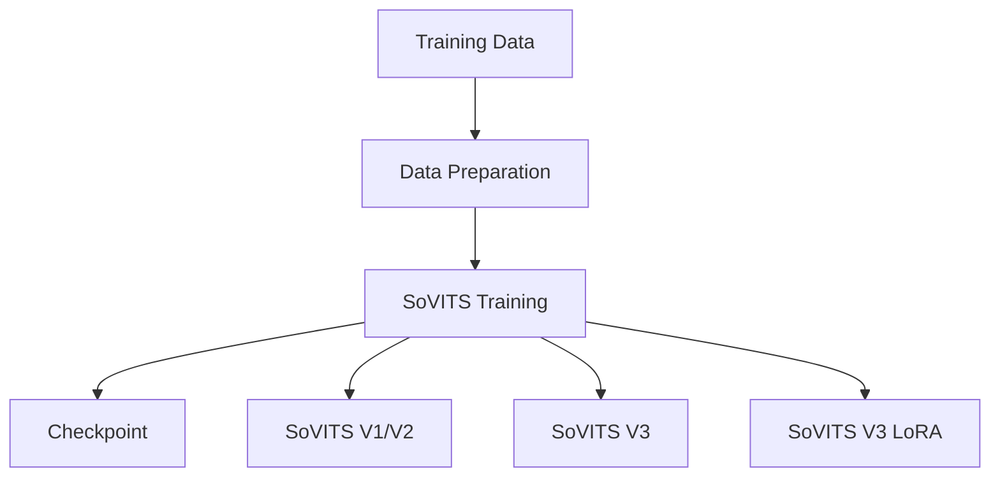
Sources: [GPT\_SoVITS/s2\_train.py](https://github.com/RVC-Boss/GPT-SoVITS/blob/c767f0b8/GPT_SoVITS/s2_train.py) [GPT\_SoVITS/s2\_train\_v3.py](https://github.com/RVC-Boss/GPT-SoVITS/blob/c767f0b8/GPT_SoVITS/s2_train_v3.py) [GPT\_SoVITS/s2\_train\_v3\_lora.py](https://github.com/RVC-Boss/GPT-SoVITS/blob/c767f0b8/GPT_SoVITS/s2_train_v3_lora.py)

## 2\. SoVITS Model Architecture

The SoVITS model is implemented through the `SynthesizerTrn` class and its variants (`SynthesizerTrnV3` for v3). The model transforms semantic tokens and reference audio into high-quality speech synthesis.

**SoVITS Training Architecture**

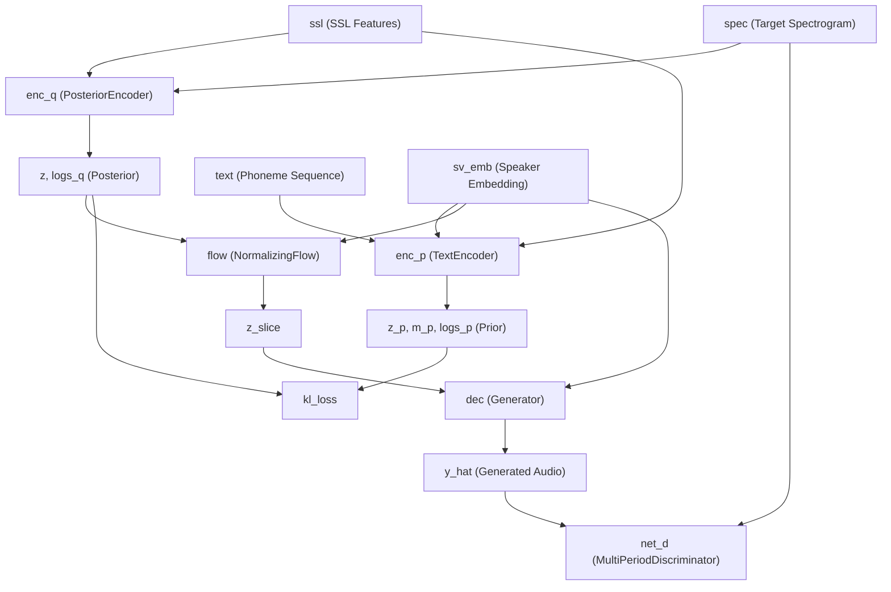
Sources: [GPT\_SoVITS/s2\_train.py135-155](https://github.com/RVC-Boss/GPT-SoVITS/blob/c767f0b8/GPT_SoVITS/s2_train.py#L135-L155) [GPT\_SoVITS/s2\_train.py381-395](https://github.com/RVC-Boss/GPT-SoVITS/blob/c767f0b8/GPT_SoVITS/s2_train.py#L381-L395)

### 2.1 Core Components

| Component | Description | Code Reference |
| --- | --- | --- |
| `SynthesizerTrn` | Main generator model for v1/v2 | [GPT\_SoVITS/s2\_train.py136-149](https://github.com/RVC-Boss/GPT-SoVITS/blob/c767f0b8/GPT_SoVITS/s2_train.py#L136-L149) |
| `SynthesizerTrnV3` | Enhanced generator for v3 | [GPT\_SoVITS/s2\_train\_v3.py136-149](https://github.com/RVC-Boss/GPT-SoVITS/blob/c767f0b8/GPT_SoVITS/s2_train_v3.py#L136-L149) |
| `MultiPeriodDiscriminator` | Adversarial discriminator for realistic audio | [GPT\_SoVITS/s2\_train.py151-155](https://github.com/RVC-Boss/GPT-SoVITS/blob/c767f0b8/GPT_SoVITS/s2_train.py#L151-L155) |
| `TextAudioSpeakerLoader` | Data loader for v1/v2 training | [GPT\_SoVITS/s2\_train.py90](https://github.com/RVC-Boss/GPT-SoVITS/blob/c767f0b8/GPT_SoVITS/s2_train.py#L90-L90) |
| `TextAudioSpeakerLoaderV3` | Data loader for v3 training | [GPT\_SoVITS/s2\_train\_v3.py90](https://github.com/RVC-Boss/GPT-SoVITS/blob/c767f0b8/GPT_SoVITS/s2_train_v3.py#L90-L90) |
| `TextAudioSpeakerLoaderV4` | Data loader for v4 training | [GPT\_SoVITS/s2\_train\_v3\_lora.py90](https://github.com/RVC-Boss/GPT-SoVITS/blob/c767f0b8/GPT_SoVITS/s2_train_v3_lora.py#L90-L90) |

Sources: [GPT\_SoVITS/s2\_train.py35-38](https://github.com/RVC-Boss/GPT-SoVITS/blob/c767f0b8/GPT_SoVITS/s2_train.py#L35-L38) [GPT\_SoVITS/s2\_train\_v3.py36-38](https://github.com/RVC-Boss/GPT-SoVITS/blob/c767f0b8/GPT_SoVITS/s2_train_v3.py#L36-L38)

### 2.2 Forward Process

During training, the model follows this process:

1.  Extract style embedding (`ge`) from reference audio
2.  Process SSL features through the residual vector quantizer
3.  The `TextEncoder` processes text and quantized features with the style embedding
4.  The `PosteriorEncoder` encodes the target spectrograms
5.  The model learns to map from text and quantized features to audio using the flow network
6.  The discriminator provides adversarial feedback for realistic audio generation

Sources: [GPT\_SoVITS/module/models.py909-920](https://github.com/RVC-Boss/GPT-SoVITS/blob/c767f0b8/GPT_SoVITS/module/models.py#L909-L920)

## 3\. Training Process

### 3.1 Training Configuration

SoVITS training is initiated from the WebUI via the `open1Ba` function in [webui.py489-572](https://github.com/RVC-Boss/GPT-SoVITS/blob/c767f0b8/webui.py#L489-L572) The configuration process involves:

1.  Loading version-specific config files (`s2.json` for v1/v2, `s2v2Pro.json` for v2Pro variants)
2.  Updating configuration parameters from WebUI inputs
3.  Writing temporary config to `TEMP/tmp_s2.json`
4.  Launching the appropriate training script with the config

**Training Configuration Flow**

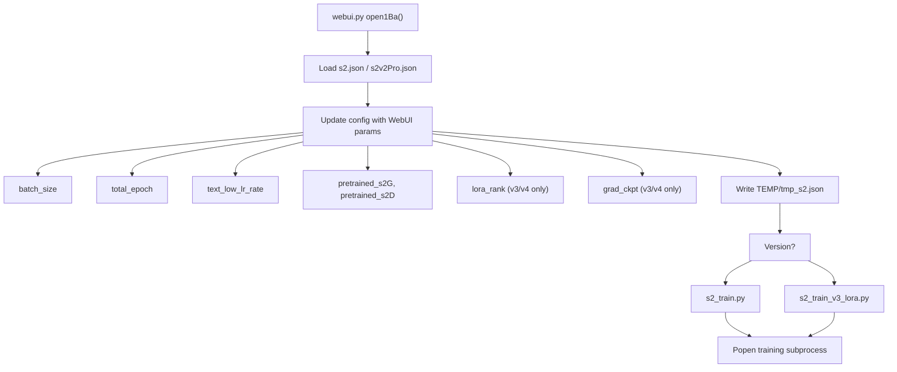
Sources: [webui.py489-544](https://github.com/RVC-Boss/GPT-SoVITS/blob/c767f0b8/webui.py#L489-L544) [config.py12-19](https://github.com/RVC-Boss/GPT-SoVITS/blob/c767f0b8/config.py#L12-L19)

### 3.2 Training Data Pipeline

The training data is loaded and processed through version-specific loader classes. The system expects preprocessed data in the experiment directory structure:

**Required Directory Structure:**

```
logs/{exp_name}/
├── 2-name2text.txt        # Phoneme sequences
├── 3-bert/*.pt            # BERT features (Chinese only)
├── 4-cnhubert/*.pt        # SSL features from CNHubert
├── 5-wav32k/*.wav         # Resampled audio at 32kHz
└── 5.1-sv/*.pt            # Speaker verification embeddings (v2Pro only)
```
**Training Data Pipeline**

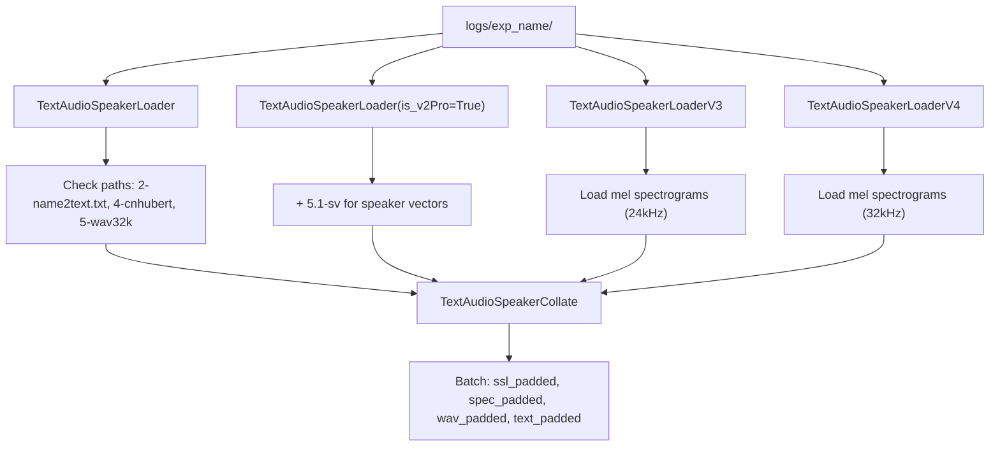
Sources: [GPT\_SoVITS/module/data\_utils.py17-156](https://github.com/RVC-Boss/GPT-SoVITS/blob/c767f0b8/GPT_SoVITS/module/data_utils.py#L17-L156) [GPT\_SoVITS/module/data\_utils.py279-438](https://github.com/RVC-Boss/GPT-SoVITS/blob/c767f0b8/GPT_SoVITS/module/data_utils.py#L279-L438) [GPT\_SoVITS/module/data\_utils.py517-699](https://github.com/RVC-Boss/GPT-SoVITS/blob/c767f0b8/GPT_SoVITS/module/data_utils.py#L517-L699)

### 3.3 Training Loop and Loss Functions

Training differs significantly between versions:

**V1/V2/V2Pro Training (GAN-based):**

-   Uses adversarial training with discriminator
-   Multiple loss components: mel loss, KL loss, discriminator/generator losses
-   Two-phase updates: discriminator first, then generator

**V3/V4 Training (CFM-based):**

-   Uses Conditional Flow Matching (CFM) loss only
-   No discriminator training
-   Single-phase updates

**SoVITS V1/V2 Training Loop**

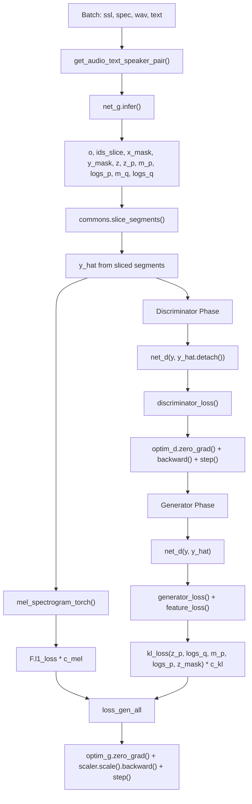
**SoVITS V3/V4 Training Loop**

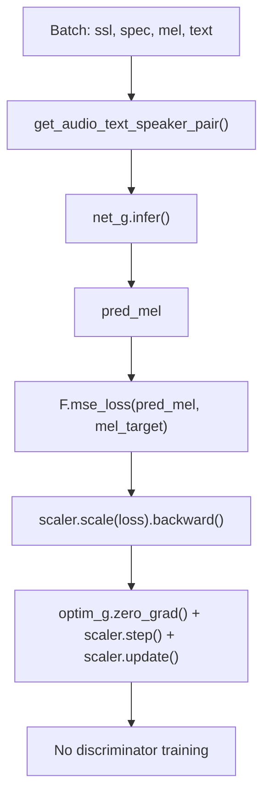
Sources: [GPT\_SoVITS/module/data\_utils.py109-134](https://github.com/RVC-Boss/GPT-SoVITS/blob/c767f0b8/GPT_SoVITS/module/data_utils.py#L109-L134) [webui.py541-544](https://github.com/RVC-Boss/GPT-SoVITS/blob/c767f0b8/webui.py#L541-L544)

## 4\. Model Versions

SoVITS has several versions with different architectures and training approaches:

### 4.1 Version Comparison

| Version | Model Class | Data Loader | Loss Function | Training Script |
| --- | --- | --- | --- | --- |
| V1/V2 | `SynthesizerTrn` | `TextAudioSpeakerLoader` | GAN + Mel + KL losses | `s2_train.py` |
| V2Pro/V2ProPlus | `SynthesizerTrn` | `TextAudioSpeakerLoader` | GAN + Mel + KL + SV losses | `s2_train.py` |
| V3 | `SynthesizerTrnV3` | `TextAudioSpeakerLoaderV3` | CFM loss only | `s2_train_v3.py` |
| V4 | `SynthesizerTrnV3` | `TextAudioSpeakerLoaderV4` | CFM loss only | `s2_train_v3_lora.py` |
| V3/V4 LoRA | `get_peft_model()` applied to CFM module | Version-specific loaders | CFM loss with LoRA | `s2_train_v3_lora.py` |

Sources: [GPT\_SoVITS/s2\_train.py136](https://github.com/RVC-Boss/GPT-SoVITS/blob/c767f0b8/GPT_SoVITS/s2_train.py#L136-L136) [GPT\_SoVITS/s2\_train\_v3.py136](https://github.com/RVC-Boss/GPT-SoVITS/blob/c767f0b8/GPT_SoVITS/s2_train_v3.py#L136-L136) [GPT\_SoVITS/s2\_train\_v3\_lora.py166-196](https://github.com/RVC-Boss/GPT-SoVITS/blob/c767f0b8/GPT_SoVITS/s2_train_v3_lora.py#L166-L196)

### 4.2 V3/V4 LoRA Implementation

For v3 and v4 models, LoRA (Low-Rank Adaptation) can be applied to reduce memory requirements during fine-tuning. The implementation uses the `peft` library to add trainable low-rank matrices to specific modules.

**V3/V4 LoRA Configuration:**

```
{  "train": {    "lora_rank": 8,  // Typical values: 4, 8, 16    "grad_ckpt": true  // Enable gradient checkpointing  }}
```
**LoRA Implementation Flow**

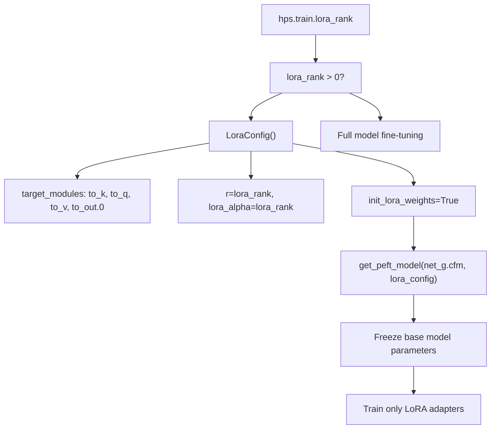
**Memory Benefits:**

-   V3 full training: ~14GB VRAM
-   V3 LoRA training: ~8GB VRAM
-   Significantly faster training with similar quality

Sources: [webui.py532](https://github.com/RVC-Boss/GPT-SoVITS/blob/c767f0b8/webui.py#L532-L532) [config.py15-16](https://github.com/RVC-Boss/GPT-SoVITS/blob/c767f0b8/config.py#L15-L16)

## 5\. Training Parameters and Hyperparameters

### 5.1 Important Training Hyperparameters

Parameters are configured via WebUI or directly in config JSON files:

| Parameter | Description | Typical Value | WebUI Control | Config Location |
| --- | --- | --- | --- | --- |
| `batch_size` | Training batch size | 6-12 (v1/v2), 2-4 (v3/v4) | Yes | [webui.py522](https://github.com/RVC-Boss/GPT-SoVITS/blob/c767f0b8/webui.py#L522-L522) |
| `epochs` | Total training epochs | 8 (v1/v2), 2 (v3/v4) | Yes | [webui.py523](https://github.com/RVC-Boss/GPT-SoVITS/blob/c767f0b8/webui.py#L523-L523) |
| `text_low_lr_rate` | Text encoder learning rate multiplier | 0.4 | Yes | [webui.py524](https://github.com/RVC-Boss/GPT-SoVITS/blob/c767f0b8/webui.py#L524-L524) |
| `if_save_latest` | Keep only latest checkpoint | True/False | Yes | [webui.py527](https://github.com/RVC-Boss/GPT-SoVITS/blob/c767f0b8/webui.py#L527-L527) |
| `if_save_every_weights` | Save inference weights each epoch | True/False | Yes | [webui.py528](https://github.com/RVC-Boss/GPT-SoVITS/blob/c767f0b8/webui.py#L528-L528) |
| `save_every_epoch` | Checkpoint save frequency | 4 (v1/v2), 1 (v3/v4) | Yes | [webui.py529](https://github.com/RVC-Boss/GPT-SoVITS/blob/c767f0b8/webui.py#L529-L529) |
| `gpu_numbers` | GPU devices to use | "0" or "0,1,2" | Yes | [webui.py530](https://github.com/RVC-Boss/GPT-SoVITS/blob/c767f0b8/webui.py#L530-L530) |
| `pretrained_s2G` | Generator pretrained weights | Version-specific path | Yes | [webui.py525](https://github.com/RVC-Boss/GPT-SoVITS/blob/c767f0b8/webui.py#L525-L525) |
| `pretrained_s2D` | Discriminator pretrained weights | Version-specific path | Yes | [webui.py526](https://github.com/RVC-Boss/GPT-SoVITS/blob/c767f0b8/webui.py#L526-L526) |
| `grad_ckpt` | Enable gradient checkpointing | True (v3/v4) | Yes | [webui.py531](https://github.com/RVC-Boss/GPT-SoVITS/blob/c767f0b8/webui.py#L531-L531) |
| `lora_rank` | LoRA rank for v3/v4 | 8 | Yes | [webui.py532](https://github.com/RVC-Boss/GPT-SoVITS/blob/c767f0b8/webui.py#L532-L532) |

**Default Value Logic:**

```
# From webui.py set_default()if version not in v3v4set:  # v1, v2, v2Pro    default_sovits_epoch = 8    default_sovits_save_every_epoch = 4    max_sovits_epoch = 25else:  # v3, v4    default_sovits_epoch = 2    default_sovits_save_every_epoch = 1    max_sovits_epoch = 16
```
Sources: [webui.py123-133](https://github.com/RVC-Boss/GPT-SoVITS/blob/c767f0b8/webui.py#L123-L133) [webui.py489-544](https://github.com/RVC-Boss/GPT-SoVITS/blob/c767f0b8/webui.py#L489-L544) [config.py12-28](https://github.com/RVC-Boss/GPT-SoVITS/blob/c767f0b8/config.py#L12-L28)

### 5.2 Model Architecture Parameters

| Parameter | Description | Typical Value | File Location |
| --- | --- | --- | --- |
| `inter_channels` | Intermediate channels in the model | 192 | `configs/s2.json` |
| `hidden_channels` | Hidden channels in the model | 192 | `configs/s2.json` |
| `filter_channels` | Filter channels in the model | 768 | `configs/s2.json` |
| `n_heads` | Number of attention heads | 2 | `configs/s2.json` |
| `n_layers` | Number of layers in the model | 6 | `configs/s2.json` |
| `kernel_size` | Kernel size for convolutions | 3 | `configs/s2.json` |
| `p_dropout` | Dropout probability | 0.1 | `configs/s2.json` |
| `gin_channels` | Global conditioning channels | 512 | `configs/s2.json` |
| `semantic_frame_rate` | Frame rate for semantic tokens | "25hz" | `configs/s2.json` |
| `freeze_quantizer` | Whether to freeze the quantizer | true | `configs/s2.json` |

Sources: [GPT\_SoVITS/configs/s2.json](https://github.com/RVC-Boss/GPT-SoVITS/blob/c767f0b8/GPT_SoVITS/configs/s2.json) [GPT\_SoVITS/module/models.py794-838](https://github.com/RVC-Boss/GPT-SoVITS/blob/c767f0b8/GPT_SoVITS/module/models.py#L794-L838)

## 6\. Checkpoint Management

### 6.1 Checkpoint Saving Strategy

The training process saves two types of checkpoints controlled by WebUI parameters:

**Checkpoint Types:**

1.  **Training Checkpoints** (in `logs_s2_{version}/`):

    -   Contains full training state for resuming
    -   Includes optimizer state, learning rate, iteration count
    -   Managed by `if_save_latest` parameter
2.  **Inference Weights** (in `SoVITS_weights_v*/`):

    -   Optimized for inference (half precision)
    -   No optimizer state
    -   Named: `{exp_name}_e{epoch}_s{step}.pth`
    -   Managed by `if_save_every_weights` parameter

**Checkpoint Saving Flow**

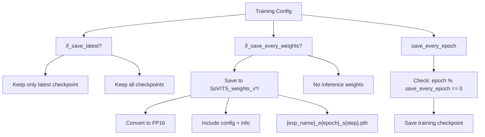
**Version-Specific Save Directories:**

```
# From config.pySoVITS_weight_version2root = {    "v1": "SoVITS_weights",    "v2": "SoVITS_weights_v2",    "v3": "SoVITS_weights_v3",    "v4": "SoVITS_weights_v4",    "v2Pro": "SoVITS_weights_v2Pro",    "v2ProPlus": "SoVITS_weights_v2ProPlus",}
```
Sources: [webui.py527-529](https://github.com/RVC-Boss/GPT-SoVITS/blob/c767f0b8/webui.py#L527-L529) [webui.py535](https://github.com/RVC-Boss/GPT-SoVITS/blob/c767f0b8/webui.py#L535-L535) [config.py60-67](https://github.com/RVC-Boss/GPT-SoVITS/blob/c767f0b8/config.py#L60-L67)

### 6.2 Loading Checkpoints for Resuming Training

When starting training, the system attempts to:

1.  Load the latest checkpoint if available (for resuming)
2.  If no checkpoint exists, load a pretrained model if specified
3.  Otherwise, start from scratch

Sources: [GPT\_SoVITS/s2\_train.py206-263](https://github.com/RVC-Boss/GPT-SoVITS/blob/c767f0b8/GPT_SoVITS/s2_train.py#L206-L263) [GPT\_SoVITS/utils.py23-60](https://github.com/RVC-Boss/GPT-SoVITS/blob/c767f0b8/GPT_SoVITS/utils.py#L23-L60)

### 6.3 Checkpoint Version Detection

Version detection is handled automatically when loading checkpoints for inference. The system uses multiple strategies to identify the model version.

**Checkpoint Format Detection Strategy**

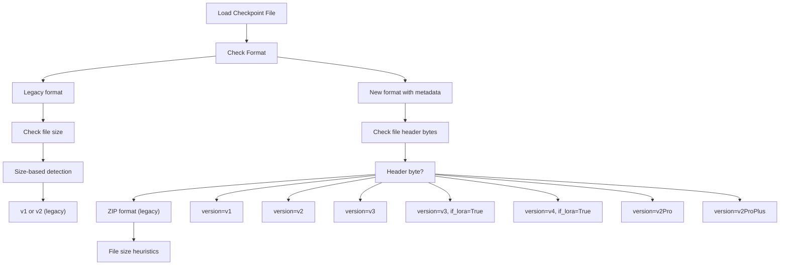
**Usage in Inference:**

```
# From api.py get_sovits_weights()version, model_version, if_lora_v3 = get_sovits_version_from_path_fast(sovits_path)
```
Sources: [api.py389](https://github.com/RVC-Boss/GPT-SoVITS/blob/c767f0b8/api.py#L389-L389)

## 7\. Practical Training Guide

### 7.1 Training Execution via WebUI

The recommended way to train SoVITS is through the WebUI, which handles all configuration and subprocess management:

**Training Tab Workflow:**

1.  **Navigate to Training Tab** in WebUI (port 9874)

2.  **Configure Experiment:**

    -   Set experiment name (matches dataset directory in `logs/`)
    -   Select model version (v2, v3, v4, v2Pro, v2ProPlus)
    -   Choose pretrained model paths
3.  **Set Training Parameters:**

    -   Batch size (auto-calculated based on GPU memory)
    -   Total epochs
    -   Text low learning rate
    -   Save options (latest only, every weights)
    -   GPU selection
4.  **Start Training:**

    -   Click "Train SoVITS Model" button
    -   Training subprocess starts via `open1Ba()` function
    -   Progress shown in status output

**Training Process Flow:**

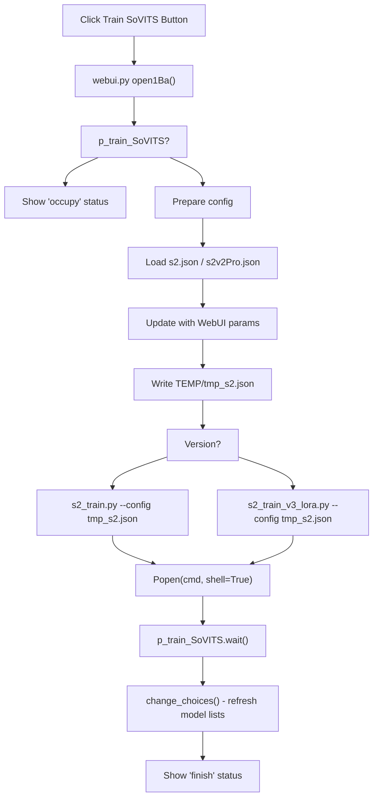
Sources: [webui.py489-572](https://github.com/RVC-Boss/GPT-SoVITS/blob/c767f0b8/webui.py#L489-L572) [webui.py541-544](https://github.com/RVC-Boss/GPT-SoVITS/blob/c767f0b8/webui.py#L541-L544)

### 7.2 Direct Script Execution

For advanced users or automation, training can be started directly:

```
# Set version environment variableexport version="v2Pro" # Prepare config in TEMP/tmp_s2.json with required fields # Run training (v1/v2/v2Pro)python GPT_SoVITS/s2_train.py --config TEMP/tmp_s2.json # Run training (v3/v4 with LoRA)python GPT_SoVITS/s2_train_v3_lora.py --config TEMP/tmp_s2.json
```
Sources: [webui.py4](https://github.com/RVC-Boss/GPT-SoVITS/blob/c767f0b8/webui.py#L4-L4) [webui.py541-544](https://github.com/RVC-Boss/GPT-SoVITS/blob/c767f0b8/webui.py#L541-L544)

### 7.3 Selecting the Appropriate Version

| Use Case | Recommended Version | VRAM Required | Training Time | Quality |
| --- | --- | --- | --- | --- |
| Best quality, sufficient compute | v4 | 14GB+ | Longest | Highest (48kHz, no artifacts) |
| Good quality, moderate compute | v3 | 12GB+ | Long | High (24kHz, some artifacts) |
| Fine-tuning existing model | v3/v4 LoRA | 8GB | Short | High (parameter efficient) |
| Enhanced speaker similarity | v2Pro/v2ProPlus | 10GB | Moderate | Very good + speaker verification |
| Stable baseline | v2 | 8-10GB | Moderate | Good |
| Resource-constrained | v2 | 8GB | Moderate | Good |

**Version Selection Guide:**

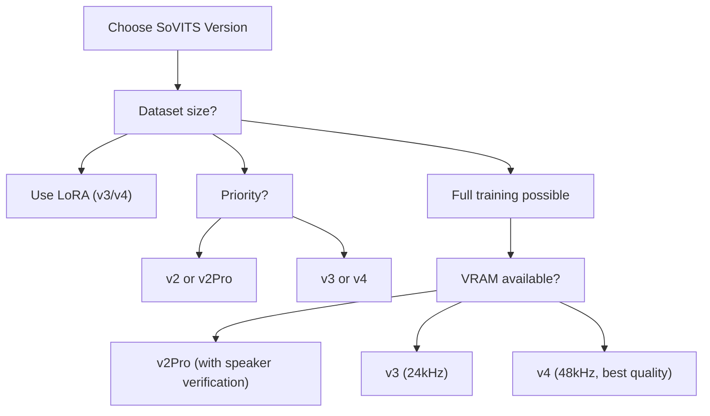
Sources: [webui.py101](https://github.com/RVC-Boss/GPT-SoVITS/blob/c767f0b8/webui.py#L101-L101) [webui.py123-133](https://github.com/RVC-Boss/GPT-SoVITS/blob/c767f0b8/webui.py#L123-L133) [config.py12-28](https://github.com/RVC-Boss/GPT-SoVITS/blob/c767f0b8/config.py#L12-L28)

### 7.4 Training Time Estimates

**Approximate Training Duration:**

-   Depends on dataset size, GPU hardware, and batch size
-   Default epochs: 8 (v1/v2), 2 (v3/v4)
-   Each epoch processes entire dataset once

**Example Timing (RTX 3090, 10min dataset):**

-   v2: ~30-60 minutes for 8 epochs
-   v3: ~40-80 minutes for 2 epochs
-   v4: ~50-100 minutes for 2 epochs
-   v3/v4 LoRA: ~20-40 minutes for 2 epochs

**Monitoring Progress:**

-   Watch terminal output for loss values
-   Check TensorBoard logs in `logs/{exp_name}/logs_s2_{version}/`
-   WebUI status updates show training/finish state

Sources: [webui.py123-133](https://github.com/RVC-Boss/GPT-SoVITS/blob/c767f0b8/webui.py#L123-L133)

## 8\. Troubleshooting

Common issues and their solutions:

1.  **Out of Memory (OOM) errors**:

    -   Reduce batch size
    -   Enable gradient checkpointing with `grad_ckpt: true`
    -   Use V3-LoRA instead of full V3 training
2.  **Training instability**:

    -   Lower learning rate
    -   Adjust loss weights (`c_mel`, `c_kl`)
    -   Check data quality
3.  **Poor synthesis quality**:

    -   Ensure dataset has consistent voice characteristics
    -   Train for more epochs
    -   Check SSL feature quality
    -   Verify phoneme alignment accuracy
4.  **Slow training**:

    -   Enable mixed precision with `fp16_run: true`
    -   Use DDP for multi-GPU training
    -   Optimize dataloader with appropriate `num_workers`

Sources: [GPT\_SoVITS/s2\_train.py282](https://github.com/RVC-Boss/GPT-SoVITS/blob/c767f0b8/GPT_SoVITS/s2_train.py#L282-L282) [GPT\_SoVITS/configs/s2.json](https://github.com/RVC-Boss/GPT-SoVITS/blob/c767f0b8/GPT_SoVITS/configs/s2.json)
