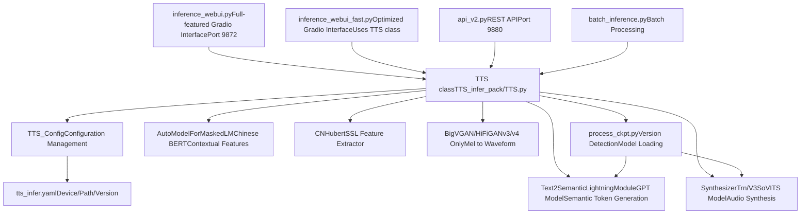
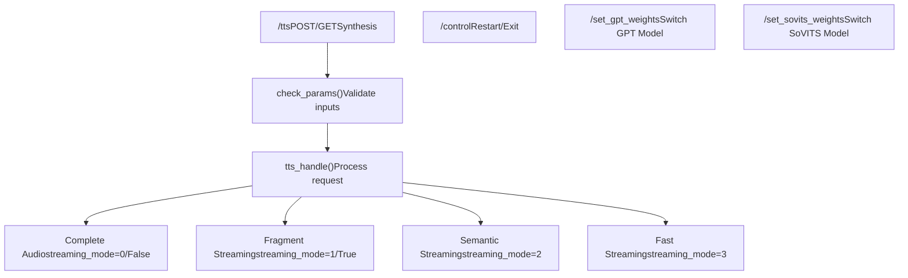
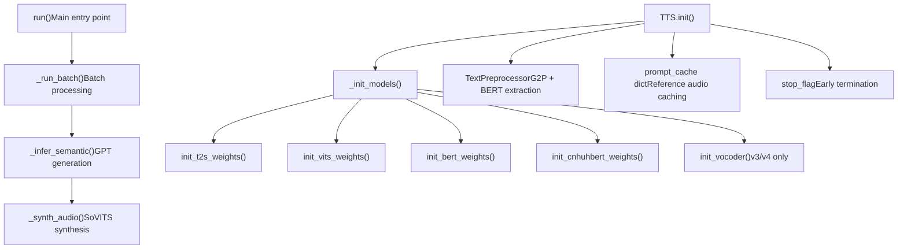
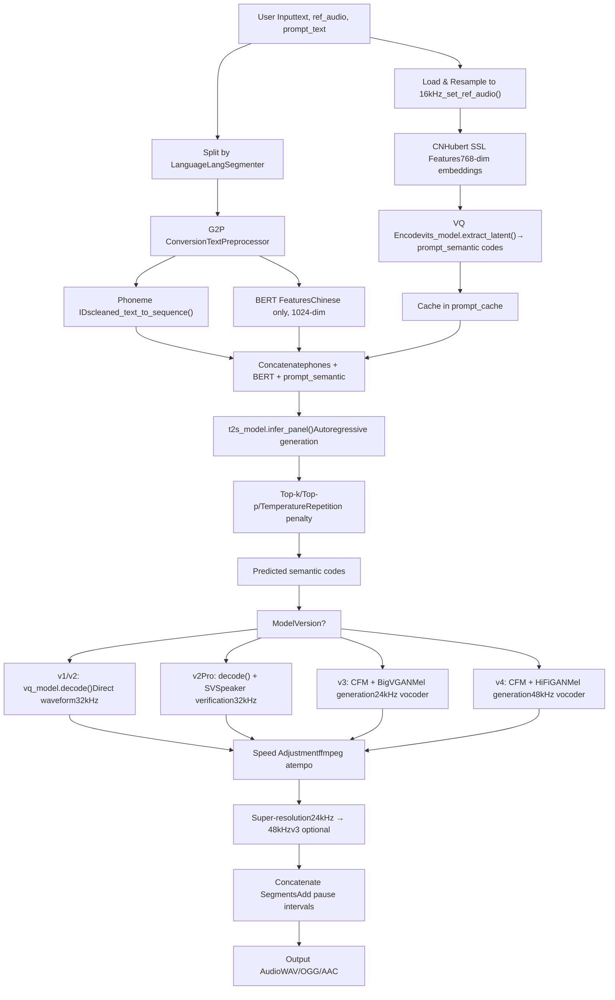
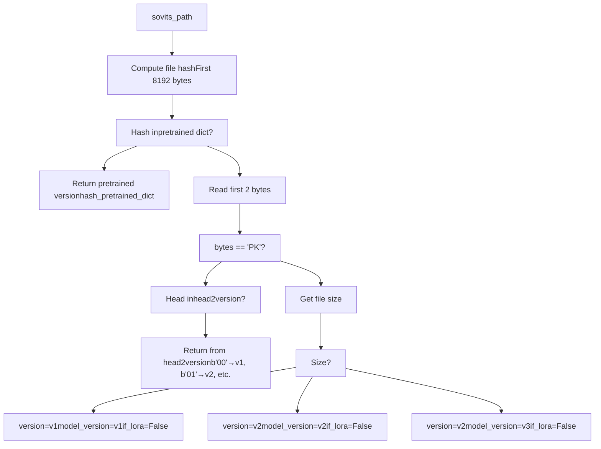
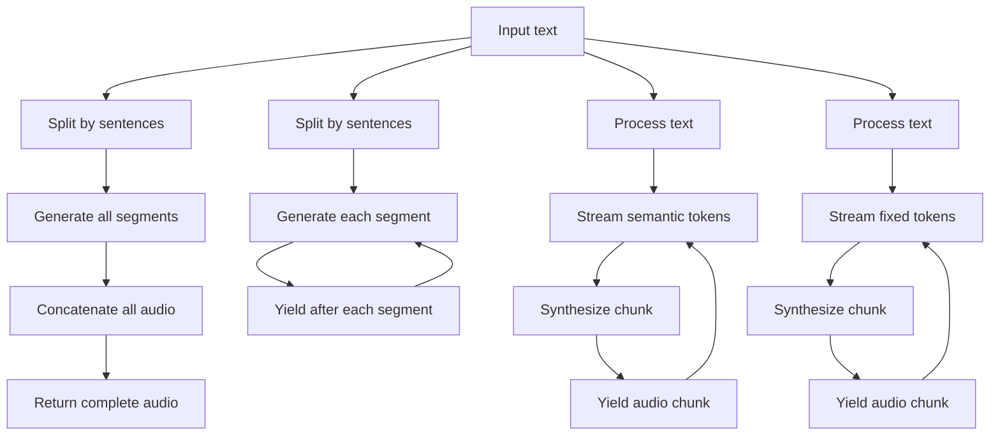

# Inference and Deployment

Relevant source files

-   [.gitignore](https://github.com/RVC-Boss/GPT-SoVITS/blob/c767f0b8/.gitignore)
-   [GPT\_SoVITS/AR/models/t2s\_model.py](https://github.com/RVC-Boss/GPT-SoVITS/blob/c767f0b8/GPT_SoVITS/AR/models/t2s_model.py)
-   [GPT\_SoVITS/AR/models/utils.py](https://github.com/RVC-Boss/GPT-SoVITS/blob/c767f0b8/GPT_SoVITS/AR/models/utils.py)
-   [GPT\_SoVITS/TTS\_infer\_pack/TTS.py](https://github.com/RVC-Boss/GPT-SoVITS/blob/c767f0b8/GPT_SoVITS/TTS_infer_pack/TTS.py)
-   [GPT\_SoVITS/configs/tts\_infer.yaml](https://github.com/RVC-Boss/GPT-SoVITS/blob/c767f0b8/GPT_SoVITS/configs/tts_infer.yaml)
-   [GPT\_SoVITS/inference\_webui.py](https://github.com/RVC-Boss/GPT-SoVITS/blob/c767f0b8/GPT_SoVITS/inference_webui.py)
-   [GPT\_SoVITS/inference\_webui\_fast.py](https://github.com/RVC-Boss/GPT-SoVITS/blob/c767f0b8/GPT_SoVITS/inference_webui_fast.py)
-   [GPT\_SoVITS/process\_ckpt.py](https://github.com/RVC-Boss/GPT-SoVITS/blob/c767f0b8/GPT_SoVITS/process_ckpt.py)
-   [api\_v2.py](https://github.com/RVC-Boss/GPT-SoVITS/blob/c767f0b8/api_v2.py)
-   [tools/assets.py](https://github.com/RVC-Boss/GPT-SoVITS/blob/c767f0b8/tools/assets.py)

This page documents the inference and deployment mechanisms in GPT-SoVITS, covering how trained models are loaded and used to generate speech. This includes the TTS pipeline architecture, available user interfaces (WebUI and REST API), streaming modes, and deployment considerations.

For information about training models, see [Model Training](/RVC-Boss/GPT-SoVITS/6-model-training). For dataset preparation before training, see [Data Preparation](/RVC-Boss/GPT-SoVITS/5-data-preparation).

## Overview of Inference Architecture

GPT-SoVITS provides multiple inference interfaces that all utilize a unified `TTS` class as the core synthesis engine. The system supports real-time synthesis, batch processing, and multiple streaming modes for low-latency applications.


**Sources:** [GPT\_SoVITS/inference\_webui.py1-100](https://github.com/RVC-Boss/GPT-SoVITS/blob/c767f0b8/GPT_SoVITS/inference_webui.py#L1-L100) [GPT\_SoVITS/inference\_webui\_fast.py1-144](https://github.com/RVC-Boss/GPT-SoVITS/blob/c767f0b8/GPT_SoVITS/inference_webui_fast.py#L1-L144) [GPT\_SoVITS/TTS\_infer\_pack/TTS.py421-466](https://github.com/RVC-Boss/GPT-SoVITS/blob/c767f0b8/GPT_SoVITS/TTS_infer_pack/TTS.py#L421-L466) [api\_v2.py1-152](https://github.com/RVC-Boss/GPT-SoVITS/blob/c767f0b8/api_v2.py#L1-L152)

## Inference Interfaces

### Gradio WebUI Interfaces

GPT-SoVITS provides two Gradio-based web interfaces for interactive inference:

#### inference\_webui.py - Legacy Interface

The original WebUI implements inference logic directly without using the `TTS` class. It manages model loading, text processing, and audio synthesis within the same file.

**Key Functions:**

-   `change_sovits_weights()` - Loads SoVITS model and detects version
-   `change_gpt_weights()` - Loads GPT model
-   `get_tts_wav()` - Main synthesis function

**Model Loading:**

```
inference_webui.py:229-368 - change_sovits_weights()
  ├─ Detects model version via get_sovits_version_from_path_fast()
  ├─ Loads SynthesizerTrn (v1/v2/v2Pro) or SynthesizerTrnV3 (v3/v4)
  ├─ Handles LoRA weights for v3/v4
  └─ Initializes vocoder (BigVGAN for v3, HiFiGAN for v4)

inference_webui.py:376-398 - change_gpt_weights()
  └─ Loads Text2SemanticLightningModule
```
#### inference\_webui\_fast.py - Optimized Interface

The optimized WebUI uses the `TTS` class for better code organization and maintainability. It provides the same user interface but with cleaner separation of concerns.

**Initialization:**

```
# Lines 125-147tts_config = TTS_Config("GPT_SoVITS/configs/tts_infer.yaml")tts_config.device = devicetts_config.is_half = is_halftts_pipeline = TTS(tts_config)
```
**Inference Function:**

```
inference_webui_fast.py:150-202 - inference()
  ├─ Constructs input dictionary
  ├─ Calls tts_pipeline.run(inputs)
  └─ Yields audio chunks
```
**Sources:** [GPT\_SoVITS/inference\_webui.py229-398](https://github.com/RVC-Boss/GPT-SoVITS/blob/c767f0b8/GPT_SoVITS/inference_webui.py#L229-L398) [GPT\_SoVITS/inference\_webui.py751-1002](https://github.com/RVC-Boss/GPT-SoVITS/blob/c767f0b8/GPT_SoVITS/inference_webui.py#L751-L1002) [GPT\_SoVITS/inference\_webui\_fast.py125-202](https://github.com/RVC-Boss/GPT-SoVITS/blob/c767f0b8/GPT_SoVITS/inference_webui_fast.py#L125-L202)

### REST API

The REST API (`api_v2.py`) provides programmatic access to inference capabilities, supporting both standard and streaming responses.


**Endpoint Details:**

| Endpoint | Method | Purpose | Key Parameters |
| --- | --- | --- | --- |
| `/tts` | POST/GET | Synthesize speech | text, text\_lang, ref\_audio\_path, streaming\_mode |
| `/control` | POST/GET | Control server | command: restart/exit |
| `/set_gpt_weights` | GET | Switch GPT model | weights\_path |
| `/set_sovits_weights` | GET | Switch SoVITS model | weights\_path |

**Request Model:**

```
api_v2.py:154-178 - TTS_Request class
  ├─ text: str - Text to synthesize
  ├─ text_lang: str - Language code
  ├─ ref_audio_path: str - Reference audio
  ├─ prompt_text: str - Reference transcript
  ├─ streaming_mode: Union[bool, int] - Response mode
  ├─ top_k/top_p/temperature - Sampling parameters
  └─ sample_steps: int - CFM steps (v3/v4)
```
**Streaming Mode Values:**

-   `0` or `False` - Disabled, return complete audio
-   `1` or `True` - Best quality, stream by text fragments
-   `2` - Medium quality, stream by semantic chunks
-   `3` - Lowest quality, fastest response, fixed-length chunks

**Sources:** [api\_v2.py154-178](https://github.com/RVC-Boss/GPT-SoVITS/blob/c767f0b8/api_v2.py#L154-L178) [api\_v2.py345-424](https://github.com/RVC-Boss/GPT-SoVITS/blob/c767f0b8/api_v2.py#L345-L424) [api\_v2.py297-343](https://github.com/RVC-Boss/GPT-SoVITS/blob/c767f0b8/api_v2.py#L297-L343)

## TTS Pipeline Architecture

The `TTS` class in `TTS_infer_pack/TTS.py` is the core inference engine, orchestrating all components from text processing to audio generation.


**Sources:** [GPT\_SoVITS/TTS\_infer\_pack/TTS.py421-466](https://github.com/RVC-Boss/GPT-SoVITS/blob/c767f0b8/GPT_SoVITS/TTS_infer_pack/TTS.py#L421-L466) [GPT\_SoVITS/TTS\_infer\_pack/TTS.py467-475](https://github.com/RVC-Boss/GPT-SoVITS/blob/c767f0b8/GPT_SoVITS/TTS_infer_pack/TTS.py#L467-L475)

### TTS Class Structure

**Core Attributes:**

```
TTS_infer_pack/TTS.py:421-466 - TTS class initialization
  ├─ configs: TTS_Config - Configuration object
  ├─ t2s_model: Text2SemanticLightningModule - GPT model
  ├─ vits_model: Union[SynthesizerTrn, SynthesizerTrnV3] - SoVITS model
  ├─ bert_model: AutoModelForMaskedLM - BERT for Chinese
  ├─ cnhuhbert_model: CNHubert - SSL features
  ├─ vocoder: Union[BigVGAN, Generator] - v3/v4 vocoder
  ├─ sr_model: AP_BWE - Super-resolution (optional)
  ├─ sv_model: SV - Speaker verification (v2Pro)
  ├─ text_preprocessor: TextPreprocessor - Text processing
  ├─ prompt_cache: dict - Reference audio cache
  └─ precision: torch.dtype - FP16 or FP32
```
**Model Initialization Sequence:**

```
TTS_infer_pack/TTS.py:467-475 - _init_models()
  1. init_t2s_weights() - Load GPT checkpoint
  2. init_vits_weights() - Load SoVITS, detect version, init vocoder
  3. init_bert_weights() - Load BERT tokenizer and model
  4. init_cnhuhbert_weights() - Load CNHubert SSL model
```
**Sources:** [GPT\_SoVITS/TTS\_infer\_pack/TTS.py421-466](https://github.com/RVC-Boss/GPT-SoVITS/blob/c767f0b8/GPT_SoVITS/TTS_infer_pack/TTS.py#L421-L466) [GPT\_SoVITS/TTS\_infer\_pack/TTS.py467-475](https://github.com/RVC-Boss/GPT-SoVITS/blob/c767f0b8/GPT_SoVITS/TTS_infer_pack/TTS.py#L467-L475) [GPT\_SoVITS/TTS\_infer\_pack/TTS.py594-609](https://github.com/RVC-Boss/GPT-SoVITS/blob/c767f0b8/GPT_SoVITS/TTS_infer_pack/TTS.py#L594-L609)

### Configuration Management

The `TTS_Config` class manages all configuration parameters, including model paths, device settings, and version-specific defaults.

**Configuration File Structure:**

```
# configs/tts_infer.yamlcustom:                    # User configuration (highest priority)  device: cuda  is_half: true  version: v2  t2s_weights_path: GPT_SoVITS/pretrained_models/...  vits_weights_path: GPT_SoVITS/pretrained_models/...  v1/v2/v3/v4/v2Pro/v2ProPlus:  # Default configurations per version  device: cpu  is_half: false  t2s_weights_path: ...  vits_weights_path: ...
```
**Configuration Priority:**

```
TTS_infer_pack/TTS.py:299-354 - TTS_Config.__init__()
  1. Load from YAML file (if exists)
  2. Merge with default_configs
  3. Use "custom" section if present, else fall back to version default
  4. Validate device (CPU if CUDA unavailable)
  5. Validate is_half (False if CPU)
  6. Check model file existence, fall back to defaults
```
**Sources:** [GPT\_SoVITS/configs/tts\_infer.yaml1-57](https://github.com/RVC-Boss/GPT-SoVITS/blob/c767f0b8/GPT_SoVITS/configs/tts_infer.yaml#L1-L57) [GPT\_SoVITS/TTS\_infer\_pack/TTS.py217-419](https://github.com/RVC-Boss/GPT-SoVITS/blob/c767f0b8/GPT_SoVITS/TTS_infer_pack/TTS.py#L217-L419)

## Inference Process Flow

The complete inference pipeline from text input to audio output involves multiple processing stages.


**Sources:** [GPT\_SoVITS/TTS\_infer\_pack/TTS.py751-1023](https://github.com/RVC-Boss/GPT-SoVITS/blob/c767f0b8/GPT_SoVITS/TTS_infer_pack/TTS.py#L751-L1023) [GPT\_SoVITS/inference\_webui.py751-1002](https://github.com/RVC-Boss/GPT-SoVITS/blob/c767f0b8/GPT_SoVITS/inference_webui.py#L751-L1002)

### Reference Audio Processing

Reference audio is processed once and cached to avoid redundant computation:

```
TTS_infer_pack/TTS.py:751-760 - set_ref_audio()
  └─ Calls three cache update methods:

TTS_infer_pack/TTS.py:765-795 - _set_prompt_semantic()
  1. Load audio via torchaudio.load()
  2. Resample to 16kHz
  3. Extract SSL features via cnhuhbert_model
  4. VQ encode via vits_model.extract_latent()
  5. Store in prompt_cache["prompt_semantic"]

TTS_infer_pack/TTS.py:797-834 - _set_ref_spec()
  1. Load and resample to model sample rate
  2. Compute STFT spectrogram
  3. Store in prompt_cache["refer_spec"]
  4. For v2Pro: extract speaker verification embedding
```
**Sources:** [GPT\_SoVITS/TTS\_infer\_pack/TTS.py751-834](https://github.com/RVC-Boss/GPT-SoVITS/blob/c767f0b8/GPT_SoVITS/TTS_infer_pack/TTS.py#L751-L834)

### Text Processing Pipeline

Text processing handles multi-language input and extracts necessary features:

```
TTS_infer_pack/TTS.py:836-949 - get_phones_and_bert()
  1. Split text by language using LangSegmenter
  2. For each segment:
     a. clean_text() - Normalize and convert to phonemes
     b. cleaned_text_to_sequence() - Phoneme to IDs
     c. get_bert_feature() - Extract BERT embeddings (Chinese only)
  3. Concatenate all segments
  4. Ensure minimum length (add padding if < 6 phones)
```
**TextPreprocessor Class:**

```
TTS_infer_pack/TextPreprocessor.py - TextPreprocessor
  ├─ segment_and_cut() - Split by language and punctuation
  ├─ preprocess() - Process each segment
  └─ merge_short_text_in_array() - Combine short segments
```
**Sources:** [GPT\_SoVITS/TTS\_infer\_pack/TTS.py836-949](https://github.com/RVC-Boss/GPT-SoVITS/blob/c767f0b8/GPT_SoVITS/TTS_infer_pack/TTS.py#L836-L949)

### Semantic Token Generation (GPT)

The GPT model autoregressively generates semantic tokens:

```
TTS_infer_pack/TTS.py:1025-1145 - _infer_semantic()
  ├─ Input: phoneme_ids, BERT features, prompt_semantic
  ├─ Processing:
  │   1. t2s_model.infer_panel() - Forward pass
  │   2. Apply top_k/top_p/temperature sampling
  │   3. Apply repetition_penalty
  │   4. Early stopping at EOS or max_length
  └─ Output: Generated semantic token sequence

AR/models/t2s_model.py:583-692 - Text2SemanticDecoder.infer_panel()
  ├─ infer_panel_batch_infer() - Batch inference with prompt
  ├─ infer_panel_naive_batched() - Simple batched inference
  └─ infer_panel() - Single sample inference
```
**Streaming Modes:**

-   **Mode 0**: Complete generation before output
-   **Mode 1**: Stream per sentence (best quality)
-   **Mode 2**: Stream semantic chunks (medium quality)
-   **Mode 3**: Fixed-length chunks (fastest response)

**Sources:** [GPT\_SoVITS/TTS\_infer\_pack/TTS.py1025-1145](https://github.com/RVC-Boss/GPT-SoVITS/blob/c767f0b8/GPT_SoVITS/TTS_infer_pack/TTS.py#L1025-L1145) [GPT\_SoVITS/AR/models/t2s\_model.py583-692](https://github.com/RVC-Boss/GPT-SoVITS/blob/c767f0b8/GPT_SoVITS/AR/models/t2s_model.py#L583-L692)

### Audio Synthesis (SoVITS)

The SoVITS model converts semantic tokens to audio, with version-specific differences:

#### v1/v2 Direct Synthesis

```
inference_webui.py:895-922 - v1/v2 synthesis path
  1. Load reference spectrogram(s)
  2. vq_model.decode(pred_semantic, phones, refers, speed)
  3. Direct waveform output at 32kHz
```
#### v2Pro Enhanced Similarity

```
inference_webui.py:895-922 - v2Pro synthesis
  1. Compute speaker verification embeddings
  2. vq_model.decode(pred_semantic, phones, refers, speed, sv_emb)
  3. Enhanced voice similarity via SV loss during training
```
#### v3/v4 CFM + Vocoder

```
inference_webui.py:923-976 - v3/v4 synthesis path
  1. vq_model.decode_encp(prompt, phones_ref, refer_spec)
     → Extract reference features fea_ref
  2. vq_model.decode_encp(pred_semantic, phones_tgt, refer_spec, ge, speed)
     → Generate target features fea_todo
  3. Chunk processing:
     a. Concatenate fea_ref + fea_todo_chunk
     b. vq_model.cfm.inference(fea, mel_ref, sample_steps)
        → CFM generates mel-spectrogram
     c. Update mel_ref and fea_ref for next chunk
  4. Vocoder synthesis:
     - v3: BigVGAN(mel) → 24kHz audio
     - v4: HiFiGAN(mel) → 48kHz audio
```
**CFM Parameters:**

-   `sample_steps`: 4/8/16/32/64/128 for v3, 4/8/16/32 for v4
-   Higher steps = better quality but slower
-   Chunk sizes: 468/934 (v3), 500/1000 (v4) in time steps

**Sources:** [GPT\_SoVITS/inference\_webui.py895-976](https://github.com/RVC-Boss/GPT-SoVITS/blob/c767f0b8/GPT_SoVITS/inference_webui.py#L895-L976) [GPT\_SoVITS/TTS\_infer\_pack/TTS.py1147-1291](https://github.com/RVC-Boss/GPT-SoVITS/blob/c767f0b8/GPT_SoVITS/TTS_infer_pack/TTS.py#L1147-L1291)

## Model Loading and Version Detection

The system automatically detects model versions and loads appropriate architectures.

### Version Detection Strategy


**Version Byte Headers:**

```
# process_ckpt.py:22-27, 72-80model_version2byte = {    "v3": b"03",        # v3 LoRA weights    "v4": b"04",        # v4 LoRA weights    "v2Pro": b"05",     # v2Pro weights    "v2ProPlus": b"06", # v2ProPlus weights} head2version = {    b"00": ["v1", "v1", False],      # symbol v1, model v1, no LoRA    b"01": ["v2", "v2", False],      # symbol v2, model v2, no LoRA    b"02": ["v2", "v3", False],      # symbol v2, model v3, no LoRA    b"03": ["v2", "v3", True],       # symbol v2, model v3, with LoRA    b"04": ["v2", "v4", True],       # symbol v2, model v4, with LoRA    b"05": ["v2", "v2Pro", False],   # symbol v2, model v2Pro    b"06": ["v2", "v2ProPlus", False], # symbol v2, model v2ProPlus}
```
**Pretrained Model Hashes:**

```
# process_ckpt.py:81-88hash_pretrained_dict = {    "dc3c97e17592963677a4a1681f30c653": ["v2", "v2", False],    # s2G488k.pth    "6642b37f3dbb1f76882b69937c95a5f3": ["v2", "v2", False],    # s2G2333k.pth    "43797be674a37c1c83ee81081941ed0f": ["v2", "v3", False],    # s2Gv3.pth    "4f26b9476d0c5033e04162c486074374": ["v2", "v4", False],    # s2Gv4.pth    "c7e9fce2223f3db685cdfa1e6368728a": ["v2", "v2Pro", False], # s2Gv2Pro.pth    "66b313e39455b57ab1b0bc0b239c9d0a": ["v2", "v2ProPlus", False], # s2Gv2ProPlus.pth}
```
**Sources:** [GPT\_SoVITS/process\_ckpt.py22-127](https://github.com/RVC-Boss/GPT-SoVITS/blob/c767f0b8/GPT_SoVITS/process_ckpt.py#L22-L127)

### Model Loading Process

**SoVITS Model Loading:**

```
TTS_infer_pack/TTS.py:493-591 - init_vits_weights()
  1. get_sovits_version_from_path_fast(weights_path)
     → Detect version, model_version, if_lora_v3

  2. load_sovits_new(weights_path)
     → Load checkpoint, handle custom headers

  3. Parse config from checkpoint:
     - filter_length, segment_size, sampling_rate, hop_length
     - Infer symbol version from text_embedding shape

  4. Initialize model:
     - v1/v2/v2Pro: SynthesizerTrn
     - v3/v4: SynthesizerTrnV3

  5. Handle LoRA (v3/v4):
     a. Load pretrained base model
     b. Apply LoraConfig to CFM module
     c. Load LoRA weights
     d. Merge and unload LoRA adapter

  6. Initialize vocoder (v3/v4):
     - v3: init_vocoder("v3") → BigVGAN
     - v4: init_vocoder("v4") → HiFiGAN
```
**GPT Model Loading:**

```
TTS_infer_pack/TTS.py:594-614 - init_t2s_weights()
  1. torch.load(weights_path) → dict with ["weight", "config"]
  2. Extract max_sec from config
  3. Initialize Text2SemanticLightningModule(config, is_train=False)
  4. Load state_dict
  5. Extract mute token embedding and compute similarity matrix
```
**Sources:** [GPT\_SoVITS/TTS\_infer\_pack/TTS.py493-614](https://github.com/RVC-Boss/GPT-SoVITS/blob/c767f0b8/GPT_SoVITS/TTS_infer_pack/TTS.py#L493-L614) [GPT\_SoVITS/process\_ckpt.py100-139](https://github.com/RVC-Boss/GPT-SoVITS/blob/c767f0b8/GPT_SoVITS/process_ckpt.py#L100-L139)

## Streaming and Response Modes

GPT-SoVITS supports multiple streaming modes to balance quality and latency.

### Streaming Mode Comparison

| Mode | Description | Latency | Quality | Use Case |
| --- | --- | --- | --- | --- |
| 0 (False) | Complete audio before return | Highest | Best | Non-interactive |
| 1 (True) | Stream by sentence fragments | High | Best | Interactive, quality priority |
| 2 | Stream by semantic chunks | Medium | Good | Real-time conversation |
| 3 | Fixed-length chunks | Lowest | Acceptable | Low-latency applications |

### Streaming Implementation


**API Implementation:**

```
# api_v2.py:388-414if streaming_mode == 0:    streaming_mode = False    return_fragment = False    fixed_length_chunk = Falseelif streaming_mode == 1:    streaming_mode = False    return_fragment = True     # Stream by sentence    fixed_length_chunk = Falseelif streaming_mode == 2:    streaming_mode = True      # Stream semantic tokens    return_fragment = False    fixed_length_chunk = Falseelif streaming_mode == 3:    streaming_mode = True    return_fragment = False    fixed_length_chunk = True  # Fixed-length semantic chunks
```
**Streaming Generator:**

```
api_v2.py:422-448 - streaming_generator()
  1. For each chunk from tts_pipeline.run():
     a. Pack audio in specified format (WAV/OGG/AAC)
     b. Add WAV header if first chunk
     c. Yield audio bytes
```
**Sources:** [api\_v2.py388-448](https://github.com/RVC-Boss/GPT-SoVITS/blob/c767f0b8/api_v2.py#L388-L448)

## Deployment Configurations

### Hardware and Precision Settings

The system automatically detects hardware capabilities and adjusts precision:

```
TTS_infer_pack/TTS.py:321-329 - Device validation
  if "cuda" in str(device) and not torch.cuda.is_available():
      device = torch.device("cpu")

  if str(device) == "cpu" and is_half:
      is_half = False  # CPU doesn't support FP16
```
**Precision Control:**

```
TTS_infer_pack/TTS.py:691-727 - enable_half_precision()
  1. Check device compatibility
  2. Update all models:
     - t2s_model.half() or .float()
     - vits_model.half() or .float()
     - bert_model.half() or .float()
     - cnhuhbert_model.half() or .float()
     - vocoder.half() or .float()
  3. Save configuration
```
**Device Migration:**

```
TTS_infer_pack/TTS.py:729-750 - set_device()
  Move all models to specified device
```
**Sources:** [GPT\_SoVITS/TTS\_infer\_pack/TTS.py691-750](https://github.com/RVC-Boss/GPT-SoVITS/blob/c767f0b8/GPT_SoVITS/TTS_infer_pack/TTS.py#L691-L750)

### Process Priority (Windows)

The inference WebUI sets high process priority on Windows for better real-time performance:

```
# inference_webui.py:12-22def set_high_priority():    if os.name != "nt":        return  # Windows only    p = psutil.Process(os.getpid())    try:        p.nice(psutil.HIGH_PRIORITY_CLASS)        print("已将进程优先级设为 High")    except psutil.AccessDenied:        print("权限不足，无法修改优先级（请用管理员运行）")
```
**Sources:** [GPT\_SoVITS/inference\_webui.py12-22](https://github.com/RVC-Boss/GPT-SoVITS/blob/c767f0b8/GPT_SoVITS/inference_webui.py#L12-L22) [GPT\_SoVITS/inference\_webui\_fast.py12-22](https://github.com/RVC-Boss/GPT-SoVITS/blob/c767f0b8/GPT_SoVITS/inference_webui_fast.py#L12-L22)

### Environment Variables

Key environment variables for deployment:

| Variable | Purpose | Default |
| --- | --- | --- |
| `version` | Model version (v1/v2/v3/v4/v2Pro/v2ProPlus) | v2 |
| `is_half` | Enable FP16 precision | True (if CUDA) |
| `device` | Device name | cuda/cpu/mps |
| `gpt_path` | GPT checkpoint path | From weight.json |
| `sovits_path` | SoVITS checkpoint path | From weight.json |
| `infer_ttswebui` | WebUI port | 9872 |
| `is_share` | Gradio public sharing | False |
| `bert_path` | BERT model directory | pretrained\_models/... |
| `cnhubert_base_path` | CNHubert directory | pretrained\_models/... |

**Weight Persistence:**

```
inference_webui.py:57-67 - weight.json management
  {
    "GPT": {
      "v1": "path/to/gpt_v1.ckpt",
      "v2": "path/to/gpt_v2.ckpt"
    },
    "SoVITS": {
      "v1": "path/to/sovits_v1.pth",
      "v2": "path/to/sovits_v2.pth"
    }
  }
```
**Sources:** [GPT\_SoVITS/inference\_webui.py45-90](https://github.com/RVC-Boss/GPT-SoVITS/blob/c767f0b8/GPT_SoVITS/inference_webui.py#L45-L90) [GPT\_SoVITS/inference\_webui\_fast.py45-147](https://github.com/RVC-Boss/GPT-SoVITS/blob/c767f0b8/GPT_SoVITS/inference_webui_fast.py#L45-L147)

### API Server Configuration

**Command-line Arguments:**

```
python api_v2.py \  -c GPT_SoVITS/configs/tts_infer.yaml \  -a 127.0.0.1 \  -p 9880
```
**Server Initialization:**

```
# api_v2.py:133-149parser = argparse.ArgumentParser(description="GPT-SoVITS api")parser.add_argument("-c", "--tts_config", default="GPT_SoVITS/configs/tts_infer.yaml")parser.add_argument("-a", "--bind_addr", default="127.0.0.1")parser.add_argument("-p", "--port", default="9880") tts_config = TTS_Config(config_path)tts_pipeline = TTS(tts_config) APP = FastAPI()# ... endpoint definitions ...uvicorn.run(APP, host=host, port=port)
```
**Sources:** [api\_v2.py133-149](https://github.com/RVC-Boss/GPT-SoVITS/blob/c767f0b8/api_v2.py#L133-L149)

## Performance Optimization

### Model Caching

The system caches reference audio features and text processing results to avoid redundant computation:

```
# TTS_infer_pack/TTS.py:452-462 - prompt_cache structureprompt_cache = {    "ref_audio_path": None,           # Reference audio file path    "prompt_semantic": None,          # VQ-encoded semantic tokens    "refer_spec": [],                 # STFT spectrogram    "prompt_text": None,              # Reference text    "prompt_lang": None,              # Reference language    "phones": None,                   # Phoneme sequence    "bert_features": None,            # BERT embeddings    "norm_text": None,                # Normalized text    "aux_ref_audio_paths": [],        # Auxiliary references}
```
**Cache Invalidation:**

```
TTS_infer_pack/TTS.py:951-976 - is_need_reprocess()
  Returns True if:
  - Reference audio path changed
  - Prompt text changed (unless ref_free)
  - Prompt language changed (unless ref_free)
```
**Sources:** [GPT\_SoVITS/TTS\_infer\_pack/TTS.py452-462](https://github.com/RVC-Boss/GPT-SoVITS/blob/c767f0b8/GPT_SoVITS/TTS_infer_pack/TTS.py#L452-L462) [GPT\_SoVITS/TTS\_infer\_pack/TTS.py951-976](https://github.com/RVC-Boss/GPT-SoVITS/blob/c767f0b8/GPT_SoVITS/TTS_infer_pack/TTS.py#L951-L976)

### Batch Processing

The TTS class supports parallel inference for multiple texts:

```
TTS_infer_pack/TTS.py:1293-1407 - _run_batch()
  1. Process reference audio once (shared)
  2. Process all texts in parallel:
     a. Text segmentation and G2P
     b. BERT feature extraction
  3. Batch semantic generation:
     - Pad sequences to same length
     - Single forward pass through GPT
  4. Synthesize audio for each sequence
  5. Concatenate and return
```
**Batch Configuration:**

```
# api_v2.py request parameters{    "batch_size": 1,          # Number of texts to process together    "split_bucket": True,     # Split texts into buckets by length    "parallel_infer": True,   # Enable parallel inference}
```
**Sources:** [GPT\_SoVITS/TTS\_infer\_pack/TTS.py1293-1407](https://github.com/RVC-Boss/GPT-SoVITS/blob/c767f0b8/GPT_SoVITS/TTS_infer_pack/TTS.py#L1293-L1407)

### Memory Management

**GPU Memory Cleanup:**

```
TTS_infer_pack/TTS.py:1409-1417 - empty_cache()
  torch.cuda.empty_cache()
  gc.collect()
```
**Model Unloading (Legacy WebUI):**

```
# inference_webui.py:407-437def clean_hifigan_model():    global hifigan_model    if hifigan_model:        hifigan_model = hifigan_model.cpu()        hifigan_model = None        torch.cuda.empty_cache() def clean_bigvgan_model():    # Similar for BigVGAN def clean_sv_cn_model():    # Similar for SV model
```
**Sources:** [GPT\_SoVITS/TTS\_infer\_pack/TTS.py1409-1417](https://github.com/RVC-Boss/GPT-SoVITS/blob/c767f0b8/GPT_SoVITS/TTS_infer_pack/TTS.py#L1409-L1417) [GPT\_SoVITS/inference\_webui.py407-496](https://github.com/RVC-Boss/GPT-SoVITS/blob/c767f0b8/GPT_SoVITS/inference_webui.py#L407-L496)

### Vocoder Initialization Strategies

Vocoders are only loaded when needed to save memory:

```
TTS_infer_pack/TTS.py:615-675 - init_vocoder()
  1. Check if vocoder already loaded and correct type
  2. If switching types:
     a. Move old vocoder to CPU
     b. Delete reference
     c. Empty cache
  3. Load new vocoder:
     - v3: BigVGAN from pretrained (24kHz, 256x upsampling)
     - v4: HiFiGAN from checkpoint (48kHz, 480x upsampling)
  4. Set vocoder configs (sr, T_ref, T_chunk, overlapped_len)
```
**Sources:** [GPT\_SoVITS/TTS\_infer\_pack/TTS.py615-675](https://github.com/RVC-Boss/GPT-SoVITS/blob/c767f0b8/GPT_SoVITS/TTS_infer_pack/TTS.py#L615-L675)

## Error Handling and Validation

### Input Validation

The API performs comprehensive input validation:

```
api_v2.py:305-342 - check_params()
  Validates:
  - ref_audio_path: required, not empty
  - text: required, not empty
  - text_lang: required, in supported languages
  - prompt_lang: required, in supported languages
  - media_type: wav/raw/ogg/aac
  - text_split_method: in available cut methods

  Returns JSONResponse(400) with error message if invalid
```
**Supported Languages:**

```
# TTS_infer_pack/TTS.py:275-276v1_languages = ["auto", "en", "zh", "ja", "all_zh", "all_ja"]v2_languages = ["auto", "auto_yue", "en", "zh", "ja", "yue", "ko",                 "all_zh", "all_ja", "all_yue", "all_ko"]
```
**Sources:** [api\_v2.py305-342](https://github.com/RVC-Boss/GPT-SoVITS/blob/c767f0b8/api_v2.py#L305-L342) [GPT\_SoVITS/TTS\_infer\_pack/TTS.py275-276](https://github.com/RVC-Boss/GPT-SoVITS/blob/c767f0b8/GPT_SoVITS/TTS_infer_pack/TTS.py#L275-L276)

### Early Stopping

Multiple mechanisms for stopping inference:

**Stop Flag:**

```
# TTS_infer_pack/TTS.py:464self.stop_flag: bool = False # Check during generation:if self.stop_flag:    break
```
**EOS Detection:**

```
# AR/models/t2s_model.py:558-565if torch.argmax(logits, dim=-1)[0] == self.EOS or samples[0, 0] == self.EOS:    stop = Trueif stop:    print(f"T2S Decoding EOS [{prefix_len} -> {y.shape[1]}]")    break
```
**Max Length:**

```
# AR/models/t2s_model.py:558-560if early_stop_num != -1 and (y.shape[1] - prefix_len) > early_stop_num:    print("use early stop num:", early_stop_num)    stop = True
```
**Sources:** [GPT\_SoVITS/TTS\_infer\_pack/TTS.py464](https://github.com/RVC-Boss/GPT-SoVITS/blob/c767f0b8/GPT_SoVITS/TTS_infer_pack/TTS.py#L464-L464) [GPT\_SoVITS/AR/models/t2s\_model.py558-570](https://github.com/RVC-Boss/GPT-SoVITS/blob/c767f0b8/GPT_SoVITS/AR/models/t2s_model.py#L558-L570)

### Exception Handling

**API Error Responses:**

```
# api_v2.py:418-452try:    tts_generator = tts_pipeline.run(req)    if streaming_mode:        return StreamingResponse(            streaming_generator(tts_generator, media_type),            media_type=f"audio/{media_type}"        )    else:        # Complete generation        ...except Exception as e:    return JSONResponse(        status_code=400,        content={"message": f"tts failed: {str(e)}"}    )
```
**WebUI Error Handling:**

```
# inference_webui.py:370-373try:    next(change_sovits_weights(sovits_path))except:    pass  # Fall back to default if initial load fails
```
**Sources:** [api\_v2.py418-452](https://github.com/RVC-Boss/GPT-SoVITS/blob/c767f0b8/api_v2.py#L418-L452) [GPT\_SoVITS/inference\_webui.py370-373](https://github.com/RVC-Boss/GPT-SoVITS/blob/c767f0b8/GPT_SoVITS/inference_webui.py#L370-L373)
