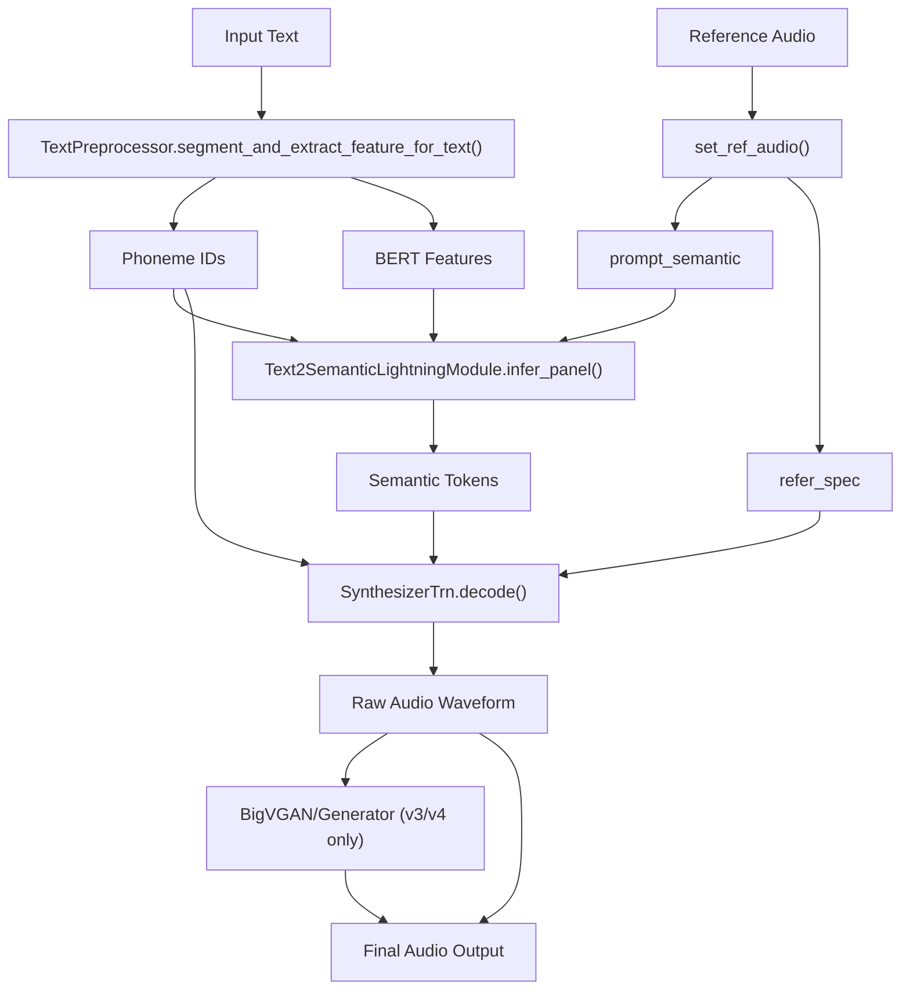
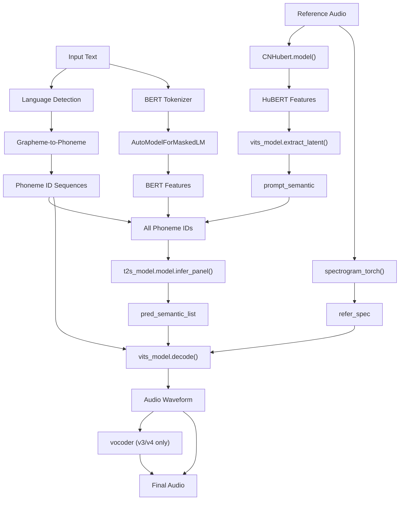
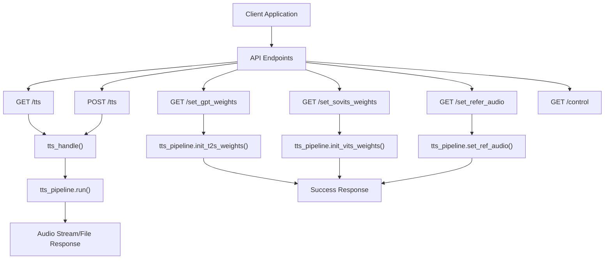
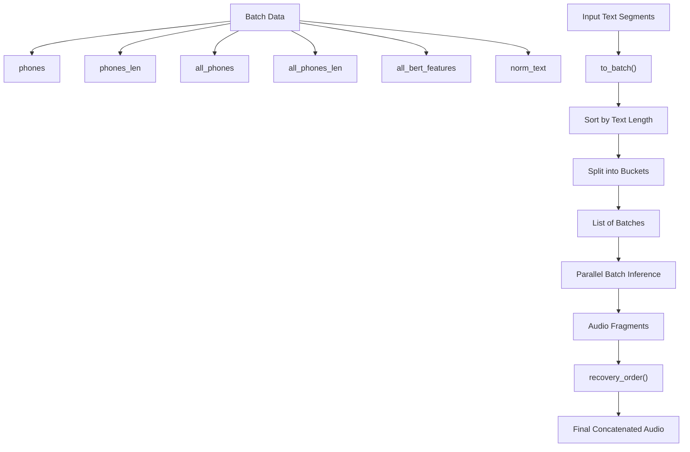

# TTS Inference

Relevant source files

-   [.gitignore](https://github.com/RVC-Boss/GPT-SoVITS/blob/c767f0b8/.gitignore)
-   [GPT\_SoVITS/AR/models/t2s\_model.py](https://github.com/RVC-Boss/GPT-SoVITS/blob/c767f0b8/GPT_SoVITS/AR/models/t2s_model.py)
-   [GPT\_SoVITS/AR/models/utils.py](https://github.com/RVC-Boss/GPT-SoVITS/blob/c767f0b8/GPT_SoVITS/AR/models/utils.py)
-   [GPT\_SoVITS/TTS\_infer\_pack/TTS.py](https://github.com/RVC-Boss/GPT-SoVITS/blob/c767f0b8/GPT_SoVITS/TTS_infer_pack/TTS.py)
-   [GPT\_SoVITS/configs/tts\_infer.yaml](https://github.com/RVC-Boss/GPT-SoVITS/blob/c767f0b8/GPT_SoVITS/configs/tts_infer.yaml)
-   [GPT\_SoVITS/inference\_webui.py](https://github.com/RVC-Boss/GPT-SoVITS/blob/c767f0b8/GPT_SoVITS/inference_webui.py)
-   [GPT\_SoVITS/inference\_webui\_fast.py](https://github.com/RVC-Boss/GPT-SoVITS/blob/c767f0b8/GPT_SoVITS/inference_webui_fast.py)
-   [GPT\_SoVITS/process\_ckpt.py](https://github.com/RVC-Boss/GPT-SoVITS/blob/c767f0b8/GPT_SoVITS/process_ckpt.py)
-   [api\_v2.py](https://github.com/RVC-Boss/GPT-SoVITS/blob/c767f0b8/api_v2.py)
-   [tools/assets.py](https://github.com/RVC-Boss/GPT-SoVITS/blob/c767f0b8/tools/assets.py)

This document covers the real-time text-to-speech synthesis system in GPT-SoVITS, which converts input text to synthesized audio using trained neural network models. The TTS inference pipeline handles multi-language text processing, semantic token generation, and audio synthesis with support for voice cloning using reference audio.

For information about training the models used in TTS inference, see [GPT Training](/RVC-Boss/GPT-SoVITS/6.2-gpt-model-training) and [SoVITS Training](/RVC-Boss/GPT-SoVITS/6.3-sovits-model-training). For details about text preprocessing, see [Text Processing](/RVC-Boss/GPT-SoVITS/4-text-processing).

## Overview

The TTS inference system is built around the `TTS` class which orchestrates multiple neural network models to perform text-to-speech synthesis. The system supports multiple model versions (v1, v2, v3, v4, v2Pro, v2ProPlus) with varying capabilities and architectures.

### Core Inference Pipeline


Sources: [GPT\_SoVITS/TTS\_infer\_pack/TTS.py984-1430](https://github.com/RVC-Boss/GPT-SoVITS/blob/c767f0b8/GPT_SoVITS/TTS_infer_pack/TTS.py#L984-L1430)

## Core Components

### TTS Class

The `TTS` class is the main interface for text-to-speech inference, managing model initialization, caching, and the complete inference pipeline.

| Component | Type | Purpose |
| --- | --- | --- |
| `TTS_Config` | Configuration | Model paths, device settings, version selection |
| `Text2SemanticLightningModule` | Neural Network | Converts text to semantic tokens |
| `SynthesizerTrn/SynthesizerTrnV3` | Neural Network | Synthesizes audio from semantic tokens |
| `AutoModelForMaskedLM` | BERT Model | Extracts text features |
| `CNHubert` | Feature Extractor | Extracts speech features from reference audio |
| `TextPreprocessor` | Text Processing | Multi-language text preprocessing |

### Model Architecture


Sources: [GPT\_SoVITS/TTS\_infer\_pack/TTS.py412-441](https://github.com/RVC-Boss/GPT-SoVITS/blob/c767f0b8/GPT_SoVITS/TTS_infer_pack/TTS.py#L412-L441) [GPT\_SoVITS/TTS\_infer\_pack/TTS.py795-819](https://github.com/RVC-Boss/GPT-SoVITS/blob/c767f0b8/GPT_SoVITS/TTS_infer_pack/TTS.py#L795-L819) [GPT\_SoVITS/TTS\_infer\_pack/TTS.py1254-1315](https://github.com/RVC-Boss/GPT-SoVITS/blob/c767f0b8/GPT_SoVITS/TTS_infer_pack/TTS.py#L1254-L1315)

## Configuration System

### TTS\_Config Class

The `TTS_Config` class manages model configurations with version-specific defaults and runtime settings.

```mermaid
flowchart TD
    ConfigFile["tts_infer.yaml"]
    TTS_Config["TTS_Config.init()"]
    DefaultConfigs["default_configs"]
    ModelPaths["Model File Paths"]
    DeviceSettings["Device & Precision"]
    VersionConfig["Model Version"]
    t2s_weights_path["t2s_weights_path"]
    vits_weights_path["vits_weights_path"]
    bert_base_path["bert_base_path"]
    cnhuhbert_base_path["cnhuhbert_base_path"]
    Device["device"]
    IsHalf["is_half"]
    Languages["Supported Languages"]
    UseVocoder["use_vocoder"]

    ConfigFile --> TTS_Config
    DefaultConfigs --> TTS_Config
    TTS --> Config_ModelPaths
    TTS --> Config_DeviceSettings
    TTS --> Config_VersionConfig
    ModelPaths --> t2s_weights_path
    ModelPaths --> vits_weights_path
    ModelPaths --> bert_base_path
    ModelPaths --> cnhuhbert_base_path
    DeviceSettings --> Device
    DeviceSettings --> IsHalf
    VersionConfig --> Languages
    VersionConfig --> UseVocoder
```


### Supported Versions

| Version | T2S Model | VITS Model | Vocoder | Languages |
| --- | --- | --- | --- | --- |
| v1 | s1bert25hz-2kh | s2G488k.pth | None | en, zh, ja, auto |
| v2 | s1bert25hz-5kh | s2G2333k.pth | None | en, zh, ja, yue, ko, auto |
| v3 | s1v3.ckpt | s2Gv3.pth | BigVGAN | en, zh, ja, yue, ko, auto |
| v4 | s1v3.ckpt | s2Gv4.pth | Generator | en, zh, ja, yue, ko, auto |
| v2Pro | s1v3.ckpt | s2Gv2Pro.pth | None | en, zh, ja, yue, ko, auto |
| v2ProPlus | s1v3.ckpt | s2Gv2ProPlus.pth | None | en, zh, ja, yue, ko, auto |

Sources: [GPT\_SoVITS/TTS\_infer\_pack/TTS.py217-273](https://github.com/RVC-Boss/GPT-SoVITS/blob/c767f0b8/GPT_SoVITS/TTS_infer_pack/TTS.py#L217-L273) [GPT\_SoVITS/configs/tts\_infer.yaml1-56](https://github.com/RVC-Boss/GPT-SoVITS/blob/c767f0b8/GPT_SoVITS/configs/tts_infer.yaml#L1-L56)

## API Interface

The system provides both programmatic and REST API interfaces for TTS inference.

### REST API Endpoints


### Request Parameters

The `TTS_Request` model defines the complete set of inference parameters:

| Parameter | Type | Default | Description |
| --- | --- | --- | --- |
| `text` | str | required | Text to synthesize |
| `text_lang` | str | required | Language of input text |
| `ref_audio_path` | str | required | Reference audio file path |
| `prompt_text` | str | "" | Optional prompt text for reference |
| `prompt_lang` | str | required | Language of prompt text |
| `top_k` | int | 5 | Top-k sampling for T2S model |
| `top_p` | float | 1.0 | Top-p sampling for T2S model |
| `temperature` | float | 1.0 | Sampling temperature |
| `batch_size` | int | 1 | Batch size for inference |
| `speed_factor` | float | 1.0 | Audio playback speed multiplier |
| `streaming_mode` | bool | False | Enable streaming audio response |
| `parallel_infer` | bool | True | Enable parallel inference |
| `sample_steps` | int | 32 | Sampling steps for v3/v4 models |

Sources: [api\_v2.py150-173](https://github.com/RVC-Boss/GPT-SoVITS/blob/c767f0b8/api_v2.py#L150-L173) [api\_v2.py300-331](https://github.com/RVC-Boss/GPT-SoVITS/blob/c767f0b8/api_v2.py#L300-L331)

## Inference Process

### Main Run Method

The `TTS.run()` method orchestrates the complete inference pipeline:

1.  **Parameter Validation**: Validates input parameters and language support
2.  **Reference Audio Processing**: Extracts semantic tokens and spectrograms from reference audio
3.  **Text Preprocessing**: Converts text to phonemes and BERT features
4.  **Batch Processing**: Groups inputs for efficient processing
5.  **Semantic Token Generation**: Uses T2S model to predict semantic tokens
6.  **Audio Synthesis**: Uses VITS model to generate audio waveforms
7.  **Post-processing**: Applies speed adjustment and audio formatting

### Batch Processing Strategy


Sources: [GPT\_SoVITS/TTS\_infer\_pack/TTS.py842-955](https://github.com/RVC-Boss/GPT-SoVITS/blob/c767f0b8/GPT_SoVITS/TTS_infer_pack/TTS.py#L842-L955) [GPT\_SoVITS/TTS\_infer\_pack/TTS.py957-973](https://github.com/RVC-Boss/GPT-SoVITS/blob/c767f0b8/GPT_SoVITS/TTS_infer_pack/TTS.py#L957-L973)

### Model-Specific Processing

Different model versions require different processing approaches:

**Non-Vocoder Models (v1, v2, v2Pro, v2ProPlus)**:

-   Direct audio generation from `vits_model.decode()`
-   Support for speed adjustment via `speed_factor` parameter
-   Parallel inference capability for batch processing

**Vocoder Models (v3, v4)**:

-   Two-stage process: VITS model generates mel-spectrograms, then vocoder generates audio
-   v3 uses `BigVGAN` vocoder, v4 uses custom `Generator` vocoder
-   Enhanced audio quality at higher sampling rates (24kHz for v3, 48kHz for v4)

Sources: [GPT\_SoVITS/TTS\_infer\_pack/TTS.py1254-1315](https://github.com/RVC-Boss/GPT-SoVITS/blob/c767f0b8/GPT_SoVITS/TTS_infer_pack/TTS.py#L1254-L1315) [GPT\_SoVITS/TTS\_infer\_pack/TTS.py601-661](https://github.com/RVC-Boss/GPT-SoVITS/blob/c767f0b8/GPT_SoVITS/TTS_infer_pack/TTS.py#L601-L661)

## Usage Patterns

### Programmatic Usage

```
# Initialize TTS systemconfig = TTS_Config("GPT_SoVITS/configs/tts_infer.yaml")tts = TTS(config) # Set reference audiotts.set_ref_audio("reference.wav") # Run inferenceinputs = {    "text": "Hello world",    "text_lang": "en",    "ref_audio_path": "reference.wav",    "prompt_text": "This is a reference",    "prompt_lang": "en"} for sr, audio_data in tts.run(inputs):    # Process audio output    pass
```
### Streaming Mode

The system supports streaming audio output for real-time applications:

-   `streaming_mode=True` enables chunked audio response
-   `return_fragment=True` processes text segments individually
-   Audio fragments are yielded as they become available

Sources: [GPT\_SoVITS/TTS\_infer\_pack/TTS.py1049-1054](https://github.com/RVC-Boss/GPT-SoVITS/blob/c767f0b8/GPT_SoVITS/TTS_infer_pack/TTS.py#L1049-L1054) [api\_v2.py348-366](https://github.com/RVC-Boss/GPT-SoVITS/blob/c767f0b8/api_v2.py#L348-L366)
