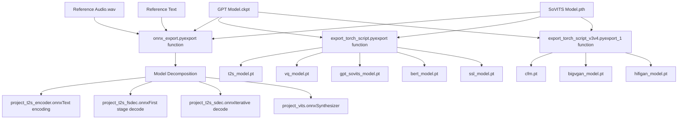
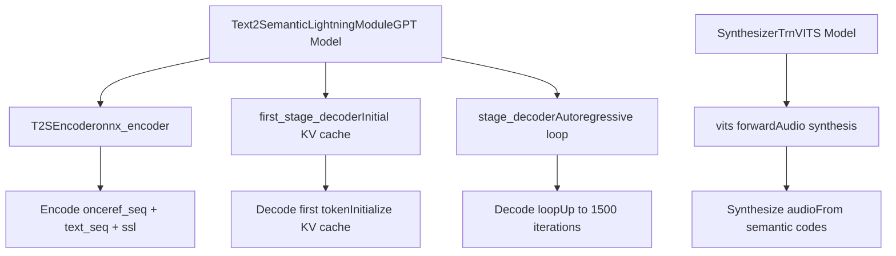
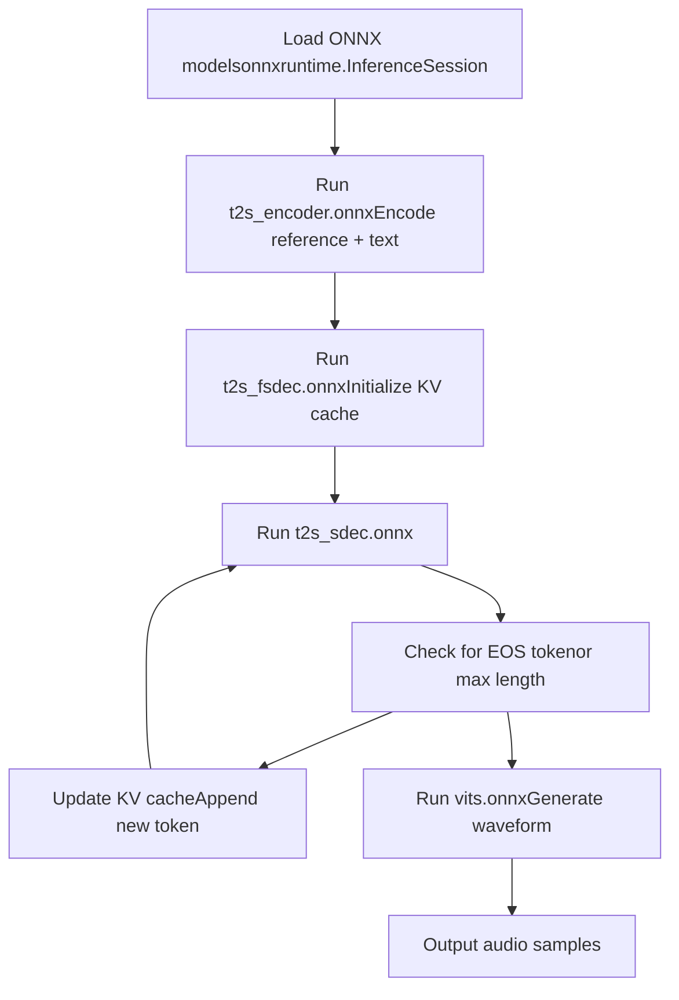
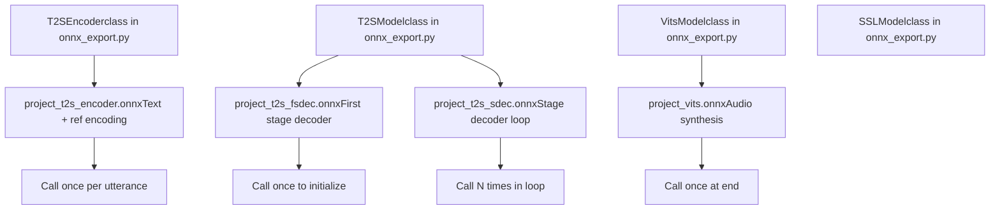
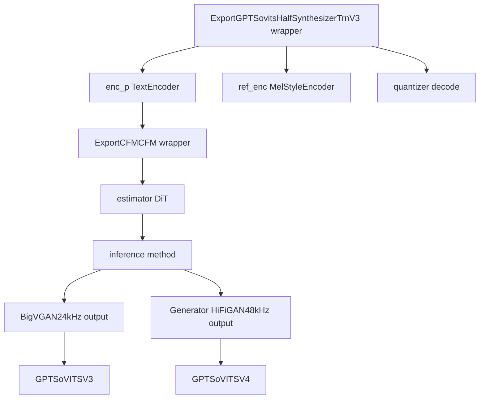
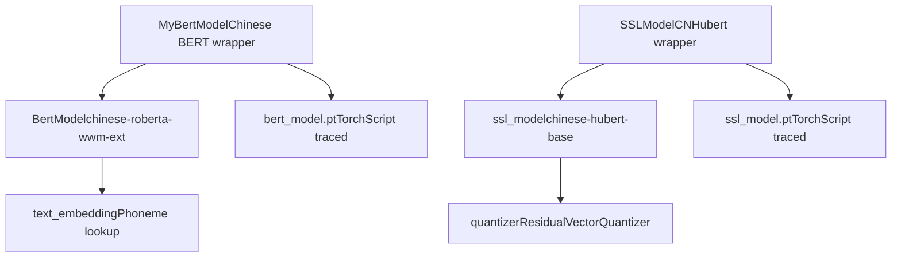
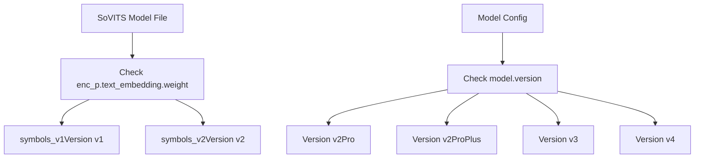
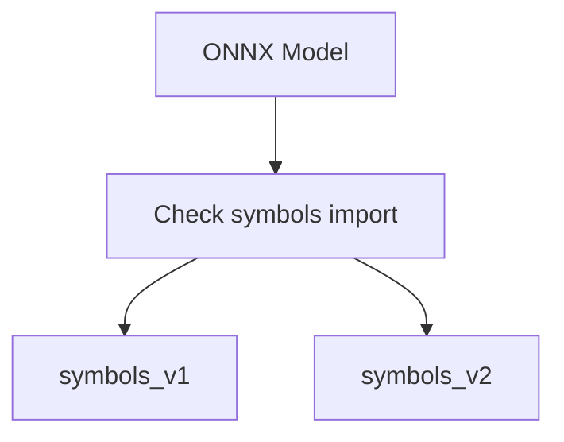

# Model Export and ONNX

Relevant source files

-   [GPT\_SoVITS/module/data\_utils.py](https://github.com/RVC-Boss/GPT-SoVITS/blob/c767f0b8/GPT_SoVITS/module/data_utils.py)
-   [GPT\_SoVITS/module/mel\_processing.py](https://github.com/RVC-Boss/GPT-SoVITS/blob/c767f0b8/GPT_SoVITS/module/mel_processing.py)
-   [GPT\_SoVITS/module/models.py](https://github.com/RVC-Boss/GPT-SoVITS/blob/c767f0b8/GPT_SoVITS/module/models.py)
-   [GPT\_SoVITS/onnx\_export.py](https://github.com/RVC-Boss/GPT-SoVITS/blob/c767f0b8/GPT_SoVITS/onnx_export.py)

This document covers model export and ONNX conversion for GPT-SoVITS models. The export system decomposes trained models into optimized production-ready components suitable for deployment with ONNX Runtime or PyTorch. It handles multiple model versions (v1-v4) and creates inference pipelines optimized for low latency and memory efficiency.

For information about training models that can be exported, see [Training](/RVC-Boss/GPT-SoVITS/6-model-training). For deployment and inference with exported models, see [TTS Inference](/RVC-Boss/GPT-SoVITS/7.1-tts-inference-process).

## Overview

The model export system transforms GPT-SoVITS training checkpoints into production-optimized formats. Two main export paths are supported:

-   **ONNX Export**: Decomposes models into separate `.onnx` files for each inference stage, enabling streaming inference and cross-platform deployment with ONNX Runtime
-   **TorchScript Export**: Creates `.pt` files optimized for PyTorch-native deployment via `torch.jit.trace` and `torch.jit.script`

The ONNX export path is recommended for production deployment due to its superior cross-platform compatibility, optimized runtime performance, and support for streaming inference patterns.

**Sources:** [GPT\_SoVITS/export\_torch\_script.py1-50](https://github.com/RVC-Boss/GPT-SoVITS/blob/c767f0b8/GPT_SoVITS/export_torch_script.py#L1-L50) [GPT\_SoVITS/onnx\_export.py1-50](https://github.com/RVC-Boss/GPT-SoVITS/blob/c767f0b8/GPT_SoVITS/onnx_export.py#L1-L50)

### Export Workflow

**Diagram: Complete Export Pipeline**


**Sources:** [GPT\_SoVITS/export\_torch\_script.py656-726](https://github.com/RVC-Boss/GPT-SoVITS/blob/c767f0b8/GPT_SoVITS/export_torch_script.py#L656-L726) [GPT\_SoVITS/onnx\_export.py277-396](https://github.com/RVC-Boss/GPT-SoVITS/blob/c767f0b8/GPT_SoVITS/onnx_export.py#L277-L396) [GPT\_SoVITS/export\_torch\_script\_v3v4.py702-923](https://github.com/RVC-Boss/GPT-SoVITS/blob/c767f0b8/GPT_SoVITS/export_torch_script_v3v4.py#L702-L923)

## Model Decomposition for Production

The ONNX export system decomposes the monolithic TTS pipeline into separate, optimized components. This decomposition enables streaming inference, reduces memory overhead, and allows independent optimization of each stage.

### ONNX Decomposition Strategy

**Diagram: ONNX Model Decomposition**


**Sources:** [GPT\_SoVITS/onnx\_export.py70-190](https://github.com/RVC-Boss/GPT-SoVITS/blob/c767f0b8/GPT_SoVITS/onnx_export.py#L70-L190) [GPT\_SoVITS/onnx\_export.py86-131](https://github.com/RVC-Boss/GPT-SoVITS/blob/c767f0b8/GPT_SoVITS/onnx_export.py#L86-L131)

### Component Responsibilities

| ONNX Component | Class | Input Shape | Output Shape | Purpose |
| --- | --- | --- | --- | --- |
| `t2s_encoder.onnx` | `T2SEncoder` | `ref_seq: [1, N]`
`text_seq: [1, M]`
`ref_bert: [N, 1024]`
`text_bert: [M, 1024]`
`ssl_content: [1, 768, K]` | `x: [1, N+M, 512]`
`prompts: [1, P]` | Encodes phoneme sequences and extracts semantic prompts from reference audio |
| `t2s_fsdec.onnx` | `first_stage_decoder` | `x: [1, N, 512]`
`prompts: [1, P]` | `y: [1, P+1]`
`k, v: [L, P+1, 1, 512]`
`y_emb: [1, P+1, 512]`
`x_example: [1, P+1, 512]` | Initializes KV cache and predicts first semantic token |
| `t2s_sdec.onnx` | `stage_decoder` | `y: [1, N]`
`k, v: [L, N, 1, 512]`
`y_emb: [1, N, 512]`
`x_example: [1, N, 512]` | `y: [1, N+1]`
`k, v: [L, N+1, 1, 512]`
`y_emb: [1, N+1, 512]`
`logits: [1, 1024]`
`samples: [1, 1]` | Autoregressively predicts next semantic token using cached KV |
| `vits.onnx` | `SynthesizerTrn.forward` | `text_seq: [1, N]`
`pred_semantic: [1, 1, M]`
`ref_audio: [1, K]` | `audio: [K*ratio]` | Synthesizes waveform from semantic codes and reference |

**Sources:** [GPT\_SoVITS/onnx\_export.py142-189](https://github.com/RVC-Boss/GPT-SoVITS/blob/c767f0b8/GPT_SoVITS/onnx_export.py#L142-L189) [GPT\_SoVITS/onnx\_export.py70-84](https://github.com/RVC-Boss/GPT-SoVITS/blob/c767f0b8/GPT_SoVITS/onnx_export.py#L70-L84) [GPT\_SoVITS/onnx\_export.py213-223](https://github.com/RVC-Boss/GPT-SoVITS/blob/c767f0b8/GPT_SoVITS/onnx_export.py#L213-L223)

### Decomposition Implementation

The decomposition is implemented through wrapper classes that expose specific model stages:

**T2SEncoder Wrapper** (`onnx_export.py:70-84`):

```
class T2SEncoder(nn.Module):    def __init__(self, t2s, vits):        super().__init__()        self.encoder = t2s.onnx_encoder        self.vits = vits        def forward(self, ref_seq, text_seq, ref_bert, text_bert, ssl_content):        codes = self.vits.extract_latent(ssl_content)        prompt_semantic = codes[0, 0]        bert = torch.cat([ref_bert.transpose(0, 1), text_bert.transpose(0, 1)], 1)        all_phoneme_ids = torch.cat([ref_seq, text_seq], 1)        return self.encoder(all_phoneme_ids, bert), prompt_semantic.unsqueeze(0)
```
**T2SModel Forward Pass** (`onnx_export.py:106-131`): The forward pass demonstrates the iterative decoding pattern:

```
def forward(self, ref_seq, text_seq, ref_bert, text_bert, ssl_content):    x, prompts = self.onnx_encoder(ref_seq, text_seq, ref_bert, text_bert, ssl_content)    y, k, v, y_emb, x_example = self.first_stage_decoder(x, prompts)        for idx in range(1, 1500):        y, k, v, y_emb, logits, samples = self.stage_decoder(y, k, v, y_emb, x_example)        if early_stop_condition:            break        return y[:, -idx:].unsqueeze(0)
```
**Sources:** [GPT\_SoVITS/onnx\_export.py70-84](https://github.com/RVC-Boss/GPT-SoVITS/blob/c767f0b8/GPT_SoVITS/onnx_export.py#L70-L84) [GPT\_SoVITS/onnx\_export.py106-131](https://github.com/RVC-Boss/GPT-SoVITS/blob/c767f0b8/GPT_SoVITS/onnx_export.py#L106-L131)

## Optimized Inference Patterns

### Streaming Inference with Decomposed Models

The decomposed ONNX models enable efficient streaming inference by separating one-time encoding from iterative decoding:

**Diagram: Optimized Inference Flow**


**Sources:** [GPT\_SoVITS/onnx\_export.py106-131](https://github.com/RVC-Boss/GPT-SoVITS/blob/c767f0b8/GPT_SoVITS/onnx_export.py#L106-L131) [GPT\_SoVITS/onnx\_export.py118-128](https://github.com/RVC-Boss/GPT-SoVITS/blob/c767f0b8/GPT_SoVITS/onnx_export.py#L118-L128)

### Dynamic Shape Support

ONNX export specifies dynamic axes for all variable-length inputs to support arbitrary sequence lengths at inference time:

**T2S Encoder Dynamic Axes** (`onnx_export.py:142-156`):

```
torch.onnx.export(    self.onnx_encoder,    (ref_seq, text_seq, ref_bert, text_bert, ssl_content),    f"onnx/{project_name}/{project_name}_t2s_encoder.onnx",    dynamic_axes={        "ref_seq": {1: "ref_length"},        "text_seq": {1: "text_length"},        "ref_bert": {0: "ref_length"},        "text_bert": {0: "text_length"},        "ssl_content": {2: "ssl_length"},    },    opset_version=16)
```
**VITS Dynamic Axes** (`onnx_export.py:252-265`):

```
torch.onnx.export(    self.vits,    (text_seq, pred_semantic, ref_audio),    f"onnx/{project_name}/{project_name}_vits.onnx",    dynamic_axes={        "text_seq": {1: "text_length"},        "pred_semantic": {2: "pred_length"},        "ref_audio": {1: "audio_length"},    },    opset_version=17)
```
**Sources:** [GPT\_SoVITS/onnx\_export.py142-156](https://github.com/RVC-Boss/GPT-SoVITS/blob/c767f0b8/GPT_SoVITS/onnx_export.py#L142-L156) [GPT\_SoVITS/onnx\_export.py159-189](https://github.com/RVC-Boss/GPT-SoVITS/blob/c767f0b8/GPT_SoVITS/onnx_export.py#L159-L189) [GPT\_SoVITS/onnx\_export.py252-265](https://github.com/RVC-Boss/GPT-SoVITS/blob/c767f0b8/GPT_SoVITS/onnx_export.py#L252-L265)

### Memory Optimization

The decomposed architecture reduces peak memory usage:

| Inference Stage | Memory Requirement | Optimization |
| --- | --- | --- |
| Text Encoding | ~500MB | One-time allocation, can be freed after first stage decode |
| First Stage Decode | ~200MB | Initializes KV cache, reused across iterations |
| Iterative Decode | ~100MB per iteration | Constant memory, KV cache updated in-place |
| VITS Synthesis | ~800MB | Final stage, previous stages can be freed |

**Sources:** [GPT\_SoVITS/onnx\_export.py86-131](https://github.com/RVC-Boss/GPT-SoVITS/blob/c767f0b8/GPT_SoVITS/onnx_export.py#L86-L131)

## Core Export Components

### ONNX Model Components

The ONNX export system creates four separate model files, each optimized for its specific role in the inference pipeline:

**Diagram: ONNX Component Architecture**


**Sources:** [GPT\_SoVITS/onnx\_export.py70-84](https://github.com/RVC-Boss/GPT-SoVITS/blob/c767f0b8/GPT_SoVITS/onnx_export.py#L70-L84) [GPT\_SoVITS/onnx\_export.py86-131](https://github.com/RVC-Boss/GPT-SoVITS/blob/c767f0b8/GPT_SoVITS/onnx_export.py#L86-L131) [GPT\_SoVITS/onnx\_export.py192-223](https://github.com/RVC-Boss/GPT-SoVITS/blob/c767f0b8/GPT_SoVITS/onnx_export.py#L192-L223) [GPT\_SoVITS/onnx\_export.py268-275](https://github.com/RVC-Boss/GPT-SoVITS/blob/c767f0b8/GPT_SoVITS/onnx_export.py#L268-L275)

#### T2SEncoder Component

The `T2SEncoder` class combines text encoding with semantic prompt extraction:

**Implementation** (`onnx_export.py:70-84`):

-   Extracts semantic codes from reference audio using `vits.extract_latent(ssl_content)`
-   Concatenates reference and target phoneme sequences
-   Concatenates reference and target BERT embeddings
-   Passes concatenated inputs through GPT encoder
-   Returns encoded features `x` and semantic prompts

**ONNX Export** (`onnx_export.py:142-156`):

-   Input names: `ref_seq`, `text_seq`, `ref_bert`, `text_bert`, `ssl_content`
-   Output names: `x`, `prompts`
-   Dynamic axes specified for all variable-length dimensions
-   Opset version: 16

#### First Stage Decoder Component

The `first_stage_decoder` initializes the KV cache for autoregressive generation:

**Implementation** (`onnx_export.py:102-103`):

-   Calls `self.first_stage_decoder` from the T2S model
-   Returns initial `y`, `k`, `v`, `y_emb`, `x_example` tensors
-   KV cache has shape `[num_layers, sequence_length, 1, hidden_dim]`

**ONNX Export** (`onnx_export.py:159-172`):

-   Input names: `x`, `prompts`
-   Output names: `y`, `k`, `v`, `y_emb`, `x_example`
-   Dynamic axes for `x` and `prompts`
-   Opset version: 16

#### Stage Decoder Component

The `stage_decoder` performs one autoregressive step with KV cache update:

**Implementation** (`onnx_export.py:118-121`):

-   Takes current tokens and KV cache as input
-   Predicts logits for next token
-   Samples next token (or takes argmax)
-   Updates KV cache with new timestep
-   Returns updated state and predictions

**ONNX Export** (`onnx_export.py:174-189`):

-   Input names: `iy`, `ik`, `iv`, `iy_emb`, `ix_example`
-   Output names: `y`, `k`, `v`, `y_emb`, `logits`, `samples`
-   Dynamic axes for all sequence-length dimensions
-   Opset version: 16

**Sources:** [GPT\_SoVITS/onnx\_export.py159-189](https://github.com/RVC-Boss/GPT-SoVITS/blob/c767f0b8/GPT_SoVITS/onnx_export.py#L159-L189)

#### VITS Synthesizer Component

The `VitsModel` wraps the SynthesizerTrn for ONNX export:

**Implementation** (`onnx_export.py:192-223`):

-   Loads trained weights from `.pth` file
-   Auto-detects version from `text_embedding.weight` shape (322 = v1, else v2)
-   Extracts spectrograms from reference audio
-   Calls `vq_model` forward pass with semantic codes

**ONNX Export** (`onnx_export.py:252-265`):

-   Input names: `text_seq`, `pred_semantic`, `ref_audio`
-   Output names: `audio`
-   Dynamic axes for text length, semantic length, and audio length
-   Opset version: 17

**Sources:** [GPT\_SoVITS/onnx\_export.py192-223](https://github.com/RVC-Boss/GPT-SoVITS/blob/c767f0b8/GPT_SoVITS/onnx_export.py#L192-L223) [GPT\_SoVITS/onnx\_export.py252-265](https://github.com/RVC-Boss/GPT-SoVITS/blob/c767f0b8/GPT_SoVITS/onnx_export.py#L252-L265)

### TorchScript Model Components

TorchScript export uses different strategies based on model version:

**Diagram: TorchScript Architecture**

```mermaid
flowchart TD
    T2SScript["T2SModeltorch.jit.script"]
    VitsScript["VitsModeltorch.jit.trace"]
    BERTScript["MyBertModeltorch.jit.trace"]
    SSLScript["SSLModeltorch.jit.trace"]
    CombinedScript["GPT_SoVITStorch.jit.trace"]
    HalfScript["ExportGPTSovitsHalfFeature extraction"]
    CFMScript["ExportCFMFlow matching"]
    BigVGANScript["BigVGANV3 vocoder"]
    HiFiGANScript["GeneratorV4 vocoder"]
    T2SFile["t2s_model.pt"]
    VitsFile["vq_model.pt"]
    BERTFile["bert_model.pt"]
    SSLFile["ssl_model.pt"]
    CombinedFile["gpt_sovits_model.pt"]
    CFMFile["cfm.pt"]
    VocoderFile["vocoder.pt"]

    T2SScript --> T2SFile
    VitsScript --> VitsFile
    BERTScript --> BERTFile
    SSLScript --> SSLFile
    CombinedScript --> CombinedFile
    CFMScript --> CFMFile
    BigVGANScript --> VocoderFile
    HiFiGANScript --> VocoderFile
```


**Sources:** [GPT\_SoVITS/export\_torch\_script.py405-565](https://github.com/RVC-Boss/GPT-SoVITS/blob/c767f0b8/GPT_SoVITS/export_torch_script.py#L405-L565) [GPT\_SoVITS/export\_torch\_script\_v3v4.py223-500](https://github.com/RVC-Boss/GPT-SoVITS/blob/c767f0b8/GPT_SoVITS/export_torch_script_v3v4.py#L223-L500)

### Version-Specific Synthesizer Export

The synthesizer export differs significantly between model versions due to architectural changes:

#### V1/V2 Synthesizers

**Architecture**: Monolithic VITS-based synthesis with integrated HiFiGAN vocoder

| Export Format | Class Used | File Output | Implementation |
| --- | --- | --- | --- |
| ONNX | `SynthesizerTrn` from `models_onnx` | `project_vits.onnx` | Direct waveform generation |
| TorchScript | `SynthesizerTrn` from `models` | `vq_model.pt` | Traced synthesis |

**ONNX Export Flow** (`onnx_export.py:192-223`):

1.  Load trained weights from `.pth` file
2.  Auto-detect version from `enc_p.text_embedding.weight.shape[0]` (322 = v1, else v2)
3.  Create `SynthesizerTrn` with detected version
4.  Export single ONNX file with dynamic axes

**Sources:** [GPT\_SoVITS/onnx\_export.py192-223](https://github.com/RVC-Boss/GPT-SoVITS/blob/c767f0b8/GPT_SoVITS/onnx_export.py#L192-L223) [GPT\_SoVITS/module/models\_onnx.py766-896](https://github.com/RVC-Boss/GPT-SoVITS/blob/c767f0b8/GPT_SoVITS/module/models_onnx.py#L766-L896)

#### V3/V4 Synthesizers

**Architecture**: Multi-stage pipeline with Conditional Flow Matching and external vocoder

**Diagram: V3/V4 Export Pipeline**


**Export Components**:

| Component | Class | File | Purpose |
| --- | --- | --- | --- |
| Feature Extractor | `ExportGPTSovitsHalf` | Part of pipeline | Text encoder + quantizer |
| CFM Generator | `ExportCFM` | `cfm.pt` | Mel-spectrogram generation |
| V3 Vocoder | `BigVGAN` | `bigvgan_model.pt` | 24kHz waveform synthesis |
| V4 Vocoder | `Generator` | `hifigan_model.pt` | 48kHz waveform synthesis |

**Sources:** [GPT\_SoVITS/export\_torch\_script\_v3v4.py223-437](https://github.com/RVC-Boss/GPT-SoVITS/blob/c767f0b8/GPT_SoVITS/export_torch_script_v3v4.py#L223-L437) [GPT\_SoVITS/export\_torch\_script\_v3v4.py501-602](https://github.com/RVC-Boss/GPT-SoVITS/blob/c767f0b8/GPT_SoVITS/export_torch_script_v3v4.py#L501-L602)

### Auxiliary Model Exports

Additional models are exported to support the complete inference pipeline:

**Diagram: Auxiliary Export Components**


**BERT Model Export** (`export_torch_script.py:539-561`):

-   Wraps `BertModel` from Chinese RoBERTa checkpoint
-   Exports as `bert_model.pt` using `torch.jit.trace`
-   Input: phoneme IDs with dynamic length
-   Output: 1024-dim contextual embeddings

**SSL Model Export** (`export_torch_script.py:577-625`):

-   Wraps CNHubert base model
-   Exports as `ssl_model.pt` using `torch.jit.trace`
-   Input: 16kHz audio with dynamic length
-   Output: 768-dim SSL features transposed to `[B, 768, T]`

**Note**: ONNX export does not include auxiliary models - they must be run separately using PyTorch before calling ONNX models.

**Sources:** [GPT\_SoVITS/export\_torch\_script.py539-561](https://github.com/RVC-Boss/GPT-SoVITS/blob/c767f0b8/GPT_SoVITS/export_torch_script.py#L539-L561) [GPT\_SoVITS/export\_torch\_script.py577-625](https://github.com/RVC-Boss/GPT-SoVITS/blob/c767f0b8/GPT_SoVITS/export_torch_script.py#L577-L625)

## Export Functions and Usage

### ONNX Export Function

The main ONNX export entry point is `export()` in `onnx_export.py:277-396`:

```
def export(vits_path, gpt_path, project_name, vits_model="v2")
```
**Parameters**:

-   `vits_path` (str): Path to trained SoVITS checkpoint `.pth`
-   `gpt_path` (str): Path to trained GPT checkpoint `.ckpt`
-   `project_name` (str): Project name for output files
-   `vits_model` (str): Model version, either `"v1"` or `"v2"`

**Outputs** (in `onnx/{project_name}/` directory):

-   `{project_name}_t2s_encoder.onnx`: Text encoding component
-   `{project_name}_t2s_fsdec.onnx`: First stage decoder
-   `{project_name}_t2s_sdec.onnx`: Stage decoder for loop
-   `{project_name}_vits.onnx`: VITS synthesizer
-   `{project_name}.json`: Configuration metadata

**Configuration File** (`onnx_export.py:369-384`):

```
{    "Folder": "project_name",    "Name": "project_name",    "Type": "GPT-SoVits",    "Rate": 32000,    "NumLayers": 12,    "EmbeddingDim": 512,    "Dict": "BasicDict",    "BertPath": "chinese-roberta-wwm-ext-large",    "AddBlank": false}
```
**Example Usage**:

```
from onnx_export import export export(    vits_path="SoVITS_weights/model_e30_s3930.pth",    gpt_path="GPT_weights/model-e25.ckpt",    project_name="my_voice",    vits_model="v2")
```
**Sources:** [GPT\_SoVITS/onnx\_export.py277-396](https://github.com/RVC-Boss/GPT-SoVITS/blob/c767f0b8/GPT_SoVITS/onnx_export.py#L277-L396) [GPT\_SoVITS/onnx\_export.py369-384](https://github.com/RVC-Boss/GPT-SoVITS/blob/c767f0b8/GPT_SoVITS/onnx_export.py#L369-L384)

### TorchScript Export Functions

#### V1/V2 Export Function

**Function Signature** (`export_torch_script.py:656-726`):

```
def export(gpt_path, vits_path, ref_audio_path, ref_text, output_path,          export_bert_and_ssl=False, device="cpu")
```
**Parameters**:

-   `gpt_path` (str): Path to GPT checkpoint `.ckpt`
-   `vits_path` (str): Path to SoVITS checkpoint `.pth`
-   `ref_audio_path` (str): Reference audio WAV file
-   `ref_text` (str): Phoneme sequence for reference audio
-   `output_path` (str): Output directory for exported models
-   `export_bert_and_ssl` (bool): Whether to export BERT and SSL models
-   `device` (str): Device for export, `"cpu"` or `"cuda"`

**Outputs**:

-   `t2s_model.pt`: Text-to-semantic model (TorchScript)
-   `vq_model.pt`: VITS synthesis model (TorchScript)
-   `gpt_sovits_model.pt`: Combined end-to-end model (optional)
-   `bert_model.pt`: BERT text encoder (if `export_bert_and_ssl=True`)
-   `ssl_model.pt`: CNHubert SSL extractor (if `export_bert_and_ssl=True`)

**Example**:

```
from export_torch_script import export export(    gpt_path="GPT_weights/model-e25.ckpt",    vits_path="SoVITS_weights/model_e30_s3930.pth",    ref_audio_path="reference_audio.wav",    ref_text="n i2 h ao3 w o3 sh i4",    output_path="exported/",    export_bert_and_ssl=True,    device="cpu")
```
**Sources:** [GPT\_SoVITS/export\_torch\_script.py656-726](https://github.com/RVC-Boss/GPT-SoVITS/blob/c767f0b8/GPT_SoVITS/export_torch_script.py#L656-L726)

#### V2Pro Export Function

**Function Signature** (`export_torch_script.py:728-789`):

```
def export_prov2(gpt_path, vits_path, version, ref_audio_path, ref_text, output_path,                export_bert_and_ssl=False, device="cpu", is_half=True)
```
**Additional Features**:

-   Includes speaker verification (SV) embeddings
-   Supports `v2Pro` and `v2ProPlus` versions
-   Enhanced speaker similarity through SV conditioning

**Sources:** [GPT\_SoVITS/export\_torch\_script.py728-789](https://github.com/RVC-Boss/GPT-SoVITS/blob/c767f0b8/GPT_SoVITS/export_torch_script.py#L728-L789)

#### V3/V4 Export Function

**Function Signature** (`export_torch_script_v3v4.py:702-923`):

```
def export_1(gpt_path, sovits_path, version, ref_audio_path, ref_text, output_path)
```
**Parameters**:

-   `version` (str): Model version, `"v3"` or `"v4"`

**Outputs**:

-   `gpt_model.pt`: T2S model
-   `sovits_model.pt`: Feature extraction model
-   `cfm.pt`: Conditional Flow Matching model
-   `bigvgan_model.pt`: BigVGAN vocoder (v3) or `hifigan_model.pt`: HiFiGAN vocoder (v4)
-   Complete pipeline models: `GPTSoVITSV3` or `GPTSoVITSV4`

**Sources:** [GPT\_SoVITS/export\_torch\_script\_v3v4.py702-923](https://github.com/RVC-Boss/GPT-SoVITS/blob/c767f0b8/GPT_SoVITS/export_torch_script_v3v4.py#L702-L923)

### CLI Usage

**ONNX Export**:

```
python onnx_export.py# Edit lines 393-396 in the script to set paths:# gpt_path = "GPT_weights/model.ckpt"# vits_path = "SoVITS_weights/model.pth"# exp_path = "project_name"
```
**TorchScript V1/V2 Export**:

```
python export_torch_script.py \    --gpt_model GPT_weights/model.ckpt \    --sovits_model SoVITS_weights/model.pth \    --ref_audio reference.wav \    --ref_text "phoneme sequence" \    --output_path exported/ \    --export_common_model \    --device cuda
```
**TorchScript V3/V4 Export**:

```
python export_torch_script_v3v4.py \    --gpt_model GPT_weights/model.ckpt \    --sovits_model SoVITS_weights/model.pth \    --version v3 \    --ref_audio reference.wav \    --ref_text "phoneme sequence" \    --output_path exported/
```
**Sources:** [GPT\_SoVITS/export\_torch\_script.py833-853](https://github.com/RVC-Boss/GPT-SoVITS/blob/c767f0b8/GPT_SoVITS/export_torch_script.py#L833-L853) [GPT\_SoVITS/export\_torch\_script\_v3v4.py925-948](https://github.com/RVC-Boss/GPT-SoVITS/blob/c767f0b8/GPT_SoVITS/export_torch_script_v3v4.py#L925-L948)

### Model Version Detection

The export system automatically detects model versions using different strategies:

#### TorchScript Version Detection


#### ONNX Version Detection


**Sources:** [GPT\_SoVITS/export\_torch\_script.py364-373](https://github.com/RVC-Boss/GPT-SoVITS/blob/c767f0b8/GPT_SoVITS/export_torch_script.py#L364-L373) [GPT\_SoVITS/onnx\_export.py196-200](https://github.com/RVC-Boss/GPT-SoVITS/blob/c767f0b8/GPT_SoVITS/onnx_export.py#L196-L200) [GPT\_SoVITS/export\_torch\_script\_v3v4.py592-601](https://github.com/RVC-Boss/GPT-SoVITS/blob/c767f0b8/GPT_SoVITS/export_torch_script_v3v4.py#L592-L601)

## TorchScript Optimization

### Tracing vs Scripting

The export system uses both tracing and scripting for different components:

| Component | Method | Reason |
| --- | --- | --- |
| `T2SModel` | `torch.jit.script` | Control flow dependent |
| `VitsModel` | `torch.jit.trace` | Fixed computation graph |
| `SSLModel` | `torch.jit.trace` | Simple forward pass |
| Combined models | `torch.jit.trace` | End-to-end optimization |

**Sources:** [export\_torch\_script.py654-676](https://github.com/RVC-Boss/GPT-SoVITS/blob/c767f0b8/export_torch_script.py#L654-L676) [export\_torch\_script\_v3v4.py806-820](https://github.com/RVC-Boss/GPT-SoVITS/blob/c767f0b8/export_torch_script_v3v4.py#L806-L820)

### Dynamic Shape Handling

Dynamic shapes are marked for variable-length inputs:

```
torch._dynamo.mark_dynamic(ssl_content, 2)torch._dynamo.mark_dynamic(ref_audio_sr, 1)torch._dynamo.mark_dynamic(ref_seq, 1)torch._dynamo.mark_dynamic(text_seq, 1)
```
**Sources:** [export\_torch\_script.py663-668](https://github.com/RVC-Boss/GPT-SoVITS/blob/c767f0b8/export_torch_script.py#L663-L668)

## Usage Example

```
python export_torch_script.py \    --gpt_model GPT_weights/model.ckpt \    --sovits_model SoVITS_weights/model.pth \    --ref_audio reference.wav \    --ref_text "Reference text content" \    --output_path exported_models/ \    --export_common_model \    --device cuda
```
**Sources:** [export\_torch\_script.py833-853](https://github.com/RVC-Boss/GPT-SoVITS/blob/c767f0b8/export_torch_script.py#L833-L853)
