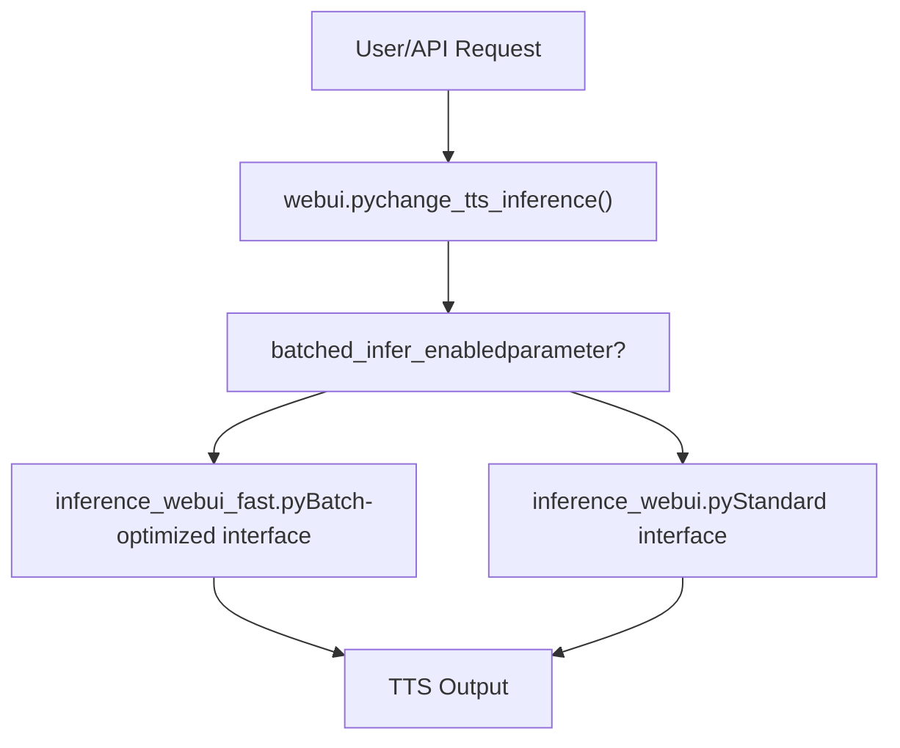
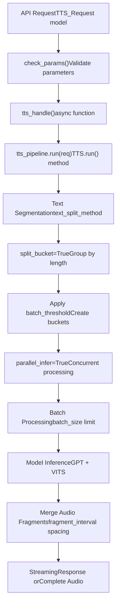
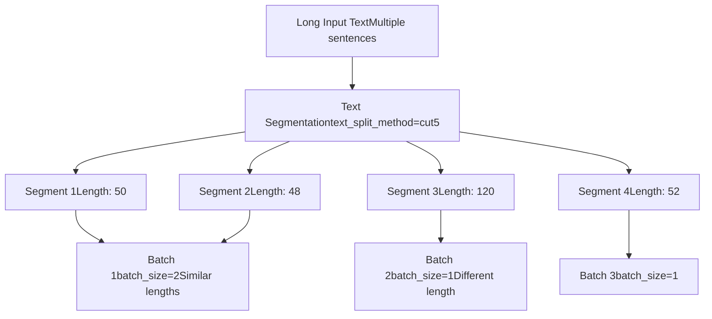
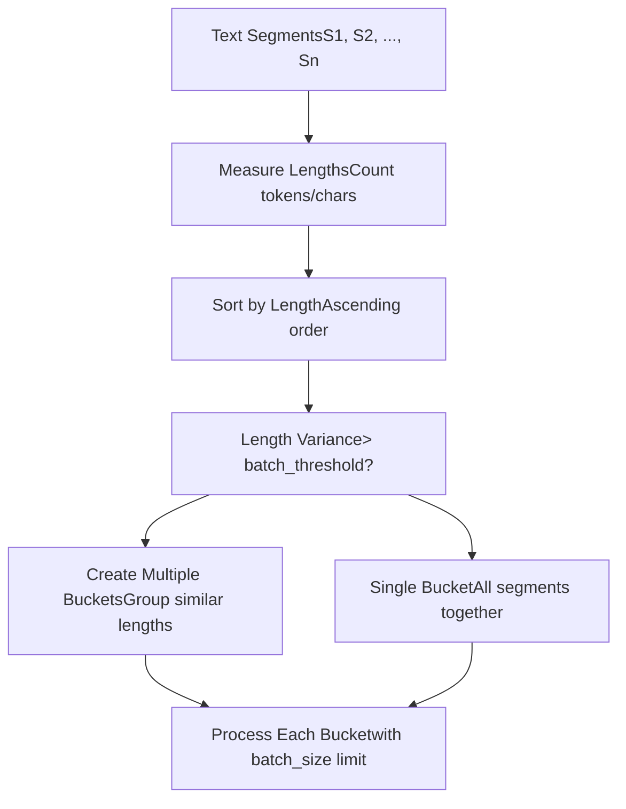
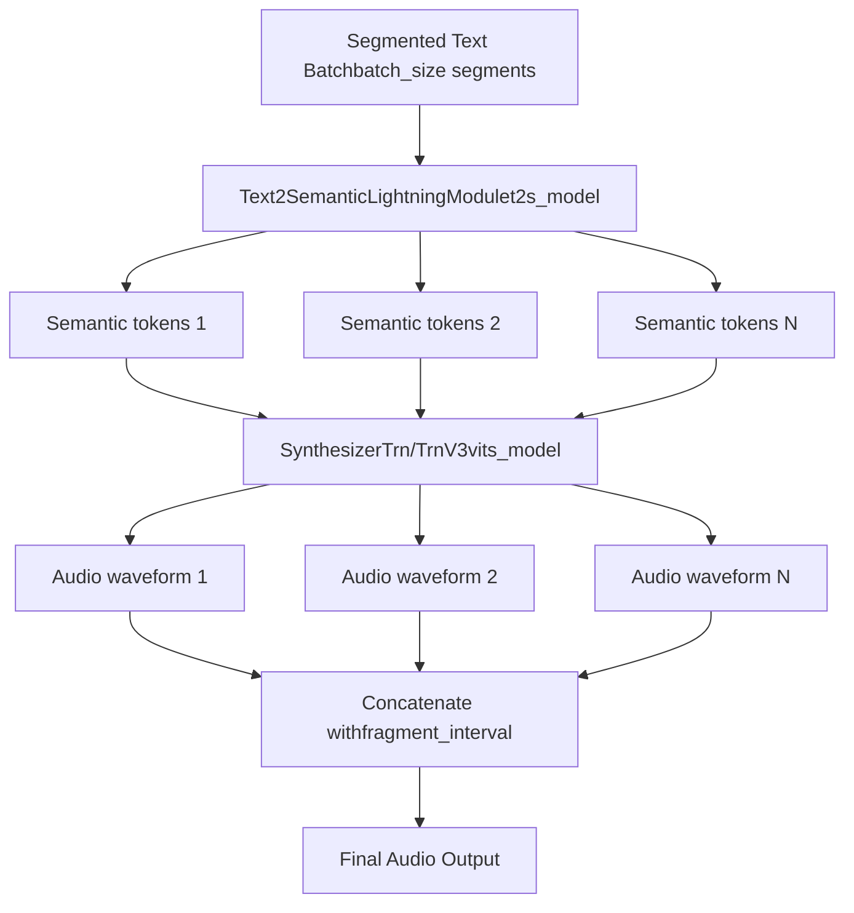
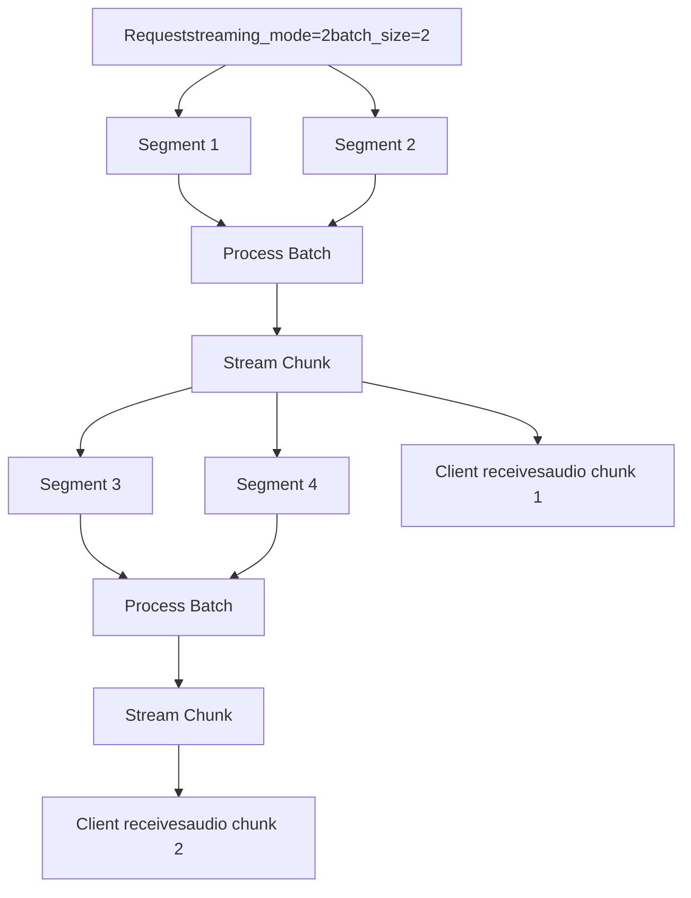
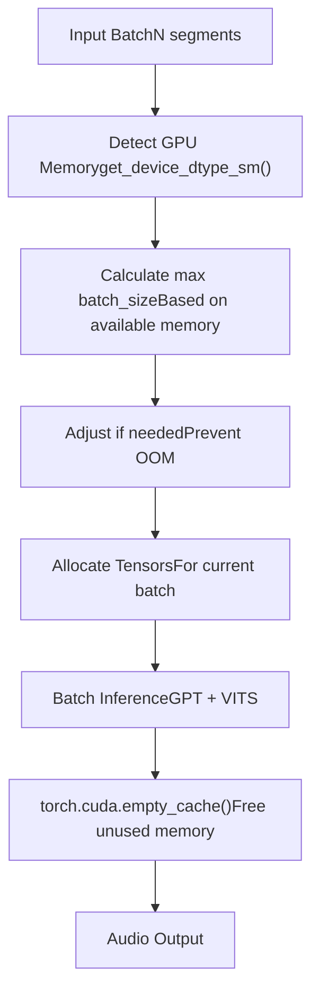

# Batch Processing

Relevant source files

-   [api.py](https://github.com/RVC-Boss/GPT-SoVITS/blob/c767f0b8/api.py)
-   [config.py](https://github.com/RVC-Boss/GPT-SoVITS/blob/c767f0b8/config.py)
-   [webui.py](https://github.com/RVC-Boss/GPT-SoVITS/blob/c767f0b8/webui.py)

## Purpose and Scope

This document explains how GPT-SoVITS handles batch processing for efficient generation of speech from multiple text inputs or long texts that require segmentation. Batch processing enables parallel inference and optimized resource utilization. For single-utterance inference workflows, see [TTS Inference Process](/RVC-Boss/GPT-SoVITS/7.1-tts-inference-process). For API integration details, see [REST API](/RVC-Boss/GPT-SoVITS/3.3-rest-api).

## Overview

Batch processing in GPT-SoVITS provides two primary approaches:

1.  **Fast Inference Mode**: A specialized interface (`inference_webui_fast.py`) optimized for batch operations
2.  **Batch Parameters**: Configurable options in the API and TTS pipeline for controlling batching behavior

These mechanisms enable efficient processing of long texts, multiple requests, and parallel inference across text segments.

## Batch Processing Modes

### Fast Inference WebUI Selection

The system provides two inference interfaces that are selected based on the batch processing requirements:


Sources: [webui.py331-363](https://github.com/RVC-Boss/GPT-SoVITS/blob/c767f0b8/webui.py#L331-L363)

The selection occurs in the `change_tts_inference` function, which spawns different inference processes:

-   Line 334: Fast mode uses `inference_webui_fast.py`
-   Line 336: Standard mode uses `inference_webui.py`

### Standard Mode with Batch Parameters

Even without the fast inference interface, batch processing is supported through configurable parameters that control text segmentation and parallel processing.

## Batch Processing Parameters

The following parameters control batch processing behavior across API endpoints:

| Parameter | Type | Default | Description |
| --- | --- | --- | --- |
| `batch_size` | int | 1 | Number of semantic token sequences processed in parallel |
| `batch_threshold` | float | 0.75 | Threshold for splitting batches based on length variance |
| `split_bucket` | bool | True | Enable bucketing of similar-length segments for efficient batching |
| `parallel_infer` | bool | True | Enable parallel inference across text segments |
| `text_split_method` | str | "cut5" | Algorithm for splitting long text into segments |
| `fragment_interval` | float | 0.3 | Time interval (seconds) between concatenated audio fragments |

Sources: [api\_v2.py154-178](https://github.com/RVC-Boss/GPT-SoVITS/blob/c767f0b8/api_v2.py#L154-L178) [api.py39-93](https://github.com/RVC-Boss/GPT-SoVITS/blob/c767f0b8/api.py#L39-L93)

## API Batch Processing

### Request Structure

Both `api.py` and `api_v2.py` support batch parameters in GET and POST requests to the `/tts` endpoint.

**POST Request Structure**:

```
{    "text": "Long text requiring segmentation...",    "text_lang": "zh",    "ref_audio_path": "reference.wav",    "prompt_lang": "zh",    "prompt_text": "Reference transcript",    "batch_size": 4,    "batch_threshold": 0.75,    "split_bucket": true,    "parallel_infer": true,    "text_split_method": "cut5",    "fragment_interval": 0.3}
```
Sources: [api\_v2.py22-48](https://github.com/RVC-Boss/GPT-SoVITS/blob/c767f0b8/api_v2.py#L22-L48) [api.py39-93](https://github.com/RVC-Boss/GPT-SoVITS/blob/c767f0b8/api.py#L39-L93)

### Batch Processing Pipeline


Sources: [api\_v2.py345-446](https://github.com/RVC-Boss/GPT-SoVITS/blob/c767f0b8/api_v2.py#L345-L446) [api.py809-1031](https://github.com/RVC-Boss/GPT-SoVITS/blob/c767f0b8/api.py#L809-L1031)

## Text Segmentation Strategies

The `text_split_method` parameter determines how long texts are divided into processable segments before batching.

### Available Segmentation Methods

The system supports multiple text segmentation strategies retrieved via `get_cut_method_names()`:

-   `cut0`: No splitting (process entire text)
-   `cut1`: Split by sentence boundaries
-   `cut2`: Split by punctuation marks
-   `cut3`: Split by character limit
-   `cut4`: Split by semantic boundaries
-   `cut5`: Balanced splitting (default, optimizes for quality and efficiency)

Sources: [api\_v2.py131](https://github.com/RVC-Boss/GPT-SoVITS/blob/c767f0b8/api_v2.py#L131-L131) [GPT\_SoVITS/TTS\_infer\_pack/TTS.py35](https://github.com/RVC-Boss/GPT-SoVITS/blob/c767f0b8/GPT_SoVITS/TTS_infer_pack/TTS.py#L35-L35)

### Segmentation and Batching Flow


Sources: [api\_v2.py312-343](https://github.com/RVC-Boss/GPT-SoVITS/blob/c767f0b8/api_v2.py#L312-L343) [api\_v2.py361](https://github.com/RVC-Boss/GPT-SoVITS/blob/c767f0b8/api_v2.py#L361-L361)

## Bucket Splitting Algorithm

When `split_bucket=True`, segments are grouped by similar lengths to minimize padding overhead and maximize GPU utilization.

### Bucket Creation Logic


**Algorithm**: The `batch_threshold` parameter (default 0.75) controls bucket splitting. If the ratio of min\_length/max\_length in a potential bucket falls below this threshold, segments are split into separate buckets to reduce padding.

Sources: [api\_v2.py166-167](https://github.com/RVC-Boss/GPT-SoVITS/blob/c767f0b8/api_v2.py#L166-L167)

## Parallel Inference

When `parallel_infer=True`, the system processes multiple text segments concurrently through both GPT and VITS stages.

### Parallel Processing Architecture


Sources: [api\_v2.py173](https://github.com/RVC-Boss/GPT-SoVITS/blob/c767f0b8/api_v2.py#L173-L173) [GPT\_SoVITS/TTS\_infer\_pack/TTS.py421-466](https://github.com/RVC-Boss/GPT-SoVITS/blob/c767f0b8/GPT_SoVITS/TTS_infer_pack/TTS.py#L421-L466)

**Processing Flow**:

1.  Text segments are encoded to phonemes with BERT features
2.  GPT model generates semantic tokens for each segment (can be parallelized)
3.  VITS model synthesizes audio from semantic tokens (parallelizable)
4.  Audio fragments are concatenated with `fragment_interval` spacing

## TTS Pipeline Integration

Batch processing is integrated into the core `TTS` class that orchestrates the inference pipeline.

### Key Components


**TTS.run() Method**: The main entry point for batch inference, accepting a request dictionary with batch parameters and yielding audio chunks.

Sources: [GPT\_SoVITS/TTS\_infer\_pack/TTS.py421-466](https://github.com/RVC-Boss/GPT-SoVITS/blob/c767f0b8/GPT_SoVITS/TTS_infer_pack/TTS.py#L421-L466) [GPT\_SoVITS/TTS\_infer\_pack/TTS.py217-419](https://github.com/RVC-Boss/GPT-SoVITS/blob/c767f0b8/GPT_SoVITS/TTS_infer_pack/TTS.py#L217-L419) [GPT\_SoVITS/TTS\_infer\_pack/TTS.py448-450](https://github.com/RVC-Boss/GPT-SoVITS/blob/c767f0b8/GPT_SoVITS/TTS_infer_pack/TTS.py#L448-L450)

## Streaming Mode with Batching

Batch processing can be combined with streaming for real-time audio generation as segments are processed.

### Streaming Modes

| Mode Value | Type | Description | Latency | Quality |
| --- | --- | --- | --- | --- |
| 0 | int or False | Disabled - return complete audio | Highest | Best |
| 1 | int or True | Best quality - complete segments | High | Best |
| 2 | int | Medium - chunked streaming | Medium | Good |
| 3 | int | Fast - minimal chunks | Lowest | Acceptable |

Sources: [api\_v2.py172](https://github.com/RVC-Boss/GPT-SoVITS/blob/c767f0b8/api_v2.py#L172-L172) [api\_v2.py44](https://github.com/RVC-Boss/GPT-SoVITS/blob/c767f0b8/api_v2.py#L44-L44)

### Streaming Batch Processing Flow


**Streaming Implementation**: In `tts_handle()` function, when `streaming_mode` is enabled, a generator function yields audio chunks as they are produced, wrapped with appropriate headers for WAV format.

Sources: [api\_v2.py388-438](https://github.com/RVC-Boss/GPT-SoVITS/blob/c767f0b8/api_v2.py#L388-L438)

### Streaming-Specific Parameters

-   `overlap_length` (int, default 2): Number of semantic tokens overlapping between chunks to ensure smooth transitions
-   `min_chunk_length` (int, default 16): Minimum semantic token length per chunk, directly affects audio chunk duration

Sources: [api\_v2.py177-178](https://github.com/RVC-Boss/GPT-SoVITS/blob/c767f0b8/api_v2.py#L177-L178) [api\_v2.py45-46](https://github.com/RVC-Boss/GPT-SoVITS/blob/c767f0b8/api_v2.py#L45-L46)

## Performance Considerations

### Batch Size Selection

Optimal `batch_size` depends on available GPU memory. The system in `config.py` automatically determines default batch sizes based on detected hardware:

**Auto-Configuration Logic**:

```
# From config.py logicif is_gpu_ok:    minmem = min(mem)    default_batch_size = int(minmem // 2 if version not in v3v4set else minmem // 8)else:    default_batch_size = int(psutil.virtual_memory().total / 1024 / 1024 / 1024 / 4)
```
**Recommendations**:

-   V1/V2/V2Pro models: `batch_size = GPU_memory_GB // 2`
-   V3/V4 models: `batch_size = GPU_memory_GB // 8` (CFM models require more memory)

Sources: [webui.py104-139](https://github.com/RVC-Boss/GPT-SoVITS/blob/c767f0b8/webui.py#L104-L139) [config.py148-196](https://github.com/RVC-Boss/GPT-SoVITS/blob/c767f0b8/config.py#L148-L196)

### Memory Management Strategy


**Memory Management**: The system uses half precision (`is_half=True`) when supported to reduce memory usage. Automatic detection in `config.py` determines precision based on GPU compute capability.

Sources: [config.py148-196](https://github.com/RVC-Boss/GPT-SoVITS/blob/c767f0b8/config.py#L148-L196) [GPT\_SoVITS/TTS\_infer\_pack/TTS.py691-728](https://github.com/RVC-Boss/GPT-SoVITS/blob/c767f0b8/GPT_SoVITS/TTS_infer_pack/TTS.py#L691-L728)

## Environment Configuration

### Configuration Files

**tts\_infer.yaml**: Stores default inference settings including device and precision

```
custom:  device: cuda  is_half: true  version: v2  t2s_weights_path: path/to/gpt.ckpt  vits_weights_path: path/to/sovits.pth  # ... other versions
```
Sources: [GPT\_SoVITS/configs/tts\_infer.yaml1-57](https://github.com/RVC-Boss/GPT-SoVITS/blob/c767f0b8/GPT_SoVITS/configs/tts_infer.yaml#L1-L57)

### Runtime Configuration via config.py

The `config.py` module manages:

-   GPU detection and device selection via `get_device_dtype_sm()`
-   Memory-based batch size defaults
-   Precision settings based on hardware capabilities

**Key Variables**:

-   `infer_device`: Selected inference device
-   `is_half`: Whether to use FP16 precision
-   `IS_GPU`: Boolean indicating GPU availability
-   `memset`: Set of available GPU memory sizes

Sources: [config.py1-219](https://github.com/RVC-Boss/GPT-SoVITS/blob/c767f0b8/config.py#L1-L219) [config.py148-196](https://github.com/RVC-Boss/GPT-SoVITS/blob/c767f0b8/config.py#L148-L196)

## Error Handling

The batch processing system includes comprehensive error handling:

### Common Error Scenarios

1.  **Parameter Validation**: `check_params()` validates all batch parameters before processing
2.  **Out of Memory**: Automatically caught and returns error with suggestion to reduce `batch_size`
3.  **Model Loading Failures**: Gracefully falls back to CPU if GPU unavailable
4.  **Invalid Text Split Method**: Returns HTTP 400 with list of valid methods

**Error Response Format**:

```
{    "code": 400,    "message": "tts failed",    "Exception": "CUDA out of memory. Tried to allocate X GB..."}
```
Sources: [api\_v2.py305-342](https://github.com/RVC-Boss/GPT-SoVITS/blob/c767f0b8/api_v2.py#L305-L342) [api\_v2.py444-445](https://github.com/RVC-Boss/GPT-SoVITS/blob/c767f0b8/api_v2.py#L444-L445)

## Usage Examples

### Example 1: Basic Batch Processing via API

```
import requests url = "http://127.0.0.1:9880/tts"payload = {    "text": "这是一段很长的文本，需要分段处理才能高效生成语音。系统会自动将文本切分成多个片段。",    "text_lang": "zh",    "ref_audio_path": "reference.wav",    "prompt_lang": "zh",    "prompt_text": "参考音频的文本内容",    "batch_size": 4,    "batch_threshold": 0.75,    "split_bucket": True,    "parallel_infer": True,    "text_split_method": "cut5"} response = requests.post(url, json=payload)with open("output.wav", "wb") as f:    f.write(response.content)
```
### Example 2: Streaming Batch Processing

```
import requests url = "http://127.0.0.1:9880/tts"payload = {    "text": "长文本内容用于实时流式生成...",    "text_lang": "zh",    "ref_audio_path": "reference.wav",    "prompt_lang": "zh",    "streaming_mode": 2,  # Medium quality streaming    "batch_size": 2,    "overlap_length": 2,    "min_chunk_length": 16,    "parallel_infer": True} response = requests.post(url, json=payload, stream=True)for chunk in response.iter_content(chunk_size=4096):    if chunk:        # Process or play audio chunk in real-time        audio_player.play(chunk)
```
### Example 3: Launching Fast Batch Inference via WebUI

The fast batch inference mode is enabled through the WebUI's `change_tts_inference` function:

```
# In webui.pychange_tts_inference(    bert_path="GPT_SoVITS/pretrained_models/chinese-roberta-wwm-ext-large",    cnhubert_base_path="GPT_SoVITS/pretrained_models/chinese-hubert-base",    gpu_number="0",    gpt_path="path/to/gpt_model.ckpt",    sovits_path="path/to/sovits_model.pth",    batched_infer_enabled=True  # Enable fast batch mode)
```
This spawns `inference_webui_fast.py` instead of the standard interface.

Sources: [webui.py331-363](https://github.com/RVC-Boss/GPT-SoVITS/blob/c767f0b8/webui.py#L331-L363)

## Integration with Other Components

Batch processing interacts with multiple system components:

-   **Text Processing Pipeline** ([#2.2](/RVC-Boss/GPT-SoVITS/2.2-text-processing-pipeline)): Provides language detection and normalization before segmentation
-   **Core Model Architectures** ([#2.1](/RVC-Boss/GPT-SoVITS/2.1-core-model-architectures)): GPT and VITS models process batched tensor inputs
-   **Training Pipeline** ([#2.3](/RVC-Boss/GPT-SoVITS/2.3-training-pipeline)): Training also uses batch processing for efficiency
-   **Inference Pipeline** ([#7.1](/RVC-Boss/GPT-SoVITS/7.1-tts-inference-process)): Core TTS pipeline orchestrates batch processing
-   **REST API** ([#3.3](/RVC-Boss/GPT-SoVITS/3.3-rest-api)): Exposes batch parameters through API endpoints

## Summary

GPT-SoVITS batch processing provides:

1.  **Dual Interface Options**: Standard and optimized fast inference modes
2.  **Configurable Parameters**: Fine-grained control over batching strategy via `batch_size`, `batch_threshold`, `split_bucket`
3.  **Intelligent Segmentation**: Multiple text splitting methods with automatic bucketing
4.  **Parallel Inference**: Concurrent processing of segments when `parallel_infer=True`
5.  **Streaming Support**: Real-time audio generation with batch processing
6.  **Memory Optimization**: Automatic batch size adjustment based on available GPU memory
7.  **API Integration**: Full batch processing support through REST endpoints

These capabilities enable efficient processing of long texts, multiple requests, and resource-constrained scenarios while maintaining audio quality.

Sources: [webui.py1-1529](https://github.com/RVC-Boss/GPT-SoVITS/blob/c767f0b8/webui.py#L1-L1529) [api\_v2.py1-577](https://github.com/RVC-Boss/GPT-SoVITS/blob/c767f0b8/api_v2.py#L1-L577) [api.py1-1500](https://github.com/RVC-Boss/GPT-SoVITS/blob/c767f0b8/api.py#L1-L1500) [GPT\_SoVITS/TTS\_infer\_pack/TTS.py1-1400](https://github.com/RVC-Boss/GPT-SoVITS/blob/c767f0b8/GPT_SoVITS/TTS_infer_pack/TTS.py#L1-L1400) [config.py1-219](https://github.com/RVC-Boss/GPT-SoVITS/blob/c767f0b8/config.py#L1-L219)
