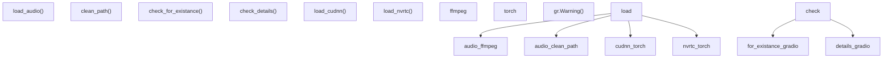
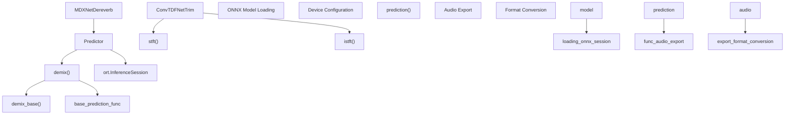

# Utilities and Tools

Relevant source files

-   [api.py](https://github.com/RVC-Boss/GPT-SoVITS/blob/c767f0b8/api.py)
-   [config.py](https://github.com/RVC-Boss/GPT-SoVITS/blob/c767f0b8/config.py)
-   [tools/my\_utils.py](https://github.com/RVC-Boss/GPT-SoVITS/blob/c767f0b8/tools/my_utils.py)
-   [tools/slice\_audio.py](https://github.com/RVC-Boss/GPT-SoVITS/blob/c767f0b8/tools/slice_audio.py)
-   [tools/slicer2.py](https://github.com/RVC-Boss/GPT-SoVITS/blob/c767f0b8/tools/slicer2.py)
-   [tools/subfix\_webui.py](https://github.com/RVC-Boss/GPT-SoVITS/blob/c767f0b8/tools/subfix_webui.py)
-   [tools/uvr5/webui.py](https://github.com/RVC-Boss/GPT-SoVITS/blob/c767f0b8/tools/uvr5/webui.py)
-   [webui.py](https://github.com/RVC-Boss/GPT-SoVITS/blob/c767f0b8/webui.py)

This document covers the utility functions, development tools, and support systems that facilitate GPT-SoVITS operations but are not part of the core TTS pipeline. These include common helper functions, dataset management tools, audio processing utilities, internationalization support, and development aids.

For information about the core TTS inference process, see [Inference Pipeline](/RVC-Boss/GPT-SoVITS/2.4-inference-pipeline). For training-specific tools, see [Training Pipeline](/RVC-Boss/GPT-SoVITS/2.3-training-pipeline). For audio separation and ASR tools integrated into the main workflow, see [Data Preparation](/RVC-Boss/GPT-SoVITS/5-data-preparation).

## Common Utility Functions

The [\`tools/my\_utils.py\`](https://github.com/RVC-Boss/GPT-SoVITS/blob/c767f0b8/`tools/my_utils.py`) module provides essential utility functions used throughout the GPT-SoVITS codebase for audio loading, path handling, file validation, and system setup.

### Core Utility Functions


**Audio Loading and Path Management**

The `load_audio()` function provides robust audio file loading with automatic format conversion and resampling:

-   Uses FFmpeg for format conversion and resampling
-   Supports mono channel conversion
-   Handles various audio formats through FFmpeg
-   Includes path cleaning with `clean_path()` to handle whitespace and encoding issues

**File Validation System**

The validation functions ensure data integrity before training or processing:

-   `check_for_existance()` validates file and directory existence for training datasets
-   `check_details()` performs deeper validation of dataset structure and content
-   Provides user feedback through Gradio warnings for missing components

**CUDA Library Management**

Platform-specific CUDA library loading functions ensure proper GPU acceleration:

-   `load_cudnn()` loads cuDNN libraries on Windows and Linux
-   `load_nvrtc()` loads NVRTC (NVIDIA Runtime Compilation) libraries
-   Handles DLL/SO file discovery and loading with error handling

Sources: [tools/my\_utils.py16-37](https://github.com/RVC-Boss/GPT-SoVITS/blob/c767f0b8/tools/my_utils.py#L16-L37) [tools/my\_utils.py49-87](https://github.com/RVC-Boss/GPT-SoVITS/blob/c767f0b8/tools/my_utils.py#L49-L87) [tools/my\_utils.py140-185](https://github.com/RVC-Boss/GPT-SoVITS/blob/c767f0b8/tools/my_utils.py#L140-L185) [tools/my\_utils.py187-232](https://github.com/RVC-Boss/GPT-SoVITS/blob/c767f0b8/tools/my_utils.py#L187-L232)

## Dataset Management Tools

### Audio Annotation WebUI

The [\`tools/subfix\_webui.py\`](https://github.com/RVC-Boss/GPT-SoVITS/blob/c767f0b8/`tools/subfix_webui.py`) provides a specialized web interface for dataset annotation and correction, essential for preparing high-quality training data.

```mermaid
flowchart TD
    b_save_json["b_save_json()"]
    b_save_file["b_save_file()"]
    b_save_list["b_save_list()"]
    set_global["set_global()"]
    b_load_file["b_load_file()"]
    b_load_json["b_load_json()"]
    b_load_list["b_load_list()"]
    reload_data["reload_data()"]
    b_change_index["b_change_index()"]
    b_submit_change["b_submit_change()"]
    b_audio_split["b_audio_split()"]
    b_merge_audio["b_merge_audio()"]
    b_delete_audio["b_delete_audio()"]
    get_next_path["get_next_path()"]
    g_data_json["g_data_json"]
    g_index["g_index"]
    g_batch["g_batch"]

    reload --> data_g_data_json
    b --> change_index_reload_data
    b --> submit_change_g_data_json
    b --> audio_split_get_next_path
    b --> merge_audio_g_data_json
    b --> save_file_b_save_json
    b --> save_file_b_save_list
    set --> global_b_load_file
    b --> load_file_b_load_json
    b --> load_file_b_load_list
```


**Core Features**

The annotation tool supports both JSON and list file formats for dataset management:

| Feature | Function | Description |
| --- | --- | --- |
| Text Editing | `b_submit_change()` | Manual text correction and annotation |
| Audio Splitting | `b_audio_split()` | Split audio at specified timestamps |
| Audio Merging | `b_merge_audio()` | Combine multiple audio segments |
| Batch Navigation | `b_change_index()` | Navigate through large datasets |
| Data Persistence | `b_save_file()` | Save changes to disk |

**Audio Processing Capabilities**

The tool provides direct audio manipulation within the annotation interface:

-   **Audio Splitting**: Creates new segments at specified breakpoints using `librosa` and `soundfile`
-   **Audio Merging**: Combines selected segments with configurable silence intervals
-   **Path Management**: Automatically generates unique filenames for new audio segments
-   **Batch Processing**: Handles multiple files with pagination controls

**Data Format Support**

Supports two primary dataset formats:

-   **JSON Format**: Structured data with configurable key mappings
-   **List Format**: Pipe-separated format (`wav_path|speaker_name|language|text`)

Sources: [tools/subfix\_webui.py275-294](https://github.com/RVC-Boss/GPT-SoVITS/blob/c767f0b8/tools/subfix_webui.py#L275-L294) [tools/subfix\_webui.py148-175](https://github.com/RVC-Boss/GPT-SoVITS/blob/c767f0b8/tools/subfix_webui.py#L148-L175) [tools/subfix\_webui.py177-218](https://github.com/RVC-Boss/GPT-SoVITS/blob/c767f0b8/tools/subfix_webui.py#L177-L218) [tools/subfix\_webui.py221-266](https://github.com/RVC-Boss/GPT-SoVITS/blob/c767f0b8/tools/subfix_webui.py#L221-L266)

## Audio Processing Utilities

### UVR5 Audio Source Separation

The UVR5 (Ultimate Vocal Remover 5) system provides advanced audio source separation capabilities for vocal/instrumental separation and audio enhancement, essential for preparing clean training data.

#### MDX-Net Audio Separation

The [\`tools/uvr5/mdxnet.py\`](https://github.com/RVC-Boss/GPT-SoVITS/blob/c767f0b8/`tools/uvr5/mdxnet.py`) implements MDX-Net models for high-quality audio source separation and dereverb processing.


**Core Classes and Functions**

| Class/Function | Purpose | Key Features |
| --- | --- | --- |
| `ConvTDFNetTrim` | STFT/ISTFT processing for audio tensors | Handles chunking, windowing, frequency padding |
| `Predictor` | ONNX model inference coordinator | Manages model loading, chunked processing, denoising |
| `MDXNetDereverb` | Dereverb-specific processing | Specialized for removing reverb and delay effects |
| `demix()` | High-level separation interface | Handles audio segmentation and margin processing |
| `prediction()` | File I/O and format conversion | Supports wav, flac, mp3 output formats |

**Processing Workflow**

The MDX-Net separation process follows a structured pipeline:

1.  **Model Initialization**: Loads ONNX models with CUDA/DML/CPU execution providers
2.  **Audio Segmentation**: Splits input into overlapping chunks with configurable margins
3.  **STFT Processing**: Converts audio to frequency domain using `ConvTDFNetTrim.stft()`
4.  **Neural Separation**: Applies trained model to separate sources
5.  **ISTFT Reconstruction**: Converts back to time domain using `ConvTDFNetTrim.istft()`
6.  **Output Generation**: Saves separated vocals and accompaniment

Sources: [tools/uvr5/mdxnet.py15-71](https://github.com/RVC-Boss/GPT-SoVITS/blob/c767f0b8/tools/uvr5/mdxnet.py#L15-L71) [tools/uvr5/mdxnet.py74-123](https://github.com/RVC-Boss/GPT-SoVITS/blob/c767f0b8/tools/uvr5/mdxnet.py#L74-L123) [tools/uvr5/mdxnet.py208-224](https://github.com/RVC-Boss/GPT-SoVITS/blob/c767f0b8/tools/uvr5/mdxnet.py#L208-L224)

#### VR Audio Processing Models

The [\`tools/uvr5/vr.py\`](https://github.com/RVC-Boss/GPT-SoVITS/blob/c767f0b8/`tools/uvr5/vr.py`) implements Vocal Removal (VR) models for vocal/instrumental separation and echo removal using multi-band processing.

```mermaid
flowchart TD
    AudioPre["AudioPre"]
    AudioPreDeEcho["AudioPreDeEcho"]
    ModelParameters["ModelParameters"]
    band_processing["Multi-band STFT"]
    spec_combination["spec_utils.combine_spectrograms()"]
    high_end_processing["High-end Processing"]
    CascadedASPPNet["Nets.CascadedASPPNet"]
    CascadedNet["CascadedNet"]
    inference_func["inference()"]
    mask_application["Mask Application"]
    spectrogram_separation["Spectrogram Separation"]
    wave_reconstruction["spec_utils.cmb_spectrogram_to_wave()"]

    AudioPre --> ModelParameters
    AudioPre --> CascadedASPPNet
    AudioPreDeEcho --> CascadedNet
    ModelParameters --> band_processing
    band --> processing_spec_combination
    CascadedASPPNet --> inference_func
    CascadedNet --> inference_func
    inference --> func_mask_application
    mask --> application_spectrogram_separation
    spectrogram --> separation_wave_reconstruction
    high --> end_processing_wave_reconstruction
```


**Model Architecture Details**

| Component | Function | Technical Details |
| --- | --- | --- |
| `AudioPre` | Standard vocal separation | Uses 4-band processing with `CascadedASPPNet` |
| `AudioPreDeEcho` | Echo/delay removal | Uses `CascadedNet` with 48/64 output channels |
| `ModelParameters` | Band configuration | Loads from `modelparams/4band_v2.json` or `4band_v3.json` |
| Multi-band STFT | Frequency analysis | Processes different frequency bands separately |
| High-end Processing | Frequency reconstruction | Uses mirroring for high-frequency content |

**Processing Features**

-   **Multi-band Architecture**: Separate processing for different frequency ranges
-   **Aggressive Processing**: Configurable aggressiveness levels for separation quality
-   **Format Support**: Output in WAV, FLAC, or other formats via FFmpeg conversion
-   **Memory Management**: Chunked processing for large files
-   **Quality Options**: TTA (Test Time Augmentation) for improved results

Sources: [tools/uvr5/vr.py19-44](https://github.com/RVC-Boss/GPT-SoVITS/blob/c767f0b8/tools/uvr5/vr.py#L19-L44) [tools/uvr5/vr.py190-216](https://github.com/RVC-Boss/GPT-SoVITS/blob/c767f0b8/tools/uvr5/vr.py#L190-L216) [tools/uvr5/vr.py45-188](https://github.com/RVC-Boss/GPT-SoVITS/blob/c767f0b8/tools/uvr5/vr.py#L45-L188)

### Audio Slicing Tool

The [\`tools/slice\_audio.py\`](https://github.com/RVC-Boss/GPT-SoVITS/blob/c767f0b8/`tools/slice_audio.py`) provides automated audio segmentation functionality used in dataset preparation workflows.

```mermaid
flowchart TD
    inp["Audio Input(File or Directory)"]
    input_validation["Input Validation"]
    slicer_params["Slicer Parameterssr=32000thresholdmin_lengthmin_intervalhop_sizemax_sil_kept"]
    slicer_init["Slicer(sr=32000)"]
    load_audio_func["load_audio()"]
    slice_audio["slicer.slice()"]
    save_segments["Save Audio Segments"]
    opt_root["Output Directory"]
    audio_segments["Segmented Audio Files"]

    inp --> input_validation
    input --> validation_load_audio_func
    slicer --> params_slicer_init
    load --> audio_func_slice_audio
    slicer --> init_slice_audio
    slice --> audio_save_segments
    save --> segments_opt_root
    opt --> root_audio_segments
```


**Slicing Parameters**

The audio slicer accepts configurable parameters for optimal segmentation:

| Parameter | Purpose | Default/Range |
| --- | --- | --- |
| `threshold` | Volume threshold for silence detection | User-defined |
| `min_length` | Minimum segment length | User-defined |
| `min_interval` | Minimum interval between cuts | User-defined |
| `hop_size` | Analysis window hop size | User-defined |
| `max_sil_kept` | Maximum silence to retain | User-defined |
| `_max` | Amplitude normalization factor | User-defined |
| `alpha` | Audio mixing ratio | User-defined |

**Processing Workflow**

The slicing process handles both single files and batch directory processing:

1.  **Input Validation**: Checks if input is file or directory
2.  **Audio Loading**: Uses `load_audio()` from `my_utils` for robust file handling
3.  **Segmentation**: Applies `Slicer` algorithm with silence detection
4.  **Output Management**: Saves segments to organized output directory structure

Sources: [tools/slice\_audio.py13-22](https://github.com/RVC-Boss/GPT-SoVITS/blob/c767f0b8/tools/slice_audio.py#L13-L22) [tools/slice\_audio.py1-11](https://github.com/RVC-Boss/GPT-SoVITS/blob/c767f0b8/tools/slice_audio.py#L1-L11)

## Internationalization System

The internationalization system provides multi-language support for GPT-SoVITS user interfaces through a centralized translation management system.

### I18n Architecture

```mermaid
flowchart TD
    I18nAuto["I18nAuto Class"]
    scan_language_list["scan_language_list()"]
    language_detection["Language Detection"]
    en_US["en_US.json"]
    zh_CN["zh_CN.json"]
    ja_JP["ja_JP.json"]
    es_ES["es_ES.json"]
    fr_FR["fr_FR.json"]
    ru_RU["ru_RU.json"]
    other_locales["...other locales"]
    ui_strings["UI String Keys"]
    error_messages["Error Message Keys"]
    tooltips["Tooltip Keys"]
    model_descriptions["Model Description Keys"]
    webui["webui.py"]
    inference_webui["inference_webui.py"]
    subfix_webui["subfix_webui.py"]

    I18nAuto --> scan_language_list
    I18nAuto --> language_detection
    en --> US_I18nAuto
    zh --> CN_I18nAuto
    ja --> JP_I18nAuto
    es --> ES_I18nAuto
    fr --> FR_I18nAuto
    ru --> RU_I18nAuto
    other --> locales_I18nAuto
    ui --> strings_I18nAuto
    error --> messages_I18nAuto
    tooltips --> I18nAuto
    model --> descriptions_I18nAuto
    I18nAuto --> webui
    I18nAuto --> inference_webui
    I18nAuto --> subfix_webui
```


**Supported Languages**

The system currently supports the following languages with complete translation files:

| Language | Locale Code | File |
| --- | --- | --- |
| English | `en_US` | `tools/i18n/locale/en_US.json` |
| Simplified Chinese | `zh_CN` | `tools/i18n/locale/zh_CN.json` |
| Traditional Chinese | `zh_TW` | `tools/i18n/locale/zh_TW.json` |
| Hong Kong Chinese | `zh_HK` | `tools/i18n/locale/zh_HK.json` |
| Singapore Chinese | `zh_SG` | `tools/i18n/locale/zh_SG.json` |
| Japanese | `ja_JP` | `tools/i18n/locale/ja_JP.json` |
| Spanish | `es_ES` | `tools/i18n/locale/es_ES.json` |
| French | `fr_FR` | `tools/i18n/locale/fr_FR.json` |
| Italian | `it_IT` | `tools/i18n/locale/it_IT.json` |
| Russian | `ru_RU` | `tools/i18n/locale/ru_RU.json` |
| Turkish | `tr_TR` | `tools/i18n/locale/tr_TR.json` |

**Translation Coverage**

Each locale file contains translations for major system components:

-   **UI Elements**: Button labels, form fields, navigation elements
-   **Training Messages**: GPT training, SoVITS training, model information
-   **Error Handling**: File validation, path errors, model loading issues
-   **Tool Descriptions**: UVR5, ASR, audio processing tools
-   **Parameter Explanations**: Training parameters, inference settings

**Integration Pattern**

The i18n system integrates into GPT-SoVITS applications through a consistent pattern:

```
from tools.i18n.i18n import I18nAutoi18n = I18nAuto(language=language)# Usage: i18n("translation_key")
```
Sources: [tools/subfix\_webui.py2-4](https://github.com/RVC-Boss/GPT-SoVITS/blob/c767f0b8/tools/subfix_webui.py#L2-L4) [tools/my\_utils.py11-13](https://github.com/RVC-Boss/GPT-SoVITS/blob/c767f0b8/tools/my_utils.py#L11-L13) [tools/i18n/locale/en\_US.json1-226](https://github.com/RVC-Boss/GPT-SoVITS/blob/c767f0b8/tools/i18n/locale/en_US.json#L1-L226) [tools/i18n/locale/zh\_CN.json1-226](https://github.com/RVC-Boss/GPT-SoVITS/blob/c767f0b8/tools/i18n/locale/zh_CN.json#L1-L226)

## Development and Configuration Tools

### System Configuration Management

The utilities system provides essential configuration and development support functions that ensure consistent operation across different environments and hardware configurations.


**CUDA Environment Management**

The system automatically detects and configures CUDA libraries for optimal GPU performance:

-   **Dynamic Library Loading**: Automatically discovers and loads cuDNN and NVRTC libraries
-   **Platform Compatibility**: Handles Windows (`.dll`) and Linux (`.so`) library formats
-   **Error Recovery**: Graceful fallback when CUDA is unavailable or misconfigured
-   **Path Discovery**: Searches standard PyTorch installation paths for required libraries

**Dataset Validation Framework**

Comprehensive validation ensures data integrity before expensive training operations:

-   **Training Dataset Validation**: Verifies presence of required files (BERT features, Hubert features, audio files, semantic tokens)
-   **Path Structure Checking**: Validates expected directory structure and file naming conventions
-   **Content Validation**: Performs basic checks on file contents and formats
-   **User Feedback Integration**: Provides clear error messages through Gradio interface

**Cross-Platform Audio Handling**

Robust audio processing capabilities across different operating systems:

-   **FFmpeg Integration**: Leverages FFmpeg for universal audio format support
-   **Path Normalization**: Handles platform-specific path separators and encoding issues
-   **Error Handling**: Provides descriptive error messages for audio loading failures

Sources: [tools/my\_utils.py140-165](https://github.com/RVC-Boss/GPT-SoVITS/blob/c767f0b8/tools/my_utils.py#L140-L165) [tools/my\_utils.py187-232](https://github.com/RVC-Boss/GPT-SoVITS/blob/c767f0b8/tools/my_utils.py#L187-L232) [tools/my\_utils.py49-87](https://github.com/RVC-Boss/GPT-SoVITS/blob/c767f0b8/tools/my_utils.py#L49-L87) [tools/my\_utils.py90-138](https://github.com/RVC-Boss/GPT-SoVITS/blob/c767f0b8/tools/my_utils.py#L90-L138)
