# Audio Processing Utilities

Relevant source files

-   [tools/my\_utils.py](https://github.com/RVC-Boss/GPT-SoVITS/blob/c767f0b8/tools/my_utils.py)
-   [tools/slice\_audio.py](https://github.com/RVC-Boss/GPT-SoVITS/blob/c767f0b8/tools/slice_audio.py)
-   [tools/slicer2.py](https://github.com/RVC-Boss/GPT-SoVITS/blob/c767f0b8/tools/slicer2.py)
-   [tools/subfix\_webui.py](https://github.com/RVC-Boss/GPT-SoVITS/blob/c767f0b8/tools/subfix_webui.py)
-   [tools/uvr5/webui.py](https://github.com/RVC-Boss/GPT-SoVITS/blob/c767f0b8/tools/uvr5/webui.py)

## Purpose and Scope

This document covers the audio processing utilities in GPT-SoVITS that handle audio file loading, path manipulation, silence-based segmentation, vocal separation, and dataset annotation. These utilities are primarily located in the `tools/` directory and serve as foundational components for the data preparation pipeline.

For information about the complete data preparation workflow that uses these utilities, see [Data Preparation](/RVC-Boss/GPT-SoVITS/5-data-preparation). For ASR transcription tools, see [Automatic Speech Recognition](/RVC-Boss/GPT-SoVITS/5.2-automatic-speech-recognition). For feature extraction processes, see [Feature Extraction Scripts](/RVC-Boss/GPT-SoVITS/5.3-feature-extraction-scripts).

---

## System Overview

The audio processing utilities provide three main categories of functionality:

1.  **Core Utilities** - Basic audio loading, path cleaning, and file validation
2.  **Preprocessing Tools** - Vocal separation (UVR5) and silence-based slicing
3.  **Annotation Tools** - Manual dataset curation and audio editing

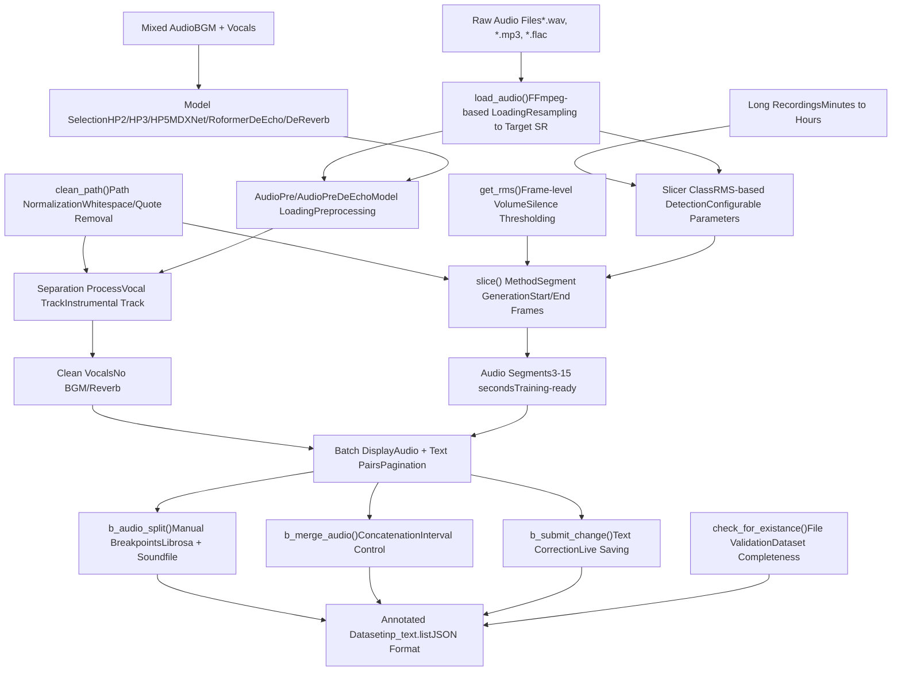
**Sources:** [tools/my\_utils.py1-232](https://github.com/RVC-Boss/GPT-SoVITS/blob/c767f0b8/tools/my_utils.py#L1-L232) [tools/uvr5/webui.py1-225](https://github.com/RVC-Boss/GPT-SoVITS/blob/c767f0b8/tools/uvr5/webui.py#L1-L225) [tools/slicer2.py1-231](https://github.com/RVC-Boss/GPT-SoVITS/blob/c767f0b8/tools/slicer2.py#L1-L231) [tools/subfix\_webui.py1-426](https://github.com/RVC-Boss/GPT-SoVITS/blob/c767f0b8/tools/subfix_webui.py#L1-L426)

---

## Core Audio Loading and Path Utilities

### my\_utils.py Module

The `my_utils` module provides essential functions used throughout the codebase for audio file operations and path handling.

#### load\_audio() Function

The `load_audio()` function is the primary audio loading interface, using FFmpeg to handle various audio formats with automatic resampling.

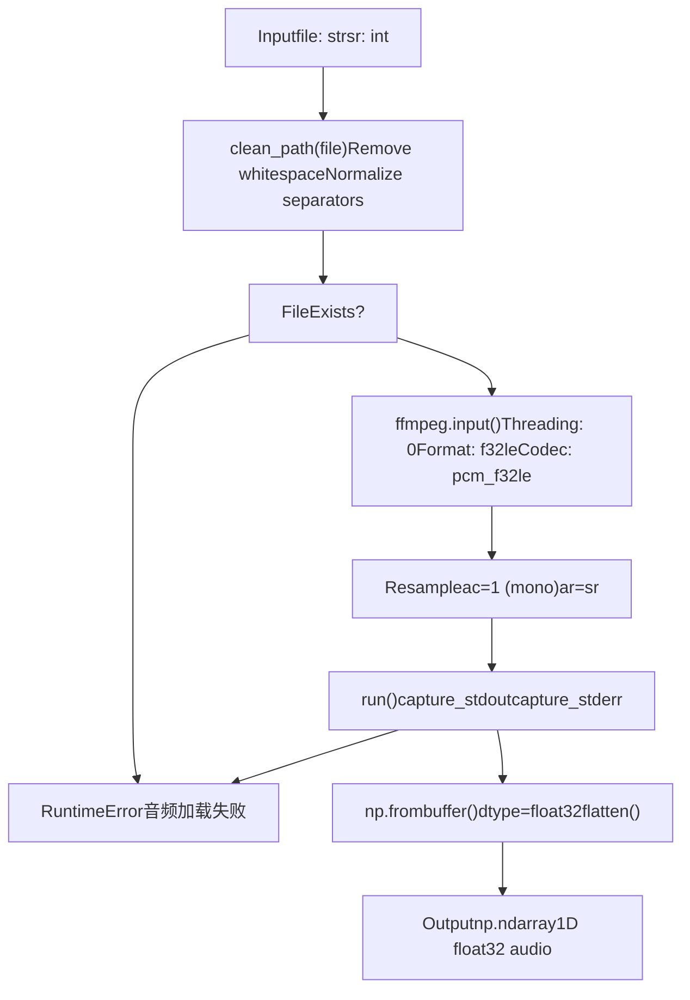
**Key Implementation Details:**

-   **File Path Cleaning**: [tools/my\_utils.py21](https://github.com/RVC-Boss/GPT-SoVITS/blob/c767f0b8/tools/my_utils.py#L21-L21) calls `clean_path()` before processing
-   **FFmpeg Parameters**: [tools/my\_utils.py25-26](https://github.com/RVC-Boss/GPT-SoVITS/blob/c767f0b8/tools/my_utils.py#L25-L26)
    -   `format="f32le"`: 32-bit little-endian float output
    -   `acodec="pcm_f32le"`: PCM float encoding
    -   `ac=1`: Convert to mono
    -   `ar=sr`: Resample to target sample rate
-   **Error Handling**: [tools/my\_utils.py29-35](https://github.com/RVC-Boss/GPT-SoVITS/blob/c767f0b8/tools/my_utils.py#L29-L35) provides graceful error messages
-   **Output Format**: Returns flattened numpy float32 array

**Sources:** [tools/my\_utils.py16-37](https://github.com/RVC-Boss/GPT-SoVITS/blob/c767f0b8/tools/my_utils.py#L16-L37)

#### clean\_path() Function

The `clean_path()` function normalizes file paths to prevent common user input errors.

| Operation | Description | Line Reference |
| --- | --- | --- |
| Trailing Slash Removal | Recursively removes `\` or `/` from path end | [tools/my\_utils.py41-42](https://github.com/RVC-Boss/GPT-SoVITS/blob/c767f0b8/tools/my_utils.py#L41-L42) |
| Separator Normalization | Replaces `/` and `\` with OS-specific separator | [tools/my\_utils.py43](https://github.com/RVC-Boss/GPT-SoVITS/blob/c767f0b8/tools/my_utils.py#L43-L43) |
| Whitespace Stripping | Removes leading/trailing spaces, quotes, newlines | [tools/my\_utils.py44-46](https://github.com/RVC-Boss/GPT-SoVITS/blob/c767f0b8/tools/my_utils.py#L44-L46) |
| Unicode Control Chars | Strips `\u202a` (left-to-right embedding) | [tools/my\_utils.py45](https://github.com/RVC-Boss/GPT-SoVITS/blob/c767f0b8/tools/my_utils.py#L45-L45) |

**Example transformations:**

-   `' "C:/path/to/file.wav"\n '` → `C:\path\to\file.wav` (Windows)
-   `"/home/user/audio.mp3 "` → `/home/user/audio.mp3` (Linux)

**Sources:** [tools/my\_utils.py40-46](https://github.com/RVC-Boss/GPT-SoVITS/blob/c767f0b8/tools/my_utils.py#L40-L46)

#### File Validation Functions

The module provides dataset validation through `check_for_existance()` and `check_details()`.

**check\_for\_existance()** validates training data completeness:

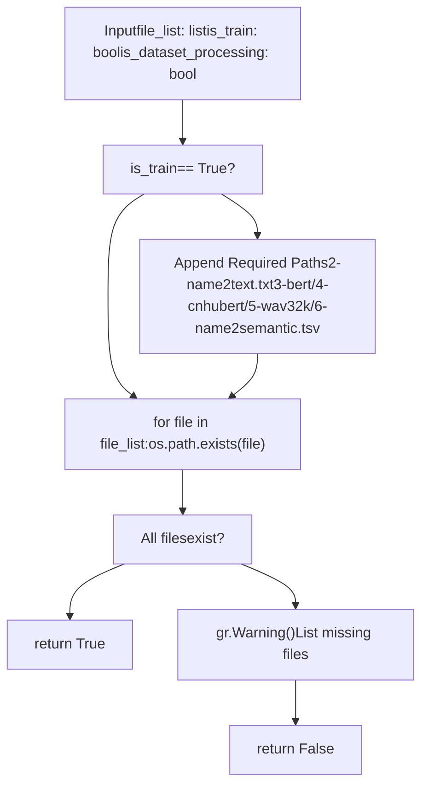
**Training dataset requirements** [tools/my\_utils.py52-56](https://github.com/RVC-Boss/GPT-SoVITS/blob/c767f0b8/tools/my_utils.py#L52-L56):

1.  `2-name2text.txt` - Phoneme sequences
2.  `3-bert/` - BERT features directory
3.  `4-cnhubert/` - CNHubert features directory
4.  `5-wav32k/` - Resampled audio directory
5.  `6-name2semantic.tsv` - Semantic tokens file

**check\_details()** validates dataset format correctness:

-   **List file format**: [tools/my\_utils.py93-95](https://github.com/RVC-Boss/GPT-SoVITS/blob/c767f0b8/tools/my_utils.py#L93-L95) checks `.list` extension
-   **Audio path validation**: [tools/my\_utils.py96-99](https://github.com/RVC-Boss/GPT-SoVITS/blob/c767f0b8/tools/my_utils.py#L96-L99) verifies directory exists
-   **Path resolution**: [tools/my\_utils.py102-108](https://github.com/RVC-Boss/GPT-SoVITS/blob/c767f0b8/tools/my_utils.py#L102-L108) handles absolute/relative paths
-   **Training data checks**: [tools/my\_utils.py114-137](https://github.com/RVC-Boss/GPT-SoVITS/blob/c767f0b8/tools/my_utils.py#L114-L137) validates non-empty datasets

**Sources:** [tools/my\_utils.py49-138](https://github.com/RVC-Boss/GPT-SoVITS/blob/c767f0b8/tools/my_utils.py#L49-L138)

#### CUDA Library Loading

The module includes utilities for loading CUDA libraries on different platforms to avoid runtime errors.

**load\_cudnn()** [tools/my\_utils.py140-185](https://github.com/RVC-Boss/GPT-SoVITS/blob/c767f0b8/tools/my_utils.py#L140-L185):

-   **Windows**: Loads `cudnn_cnn*.dll` from torch lib directory
-   **Linux**: Loads `libcudnn_cnn*.so*` from nvidia/cudnn/lib
-   Uses `ctypes.CDLL()` for explicit library loading
-   Adds DLL directories to system path on Windows

**load\_nvrtc()** [tools/my\_utils.py187-231](https://github.com/RVC-Boss/GPT-SoVITS/blob/c767f0b8/tools/my_utils.py#L187-L231):

-   **Windows**: Loads `nvrtc*.dll` for CUDA runtime compilation
-   **Linux**: Loads `libnvrtc*.so*` from nvidia/cuda\_nvrtc/lib
-   Required for JIT compilation in some torch operations

**Sources:** [tools/my\_utils.py140-231](https://github.com/RVC-Boss/GPT-SoVITS/blob/c767f0b8/tools/my_utils.py#L140-L231)

---

## Audio Slicing System

The audio slicing system segments long recordings into training-suitable clips based on silence detection.

### Slicer Class Architecture

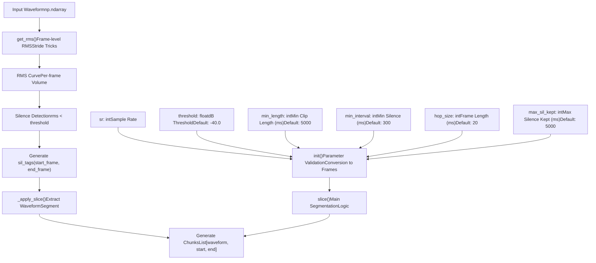
**Sources:** [tools/slicer2.py38-153](https://github.com/RVC-Boss/GPT-SoVITS/blob/c767f0b8/tools/slicer2.py#L38-L153)

### Parameter Validation and Conversion

The `Slicer.__init__()` method validates parameters and converts milliseconds to frame counts.

**Constraints** [tools/slicer2.py48-51](https://github.com/RVC-Boss/GPT-SoVITS/blob/c767f0b8/tools/slicer2.py#L48-L51):

```
min_length >= min_interval >= hop_sizemax_sil_kept >= hop_size
```
**Conversions** [tools/slicer2.py52-58](https://github.com/RVC-Boss/GPT-SoVITS/blob/c767f0b8/tools/slicer2.py#L52-L58):

| Parameter | Input (ms) | Output (frames) | Calculation |
| --- | --- | --- | --- |
| `threshold` | dB value | Linear amplitude | `10 ** (threshold / 20.0)` |
| `hop_size` | Milliseconds | Samples | `round(sr * hop_size / 1000)` |
| `win_size` | \- | Samples | `min(min_interval, 4 * hop_size)` |
| `min_length` | Milliseconds | Frames | `round(sr * min_length / 1000 / hop_size)` |
| `min_interval` | Milliseconds | Frames | `round(min_interval / hop_size)` |
| `max_sil_kept` | Milliseconds | Frames | `round(sr * max_sil_kept / 1000 / hop_size)` |

**Sources:** [tools/slicer2.py39-58](https://github.com/RVC-Boss/GPT-SoVITS/blob/c767f0b8/tools/slicer2.py#L39-L58)

### RMS Calculation

The `get_rms()` function computes root mean square values using NumPy stride tricks for efficiency.

**Algorithm** [tools/slicer2.py5-35](https://github.com/RVC-Boss/GPT-SoVITS/blob/c767f0b8/tools/slicer2.py#L5-L35):

1.  **Padding**: Add `frame_length // 2` samples on each side
2.  **Strided View**: Create overlapping frames without copying data
3.  **Frame Extraction**: Apply `hop_length` downsampling
4.  **Power Calculation**: `mean(abs(x)^2)` per frame
5.  **RMS**: `sqrt(power)`

This is the same approach used in librosa for frame-level feature extraction.

**Sources:** [tools/slicer2.py5-35](https://github.com/RVC-Boss/GPT-SoVITS/blob/c767f0b8/tools/slicer2.py#L5-L35)

### Slice Logic

The `slice()` method implements the core segmentation algorithm.

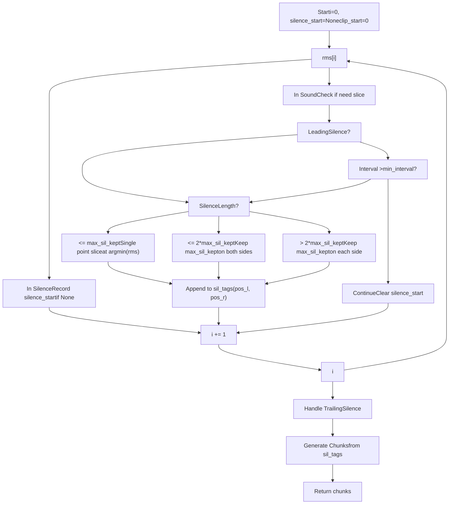
**Key Logic Points:**

1.  **Leading Silence** [tools/slicer2.py89](https://github.com/RVC-Boss/GPT-SoVITS/blob/c767f0b8/tools/slicer2.py#L89-L89): `silence_start == 0 and i > max_sil_kept`
2.  **Middle Slice** [tools/slicer2.py90](https://github.com/RVC-Boss/GPT-SoVITS/blob/c767f0b8/tools/slicer2.py#L90-L90): `i - silence_start >= min_interval and i - clip_start >= min_length`
3.  **Silence Position** [tools/slicer2.py95-120](https://github.com/RVC-Boss/GPT-SoVITS/blob/c767f0b8/tools/slicer2.py#L95-L120): Three cases based on silence length
    -   **Short**: Find single minimum point
    -   **Medium**: Keep `max_sil_kept` frames around minimum
    -   **Long**: Keep `max_sil_kept` on left and right edges
4.  **Trailing Silence** [tools/slicer2.py122-127](https://github.com/RVC-Boss/GPT-SoVITS/blob/c767f0b8/tools/slicer2.py#L122-L127): Handle silence at end of audio

**Output Format** [tools/slicer2.py129-152](https://github.com/RVC-Boss/GPT-SoVITS/blob/c767f0b8/tools/slicer2.py#L129-L152):

```
[[waveform_segment, start_sample, end_sample], ...]
```
**Sources:** [tools/slicer2.py67-152](https://github.com/RVC-Boss/GPT-SoVITS/blob/c767f0b8/tools/slicer2.py#L67-L152)

### slice\_audio.py Script

The `slice_audio.py` script provides a command-line interface to the Slicer class with additional normalization.

**Usage Pattern** [tools/slice\_audio.py13-50](https://github.com/RVC-Boss/GPT-SoVITS/blob/c767f0b8/tools/slice_audio.py#L13-L50):

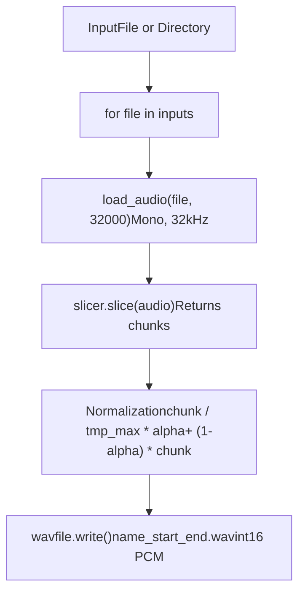
**Normalization Strategy** [tools/slice\_audio.py38-41](https://github.com/RVC-Boss/GPT-SoVITS/blob/c767f0b8/tools/slice_audio.py#L38-L41):

-   Find max absolute value in chunk: `tmp_max = np.abs(chunk).max()`
-   If `tmp_max > 1`, normalize to \[-1, 1\]
-   Apply loudness adjustment: `(chunk / tmp_max * (_max * alpha)) + (1 - alpha) * chunk`
    -   `_max`: Target maximum amplitude
    -   `alpha`: Blend factor between normalized and original

**Output Naming** [tools/slice\_audio.py42-47](https://github.com/RVC-Boss/GPT-SoVITS/blob/c767f0b8/tools/slice_audio.py#L42-L47):

-   Format: `{original_name}_{start_frame:010d}_{end_frame:010d}.wav`
-   Sample rate: 32000 Hz
-   Encoding: 16-bit signed integer PCM

**Sources:** [tools/slice\_audio.py13-50](https://github.com/RVC-Boss/GPT-SoVITS/blob/c767f0b8/tools/slice_audio.py#L13-L50)

---

## UVR5 Vocal Separation

UVR5 (Ultimate Vocal Remover 5) provides neural network-based vocal separation for cleaning training data.

### Model Types and Selection

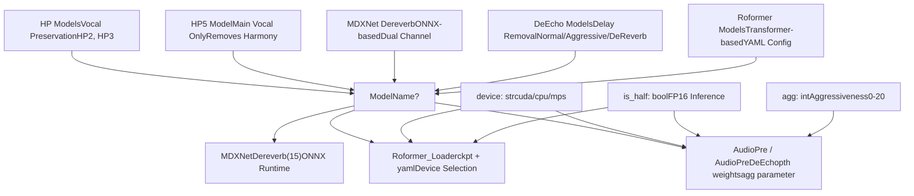
**Model Selection Logic** [tools/uvr5/webui.py51-74](https://github.com/RVC-Boss/GPT-SoVITS/blob/c767f0b8/tools/uvr5/webui.py#L51-L74):

| Condition | Model Type | Class | Parameters |
| --- | --- | --- | --- |
| `"onnx_dereverb_By_FoxJoy"` | MDXNet | `MDXNetDereverb` | `chunk_size=15` |
| `"roformer" in name.lower()` | Roformer | `Roformer_Loader` | `model_path`, `config_path`, `device`, `is_half` |
| `"DeEcho" in name` | DeEcho | `AudioPreDeEcho` | `agg`, `model_path`, `device`, `is_half` |
| Default | VR Models | `AudioPre` | `agg`, `model_path`, `device`, `is_half` |

**Sources:** [tools/uvr5/webui.py45-74](https://github.com/RVC-Boss/GPT-SoVITS/blob/c767f0b8/tools/uvr5/webui.py#L45-L74)

### Processing Pipeline

The UVR5 processing pipeline handles batch audio separation with format conversion.

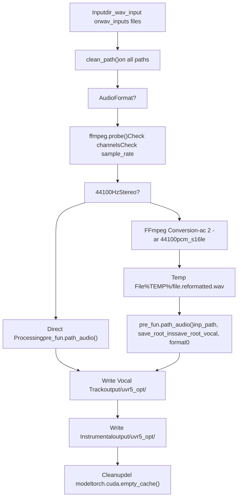
**Format Requirements** [tools/uvr5/webui.py86-88](https://github.com/RVC-Boss/GPT-SoVITS/blob/c767f0b8/tools/uvr5/webui.py#L86-L88):

-   **Sample Rate**: 44100 Hz
-   **Channels**: 2 (stereo)
-   Automatic conversion if not matching

**Reformatting Command** [tools/uvr5/webui.py99](https://github.com/RVC-Boss/GPT-SoVITS/blob/c767f0b8/tools/uvr5/webui.py#L99-L99):

```
ffmpeg -i "{input}" -vn -acodec pcm_s16le -ac 2 -ar 44100 "{output}" -y
```
**HP3 Mode Detection** [tools/uvr5/webui.py51](https://github.com/RVC-Boss/GPT-SoVITS/blob/c767f0b8/tools/uvr5/webui.py#L51-L51):

-   Special handling when `"HP3" in model_name`
-   Passed as `is_hp3` parameter to `_path_audio_()`

**Memory Cleanup** [tools/uvr5/webui.py113-124](https://github.com/RVC-Boss/GPT-SoVITS/blob/c767f0b8/tools/uvr5/webui.py#L113-L124):

-   Delete model objects based on type
-   Clear CUDA cache with `torch.cuda.empty_cache()`
-   Different cleanup for ONNX vs PyTorch models

**Sources:** [tools/uvr5/webui.py45-125](https://github.com/RVC-Boss/GPT-SoVITS/blob/c767f0b8/tools/uvr5/webui.py#L45-L125)

### WebUI Interface

The UVR5 WebUI provides a Gradio interface for batch vocal separation.

**Interface Components** [tools/uvr5/webui.py171-217](https://github.com/RVC-Boss/GPT-SoVITS/blob/c767f0b8/tools/uvr5/webui.py#L171-L217):

| Component | Type | Purpose | Default Value |
| --- | --- | --- | --- |
| `model_choose` | Dropdown | Select separation model | \- |
| `dir_wav_input` | Textbox | Input folder path | \- |
| `wav_inputs` | File | Multiple file upload | \- |
| `agg` | Slider | Aggressiveness (0-20) | 10 |
| `opt_vocal_root` | Textbox | Vocal output folder | `"output/uvr5_opt"` |
| `opt_ins_root` | Textbox | Instrumental output folder | `"output/uvr5_opt"` |
| `format0` | Radio | Output format | `"flac"` |

**Available Formats** [tools/uvr5/webui.py193-198](https://github.com/RVC-Boss/GPT-SoVITS/blob/c767f0b8/tools/uvr5/webui.py#L193-L198):

-   `wav` - Uncompressed
-   `flac` - Lossless compression
-   `mp3` - Lossy compression
-   `m4a` - AAC compression

**Launch Configuration** [tools/uvr5/webui.py27-30](https://github.com/RVC-Boss/GPT-SoVITS/blob/c767f0b8/tools/uvr5/webui.py#L27-L30):

```
device = sys.argv[1]           # cuda/cpu/mpsis_half = eval(sys.argv[2])    # True/Falsewebui_port_uvr5 = int(sys.argv[3])  # Port numberis_share = eval(sys.argv[4])   # Gradio sharing
```
**Sources:** [tools/uvr5/webui.py128-224](https://github.com/RVC-Boss/GPT-SoVITS/blob/c767f0b8/tools/uvr5/webui.py#L128-L224)

---

## Audio Annotation Tool

The `subfix_webui.py` provides an interactive interface for dataset curation with audio editing capabilities.

### Data Format Support

The annotation tool supports two file formats:

**JSON Format** [tools/subfix\_webui.py238-243](https://github.com/RVC-Boss/GPT-SoVITS/blob/c767f0b8/tools/subfix_webui.py#L238-L243):

```
{"text": "transcription", "wav_path": "/path/to/audio.wav"}{"text": "another line", "wav_path": "/path/to/audio2.wav"}
```
-   Each line is a separate JSON object
-   Configurable keys via `--json_key_text` and `--json_key_path`

**List Format** [tools/subfix\_webui.py246-259](https://github.com/RVC-Boss/GPT-SoVITS/blob/c767f0b8/tools/subfix_webui.py#L246-L259):

```
wav_path|speaker_name|language|text
/path/audio.wav|Speaker1|ZH|转录文本
```
-   Pipe-separated values (4 fields required)
-   Used by GPT-SoVITS training pipeline

**Sources:** [tools/subfix\_webui.py222-273](https://github.com/RVC-Boss/GPT-SoVITS/blob/c767f0b8/tools/subfix_webui.py#L222-L273)

### Batch Display and Navigation

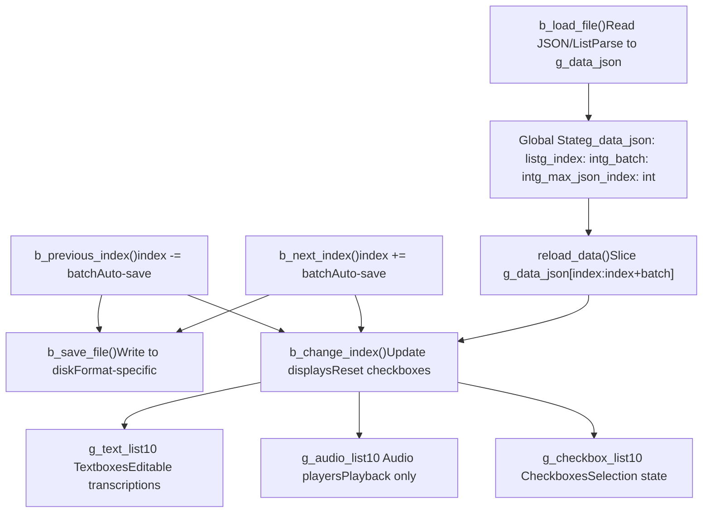
**Batch Parameters** [tools/subfix\_webui.py29-35](https://github.com/RVC-Boss/GPT-SoVITS/blob/c767f0b8/tools/subfix_webui.py#L29-L35):

-   `g_batch`: Number of items displayed per page (default: 10)
-   `g_index`: Current starting index
-   `g_max_json_index`: Total items - 1

**Navigation Logic** [tools/subfix\_webui.py80-93](https://github.com/RVC-Boss/GPT-SoVITS/blob/c767f0b8/tools/subfix_webui.py#L80-L93):

-   **Next**: Increments by `batch` if not at end
-   **Previous**: Decrements by `batch` if not at start
-   **Auto-save**: Both functions call `b_save_file()` before navigating

**Sources:** [tools/subfix\_webui.py24-93](https://github.com/RVC-Boss/GPT-SoVITS/blob/c767f0b8/tools/subfix_webui.py#L24-L93)

### Audio Editing Operations

#### Audio Splitting

The `b_audio_split()` function splits a single audio file at a specified time point.

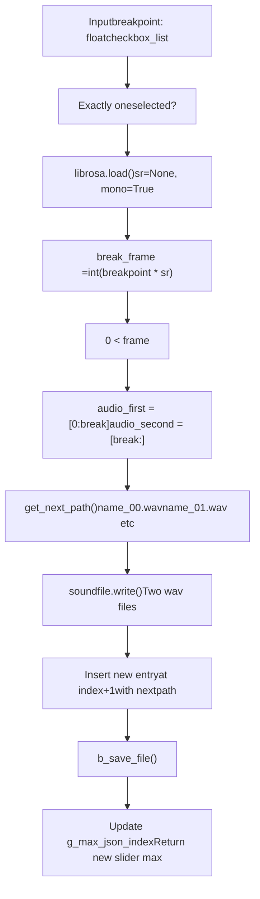
**Path Generation** [tools/subfix\_webui.py139-146](https://github.com/RVC-Boss/GPT-SoVITS/blob/c767f0b8/tools/subfix_webui.py#L139-L146):

-   Tries `{base_name}_00.wav` through `{base_name}_99.wav`
-   Falls back to UUID if all numbered slots taken
-   Maintains original file extension

**Audio Processing** [tools/subfix\_webui.py159-168](https://github.com/RVC-Boss/GPT-SoVITS/blob/c767f0b8/tools/subfix_webui.py#L159-L168):

-   Uses `librosa.load()` for reading
-   Uses `soundfile.write()` for writing
-   Preserves original sample rate
-   Overwrites original file with first segment

**Sources:** [tools/subfix\_webui.py149-175](https://github.com/RVC-Boss/GPT-SoVITS/blob/c767f0b8/tools/subfix_webui.py#L149-L175)

#### Audio Merging

The `b_merge_audio()` function concatenates multiple selected audio files with optional silence intervals.

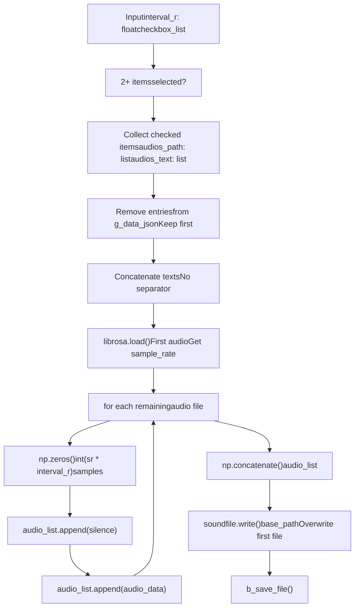
**Key Features** [tools/subfix\_webui.py178-214](https://github.com/RVC-Boss/GPT-SoVITS/blob/c767f0b8/tools/subfix_webui.py#L178-L214):

1.  **Text Concatenation**: [tools/subfix\_webui.py197](https://github.com/RVC-Boss/GPT-SoVITS/blob/c767f0b8/tools/subfix_webui.py#L197-L197) - Direct string join with no separator
2.  **Silence Insertion**: [tools/subfix\_webui.py205-206](https://github.com/RVC-Boss/GPT-SoVITS/blob/c767f0b8/tools/subfix_webui.py#L205-L206) - Between segments (not before first)
3.  **Sample Rate Consistency**: [tools/subfix\_webui.py202](https://github.com/RVC-Boss/GPT-SoVITS/blob/c767f0b8/tools/subfix_webui.py#L202-L202) - Uses first file's SR for all
4.  **File Cleanup**: [tools/subfix\_webui.py192-193](https://github.com/RVC-Boss/GPT-SoVITS/blob/c767f0b8/tools/subfix_webui.py#L192-L193) - Removes merged entries from dataset
5.  **Base File Update**: [tools/subfix\_webui.py212](https://github.com/RVC-Boss/GPT-SoVITS/blob/c767f0b8/tools/subfix_webui.py#L212-L212) - Overwrites first selected file

**Sources:** [tools/subfix\_webui.py178-219](https://github.com/RVC-Boss/GPT-SoVITS/blob/c767f0b8/tools/subfix_webui.py#L178-L219)

### Text Editing and Management

#### Text Submission

The `b_submit_change()` function saves edited text back to the dataset.

**Processing Logic** [tools/subfix\_webui.py96-107](https://github.com/RVC-Boss/GPT-SoVITS/blob/c767f0b8/tools/subfix_webui.py#L96-L107):

1.  Iterate through all text inputs
2.  Strip whitespace and add trailing space
3.  Compare with stored value in `g_data_json`
4.  If changed, update and set `change = True`
5.  If any changes, call `b_save_file()`
6.  Reload current page

**Text Normalization** [tools/subfix\_webui.py101](https://github.com/RVC-Boss/GPT-SoVITS/blob/c767f0b8/tools/subfix_webui.py#L101-L101):

```
new_text = new_text.strip() + " "
```
-   Removes leading/trailing whitespace
-   Ensures trailing space for consistency

**Sources:** [tools/subfix\_webui.py96-107](https://github.com/RVC-Boss/GPT-SoVITS/blob/c767f0b8/tools/subfix_webui.py#L96-L107)

#### Selection Operations

**Delete Audio** [tools/subfix\_webui.py110-131](https://github.com/RVC-Boss/GPT-SoVITS/blob/c767f0b8/tools/subfix_webui.py#L110-L131):

-   Iterates checkboxes in reverse order
-   Removes checked items from `g_data_json`
-   Updates `g_max_json_index`
-   Adjusts `g_index` if needed to stay in bounds
-   Saves changes immediately

**Invert Selection** [tools/subfix\_webui.py134-136](https://github.com/RVC-Boss/GPT-SoVITS/blob/c767f0b8/tools/subfix_webui.py#L134-L136):

```
[not item if item is True else True for item in checkbox_list]
```
-   Simple list comprehension
-   Toggles all checkbox states

**Sources:** [tools/subfix\_webui.py110-136](https://github.com/RVC-Boss/GPT-SoVITS/blob/c767f0b8/tools/subfix_webui.py#L110-L136)

### Command-Line Interface

The annotation tool accepts several command-line arguments for configuration.

**Argument Table** [tools/subfix\_webui.py298-305](https://github.com/RVC-Boss/GPT-SoVITS/blob/c767f0b8/tools/subfix_webui.py#L298-L305):

| Argument | Default | Description |
| --- | --- | --- |
| `--load_json` | `"None"` | Path to JSON file (one object per line) |
| `--load_list` | `"None"` | Path to list file (pipe-separated) |
| `--is_share` | `"False"` | Enable Gradio sharing |
| `--webui_port_subfix` | `9871` | Port for web interface |
| `--json_key_text` | `"text"` | JSON key for text field |
| `--json_key_path` | `"wav_path"` | JSON key for audio path |
| `--g_batch` | `10` | Number of items per page |

**Format Priority** [tools/subfix\_webui.py281-289](https://github.com/RVC-Boss/GPT-SoVITS/blob/c767f0b8/tools/subfix_webui.py#L281-L289):

1.  If `load_json != "None"`: Use JSON format
2.  Else if `load_list != "None"`: Use list format
3.  Else: Default to `"demo.list"`

**Sources:** [tools/subfix\_webui.py297-309](https://github.com/RVC-Boss/GPT-SoVITS/blob/c767f0b8/tools/subfix_webui.py#L297-L309)

---

## Integration with Training Pipeline

These audio processing utilities integrate into the broader GPT-SoVITS training workflow.

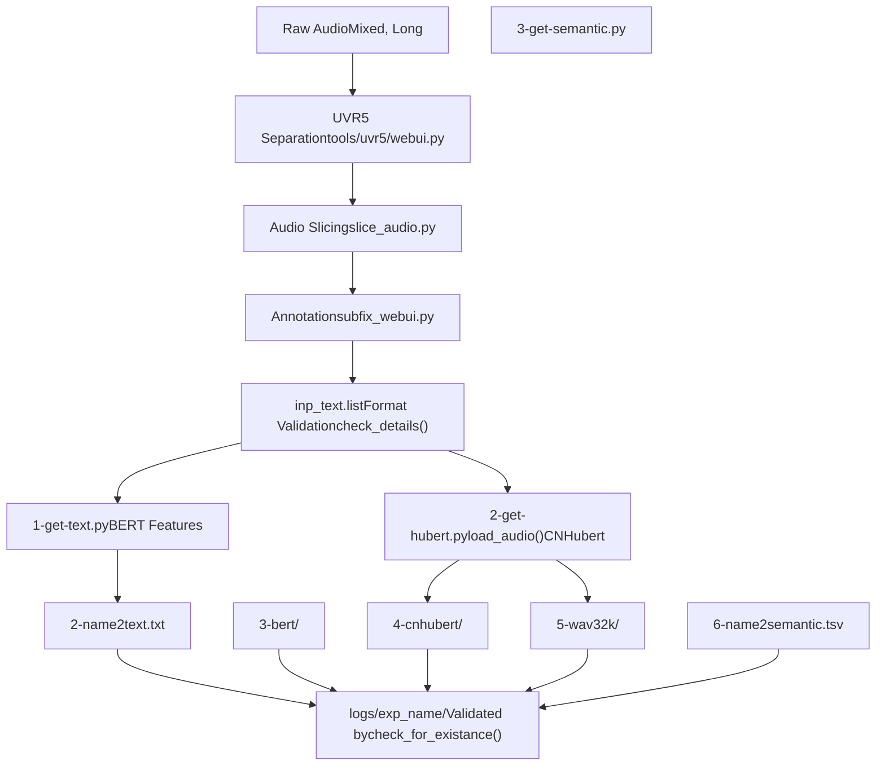
**Key Integration Points:**

1.  **Path Cleaning**: `clean_path()` used throughout WebUI and scripts
2.  **Audio Loading**: `load_audio()` standardizes input for feature extraction
3.  **Validation**: `check_for_existance()` and `check_details()` verify dataset completeness before training
4.  **Format Compatibility**: List format from `subfix_webui.py` directly consumed by training scripts

**Sources:** [tools/my\_utils.py1-232](https://github.com/RVC-Boss/GPT-SoVITS/blob/c767f0b8/tools/my_utils.py#L1-L232) [tools/slice\_audio.py1-53](https://github.com/RVC-Boss/GPT-SoVITS/blob/c767f0b8/tools/slice_audio.py#L1-L53) [tools/subfix\_webui.py1-426](https://github.com/RVC-Boss/GPT-SoVITS/blob/c767f0b8/tools/subfix_webui.py#L1-L426)

---

## Usage Examples

### Example 1: Batch Vocal Separation

```
# Launch UVR5 WebUI from command linepython tools/uvr5/webui.py cuda True 9873 False# Args: device, is_half, port, is_share
```
**WebUI Workflow:**

1.  Select model (e.g., "HP3\_all\_vocals")
2.  Input folder: `C:/raw_audio/`
3.  Output vocal folder: `output/uvr5_opt/vocals/`
4.  Output instrumental: `output/uvr5_opt/inst/`
5.  Format: FLAC
6.  Click "转换" (Convert)

### Example 2: Audio Slicing via Script

```
python tools/slice_audio.py \  "C:/raw_audio/" \  "output/sliced/" \  -40 \  5000 \  300 \  20 \  5000 \  0.9 \  0.25 \  0 \  1# Args: inp, opt_root, threshold, min_length, min_interval, #       hop_size, max_sil_kept, _max, alpha, i_part, all_part
```
**Parameters Explained:**

-   `threshold=-40`: Silence below -40 dB
-   `min_length=5000`: Min 5 seconds per clip
-   `min_interval=300`: Min 300ms silence for split
-   `hop_size=20`: 20ms frame analysis
-   `max_sil_kept=5000`: Keep max 5s silence
-   `_max=0.9`: Target max amplitude
-   `alpha=0.25`: 25% normalization blend

### Example 3: Dataset Annotation

```
python tools/subfix_webui.py \  --load_list "output/preprocessed.list" \  --webui_port_subfix 9871 \  --g_batch 15 \  --is_share False
```
**WebUI Operations:**

1.  Browse through pages (15 items per page)
2.  Edit transcriptions directly in text boxes
3.  Select audio with checkboxes
4.  Split at specific time: Adjust slider, click "Split Audio"
5.  Merge multiple: Select items, set interval, click "Merge Audio"
6.  Save changes: Click "Submit Text" before navigation
7.  Delete errors: Select items, click "Delete Audio"

**Sources:** [tools/slice\_audio.py53](https://github.com/RVC-Boss/GPT-SoVITS/blob/c767f0b8/tools/slice_audio.py#L53-L53) [tools/subfix\_webui.py419-425](https://github.com/RVC-Boss/GPT-SoVITS/blob/c767f0b8/tools/subfix_webui.py#L419-L425) [tools/uvr5/webui.py27-30](https://github.com/RVC-Boss/GPT-SoVITS/blob/c767f0b8/tools/uvr5/webui.py#L27-L30)

---

## Performance Considerations

### Audio Loading Efficiency

The `load_audio()` function uses FFmpeg for efficient format conversion:

-   **Threading disabled**: `threads=0` to avoid interference with PyTorch
-   **Streaming output**: Captures stdout directly without intermediate files
-   **Single-pass conversion**: Combines decoding, resampling, and channel mixing

### Memory Management

**UVR5 Memory Cleanup** [tools/uvr5/webui.py113-124](https://github.com/RVC-Boss/GPT-SoVITS/blob/c767f0b8/tools/uvr5/webui.py#L113-L124):

```
try:    if model_name == "onnx_dereverb_By_FoxJoy":        del pre_fun.pred.model        del pre_fun.pred.model_    else:        del pre_fun.model        del pre_funexcept:    traceback.print_exc()if torch.cuda.is_available():    torch.cuda.empty_cache()
```
**Slicer Efficiency**:

-   Uses NumPy stride tricks [tools/slicer2.py16-21](https://github.com/RVC-Boss/GPT-SoVITS/blob/c767f0b8/tools/slicer2.py#L16-L21) to avoid copying large arrays
-   Processes RMS in single pass
-   Returns references to original waveform rather than copies

### Parallel Processing

**slice\_audio.py** supports dataset partitioning [tools/slice\_audio.py31](https://github.com/RVC-Boss/GPT-SoVITS/blob/c767f0b8/tools/slice_audio.py#L31-L31):

```
for inp_path in input[int(i_part)::int(all_part)]:
```
-   `i_part`: Current process index (0-based)
-   `all_part`: Total number of processes
-   Example: 4 processes → `i_part=0,1,2,3` and `all_part=4`

**Sources:** [tools/my\_utils.py16-37](https://github.com/RVC-Boss/GPT-SoVITS/blob/c767f0b8/tools/my_utils.py#L16-L37) [tools/uvr5/webui.py113-124](https://github.com/RVC-Boss/GPT-SoVITS/blob/c767f0b8/tools/uvr5/webui.py#L113-L124) [tools/slicer2.py5-35](https://github.com/RVC-Boss/GPT-SoVITS/blob/c767f0b8/tools/slicer2.py#L5-L35) [tools/slice\_audio.py31](https://github.com/RVC-Boss/GPT-SoVITS/blob/c767f0b8/tools/slice_audio.py#L31-L31)

---

## Error Handling

### Path Validation Errors

The `clean_path()` function prevents common errors:

-   **Quoted paths**: Strips single/double quotes
-   **Whitespace**: Removes leading/trailing spaces
-   **Unicode control**: Removes invisible characters like `\u202a`
-   **Separators**: Normalizes to OS-specific separators

### Audio Loading Errors

**Error Messages** [tools/my\_utils.py22-35](https://github.com/RVC-Boss/GPT-SoVITS/blob/c767f0b8/tools/my_utils.py#L22-L35):

-   File not found: `"You input a wrong audio path that does not exists, please fix it!"`
-   FFmpeg failure: `"音频加载失败"` (Audio loading failed)
-   Includes full exception traceback for debugging

### Dataset Validation

**check\_details()** provides specific warnings [tools/my\_utils.py90-137](https://github.com/RVC-Boss/GPT-SoVITS/blob/c767f0b8/tools/my_utils.py#L90-L137):

-   `"请填入正确的List路径"`: Invalid list file extension
-   `"请填入正确的音频文件夹路径"`: Audio folder doesn't exist
-   `"路径错误"`: Audio file path cannot be resolved
-   `"缺少音素数据集"`: Empty phoneme file
-   `"缺少Hubert数据集"`: Empty Hubert directory
-   `"缺少音频数据集"`: Empty wav32k directory
-   `"缺少语义数据集"`: Empty semantic TSV file

**Sources:** [tools/my\_utils.py40-137](https://github.com/RVC-Boss/GPT-SoVITS/blob/c767f0b8/tools/my_utils.py#L40-L137)

---

## Summary

The audio processing utilities provide essential preprocessing capabilities:

1.  **Core Functions** (`my_utils.py`):

    -   Universal audio loading via FFmpeg
    -   Path normalization for cross-platform compatibility
    -   Dataset validation for training readiness
2.  **Preprocessing Tools**:

    -   UVR5 vocal separation with multiple model types
    -   Silence-based audio slicing with configurable parameters
    -   Format conversion and normalization
3.  **Dataset Curation** (`subfix_webui.py`):

    -   Interactive batch editing interface
    -   Audio splitting and merging
    -   Multiple format support (JSON/List)

These utilities form the foundation of the data preparation pipeline, ensuring clean, properly formatted audio for high-quality voice model training.
