# Process Management and GPU Allocation

Relevant source files

-   [api.py](https://github.com/RVC-Boss/GPT-SoVITS/blob/c767f0b8/api.py)
-   [config.py](https://github.com/RVC-Boss/GPT-SoVITS/blob/c767f0b8/config.py)
-   [webui.py](https://github.com/RVC-Boss/GPT-SoVITS/blob/c767f0b8/webui.py)

This document describes how GPT-SoVITS manages operating system processes for various tools and allocates GPU resources across these processes. The system orchestrates multiple concurrent Python subprocesses (training, preprocessing, inference) while carefully managing GPU memory and compute resources to prevent conflicts and maximize hardware utilization.

For information about model loading and version detection, see [Version Detection and Model Loading](/RVC-Boss/GPT-SoVITS/8.3-version-detection-and-model-loading). For details on the main WebUI interface that triggers these processes, see [Main WebUI](/RVC-Boss/GPT-SoVITS/3.1-main-webui).

---

## Hardware Detection and Capability Assessment

The system performs automatic hardware detection at startup to determine available compute resources and their capabilities. This information is used throughout the codebase to make intelligent decisions about precision, batch sizes, and device allocation.

### GPU Enumeration Process

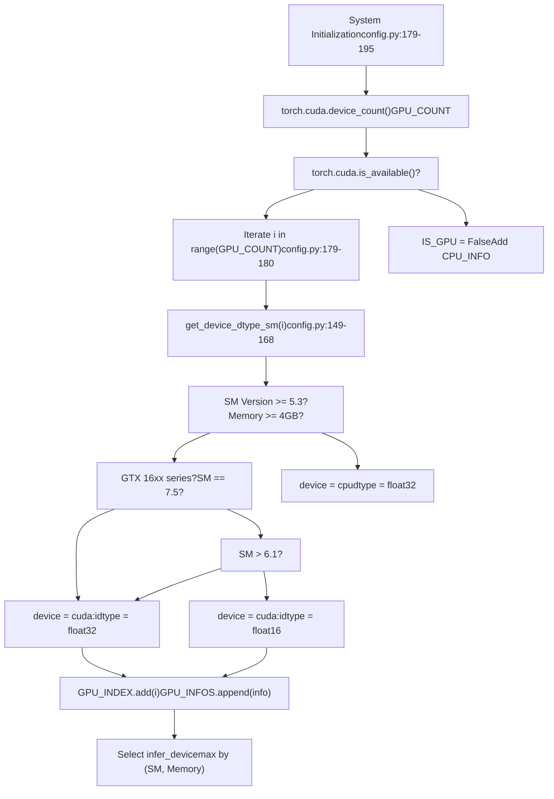
**Hardware Detection Logic**

The `get_device_dtype_sm` function evaluates each GPU's suitability based on three criteria:

| Criterion | Threshold | Result |
| --- | --- | --- |
| Memory | < 4GB | CPU fallback |
| SM Version | < 5.3 | CPU fallback |
| SM Version | 6.1 or 16xx series | FP32 on CUDA |
| SM Version | \> 6.1 | FP16 on CUDA |

Sources: [config.py149-168](https://github.com/RVC-Boss/GPT-SoVITS/blob/c767f0b8/config.py#L149-L168) [config.py179-195](https://github.com/RVC-Boss/GPT-SoVITS/blob/c767f0b8/config.py#L179-L195)

### Device Selection Strategy

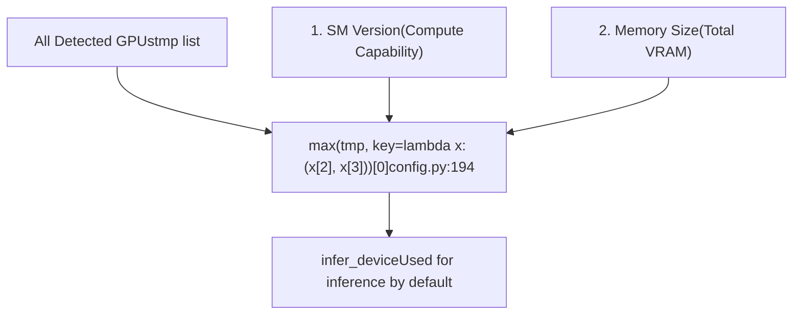
The system selects the most capable GPU for inference by prioritizing compute capability (SM version) over memory size. This ensures modern architectures with tensor cores are preferred when available.

Sources: [config.py194-195](https://github.com/RVC-Boss/GPT-SoVITS/blob/c767f0b8/config.py#L194-L195)

---

## GPU Allocation Architecture

### Environment Variable Control

GPT-SoVITS uses the `_CUDA_VISIBLE_DEVICES` environment variable (not standard `CUDA_VISIBLE_DEVICES`) to control GPU visibility for spawned subprocesses. The underscore prefix prevents conflicts with user-set environment variables.

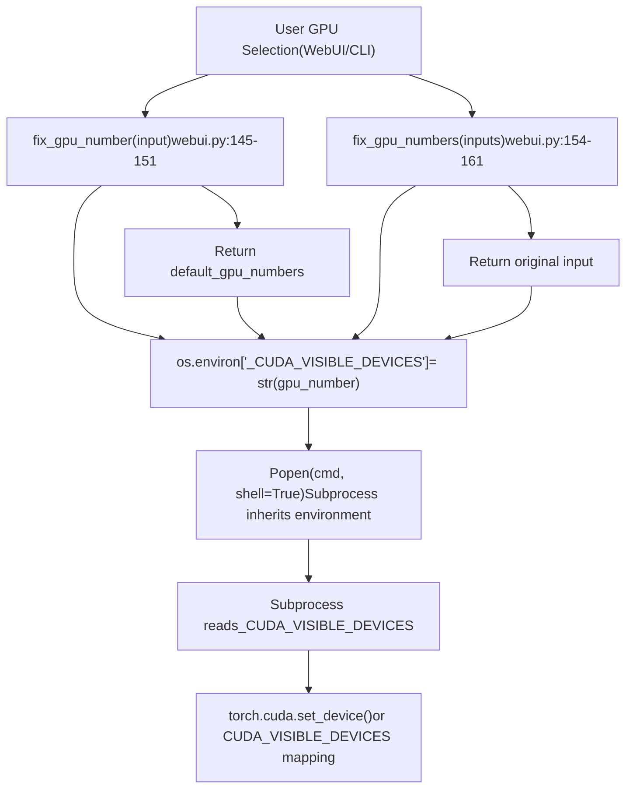
**GPU Number Validation**

The validation functions ensure GPU indices are within the valid range `GPU_INDEX` set:

```
# Example: GPU_INDEX = {0, 1, 2} for a 3-GPU system# Input: "5" -> Output: default_gpu_numbers (e.g., 0)# Input: "0,1,5" -> Output: "0,1,0" (5 clamped to default)
```
Sources: [webui.py145-161](https://github.com/RVC-Boss/GPT-SoVITS/blob/c767f0b8/webui.py#L145-L161)

### Multi-GPU Allocation Strategy

For data preprocessing tasks, the system supports splitting work across multiple GPUs using a hyphen-separated format:

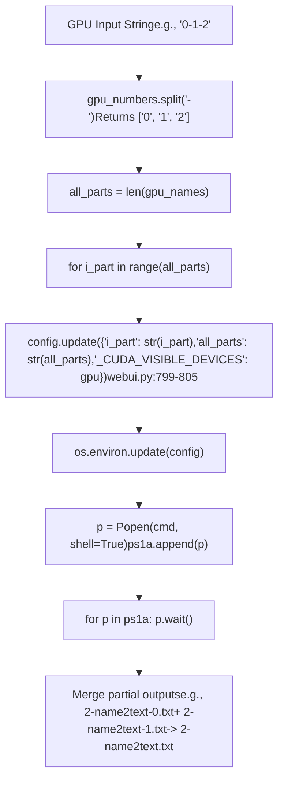
**Parallel Processing Pattern**

Each spawned process receives:

-   `i_part`: Current partition index (0-indexed)
-   `all_parts`: Total number of partitions
-   `_CUDA_VISIBLE_DEVICES`: Assigned GPU index

The subprocess script divides the workload based on these parameters:

```
# In subprocess (e.g., 1-get-text.py)i_part = int(os.environ['i_part'])all_parts = int(os.environ['all_parts'])# Process items where: idx % all_parts == i_part
```
Sources: [webui.py796-811](https://github.com/RVC-Boss/GPT-SoVITS/blob/c767f0b8/webui.py#L796-L811) [webui.py889-901](https://github.com/RVC-Boss/GPT-SoVITS/blob/c767f0b8/webui.py#L889-L901) [webui.py983-995](https://github.com/RVC-Boss/GPT-SoVITS/blob/c767f0b8/webui.py#L983-L995)

---

## Process Management Architecture

### Global Process Registry

The WebUI maintains global variables to track active subprocesses:

| Variable | Type | Purpose | Singleton |
| --- | --- | --- | --- |
| `p_label` | `Popen` | Annotation WebUI subprocess | Yes |
| `p_uvr5` | `Popen` | UVR5 vocal separation WebUI | Yes |
| `p_asr` | `Popen` | ASR transcription subprocess | Yes |
| `p_denoise` | `Popen` | Denoising subprocess | Yes |
| `p_tts_inference` | `Popen` | Inference WebUI subprocess | Yes |
| `p_train_SoVITS` | `Popen` | SoVITS training subprocess | Yes |
| `p_train_GPT` | `Popen` | GPT training subprocess | Yes |
| `ps_slice` | `list[Popen]` | Audio slicing subprocesses | No (multi-process) |
| `ps1a` | `list[Popen]` | BERT/text feature extraction | No (multi-GPU) |
| `ps1b` | `list[Popen]` | Hubert feature extraction | No (multi-GPU) |
| `ps1c` | `list[Popen]` | Semantic token extraction | No (multi-GPU) |
| `ps1abc` | `list[Popen]` | One-click preparation pipeline | No (multi-stage) |

Sources: [webui.py204-208](https://github.com/RVC-Boss/GPT-SoVITS/blob/c767f0b8/webui.py#L204-L208) [webui.py485-486](https://github.com/RVC-Boss/GPT-SoVITS/blob/c767f0b8/webui.py#L485-L486) [webui.py586-587](https://github.com/RVC-Boss/GPT-SoVITS/blob/c767f0b8/webui.py#L586-L587) [webui.py678-679](https://github.com/RVC-Boss/GPT-SoVITS/blob/c767f0b8/webui.py#L678-L679) [webui.py776-777](https://github.com/RVC-Boss/GPT-SoVITS/blob/c767f0b8/webui.py#L776-L777) [webui.py865-867](https://github.com/RVC-Boss/GPT-SoVITS/blob/c767f0b8/webui.py#L865-L867) [webui.py956-957](https://github.com/RVC-Boss/GPT-SoVITS/blob/c767f0b8/webui.py#L956-L957) [webui.py1042-1043](https://github.com/RVC-Boss/GPT-SoVITS/blob/c767f0b8/webui.py#L1042-L1043)

### Process Lifecycle State Machine

> **[Mermaid stateDiagram]**
> *(图表结构无法解析)*

Sources: [webui.py270-295](https://github.com/RVC-Boss/GPT-SoVITS/blob/c767f0b8/webui.py#L270-L295) [webui.py371-414](https://github.com/RVC-Boss/GPT-SoVITS/blob/c767f0b8/webui.py#L371-L414) [webui.py780-840](https://github.com/RVC-Boss/GPT-SoVITS/blob/c767f0b8/webui.py#L780-L840)

### Process Spawning Pattern

All process spawning follows a consistent pattern across different tools:

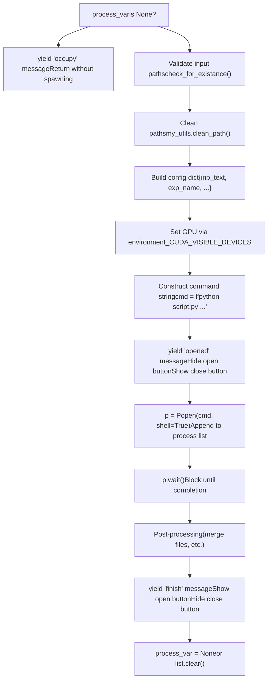
Sources: [webui.py780-846](https://github.com/RVC-Boss/GPT-SoVITS/blob/c767f0b8/webui.py#L780-L846) [webui.py870-937](https://github.com/RVC-Boss/GPT-SoVITS/blob/c767f0b8/webui.py#L870-L937) [webui.py960-1023](https://github.com/RVC-Boss/GPT-SoVITS/blob/c767f0b8/webui.py#L960-L1023)

---

## Platform-Specific Process Termination

### Cross-Platform Kill Strategy

The system uses different termination strategies based on the operating system:

```mermaid
flowchart TD
    KillRequest["kill_process(pid, process_name)webui.py:234-241"]
    CheckPlatform["platform.system()"]
    Windows["Windows Branchsystem == 'Windows'"]
    Unix["Unix/Linux/macOS Branchsystem != 'Windows'"]
    TaskKill["subprocess.run('taskkill /t /f /pid %s' % pid,shell=True,stdout=DEVNULL,stderr=DEVNULL)"]
    ProcTree["kill_proc_tree(pid)webui.py:211-228"]
    GetParent["parent = psutil.Process(pid)"]
    GetChildren["children = parent.children(recursive=True)"]
    KillChildren["for child in children:os.kill(child.pid, SIGTERM)"]
    KillParent["os.kill(parent.pid, SIGTERM)"]
    PrintMsg["print(process_name + '进程已终止')"]

    KillRequest --> CheckPlatform
    CheckPlatform --> Windows
    CheckPlatform --> Unix
    Windows --> TaskKill
    Unix --> ProcTree
    ProcTree --> GetParent
    GetParent --> GetChildren
    GetChildren --> KillChildren
    KillChildren --> KillParent
    TaskKill --> PrintMsg
    KillParent --> PrintMsg
```
**Windows Termination**

Uses `taskkill` with flags:

-   `/t`: Terminates process tree (children included)
-   `/f`: Forceful termination
-   `/pid`: Target process ID

**Unix Termination**

Uses `psutil` to recursively find children, then sends `SIGTERM` signals. This approach is more granular but requires the `psutil` library for reliable process tree traversal.

Sources: [webui.py211-241](https://github.com/RVC-Boss/GPT-SoVITS/blob/c767f0b8/webui.py#L211-L241)

---

## Training Process Management

### SoVITS Training Configuration

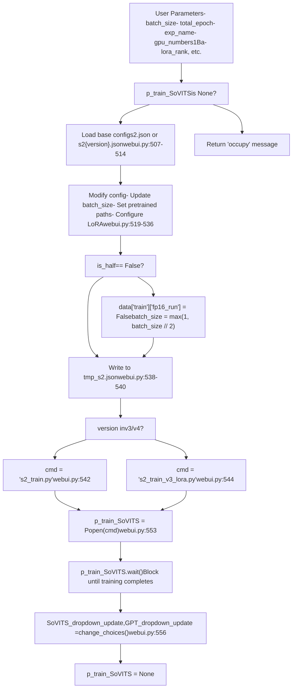
**Configuration Modifications**

Key parameters modified before training:

1.  `batch_size`: Halved if FP32 mode
2.  `gpu_numbers`: Set via config dict, not environment variable (DDP handles internally)
3.  `pretrained_s2G/s2D`: Initialize from pretrained weights
4.  `lora_rank`: Only for v3/v4 LoRA training
5.  `grad_ckpt`: Gradient checkpointing for memory efficiency

Sources: [webui.py489-583](https://github.com/RVC-Boss/GPT-SoVITS/blob/c767f0b8/webui.py#L489-L583)

### GPT Training Configuration

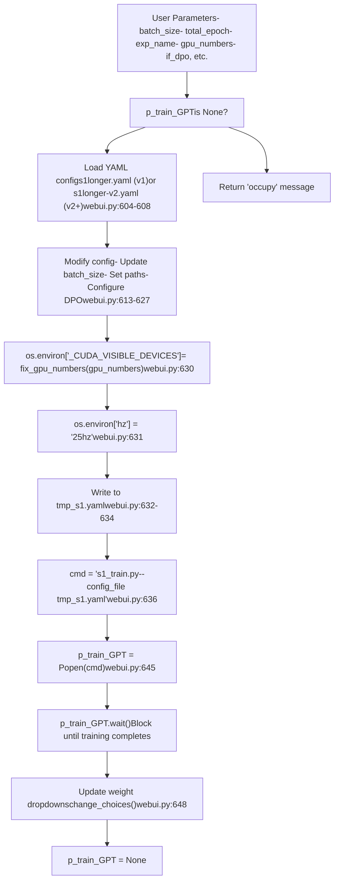
**GPT-Specific Environment Setup**

Unlike SoVITS training, GPT training:

1.  Uses environment variable `_CUDA_VISIBLE_DEVICES` for GPU selection (gets converted inside training script)
2.  Sets semantic token rate via `os.environ['hz']`
3.  Relies on PyTorch Lightning's DDP for multi-GPU coordination

Sources: [webui.py590-675](https://github.com/RVC-Boss/GPT-SoVITS/blob/c767f0b8/webui.py#L590-L675)

---

## Data Preparation Pipeline Management

### One-Click Pipeline (1Aabc)

The one-click preparation pipeline orchestrates three sequential stages, each with multi-GPU parallel processing:

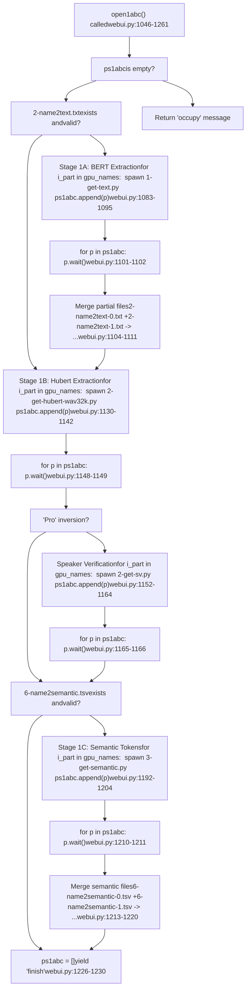
**Pipeline Characteristics**

1.  **Skip Logic**: Checks for existing output files before running each stage
2.  **Sequential Stages**: 1A → 1B → (1B-SV if v2Pro) → 1C must run in order
3.  **Parallel Within Stages**: Each stage spawns multiple GPU processes
4.  **Progress Updates**: Yields UI updates like "1A-Doing", "1A-Done, 1B-Doing"
5.  **Error Recovery**: Try-catch wrapper calls `close1abc()` on failure

Sources: [webui.py1046-1261](https://github.com/RVC-Boss/GPT-SoVITS/blob/c767f0b8/webui.py#L1046-L1261)

### File Merging Strategy

After parallel processing completes, partial results are merged:

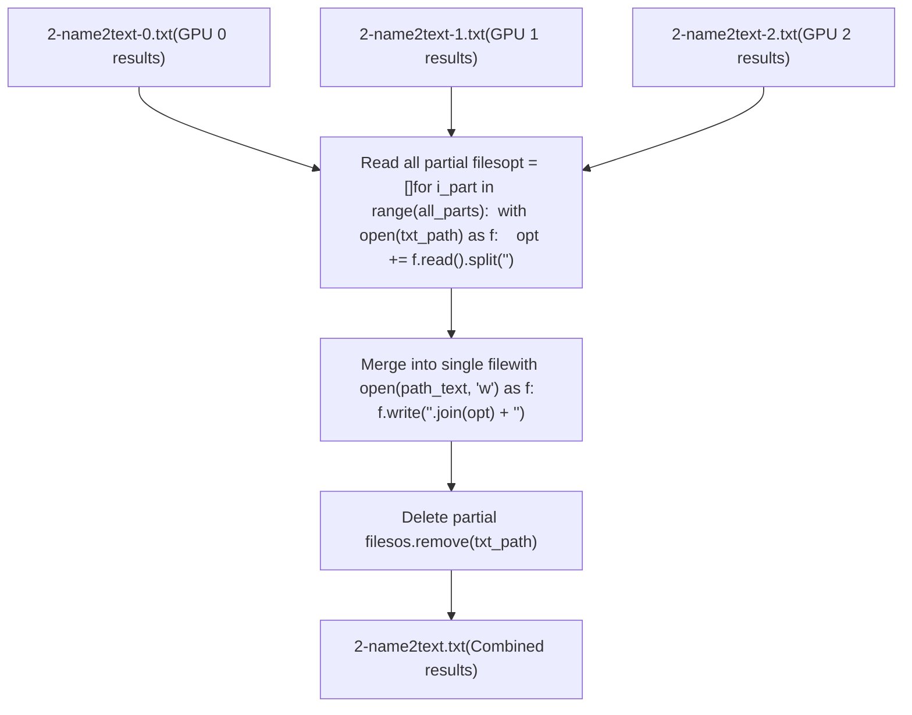
This pattern is used for:

-   Text features: [webui.py819-827](https://github.com/RVC-Boss/GPT-SoVITS/blob/c767f0b8/webui.py#L819-L827)
-   Semantic tokens: [webui.py1003-1011](https://github.com/RVC-Boss/GPT-SoVITS/blob/c767f0b8/webui.py#L1003-L1011) [webui.py1213-1220](https://github.com/RVC-Boss/GPT-SoVITS/blob/c767f0b8/webui.py#L1213-L1220)

Sources: [webui.py819-827](https://github.com/RVC-Boss/GPT-SoVITS/blob/c767f0b8/webui.py#L819-L827) [webui.py1003-1011](https://github.com/RVC-Boss/GPT-SoVITS/blob/c767f0b8/webui.py#L1003-L1011) [webui.py1213-1220](https://github.com/RVC-Boss/GPT-SoVITS/blob/c767f0b8/webui.py#L1213-L1220)

---

## Subprocess Tool Launching

### WebUI Subprocess Management

Some tools launch their own Gradio WebUIs in separate processes:

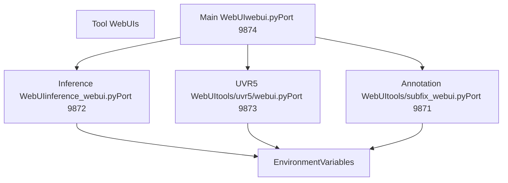
**Inference WebUI Spawning**

```
# webui.py:331-363def change_tts_inference(...):    if p_tts_inference is None:        os.environ["gpt_path"] = gpt_path        os.environ["sovits_path"] = sovits_path        os.environ["cnhubert_base_path"] = cnhubert_base_path        os.environ["bert_path"] = bert_path        os.environ["_CUDA_VISIBLE_DEVICES"] = str(fix_gpu_number(gpu_number))        os.environ["is_half"] = str(is_half)        os.environ["infer_ttswebui"] = str(webui_port_infer_tts)        os.environ["is_share"] = str(is_share)                cmd = f'"{python_exec}" -s GPT_SoVITS/inference_webui.py "{language}"'        p_tts_inference = Popen(cmd, shell=True)
```
The spawned process reads these environment variables to configure itself without requiring command-line arguments.

Sources: [webui.py331-363](https://github.com/RVC-Boss/GPT-SoVITS/blob/c767f0b8/webui.py#L331-L363) [webui.py270-295](https://github.com/RVC-Boss/GPT-SoVITS/blob/c767f0b8/webui.py#L270-L295) [webui.py301-325](https://github.com/RVC-Boss/GPT-SoVITS/blob/c767f0b8/webui.py#L301-L325)

---

## Resource Cleanup and Memory Management

### CUDA Memory Cleanup in API

The API server provides explicit cleanup functions for models that consume significant GPU memory:

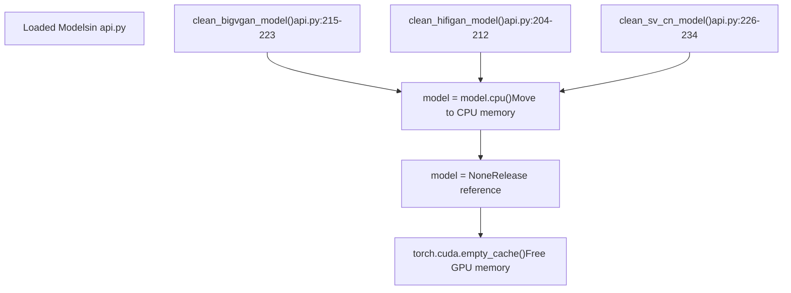
**Cleanup Pattern**

All cleanup functions follow the same pattern:

1.  Move model to CPU (if exists)
2.  Set global variable to `None`
3.  Call `torch.cuda.empty_cache()` to release cached memory

This is important because:

-   BigVGAN and HiFiGAN are ~200MB vocoder models
-   Speaker verification model is ~100MB
-   Multiple versions may be loaded during model switching

Sources: [api.py204-234](https://github.com/RVC-Boss/GPT-SoVITS/blob/c767f0b8/api.py#L204-L234)

### Lazy Initialization Strategy

Models are initialized only when needed:

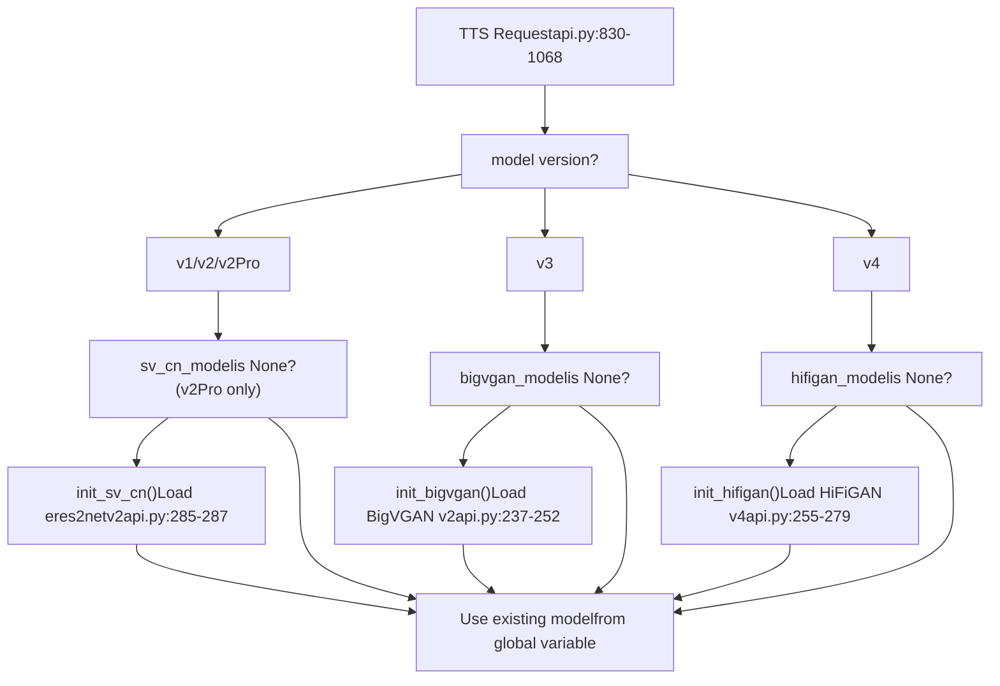
This ensures:

-   Only required models are loaded into VRAM
-   Model switching between versions is efficient
-   Memory footprint is minimized

Sources: [api.py854-862](https://github.com/RVC-Boss/GPT-SoVITS/blob/c767f0b8/api.py#L854-L862) [api.py1016-1021](https://github.com/RVC-Boss/GPT-SoVITS/blob/c767f0b8/api.py#L1016-L1021) [api.py890-893](https://github.com/RVC-Boss/GPT-SoVITS/blob/c767f0b8/api.py#L890-L893)

---

## Batch Size and Precision Adjustment

### Automatic Batch Size Calculation

The system calculates default batch sizes based on available GPU memory:

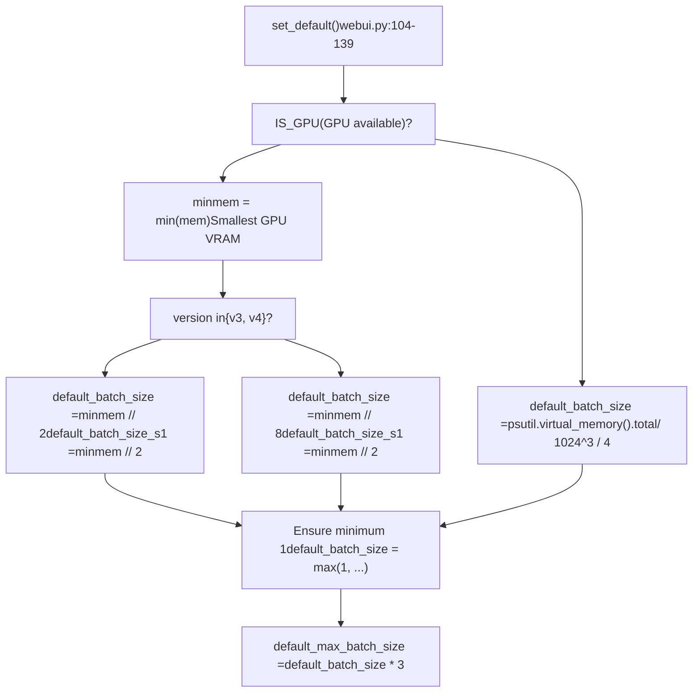
**Batch Size Formulas**

| Condition | SoVITS Batch Size | GPT Batch Size | Reasoning |
| --- | --- | --- | --- |
| GPU, v1/v2 | VRAM ÷ 2 | VRAM ÷ 2 | Standard memory usage |
| GPU, v3/v4 | VRAM ÷ 8 | VRAM ÷ 2 | CFM requires more memory |
| CPU | RAM ÷ 4 | RAM ÷ 4 | Conservative for CPU training |

The formula uses GPU memory in GB as the divisor input (e.g., 8GB GPU → batch\_size = 4 for v1/v2).

Sources: [webui.py104-139](https://github.com/RVC-Boss/GPT-SoVITS/blob/c767f0b8/webui.py#L104-L139)

### Precision Fallback for FP32

When `is_half=False`, the system automatically adjusts settings:

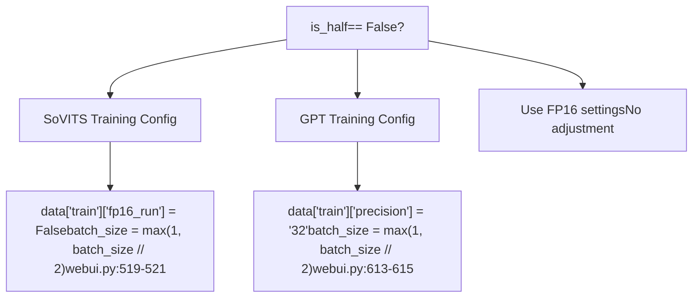
FP32 mode uses 2x more memory per parameter, so batch size is halved to maintain similar memory usage.

Sources: [webui.py519-521](https://github.com/RVC-Boss/GPT-SoVITS/blob/c767f0b8/webui.py#L519-L521) [webui.py613-615](https://github.com/RVC-Boss/GPT-SoVITS/blob/c767f0b8/webui.py#L613-L615)

---

## Training Configuration File Management

### Temporary Configuration Pattern

Training processes use temporary configuration files to avoid conflicts:

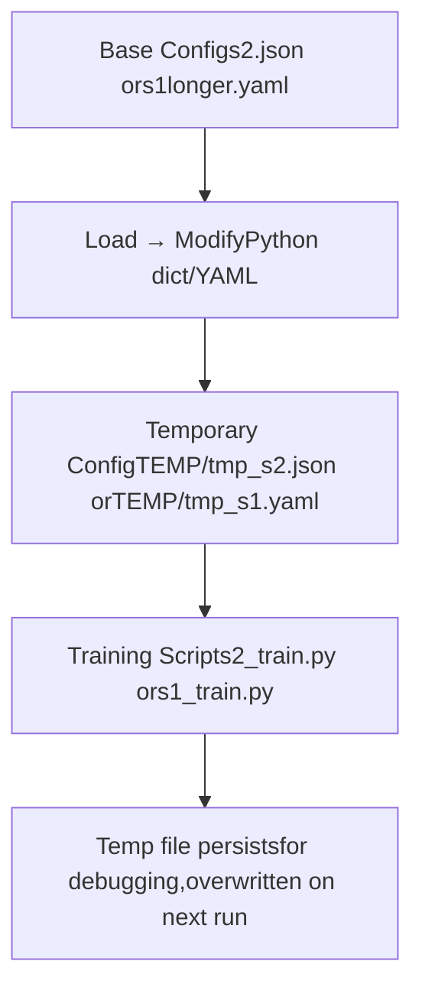
**Configuration Flow**

1.  Load base config from `GPT_SoVITS/configs/`
2.  Modify parameters based on user input
3.  Write to `TEMP/tmp_s2.json` or `TEMP/tmp_s1.yaml`
4.  Pass temp file path to training script
5.  Temp file remains for inspection but gets overwritten next run

Sources: [webui.py538-540](https://github.com/RVC-Boss/GPT-SoVITS/blob/c767f0b8/webui.py#L538-L540) [webui.py632-634](https://github.com/RVC-Boss/GPT-SoVITS/blob/c767f0b8/webui.py#L632-L634)

### Multi-GPU Training Configuration

**SoVITS Multi-GPU (s2\_train.py)**

GPU allocation is handled via config file, not environment variable:

```
# webui.py:530data["train"]["gpu_numbers"] = gpu_numbers1Ba  # e.g., "0,1,2" # Inside s2_train.py (not shown in provided files)# Reads config["train"]["gpu_numbers"]# Uses torch.nn.DataParallel or DistributedDataParallel
```
**GPT Multi-GPU (s1\_train.py)**

Uses environment variable for PyTorch Lightning DDP:

```
# webui.py:630os.environ["_CUDA_VISIBLE_DEVICES"] = str(fix_gpu_numbers(gpu_numbers.replace("-", ","))) # Inside s1_train.py (not shown in provided files)# PyTorch Lightning trainer reads CUDA_VISIBLE_DEVICES# Automatically sets up DDP across visible GPUs
```
Sources: [webui.py530](https://github.com/RVC-Boss/GPT-SoVITS/blob/c767f0b8/webui.py#L530-L530) [webui.py630](https://github.com/RVC-Boss/GPT-SoVITS/blob/c767f0b8/webui.py#L630-L630)

---

## Process Monitoring and UI Integration

### Gradio UI Updates via Yielding

Process management functions use Python generators to provide real-time UI updates:

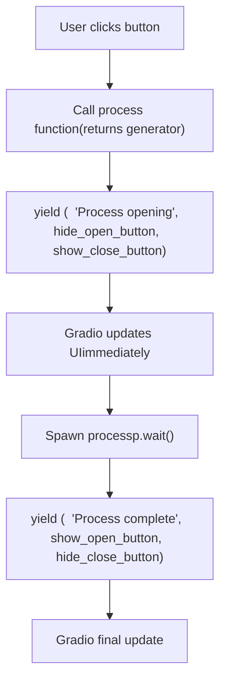
**Yield Pattern**

All process management functions follow this pattern:

```
def open_process(...):    if process_var is None:        # Initial yield: update UI to "running" state        yield (            process_info(name, "opened"),            {"__type__": "update", "visible": False},  # hide open button            {"__type__": "update", "visible": True},   # show close button        )                # Do actual work        p = Popen(cmd, shell=True)        p.wait()                # Final yield: update UI to "complete" state        yield (            process_info(name, "finish"),            {"__type__": "update", "visible": True},   # show open button            {"__type__": "update", "visible": False},  # hide close button        )
```
Sources: [webui.py280-295](https://github.com/RVC-Boss/GPT-SoVITS/blob/c767f0b8/webui.py#L280-L295) [webui.py386-405](https://github.com/RVC-Boss/GPT-SoVITS/blob/c767f0b8/webui.py#L386-L405) [webui.py812-840](https://github.com/RVC-Boss/GPT-SoVITS/blob/c767f0b8/webui.py#L812-L840)

### Process State Messages

The `process_info()` function provides internationalized status messages:

| Indicator | English Meaning | Used When |
| --- | --- | --- |
| `"opened"` | "Process opened" | Process starts |
| `"closed"` | "Process closed" | Process terminated |
| `"running"` | "Process running" | Process in progress |
| `"finish"` | "Process finished" | Process completed successfully |
| `"failed"` | "Process failed" | Process encountered error |
| `"occupy"` | "Process occupied, must terminate before starting next" | Tried to start while running |

Sources: [webui.py244-264](https://github.com/RVC-Boss/GPT-SoVITS/blob/c767f0b8/webui.py#L244-L264)

---

## Summary

The GPT-SoVITS process management system provides:

1.  **Robust Hardware Detection**: Automatic GPU enumeration with capability assessment
2.  **Flexible GPU Allocation**: Support for single-GPU, multi-GPU, and multi-process scenarios
3.  **Safe Process Lifecycle**: Prevention of concurrent execution via null checks
4.  **Platform Portability**: Cross-platform process termination (Windows/Unix)
5.  **Memory Optimization**: Automatic batch size calculation and precision fallback
6.  **User-Friendly UI**: Real-time status updates via generator pattern
7.  **Resource Cleanup**: Explicit memory management for GPU models

The architecture balances simplicity (global process variables) with functionality (multi-GPU parallel processing) to provide a reliable training and inference environment.

Sources: [webui.py1-1261](https://github.com/RVC-Boss/GPT-SoVITS/blob/c767f0b8/webui.py#L1-L1261) [config.py148-196](https://github.com/RVC-Boss/GPT-SoVITS/blob/c767f0b8/config.py#L148-L196) [api.py204-287](https://github.com/RVC-Boss/GPT-SoVITS/blob/c767f0b8/api.py#L204-L287)
