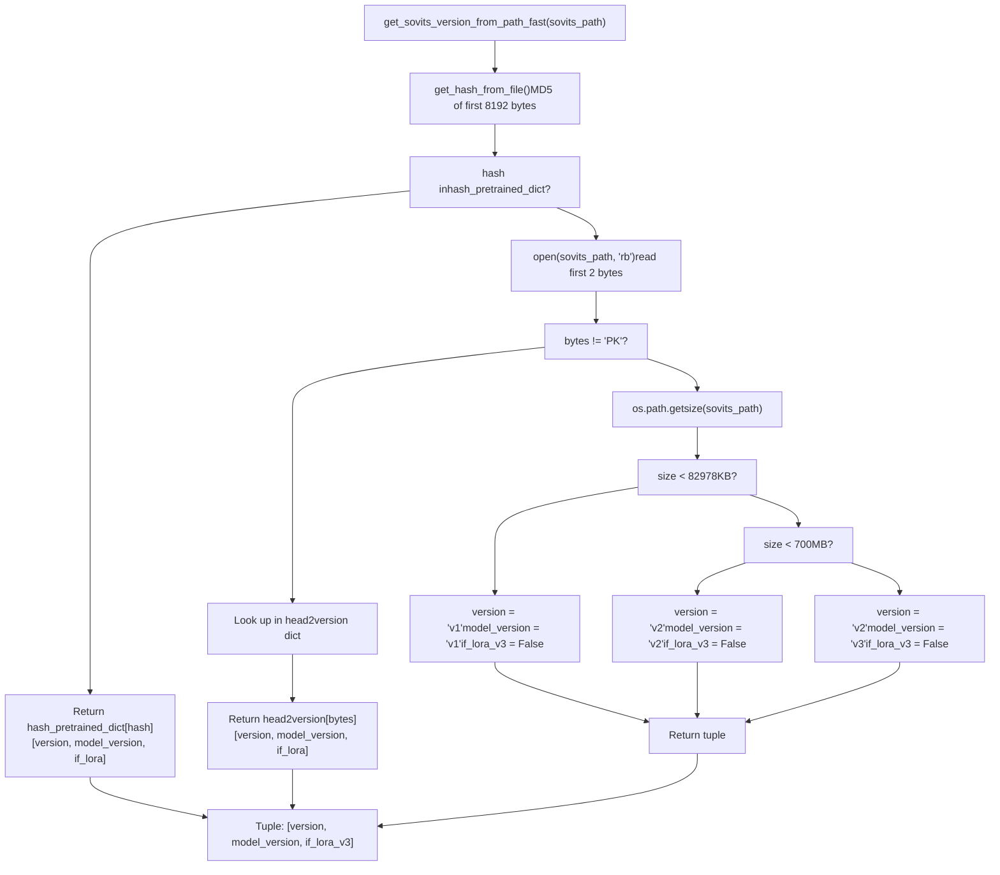
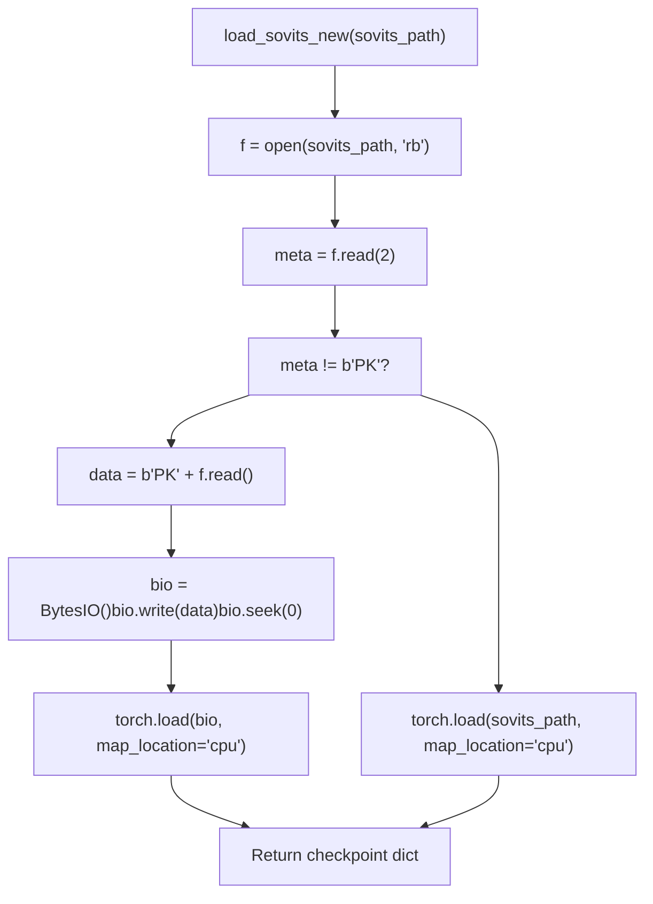
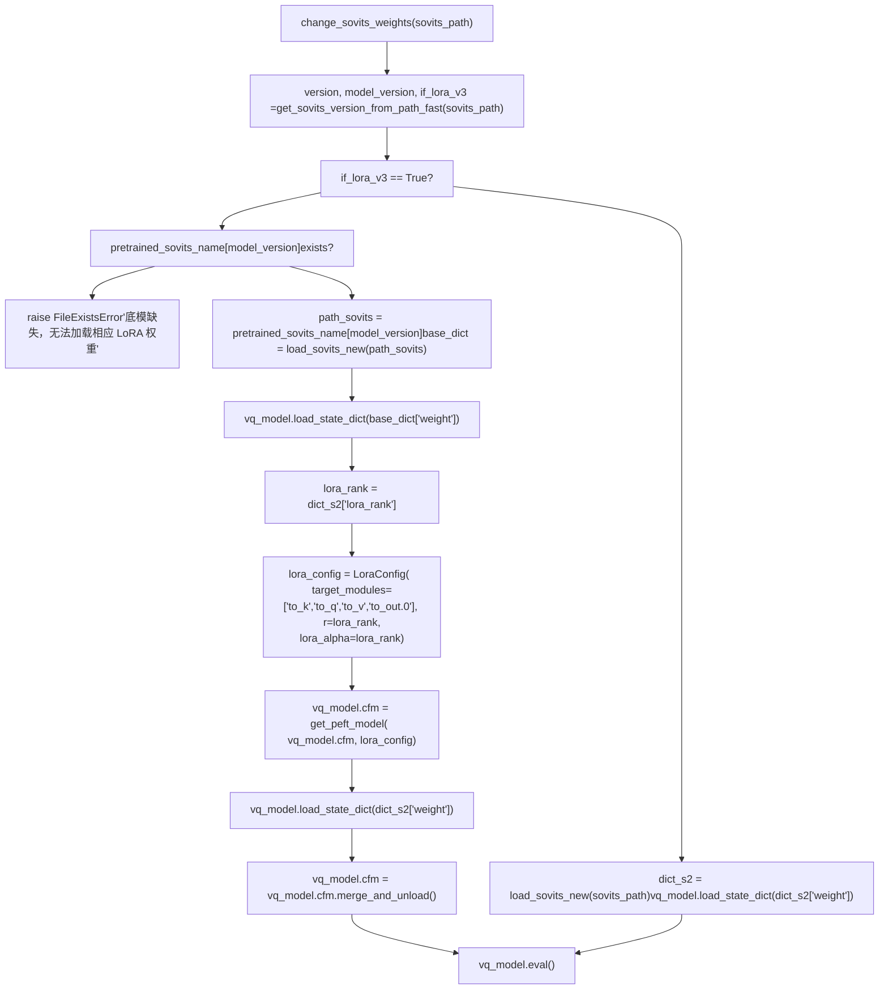
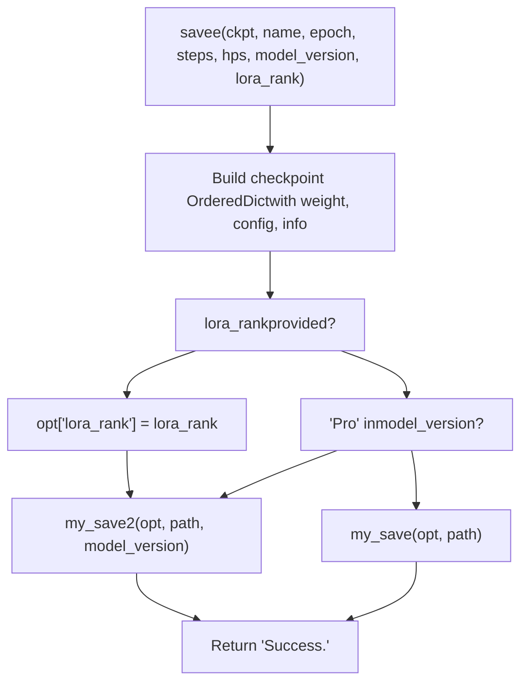
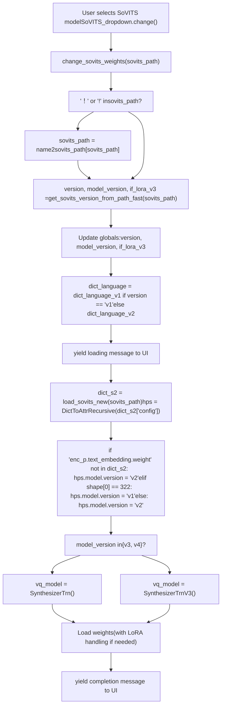
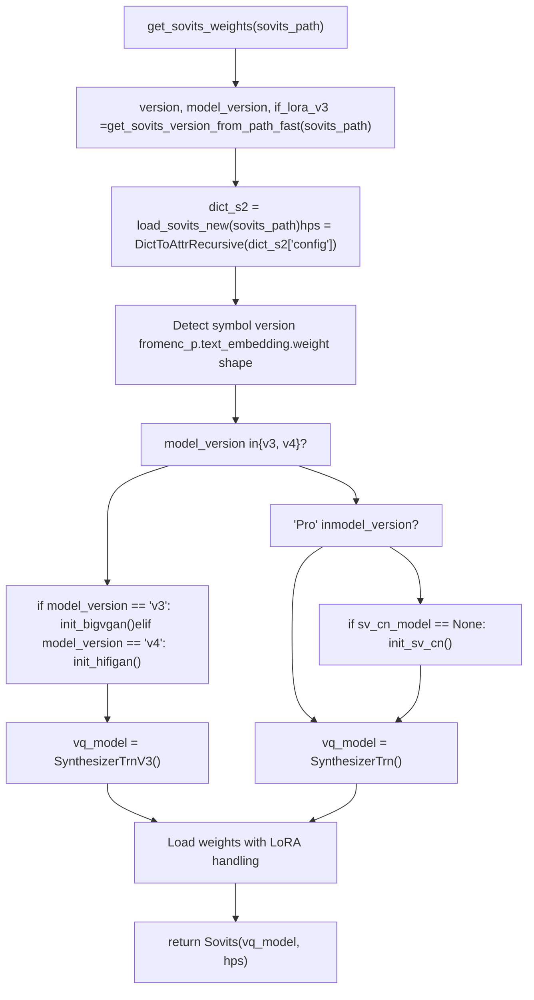

# Version Detection and Model Loading

Relevant source files

-   [GPT\_SoVITS/inference\_webui.py](https://github.com/RVC-Boss/GPT-SoVITS/blob/c767f0b8/GPT_SoVITS/inference_webui.py)
-   [GPT\_SoVITS/inference\_webui\_fast.py](https://github.com/RVC-Boss/GPT-SoVITS/blob/c767f0b8/GPT_SoVITS/inference_webui_fast.py)
-   [GPT\_SoVITS/process\_ckpt.py](https://github.com/RVC-Boss/GPT-SoVITS/blob/c767f0b8/GPT_SoVITS/process_ckpt.py)
-   [api.py](https://github.com/RVC-Boss/GPT-SoVITS/blob/c767f0b8/api.py)
-   [config.py](https://github.com/RVC-Boss/GPT-SoVITS/blob/c767f0b8/config.py)
-   [tools/assets.py](https://github.com/RVC-Boss/GPT-SoVITS/blob/c767f0b8/tools/assets.py)
-   [webui.py](https://github.com/RVC-Boss/GPT-SoVITS/blob/c767f0b8/webui.py)

## Overview

The `process_ckpt.py` module provides automatic version detection and checkpoint loading functionality for SoVITS models. The system identifies model versions (v1, v2, v3, v4, v2Pro, v2ProPlus) without loading full weights into memory, enabling efficient model switching in the WebUI and API.

**Core Functions:**

-   `get_sovits_version_from_path_fast()` - Three-tier version detection (hash → header → size)
-   `load_sovits_new()` - Checkpoint loading with custom byte prefix handling
-   `savee()` - Training checkpoint save with version encoding
-   `my_save()` / `my_save2()` - File saving with Chinese path support

**Key Integration Points:**

-   [GPT\_SoVITS/inference\_webui.py229-368](https://github.com/RVC-Boss/GPT-SoVITS/blob/c767f0b8/GPT_SoVITS/inference_webui.py#L229-L368) - `change_sovits_weights()`
-   [api.py381-464](https://github.com/RVC-Boss/GPT-SoVITS/blob/c767f0b8/api.py#L381-L464) - `get_sovits_weights()`
-   [GPT\_SoVITS/inference\_webui\_fast.py233-298](https://github.com/RVC-Boss/GPT-SoVITS/blob/c767f0b8/GPT_SoVITS/inference_webui_fast.py#L233-L298) - Fast inference pipeline

See [Model Versions and Evolution](/RVC-Boss/GPT-SoVITS/1.2-model-versions-and-evolution) for architecture differences between versions.

**Sources:** [GPT\_SoVITS/process\_ckpt.py1-139](https://github.com/RVC-Boss/GPT-SoVITS/blob/c767f0b8/GPT_SoVITS/process_ckpt.py#L1-L139)

---

## Version Detection Strategy

The system employs a three-tiered detection strategy to identify model versions from checkpoint files without loading the full model into memory.

### Detection Flow

**get\_sovits\_version\_from\_path\_fast() Function Flow**


**Sources:** [GPT\_SoVITS/process\_ckpt.py100-126](https://github.com/RVC-Boss/GPT-SoVITS/blob/c767f0b8/GPT_SoVITS/process_ckpt.py#L100-L126) [GPT\_SoVITS/process\_ckpt.py92-97](https://github.com/RVC-Boss/GPT-SoVITS/blob/c767f0b8/GPT_SoVITS/process_ckpt.py#L92-L97)

### Tier 1: Hash-Based Detection (Pretrained Models)

The `hash_pretrained_dict` dictionary maps MD5 hashes (first 8192 bytes) to version information for all official pretrained models.

| Hash (MD5) | Version | Model Version | LoRA | Checkpoint File |
| --- | --- | --- | --- | --- |
| `dc3c97e17592963677a4a1681f30c653` | v2 | v2 | No | `s2G488k.pth` |
| `6642b37f3dbb1f76882b69937c95a5f3` | v2 | v2 | No | `s2G2333k.pth` |
| `43797be674a37c1c83ee81081941ed0f` | v2 | v3 | No | `s2Gv3.pth` |
| `4f26b9476d0c5033e04162c486074374` | v2 | v4 | No | `s2Gv4.pth` |
| `c7e9fce2223f3db685cdfa1e6368728a` | v2 | v2Pro | No | `s2Gv2Pro.pth` |
| `66b313e39455b57ab1b0bc0b239c9d0a` | v2 | v2ProPlus | No | `s2Gv2ProPlus.pth` |

The `get_hash_from_file()` function computes the MD5 hash using `hashlib.md5()` on the first 8192 bytes of the file.

**Sources:** [GPT\_SoVITS/process\_ckpt.py81-97](https://github.com/RVC-Boss/GPT-SoVITS/blob/c767f0b8/GPT_SoVITS/process_ckpt.py#L81-L97) [GPT\_SoVITS/process\_ckpt.py100-104](https://github.com/RVC-Boss/GPT-SoVITS/blob/c767f0b8/GPT_SoVITS/process_ckpt.py#L100-L104)

### Tier 2: Byte Header Detection (New Weights)

The `my_save2()` function replaces the standard PyTorch `b"PK"` magic bytes with custom 2-byte version headers. The `head2version` dictionary decodes these headers.

**head2version Dictionary:**

| Byte Header | Symbol Version | Model Version | LoRA | Description |
| --- | --- | --- | --- | --- |
| `b"00"` | v1 | v1 | No | Original version (322 phonemes) |
| `b"01"` | v2 | v2 | No | V2 symbols (340+ phonemes) |
| `b"02"` | v2 | v3 | No | V3 full weights (CFM) |
| `b"03"` | v2 | v3 | Yes | V3 LoRA adapter |
| `b"04"` | v2 | v4 | Yes | V4 LoRA adapter |
| `b"05"` | v2 | v2Pro | No | V2Pro speaker verification |
| `b"06"` | v2 | v2ProPlus | No | V2ProPlus enhanced SV |

**Version Tuple Structure:**

-   `[0]` **Symbol version**: Controls `dict_language` and phoneme sequence encoding
-   `[1]` **Model version**: Determines architecture class (`SynthesizerTrn` vs `SynthesizerTrnV3`)
-   `[2]` **LoRA flag**: If `True`, requires pretrained base model for adapter loading

**Sources:** [GPT\_SoVITS/process\_ckpt.py22-27](https://github.com/RVC-Boss/GPT-SoVITS/blob/c767f0b8/GPT_SoVITS/process_ckpt.py#L22-L27) [GPT\_SoVITS/process\_ckpt.py72-80](https://github.com/RVC-Boss/GPT-SoVITS/blob/c767f0b8/GPT_SoVITS/process_ckpt.py#L72-L80) [GPT\_SoVITS/process\_ckpt.py106-109](https://github.com/RVC-Boss/GPT-SoVITS/blob/c767f0b8/GPT_SoVITS/process_ckpt.py#L106-L109)

### Tier 3: File Size Fallback (Legacy Weights)

For old checkpoint files without custom headers (standard PyTorch `"PK"` magic bytes), version is inferred from file size:

-   **< 82,978 KB**: v1 weights
-   **< 700 MB**: v2 weights
-   **≥ 700 MB**: v3 weights (symbol version = v2)

**Sources:** [GPT\_SoVITS/process\_ckpt.py110-126](https://github.com/RVC-Boss/GPT-SoVITS/blob/c767f0b8/GPT_SoVITS/process_ckpt.py#L110-L126)

---

## Checkpoint Loading Process

### Standard Loading with Byte Prefix Handling

The `load_sovits_new()` function normalizes checkpoint loading by handling both standard PyTorch files and version-encoded files.

**load\_sovits\_new() Function Flow**


**Checkpoint Dictionary Structure:**

```
checkpoint = {    "weight": {layer_name: tensor, ...},  # Model state_dict    "config": {...},                       # HPS object (hyperparameters)    "info": "8epoch_25000iteration",       # Training metadata    "lora_rank": 16                        # Optional: LoRA models only}
```
**Sources:** [GPT\_SoVITS/process\_ckpt.py129-138](https://github.com/RVC-Boss/GPT-SoVITS/blob/c767f0b8/GPT_SoVITS/process_ckpt.py#L129-L138)

---

## LoRA Weight Handling

### LoRA Detection and Loading

V3 and V4 models support LoRA training with 8GB VRAM. LoRA checkpoints contain adapter weights that must be applied on top of pretrained base models.

**LoRA Loading Flow (change\_sovits\_weights)**


**Pretrained Base Model Paths (from config.py):**

```
pretrained_sovits_name = {    "v3": "GPT_SoVITS/pretrained_models/s2Gv3.pth",    "v4": "GPT_SoVITS/pretrained_models/gsv-v4-pretrained/s2Gv4.pth"}
```
**Sources:** [GPT\_SoVITS/inference\_webui.py322-342](https://github.com/RVC-Boss/GPT-SoVITS/blob/c767f0b8/GPT_SoVITS/inference_webui.py#L322-L342) [api.py445-461](https://github.com/RVC-Boss/GPT-SoVITS/blob/c767f0b8/api.py#L445-L461) [config.py12-19](https://github.com/RVC-Boss/GPT-SoVITS/blob/c767f0b8/config.py#L12-L19)

### LoRA Configuration Details

The PEFT library applies LoRA adapters specifically to the CFM (Continuous Flow Matching) module's attention layers.

**LoraConfig Parameters:**

| Parameter | Value | Purpose |
| --- | --- | --- |
| `target_modules` | `["to_k", "to_q", "to_v", "to_out.0"]` | Attention projection layers |
| `r` | Extracted from `checkpoint["lora_rank"]` | LoRA rank (typically 8-32) |
| `lora_alpha` | Same as `r` | Scaling factor |
| `init_lora_weights` | `True` | Initialize weights before loading |

**Module Hierarchy:**

```
vq_model (SynthesizerTrnV3)
└── cfm (CFM module)
    └── DiT blocks
        └── Attention layers
            ├── to_k   (Key projection)
            ├── to_q   (Query projection)
            ├── to_v   (Value projection)
            └── to_out.0 (Output projection)
```
After loading adapter weights, `vq_model.cfm.merge_and_unload()` merges the LoRA matrices into the base weights for efficient inference.

**Sources:** [GPT\_SoVITS/inference\_webui.py330-340](https://github.com/RVC-Boss/GPT-SoVITS/blob/c767f0b8/GPT_SoVITS/inference_webui.py#L330-L340) [api.py450-459](https://github.com/RVC-Boss/GPT-SoVITS/blob/c767f0b8/api.py#L450-L459)

---

## Checkpoint Saving Functions

### my\_save() - Chinese Path Support

The `my_save()` function handles non-ASCII characters in file paths (common for Chinese Windows users) by saving to a temporary file first.

**Function Logic:**

```
def my_save(fea, path):    dir = os.path.dirname(path)      # Extract directory    name = os.path.basename(path)     # Extract filename    tmp_path = "%s.pth" % (ttime())   # Temporary name: timestamp.pth    torch.save(fea, tmp_path)         # Save to temp (ASCII path)    shutil.move(tmp_path, "%s/%s" % (dir, name))  # Move to final path
```
This avoids `torch.save()` failures with non-ASCII paths on some platforms.

**Sources:** [GPT\_SoVITS/process\_ckpt.py12-17](https://github.com/RVC-Boss/GPT-SoVITS/blob/c767f0b8/GPT_SoVITS/process_ckpt.py#L12-L17)

### my\_save2() - Version-Encoded Save

The `my_save2()` function writes checkpoints with custom byte headers for version identification.

**Function Logic:**

```
def my_save2(fea, path, model_version):    bio = BytesIO()    torch.save(fea, bio)              # Save to memory buffer    bio.seek(0)    data = bio.getvalue()             # Get raw bytes    byte = model_version2byte[model_version]  # Get version bytes    data = byte + data[2:]            # Replace 'PK' with version bytes    with open(path, 'wb') as f:        f.write(data)                 # Write modified data
```
**model\_version2byte Mapping:**

```
model_version2byte = {    "v3": b"03",        # V3 LoRA    "v4": b"04",        # V4 LoRA    "v2Pro": b"05",     # V2Pro    "v2ProPlus": b"06"  # V2ProPlus}
```
**Sources:** [GPT\_SoVITS/process\_ckpt.py22-38](https://github.com/RVC-Boss/GPT-SoVITS/blob/c767f0b8/GPT_SoVITS/process_ckpt.py#L22-L38)

### savee() - Training Checkpoint Save

The `savee()` function is called during training to save model checkpoints with appropriate versioning.

**Function Signature:**

```
def savee(ckpt, name, epoch, steps, hps, model_version=None, lora_rank=None)
```
**Checkpoint Construction:**

```
opt = OrderedDict()opt["weight"] = {}for key in ckpt.keys():    if "enc_q" in key:        # Skip encoder quantizer (not needed for inference)        continue    opt["weight"][key] = ckpt[key].half()  # Convert to FP16opt["config"] = hps           # Hyperparameters dictopt["info"] = "%sepoch_%siteration" % (epoch, steps)  # Training progressif lora_rank:    opt["lora_rank"] = lora_rank  # LoRA models only
```
**Save Logic Flow:**


**Sources:** [GPT\_SoVITS/process\_ckpt.py41-60](https://github.com/RVC-Boss/GPT-SoVITS/blob/c767f0b8/GPT_SoVITS/process_ckpt.py#L41-L60)

---

## Integration Points

### Inference WebUI Integration

The main WebUI uses `change_sovits_weights()` when the user selects a model from the dropdown menu.

**change\_sovits\_weights() Flow in inference\_webui.py**


**Global Variables Updated:**

-   `version` - Controls `dict_language` and phoneme encoding (v1 vs v2 symbol tables)
-   `model_version` - Determines architecture class and vocoder initialization
-   `if_lora_v3` - Boolean flag controlling LoRA loading path
-   `vq_model` - The loaded SoVITS model instance
-   `hps` - Hyperparameters from checkpoint config

**Sources:** [GPT\_SoVITS/inference\_webui.py229-368](https://github.com/RVC-Boss/GPT-SoVITS/blob/c767f0b8/GPT_SoVITS/inference_webui.py#L229-L368)

### API Server Integration

The API server (`api.py`) uses the same version detection system in the `get_sovits_weights()` function, which is called when changing models via the `/control` endpoint.

**get\_sovits\_weights() Function Flow:**


**Sovits Class:**

```
class Sovits:    def __init__(self, vq_model, hps):        self.vq_model = vq_model  # SynthesizerTrn or SynthesizerTrnV3        self.hps = hps            # Hyperparameters
```
**Sources:** [api.py381-464](https://github.com/RVC-Boss/GPT-SoVITS/blob/c767f0b8/api.py#L381-L464) [api.py372-375](https://github.com/RVC-Boss/GPT-SoVITS/blob/c767f0b8/api.py#L372-L375)

### Fast Inference WebUI Integration

The fast inference pipeline (`inference_webui_fast.py`) uses version detection within the `TTS_Config` and `TTS` classes.

**Initialization Flow:**

```
# Load initial config from environment or weight.jsongpt_path = os.environ.get("gpt_path", weight_data.get("GPT", {}).get(version, GPT_names[-1]))sovits_path = os.environ.get("sovits_path", weight_data.get("SoVITS", {}).get(version, SoVITS_names[0])) # Initialize TTS config and pipelinetts_config = TTS_Config("GPT_SoVITS/configs/tts_infer.yaml")tts_config.update_version(version)  # Sets version-specific parameterstts_pipeline = TTS(tts_config)      # Internally calls get_sovits_version_from_path_fast # When user changes modeldef change_sovits_weights(sovits_path):    version, model_version, if_lora_v3 = get_sovits_version_from_path_fast(sovits_path)    tts_pipeline.init_vits_weights(sovits_path)  # Reloads model with version detection
```
**Sources:** [GPT\_SoVITS/inference\_webui\_fast.py228-298](https://github.com/RVC-Boss/GPT-SoVITS/blob/c767f0b8/GPT_SoVITS/inference_webui_fast.py#L228-L298) [GPT\_SoVITS/inference\_webui\_fast.py125-147](https://github.com/RVC-Boss/GPT-SoVITS/blob/c767f0b8/GPT_SoVITS/inference_webui_fast.py#L125-L147)

---

## Model Instantiation Logic

After version detection, the system instantiates the appropriate model class and initializes version-specific components.

### Model Class Selection

| Model Version | Python Class | Config File | Vocoder | Additional Components |
| --- | --- | --- | --- | --- |
| v1, v2 | `SynthesizerTrn` | `s2.json` | Built-in decoder | None |
| v2Pro | `SynthesizerTrn` | `s2v2Pro.json` | Built-in decoder | `sv_cn_model` (SV) |
| v2ProPlus | `SynthesizerTrn` | `s2v2ProPlus.json` | Built-in decoder | `sv_cn_model` (SV) |
| v3 | `SynthesizerTrnV3` | `s2.json` | `bigvgan_model` | BigVGAN v2 24kHz |
| v4 | `SynthesizerTrnV3` | `s2.json` | `hifigan_model` | HiFi-GAN v4 48kHz |

**Sources:** [GPT\_SoVITS/inference\_webui.py293-311](https://github.com/RVC-Boss/GPT-SoVITS/blob/c767f0b8/GPT_SoVITS/inference_webui.py#L293-L311) [api.py408-431](https://github.com/RVC-Boss/GPT-SoVITS/blob/c767f0b8/api.py#L408-L431)

### Symbol Version Detection

The symbol version (v1 vs v2) determines which phoneme vocabulary to use for text processing. This is detected by examining the text embedding layer shape.

**Detection Logic:**

```
# From inference_webui.py:285-290if "enc_p.text_embedding.weight" not in dict_s2["weight"]:    hps.model.version = "v2"  # V3/V4 architecture with v2 symbolselif dict_s2["weight"]["enc_p.text_embedding.weight"].shape[0] == 322:    hps.model.version = "v1"  # Original 322 phoneme vocabularyelse:    hps.model.version = "v2"  # Extended 340+ phoneme vocabulary
```
**Symbol Version Impact:**

-   `version = "v1"`: Uses `dict_language_v1` (6 language options)
-   `version = "v2"`: Uses `dict_language_v2` (10 language options including Cantonese and Korean)

**Sources:** [GPT\_SoVITS/inference\_webui.py285-291](https://github.com/RVC-Boss/GPT-SoVITS/blob/c767f0b8/GPT_SoVITS/inference_webui.py#L285-L291) [GPT\_SoVITS/inference\_webui.py140-161](https://github.com/RVC-Boss/GPT-SoVITS/blob/c767f0b8/GPT_SoVITS/inference_webui.py#L140-L161)

### Vocoder Initialization

V3 and V4 models require external vocoders that are initialized on-demand.

**Vocoder Loading Functions:**

```
# V3: BigVGANdef init_bigvgan():    global bigvgan_model    from BigVGAN import bigvgan    bigvgan_model = bigvgan.BigVGAN.from_pretrained(        "GPT_SoVITS/pretrained_models/models--nvidia--bigvgan_v2_24khz_100band_256x",        use_cuda_kernel=False    )    bigvgan_model.remove_weight_norm()    bigvgan_model = bigvgan_model.eval().to(device) # V4: HiFi-GANdef init_hifigan():    global hifigan_model    hifigan_model = Generator(        initial_channel=100, resblock="1",        upsample_rates=[10, 6, 2, 2, 2], ...    )    state_dict = torch.load("GPT_SoVITS/pretrained_models/gsv-v4-pretrained/vocoder.pth")    hifigan_model.load_state_dict(state_dict)    hifigan_model = hifigan_model.eval().to(device)
```
**Sources:** [GPT\_SoVITS/inference\_webui.py440-485](https://github.com/RVC-Boss/GPT-SoVITS/blob/c767f0b8/GPT_SoVITS/inference_webui.py#L440-L485) [api.py237-280](https://github.com/RVC-Boss/GPT-SoVITS/blob/c767f0b8/api.py#L237-L280)

---

## Summary

The version detection and model loading system provides:

1.  **Fast version identification** without loading full model weights into memory
2.  **Backwards compatibility** with legacy checkpoint formats through file size fallback
3.  **Forward compatibility** through extensible byte header system
4.  **LoRA support** with automatic base model loading and adapter merging
5.  **Robust file handling** for non-ASCII paths

This system enables seamless switching between model versions in the UI and API while maintaining compatibility across all historical checkpoint formats.

**Sources:** [GPT\_SoVITS/process\_ckpt.py1-139](https://github.com/RVC-Boss/GPT-SoVITS/blob/c767f0b8/GPT_SoVITS/process_ckpt.py#L1-L139) [config.py12-75](https://github.com/RVC-Boss/GPT-SoVITS/blob/c767f0b8/config.py#L12-L75)
