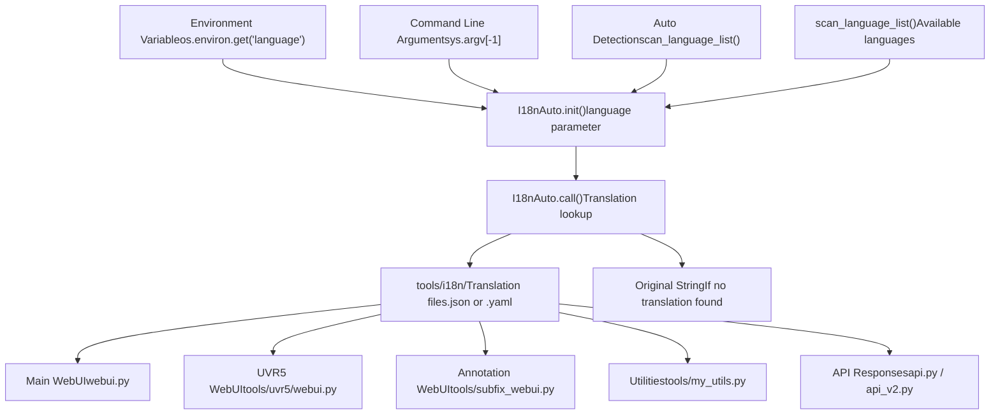
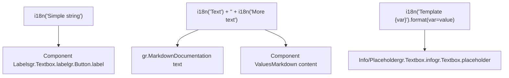
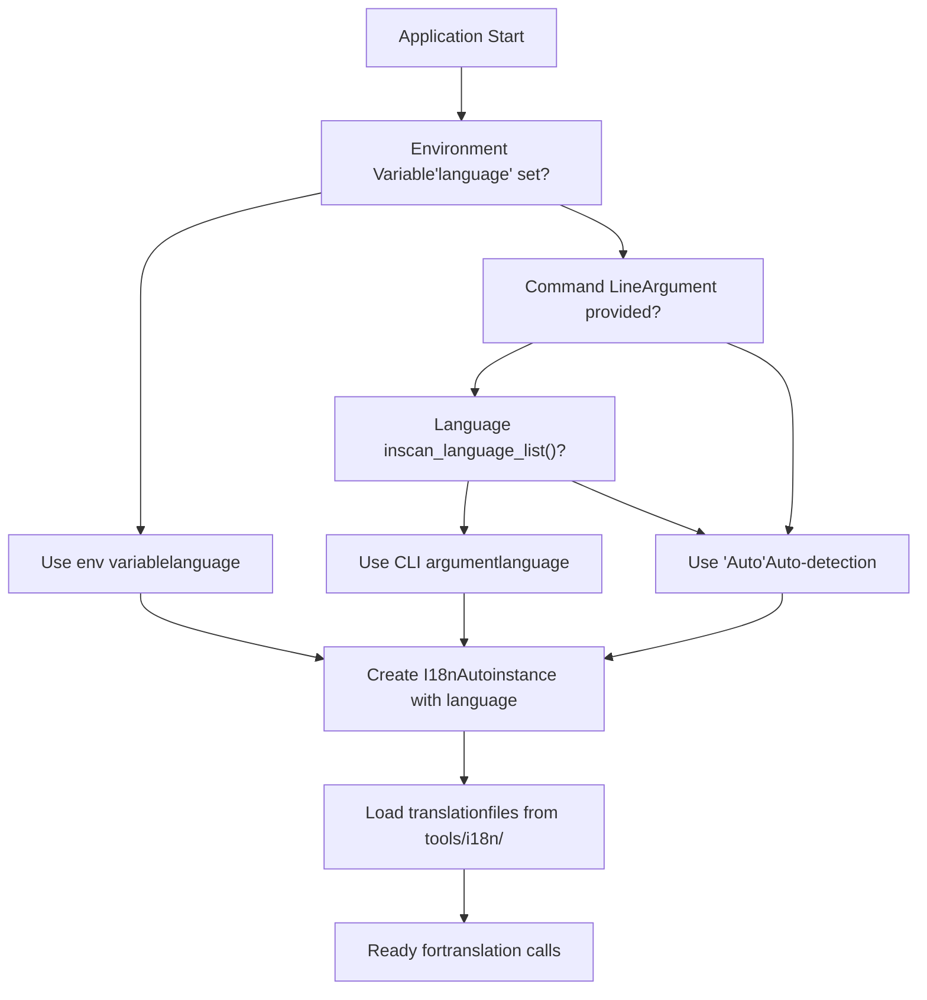
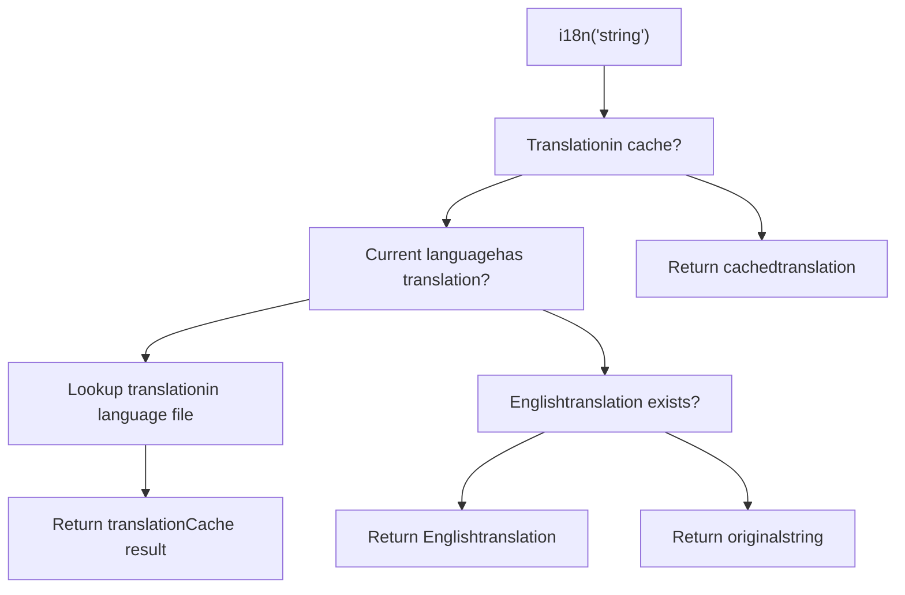
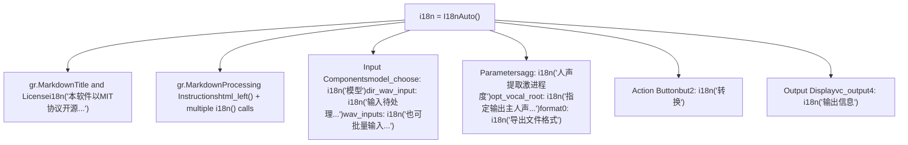

# Internationalization

Relevant source files

-   [tools/my\_utils.py](https://github.com/RVC-Boss/GPT-SoVITS/blob/c767f0b8/tools/my_utils.py)
-   [tools/slice\_audio.py](https://github.com/RVC-Boss/GPT-SoVITS/blob/c767f0b8/tools/slice_audio.py)
-   [tools/slicer2.py](https://github.com/RVC-Boss/GPT-SoVITS/blob/c767f0b8/tools/slicer2.py)
-   [tools/subfix\_webui.py](https://github.com/RVC-Boss/GPT-SoVITS/blob/c767f0b8/tools/subfix_webui.py)
-   [tools/uvr5/webui.py](https://github.com/RVC-Boss/GPT-SoVITS/blob/c767f0b8/tools/uvr5/webui.py)

## Purpose and Scope

This page documents the internationalization (i18n) system used throughout GPT-SoVITS to support multiple languages in user interfaces, error messages, and documentation. The system provides automatic language detection, translation management, and runtime language switching capabilities for all text displayed to users.

For information about text processing for TTS synthesis (G2P conversion, phoneme generation), see [Text Processing](/RVC-Boss/GPT-SoVITS/4-text-processing).

---

## System Overview

The GPT-SoVITS internationalization system is built around the `I18nAuto` class located in `tools/i18n/i18n.py`. This class provides a simple, callable interface for translating UI strings at runtime based on user language preferences.

### Core Architecture


**Sources:** [tools/uvr5/webui.py7-10](https://github.com/RVC-Boss/GPT-SoVITS/blob/c767f0b8/tools/uvr5/webui.py#L7-L10) [tools/subfix\_webui.py2-5](https://github.com/RVC-Boss/GPT-SoVITS/blob/c767f0b8/tools/subfix_webui.py#L2-L5) [tools/my\_utils.py11-13](https://github.com/RVC-Boss/GPT-SoVITS/blob/c767f0b8/tools/my_utils.py#L11-L13)

---

## I18nAuto Class

### Initialization Patterns

The `I18nAuto` class supports three initialization patterns, each used in different parts of the codebase:

#### Pattern 1: Default Auto Detection

Used in simple UI modules that don't need explicit language control:

```
from tools.i18n.i18n import I18nAutoi18n = I18nAuto()
```
This pattern relies on the system's default language detection mechanism.

**Sources:** [tools/uvr5/webui.py7-10](https://github.com/RVC-Boss/GPT-SoVITS/blob/c767f0b8/tools/uvr5/webui.py#L7-L10)

#### Pattern 2: Environment Variable

Used in utility modules that may be imported by various parts of the system:

```
from tools.i18n.i18n import I18nAutoi18n = I18nAuto(language=os.environ.get("language", "Auto"))
```
This allows language to be configured via environment variables, with "Auto" as the fallback.

**Sources:** [tools/my\_utils.py11-13](https://github.com/RVC-Boss/GPT-SoVITS/blob/c767f0b8/tools/my_utils.py#L11-L13)

#### Pattern 3: Command Line Argument

Used in standalone WebUI scripts that accept language as a command-line parameter:

```
from tools.i18n.i18n import I18nAuto, scan_language_listlanguage = sys.argv[-1] if sys.argv[-1] in scan_language_list() else "Auto"i18n = I18nAuto(language=language)
```
This validates the command line argument against available languages before initialization.

**Sources:** [tools/subfix\_webui.py2-5](https://github.com/RVC-Boss/GPT-SoVITS/blob/c767f0b8/tools/subfix_webui.py#L2-L5)

### Translation Interface

The `I18nAuto` instance is called as a function to translate strings:

```
i18n("Text to translate")
```
The translation system:

1.  Looks up the translation in the configured language's translation file
2.  Returns the translated string if found
3.  Falls back to the original string if no translation exists
4.  Preserves formatting and special characters

---

## Usage Patterns

### Gradio UI Elements

The i18n system is heavily used in Gradio UI components to localize labels, descriptions, and markdown content:


**Sources:** [tools/uvr5/webui.py130-217](https://github.com/RVC-Boss/GPT-SoVITS/blob/c767f0b8/tools/uvr5/webui.py#L130-L217) [tools/subfix\_webui.py312-316](https://github.com/RVC-Boss/GPT-SoVITS/blob/c767f0b8/tools/subfix_webui.py#L312-L316)

### Example: Multi-line Markdown Translation

```
gr.Markdown(    value=i18n("本软件以MIT协议开源, 作者不对软件具备任何控制力, 使用软件者、传播软件导出的声音者自负全责.")    + "<br>"    + i18n("如不认可该条款, 则不能使用或引用软件包内任何代码和文件. 详见根目录LICENSE."))
```
This pattern concatenates translated strings with HTML formatting to create multi-paragraph text.

**Sources:** [tools/uvr5/webui.py130-133](https://github.com/RVC-Boss/GPT-SoVITS/blob/c767f0b8/tools/uvr5/webui.py#L130-L133)

### Example: Component Label Translation

```
model_choose = gr.Dropdown(label=i18n("模型"), choices=uvr5_names)dir_wav_input = gr.Textbox(    label=i18n("输入待处理音频文件夹路径"),    placeholder="C:\\Users\\Desktop\\todo-songs",)
```
Component labels are always wrapped in `i18n()` calls to support localization.

**Sources:** [tools/uvr5/webui.py173-177](https://github.com/RVC-Boss/GPT-SoVITS/blob/c767f0b8/tools/uvr5/webui.py#L173-L177)

### Example: Complex Instructions with HTML

```
gr.Markdown(    value=html_left(        i18n("人声伴奏分离批量处理， 使用UVR5模型。")        + "<br>"        + i18n("合格的文件夹路径格式举例： E:\\codes\\py39\\vits_vc_gpu\\白鹭霜华测试样例(去文件管理器地址栏拷就行了)。")        + "<br>"        + i18n("模型分为三类：")        # ... more lines    ))
```
Complex documentation sections combine `i18n()` calls with HTML formatting helper functions.

**Sources:** [tools/uvr5/webui.py138-169](https://github.com/RVC-Boss/GPT-SoVITS/blob/c767f0b8/tools/uvr5/webui.py#L138-L169)

---

## Error Message Localization

Error messages throughout the codebase are wrapped in `i18n()` calls to provide localized feedback:

### Pattern: Direct Message Translation

```
raise RuntimeError(i18n("音频加载失败"))
```
Runtime errors use `i18n()` to translate error messages before raising exceptions.

**Sources:** [tools/my\_utils.py35](https://github.com/RVC-Boss/GPT-SoVITS/blob/c767f0b8/tools/my_utils.py#L35-L35)

### Pattern: Warning Messages with Gradio

```
gr.Warning(i18n("以下文件或文件夹不存在"))gr.Warning(i18n("缺少音素数据集"))gr.Warning(i18n("路径不能为空"))
```
Gradio warning dialogs display localized messages to users.

**Sources:** [tools/my\_utils.py69-85](https://github.com/RVC-Boss/GPT-SoVITS/blob/c767f0b8/tools/my_utils.py#L69-L85) [tools/my\_utils.py124-137](https://github.com/RVC-Boss/GPT-SoVITS/blob/c767f0b8/tools/my_utils.py#L124-L137)

### Pattern: Path-Specific Errors

```
if os.path.exists(wav_path):    ...else:    gr.Warning(wav_path + i18n("路径错误"))
```
Error messages can concatenate dynamic content (like file paths) with translated error descriptions.

**Sources:** [tools/my\_utils.py112](https://github.com/RVC-Boss/GPT-SoVITS/blob/c767f0b8/tools/my_utils.py#L112-L112)

---

## Language Selection Flow

### System Initialization


**Sources:** [tools/subfix\_webui.py2-5](https://github.com/RVC-Boss/GPT-SoVITS/blob/c767f0b8/tools/subfix_webui.py#L2-L5) [tools/my\_utils.py11-13](https://github.com/RVC-Boss/GPT-SoVITS/blob/c767f0b8/tools/my_utils.py#L11-L13)

### Runtime Translation Lookup


---

## Translation File Structure

The translation files are located in `tools/i18n/` directory. The system uses `scan_language_list()` to enumerate available languages.

### Common Translation Keys

Based on the usage patterns in the codebase, translations are organized by functional areas:

| Category | Example Keys |
| --- | --- |
| **Legal/License** | "本软件以MIT协议开源...", "如不认可该条款..." |
| **UI Labels** | "模型", "输入待处理音频文件夹路径", "转换", "输出信息" |
| **File Operations** | "路径不能为空", "路径错误", "以下文件或文件夹不存在" |
| **Audio Processing** | "音频加载失败", "人声伴奏分离批量处理", "导出文件格式" |
| **Dataset Preparation** | "缺少音素数据集", "缺少Hubert数据集", "缺少音频数据集", "缺少语义数据集" |
| **Instructions** | Long-form documentation text with HTML formatting |

**Sources:** [tools/uvr5/webui.py130-217](https://github.com/RVC-Boss/GPT-SoVITS/blob/c767f0b8/tools/uvr5/webui.py#L130-L217) [tools/my\_utils.py35-137](https://github.com/RVC-Boss/GPT-SoVITS/blob/c767f0b8/tools/my_utils.py#L35-L137)

---

## Integration with WebUI Components

### UVR5 Vocal Separation Interface

The UVR5 WebUI demonstrates comprehensive i18n integration:


**Sources:** [tools/uvr5/webui.py10](https://github.com/RVC-Boss/GPT-SoVITS/blob/c767f0b8/tools/uvr5/webui.py#L10-L10) [tools/uvr5/webui.py128-217](https://github.com/RVC-Boss/GPT-SoVITS/blob/c767f0b8/tools/uvr5/webui.py#L128-L217)

### Annotation WebUI Interface

The annotation WebUI shows language selection from command line:

```
language = sys.argv[-1] if sys.argv[-1] in scan_language_list() else "Auto"i18n = I18nAuto(language=language)
```
This allows users to explicitly specify their language preference when launching the annotation interface.

**Sources:** [tools/subfix\_webui.py4-5](https://github.com/RVC-Boss/GPT-SoVITS/blob/c767f0b8/tools/subfix_webui.py#L4-L5)

---

## Best Practices for Adding Translations

### 1\. Wrap All User-Facing Text

Every string displayed to users should be wrapped in an `i18n()` call:

```
# Goodlabel = i18n("Model") # Badlabel = "Model"
```
### 2\. Preserve Formatting in Keys

Keep HTML and formatting outside of translation keys when possible:

```
# Goodi18n("First line") + "<br>" + i18n("Second line") # Less ideal (harder to translate)i18n("First line<br>Second line")
```
**Sources:** [tools/uvr5/webui.py130-133](https://github.com/RVC-Boss/GPT-SoVITS/blob/c767f0b8/tools/uvr5/webui.py#L130-L133)

### 3\. Concatenate Dynamic Content

Separate dynamic content from translatable strings:

```
# Goodgr.Warning(file_path + i18n("路径错误")) # Bad (entire string would need translation for each path)gr.Warning(i18n(f"{file_path} path error"))
```
**Sources:** [tools/my\_utils.py112](https://github.com/RVC-Boss/GPT-SoVITS/blob/c767f0b8/tools/my_utils.py#L112-L112)

### 4\. Use Consistent Keys

Reuse the same translation key for identical concepts across different UI components to maintain consistency and reduce translation workload.

---

## Supported Languages

The system supports multiple languages through the `scan_language_list()` function, which enumerates available translation files in `tools/i18n/`. The special value "Auto" enables automatic language detection based on system locale.

Common supported languages likely include:

-   Chinese (Simplified and Traditional)
-   English
-   Japanese
-   Korean
-   And others based on available translation files

**Sources:** [tools/subfix\_webui.py2-5](https://github.com/RVC-Boss/GPT-SoVITS/blob/c767f0b8/tools/subfix_webui.py#L2-L5)

---

## Summary Table

| Component | File Path | Initialization Pattern | Primary Use Case |
| --- | --- | --- | --- |
| **UVR5 WebUI** | [tools/uvr5/webui.py7-10](https://github.com/RVC-Boss/GPT-SoVITS/blob/c767f0b8/tools/uvr5/webui.py#L7-L10) | `I18nAuto()` | Vocal separation UI labels and instructions |
| **Annotation WebUI** | [tools/subfix\_webui.py2-5](https://github.com/RVC-Boss/GPT-SoVITS/blob/c767f0b8/tools/subfix_webui.py#L2-L5) | `I18nAuto(language=sys.argv[-1])` | Dataset annotation interface with CLI language selection |
| **Utilities** | [tools/my\_utils.py11-13](https://github.com/RVC-Boss/GPT-SoVITS/blob/c767f0b8/tools/my_utils.py#L11-L13) | `I18nAuto(language=os.environ.get("language"))` | Error messages and warnings in shared utilities |
| **Main WebUI** | Implied (not shown) | Similar patterns | Primary training/inference interface |

---

**Sources:** [tools/uvr5/webui.py1-225](https://github.com/RVC-Boss/GPT-SoVITS/blob/c767f0b8/tools/uvr5/webui.py#L1-L225) [tools/subfix\_webui.py1-426](https://github.com/RVC-Boss/GPT-SoVITS/blob/c767f0b8/tools/subfix_webui.py#L1-L426) [tools/my\_utils.py1-232](https://github.com/RVC-Boss/GPT-SoVITS/blob/c767f0b8/tools/my_utils.py#L1-L232)
