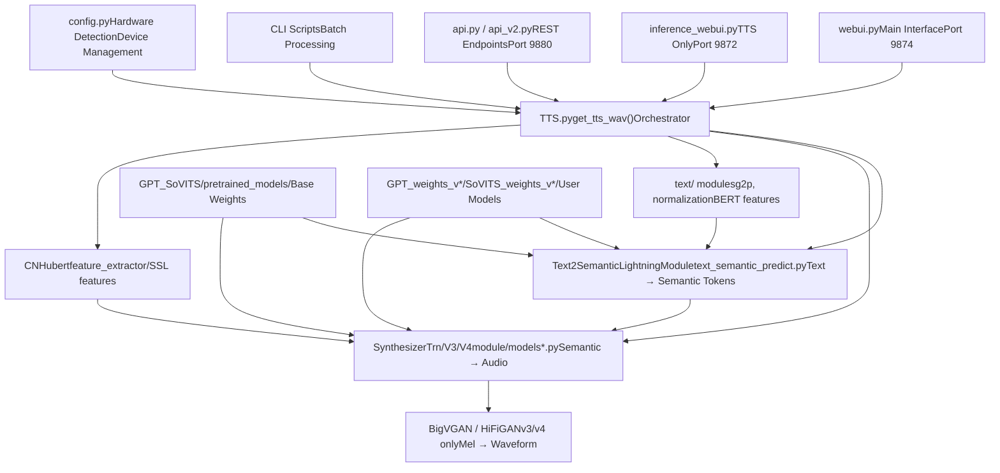
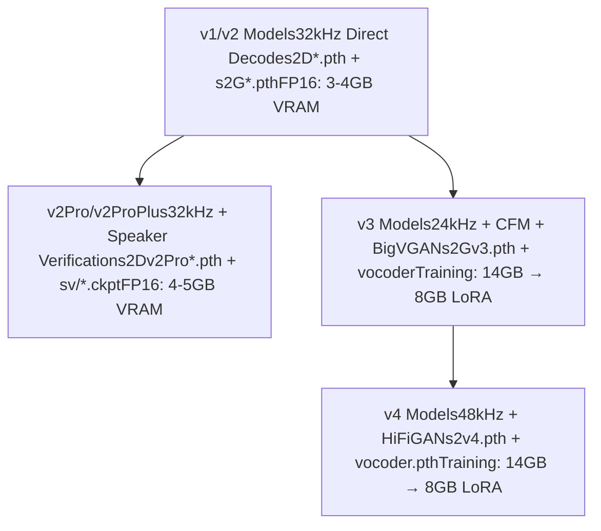
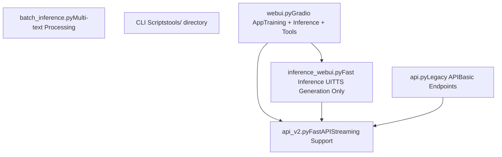
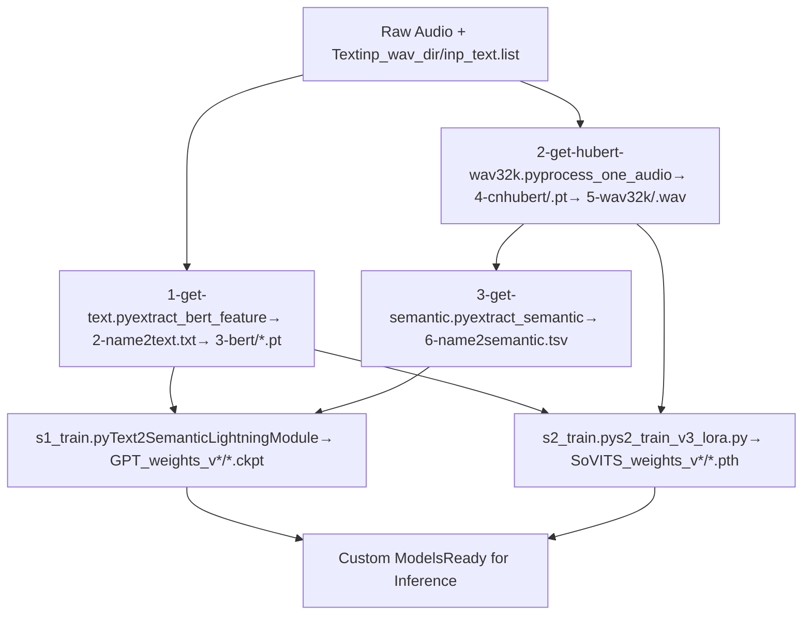
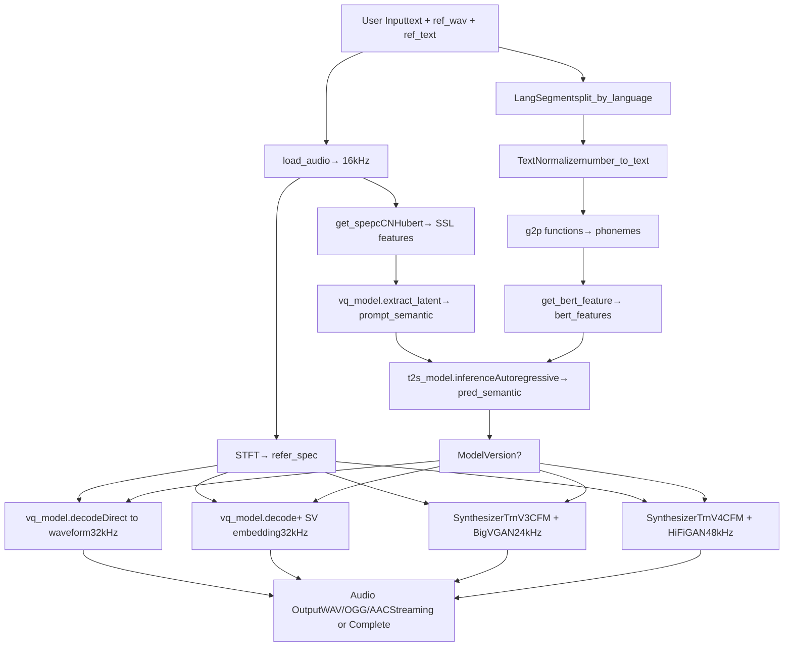
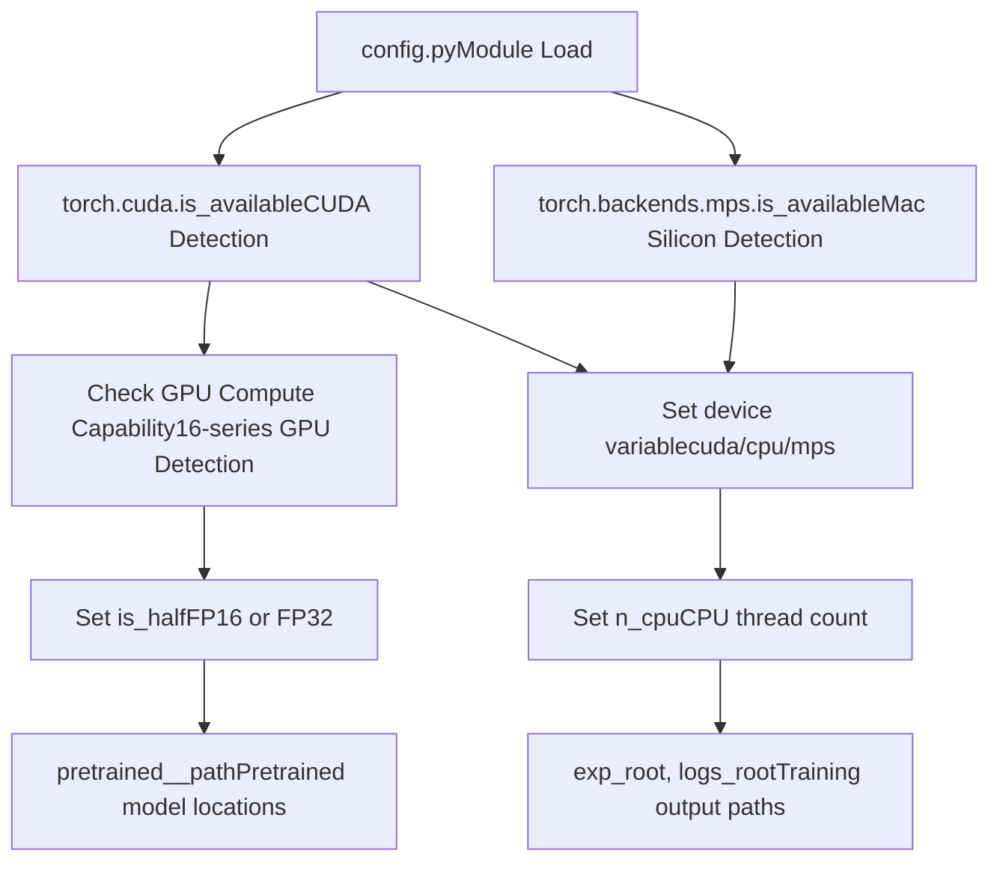
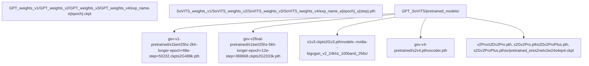
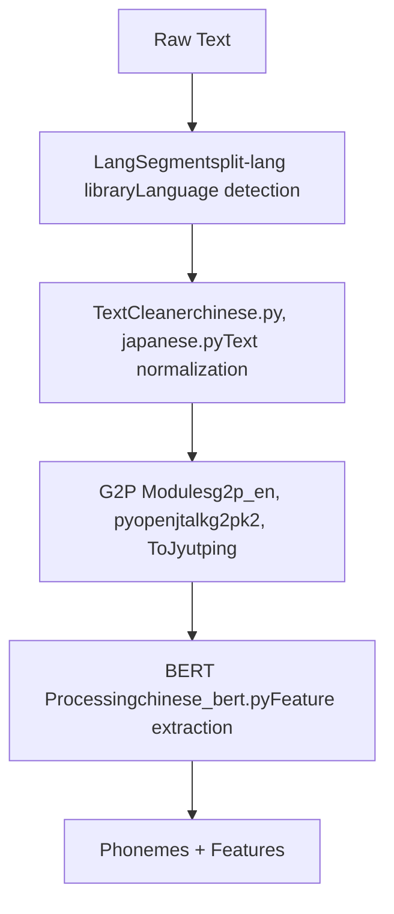

# Overview (概览)

相关源文件

-   [README.md](https://github.com/RVC-Boss/GPT-SoVITS/blob/c767f0b8/README.md?plain=1)
-   [docs/cn/Changelog\_CN.md](https://github.com/RVC-Boss/GPT-SoVITS/blob/c767f0b8/docs/cn/Changelog_CN.md?plain=1)
-   [docs/cn/README.md](https://github.com/RVC-Boss/GPT-SoVITS/blob/c767f0b8/docs/cn/README.md?plain=1)
-   [docs/en/Changelog\_EN.md](https://github.com/RVC-Boss/GPT-SoVITS/blob/c767f0b8/docs/en/Changelog_EN.md?plain=1)
-   [docs/ja/Changelog\_JA.md](https://github.com/RVC-Boss/GPT-SoVITS/blob/c767f0b8/docs/ja/Changelog_JA.md?plain=1)
-   [docs/ja/README.md](https://github.com/RVC-Boss/GPT-SoVITS/blob/c767f0b8/docs/ja/README.md?plain=1)
-   [docs/ko/Changelog\_KO.md](https://github.com/RVC-Boss/GPT-SoVITS/blob/c767f0b8/docs/ko/Changelog_KO.md?plain=1)
-   [docs/ko/README.md](https://github.com/RVC-Boss/GPT-SoVITS/blob/c767f0b8/docs/ko/README.md?plain=1)
-   [docs/tr/Changelog\_TR.md](https://github.com/RVC-Boss/GPT-SoVITS/blob/c767f0b8/docs/tr/Changelog_TR.md?plain=1)
-   [docs/tr/README.md](https://github.com/RVC-Boss/GPT-SoVITS/blob/c767f0b8/docs/tr/README.md?plain=1)
-   [install.ps1](https://github.com/RVC-Boss/GPT-SoVITS/blob/c767f0b8/install.ps1)
-   [install.sh](https://github.com/RVC-Boss/GPT-SoVITS/blob/c767f0b8/install.sh)
-   [requirements.txt](https://github.com/RVC-Boss/GPT-SoVITS/blob/c767f0b8/requirements.txt)

## Purpose and Scope (目的与范围)

本页面提供了 GPT-SoVITS 系统架构、核心能力和主要组件的高层概览。GPT-SoVITS 是一个 Few-shot (少样本) Voice Conversion (语音转换) 和 Text-to-Speech (TTS, 文本转语音) 系统，仅需 5 秒的 Reference Audio (参考音频) 即可克隆声音 (Zero-shot (零样本))，或使用 1 分钟的 Training Data (训练数据) 进行 Few-shot 训练。

有关特定子系统的详细信息：

-   安装步骤：参见 [Installation and Setup](/RVC-Boss/GPT-SoVITS/1.1-installation-and-setup)
-   模型架构详情：参见 [Core Model Architectures](/RVC-Boss/GPT-SoVITS/2.1-core-model-architectures)
-   训练工作流：参见 [Training Pipeline](/RVC-Boss/GPT-SoVITS/2.3-training-pipeline)
-   文本处理细节：参见 [Text Processing Pipeline](/RVC-Boss/GPT-SoVITS/2.2-text-processing-pipeline)

**Sources:** [README.md1-52](https://github.com/RVC-Boss/GPT-SoVITS/blob/c767f0b8/README.md?plain=1#L1-L52) [docs/cn/README.md1-46](https://github.com/RVC-Boss/GPT-SoVITS/blob/c767f0b8/docs/cn/README.md?plain=1#L1-L46)

## System Architecture (系统架构)

GPT-SoVITS 实现了一个两阶段 Neural Codec (神经编解码器) TTS 系统。该架构将 Semantic Token (语义标记) 生成与 Acoustic Synthesis (声学合成) 分离开来，实现了细粒度控制和高质量的 Voice Cloning (声音克隆)。

该系统遵循分层架构，用户界面调用 `TTS.py` 编排器，后者使用预训练或自定义训练的权重协调模型推理。

**Sources:** [README.md30-40](https://github.com/RVC-Boss/GPT-SoVITS/blob/c767f0b8/README.md?plain=1#L30-L40) [webui.py1-50](https://github.com/RVC-Boss/GPT-SoVITS/blob/c767f0b8/webui.py#L1-L50) [GPT\_SoVITS/TTS.py1-100](https://github.com/RVC-Boss/GPT-SoVITS/blob/c767f0b8/GPT_SoVITS/TTS.py#L1-L100) [config.py1-50](https://github.com/RVC-Boss/GPT-SoVITS/blob/c767f0b8/config.py#L1-L50)

## Core Components (核心组件)

### Two-Stage Generation Pipeline (两阶段生成流水线)

GPT-SoVITS 实现了一种基于 Codec 的 TTS 方法，包含两个主要模型：

| Component | Input | Output | Purpose |
| --- | --- | --- | --- |
| **GPT Model** (`Text2SemanticLightningModule`) | Phonemes + BERT features + Reference semantic | Predicted semantic tokens | 将文本转换为离散的语义表示 |
| **SoVITS Model** (`SynthesizerTrn` variants) | Semantic tokens + Reference spectrogram | Audio waveform (or mel) | 从语义标记合成音频 |
| **Vocoder** (v3/v4 only) | Mel-spectrogram | Waveform | 用于梅尔到音频转换的神经声码器 |

GPT 阶段执行 Autoregressive (自回归) 语义标记预测，而 SoVITS 阶段执行声学建模。这种分离实现了更好的控制和模块化。

**Sources:** [GPT\_SoVITS/AR/models/t2s\_lightning\_module.py1-50](https://github.com/RVC-Boss/GPT-SoVITS/blob/c767f0b8/GPT_SoVITS/AR/models/t2s_lightning_module.py#L1-L50) [GPT\_SoVITS/module/models.py1-100](https://github.com/RVC-Boss/GPT-SoVITS/blob/c767f0b8/GPT_SoVITS/module/models.py#L1-L100) [GPT\_SoVITS/module/models\_v3.py1-100](https://github.com/RVC-Boss/GPT-SoVITS/blob/c767f0b8/GPT_SoVITS/module/models_v3.py#L1-L100)

### Model Version Comparison (模型版本比较)

**模型版本特性：**

| Version | Sample Rate | Architecture | VRAM (Training) | Key Features |
| --- | --- | --- | --- | --- |
| v1/v2 | 32kHz | Direct VQ decode | 6-8GB | 快速、稳定，平均质量数据集 |
| v2Pro/Plus | 32kHz | VQ + Speaker Verification | 8-10GB | 增强的音色相似度，v2 速度 |
| v3 | 24kHz | CFM + BigVGAN | 14GB (8GB LoRA) | 更高的相似度，更少的重复 |
| v4 | 48kHz | CFM + HiFiGAN | 14GB (8GB LoRA) | 无金属伪影，原生 48kHz |

**关键架构差异：**

-   **v1/v2**: 使用 `SynthesizerTrn` 类，通过直接 VQ 解码为波形
-   **v2Pro/Plus**: 增加 Speaker Verification (说话人验证) 嵌入 (`eres2netv2w24s4ep4.ckpt`) 以增强相似度
-   **v3**: 引入具有 CFM (Conditional Flow Matching, 条件流匹配) 和 BigVGAN Vocoder (声码器) 的 `SynthesizerTrnV3`
-   **v4**: 使用 `SynthesizerTrnV4`，配备改进的 HiFiGAN Vocoder，用于 48kHz 原生输出

**Sources:** [README.md293-367](https://github.com/RVC-Boss/GPT-SoVITS/blob/c767f0b8/README.md?plain=1#L293-L367) [docs/cn/README.md281-356](https://github.com/RVC-Boss/GPT-SoVITS/blob/c767f0b8/docs/cn/README.md?plain=1#L281-L356) [GPT\_SoVITS/module/models.py1-50](https://github.com/RVC-Boss/GPT-SoVITS/blob/c767f0b8/GPT_SoVITS/module/models.py#L1-L50) [GPT\_SoVITS/module/models\_v3.py1-50](https://github.com/RVC-Boss/GPT-SoVITS/blob/c767f0b8/GPT_SoVITS/module/models_v3.py#L1-L50)

## User Interfaces (用户界面)

GPT-SoVITS 为不同的用例提供了多个入口点：

**界面比较：**

| Interface | File | Port | Purpose | Key Features |
| --- | --- | --- | --- | --- |
| Main WebUI | `webui.py` | 9874 | 完整工作流 | UVR5, ASR, 训练, 推理 |
| Inference WebUI | `inference_webui.py` | 9872 | 仅 TTS | 模型加载, 参数调整 |
| Fast Inference | `inference_webui_fast.py` | 9872 | 优化的 TTS | 并行处理支持 |
| REST API v1 | `api.py` | 9880 | 基础 HTTP | 简单的文本转语音 |
| REST API v2 | `api_v2.py` | 9880 | FastAPI | Streaming (流式), Async (异步), JSON Schema (JSON 模式) |
| Batch CLI | `batch_inference.py` | \- | 批量处理 | 多文本, 自动化 |

**Sources:** [webui.py1-100](https://github.com/RVC-Boss/GPT-SoVITS/blob/c767f0b8/webui.py#L1-L100) [GPT\_SoVITS/inference\_webui.py1-50](https://github.com/RVC-Boss/GPT-SoVITS/blob/c767f0b8/GPT_SoVITS/inference_webui.py#L1-L50) [api.py1-50](https://github.com/RVC-Boss/GPT-SoVITS/blob/c767f0b8/api.py#L1-L50) [api\_v2.py1-100](https://github.com/RVC-Boss/GPT-SoVITS/blob/c767f0b8/api_v2.py#L1-L100)

## Data Processing Pipeline (数据处理流水线)

### Training Data Preparation (训练数据准备)

GPT-SoVITS 需要从训练音频中提取三种类型的特征：

**特征文件结构：**

| File/Directory | Content | Dimensions | Source |
| --- | --- | --- | --- |
| `2-name2text.txt` | Phoneme (音素) 序列, word2ph | Text | BERT 模型 |
| `3-bert/*.pt` | Contextual embeddings (上下文嵌入) | \[seq\_len, 1024\] | chinese-roberta-wwm-ext |
| `4-cnhubert/*.pt` | SSL features (SSL 特征) | \[frames, 768\] | CNHubert 模型 |
| `5-wav32k/*.wav` | Resampled audio (重采样音频) | 32kHz | 音频重采样 |
| `5.1-sv/*.pt` | Speaker embeddings (说话人嵌入) | \[20480\] | eres2netv2 (仅 v2Pro) |
| `6-name2semantic.tsv` | Semantic token IDs | 离散代码 | 预训练 SoVITS-G |

**Sources:** [GPT\_SoVITS/prepare\_datasets/1-get-text.py1-50](https://github.com/RVC-Boss/GPT-SoVITS/blob/c767f0b8/GPT_SoVITS/prepare_datasets/1-get-text.py#L1-L50) [GPT\_SoVITS/prepare\_datasets/2-get-hubert-wav32k.py1-50](https://github.com/RVC-Boss/GPT-SoVITS/blob/c767f0b8/GPT_SoVITS/prepare_datasets/2-get-hubert-wav32k.py#L1-L50) [GPT\_SoVITS/prepare\_datasets/3-get-semantic.py1-50](https://github.com/RVC-Boss/GPT-SoVITS/blob/c767f0b8/GPT_SoVITS/prepare_datasets/3-get-semantic.py#L1-L50)

### Inference Workflow (推理工作流)

**推理流中的关键函数：**

-   **`TTS.get_tts_wav()`**: [GPT\_SoVITS/TTS.py200-500](https://github.com/RVC-Boss/GPT-SoVITS/blob/c767f0b8/GPT_SoVITS/TTS.py#L200-L500) 中的主要编排器函数
-   **`load_audio()`**: [GPT\_SoVITS/TTS.py50-100](https://github.com/RVC-Boss/GPT-SoVITS/blob/c767f0b8/GPT_SoVITS/TTS.py#L50-L100) 中的音频加载和重采样
-   **`get_spepc()`**: [GPT\_SoVITS/TTS.py100-150](https://github.com/RVC-Boss/GPT-SoVITS/blob/c767f0b8/GPT_SoVITS/TTS.py#L100-L150) 中的 CNHubert SSL 特征提取
-   **`t2s_model.inference()`**: [GPT\_SoVITS/AR/models/t2s\_lightning\_module.py150-300](https://github.com/RVC-Boss/GPT-SoVITS/blob/c767f0b8/GPT_SoVITS/AR/models/t2s_lightning_module.py#L150-L300) 中的 GPT 语义标记生成
-   **`vq_model.decode()`**: [GPT\_SoVITS/module/models.py300-400](https://github.com/RVC-Boss/GPT-SoVITS/blob/c767f0b8/GPT_SoVITS/module/models.py#L300-L400) 中的 v1/v2 VQ-VAE 解码

**Sources:** [GPT\_SoVITS/TTS.py1-700](https://github.com/RVC-Boss/GPT-SoVITS/blob/c767f0b8/GPT_SoVITS/TTS.py#L1-L700) [GPT\_SoVITS/AR/models/t2s\_lightning\_module.py1-400](https://github.com/RVC-Boss/GPT-SoVITS/blob/c767f0b8/GPT_SoVITS/AR/models/t2s_lightning_module.py#L1-L400)

## Hardware and Deployment (硬件与部署)

### Configuration Management (配置管理)

`config.py` 模块处理 Hardware Detection (硬件检测) 和 Device Management (设备管理)：

**设备选择逻辑：**

| Condition | Device | Precision (精度) | Notes |
| --- | --- | --- | --- |
| CUDA available + supported GPU | `cuda` | `fp16` | RTX 30/40 系列, A100 等 |
| CUDA available + 16-series GPU | `cuda` | `fp32` | GTX 1650/1660 缺乏 Tensor Cores |
| MPS available (Mac) | `cpu` | `fp32` | 推理时 CPU 比 MPS 更快 |
| CPU only | `cpu` | `fp32` | 较慢但可行 |

**Sources:** [config.py1-100](https://github.com/RVC-Boss/GPT-SoVITS/blob/c767f0b8/config.py#L1-L100) [GPT\_SoVITS/TTS.py1-50](https://github.com/RVC-Boss/GPT-SoVITS/blob/c767f0b8/GPT_SoVITS/TTS.py#L1-L50)

### Model File Organization (模型文件组织)

**模型加载优先级：**

1.  用户指定的自定义模型路径（通过 UI 或 API）
2.  版本特定权重目录中的最新 Checkpoints (检查点)
3.  `GPT_SoVITS/pretrained_models/` 中的预训练基础模型

**版本检测：** 模型版本通过 [GPT\_SoVITS/inference\_webui.py100-200](https://github.com/RVC-Boss/GPT-SoVITS/blob/c767f0b8/GPT_SoVITS/inference_webui.py#L100-L200) 使用校验和及头检查从检查点元数据或文件特征中自动检测。

**Sources:** [config.py20-80](https://github.com/RVC-Boss/GPT-SoVITS/blob/c767f0b8/config.py#L20-L80) [GPT\_SoVITS/inference\_webui.py50-150](https://github.com/RVC-Boss/GPT-SoVITS/blob/c767f0b8/GPT_SoVITS/inference_webui.py#L50-L150) [tools/i18n/utils.py1-50](https://github.com/RVC-Boss/GPT-SoVITS/blob/c767f0b8/tools/i18n/utils.py#L1-L50)

## Supporting Systems (支持系统)

### Audio Processing Tools (音频处理工具)

GPT-SoVITS 集成了几个可通过主 WebUI 访问的音频预处理工具：

| Tool | File | Function | Purpose |
| --- | --- | --- | --- |
| UVR5 | `tools/uvr5/webui.py` | Vocal Separation (人声分离) | 去除 BGM、混响、回声 |
| Audio Slicer | `tools/slice_audio.py` | Silence-based Segmentation (基于静音的分段) | 将长音频切分为训练区块 |
| Denoiser | `tools/cmd-denoise.py` | Denoising (去噪) | 针对嘈杂数据集的 16kHz 去噪 |
| ASR Tools | `tools/asr/` | Speech Recognition (语音识别) | 自动生成转录文本 |

**Sources:** [tools/uvr5/webui.py1-50](https://github.com/RVC-Boss/GPT-SoVITS/blob/c767f0b8/tools/uvr5/webui.py#L1-L50) [tools/slice\_audio.py1-100](https://github.com/RVC-Boss/GPT-SoVITS/blob/c767f0b8/tools/slice_audio.py#L1-L100)

### Text Processing Modules (文本处理模块)

多语言文本处理由专门的模块处理：

**支持的语言：**

| Language | G2P Module | BERT Model | Text Normalizer |
| --- | --- | --- | --- |
| Chinese (zh) | `pypinyin`, `g2pW` | `chinese-roberta-wwm-ext` | `GPT_SoVITS/text/chinese.py` |
| English (en) | `g2p_en` | None | 基础规则 |
| Japanese (ja) | `pyopenjtalk` | None | `GPT_SoVITS/text/japanese.py` |
| Korean (ko) | `g2pk2` | None | 基础规则 |
| Cantonese (yue) | `ToJyutping` | 与中文相同 | 中文归一化器 |

**Sources:** [GPT\_SoVITS/text/cleaner.py1-100](https://github.com/RVC-Boss/GPT-SoVITS/blob/c767f0b8/GPT_SoVITS/text/cleaner.py#L1-L100) [GPT\_SoVITS/text/chinese.py1-50](https://github.com/RVC-Boss/GPT-SoVITS/blob/c767f0b8/GPT_SoVITS/text/chinese.py#L1-L50)

## Key Design Patterns (关键设计模式)

### Separation of Concerns (关注点分离)

GPT-SoVITS 在子系统之间保持清晰的边界：

1.  **Model Architecture** (`GPT_SoVITS/module/`, `GPT_SoVITS/AR/`): 神经网络定义
2.  **Training Logic** (`GPT_SoVITS/s1_train.py`, `s2_train*.py`): PyTorch Lightning 训练器
3.  **Inference Orchestration** (`GPT_SoVITS/TTS.py`): 端到端生成流水线
4.  **User Interfaces** (`webui.py`, `api_v2.py`): 请求处理和响应格式化
5.  **Data Processing** (`GPT_SoVITS/prepare_datasets/`, `tools/`): 特征提取工具

### Configuration-Driven Behavior (配置驱动行为)

模型行为通过配置文件和环境检测进行控制：

-   **Training Configs**: `GPT_SoVITS/configs/s1longer.yaml`, `s2*.json`
-   **Runtime Config**: `config.py` 自动检测硬件并设置默认值
-   **Version Switching**: WebUI 允许在不更改代码的情况下动态选择版本

### Extensibility Points (可扩展点)

系统专为扩展而设计：

-   **New Languages**: 在 `GPT_SoVITS/text/` 中添加 G2P 模块并更新语言映射
-   **New Vocoders**: 在 `GPT_SoVITS/module/` 中实现声码器接口
-   **Custom Frontends**: 在 `TTS.py` 流水线中覆盖文本处理
-   **API Extensions**: 在 `api_v2.py` 中添加 FastAPI 路由

**Sources:** [GPT\_SoVITS/TTS.py1-50](https://github.com/RVC-Boss/GPT-SoVITS/blob/c767f0b8/GPT_SoVITS/TTS.py#L1-L50) [GPT\_SoVITS/configs/s1longer.yaml1-30](https://github.com/RVC-Boss/GPT-SoVITS/blob/c767f0b8/GPT_SoVITS/configs/s1longer.yaml#L1-L30) [GPT\_SoVITS/configs/s2.json1-20](https://github.com/RVC-Boss/GPT-SoVITS/blob/c767f0b8/GPT_SoVITS/configs/s2.json#L1-L20)

---

本概览为理解 GPT-SoVITS 奠定了基础。要深入了解特定的子系统，请参阅目录中的链接页面。
