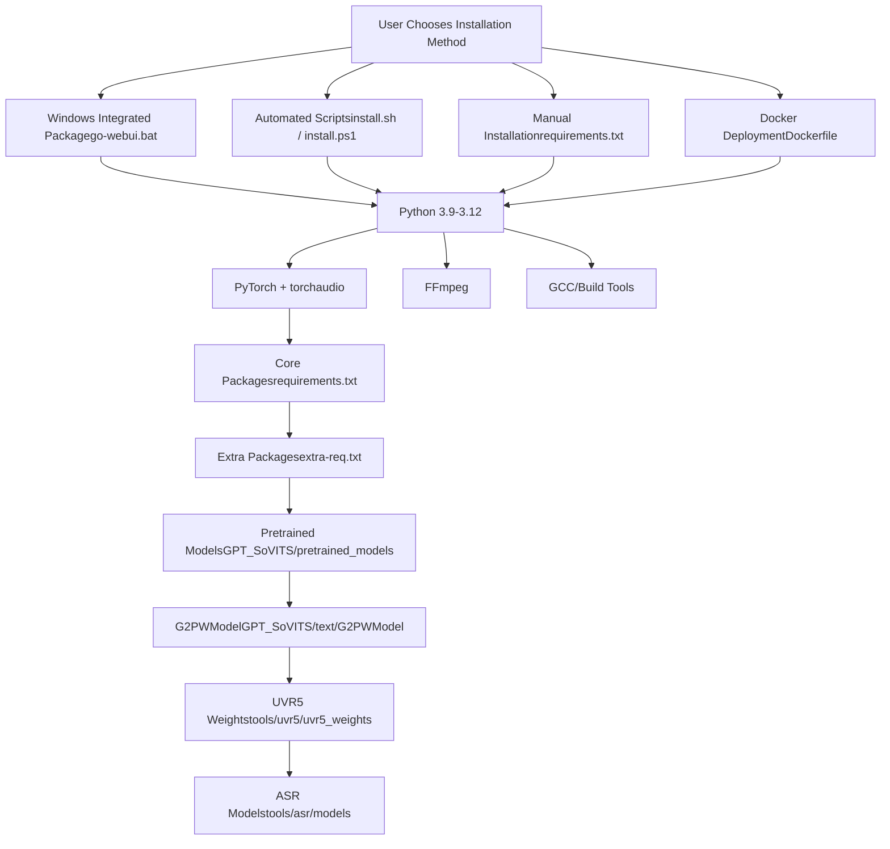
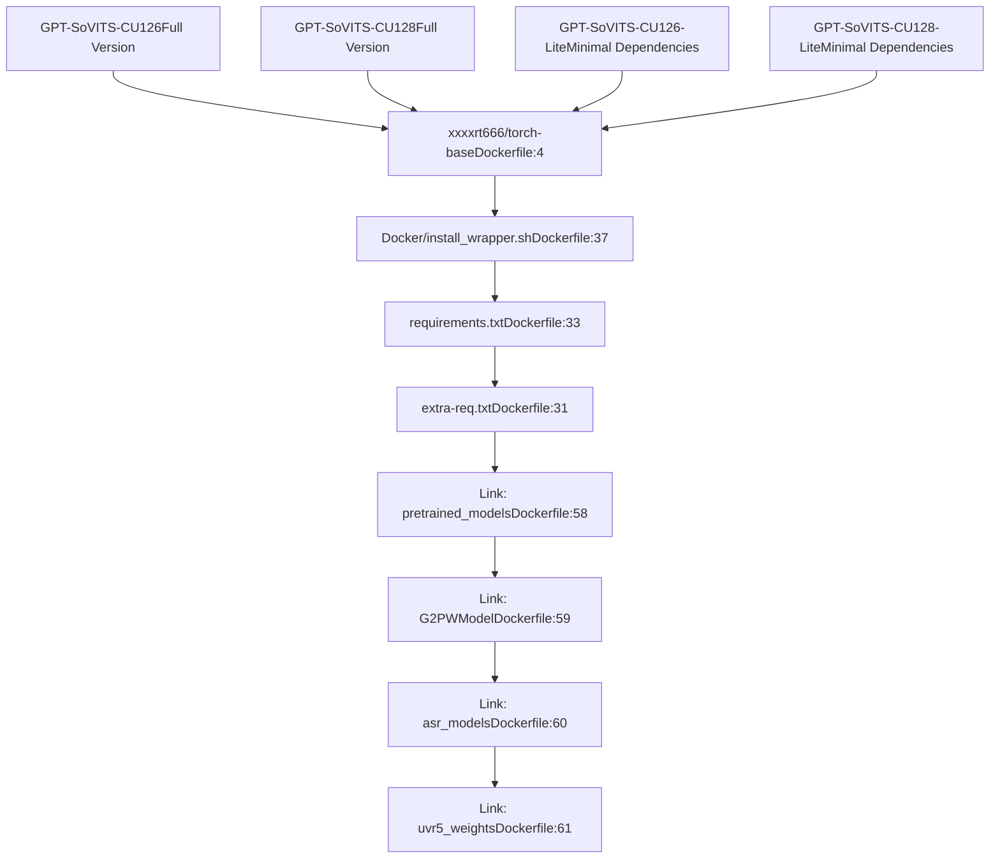

# Installation (安装)

相关源文件

-   [README.md](https://github.com/RVC-Boss/GPT-SoVITS/blob/c767f0b8/README.md?plain=1)
-   [docs/cn/README.md](https://github.com/RVC-Boss/GPT-SoVITS/blob/c767f0b8/docs/cn/README.md?plain=1)
-   [docs/ja/README.md](https://github.com/RVC-Boss/GPT-SoVITS/blob/c767f0b8/docs/ja/README.md?plain=1)
-   [docs/ko/README.md](https://github.com/RVC-Boss/GPT-SoVITS/blob/c767f0b8/docs/ko/README.md?plain=1)
-   [docs/tr/README.md](https://github.com/RVC-Boss/GPT-SoVITS/blob/c767f0b8/docs/tr/README.md?plain=1)
-   [install.ps1](https://github.com/RVC-Boss/GPT-SoVITS/blob/c767f0b8/install.ps1)
-   [install.sh](https://github.com/RVC-Boss/GPT-SoVITS/blob/c767f0b8/install.sh)
-   [requirements.txt](https://github.com/RVC-Boss/GPT-SoVITS/blob/c767f0b8/requirements.txt)

本文档提供了 GPT-SoVITS 的全面安装说明，涵盖了依赖管理、平台特定设置过程以及部署选项。有关安装后配置和模型设置的信息，请参阅 [Configuration Management (配置管理)](/RVC-Boss/GPT-SoVITS/3.4-configuration-management)。有关快速设置工作流程，请参阅 [Quick Start Guide (快速入门指南)](/RVC-Boss/GPT-SoVITS/1.3-quick-start-guide)。

## Overview (概览)

GPT-SoVITS 支持 Windows、Linux、macOS 和容器化环境中的多种安装方法。安装过程包括设置 Python 依赖项、安装 FFmpeg (FFmpeg) 等系统工具、下载 Pretrained (预训练) 模型以及配置特定语言的组件。

## Supported Environments (支持的环境)

以下配置已通过测试和验证：

| Python 版本 | PyTorch 版本 | 设备支持 | 平台 |
| --- | --- | --- | --- |
| Python 3.10 | PyTorch 2.5.1 | CUDA 12.4 | Windows/Linux |
| Python 3.11 | PyTorch 2.5.1 | CUDA 12.4 | Windows/Linux |
| Python 3.11 | PyTorch 2.7.0 | CUDA 12.8 | Windows/Linux |
| Python 3.9 | PyTorch 2.8.0dev | CUDA 12.8 | Windows/Linux |
| Python 3.9 | PyTorch 2.5.1 | Apple Silicon | macOS |
| Python 3.11 | PyTorch 2.7.0 | Apple Silicon | macOS |
| Python 3.9 | PyTorch 2.2.2 | 仅 CPU | 所有平台 |

来源： [docs/ko/README.md49-59](https://github.com/RVC-Boss/GPT-SoVITS/blob/c767f0b8/docs/ko/README.md?plain=1#L49-L59) [docs/tr/README.md49-59](https://github.com/RVC-Boss/GPT-SoVITS/blob/c767f0b8/docs/tr/README.md?plain=1#L49-L59)

## Installation Methods Overview (安装方法概览)


来源： [docs/ko/README.md61-198](https://github.com/RVC-Boss/GPT-SoVITS/blob/c767f0b8/docs/ko/README.md?plain=1#L61-L198) [install.sh1-381](https://github.com/RVC-Boss/GPT-SoVITS/blob/c767f0b8/install.sh#L1-L381) [install.ps11-242](https://github.com/RVC-Boss/GPT-SoVITS/blob/c767f0b8/install.ps1#L1-L242) [Dockerfile1-62](https://github.com/RVC-Boss/GPT-SoVITS/blob/c767f0b8/Dockerfile#L1-L62)

## Windows Installation (Windows 安装)

### Integrated Package (推荐集成包)

对于 Windows 用户，最简单的安装方法是预构建的 Integrated Package (集成包)：

1.  从 [HuggingFace (HuggingFace)](https://huggingface.co/lj1995/GPT-SoVITS-windows-package/resolve/main/GPT-SoVITS-v3lora-20250228.7z) 下载 Integrated Package
2.  解压存档
3.  双击 `go-webui.bat` 以启动 GPT-SoVITS-WebUI

来源： [docs/ko/README.md62-63](https://github.com/RVC-Boss/GPT-SoVITS/blob/c767f0b8/docs/ko/README.md?plain=1#L62-L63)

### Automated PowerShell Installation (自动化 PowerShell 安装)

对于自定义安装，请使用 PowerShell 脚本：

```
conda create -n GPTSoVits python=3.10conda activate GPTSoVitspwsh -F install.ps1 --Device <CU126|CU128|CPU> --Source <HF|HF-Mirror|ModelScope> [--DownloadUVR5]
```
该 PowerShell 脚本支持：

-   **Device (设备) 选项**: `CU126` (CUDA 12.6)，`CU128` (CUDA 12.8)，`CPU`
-   **Source (源) 选项**: `HF` (HuggingFace)，`HF-Mirror`，`ModelScope (ModelScope)`
-   **Optional (可选)**: `--DownloadUVR5` 用于音频分离模型

来源： [docs/ko/README.md64-68](https://github.com/RVC-Boss/GPT-SoVITS/blob/c767f0b8/docs/ko/README.md?plain=1#L64-L68) [install.ps11-242](https://github.com/RVC-Boss/GPT-SoVITS/blob/c767f0b8/install.ps1#L1-L242)

## Linux Installation (Linux 安装)

### Automated Installation Script (自动化安装脚本)

```
conda create -n GPTSoVits python=3.10conda activate GPTSoVitsbash install.sh --device <CU126|CU128|ROCM|CPU> --source <HF|HF-Mirror|ModelScope> [--download-uvr5]
```
安装脚本处理以下内容：

-   **Build Tools (构建工具)**: GCC 11+，通过 [install.sh184-199](https://github.com/RVC-Boss/GPT-SoVITS/blob/c767f0b8/install.sh#L184-L199) 安装构建必需品
-   **System Libraries (系统库)**: 通过 [install.sh224-226](https://github.com/RVC-Boss/GPT-SoVITS/blob/c767f0b8/install.sh#L224-L226) 安装 FFmpeg、CMake
-   **PyTorch (PyTorch) 安装**: 通过 [install.sh324-342](https://github.com/RVC-Boss/GPT-SoVITS/blob/c767f0b8/install.sh#L324-L342) 安装平台特定的 PyTorch 构建
-   **模型下载**: 通过 [install.sh255-294](https://github.com/RVC-Boss/GPT-SoVITS/blob/c767f0b8/install.sh#L255-294) 下载 Pretrained 模型和依赖项

### Linux Installation Flow (Linux 安装流程)

```mermaid
flowchart TD
    Start["bash install.sh --device --source"]
    CheckConda["Check Conda Installationinstall.sh:59-62"]
    ParseArgs["Parse Command Argumentsinstall.sh:94-158"]
    DetectArch["Detect System Architectureinstall.sh:174-182"]
    CheckGCC["Check GCC Versioninstall.sh:187-189"]
    InstallGCC["Install GCC 11+ from Condainstall.sh:190-192"]
    InstallSysroot["Install sysroot Packageinstall.sh:191"]
    InstallFFmpeg["Install FFmpeg & CMakeinstall.sh:224-226"]
    InstallUnzip["Install unzip Utilityinstall.sh:228-230"]
    DetectGPU["Detect GPU Supportinstall.sh:296-322"]
    InstallPyTorch["Install PyTorch for Platforminstall.sh:324-342"]
    InstallExtra["Install extra-req.txtinstall.sh:348"]
    InstallReqs["Install requirements.txtinstall.sh:350"]
    DownloadPretrained["Download Pretrained Modelsinstall.sh:255-266"]
    DownloadG2PW["Download G2PWModelinstall.sh:268-279"]
    DownloadUVR5["Download UVR5 Modelsinstall.sh:281-294"]
    DownloadNLTK["Download NLTK Datainstall.sh:357-362"]
    DownloadOpenJTalk["Download OpenJTalk Dictinstall.sh:364-369"]

    Start --> CheckConda
    CheckConda --> ParseArgs
    ParseArgs --> DetectArch
    DetectArch --> CheckGCC
    CheckGCC --> InstallGCC
    InstallGCC --> InstallSysroot
    InstallSysroot --> InstallFFmpeg
    InstallFFmpeg --> InstallUnzip
    InstallUnzip --> DetectGPU
    DetectGPU --> InstallPyTorch
    InstallPyTorch --> InstallExtra
    InstallExtra --> InstallReqs
    InstallReqs --> DownloadPretrained
    DownloadPretrained --> DownloadG2PW
    DownloadG2PW --> DownloadUVR5
    DownloadUVR5 --> DownloadNLTK
    DownloadNLTK --> DownloadOpenJTalk
```


来源： [install.sh1-381](https://github.com/RVC-Boss/GPT-SoVITS/blob/c767f0b8/install.sh#L1-L381)

## macOS Installation (macOS 安装)

**注意**: 与其他平台相比，macOS 上的 GPU 训练产生的模型质量较低。目前将 CPU 训练用作临时解决方法。

```
conda create -n GPTSoVits python=3.10conda activate GPTSoVitsbash install.sh --device <MPS|CPU> --source <HF|HF-Mirror|ModelScope> [--download-uvr5]
```
macOS 安装包括通过 [install.sh201-222](https://github.com/RVC-Boss/GPT-SoVITS/blob/c767f0b8/install.sh#L201-L222) 进行 Xcode 命令行工具检测和安装

来源： [docs/ko/README.md79-89](https://github.com/RVC-Boss/GPT-SoVITS/blob/c767f0b8/docs/ko/README.md?plain=1#L79-L89) [install.sh201-222](https://github.com/RVC-Boss/GPT-SoVITS/blob/c767f0b8/install.sh#L201-L222)

## Manual Installation (手动安装)

对于需要自定义依赖管理或排除故障的用户：

### Dependencies Installation (依赖项安装)

```
conda create -n GPTSoVits python=3.10conda activate GPTSoVits pip install -r extra-req.txt --no-depspip install -r requirements.txt
```
### Core Dependencies Analysis (核心依赖项分析)

`requirements.txt` 中的主要依赖项包括：

| 类别 | 软件包 | 用途 |
| --- | --- | --- |
| **Deep Learning (深度学习)** | `torch`, `torchaudio`, `pytorch-lightning>=2.4` | 神经网络框架 |
| **Audio Processing (音频处理)** | `librosa==0.10.2`, `ffmpeg-python`, `av>=11` | 音频处理 |
| **NLP/Text (NLP/文本)** | `transformers>=4.43,<=4.50`, `sentencepiece`, `tokenizers` | 文本处理 |
| **ASR (ASR)** | `funasr==1.0.27`, `faster-whisper` 通过 `ctranslate2>=4.0,<5` | 语音识别 |
| **Language-Specific (语言特定)** | `pypinyin`, `pyopenjtalk>=0.4.1`, `g2p_en`, `jieba_fast` | 多语言支持 |
| **Web Interface (Web 界面)** | `gradio<5`, `fastapi[standard]>=0.115.2` | 用户界面 |
| **Utilities (实用程序)** | `numpy<2.0`, `scipy`, `tqdm`, `psutil` | 通用实用程序 |

来源： [requirements.txt1-46](https://github.com/RVC-Boss/GPT-SoVITS/blob/c767f0b8/requirements.txt#L1-L46)

### FFmpeg Installation (FFmpeg 安装)

#### Conda (Conda) 用户

```
conda activate GPTSoVitsconda install ffmpeg
```
#### Ubuntu/Debian

```
sudo apt install ffmpegsudo apt install libsox-dev
```
#### Windows Manual (Windows 手动)

下载并放置在 GPT-SoVITS 根目录中：

-   [ffmpeg.exe](https://huggingface.co/lj1995/VoiceConversionWebUI/blob/main/ffmpeg.exe)
-   [ffprobe.exe](https://huggingface.co/lj1995/VoiceConversionWebUI/blob/main/ffprobe.exe)

安装 [Visual Studio 2017 Redistributable](https://aka.ms/vs/17/release/vc_redist.x86.exe)

#### macOS

```
brew install ffmpeg
```
来源： [docs/ko/README.md102-129](https://github.com/RVC-Boss/GPT-SoVITS/blob/c767f0b8/docs/ko/README.md?plain=1#L102-L129)

## Docker Deployment (Docker 部署)

### Docker (Docker) 镜像选择

GPT-SoVITS 提供多种 Docker 镜像变体：


### Docker Compose Usage (Docker Compose 使用)

```
docker compose run --service-ports <GPT-SoVITS-CU126-Lite|GPT-SoVITS-CU128-Lite|GPT-SoVITS-CU126|GPT-SoVITS-CU128>
```
### Environment Variables (环境变量)

-   `is_half`: 控制 Half-Precision (半精度) (fp16) 的使用
-   `CUDA_VERSION`: 通过 [Dockerfile10-12](https://github.com/RVC-Boss/GPT-SoVITS/blob/c767f0b8/Dockerfile#L10-L12) 进行 CUDA 版本选择
-   `LITE`: 通过 [Dockerfile20-21](https://github.com/RVC-Boss/GPT-SoVITS/blob/c767f0b8/Dockerfile#L20-L21) 启用精简模式

### Building Custom Images (构建自定义镜像)

```
bash docker_build.sh --cuda <12.6|12.8> [--lite]
```
来源： [docs/ko/README.md130-179](https://github.com/RVC-Boss/GPT-SoVITS/blob/c767f0b8/docs/ko/README.md?plain=1#L130-L179) [Dockerfile1-62](https://github.com/RVC-Boss/GPT-SoVITS/blob/c767f0b8/Dockerfile#L1-L62)

## Model Downloads (模型下载)

### Required Models (必需模型)

安装过程会下载几个模型组件：

1.  **Pretrained 模型** → `GPT_SoVITS/pretrained_models/`

    -   核心神经网络权重
    -   特定版本的模型文件 (V2, V3, V4, V2Pro)
2.  **G2PWModel** → `GPT_SoVITS/text/G2PWModel/`

    -   中文 Grapheme-to-Phoneme (字素转音素) 转换
    -   中文 TTS 所需，通过 [GPT\_SoVITS/text/g2pw/onnx\_api.py58-80](https://github.com/RVC-Boss/GPT-SoVITS/blob/c767f0b8/GPT_SoVITS/text/g2pw/onnx_api.py#L58-L80)
3.  **UVR5 Weights** → `tools/uvr5/uvr5_weights/`

    -   人声/乐器分离模型
    -   可选，使用 `--download-uvr5` 标志下载
4.  **ASR Models** → `tools/asr/models/`

    -   ASR (自动语音识别) 模型
    -   在首次使用时 On-Demand (按需) 下载

### Model Source Options (模型源选项)

| 源 | 基本 URL | 使用案例 |
| --- | --- | --- |
| `HF` | `https://huggingface.co/XXXXRT/GPT-SoVITS-Pretrained/` | 默认，全局访问 |
| `HF-Mirror` | `https://hf-mirror.com/XXXXRT/GPT-SoVITS-Pretrained/` | 中国镜像 |
| `ModelScope` | `https://www.modelscope.cn/models/XXXXRT/GPT-SoVITS-Pretrained/` | 中国备选 |

来源： [install.sh232-253](https://github.com/RVC-Boss/GPT-SoVITS/blob/c767f0b8/install.sh#L232-L253) [install.ps1149-174](https://github.com/RVC-Boss/GPT-SoVITS/blob/c767f0b8/install.ps1#L149-L174)

## Post-Installation Verification (安装后验证)

安装后，通过启动 Web 界面验证设置：

### Integrated Package 用户

```
# Double-click go-webui.bat (Windows)# orgo-webui.ps1
```
### Manual Installation 用户

```
python webui.py
```
### Version Switching (版本切换)

```
# 切换到 V1python webui.py v1 # 或使用特定版本的启动器go-webui-v1.bat  # Windows V1go-webui-v2.bat  # Windows V2
```
来源： [docs/ko/README.md221-241](https://github.com/RVC-Boss/GPT-SoVITS/blob/c767f0b8/docs/ko/README.md?plain=1#L221-L241)

## Troubleshooting (故障排除)

### Common Issues (常见问题)

1.  **CUDA 未检测到**: 如果通过 [install.sh296-305](https://github.com/RVC-Boss/GPT-SoVITS/blob/c767f0b8/install.sh#L296-L305) 未找到 GPU 驱动程序，安装脚本会自动回退到 CPU

2.  **WSL2 (WSL2) 上的 ROCm (ROCm)**: 通过 [install.sh371-378](https://github.com/RVC-Boss/GPT-SoVITS/blob/c767f0b8/install.sh#L371-L378) 特殊处理 WSL2 ROCm 兼容性

3.  **模型下载失败**: 为访问受限地区提供多种源选项

4.  **构建工具问题**: 在缺乏现代编译器的 Linux 系统上通过 [install.sh184-199](https://github.com/RVC-Boss/GPT-SoVITS/blob/c767f0b8/install.sh#L184-L199) 自动安装 GCC


来源： [install.sh296-305](https://github.com/RVC-Boss/GPT-SoVITS/blob/c767f0b8/install.sh#L296-L305) [install.sh371-378](https://github.com/RVC-Boss/GPT-SoVITS/blob/c767f0b8/install.sh#L371-L378) [install.sh184-199](https://github.com/RVC-Boss/GPT-SoVITS/blob/c767f0b8/install.sh#L184-L199)
