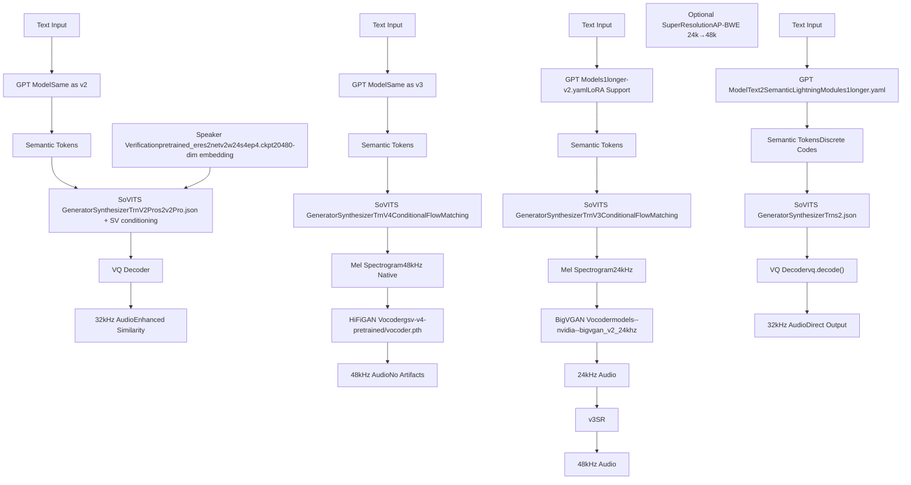
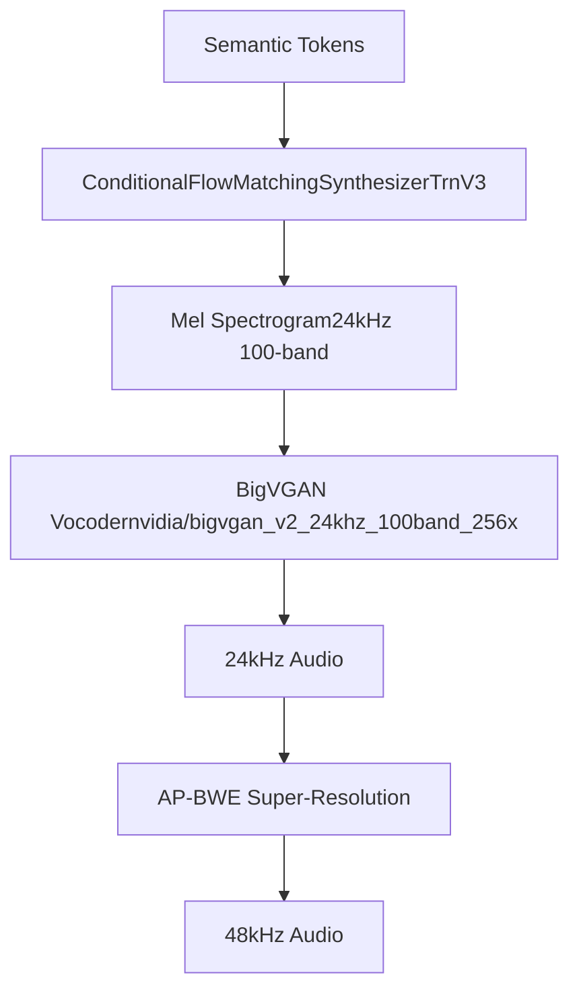
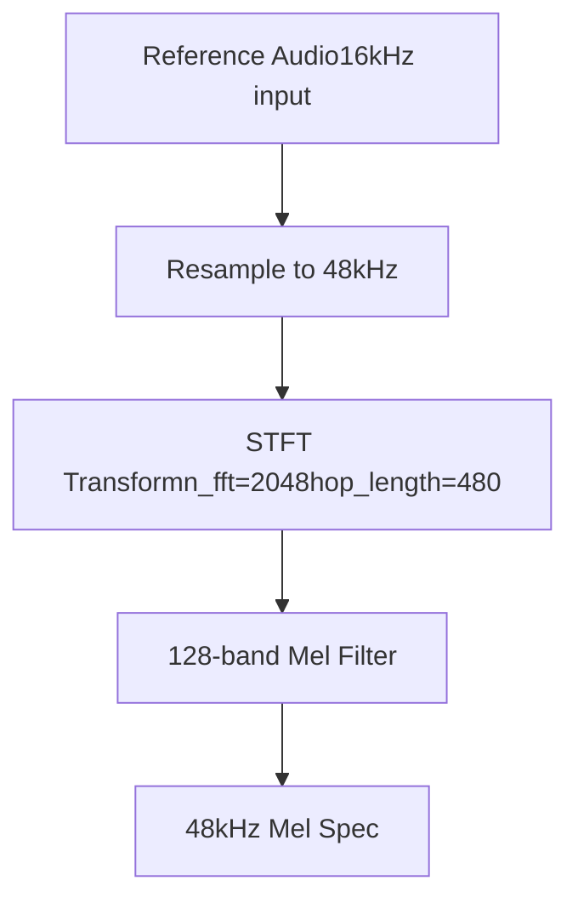
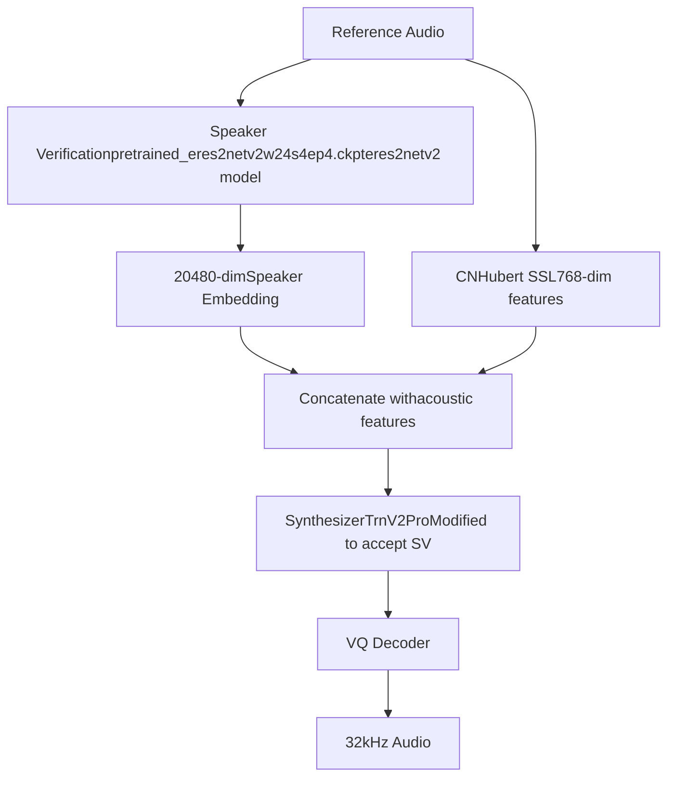
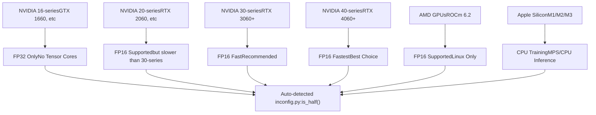
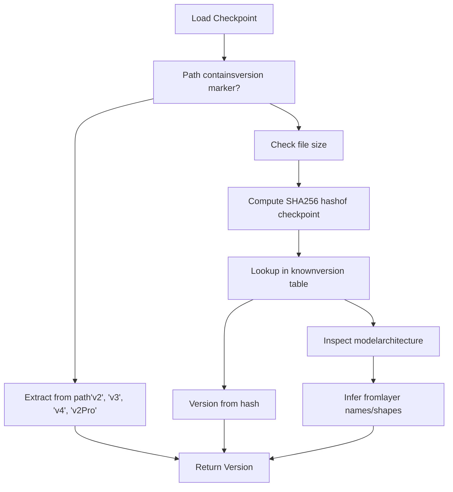
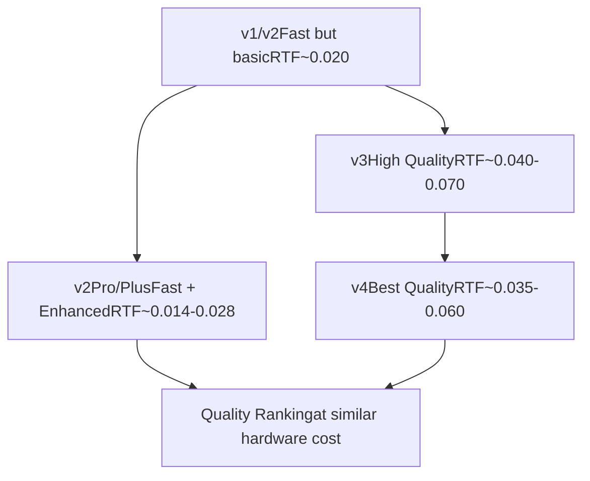

# Model Versions and Evolution (模型版本与演进)

相关源文件

-   [README.md](https://github.com/RVC-Boss/GPT-SoVITS/blob/c767f0b8/README.md?plain=1)
-   [docs/cn/Changelog\_CN.md](https://github.com/RVC-Boss/GPT-SoVITS/blob/c767f0b8/docs/cn/Changelog_CN.md?plain=1)
-   [docs/cn/README.md](https://github.com/RVC-Boss/GPT-SoVITS/blob/c767f0b8/docs/cn/README.md?plain=1)
-   [docs/en/Changelog\_EN.md](https://github.com/RVC-Boss/GPT-SoVITS/blob/c767f0b8/docs/en/Changelog_EN.md?plain=1)
-   [docs/ja/Changelog\_JA.md](https://github.com/RVC-Boss/GPT-SoVITS/blob/c767f0b8/docs/ja/Changelog_JA.md?plain=1)
-   [docs/ja/README.md](https://github.com/RVC-Boss/GPT-SoVITS/blob/c767f0b8/docs/ja/README.md?plain=1)
-   [docs/ko/Changelog\_KO.md](https://github.com/RVC-Boss/GPT-SoVITS/blob/c767f0b8/docs/ko/Changelog_KO.md?plain=1)
-   [docs/ko/README.md](https://github.com/RVC-Boss/GPT-SoVITS/blob/c767f0b8/docs/ko/README.md?plain=1)
-   [docs/tr/Changelog\_TR.md](https://github.com/RVC-Boss/GPT-SoVITS/blob/c767f0b8/docs/tr/Changelog_TR.md?plain=1)
-   [docs/tr/README.md](https://github.com/RVC-Boss/GPT-SoVITS/blob/c767f0b8/docs/tr/README.md?plain=1)
-   [install.ps1](https://github.com/RVC-Boss/GPT-SoVITS/blob/c767f0b8/install.ps1)
-   [install.sh](https://github.com/RVC-Boss/GPT-SoVITS/blob/c767f0b8/install.sh)
-   [requirements.txt](https://github.com/RVC-Boss/GPT-SoVITS/blob/c767f0b8/requirements.txt)

本文档介绍了 GPT-SoVITS 中的不同模型版本、它们的架构差异、硬件要求以及随时间演进的过程。它涵盖了 v1, v2, v3, v4 以及 v2Pro/v2ProPlus 变体的技术实现细节。

有关训练这些模型的信息，请参阅 [Model Training (模型训练)](/RVC-Boss/GPT-SoVITS/6-model-training)。有关特定于推理的实现，请参阅 [TTS Inference Process (TTS 推理过程)](/RVC-Boss/GPT-SoVITS/7.1-tts-inference-process)。有关模型文件管理和加载，请参阅 [Version Detection and Model Loading (版本检测与模型加载)](/RVC-Boss/GPT-SoVITS/8.3-version-detection-and-model-loading)。

---

## Version Timeline and Feature Overview (版本时间线与特性概览)

自首次发布以来，GPT-SoVITS 已演进出六个主要版本系列，每个系列都针对特定的质量或性能目标：

| 版本 | 发布日期 | 输出采样率 | Vocoder | 关键特性 | VRAM (训练) | 预期使用案例 |
| --- | --- | --- | --- | --- | --- | --- |
| v1 | 2024年1月 | 32kHz | 直接解码 | 初始架构 | ~10GB | 初始发布 |
| v2 | 2024年8月 | 32kHz | 直接解码 | 韩语/粤语，5k 小时预训练 | ~10GB | 多语言基准 |
| v3 | 2025年2月 | 24kHz | BigVGAN | CFM 架构，支持 LoRA | 8GB (LoRA) / 14GB (全量) | 高相似度，低 VRAM |
| v4 | 2025年4月 | 48kHz | HiFiGAN | 修复金属混响伪影 | 8GB (LoRA) / 14GB (全量) | 生产级质量 |
| v2Pro | 2025年6月 | 32kHz | 直接解码 | 声纹验证层 | ~12GB | 增强的相似度 |
| v2ProPlus | 2025年6月 | 32kHz | 直接解码 | 增强的声纹验证 | ~12GB | 最大相似度 |

**来源：** [README.md293-368](https://github.com/RVC-Boss/GPT-SoVITS/blob/c767f0b8/README.md?plain=1#L293-L368) [docs/cn/Changelog\_CN.md360-625](https://github.com/RVC-Boss/GPT-SoVITS/blob/c767f0b8/docs/cn/Changelog_CN.md?plain=1#L360-L625) [docs/en/Changelog\_EN.md1-626](https://github.com/RVC-Boss/GPT-SoVITS/blob/c767f0b8/docs/en/Changelog_EN.md?plain=1#L1-L626)

---

## Architecture Evolution Diagram (架构演进图)


**来源：** [README.md293-368](https://github.com/RVC-Boss/GPT-SoVITS/blob/c767f0b8/README.md?plain=1#L293-L368) [GPT\_SoVITS/module/models.py1-1500](https://github.com/RVC-Boss/GPT-SoVITS/blob/c767f0b8/GPT_SoVITS/module/models.py#L1-L1500) [docs/cn/Changelog\_CN.md408-625](https://github.com/RVC-Boss/GPT-SoVITS/blob/c767f0b8/docs/cn/Changelog_CN.md?plain=1#L408-L625)

---

## Version 1 & 2: Foundation Architecture (基础架构)

### Core Characteristics (核心特性)

v1 和 v2 共享相同的基础架构，v2 增加了语言支持并扩大了预训练数据：

-   **直接波形生成**: 通过 VQ-VAE (VQ-VAE) 解码器实现，无需独立的 Vocoder (声码器)
-   **32kHz 采样率**: 贯穿整个流水线
-   **SynthesizerTrn 架构**: 基于 VITS (VITS) 并进行了修改
-   **Pretrained (预训练) 权重**: v1 使用 2k 小时，v2 使用 5k 小时的训练数据

### Model Components (模型组件)

**GPT 模型 (Text2Semantic):**

-   配置: 两个版本均使用 `s1longer.yaml`
-   Checkpoint (检查点) 格式: `GPT_weights/` 或 `GPT_weights_v2/` 中的 `.ckpt` 文件
-   架构: 基于 Transformer (Transformer) 的 Autoregressive (自回归) 模型
-   目的: 将音素序列 + BERT 特征 → 语义 Token 序列

**SoVITS 模型 (声学):**

-   配置: 两个版本均使用 `s2.json`
-   Checkpoint 格式: `SoVITS_weights/` 或 `SoVITS_weights_v2/` 中的 `.pth` 文件
-   关键类: `SynthesizerTrn`, `ResidualCouplingBlock`, `Generator`
-   VQ 组件: 集成的量化器，带有用于直接音频生成的 `vq.decode()` 方法

### Version 2 Enhancements (版本 2 增强功能)

于 2024 年 8 月发布，包含以下改进：

1.  **语言支持扩展**

    -   添加了韩语 (`ko`) 和粤语 (`yue`) 语言代码
    -   更新了 `g2p` 处理，增加了 `g2pk2`, `ko_pron`, `ToJyutping` 依赖项
2.  **文本处理改进**

    -   通过 `g2pW` 多音字消歧增强了中文文本前端
    -   来自 PaddleSpeech 的更好的数字和符号归一化
3.  **训练数据**

    -   从 2k 小时扩展到 5k 小时的多语言语音
    -   改进了对低质量参考音频的处理

**来源：** [README.md293-316](https://github.com/RVC-Boss/GPT-SoVITS/blob/c767f0b8/README.md?plain=1#L293-L316) [docs/cn/Changelog\_CN.md360-406](https://github.com/RVC-Boss/GPT-SoVITS/blob/c767f0b8/docs/cn/Changelog_CN.md?plain=1#L360-L406) [requirements.txt1-44](https://github.com/RVC-Boss/GPT-SoVITS/blob/c767f0b8/requirements.txt#L1-L44)

---

## Version 3: CFM Architecture with LoRA (带有 LoRA 的 CFM 架构)

### Architectural Changes (架构变更)

于 2025 年 2 月发布，v3 引入了从直接解码到两阶段生成过程的根本性转变：


### Key Technical Improvements (关键技术改进)

**1\. Conditional Flow Matching (CFM (条件流匹配))**

-   使用基于流的生成取代了直接的 VQ 解码
-   更好地捕捉 Prosody (韵律) 和 Timbre (音色) 变化
-   借鉴自 F5-TTS 的架构，并针对声音克隆进行了调整

**2\. BigVGAN (BigVGAN) v2 Vocoder**

-   模型: `models--nvidia--bigvgan_v2_24khz_100band_256x/` 目录
-   100 阶 Mel Spectrogram (梅尔频谱图) 输入
-   带有 Anti-aliased (抗混叠) 周期和多周期判别器的生成器
-   质量高于 v1/v2 VQ 解码器，尤其是在 Zero-shot (零样本) 场景下

**3\. LoRA (LoRA) 训练支持**

-   训练脚本: `s2_train_v3_lora.py` (2025-02-23 添加)
-   配置参数: JSON 配置文件中的 `lora_rank`
-   **VRAM (显存) 要求从 14GB 降低到 8GB**
-   使用 `peft` 库进行 Parameter-efficient Fine-tuning (参数高效微调)

**4\. 音频超分辨率**

-   可选的 24kHz → 48kHz 上采样
-   模型: AP-BWE (Audio-Prompt Bandwidth Extension)
-   位置: `tools/AP_BWE_main/24kto48k/`
-   解决了 24kHz 输出的“闷”声问题

### Training Configuration (训练配置)

v3 引入了特定版本的配置文件：

-   GPT 配置: `s1longer-v2.yaml` (与 v2 相同)
-   SoVITS 配置: 全量训练为 `s2v3.json`，LoRA 为 `s2v3_lora.json`
-   Pretrained 权重: `s1v3.ckpt`, `s2Gv3.pth`

### Known Issues and v4 Motivation (已知问题与 v4 的动力)

由于 BigVGAN 中的非整数比 Upsampling (上采样)，v3 表现出 **Metallic Artifacts (金属混响伪影)**：

-   24kHz 输入 → 48kHz 输出需要 2 倍上采样
-   BigVGAN 的架构在某些频率引入了频谱伪影
-   问题详见 [docs/cn/Changelog\_CN.md435-464](https://github.com/RVC-Boss/GPT-SoVITS/blob/c767f0b8/docs/cn/Changelog_CN.md?plain=1#L435-L464)

**来源：** [README.md317-336](https://github.com/RVC-Boss/GPT-SoVITS/blob/c767f0b8/README.md?plain=1#L317-L336) [docs/cn/Changelog\_CN.md408-464](https://github.com/RVC-Boss/GPT-SoVITS/blob/c767f0b8/docs/cn/Changelog_CN.md?plain=1#L408-L464) [GPT\_SoVITS/module/models\_v3.py1-1000](https://github.com/RVC-Boss/GPT-SoVITS/blob/c767f0b8/GPT_SoVITS/module/models_v3.py#L1-L1000)

---

## Version 4: Production Quality with HiFiGAN (使用 HiFiGAN 的生产级质量)

### Problem Statement and Solution (问题陈述与解决方案)

于 2025 年 4 月发布，v4 直接解决了 v3 的金属混响伪影问题：

**根本原因:**

-   BigVGAN 的上采样层在非整数比处引入了混叠
-   24kHz → 48kHz 技术上是 2 倍，但内部处理引起了伪影

**解决方案:**

-   使用 **HiFiGAN (HiFiGAN) v4** Vocoder 替换 BigVGAN
-   原生 48kHz Mel Spectrogram 生成（无需上采样）
-   重新设计的 SoVITS 生成器: `SynthesizerTrnV4` 类

### Architecture Comparison: v3 vs v4 (架构对比：v3 vs v4)

| 组件 | v3 | v4 |
| --- | --- | --- |
| Mel Spectrogram | 24kHz, 100 阶 | 48kHz, 128 阶 |
| Vocoder | BigVGAN v2 | HiFiGAN v4 |
| Vocoder Checkpoint | `models--nvidia--bigvgan_v2_24khz_100band_256x/` | `gsv-v4-pretrained/vocoder.pth` |
| 生成器类 | `SynthesizerTrnV3` | `SynthesizerTrnV4` |
| 输出质量 | 存在金属混响伪影 | 清晰，无伪影 |
| 超分辨率 | 推荐 (24k→48k) | 不需要 |

### Implementation Details (实现细节)

**Mel Spectrogram 生成:**


**模型文件:**

-   GPT: 与 v3 相同 (`s1v3.ckpt`)
-   SoVITS 生成器: `gsv-v4-pretrained/s2v4.pth`
-   Vocoder: `gsv-v4-pretrained/vocoder.pth`

**训练配置:**

-   配置文件: `s2v4.json` (全量) 或 `s2v4_lora.json` (LoRA)
-   LoRA 支持: 与 v3 相同的 8GB VRAM
-   训练脚本: 与版本检测共享 `s2_train_v3_lora.py`

**来源：** [README.md337-351](https://github.com/RVC-Boss/GPT-SoVITS/blob/c767f0b8/README.md?plain=1#L337-L351) [docs/cn/Changelog\_CN.md490-525](https://github.com/RVC-Boss/GPT-SoVITS/blob/c767f0b8/docs/cn/Changelog_CN.md?plain=1#L490-L525) [GPT\_SoVITS/module/models\_v4.py1-1000](https://github.com/RVC-Boss/GPT-SoVITS/blob/c767f0b8/GPT_SoVITS/module/models_v4.py#L1-L1000)

---

## Version 2Pro/2ProPlus: Enhanced Speaker Verification (增强型声纹验证)

### Design Philosophy (设计理念)

于 2025 年 6 月发布，v2Pro 系列针对一个特定的限制：

**观察:**

-   v1/v2 在平均质量的训练数据下表现良好
-   v3/v4 需要高质量数据，并且更倾向于参考音频而非训练集
-   权衡: v3/v4 质量更好，但对数据质量更敏感

**解决方案:**

-   保持 v2 的稳健性和硬件效率
-   添加显式的 **Speaker Verification (声纹验证)** Embeddings (嵌入)，以获得更好的相似度
-   在不具备 v3/v4 数据敏感性的情况下，达到 v2 和 v4 之间的质量

### Architecture Additions (架构新增)


### Speaker Verification Module (声纹验证模块)

**模型:** `pretrained_eres2netv2w24s4ep4.ckpt`

-   基于 eres2netv2 架构 (ERes2Net-W24-S4-EP4 变体)
-   在中文语音上针对声纹识别任务进行了训练
-   提取 20,480 维的声纹嵌入

**集成点:**

-   特征提取: `2-get-sv.py` 脚本（数据准备阶段）
-   存储: `5.1-sv/*.pt` 文件，与其他特征并列
-   推理: 在 `TTS.py` 中加载，并与声学特征拼接

### v2Pro vs v2ProPlus (v2Pro vs v2ProPlus)

| 方面 | v2Pro | v2ProPlus |
| --- | --- | --- |
| 基础模型 | `s2Gv2Pro.pth` / `s2Dv2Pro.pth` | `s2Gv2ProPlus.pth` / `s2Dv2ProPlus.pth` |
| SV 集成 | 标准拼接 | 增强融合机制 |
| 相似度性能 | 优于 v4 | 整体最佳 |
| VRAM 使用 | ~12GB | ~12GB |

### Training Requirements (训练要求)

**数据准备:**

1.  标准 v1/v2 流水线 (BERT, Hubert, 语义 Token)
2.  **额外:** 通过 `2-get-sv.py` 提取声纹验证特征
3.  输出目录: `logs/{exp_name}/5.1-sv/`

**训练配置:**

-   配置: `s2v2Pro.json` 或 `s2v2ProPlus.json`
-   训练脚本: `s2_train.py` (通过配置检测 v2Pro)
-   Pretrained 权重: 总共四个文件 (Pro 和 ProPlus 的 G 和 D)

**来源：** [README.md352-368](https://github.com/RVC-Boss/GPT-SoVITS/blob/c767f0b8/README.md?plain=1#L352-L368) [docs/cn/Changelog\_CN.md559-625](https://github.com/RVC-Boss/GPT-SoVITS/blob/c767f0b8/docs/cn/Changelog_CN.md?plain=1#L559-L625) [GPT\_SoVITS/pretrained\_models/sv/](https://github.com/RVC-Boss/GPT-SoVITS/blob/c767f0b8/GPT_SoVITS/pretrained_models/sv/)

---

## Hardware Requirements Comparison (硬件要求对比)

### VRAM Requirements by Version and Use Case (各版本及使用案例的显存要求)

| 版本 | 推理 (FP16) | 推理 (FP32) | 训练 (全量) | 训练 (LoRA) |
| --- | --- | --- | --- | --- |
| v1 | 4GB | 6GB | 10GB | 不适用 |
| v2 | 4GB | 6GB | 10GB | 不适用 |
| v3 | 5GB | 8GB | 14GB | **8GB** |
| v4 | 5GB | 8GB | 14GB | **8GB** |
| v2Pro | 4.5GB | 7GB | 12GB | 不适用 |
| v2ProPlus | 4.5GB | 7GB | 12GB | 不适用 |

### Precision Support by GPU Architecture (各 GPU 架构的精度支持)


**自动检测逻辑:** 系统自动确定精度支持：

-   16 系列及更早版本: 通过 `torch.cuda.get_device_capability()` 强制使用 FP32
-   20 系列及更新版本: 默认启用 FP16
-   Mac: 训练始终使用 FP32，推理使用 CPU (MPS 比 CPU 慢)

**来源：** [config.py1-200](https://github.com/RVC-Boss/GPT-SoVITS/blob/c767f0b8/config.py#L1-L200) [README.md57-101](https://github.com/RVC-Boss/GPT-SoVITS/blob/c767f0b8/README.md?plain=1#L57-L101) [docs/cn/README.md52-94](https://github.com/RVC-Boss/GPT-SoVITS/blob/c767f0b8/docs/cn/README.md?plain=1#L52-L94)

---

## Model File Structure and Naming Conventions (模型文件结构与命名规范)

### Directory Organization (目录结构)

```
GPT_SoVITS/pretrained_models/
├── gsv-v2final-pretrained/           # v2 基础模型
│   ├── s1bert25hz-2kh-longer-epoch=68e-step=50232.ckpt
│   └── s2G488k.pth
├── s1v3.ckpt                         # v3 GPT
├── s2Gv3.pth                         # v3 SoVITS 生成器
├── models--nvidia--bigvgan_v2_24khz_100band_256x/  # v3 声码器
│   └── [HuggingFace 模型文件]
├── gsv-v4-pretrained/                # v4 模型
│   ├── s2v4.pth                      # v4 SoVITS 生成器
│   └── vocoder.pth                   # v4 HiFiGAN 声码器
├── v2Pro/                            # v2Pro 模型
│   ├── s2Gv2Pro.pth
│   ├── s2Dv2Pro.pth
│   ├── s2Gv2ProPlus.pth
│   └── s2Dv2ProPlus.pth
└── sv/                               # 声纹验证
    └── pretrained_eres2netv2w24s4ep4.ckpt
```
### Custom Trained Models (自定义训练模型)

用户训练的检查点遵循以下模式：

**GPT 模型:**

```
GPT_weights_v2/{exp_name}-e{epoch}.ckpt
GPT_weights_v3/{exp_name}-e{epoch}.ckpt
GPT_weights_v4/{exp_name}-e{epoch}.ckpt
```
**SoVITS 模型:**

```
SoVITS_weights_v2/{exp_name}_e{epoch}_s{step}.pth
SoVITS_weights_v3/{exp_name}_e{epoch}_s{step}.pth
SoVITS_weights_v4/{exp_name}_e{epoch}_s{step}.pth
SoVITS_weights_v2Pro/{exp_name}_e{epoch}_s{step}.pth
```
**LoRA 适配器 (v3/v4):**

```
SoVITS_weights_v3/{exp_name}_lora_e{epoch}_s{step}.pth
SoVITS_weights_v4/{exp_name}_lora_e{epoch}_s{step}.pth
```
**来源：** [GPT\_SoVITS/pretrained\_models/](https://github.com/RVC-Boss/GPT-SoVITS/blob/c767f0b8/GPT_SoVITS/pretrained_models/) [GPT\_weights/](https://github.com/RVC-Boss/GPT-SoVITS/blob/c767f0b8/GPT_weights/) [SoVITS\_weights/](https://github.com/RVC-Boss/GPT-SoVITS/blob/c767f0b8/SoVITS_weights/)

---

## Version Detection Mechanisms (版本检测机制)

### Automatic Version Identification (自动版本识别)

系统使用多种策略来检测模型版本，这些策略实现在 `process_ckpt.py` 中：


### Detection Strategy Implementation (检测策略实现)

**1\. 基于路径的检测:**

-   检查路径是否包含 `'v2'`, `'v3'`, `'v4'`, `'v2Pro'`, `'v2ProPlus'`
-   对于显式版本化的检查点，这是最可靠的方法

**2\. 基于哈希的检测:**

-   计算检查点文件的 SHA256
-   维护已知预训练模型哈希表
-   用于官方预训练模型

**3\. 架构检查:**

-   加载检查点并检查 `state_dict` 键
-   v3/v4 检测: 是否存在 `flow_matching` 模块
-   v2Pro 检测: 是否存在 `sv_proj` (声纹验证投影) 层
-   LoRA 检测: 是否存在 `lora_A` 和 `lora_B` 键

### Code References for Version Detection (版本检测的代码引用)

版本检测逻辑分布在：

-   主检测: [GPT\_SoVITS/process\_ckpt.py1-200](https://github.com/RVC-Boss/GPT-SoVITS/blob/c767f0b8/GPT_SoVITS/process_ckpt.py#L1-L200)
-   配置加载: [GPT\_SoVITS/inference\_webui.py100-300](https://github.com/RVC-Boss/GPT-SoVITS/blob/c767f0b8/GPT_SoVITS/inference_webui.py#L100-L300)
-   模型实例化: [GPT\_SoVITS/module/models.py1-100](https://github.com/RVC-Boss/GPT-SoVITS/blob/c767f0b8/GPT_SoVITS/module/models.py#L1-L100) [GPT\_SoVITS/module/models\_v3.py1-100](https://github.com/RVC-Boss/GPT-SoVITS/blob/c767f0b8/GPT_SoVITS/module/models_v3.py#L1-L100) [GPT\_SoVITS/module/models\_v4.py1-100](https://github.com/RVC-Boss/GPT-SoVITS/blob/c767f0b8/GPT_SoVITS/module/models_v4.py#L1-L100)

**来源：** [GPT\_SoVITS/process\_ckpt.py](https://github.com/RVC-Boss/GPT-SoVITS/blob/c767f0b8/GPT_SoVITS/process_ckpt.py) [GPT\_SoVITS/inference\_webui.py100-500](https://github.com/RVC-Boss/GPT-SoVITS/blob/c767f0b8/GPT_SoVITS/inference_webui.py#L100-L500)

---

## Version Selection Guidelines (版本选择指南)

### Decision Matrix by Use Case (基于使用案例的决策矩阵)

| 使用案例 | 推荐版本 | 理由 |
| --- | --- | --- |
| **低显存 (8GB)** | 带有 LoRA 的 v3 或 v4 | LoRA 训练将显存从 14GB 降低到 8GB |
| **平均质量的训练数据** | v1, v2 或 v2Pro | 对噪声更稳健，适用于不完美的录音 |
| **高质量训练数据** | v3 或 v4 | 配合清晰录音可获得卓越质量 |
| **Zero-shot (无训练)** | v3 或 v4 | 仅凭参考音频即可更好地捕捉音色 |
| **最大程度相似度** | v2ProPlus | 最佳声纹匹配，且具备 v2 的稳健性 |
| **生产环境部署** | v4 | 无伪影，原生 48kHz，输出清晰 |
| **快速推理 (CPU)** | v1 或 v2 | 无声码器开销 |
| **多语言 (韩语/粤语)** | v2 或更高版本 | v1 缺乏韩语/粤语支持 |

### Migration Paths (迁移路径)

**从 v1 迁移到 v2:**

1.  更新依赖: `pip install -r requirements.txt`
2.  从 HuggingFace 下载 v2 预训练模型
3.  下载用于中文文本处理的 G2PWModel
4.  使用 v2 基础模型重新训练或继续训练

**从 v2 迁移到 v3:**

1.  更新依赖（增加 `peft`, `rotary_embedding_torch` 等）
2.  下载 v3 预训练模型: `s1v3.ckpt`, `s2Gv3.pth`
3.  下载 BigVGAN 声码器: `models--nvidia--bigvgan_v2_24khz_100band_256x/`
4.  （可选）下载 AP-BWE 超分辨率模型
5.  使用 `s2_train_v3_lora.py` 进行 8GB 显存训练

**从 v3 迁移到 v4:**

1.  更新依赖: `pip install -r requirements.txt`
2.  下载 v4 模型: `gsv-v4-pretrained/s2v4.pth`, `vocoder.pth`
3.  GPT 模型: 可以复用 v3 GPT 检查点 (`s1v3.ckpt`)
4.  SoVITS: 必须训练新的 v4 模型或使用 v4 预训练基础模型

**从 v2 迁移到 v2Pro:**

1.  更新依赖
2.  下载声纹验证模型: `sv/pretrained_eres2netv2w24s4ep4.ckpt`
3.  下载 v2Pro 模型（4 个文件：Pro 和 ProPlus 的 G 和 D）
4.  **重要:** 重新运行数据准备，使用 `2-get-sv.py` 提取声纹嵌入
5.  使用 `s2v2Pro.json` 配置进行训练

**来源：** [README.md293-368](https://github.com/RVC-Boss/GPT-SoVITS/blob/c767f0b8/README.md?plain=1#L293-L368) [docs/cn/Changelog\_CN.md360-625](https://github.com/RVC-Boss/GPT-SoVITS/blob/c767f0b8/docs/cn/Changelog_CN.md?plain=1#L360-L625) [install.sh1-400](https://github.com/RVC-Boss/GPT-SoVITS/blob/c767f0b8/install.sh#L1-L400)

---

## Version-Specific Configuration Files (版本特定的配置文件)

### Configuration File Mapping (配置文件映射)

| 版本 | GPT 配置 | SoVITS 配置 | 训练脚本 |
| --- | --- | --- | --- |
| v1 | `s1longer.yaml` | `s2.json` | `s1_train.py`, `s2_train.py` |
| v2 | `s1longer-v2.yaml` | `s2.json` | `s1_train.py`, `s2_train.py` |
| v3 | `s1longer-v2.yaml` | `s2v3.json` 或 `s2v3_lora.json` | `s1_train.py`, `s2_train_v3_lora.py` |
| v4 | `s1longer-v2.yaml` | `s2v4.json` 或 `s2v4_lora.json` | `s1_train.py`, `s2_train_v3_lora.py` |
| v2Pro | `s1longer-v2.yaml` | `s2v2Pro.json` | `s1_train.py`, `s2_train.py` |
| v2ProPlus | `s1longer-v2.yaml` | `s2v2ProPlus.json` | `s1_train.py`, `s2_train.py` |

### Key Configuration Differences (关键配置差异)

**GPT 配置 (YAML):**

-   `s1longer.yaml`: v1 基础配置
-   `s1longer-v2.yaml`: v2+ 配置，具有扩展的词汇表和语言支持
-   关键参数: `batch_size`, `epochs`, `learning_rate`, `use_dpo_loss`

**SoVITS 配置 (JSON):**

v1/v2 (`s2.json`):

-   标准的基于 VITS 的架构
-   无 LoRA，无 CFM，无声纹验证

v3 (`s2v3.json`, `s2v3_lora.json`):

-   添加了 `flow_matching` 部分
-   `lora_rank`: 启用 LoRA（通常为 32 或 64）
-   `text_lr_rate`: 文本编码器的独立学习率

v4 (`s2v4.json`, `s2v4_lora.json`):

-   与 v3 类似，但具有不同的 Mel Spectrogram 参数
-   `n_fft`: 2048（v3 中为 1024）
-   `hop_length`: 480（v3 中为 320）
-   `sampling_rate`: 48000（v3 中为 24000）

v2Pro/v2ProPlus (`s2v2Pro.json`, `s2v2ProPlus.json`):

-   添加了 `use_sv`: true（启用声纹验证）
-   `sv_dim`: 20480（声纹嵌入维度）

**来源：** [configs/s1longer.yaml](https://github.com/RVC-Boss/GPT-SoVITS/blob/c767f0b8/configs/s1longer.yaml) [configs/s1longer-v2.yaml](https://github.com/RVC-Boss/GPT-SoVITS/blob/c767f0b8/configs/s1longer-v2.yaml) [configs/s2.json](https://github.com/RVC-Boss/GPT-SoVITS/blob/c767f0b8/configs/s2.json) [configs/s2v3.json](https://github.com/RVC-Boss/GPT-SoVITS/blob/c767f0b8/configs/s2v3.json) [configs/s2v4.json](https://github.com/RVC-Boss/GPT-SoVITS/blob/c767f0b8/configs/s2v4.json) [configs/s2v2Pro.json](https://github.com/RVC-Boss/GPT-SoVITS/blob/c767f0b8/configs/s2v2Pro.json)

---

## Performance Characteristics (性能特性)

### Inference Speed Comparison (RTF (实时率) 推理速度对比)

参考硬件上的 Real-Time Factor (RTF) 测量结果：

| 版本 | RTX 4090 | RTX 4060 Ti | M4 CPU | 备注 |
| --- | --- | --- | --- | --- |
| v1 | ~0.020 | ~0.035 | ~0.650 | 最快，无声码器 |
| v2 | ~0.020 | ~0.035 | ~0.650 | 与 v1 相同 |
| v2ProPlus | **0.014** | **0.028** | ~0.526 | 整体最快（演示: [huggingface space](https://lj1995-gpt-sovits-proplus.hf.space/)） |
| v3 | ~0.040 | ~0.070 | ~1.200 | 由于 BigVGAN 较慢 |
| v4 | ~0.035 | ~0.060 | ~1.100 | 略快于 v3 |

**RTF 解读:**

-   RTF < 1.0: 快于实时（生成音频的速度快于音频时长）
-   RTF = 0.028: 可在 1.68 秒内合成 1 分钟的音频
-   数值越低越好

### Quality vs Speed Trade-off (质量与速度的权衡)


**来源：** [README.md46-49](https://github.com/RVC-Boss/GPT-SoVITS/blob/c767f0b8/README.md?plain=1#L46-L49) [docs/cn/README.md343-358](https://github.com/RVC-Boss/GPT-SoVITS/blob/c767f0b8/docs/cn/README.md?plain=1#L343-L358)

---

## Common Issues and Solutions by Version (各版本的常见问题与解决方案)

### v3: Muffled/Dull Sound (声音发闷)

**问题:** 输出听起来“发闷”或缺乏高频细节
**原因:** 原生 24kHz 输出的频率范围有限（最大 12kHz）
**解决方案:**

1.  启用音频超分辨率 (AP-BWE) 以将 24kHz 上采样至 48kHz
2.  或升级到原生输出 48kHz 的 v4

### v3: Metallic Artifacts (金属混响伪影)

**问题:** 输出包含金属感/机器人感的伪影，特别是在长音上
**原因:** BigVGAN 的非整数上采样引入了频谱混叠
**解决方案:** 升级到 v4，它使用 HiFiGAN 完全消除了这个问题

### v2Pro: Missing Speaker Features (缺失声纹特征)

**问题:** 训练失败，报错 `5.1-sv/*.pt` 文件未找到
**原因:** 数据准备阶段未提取声纹验证特征
**解决方案:** 训练前运行 `2-get-sv.py` 以生成声纹嵌入

### v1/v2: Poor Quality on Clean Data (干净数据质量差)

**问题:** 在高质量录音棚数据上训练的效果不如 v3/v4
**原因:** v1/v2 架构捕捉 Fine-grained (细粒度) 细节的能力较弱
**解决方案:** 对于高质量数据集使用 v3 或 v4；v1/v2 留给带噪声的数据

### All Versions: 16-series GPU Training (16 系列 GPU 训练)

**问题:** 训练失败，报错 "RuntimeError: CUDA error: invalid configuration argument"
**原因:** 16 系列 GPU 缺乏 Tensor Core，无法正确处理半精度
**解决方案:** 系统在 [config.py](https://github.com/RVC-Boss/GPT-SoVITS/blob/c767f0b8/config.py#LNaN-LNaN) 中自动检测并强制使用 FP32

**来源：** [docs/cn/Changelog\_CN.md435-464](https://github.com/RVC-Boss/GPT-SoVITS/blob/c767f0b8/docs/cn/Changelog_CN.md?plain=1#L435-L464) [GitHub Issues](https://github.com/RVC-Boss/GPT-SoVITS/blob/c767f0b8/GitHub Issues) [config.py1-200](https://github.com/RVC-Boss/GPT-SoVITS/blob/c767f0b8/config.py#L1-L200)

---

本文档提供了 GPT-SoVITS 模型版本的全面技术概览。有关训练步骤，请参阅 [Model Training (模型训练)](/RVC-Boss/GPT-SoVITS/6-model-training)。有关部署和推理优化，请参阅 [Inference and Deployment (推理与部署)](/RVC-Boss/GPT-SoVITS/7-inference-and-deployment)。
