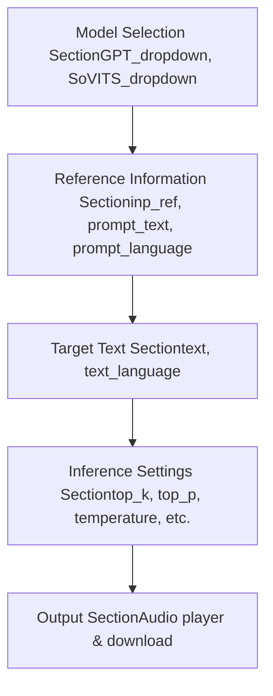
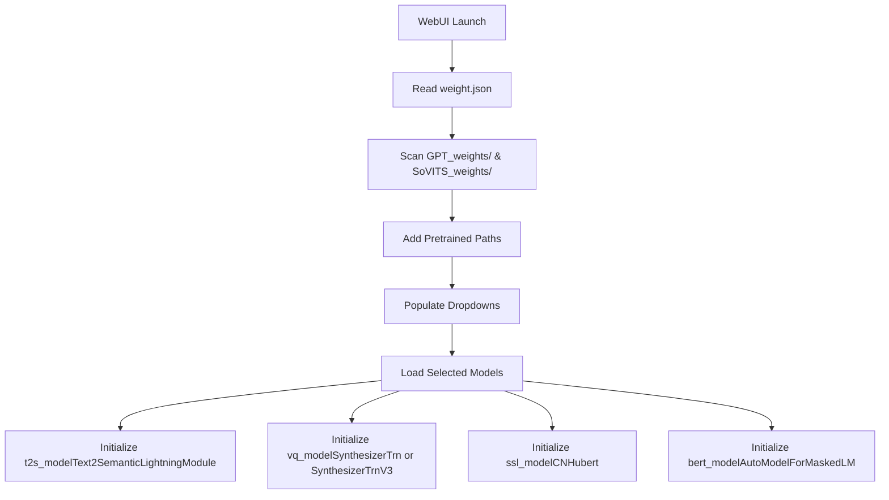
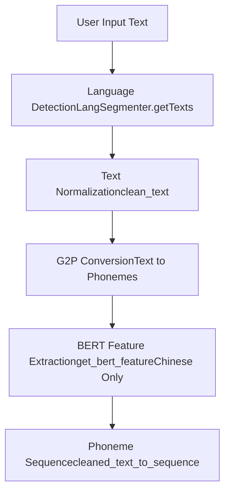
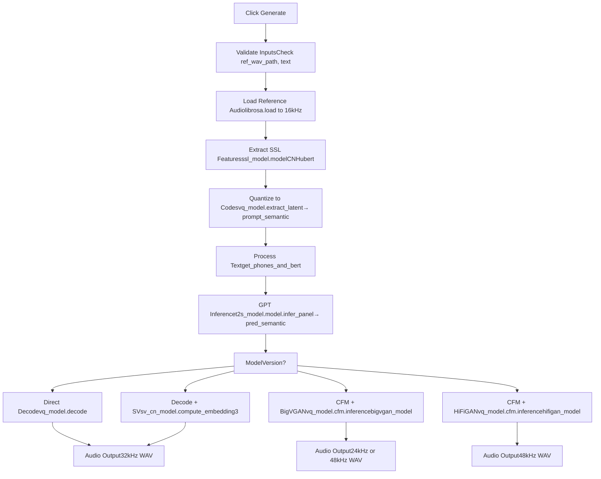
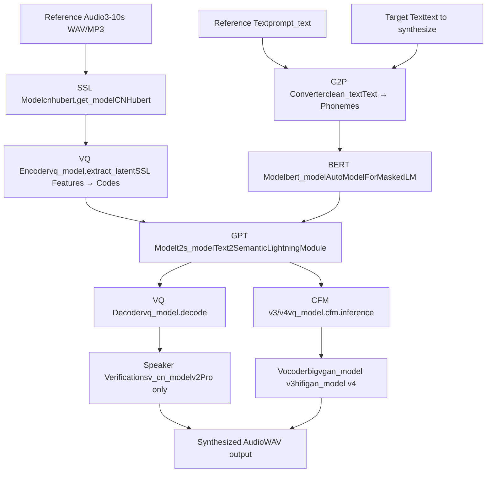

# Quick Start Guide (快速入门指南)

相关源文件

-   [GPT\_SoVITS/inference\_webui.py](https://github.com/RVC-Boss/GPT-SoVITS/blob/c767f0b8/GPT_SoVITS/inference_webui.py)
-   [GPT\_SoVITS/inference\_webui\_fast.py](https://github.com/RVC-Boss/GPT-SoVITS/blob/c767f0b8/GPT_SoVITS/inference_webui_fast.py)
-   [GPT\_SoVITS/process\_ckpt.py](https://github.com/RVC-Boss/GPT-SoVITS/blob/c767f0b8/GPT_SoVITS/process_ckpt.py)
-   [README.md](https://github.com/RVC-Boss/GPT-SoVITS/blob/c767f0b8/README.md?plain=1)
-   [docs/cn/README.md](https://github.com/RVC-Boss/GPT-SoVITS/blob/c767f0b8/docs/cn/README.md?plain=1)
-   [docs/ja/README.md](https://github.com/RVC-Boss/GPT-SoVITS/blob/c767f0b8/docs/ja/README.md?plain=1)
-   [docs/ko/README.md](https://github.com/RVC-Boss/GPT-SoVITS/blob/c767f0b8/docs/ko/README.md?plain=1)
-   [docs/tr/README.md](https://github.com/RVC-Boss/GPT-SoVITS/blob/c767f0b8/docs/tr/README.md?plain=1)
-   [install.ps1](https://github.com/RVC-Boss/GPT-SoVITS/blob/c767f0b8/install.ps1)
-   [install.sh](https://github.com/RVC-Boss/GPT-SoVITS/blob/c767f0b8/install.sh)
-   [requirements.txt](https://github.com/RVC-Boss/GPT-SoVITS/blob/c767f0b8/requirements.txt)
-   [tools/assets.py](https://github.com/RVC-Boss/GPT-SoVITS/blob/c767f0b8/tools/assets.py)

本指南将引导初次使用的用户如何使用带有 Pretrained (预训练) 模型的 GPT-SoVITS 生成他们的第一个 Text-to-Speech (语音合成) 输出。它涵盖了启动推理界面、准备输入材料、配置基本参数以及生成 Synthesized Speech (合成语音) 的内容。本指南假设安装已完成（请参阅 [Installation and Setup (安装与设置)](/RVC-Boss/GPT-SoVITS/1.1-installation-and-setup)）。

有关训练自定义模型的信息，请参阅 [Training Pipeline (训练流水线)](/RVC-Boss/GPT-SoVITS/2.3-training-pipeline)。有关高级推理配置和 API 使用，请参阅 [Inference WebUI (推理 WebUI)](/RVC-Boss/GPT-SoVITS/3.2-inference-webui) 和 [REST API (REST API)](/RVC-Boss/GPT-SoVITS/3.3-rest-api)。

---

## Prerequisites (先决条件)

开始之前，请确认以下事项：

**Installation (安装) 已完成：**

-   GPT-SoVITS 已通过 `install.sh`、`install.ps1`、集成包或手动安装完成安装
-   Python 环境已激活（通常为 `conda activate GPTSoVits`）
-   FFmpeg (FFmpeg) 在 PATH 中可用

**Pretrained (预训练) 模型已下载：** 预训练模型应位于 `GPT_SoVITS/pretrained_models/`。如果 `install.sh` 或 `install.ps1` 成功运行，这些模型已经存在。所需文件包括：

| 模型版本 | 文件 | 位置 |
| --- | --- | --- |
| v2 (默认) | `s1bert25hz-2kh-longer-epoch=68e-step=50232.ckpt`
`s2G488k.pth` 或 `s2G2333k.pth` | `GPT_SoVITS/pretrained_models/gsv-v2final-pretrained/` |
| v3 | `s1v3.ckpt`
`s2Gv3.pth`
`models--nvidia--bigvgan_v2_24khz_100band_256x/` | `GPT_SoVITS/pretrained_models/` |
| v4 | `s2v4.pth`
`vocoder.pth` | `GPT_SoVITS/pretrained_models/gsv-v4-pretrained/` |
| v2Pro/Plus | `s2Gv2Pro.pth` 或 `s2Gv2ProPlus.pth`
`pretrained_eres2netv2w24s4ep4.ckpt` | `GPT_SoVITS/pretrained_models/v2Pro/`
`GPT_SoVITS/pretrained_models/sv/` |

**额外模型（中文 TTS）：**

-   `GPT_SoVITS/text/` 中的 `G2PWModel/` 目录，用于中文 Polyphone Disambiguation (多音字消歧)

**Reference Audio (参考音频)：**

-   一段 3-10 秒的目标声音音频剪辑
-   干净的语音（背景噪音最小）
-   发音清晰
-   支持的格式：WAV, MP3, OGG, FLAC

来源： [README.md193-212](https://github.com/RVC-Boss/GPT-SoVITS/blob/c767f0b8/README.md?plain=1#L193-L212) [install.sh255-261](https://github.com/RVC-Boss/GPT-SoVITS/blob/c767f0b8/install.sh#L255-L261)

---

## Launching the Inference Interface (启动推理界面)

GPT-SoVITS 提供两个推理界面。对于快速入门，请使用 **Inference WebUI**（更简单，仅用于推理）。

### Method 1: Inference WebUI (推荐用于快速入门)

**Windows 集成包：**

```
# 在文件资源管理器中双击go-webui-v2.bat# 或使用 PowerShellgo-webui-v2.ps1
```
**其他平台：**

```
python GPT_SoVITS/inference_webui.py
```
默认情况下，界面将在 `http://localhost:9872` 启动。

**备选启动方式（快速版）：**

```
python GPT_SoVITS/inference_webui_fast.py
```
快速版使用来自 [TTS\_infer\_pack/TTS.py](https://github.com/RVC-Boss/GPT-SoVITS/blob/c767f0b8/TTS_infer_pack/TTS.py) 的优化 TTS 流水线，性能更好。

### Method 2: Main WebUI (全功能界面)

如果您更喜欢带有训练工具的全功能界面：

**Windows：**

```
go-webui.bat  # 或 go-webui.ps1
```
**其他平台：**

```
python webui.py
```
导航至 **1-GPT-SoVITS-TTS** → **1C-Inference** 选项卡。

来源： [README.md273-291](https://github.com/RVC-Boss/GPT-SoVITS/blob/c767f0b8/README.md?plain=1#L273-L291) [GPT\_SoVITS/inference\_webui.py84-86](https://github.com/RVC-Boss/GPT-SoVITS/blob/c767f0b8/GPT_SoVITS/inference_webui.py#L84-L86) [GPT\_SoVITS/inference\_webui\_fast.py45-46](https://github.com/RVC-Boss/GPT-SoVITS/blob/c767f0b8/GPT_SoVITS/inference_webui_fast.py#L45-L46)

---

## Interface Overview (界面概览)

推理界面由四个主要部分组成：


**关键 UI 组件映射：**

| UI 元素 | 代码变量 | 用途 |
| --- | --- | --- |
| GPT 模型列表 | `GPT_dropdown` | 选择 GPT Checkpoint (检查点) 路径 |
| SoVITS 模型列表 | `SoVITS_dropdown` | 选择 SoVITS Checkpoint 路径 |
| 主参考音频 | `inp_ref` | 主要的 3-10 秒语音样本 |
| 辅助参考音频 | `inp_refs` | 可选的额外样本（仅限 v1/v2） |
| 参考文本 | `prompt_text` | 参考音频的转写文本 |
| 参考语言 | `prompt_language` | 参考音频的语言 |
| 目标文本 | `text` | 要合成的文本 |
| 目标语言 | `text_language` | 目标文本的语言 |
| 生成按钮 | 触发 `get_tts_wav()` 或 `inference()` | 开始合成 |

来源： [GPT\_SoVITS/inference\_webui.py306-420](https://github.com/RVC-Boss/GPT-SoVITS/blob/c767f0b8/GPT_SoVITS/inference_webui.py#L306-L420) [GPT\_SoVITS/inference\_webui\_fast.py306-420](https://github.com/RVC-Boss/GPT-SoVITS/blob/c767f0b8/GPT_SoVITS/inference_webui_fast.py#L306-L420)

---

## Step-by-Step: Your First TTS Generation (逐步操作：您的第一次 TTS 生成)

### Step 1: Verify Models Are Loaded (验证模型已加载)

界面启动时，Pretrained 模型会自动加载。请检查模型下拉菜单：

-   **GPT 模型列表**: 应显示来自 `GPT_weights/` 的可用 `.ckpt` 文件和预训练路径
-   **SoVITS 模型列表**: 应显示来自 `SoVITS_weights/` 的可用 `.pth` 文件和预训练路径

如果没有自定义模型存在，默认选择将是预训练的 v2 模型。

**模型加载流程：**


来源： [GPT\_SoVITS/inference\_webui.py45-72](https://github.com/RVC-Boss/GPT-SoVITS/blob/c767f0b8/GPT_SoVITS/inference_webui.py#L45-L72) [GPT\_SoVITS/inference\_webui.py376-400](https://github.com/RVC-Boss/GPT-SoVITS/blob/c767f0b8/GPT_SoVITS/inference_webui.py#L376-L400) [config.py](https://github.com/RVC-Boss/GPT-SoVITS/blob/c767f0b8/config.py)

### Step 2: Prepare Reference Audio (准备参考音频)

Reference Audio 是系统将要克隆的语音样本。要求：

-   **时长**: 3-10 秒（由 [GPT\_SoVITS/inference\_webui.py814-816](https://github.com/RVC-Boss/GPT-SoVITS/blob/c767f0b8/GPT_SoVITS/inference_webui.py#L814-L816) 处的代码检查强制执行）
-   **格式**: WAV, MP3 或 librosa (librosa) 支持的其他格式
-   **质量**: 干净、清晰的语音，背景噪音最小
-   **内容**: 自然语音，具有正常的 Prosody (韵律)（避免平铺直叙或过度夸张的朗读）

**文件选择：**

1.  点击 **Primary Reference Audio** 上传按钮
2.  选择您的音频文件
3.  文件路径将填充到 `inp_ref` 中

**可选：多个参考音频（仅限 v1/v2）：** 对于 v1 和 v2 模型，您可以在 **Auxiliary Reference Audio** 部分上传额外的参考音频。这些音频可以提供更多的声音特征。v3/v4 不支持此项。

来源： [GPT\_SoVITS/inference\_webui.py813-816](https://github.com/RVC-Boss/GPT-SoVITS/blob/c767f0b8/GPT_SoVITS/inference_webui.py#L814-L816) [GPT\_SoVITS/inference\_webui.py896-914](https://github.com/RVC-Boss/GPT-SoVITS/blob/c767f0b8/GPT_SoVITS/inference_webui.py#L896-L914)

### Step 3: Enter Reference Text (输入参考文本)

Reference Text 是参考音频内容的转写。这有助于模型理解语音内容。

1.  在 **Reference Text** 字段 (`prompt_text`) 中，输入参考音频中说出的确切文字
2.  从下拉菜单中选择 **Reference Language**：
    -   中文 (Chinese - all\_zh)
    -   英文 (English - en)
    -   日文 (Japanese - all\_ja)
    -   粤语 (Cantonese - all\_yue) \[v2+\]
    -   韩文 (Korean - all\_ko) \[v2+\]
    -   混合语言选项（中英混合、日英混合等）
    -   多语种混合 (自动语言检测)

**无参考文本模式：** 如果您无法确定参考音频的内容，请勾选 **"开启无参考文本模式"** 复选框。在此模式下，`prompt_text` 将被忽略。仅建议在使用经过 Fine-tune (微调) 的 GPT 模型时使用，且 v3/v4 不支持此模式。

来源： [GPT\_SoVITS/inference\_webui.py344-360](https://github.com/RVC-Boss/GPT-SoVITS/blob/c767f0b8/GPT_SoVITS/inference_webui.py#L344-L360) [GPT\_SoVITS/inference\_webui.py779-781](https://github.com/RVC-Boss/GPT-SoVITS/blob/c767f0b8/GPT_SoVITS/inference_webui.py#L779-L781) [GPT\_SoVITS/inference\_webui.py793-796](https://github.com/RVC-Boss/GPT-SoVITS/blob/c767f0b8/GPT_SoVITS/inference_webui.py#L793-L796)

### Step 4: Enter Target Text (输入目标文本)

Target Text 是您希望合成出的语音说出的内容。

1.  在 **Target Text** 字段 (`text`) 中，输入要合成的文本
2.  选择 **Target Language** - 应与您的目标文本语言相匹配
3.  文本可以是多句话或多个段落（将自动分段）

**文本处理：** 系统将：

-   归一化文本（数字转文字，符号转文本）
-   根据 **"怎么切"** 设置分段成句子
-   使用特定语言的 G2P (G2P) 模型将文本转换为音素
-   为中文文本提取 BERT (BERT) 特征


来源： [GPT\_SoVITS/inference\_webui.py601-668](https://github.com/RVC-Boss/GPT-SoVITS/blob/c767f0b8/GPT_SoVITS/inference_webui.py#L601-L668) [GPT\_SoVITS/inference\_webui.py552-556](https://github.com/RVC-Boss/GPT-SoVITS/blob/c767f0b8/GPT_SoVITS/inference_webui.py#L552-L556) [text/cleaner.py](https://github.com/RVC-Boss/GPT-SoVITS/blob/c767f0b8/text/cleaner.py)

### Step 5: Configure Basic Parameters (配置基本参数)

对于第一次生成，您可以使用默认参数。关键参数：

| 参数 | 默认值 | 用途 |
| --- | --- | --- |
| **top\_k** | 15 | 限制采样时的词汇量（越低越保守） |
| **top\_p** | 1.0 | Nucleus sampling (核采样) 阈值（越低越集中） |
| **temperature** | 1.0 | 采样随机性（越低越确定） |
| **Speed Factor** | 1.0 | 语速倍数 (0.6-1.65) |
| **Fragment Interval** | 0.3s | 句子间的停顿时间 |
| **How to Cut (怎么切)** | 凑四句一切 | 文本分段策略 |

**模型特定参数：**

-   **Sample Steps (仅限 v3/v4)**: CFM (Conditional Flow Matching) Diffusion (扩散) 步数。选项：4, 8, 16, 32 (v3 默认), 64, 128。越高 = 质量越好但越慢。
-   **Audio Super-sampling (仅限 v3)**: 使用 AP-BWE 模型将 24kHz 输出上采样至 48kHz

来源： [GPT\_SoVITS/inference\_webui.py374-397](https://github.com/RVC-Boss/GPT-SoVITS/blob/c767f0b8/GPT_SoVITS/inference_webui.py#L374-L397) [GPT\_SoVITS/inference\_webui\_fast.py374-416](https://github.com/RVC-Boss/GPT-SoVITS/blob/c767f0b8/GPT_SoVITS/inference_webui_fast.py#L374-L416)

### Step 6: Generate Speech (生成语音)

1.  点击 **"合成语音"** 按钮
2.  系统将通过以下阶段进行处理：


3.  控制台会显示处理进度和耗时信息
4.  完成后，音频播放器将显示生成的语音
5.  使用下载按钮保存输出

**处理阶段（来自 [GPT\_SoVITS/inference\_webui.py985](https://github.com/RVC-Boss/GPT-SoVITS/blob/c767f0b8/GPT_SoVITS/inference_webui.py#L985-L985)）：**

-   第一阶段：参考音频处理
-   第二阶段：逐段文本处理
-   第三阶段：逐段 GPT 语义生成
-   第四阶段：逐段 SoVITS 音频合成

来源： [GPT\_SoVITS/inference\_webui.py751-1001](https://github.com/RVC-Boss/GPT-SoVITS/blob/c767f0b8/GPT_SoVITS/inference_webui.py#L751-L1001) [GPT\_SoVITS/inference\_webui\_fast.py150-202](https://github.com/RVC-Boss/GPT-SoVITS/blob/c767f0b8/GPT_SoVITS/inference_webui_fast.py#L150-L202)

---

## Understanding the Inference Pipeline (理解推理流水线)

完整的推理流水线涉及多个模型按顺序工作：


**关键模型组件：**

| 组件 | 类/函数 | 位置 | 用途 |
| --- | --- | --- | --- |
| SSL (SSL) 特征提取器 | `cnhubert.get_model()` | [feature\_extractor/cnhubert.py](https://github.com/RVC-Boss/GPT-SoVITS/blob/c767f0b8/feature_extractor/cnhubert.py) | 从参考音频中提取声学特征 |
| BERT (BERT) 模型 | `AutoModelForMaskedLM` | [GPT\_SoVITS/inference\_webui.py164](https://github.com/RVC-Boss/GPT-SoVITS/blob/c767f0b8/GPT_SoVITS/inference_webui.py#L164-L164) | 提取上下文文本特征（仅限中文） |
| GPT 模型 | `Text2SemanticLightningModule` | [AR/models/t2s\_lightning\_module.py](https://github.com/RVC-Boss/GPT-SoVITS/blob/c767f0b8/AR/models/t2s_lightning_module.py) | 从文本生成语义 Token 序列 |
| VQ (VQ) 模型 (v1/v2) | `SynthesizerTrn` | [GPT\_SoVITS/module/models.py](https://github.com/RVC-Boss/GPT-SoVITS/blob/c767f0b8/GPT_SoVITS/module/models.py) | 在音频和语义 Token 之间进行编码/解码 |
| VQ 模型 (v3/v4) | `SynthesizerTrnV3` | [GPT\_SoVITS/module/models.py](https://github.com/RVC-Boss/GPT-SoVITS/blob/c767f0b8/GPT_SoVITS/module/models.py) | 基于 CFM 的声学模型 |
| BigVGAN (v3) | `bigvgan.BigVGAN` | [BigVGAN/](https://github.com/RVC-Boss/GPT-SoVITS/blob/c767f0b8/BigVGAN/) | 神经声码器（梅尔谱转波形，24kHz） |
| HiFiGAN (v4) | `Generator` | [GPT\_SoVITS/module/models.py](https://github.com/RVC-Boss/GPT-SoVITS/blob/c767f0b8/GPT_SoVITS/module/models.py) | 神经声码器（梅尔谱转波形，48kHz） |
| 声纹验证 | `SV` | [sv/](https://github.com/RVC-Boss/GPT-SoVITS/blob/c767f0b8/sv/) | 提取声纹嵌入（v2Pro） |

来源： [GPT\_SoVITS/inference\_webui.py96-220](https://github.com/RVC-Boss/GPT-SoVITS/blob/c767f0b8/GPT_SoVITS/inference_webui.py#L96-L220) [GPT\_SoVITS/inference\_webui.py376-405](https://github.com/RVC-Boss/GPT-SoVITS/blob/c767f0b8/GPT_SoVITS/inference_webui.py#L376-L405) [GPT\_SoVITS/inference\_webui.py440-505](https://github.com/RVC-Boss/GPT-SoVITS/blob/c767f0b8/GPT_SoVITS/inference_webui.py#L440-L505)

---

## Model Version Comparison (模型版本对比)

GPT-SoVITS 已演进出多个版本，每个版本都有不同的特点：

| 特性 | v1/v2 | v3 | v4 | v2Pro/Plus |
| --- | --- | --- | --- | --- |
| **输出采样率** | 32kHz | 原生 24kHz | 原生 48kHz | 32kHz |
| **合成方法** | 直接 VQ 解码 | CFM + BigVGAN | CFM + HiFiGAN | VQ 解码 + SV |
| **最小训练数据** | 1 分钟 | < 1 分钟 | < 1 分钟 | 1 分钟 |
| **音色相似度** | 好 | 极好 | 极好 | 极好 |
| **VRAM (训练)** | ~14GB | ~8GB (LoRA) | ~8GB (LoRA) | ~14GB |
| **推理速度** | 快 | 中 | 中 | 快 |
| **音频质量** | 好 | 高（听起来可能较闷） | 高（无伪影） | 高 |
| **辅助参考音频** | ✓ | ✗ | ✗ | ✓ |
| **无参考模式** | ✓ | ✗ | ✗ | ✓ |
| **采样步数参数** | ✗ | ✓ (4-128) | ✓ (4-32) | ✗ |
| **上采样** | ✗ | ✓ (24→48kHz) | ✗ (原生 48kHz) | ✗ |

**版本选择建议：**

-   **v2**: 最适合快速推理和低显存。在平均音频质量的训练集下表现良好。
-   **v3**: 音色相似度最佳，适合极少量训练数据。在原生 24kHz 下听起来可能较闷（建议使用上采样）。
-   **v4**: 修复了 v3 的金属混响伪影，原生 48kHz 输出。目前推荐的版本。
-   **v2Pro/Plus**: 增强型声纹验证，速度相近但相似度优于 v2。最适合高质量声音克隆。

**版本检测：** 系统通过 [process\_ckpt.py100-127](https://github.com/RVC-Boss/GPT-SoVITS/blob/c767f0b8/process_ckpt.py#L100-L127) 自动从 Checkpoint 元数据中检测模型版本。检测方法包括：

1.  已知预训练模型的 MD5 哈希匹配
2.  文件头字节（自定义格式）
3.  文件大小启发式算法（针对旧模型的兜底方案）

来源： [README.md293-367](https://github.com/RVC-Boss/GPT-SoVITS/blob/c767f0b8/README.md?plain=1#L293-L367) [docs/cn/README.md281-356](https://github.com/RVC-Boss/GPT-SoVITS/blob/c767f0b8/docs/cn/README.md?plain=1#L281-L356) [process\_ckpt.py72-126](https://github.com/RVC-Boss/GPT-SoVITS/blob/c767f0b8/process_ckpt.py#L72-L126) [GPT\_SoVITS/inference\_webui.py229-243](https://github.com/RVC-Boss/GPT-SoVITS/blob/c767f0b8/GPT_SoVITS/inference_webui.py#L229-L243)

---

## Common Parameters Explained (常用参数说明)

### Sampling Parameters (采样参数)

**top\_k** (默认值: 15, 范围: 1-100)

-   控制采样时的词汇量大小
-   较低的值 = 更保守的预测（更安全但缺乏创意）
-   较高的值 = 更多的词汇选项（更有创意但可能不稳定）
-   代码: [GPT\_SoVITS/inference\_webui.py884](https://github.com/RVC-Boss/GPT-SoVITS/blob/c767f0b8/GPT_SoVITS/inference_webui.py#L884-L884)

**top\_p** (默认值: 1.0, 范围: 0-1)

-   Nucleus Sampling (核采样) 阈值
-   考虑累积概率达到 `top_p` 的 Token
-   较低的值 = 更集中于高概率 Token
-   1.0 = 考虑所有 Token（不进行过滤）
-   代码: [GPT\_SoVITS/inference\_webui.py885](https://github.com/RVC-Boss/GPT-SoVITS/blob/c767f0b8/GPT_SoVITS/inference_webui.py#L885-L885)

**temperature** (默认值: 1.0, 范围: 0-1)

-   控制预测的随机性
-   较低的值 = 更确定（可重复，更安全）
-   较高的值 = 更随机（变化更多，可能不稳定）
-   建议设置在 0.6-0.8 之间以获得稳定的生成效果
-   代码: [GPT\_SoVITS/inference\_webui.py886](https://github.com/RVC-Boss/GPT-SoVITS/blob/c767f0b8/GPT_SoVITS/inference_webui.py#L886-L886)

**repetition\_penalty** (默认值: 1.35, 范围: 0-2)

-   对重复 Token 进行惩罚以避免死循环
-   大于 1.0 的值会抑制重复
-   值越高 = 惩罚越强
-   有助于防止口吃或无限循环
-   代码: [GPT\_SoVITS/inference\_webui\_fast.py395](https://github.com/RVC-Boss/GPT-SoVITS/blob/c767f0b8/GPT_SoVITS/inference_webui_fast.py#L395-L395)

### Text Segmentation (文本分段)

**"怎么切"** 参数控制文本分段策略：

| 选项 | 方法 | 代码函数 |
| --- | --- | --- |
| 不切 | 不进行切分 | 按原样返回 |
| 凑四句一切 | 每 4 句一切 | [GPT\_SoVITS/inference\_webui.py1023-1036](https://github.com/RVC-Boss/GPT-SoVITS/blob/c767f0b8/GPT_SoVITS/inference_webui.py#L1023-L1036) |
| 凑50字一切 | 每 50 字一切 | [GPT\_SoVITS/inference\_webui.py1038-1061](https://github.com/RVC-Boss/GPT-SoVITS/blob/c767f0b8/GPT_SoVITS/inference_webui.py#L1038-L1061) |
| 按中文句号。切 | 在中文句号处切分 | [GPT\_SoVITS/inference\_webui.py1063-1068](https://github.com/RVC-Boss/GPT-SoVITS/blob/c767f0b8/GPT_SoVITS/inference_webui.py#L1063-L1068) |
| 按英文句号.切 | 在英文句号处切分 | [GPT\_SoVITS/inference\_webui.py1070-1075](https://github.com/RVC-Boss/GPT-SoVITS/blob/c767f0b8/GPT_SoVITS/inference_webui.py#L1070-L1075) |
| 按标点符号切 | 在所有标点符号处切分 | [GPT\_SoVITS/inference\_webui.py1078-1106](https://github.com/RVC-Boss/GPT-SoVITS/blob/c767f0b8/GPT_SoVITS/inference_webui.py#L1078-L1106) |

分段会影响：

-   内存使用（分段越长 = 显存占用越多）
-   Prosody (韵律) 连续性（分段越短 = 停顿越自然）
-   处理并行化

来源： [GPT\_SoVITS/inference\_webui.py831-846](https://github.com/RVC-Boss/GPT-SoVITS/blob/c767f0b8/GPT_SoVITS/inference_webui.py#L831-L846) [GPT\_SoVITS/inference\_webui.py1004-1106](https://github.com/RVC-Boss/GPT-SoVITS/blob/c767f0b8/GPT_SoVITS/inference_webui.py#L1004-L1106)

### Speed and Quality (速度与质量)

**speed\_factor** (默认值: 1.0, 范围: 0.6-1.65)

-   通过重采样调整语速
-   < 1.0 = 语速减慢
-   > 1.0 = 语速加快

-   不影响音高（与时间拉伸不同）
-   代码: [GPT\_SoVITS/inference\_webui.py917-922](https://github.com/RVC-Boss/GPT-SoVITS/blob/c767f0b8/GPT_SoVITS/inference_webui.py#L917-L922)

**batch\_size** (默认值: 20, 范围: 1-200)

-   同时处理的语义 Token 数量
-   越高 = 越快但占用显存越多
-   越低 = 越慢但占用显存越少
-   主要影响 GPT 推理阶段
-   代码: [GPT\_SoVITS/inference\_webui\_fast.py186](https://github.com/RVC-Boss/GPT-SoVITS/blob/c767f0b8/GPT_SoVITS/inference_webui_fast.py#L186-L186)

**sample\_steps** (v3: 4-128, v4: 4-32, 默认值: v3 为 32, v4 为 8)

-   CFM Diffusion 步数
-   越高 = 质量越好但越慢
-   v3: 建议设置 32-64 以保证质量
-   v4: 由于架构改进，8-16 步已足够
-   代码: [GPT\_SoVITS/inference\_webui.py958-959](https://github.com/RVC-Boss/GPT-SoVITS/blob/c767f0b8/GPT_SoVITS/inference_webui.py#L958-L959)

来源： [GPT\_SoVITS/inference\_webui\_fast.py174-196](https://github.com/RVC-Boss/GPT-SoVITS/blob/c767f0b8/GPT_SoVITS/inference_webui_fast.py#L174-L196) [GPT\_SoVITS/inference\_webui.py272-273](https://github.com/RVC-Boss/GPT-SoVITS/blob/c767f0b8/GPT_SoVITS/inference_webui.py#L272-L273)

---

## Troubleshooting (故障排除)

### Reference Audio Length Error (参考音频长度错误)

**错误消息:** "参考音频在3~10秒范围外，请更换！"

**原因:** 参考音频时长超出 3-10 秒范围

**解决方案:**

1.  检查音频时长: 在 16kHz 采样率下，样本数应在 `48000 < len(wav16k) < 160000` 之间
2.  使用音频编辑器将音频裁剪至 3-10 秒
3.  确保音频文件未损坏（尝试重新编码）

**代码检查:** [GPT\_SoVITS/inference\_webui.py814-816](https://github.com/RVC-Boss/GPT-SoVITS/blob/c767f0b8/GPT_SoVITS/inference_webui.py#L814-L816)

### Empty Output or No Audio (无输出或无音频)

**可能原因:**

1.  **v3/v4 中参考文本为空:** 这些版本必须提供参考文本
    -   解决方案: 填入 `prompt_text` 或切换到 v1/v2
2.  **模型未加载:** 检查控制台是否有加载错误
    -   解决方案: 确认模型文件存在并重启界面
3.  **文本太短:** 极短的输入可能会被过滤掉
    -   解决方案: 每段至少使用 5 个字符

**相关代码:** [GPT\_SoVITS/inference\_webui.py770-777](https://github.com/RVC-Boss/GPT-SoVITS/blob/c767f0b8/GPT_SoVITS/inference_webui.py#L770-L777) [GPT\_SoVITS/inference\_webui.py781-783](https://github.com/RVC-Boss/GPT-SoVITS/blob/c767f0b8/GPT_SoVITS/inference_webui.py#L781-L783)

### V3 Model LoRA Loading Error (V3 模型 LoRA 加载错误)

**错误消息:** "SoVITS v3 底模缺失，无法加载相应 LoRA 权重"

**原因:** 尝试在没有底模的情况下加载 v3 LoRA 检查点

**解决方案:**

1.  从 [HuggingFace](https://huggingface.co/lj1995/GPT-SoVITS) 下载 v3 预训练底模 `s2Gv3.pth`
2.  放置在 `GPT_SoVITS/pretrained_models/` 目录下
3.  重启界面

**代码检查:** [GPT\_SoVITS/inference\_webui.py237-240](https://github.com/RVC-Boss/GPT-SoVITS/blob/c767f0b8/GPT_SoVITS/inference_webui.py#L237-L240) [GPT\_SoVITS/inference\_webui\_fast.py241-244](https://github.com/RVC-Boss/GPT-SoVITS/blob/c767f0b8/GPT_SoVITS/inference_webui_fast.py#L241-L244)

### Model Version Mismatch (模型版本不匹配)

**现象:** 模型已加载但合成失败或产生杂音

**原因:** 版本检测错误或将 v1/v2 符号与 v3/v4 模型混用

**解决方案:**

1.  查看控制台输出中的版本检测结果
2.  确保 GPT 和 SoVITS 模型版本兼容
3.  对于自定义模型，请核实检查点中的版本元数据

**版本检测代码:** [process\_ckpt.py100-127](https://github.com/RVC-Boss/GPT-SoVITS/blob/c767f0b8/process_ckpt.py#L100-L127)

### Out of Memory (CUDA OOM (显存溢出))

**现象:** `RuntimeError: CUDA out of memory`

**解决方案:**

1.  **降低 Batch Size (批大小):** 将其从 20 降低到 10 或 5
2.  **使用 FP16:** 通过 `is_half=True` 环境变量启用 Half-Precision (半精度)
3.  **缩短文本分段:** 使用更细致的分段策略
4.  **使用 v3/v4 LoRA:** 全量微调需要 14GB 显存，而 LoRA 仅需约 8GB
5.  **关闭其他占用显存的应用**

**各版本的推理显存使用情况：**

-   v1/v2 推理: ~4-6GB
-   v3 推理: ~5-7GB
-   v4 推理: ~5-7GB
-   v2Pro 推理: ~6-8GB

### Language Not Supported (语言不支持)

**现象:** 发音不正确或缺少语言选项

**支持的语言 (v2+):**

-   中文 (普通话): all\_zh, zh
-   英文: en
-   日文: all\_ja, ja
-   粤语: all\_yue, yue
-   韩文: all\_ko, ko
-   混合: auto, auto\_yue

**v1 支持的语言:** 仅限中文、英文、日文

**代码:** [GPT\_SoVITS/inference\_webui.py140-162](https://github.com/RVC-Boss/GPT-SoVITS/blob/c767f0b8/GPT_SoVITS/inference_webui.py#L140-L162)

来源： [GPT\_SoVITS/inference\_webui.py770-890](https://github.com/RVC-Boss/GPT-SoVITS/blob/c767f0b8/GPT_SoVITS/inference_webui.py#L770-L890) [GPT\_SoVITS/inference\_webui.py237-240](https://github.com/RVC-Boss/GPT-SoVITS/blob/c767f0b8/GPT_SoVITS/inference_webui.py#L237-L240) [process\_ckpt.py100-127](https://github.com/RVC-Boss/GPT-SoVITS/blob/c767f0b8/process_ckpt.py#L100-L127)

---

## Next Steps (下一步)

在成功生成您的第一个 TTS 输出后：

1.  **尝试不同参数:** 尝试不同的 `top_k`、`temperature` 和 `speed_factor` 值以了解它们的效果

2.  **测试多种语言:** 如果是多语言，请尝试不同的语言组合和自动检测模式

3.  **准备自定义训练数据:** 要针对特定声音训练模型，请参阅 [Data Preparation (数据准备)](/RVC-Boss/GPT-SoVITS/5-data-preparation) 以准备训练数据集

4.  **Fine-tune (微调) 模型:** 遵循 [Training Pipeline (训练流水线)](/RVC-Boss/GPT-SoVITS/2.3-training-pipeline) 使用您自己的语音数据训练自定义 GPT 和 SoVITS 模型

5.  **通过 API 集成:** 对于生产环境使用，请参阅 [REST API (REST API)](/RVC-Boss/GPT-SoVITS/3.3-rest-api) 以通过 JSON 请求进行程序化访问

6.  **优化生产部署:** 使用 [Model Export and ONNX (模型导出与 ONNX)](/RVC-Boss/GPT-SoVITS/7.2-model-export-and-onnx) 将模型导出为 ONNX 格式以加快推理速度

7.  **批量处理:** 使用 [Batch Processing (批量处理)](/RVC-Boss/GPT-SoVITS/7.3-batch-processing) 高效处理多个文本


**其他资源：**

-   详细用户指南: [简体中文](https://www.yuque.com/baicaigongchang1145haoyuangong/ib3g1e) | [English](https://rentry.co/GPT-SoVITS-guide#/)
-   模型版本对比: [Model Versions and Evolution (模型版本与演进)](/RVC-Boss/GPT-SoVITS/1.2-model-versions-and-evolution)
-   高级推理配置: [Inference WebUI (推理 WebUI)](/RVC-Boss/GPT-SoVITS/3.2-inference-webui)

来源： [README.md238-291](https://github.com/RVC-Boss/GPT-SoVITS/blob/c767f0b8/README.md?plain=1#L238-L291) [README.md369-388](https://github.com/RVC-Boss/GPT-SoVITS/blob/c767f0b8/README.md?plain=1#L369-L388)

---

## File References Summary (文件引用摘要)

快速入门推理中涉及的关键文件：

| 文件 | 用途 |
| --- | --- |
| [GPT\_SoVITS/inference\_webui.py1-1207](https://github.com/RVC-Boss/GPT-SoVITS/blob/c767f0b8/GPT_SoVITS/inference_webui.py#L1-L1207) | 具有集成模型加载功能的主推理界面 |
| [GPT\_SoVITS/inference\_webui\_fast.py1-523](https://github.com/RVC-Boss/GPT-SoVITS/blob/c767f0b8/GPT_SoVITS/inference_webui_fast.py#L1-L523) | 使用 TTS 流水线的优化推理界面 |
| [config.py](https://github.com/RVC-Boss/GPT-SoVITS/blob/c767f0b8/config.py) | 配置管理，模型路径检测 |
| [process\_ckpt.py100-139](https://github.com/RVC-Boss/GPT-SoVITS/blob/c767f0b8/process_ckpt.py#L100-L139) | 模型版本检测和加载工具 |
| [GPT\_SoVITS/module/models.py](https://github.com/RVC-Boss/GPT-SoVITS/blob/c767f0b8/GPT_SoVITS/module/models.py) | SynthesizerTrn, SynthesizerTrnV3, Generator (声码器) |
| [AR/models/t2s\_lightning\_module.py](https://github.com/RVC-Boss/GPT-SoVITS/blob/c767f0b8/AR/models/t2s_lightning_module.py) | Text2SemanticLightningModule (GPT 模型) |
| [feature\_extractor/cnhubert.py](https://github.com/RVC-Boss/GPT-SoVITS/blob/c767f0b8/feature_extractor/cnhubert.py) | CNHubert SSL 特征提取 |
| [text/cleaner.py](https://github.com/RVC-Boss/GPT-SoVITS/blob/c767f0b8/text/cleaner.py) | 文本归一化和 G2P 转换 |
| [TTS\_infer\_pack/TTS.py](https://github.com/RVC-Boss/GPT-SoVITS/blob/c767f0b8/TTS_infer_pack/TTS.py) | 统一的 TTS 推理流水线（快速版） |

来源：上述列出的所有文件
