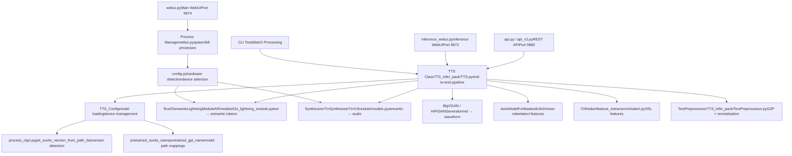
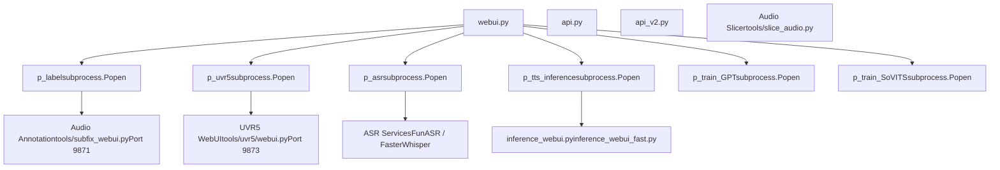
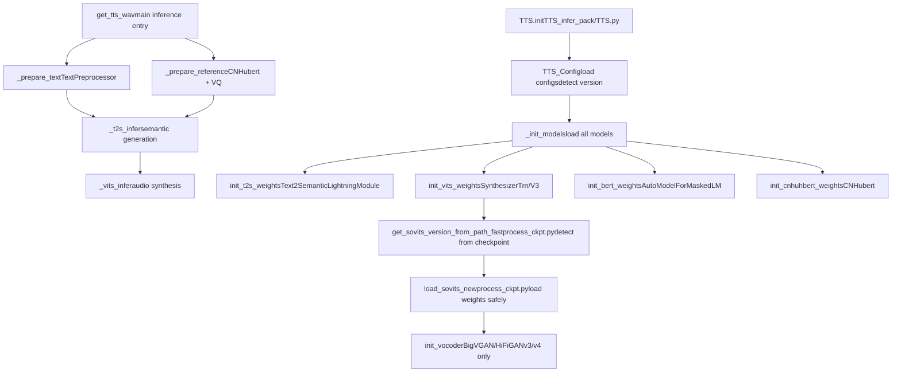
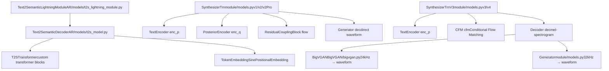
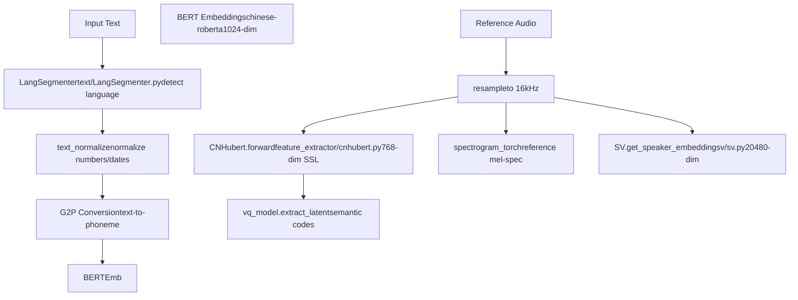
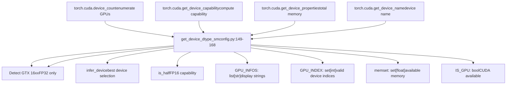
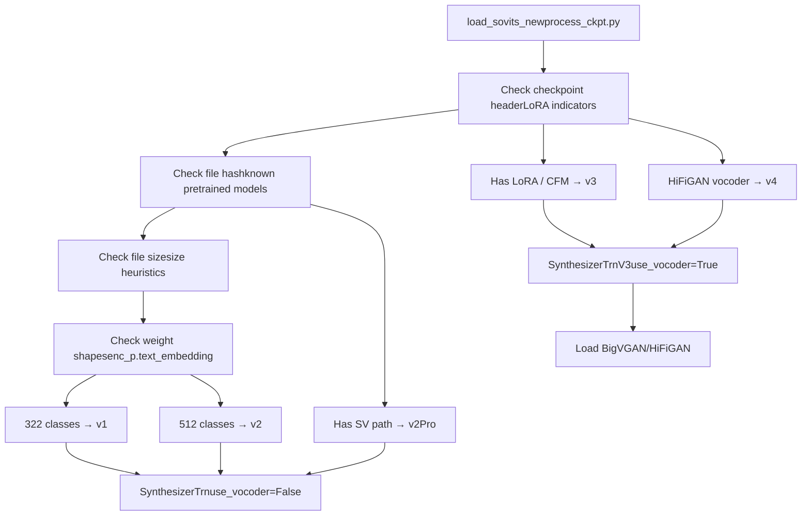
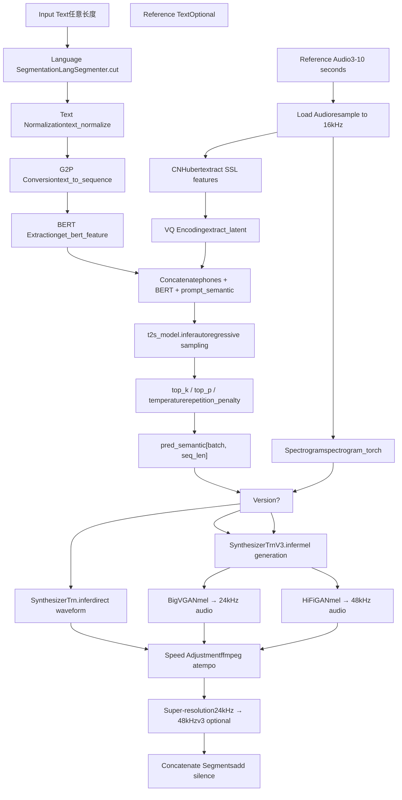
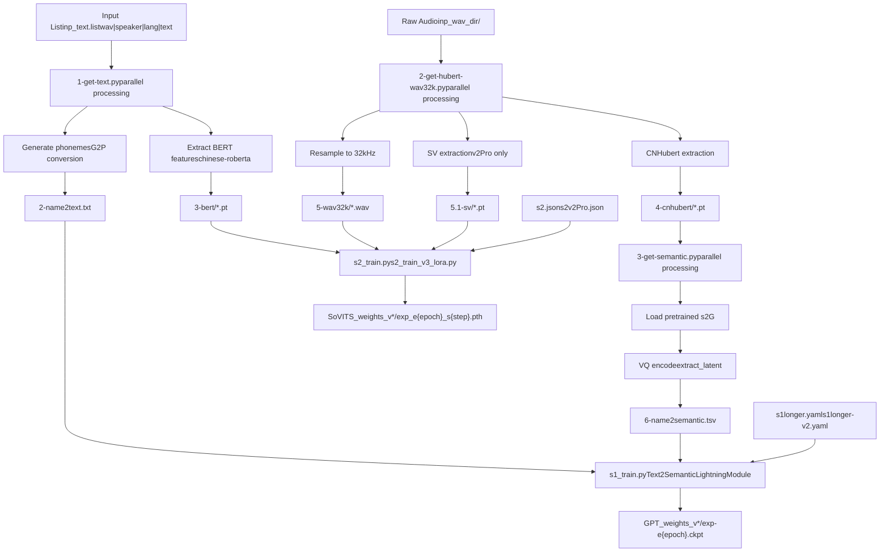

# System Architecture (系统架构)

相关源文件

-   [.gitignore](https://github.com/RVC-Boss/GPT-SoVITS/blob/c767f0b8/.gitignore)
-   [GPT\_SoVITS/AR/models/t2s\_model.py](https://github.com/RVC-Boss/GPT-SoVITS/blob/c767f0b8/GPT_SoVITS/AR/models/t2s_model.py)
-   [GPT\_SoVITS/AR/models/utils.py](https://github.com/RVC-Boss/GPT-SoVITS/blob/c767f0b8/GPT_SoVITS/AR/models/utils.py)
-   [GPT\_SoVITS/TTS\_infer\_pack/TTS.py](https://github.com/RVC-Boss/GPT-SoVITS/blob/c767f0b8/GPT_SoVITS/TTS_infer_pack/TTS.py)
-   [GPT\_SoVITS/configs/tts\_infer.yaml](https://github.com/RVC-Boss/GPT-SoVITS/blob/c767f0b8/GPT_SoVITS/configs/tts_infer.yaml)
-   [README.md](https://github.com/RVC-Boss/GPT-SoVITS/blob/c767f0b8/README.md?plain=1)
-   [api.py](https://github.com/RVC-Boss/GPT-SoVITS/blob/c767f0b8/api.py)
-   [api\_v2.py](https://github.com/RVC-Boss/GPT-SoVITS/blob/c767f0b8/api_v2.py)
-   [config.py](https://github.com/RVC-Boss/GPT-SoVITS/blob/c767f0b8/config.py)
-   [docs/cn/README.md](https://github.com/RVC-Boss/GPT-SoVITS/blob/c767f0b8/docs/cn/README.md?plain=1)
-   [docs/ja/README.md](https://github.com/RVC-Boss/GPT-SoVITS/blob/c767f0b8/docs/ja/README.md?plain=1)
-   [docs/ko/README.md](https://github.com/RVC-Boss/GPT-SoVITS/blob/c767f0b8/docs/ko/README.md?plain=1)
-   [docs/tr/README.md](https://github.com/RVC-Boss/GPT-SoVITS/blob/c767f0b8/docs/tr/README.md?plain=1)
-   [install.ps1](https://github.com/RVC-Boss/GPT-SoVITS/blob/c767f0b8/install.ps1)
-   [install.sh](https://github.com/RVC-Boss/GPT-SoVITS/blob/c767f0b8/install.sh)
-   [requirements.txt](https://github.com/RVC-Boss/GPT-SoVITS/blob/c767f0b8/requirements.txt)
-   [webui.py](https://github.com/RVC-Boss/GPT-SoVITS/blob/c767f0b8/webui.py)

## Purpose and Scope (目的与范围)

本文档描述了 GPT-SoVITS 系统的高层架构，重点关注主要组件如何交互以及代码库的分层设计。它涵盖了支持训练和推理工作流的 Interface Layer (接口层)、Model Layer (模型层)、Orchestration Layer (编排层) 和配置系统。

有关特定子系统的详细信息：

-   核心模型架构 (SynthesizerTrn, Text2SemanticLightningModule) → 参见 [Core Model Architectures](/RVC-Boss/GPT-SoVITS/2.1-core-model-architectures)
-   文本处理流水线 → 参见 [Text Processing Pipeline](/RVC-Boss/GPT-SoVITS/2.2-text-processing-pipeline)
-   训练工作流 → 参见 [Training Pipeline](/RVC-Boss/GPT-SoVITS/2.3-training-pipeline)
-   推理工作流 → 参见 [Inference Pipeline](/RVC-Boss/GPT-SoVITS/2.4-inference-pipeline)

---

## Architectural Overview (架构概览)

GPT-SoVITS 遵循分层架构，接口、编排、模型和配置关注点明确分离。系统支持多个模型版本 (v1/v2/v3/v4/v2Pro/v2ProPlus)，通过配置和动态加载管理特定版本的代码路径。


**关键架构原则：**

1.  **Version Polymorphism (版本多态)**：根据 Checkpoints (检查点) 元数据动态加载模型，针对 v1/v2（直接解码）与 v3/v4（CFM + Vocoder (声码器)）采用不同的执行路径。
2.  **Process Isolation (进程隔离)**：WebUI 为训练、预处理和推理生成独立的子进程，以防止资源冲突。
3.  **Hardware Abstraction (硬件抽象)**：`config.py` 检测 GPU 能力（计算能力、显存）并选择合适的设备/精度。
4.  **Modular Pipeline (模块化流水线)**：TTS 推理被分解为离散的阶段（文本处理、语义生成、声学合成），这些阶段可以重复使用。

Sources: [webui.py1-300](https://github.com/RVC-Boss/GPT-SoVITS/blob/c767f0b8/webui.py#L1-L300) [GPT\_SoVITS/TTS\_infer\_pack/TTS.py421-475](https://github.com/RVC-Boss/GPT-SoVITS/blob/c767f0b8/GPT_SoVITS/TTS_infer_pack/TTS.py#L421-L475) [config.py1-219](https://github.com/RVC-Boss/GPT-SoVITS/blob/c767f0b8/config.py#L1-L219) [GPT\_SoVITS/AR/models/t2s\_lightning\_module.py1-50](https://github.com/RVC-Boss/GPT-SoVITS/blob/c767f0b8/GPT_SoVITS/AR/models/t2s_lightning_module.py#L1-L50)

---

## Component Layers (组件层)

### Interface Layer (接口层)

接口层为用户和程序访问 GPT-SoVITS 功能提供了多个入口点。


**组件描述：**

| Component | File | Purpose | Port |
| --- | --- | --- | --- |
| Main WebUI | [webui.py1-300](https://github.com/RVC-Boss/GPT-SoVITS/blob/c767f0b8/webui.py#L1-L300) | 训练 + 推理 + 工具编排 | 9874 |
| REST API v1 | [api.py1-200](https://github.com/RVC-Boss/GPT-SoVITS/blob/c767f0b8/api.py#L1-L200) | 编程式 TTS 推理 | 9880 |
| REST API v2 | [api\_v2.py1-200](https://github.com/RVC-Boss/GPT-SoVITS/blob/c767f0b8/api_v2.py#L1-L200) | 具有 Streaming (流式) 支持的增强型 API | 9880 |
| Inference WebUI | [inference\_webui.py](https://github.com/RVC-Boss/GPT-SoVITS/blob/c767f0b8/inference_webui.py) | 轻量级仅限推理的界面 | 9872 |
| UVR5 WebUI | [tools/uvr5/webui.py](https://github.com/RVC-Boss/GPT-SoVITS/blob/c767f0b8/tools/uvr5/webui.py) | 人声分离界面 | 9873 |
| Subfix WebUI | [tools/subfix\_webui.py](https://github.com/RVC-Boss/GPT-SoVITS/blob/c767f0b8/tools/subfix_webui.py) | 音频标注/修正 | 9871 |

**Process Management Pattern (进程管理模式)：**

主 WebUI 使用一个 Global Process Registry (全局进程注册表) 来跟踪生成的 Subprocesses (子进程)：

```
# Global process handles in webui.py
p_label = None      # 音频标注进程
p_uvr5 = None       # UVR5 分离进程
p_asr = None        # ASR 转录进程
p_tts_inference = None  # TTS 推理 WebUI 进程
p_train_GPT = None  # GPT 训练进程
p_train_SoVITS = None   # SoVITS 训练进程
```
每个进程都使用 `subprocess.Popen`（设置 shell=True）生成，并且可以使用 `kill_process()` 终止，该函数向进程树发送 SIGTERM 信号。

Sources: [webui.py204-295](https://github.com/RVC-Boss/GPT-SoVITS/blob/c767f0b8/webui.py#L204-L295) [webui.py301-326](https://github.com/RVC-Boss/GPT-SoVITS/blob/c767f0b8/webui.py#L301-L326) [webui.py331-363](https://github.com/RVC-Boss/GPT-SoVITS/blob/c767f0b8/webui.py#L331-L363) [api.py1-142](https://github.com/RVC-Boss/GPT-SoVITS/blob/c767f0b8/api.py#L1-L142) [api\_v2.py1-50](https://github.com/RVC-Boss/GPT-SoVITS/blob/c767f0b8/api_v2.py#L1-L50)

---

### Orchestration Layer (编排层)

编排层管理模型生命周期，协调多阶段流水线，并处理特定版本的路由。

#### TTS 类架构


**TTS\_Config 类：**

管理不同版本的配置和模型路径：

```
# 每个版本的默认配置
default_configs = {
    "v1": {
        "t2s_weights_path": "GPT_SoVITS/pretrained_models/s1bert25hz-2kh-...",
        "vits_weights_path": "GPT_SoVITS/pretrained_models/s2G488k.pth",
        ...
    },
    "v2": { ... },
    "v3": { ... },
    "v4": { ... },
    "v2Pro": { ... },
    "v2ProPlus": { ... }
}
```
`TTS_Config` 类：

-   验证路径并在缺失时回退到默认值
-   检测 CUDA 可用性并设置设备
-   确定是否支持 Half-precision (半精度)
-   维护特定版本的参数（sampling\_rate, hop\_length 等）

**模型加载策略：**

1.  **Version Detection (版本检测)**：[process\_ckpt.py](https://github.com/RVC-Boss/GPT-SoVITS/blob/c767f0b8/process_ckpt.py) 分析检查点标头/哈希以确定版本。
2.  **Dynamic Instantiation (动态实例化)**：为 v1/v2 创建 `SynthesizerTrn`，或为 v3/v4 创建 `SynthesizerTrnV3`。
3.  **Conditional Vocoder (条件声码器)**：仅 v3/v4 加载外部 Vocoder (声码器) (BigVGAN/HiFiGAN)。
4.  **LoRA 支持**：v3/v4 检测 LoRA 检查点并应用 PEFT 封装。

Sources: [GPT\_SoVITS/TTS\_infer\_pack/TTS.py217-419](https://github.com/RVC-Boss/GPT-SoVITS/blob/c767f0b8/GPT_SoVITS/TTS_infer_pack/TTS.py#L217-L419) [GPT\_SoVITS/TTS\_infer\_pack/TTS.py421-475](https://github.com/RVC-Boss/GPT-SoVITS/blob/c767f0b8/GPT_SoVITS/TTS_infer_pack/TTS.py#L421-L475) [GPT\_SoVITS/TTS\_infer\_pack/TTS.py476-680](https://github.com/RVC-Boss/GPT-SoVITS/blob/c767f0b8/GPT_SoVITS/TTS_infer_pack/TTS.py#L476-L680) [process\_ckpt.py1-200](https://github.com/RVC-Boss/GPT-SoVITS/blob/c767f0b8/process_ckpt.py#L1-L200)

---

### Model Layer (模型层)

模型层实现了用于文本转语音合成的核心神经网络。

#### 各版本的模型架构


**特定版本的路由：**

`TTS` 类使用条件逻辑根据模型版本路由推理：

```
# 从检查点进行版本检测
version, model_version, if_lora_v3 = get_sovits_version_from_path_fast(weights_path)

# 模型实例化
if model_version not in {"v3", "v4"}:
    vits_model = SynthesizerTrn(...)  # v1/v2/v2Pro
    self.configs.use_vocoder = False
else:
    vits_model = SynthesizerTrnV3(...)  # v3/v4
    self.configs.use_vocoder = True
    self.init_vocoder(model_version)
```
**关键模型组件：**

| Component | File | Purpose | Versions |
| --- | --- | --- | --- |
| Text2SemanticLightningModule | [AR/models/t2s\_lightning\_module.py](https://github.com/RVC-Boss/GPT-SoVITS/blob/c767f0b8/AR/models/t2s_lightning_module.py) | 基于 GPT 的语义标记预测 | 全部 |
| SynthesizerTrn | [module/models.py](https://github.com/RVC-Boss/GPT-SoVITS/blob/c767f0b8/module/models.py) | 直接波形合成 | v1/v2/v2Pro |
| SynthesizerTrnV3 | [module/models.py](https://github.com/RVC-Boss/GPT-SoVITS/blob/c767f0b8/module/models.py) | 梅尔声谱图生成 | v3/v4 |
| BigVGAN | [BigVGAN/bigvgan.py](https://github.com/RVC-Boss/GPT-SoVITS/blob/c767f0b8/BigVGAN/bigvgan.py) | 神经声码器 (24kHz) | v3 |
| Generator (HiFiGAN) | [module/models.py](https://github.com/RVC-Boss/GPT-SoVITS/blob/c767f0b8/module/models.py) | 神经声码器 (32kHz) | v4 |

**Speaker Verification (v2Pro/v2ProPlus) (说话人验证)：**

v2Pro 变体包含 Speaker Verification (说话人验证) 嵌入，以增强相似度：

-   使用 [sv/sv.py](https://github.com/RVC-Boss/GPT-SoVITS/blob/c767f0b8/sv/sv.py) 中的 `eres2netv2` 模型。
-   提取 20480 维的 Speaker Vectors (说话人向量)。
-   在合成过程中与声学特征拼接。
-   训练期间需要 `5.1-sv/*.pt` 特征。

Sources: [GPT\_SoVITS/AR/models/t2s\_lightning\_module.py1-100](https://github.com/RVC-Boss/GPT-SoVITS/blob/c767f0b8/GPT_SoVITS/AR/models/t2s_lightning_module.py#L1-L100) [GPT\_SoVITS/AR/models/t2s\_model.py1-100](https://github.com/RVC-Boss/GPT-SoVITS/blob/c767f0b8/GPT_SoVITS/AR/models/t2s_model.py#L1-L100) [module/models.py1-200](https://github.com/RVC-Boss/GPT-SoVITS/blob/c767f0b8/module/models.py#L1-L200) [GPT\_SoVITS/TTS\_infer\_pack/TTS.py493-680](https://github.com/RVC-Boss/GPT-SoVITS/blob/c767f0b8/GPT_SoVITS/TTS_infer_pack/TTS.py#L493-L680)

---

### Feature Processing Layer (特征处理层)

特征处理层从文本和音频中提取 Multi-modal Representations (多模态表示)。


**TextPreprocessor 类：**

协调多语言文本处理：

```
class TextPreprocessor:
    def __init__(self, bert_model, tokenizer, device):
        self.bert_model = bert_model
        self.tokenizer = tokenizer
        self.device = device
            
    def preprocess(self, text, lang, version):
        # 1. 语言分段
        segments = self.segment_by_language(text, lang)
                
        # 2. 文本归一化
        normalized = self.normalize_text(segments)
                
        # 3. G2P 转换
        phones = self.text_to_phonemes(normalized)
                
        # 4. BERT 特征提取（仅限中文）
        bert_features = self.extract_bert_features(phones)
                
        return phones, bert_features
```
**CNHubert 特征提取：**

从音频中提取 Self-supervised Learning (SSL, 自监督学习) 特征：

```
# 在 TTS 类中
def get_prompt_semantic(self, ref_audio_path):
    # 加载并重采样至 16kHz
    audio16k = self.load_audio(ref_audio_path, 16000)
        
    # 提取 SSL 特征
    ssl_content = self.cnhuhbert_model(audio16k.unsqueeze(0))  # [1, T, 768]
        
    # 量化为离散代码
    codes = self.vq_model.extract_latent(ssl_content)  # [1, T]
        
    return codes
```
**各语言的 G2P 支持：**

| Language | Library | File |
| --- | --- | --- |
| 中文 (Chinese) | g2pW (polyphone (多音字)) | [GPT\_SoVITS/text/G2PWModel/](https://github.com/RVC-Boss/GPT-SoVITS/blob/c767f0b8/GPT_SoVITS/text/G2PWModel/) |
| 英文 (English) | g2p\_en | [GPT\_SoVITS/text/english.py](https://github.com/RVC-Boss/GPT-SoVITS/blob/c767f0b8/GPT_SoVITS/text/english.py) |
| 日文 (Japanese) | pyopenjtalk | [GPT\_SoVITS/text/japanese.py](https://github.com/RVC-Boss/GPT-SoVITS/blob/c767f0b8/GPT_SoVITS/text/japanese.py) |
| 韩文 (Korean) | g2pk2 | [GPT\_SoVITS/text/korean.py](https://github.com/RVC-Boss/GPT-SoVITS/blob/c767f0b8/GPT_SoVITS/text/korean.py) |
| 粤语 (Cantonese) | ToJyutping | [GPT\_SoVITS/text/cantonese.py](https://github.com/RVC-Boss/GPT-SoVITS/blob/c767f0b8/GPT_SoVITS/text/cantonese.py) |

Sources: [GPT\_SoVITS/TTS\_infer\_pack/TextPreprocessor.py1-200](https://github.com/RVC-Boss/GPT-SoVITS/blob/c767f0b8/GPT_SoVITS/TTS_infer_pack/TextPreprocessor.py#L1-L200) [feature\_extractor/cnhubert.py1-100](https://github.com/RVC-Boss/GPT-SoVITS/blob/c767f0b8/feature_extractor/cnhubert.py#L1-L100) [GPT\_SoVITS/TTS\_infer\_pack/TTS.py776-850](https://github.com/RVC-Boss/GPT-SoVITS/blob/c767f0b8/GPT_SoVITS/TTS_infer_pack/TTS.py#L776-L850) [text/LangSegmenter.py1-100](https://github.com/RVC-Boss/GPT-SoVITS/blob/c767f0b8/text/LangSegmenter.py#L1-L100)

---

### Configuration Layer (配置层)

配置层处理硬件检测、模型路径管理和特定版本的设置。

#### Hardware Abstraction (硬件抽象)


**Hardware Detection Logic (硬件检测逻辑)：**

`get_device_dtype_sm` 函数决定最佳设备和精度：

```
def get_device_dtype_sm(idx: int) -> tuple[torch.device, torch.dtype, float, float]:
    cpu = torch.device("cpu")
    cuda = torch.device(f"cuda:{idx}")
        
    if not torch.cuda.is_available():
        return cpu, torch.float32, 0.0, 0.0
        
    # 获取设备属性
    capability = torch.cuda.get_device_capability(idx)
    name = torch.cuda.get_device_name(idx)
    mem_gb = torch.cuda.get_device_properties(idx).total_memory / (1024**3)
        
    major, minor = capability
    sm_version = major + minor / 10.0
        
    # GTX 16xx 系列：没有 Tensor Cores，仅支持 FP32
    is_16_series = bool(re.search(r"16\d{2}", name)) and sm_version == 7.5
        
    # 内存不足或 GPU 过旧
    if mem_gb < 4 or sm_version < 5.3:
        return cpu, torch.float32, 0.0, 0.0
        
    # GTX 16xx 或计算能力 6.1：仅支持 FP32
    if sm_version == 6.1 or is_16_series:
        return cuda, torch.float32, sm_version, mem_gb
        
    # 现代 GPU：支持 FP16
    if sm_version > 6.1:
        return cuda, torch.float16, sm_version, mem_gb
        
    return cpu, torch.float32, 0.0, 0.0
```
**模型路径管理：**

配置将版本字符串映射到预训练模型路径：

| Version | GPT Model Path | SoVITS Model Path |
| --- | --- | --- |
| v1 | `s1bert25hz-2kh-longer-...ckpt` | `s2G488k.pth` |
| v2 | `s1bert25hz-5kh-longer-...ckpt` | `gsv-v2final.../s2G2333k.pth` |
| v3 | `s1v3.ckpt` | `s2Gv3.pth` |
| v4 | `s1v3.ckpt` | `gsv-v4.../s2Gv4.pth` |
| v2Pro | `s1v3.ckpt` | `v2Pro/s2Gv2Pro.pth` |
| v2ProPlus | `s1v3.ckpt` | `v2Pro/s2Gv2ProPlus.pth` |

用户训练的权重按版本特定目录组织：

-   `SoVITS_weights/` (v1), `SoVITS_weights_v2/` (v2), 等。
-   `GPT_weights/` (v1), `GPT_weights_v2/` (v2), 等。

**Dynamic Batch Size Calculation (动态批处理大小计算)：**

WebUI 根据 GPU 显存计算默认批处理大小：

```
def set_default():
    if is_gpu_ok:
        minmem = min(mem)  # 跨 GPU 的最小显存
        default_batch_size = int(minmem // 2 if version not in {"v3", "v4"} else minmem // 8)
        default_batch_size_s1 = int(minmem // 2)
    else:
        # CPU：使用系统 RAM / 4
        default_batch_size = int(psutil.virtual_memory().total / 1024 / 1024 / 1024 / 4)
```
由于 CFM 架构更高的内存需求，v3/v4 使用较小的批处理大小 (显存 // 8)。

Sources: [config.py1-219](https://github.com/RVC-Boss/GPT-SoVITS/blob/c767f0b8/config.py#L1-L219) [config.py148-196](https://github.com/RVC-Boss/GPT-SoVITS/blob/c767f0b8/config.py#L148-L196) [webui.py104-139](https://github.com/RVC-Boss/GPT-SoVITS/blob/c767f0b8/webui.py#L104-L139) [GPT\_SoVITS/configs/tts\_infer.yaml1-57](https://github.com/RVC-Boss/GPT-SoVITS/blob/c767f0b8/GPT_SoVITS/configs/tts_infer.yaml#L1-L57)

---

## Model Version Architecture (模型版本架构)

GPT-SoVITS 支持六种不同的模型版本，具有不同的架构特性和硬件要求。

### 版本比较

| Version | Sample Rate (采样率) | Architecture | Vocoder | VRAM (Training) | VRAM (Inference) | Key Feature |
| --- | --- | --- | --- | --- | --- | --- |
| v1 | 32kHz | SynthesizerTrn | 无（直接） | ~10GB | ~4GB | 原始基准 |
| v2 | 32kHz | SynthesizerTrn | 无（直接） | ~10GB | ~4GB | 2k→5k 小时预训练 |
| v3 | 24kHz | SynthesizerTrnV3 + CFM | BigVGAN | ~8GB (LoRA) / ~14GB | ~6GB | 流匹配 + LoRA |
| v4 | 48kHz | SynthesizerTrnV3 + CFM | HiFiGAN | ~8GB (LoRA) / ~14GB | ~6GB | 修复 v3 伪影 |
| v2Pro | 32kHz | SynthesizerTrn + SV | 无（直接） | ~12GB | ~5GB | 说话人验证 |
| v2ProPlus | 32kHz | SynthesizerTrn + SV | 无（直接） | ~12GB | ~5GB | 增强型 SV |

### 版本检测与加载


**特定版本的代码路径：**

```
# 在 TTS.init_vits_weights 中
version, model_version, if_lora_v3 = get_sovits_version_from_path_fast(weights_path)

if model_version not in {"v3", "v4"}:
    # v1/v2/v2Pro：直接生成波形
    vits_model = SynthesizerTrn(
        filter_length // 2 + 1,
        segment_size // hop_length,
        n_speakers=n_speakers,
        **kwargs
    )
    self.configs.use_vocoder = False
else:
    # v3/v4：梅尔声谱图 + 外部声码器
    kwargs["version"] = model_version
    vits_model = SynthesizerTrnV3(
        filter_length // 2 + 1,
        segment_size // hop_length,
        n_speakers=n_speakers,
        **kwargs
    )
    self.configs.use_vocoder = True
    self.init_vocoder(model_version)
        
    # 为仅限推理的检查点移除 encoder_q
    if "pretrained" not in weights_path and hasattr(vits_model, "enc_q"):
        del vits_model.enc_q
```
**LoRA 支持 (v3/v4)：**

LoRA 检查点仅包含低秩适配器权重，需要基础模型进行初始化：

```
if if_lora_v3 == True:
    # 加载基础模型
    path_sovits = pretrained_sovits_name[model_version]
    if not os.path.exists(path_sovits):
        raise FileExistsError(f"LoRA 缺少基础模型 {path_sovits}")
        
    # 首先加载基础权重
    dict_s2_base = torch.load(path_sovits)
    vq_model.load_state_dict(dict_s2_base["weight"], strict=False)
        
    # 应用 LoRA 适配器
    peft_config = LoraConfig(...)
    vq_model = get_peft_model(vq_model, peft_config)
    vq_model.load_state_dict(dict_s2["weight"], strict=False)
```
Sources: [process\_ckpt.py1-200](https://github.com/RVC-Boss/GPT-SoVITS/blob/c767f0b8/process_ckpt.py#L1-L200) [GPT\_SoVITS/TTS\_infer\_pack/TTS.py493-680](https://github.com/RVC-Boss/GPT-SoVITS/blob/c767f0b8/GPT_SoVITS/TTS_infer_pack/TTS.py#L493-L680) [api.py378-460](https://github.com/RVC-Boss/GPT-SoVITS/blob/c767f0b8/api.py#L378-L460) [config.py12-28](https://github.com/RVC-Boss/GPT-SoVITS/blob/c767f0b8/config.py#L12-L28)

---

## Data Flow Patterns (数据流模式)

### 推理数据流


**关键流水线方法：**

```
class TTS:
    def get_tts_wav(self, text, text_lang, ref_audio_path, prompt_text, prompt_lang, ...):
        # 1. 文本准备
        phones, bert_features, norm_text = self._prepare_text(text, text_lang)
                
        # 2. 参考音频准备
        prompt_semantic, refer_spec = self._prepare_reference(
            ref_audio_path, prompt_text, prompt_lang
        )
                
        # 3. GPT 推理
        pred_semantic = self._t2s_infer(
            phones, bert_features, prompt_semantic,
            top_k, top_p, temperature, ...
        )
                
        # 4. SoVITS 推理
        audio = self._vits_infer(
            pred_semantic, refer_spec, ...
        )
                
        # 5. 后处理
        if speed_factor != 1.0:
            audio = speed_change(audio, speed_factor, self.configs.sampling_rate)
                
        return audio, self.configs.sampling_rate
```
**Streaming Modes (流式模式)：**

系统支持四种用于 Low-latency Inference (低延迟推理) 的流式模式：

| Mode | Description | Latency (延迟) | Quality (质量) |
| --- | --- | --- | --- |
| 0 / False | 输出前完成全部生成 | 最高 | 最佳 |
| 1 / True | 按句子分段流式传输 | 高 | 最佳 |
| 2 | 按语义块流式传输 | 中 | 良好 |
| 3 | 按 Token (标记) 流式传输 | 最低 | 良好 |

Sources: [GPT\_SoVITS/TTS\_infer\_pack/TTS.py822-1100](https://github.com/RVC-Boss/GPT-SoVITS/blob/c767f0b8/GPT_SoVITS/TTS_infer_pack/TTS.py#L822-L1100) [GPT\_SoVITS/TTS\_infer\_pack/TTS.py1102-1400](https://github.com/RVC-Boss/GPT-SoVITS/blob/c767f0b8/GPT_SoVITS/TTS_infer_pack/TTS.py#L1102-L1400) [GPT\_SoVITS/AR/models/t2s\_model.py250-500](https://github.com/RVC-Boss/GPT-SoVITS/blob/c767f0b8/GPT_SoVITS/AR/models/t2s_model.py#L250-L500)

---

### 训练数据流


**Parallel Processing Strategy (并行处理策略)：**

特征提取脚本支持跨多个 GPU 的并行处理：

```
# 在 webui.py 的 open1a 函数中
gpu_names = gpu_numbers.split("-")  # 例如 "0-1-2"
all_parts = len(gpu_names)

for i_part in range(all_parts):
    config = {
        "i_part": str(i_part),
        "all_parts": str(all_parts),
        "_CUDA_VISIBLE_DEVICES": str(fix_gpu_number(gpu_names[i_part])),
        ...
    }
    os.environ.update(config)
    cmd = f'"{python_exec}" -s GPT_SoVITS/prepare_datasets/1-get-text.py'
    p = Popen(cmd, shell=True)
    ps1a.append(p)

# 等待所有进程
for p in ps1a:
    p.wait()

# 合并输出
for i_part in range(all_parts):
    txt_path = f"{opt_dir}/2-name2text-{i_part}.txt"
    with open(txt_path, "r") as f:
        opt += f.read().strip("\n").split("\n")
    os.remove(txt_path)
```
**数据集文件结构：**

训练期望数据组织在 `logs/exp_name/` 中：

```
logs/exp_name/
├── 2-name2text.txt          # 音素序列
├── 3-bert/                  # 每个音频的 BERT 特征
│   ├── audio1.pt
│   └── audio2.pt
├── 4-cnhubert/              # 每个音频的 SSL 特征
│   ├── audio1.pt
│   └── audio2.pt
├── 5-wav32k/                # 重采样音频
│   ├── audio1.wav
│   └── audio2.wav
├── 5.1-sv/                  # 说话人向量 (仅限 v2Pro)
│   ├── audio1.pt
│   └── audio2.pt
└── 6-name2semantic.tsv      # 语义标记 ID
```
Sources: [webui.py780-862](https://github.com/RVC-Boss/GPT-SoVITS/blob/c767f0b8/webui.py#L780-L862) [webui.py870-937](https://github.com/RVC-Boss/GPT-SoVITS/blob/c767f0b8/webui.py#L870-L937) [webui.py960-1039](https://github.com/RVC-Boss/GPT-SoVITS/blob/c767f0b8/webui.py#L960-L1039) [GPT\_SoVITS/prepare\_datasets/1-get-text.py](https://github.com/RVC-Boss/GPT-SoVITS/blob/c767f0b8/GPT_SoVITS/prepare_datasets/1-get-text.py) [GPT\_SoVITS/prepare\_datasets/2-get-hubert-wav32k.py](https://github.com/RVC-Boss/GPT-SoVITS/blob/c767f0b8/GPT_SoVITS/prepare_datasets/2-get-hubert-wav32k.py)

---

## Hardware Abstraction and Deployment (硬件抽象与部署)

### 多设备支持

系统通过配置层抽象了硬件差异，支持：

**设备类型：**

-   NVIDIA GPUs (CUDA 12.6, 12.8)
-   AMD GPUs (ROCm 6.2)
-   Apple Silicon (MPS)
-   CPU 回退

**精度模式：**

-   FP16 (Half-precision (半精度))：2 倍速，50% 显存，需要 Tensor Cores。
-   FP32 (Full precision (全精度))：通用兼容性，稳定性更好。

**设备选择逻辑：**

```
# 在 config.py 中
for i in range(max(GPU_COUNT, 1)):
    device, dtype, sm_version, mem_gb = get_device_dtype_sm(i)
        
    if device.type != "cpu":
        GPU_INFOS.append(f"{device.index}\t{torch.cuda.get_device_name(device.index)}")
        GPU_INDEX.add(device.index)

# 选择最佳设备（最高计算能力和显存）
infer_device = max(tmp, key=lambda x: (x[2], x[3]))[0]

# 全局半精度标志
is_half = any(dtype == torch.float16 for _, dtype, _, _ in tmp)
```
**安装变体：**

`install.sh` 脚本支持多种部署配置：

```
# CUDA 12.6
bash install.sh --device CU126 --source HF --download-uvr5

# CUDA 12.8
bash install.sh --device CU128 --source ModelScope

# AMD ROCm
bash install.sh --device ROCM --source HF

# Apple Silicon / CPU
bash install.sh --device MPS --source HF-Mirror
```
**Docker Architecture (Docker 架构)：**

`docker-compose.yaml` 中有四种 Docker Service (Docker 服务) 变体：

| Service | Base | Contents | Use Case |
| --- | --- | --- | --- |
| GPT-SoVITS-CU126 | CUDA 12.6 | 完整版 (ASR + UVR5) | 完整系统 |
| GPT-SoVITS-CU128 | CUDA 12.8 | 完整版 (ASR + UVR5) | 最新版 CUDA |
| GPT-SoVITS-CU126-Lite | CUDA 12.6 | 仅基础版 | 用户自行下载模型 |
| GPT-SoVITS-CU128-Lite | CUDA 12.8 | 仅基础版 | 用户自行下载模型 |

Sources: [config.py148-196](https://github.com/RVC-Boss/GPT-SoVITS/blob/c767f0b8/config.py#L148-L196) [install.sh1-200](https://github.com/RVC-Boss/GPT-SoVITS/blob/c767f0b8/install.sh#L1-L200) [docker-compose.yaml](https://github.com/RVC-Boss/GPT-SoVITS/blob/c767f0b8/docker-compose.yaml) [Dockerfile](https://github.com/RVC-Boss/GPT-SoVITS/blob/c767f0b8/Dockerfile)
