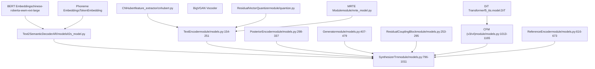
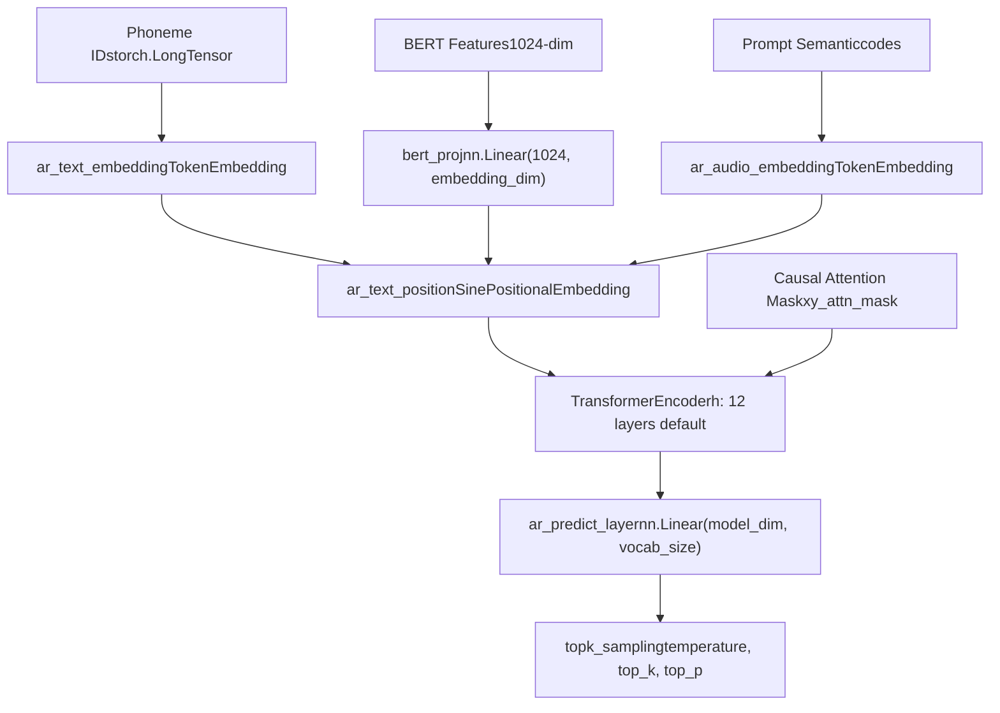
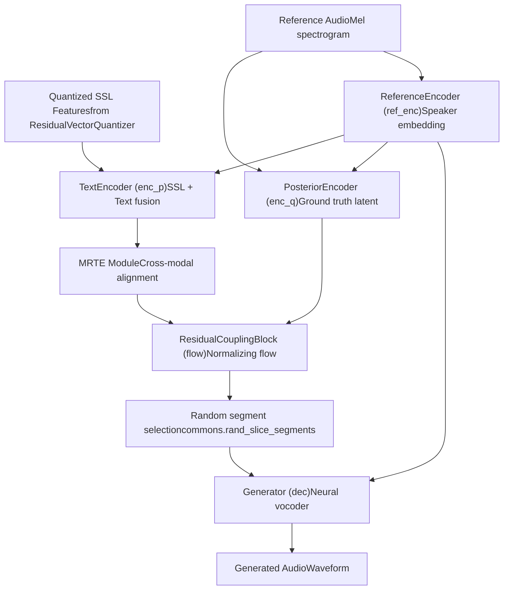
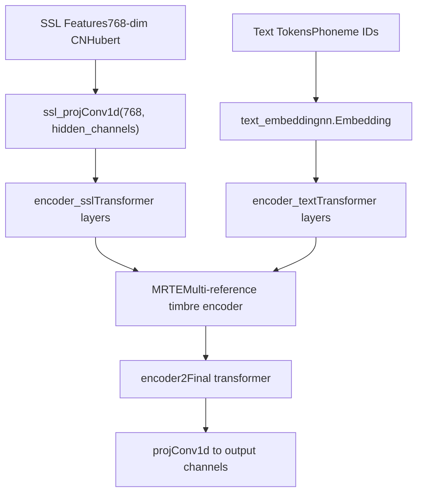
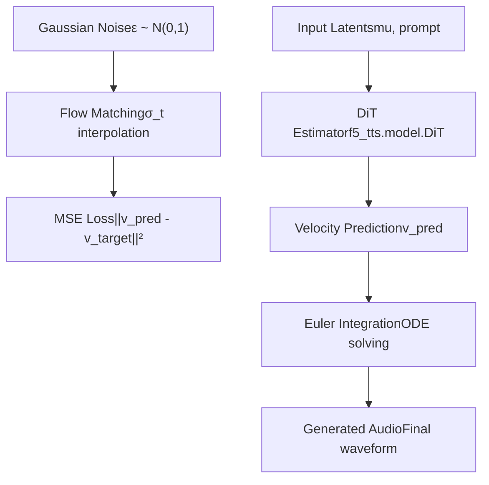
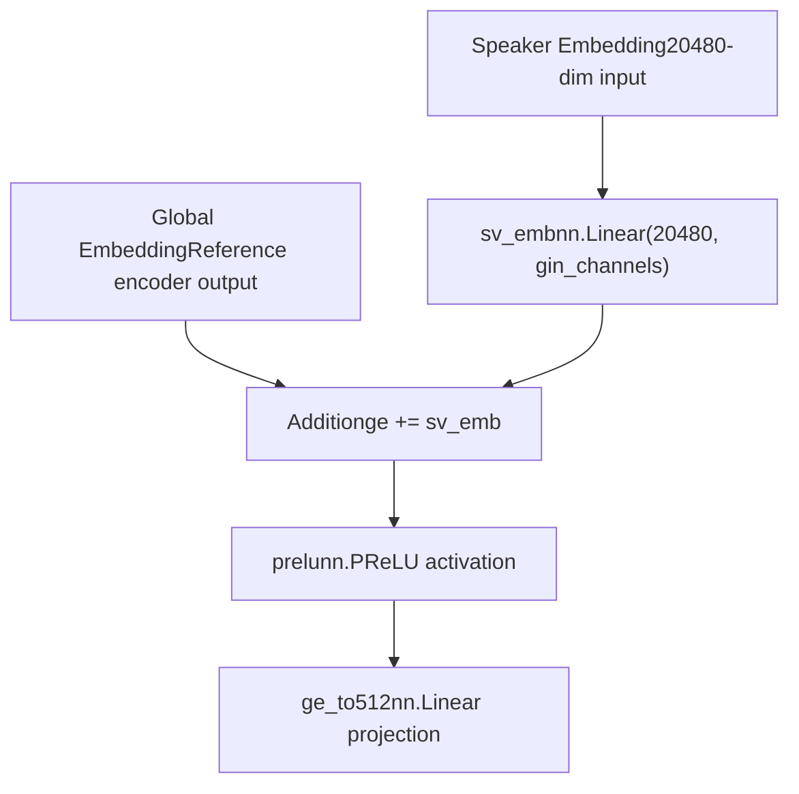
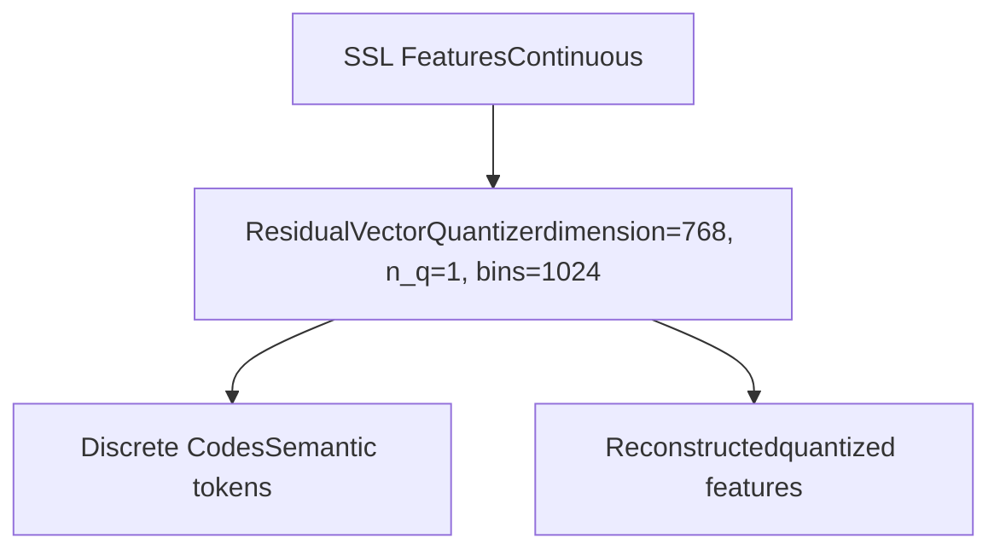
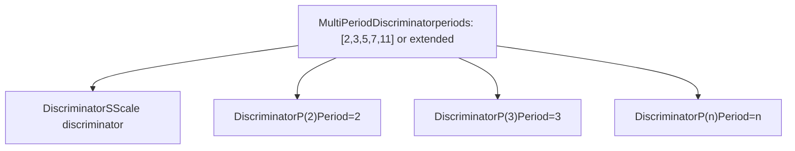

# Core Models (核心模型)

相关源文件

-   [.gitignore](https://github.com/RVC-Boss/GPT-SoVITS/blob/c767f0b8/.gitignore)
-   [GPT\_SoVITS/AR/models/t2s\_model.py](https://github.com/RVC-Boss/GPT-SoVITS/blob/c767f0b8/GPT_SoVITS/AR/models/t2s_model.py)
-   [GPT\_SoVITS/AR/models/utils.py](https://github.com/RVC-Boss/GPT-SoVITS/blob/c767f0b8/GPT_SoVITS/AR/models/utils.py)
-   [GPT\_SoVITS/TTS\_infer\_pack/TTS.py](https://github.com/RVC-Boss/GPT-SoVITS/blob/c767f0b8/GPT_SoVITS/TTS_infer_pack/TTS.py)
-   [GPT\_SoVITS/configs/tts\_infer.yaml](https://github.com/RVC-Boss/GPT-SoVITS/blob/c767f0b8/GPT_SoVITS/configs/tts_infer.yaml)
-   [GPT\_SoVITS/module/data\_utils.py](https://github.com/RVC-Boss/GPT-SoVITS/blob/c767f0b8/GPT_SoVITS/module/data_utils.py)
-   [GPT\_SoVITS/module/mel\_processing.py](https://github.com/RVC-Boss/GPT-SoVITS/blob/c767f0b8/GPT_SoVITS/module/mel_processing.py)
-   [GPT\_SoVITS/module/models.py](https://github.com/RVC-Boss/GPT-SoVITS/blob/c767f0b8/GPT_SoVITS/module/models.py)
-   [GPT\_SoVITS/onnx\_export.py](https://github.com/RVC-Boss/GPT-SoVITS/blob/c767f0b8/GPT_SoVITS/onnx_export.py)
-   [api\_v2.py](https://github.com/RVC-Boss/GPT-SoVITS/blob/c767f0b8/api_v2.py)

本页面记录了构成 GPT-SoVITS 基础的神经网络架构，包括 Text2Semantic (文本转语义) 模型 (GPT) 和 Synthesizer (合成器) 模型 (SoVITS)。有关完整训练流水线的信息，请参阅 [Training Pipeline (训练流水线)](/RVC-Boss/GPT-SoVITS/2.3-training-pipeline)。有关推理编排的详细信息，请参阅 [Inference Pipeline (推理流水线)](/RVC-Boss/GPT-SoVITS/2.4-inference-pipeline)。

## Architecture Overview (架构概览)

GPT-SoVITS 采用了两阶段神经架构，包括 Autoregressive (自回归) 文本转语义转换，随后是语义转音频合成。系统支持具有不同功能和架构改进的多个模型版本。

### Core Model Components (核心模型组件)

**来源：** [GPT\_SoVITS/module/models.py796-1011](https://github.com/RVC-Boss/GPT-SoVITS/blob/c767f0b8/GPT_SoVITS/module/models.py#L796-L1011) [GPT\_SoVITS/AR/models/t2s\_model.py260-582](https://github.com/RVC-Boss/GPT-SoVITS/blob/c767f0b8/GPT_SoVITS/AR/models/t2s_model.py#L260-L582)

## Text2Semantic Models (文本转语义模型)

Text2Semantic 组件使用 GPT 风格的自回归 Transformer (Transformer) 将音素序列和 BERT (BERT) 特征转换为语义 Token。

### Text2SemanticDecoder Architecture (Text2SemanticDecoder 架构)

**来源：** [GPT\_SoVITS/AR/models/t2s\_model.py260-582](https://github.com/RVC-Boss/GPT-SoVITS/blob/c767f0b8/GPT_SoVITS/AR/models/t2s_model.py#L260-L582) [GPT\_SoVITS/AR/models/t2s\_model.py408-511](https://github.com/RVC-Boss/GPT-SoVITS/blob/c767f0b8/GPT_SoVITS/AR/models/t2s_model.py#L408-L511)

### Model Configuration (模型配置)

| 参数 | 默认值 | 说明 |
| --- | --- | --- |
| `embedding_dim` | 512 | Token Embedding (嵌入) 维度 |
| `hidden_dim` | 512 | Transformer 隐层维度 |
| `num_head` | 8 | 注意力头数 |
| `num_layers` | 12 | Transformer 层数 |
| `vocab_size` | 1025 | 语义 Token 词汇表大小 |
| `phoneme_vocab_size` | 512 | 音素词汇表大小 |
| `EOS` | 1024 | 序列结束 Token |

**来源：** [GPT\_SoVITS/AR/models/t2s\_model.py24-34](https://github.com/RVC-Boss/GPT-SoVITS/blob/c767f0b8/GPT_SoVITS/AR/models/t2s_model.py#L24-L34)

## Synthesizer Models (合成器模型)

`SynthesizerTrn` 类实现了核心合成模型，该模型使用基于 VITS (VITS) 的架构及其各种增强功能将语义 Token 转换为音频。

### SynthesizerTrn Components (SynthesizerTrn 组件)

**来源：** [GPT\_SoVITS/module/models.py796-938](https://github.com/RVC-Boss/GPT-SoVITS/blob/c767f0b8/GPT_SoVITS/module/models.py#L796-L938) [GPT\_SoVITS/module/models.py940-1011](https://github.com/RVC-Boss/GPT-SoVITS/blob/c767f0b8/GPT_SoVITS/module/models.py#L940-L1011)

### TextEncoder Architecture (TextEncoder 架构)

`TextEncoder` 处理 SSL 特征和音素序列，并进行跨模态对齐：

**来源：** [GPT\_SoVITS/module/models.py154-251](https://github.com/RVC-Boss/GPT-SoVITS/blob/c767f0b8/GPT_SoVITS/module/models.py#L154-L251)

## Model Versions and Variants (模型版本与变体)

GPT-SoVITS 支持具有不同功能和架构改进的多个模型版本。

### Version Comparison (版本对比)

| 版本 | 架构 | 关键特性 |
| --- | --- | --- |
| v1 | 标准 VITS | 具有 322 个符号的基础合成 |
| v2 | 增强型 VITS | 改进后具有 347 个符号 |
| v2Pro/v2ProPlus | 声纹增强型 | 额外的 Speaker Verification (声纹验证) 嵌入 |
| v3 | CFM + DiT | 带有 DiT 的 Conditional Flow Matching (条件流匹配) |
| v4 | 高级 CFM | 增强的流匹配架构 |

**来源：** [GPT\_SoVITS/module/models.py590](https://github.com/RVC-Boss/GPT-SoVITS/blob/c767f0b8/GPT_SoVITS/module/models.py#L590-L590) [GPT\_SoVITS/module/models.py895-901](https://github.com/RVC-Boss/GPT-SoVITS/blob/c767f0b8/GPT_SoVITS/module/models.py#L895-L901)

### Conditional Flow Matching (v3/v4) (条件流匹配 (v3/v4))

**来源：** [GPT\_SoVITS/module/models.py1013-1165](https://github.com/RVC-Boss/GPT-SoVITS/blob/c767f0b8/GPT_SoVITS/module/models.py#L1013-L1165)

### v2Pro Speaker Enhancement (v2Pro 声纹增强)

v2Pro 变体包含额外的声纹验证嵌入：

**来源：** [GPT\_SoVITS/module/models.py895-911](https://github.com/RVC-Boss/GPT-SoVITS/blob/c767f0b8/GPT_SoVITS/module/models.py#L895-L911)

## Supporting Components (支持组件)

### Vector Quantization (矢量量化)

系统使用 Residual Vector Quantization (残差矢量量化) 进行 SSL 特征离散化：

**来源：** [GPT\_SoVITS/module/models.py892-1011](https://github.com/RVC-Boss/GPT-SoVITS/blob/c767f0b8/GPT_SoVITS/module/models.py#L892-L1011)

### Multi-Scale Discriminator (多尺度判别器)

训练使用 Multi-period Discriminator (多周期判别器) 进行 Adversarial Learning (对抗学习)：

**来源：** [GPT\_SoVITS/module/models.py590-613](https://github.com/RVC-Boss/GPT-SoVITS/blob/c767f0b8/GPT_SoVITS/module/models.py#L590-L613) [GPT\_SoVITS/module/models.py481-587](https://github.com/RVC-Boss/GPT-SoVITS/blob/c767f0b8/GPT_SoVITS/module/models.py#L481-L587)
