# Text Processing Pipeline (文本处理流水线)

相关源文件

-   [.gitignore](https://github.com/RVC-Boss/GPT-SoVITS/blob/c767f0b8/.gitignore)
-   [GPT\_SoVITS/AR/models/t2s\_model.py](https://github.com/RVC-Boss/GPT-SoVITS/blob/c767f0b8/GPT_SoVITS/AR/models/t2s_model.py)
-   [GPT\_SoVITS/AR/models/utils.py](https://github.com/RVC-Boss/GPT-SoVITS/blob/c767f0b8/GPT_SoVITS/AR/models/utils.py)
-   [GPT\_SoVITS/TTS\_infer\_pack/TTS.py](https://github.com/RVC-Boss/GPT-SoVITS/blob/c767f0b8/GPT_SoVITS/TTS_infer_pack/TTS.py)
-   [GPT\_SoVITS/TTS\_infer\_pack/TextPreprocessor.py](https://github.com/RVC-Boss/GPT-SoVITS/blob/c767f0b8/GPT_SoVITS/TTS_infer_pack/TextPreprocessor.py)
-   [GPT\_SoVITS/configs/tts\_infer.yaml](https://github.com/RVC-Boss/GPT-SoVITS/blob/c767f0b8/GPT_SoVITS/configs/tts_infer.yaml)
-   [GPT\_SoVITS/text/chinese.py](https://github.com/RVC-Boss/GPT-SoVITS/blob/c767f0b8/GPT_SoVITS/text/chinese.py)
-   [GPT\_SoVITS/text/chinese2.py](https://github.com/RVC-Boss/GPT-SoVITS/blob/c767f0b8/GPT_SoVITS/text/chinese2.py)
-   [GPT\_SoVITS/text/zh\_normalization/num.py](https://github.com/RVC-Boss/GPT-SoVITS/blob/c767f0b8/GPT_SoVITS/text/zh_normalization/num.py)
-   [GPT\_SoVITS/text/zh\_normalization/text\_normlization.py](https://github.com/RVC-Boss/GPT-SoVITS/blob/c767f0b8/GPT_SoVITS/text/zh_normalization/text_normlization.py)
-   [api\_v2.py](https://github.com/RVC-Boss/GPT-SoVITS/blob/c767f0b8/api_v2.py)

本文档涵盖了 GPT-SoVITS 中的多语言文本处理流水线，该流水线将原始文本输入转换为适用于 TTS 合成的 Phonetic Representations (语音表示)。该流水线处理中文、日文、韩文、英文和粤语的语言检测、Text Normalization (文本归一化) 和 Grapheme-to-Phoneme (字素转音素) (G2P) 转换。

有关整体 TTS 推理过程的信息，请参阅 [Inference Pipeline (推理流水线)](/RVC-Boss/GPT-SoVITS/2.4-inference-pipeline)。有关训练数据准备工作流程，请参阅 [Data Preparation (数据准备)](/RVC-Boss/GPT-SoVITS/5-data-preparation)。

## Overview (概览)

文本处理流水线将原始多语言文本转换为 TTS 模型使用的音素序列和 BERT (BERT) 特征。主要的编排器是 [GPT\_SoVITS/TTS\_infer\_pack/TextPreprocessor.py](https://github.com/RVC-Boss/GPT-SoVITS/blob/c767f0b8/GPT_SoVITS/TTS_infer_pack/TextPreprocessor.py) 中的 `TextPreprocessor` 类，它协调语言检测、归一化、G2P 转换和 BERT 特征提取。

该流水线包含五个关键阶段：

1.  **Text Segmentation (文本分段)** - `pre_seg_text()` 根据标点符号和长度限制切分输入
2.  **Language Detection (语言检测)** - `LangSegmenter.getTexts()` 识别语言片段
3.  **Text Normalization (文本归一化)** - 特定语言的 `text_normalize()` 函数转换数字、日期、符号
4.  **G2P Conversion (G2P 转换)** - 特定语言的 `g2p()` 生成带有 Tone Markers (声调标记) 的音素序列
5.  **BERT Feature Extraction (BERT 特征提取)** - `get_bert_feature()` 为中文文本生成 Contextual Embeddings (上下文嵌入)

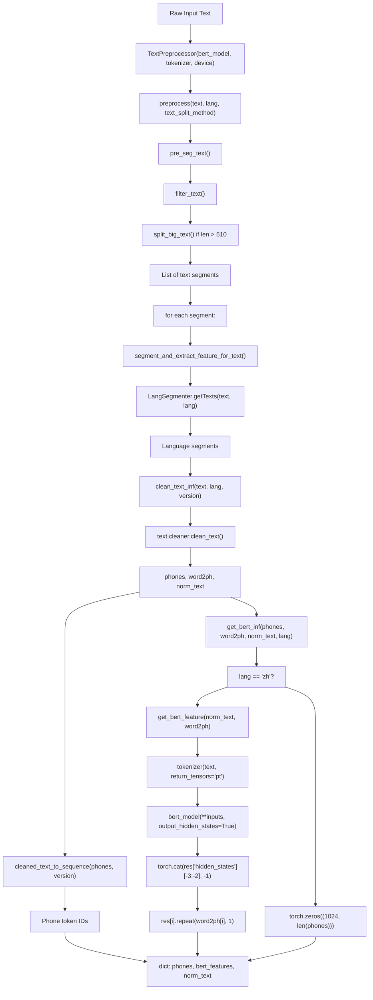
**带有代码函数名的 TextPreprocessor 流水线**

来源： [GPT\_SoVITS/TTS\_infer\_pack/TextPreprocessor.py52-75](https://github.com/RVC-Boss/GPT-SoVITS/blob/c767f0b8/GPT_SoVITS/TTS_infer_pack/TextPreprocessor.py#L52-L75) [GPT\_SoVITS/TTS\_infer\_pack/TextPreprocessor.py117-189](https://github.com/RVC-Boss/GPT-SoVITS/blob/c767f0b8/GPT_SoVITS/TTS_infer_pack/TextPreprocessor.py#L117-L189) [GPT\_SoVITS/TTS\_infer\_pack/TextPreprocessor.py191-222](https://github.com/RVC-Boss/GPT-SoVITS/blob/c767f0b8/GPT_SoVITS/TTS_infer_pack/TextPreprocessor.py#L191-L222)

## Language Detection and Segmentation (语言检测与分段)

`LangSegmenter` 类使用 `fast_langdetect` 库和自定义启发式方法，自动检测混合语言文本并将其切分为单一语言块。

### LangSegmenter Architecture (LangSegmenter 架构)

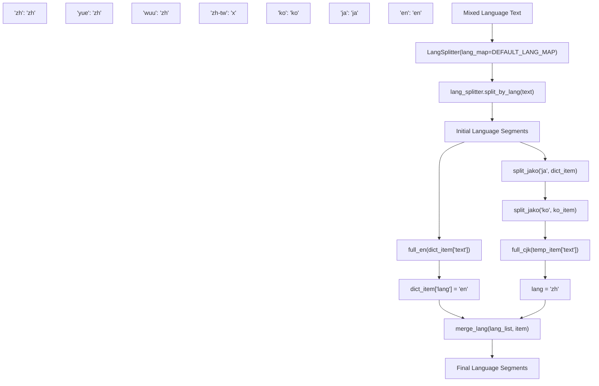
**语言检测与分段实现细节**

分段过程通过特定的实用函数处理几种边缘情况：

| 函数 | 用途 | 实现细节 |
| --- | --- | --- |
| `full_en()` | 检测纯英文文本 | `r'^(?=.*[A-Za-z])[A-Za-z0-9\s\u0020-\u007E\u2000-\u206F\u3000-\u303F\uFF00-\uFFEF]+$'` |
| `full_cjk()` | 提取 CJK 字符 | Unicode 范围: `0x4E00-0x9FFF`, `0x3400-0x4DB5` 等 |
| `split_jako()` | 分离日文/韩文 | 模式: 针对日文为 `r"([\u3041-\u3096\u3099...]+...)"` |
| `merge_lang()` | 合并相邻片段 | 检查 `lang_list[-1]['lang'] == item['lang']` |

### LangSegmenter Class Structure (LangSegmenter 类结构)

**LangSegmenter 类及其依赖结构**

来源： [GPT\_SoVITS/text/LangSegmenter/langsegmenter.py17-46](https://github.com/RVC-Boss/GPT-SoVITS/blob/c767f0b8/GPT_SoVITS/text/LangSegmenter/langsegmenter.py#L17-L46) [GPT\_SoVITS/text/LangSegmenter/langsegmenter.py77-213](https://github.com/RVC-Boss/GPT-SoVITS/blob/c767f0b8/GPT_SoVITS/text/LangSegmenter/langsegmenter.py#L77-L213)

分段过程处理几种边缘情况：

| 函数 | 用途 | 实现 |
| --- | --- | --- |
| `full_en()` | 检测纯英文文本 | 正则表达式模式匹配 ASCII + 标点 |
| `full_cjk()` | 提取 CJK 字符 | 针对中日韩的 Unicode 范围检测 |
| `split_jako()` | 分离日文/韩文 | 特定语言的字符模式匹配 |
| `merge_lang()` | 合并相邻片段 | 合并具有相同语言标签的片段 |

来源： [GPT\_SoVITS/text/LangSegmenter/langsegmenter.py17-75](https://github.com/RVC-Boss/GPT-SoVITS/blob/c767f0b8/GPT_SoVITS/text/LangSegmenter/langsegmenter.py#L17-L75) [GPT\_SoVITS/text/LangSegmenter/langsegmenter.py91-167](https://github.com/RVC-Boss/GPT-SoVITS/blob/c767f0b8/GPT_SoVITS/text/LangSegmenter/langsegmenter.py#L91-L167)

## Text Normalization (文本归一化)

文本归一化由 cleaner 模块中的 `clean_text()` 函数处理，该函数应用特定语言的预处理并处理特殊符号。

### Chinese Text Normalization (zh\_normalization) (中文文本归一化)

中文文本归一化使用 `TextNormalizer` 类将数字、日期和符号转换为可读文本：

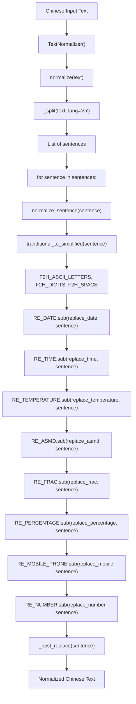
**zh\_normalization 中的中文文本归一化流水线**

处理的关键归一化模式：

-   **日期**: `2023年12月25日` → `二零二三年十二月二十五日`
-   **数字**: `3.14` → `三点一四`, `42` → `四十二`
-   **分数**: `1/2` → `二分之一`
-   **百分比**: `85%` → `百分之八十五`
-   **电话号码**: `13812345678` → `一三八 一二三四 五六七八` (分段)
-   **数学**: `2+3=5` → `二加三等于五`

来源： [GPT\_SoVITS/text/zh\_normalization/text\_normlization.py61-176](https://github.com/RVC-Boss/GPT-SoVITS/blob/c767f0b8/GPT_SoVITS/text/zh_normalization/text_normlization.py#L61-L176) [GPT\_SoVITS/text/zh\_normalization/num.py317-340](https://github.com/RVC-Boss/GPT-SoVITS/blob/c767f0b8/GPT_SoVITS/text/zh_normalization/num.py#L317-L340)

### Chinese G2P Processing (chinese2.py) (中文 G2P 处理)

中文 v2 模块使用 G2PW 进行 Polyphone Disambiguation (多音字消歧) 和 Tone Sandhi (变调) 处理：

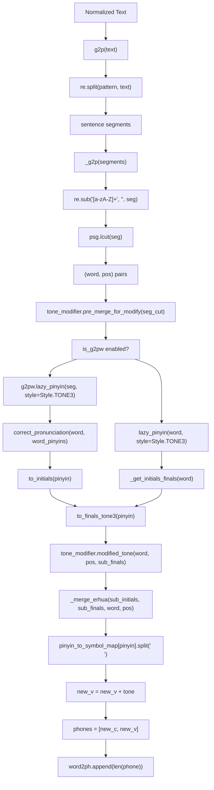
**带有声调处理的中文 G2P 流水线**

关键组件：

-   **G2PW 模型**: 基于 BERT 的多音字消歧，位于 [GPT\_SoVITS/text/G2PWModel](https://github.com/RVC-Boss/GPT-SoVITS/blob/c767f0b8/GPT_SoVITS/text/G2PWModel)
-   **Tone Sandhi (变调)**: `ToneSandhi` 类应用变调规则（例如，不 + 第 4 声 → 第 2 声）
-   **Erhua (儿化) 处理**: `_merge_erhua()` 合并“儿”后缀: `花儿` → `h ua r1`
-   **符号映射**: `pinyin_to_symbol_map` 来自 [GPT\_SoVITS/text/opencpop-strict.txt](https://github.com/RVC-Boss/GPT-SoVITS/blob/c767f0b8/GPT_SoVITS/text/opencpop-strict.txt)

来源： [GPT\_SoVITS/text/chinese2.py73-295](https://github.com/RVC-Boss/GPT-SoVITS/blob/c767f0b8/GPT_SoVITS/text/chinese2.py#L73-L295) [GPT\_SoVITS/text/chinese2.py142-178](https://github.com/RVC-Boss/GPT-SoVITS/blob/c767f0b8/GPT_SoVITS/text/chinese2.py#L142-L178) [GPT\_SoVITS/text/g2pw/\_\_init\_\_.py85-120](https://github.com/RVC-Boss/GPT-SoVITS/blob/c767f0b8/GPT_SoVITS/text/g2pw/__init__.py#L85-L120)

### Text Segmentation and Preprocessing (文本分段与预处理)

在进行特定语言的处理之前，`TextPreprocessor.pre_seg_text()` 执行关键的文本准备工作：

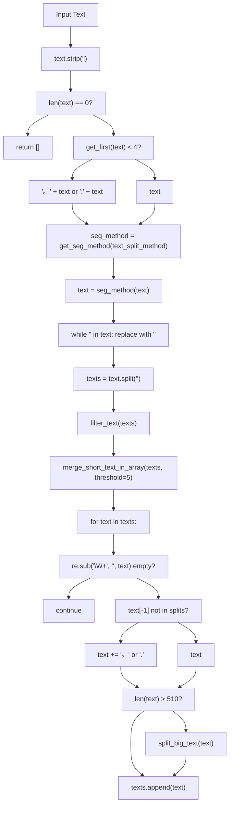
**TextPreprocessor 中的文本分段与验证过程**

关键分段参数：

-   **阈值**: 每个片段最小长度为 5 个字符（防止过度碎片化）
-   **最大长度**: 510 个字符（BERT 输入限制减去特殊 Token）
-   **标点符号处理**: 确保所有片段以标点符号结尾，以获得正确的 Prosody (韵律)

来源： [GPT\_SoVITS/TTS\_infer\_pack/TextPreprocessor.py77-115](https://github.com/RVC-Boss/GPT-SoVITS/blob/c767f0b8/GPT_SoVITS/TTS_infer_pack/TextPreprocessor.py#L77-L115) [GPT\_SoVITS/TTS\_infer\_pack/text\_segmentation\_method.py90-107](https://github.com/RVC-Boss/GPT-SoVITS/blob/c767f0b8/GPT_SoVITS/TTS_infer_pack/text_segmentation_method.py#L90-L107)

### Language Module Mapping and Clean Text Flow (语言模块映射与清洗文本流)

[GPT\_SoVITS/text/cleaner.py](https://github.com/RVC-Boss/GPT-SoVITS/blob/c767f0b8/GPT_SoVITS/text/cleaner.py) 中的 `clean_text()` 函数动态导入语言模块：

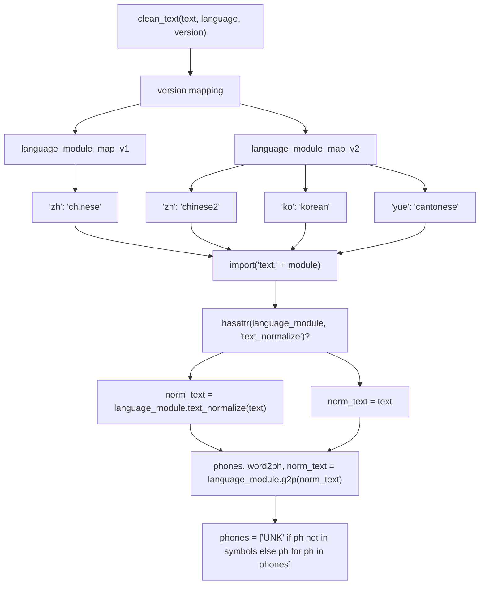
**clean\_text() 语言模块解析**

| 语言 | v1 模块 | v2 模块 | text\_normalize | 特殊功能 |
| --- | --- | --- | --- | --- |
| 中文 (zh) | `chinese` | `chinese2` | ✓ | G2PW 多音字、变调、儿化 |
| 日文 (ja) | `japanese` | `japanese` | ✓ | OpenJTalk、用户词典 |
| 英文 (en) | `english` | `english` | ✗ | CMU 词典、ARPA 音素 |
| 韩文 (ko) | 不适用 | `korean` | ✓ | G2pK、谚文分解 |
| 粤语 (yue) | 不适用 | `cantonese` | ✓ | 粤拼、Y-prefix 系统 |

来源： [GPT\_SoVITS/text/cleaner.py21-55](https://github.com/RVC-Boss/GPT-SoVITS/blob/c767f0b8/GPT_SoVITS/text/cleaner.py#L21-L55) [GPT\_SoVITS/text/cleaner.py58-82](https://github.com/RVC-Boss/GPT-SoVITS/blob/c767f0b8/GPT_SoVITS/text/cleaner.py#L58-L82)

## Language-Specific G2P Processing (特定语言的 G2P 处理)

每个语言模块都实现了具有语言特定功能的专门 G2P 转换。

### Japanese Processing (japanese.py) (日文处理)

日文处理使用 OpenJTalk 进行 Morphological Analysis (词法分析) 和韵律特征提取。该模块处理用户词典加载和 Windows 路径兼容性。

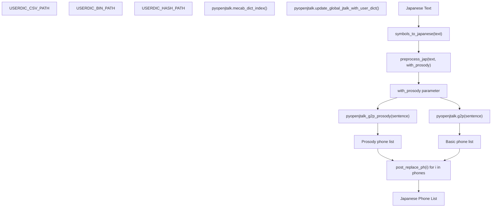
**带有 OpenJTalk 函数的日文 G2P 处理**

### Japanese User Dictionary System (日文用户词典系统)

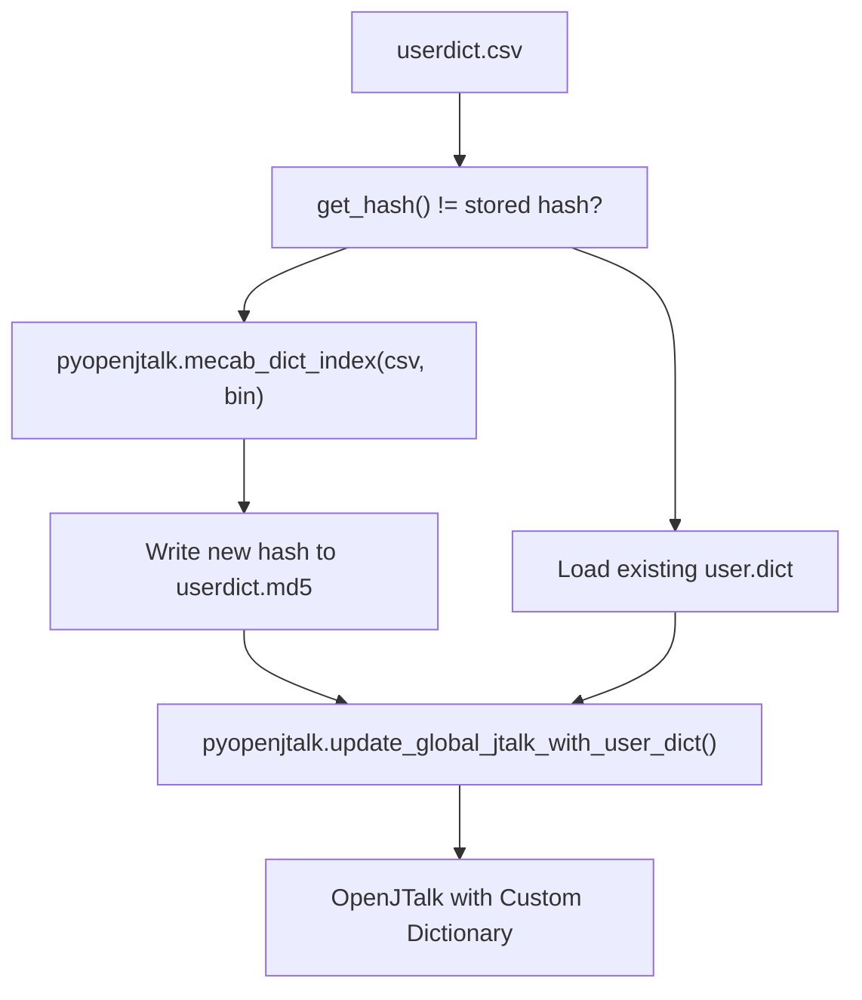
**日文用户词典加载过程**

关键实现细节：

-   **User Dictionary (用户词典)**: 自动从 `ja_userdic/userdict.csv` 加载，并进行 MD5 哈希验证
-   **Windows 兼容性**: 使用 TEMP 目录对非 ASCII 路径进行特殊处理
-   **韵律分析**: `pyopenjtalk_g2p_prosody()` 使用 `[`, `]`, `#` 符号提取 Pitch Accent (音高重音) 模式
-   **符号替换**: `post_replace_ph()` 归一化标点符号和特殊字符

来源： [GPT\_SoVITS/text/japanese.py50-77](https://github.com/RVC-Boss/GPT-SoVITS/blob/c767f0b8/GPT_SoVITS/text/japanese.py#L50-L77) [GPT\_SoVITS/text/japanese.py151-171](https://github.com/RVC-Boss/GPT-SoVITS/blob/c767f0b8/GPT_SoVITS/text/japanese.py#L151-L171) [GPT\_SoVITS/text/japanese.py267-271](https://github.com/RVC-Boss/GPT-SoVITS/blob/c767f0b8/GPT_SoVITS/text/japanese.py#L267-L271)

### Korean Processing (korean.py) (韩文处理)

韩文处理使用 G2pK 库处理谚文 Phonetic Transformations (音变) 和数字归一化，并包含 Windows 兼容性修复。

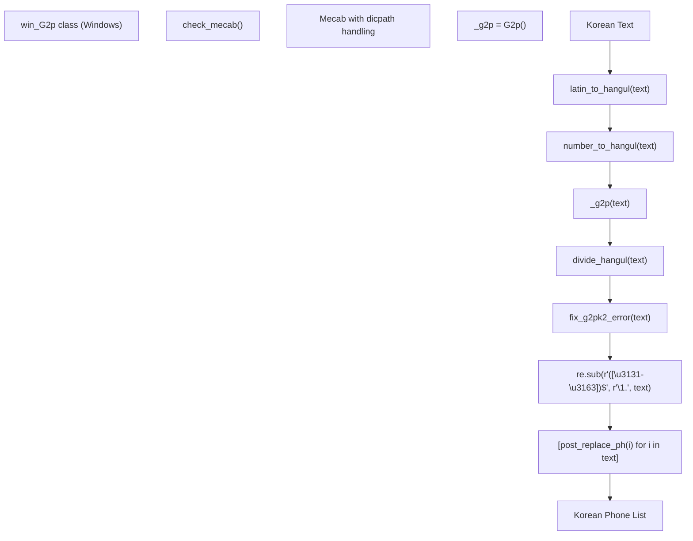
**带有 G2pK 函数的韩文 G2P 处理**

### Korean Number Processing (韩文数字处理)

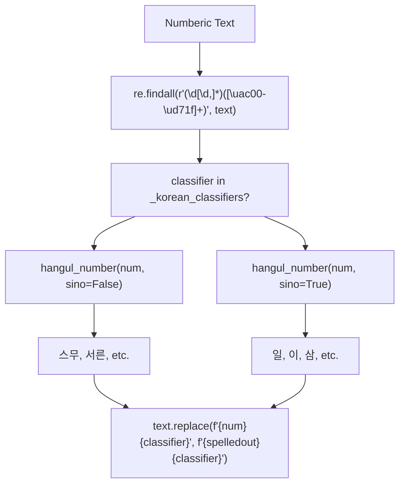
**韩文数字转谚文转换逻辑**

关键实现细节：

-   **G2pK 集成**: 使用 `G2p()` 类，并针对 eunjeon MeCab 进行了自定义 Windows 路径处理
-   **谚文分解**: 使用 jamo 库中的 `j2hcj(h2j(text))` 进行字符分解
-   **数字系统**: 区分纯韩文 (한국어) 和汉字语 (한자어) 数字
-   **错误纠正**: `fix_g2pk2_error()` 处理 G2pK 输出中带有 ㅇㅡㄹ/ㄹㅡㄹ 模式的特定问题
-   **IPA 转换**: 将复杂的 IPA 符号映射到简化的表示

来源： [GPT\_SoVITS/text/korean.py324-332](https://github.com/RVC-Boss/GPT-SoVITS/blob/c767f0b8/GPT_SoVITS/text/korean.py#L324-L332) [GPT\_SoVITS/text/korean.py183-277](https://github.com/RVC-Boss/GPT-SoVITS/blob/c767f0b8/GPT_SoVITS/text/korean.py#L183-L277) [GPT\_SoVITS/text/korean.py155-167](https://github.com/RVC-Boss/GPT-SoVITS/blob/c767f0b8/GPT_SoVITS/text/korean.py#L155-L167)

### Cantonese Processing (cantonese.py) (粤语处理)

粤语处理使用 ToJyutping 库进行 Jyutping (粤拼) Romanization (罗马化)，并应用 Y-prefix (Y 前缀) 以区别于普通话音素。

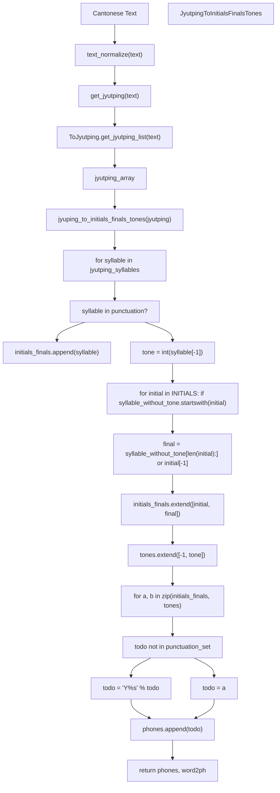
**带有粤拼函数的粤语 G2P 处理**

### Cantonese INITIALS Constants (粤语声母常量)

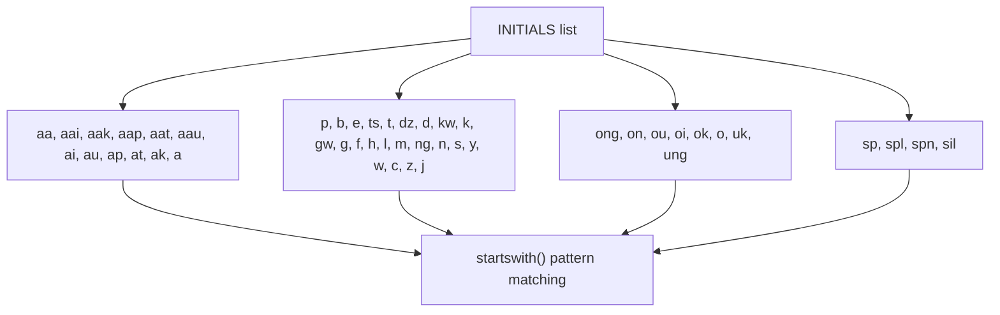
**粤语声母模式匹配系统**

关键实现细节：

-   **粤拼解析**: `ToJyutping.get_jyutping_list()` 返回带有声调数字的 (word, syllable) 元组
-   **声母-韵母切分**: 针对包含特殊情况在内的 56 个预定义声母进行模式匹配
-   **声调处理**: 六声调系统 (1-6)，辅音为 -1，标点为 0
-   **Y-Prefix 系统**: 所有非标点音素均添加 "Y" 前缀以区别于普通话
-   **文本归一化**: 使用来自 zh\_normalization 模块的 `TextNormalizer`

来源： [GPT\_SoVITS/text/cantonese.py203-212](https://github.com/RVC-Boss/GPT-SoVITS/blob/c767f0b8/GPT_SoVITS/text/cantonese.py#L203-L212) [GPT\_SoVITS/text/cantonese.py118-173](https://github.com/RVC-Boss/GPT-SoVITS/blob/c767f0b8/GPT_SoVITS/text/cantonese.py#L118-L173) [GPT\_SoVITS/text/cantonese.py12-57](https://github.com/RVC-Boss/GPT-SoVITS/blob/c767f0b8/GPT_SoVITS/text/cantonese.py#L12-L57)

### BERT Feature Extraction for Chinese (中文 BERT 特征提取)

中文文本接收上下文 BERT 嵌入，以改进 Prosody (韵律) 和发音：

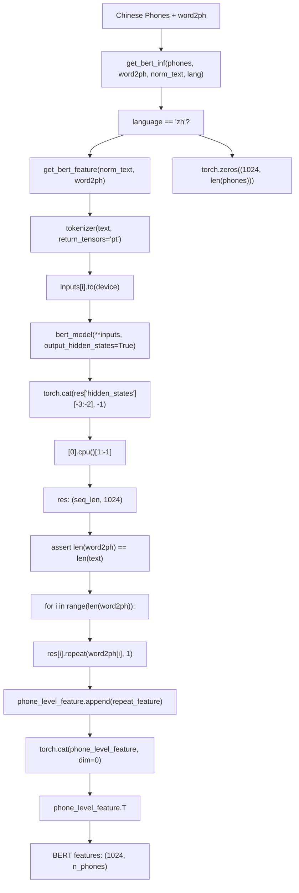
**TextPreprocessor 中的 BERT 特征提取过程**

实现细节：

-   **模型**: 来自 HuggingFace 的 `chinese-roberta-wwm-ext-large`
-   **层选择**: 拼接来自第 -3 层和第 -2 层的隐藏状态（总共 1024 维）
-   **音素级对齐**: 每个字符的 BERT 向量被重复 `word2ph[i]` 次
-   **非中文处理**: 对于不支持 BERT 的语言使用全零张量

来源： [GPT\_SoVITS/TTS\_infer\_pack/TextPreprocessor.py191-222](https://github.com/RVC-Boss/GPT-SoVITS/blob/c767f0b8/GPT_SoVITS/TTS_infer_pack/TextPreprocessor.py#L191-L222) [GPT\_SoVITS/TTS\_infer\_pack/TTS.py484-491](https://github.com/RVC-Boss/GPT-SoVITS/blob/c767f0b8/GPT_SoVITS/TTS_infer_pack/TTS.py#L484-L491)

## Symbol System and Token Conversion (符号系统与 Token 转换)

流水线使用版本化的符号系统将语音表示转换为 Token 序列。

### Symbol System Architecture (符号系统架构)

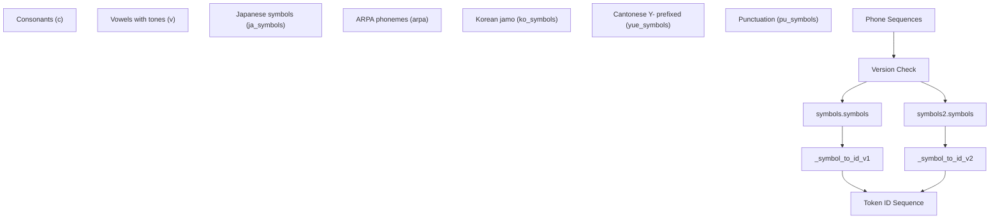
**符号系统与 Token 转换**

### Symbol Set Comparison (符号集对比)

| 符号类型 | v1 支持 | v2 支持 | 数量 (v2) |
| --- | --- | --- | --- |
| 中文声母 | ✓ | ✓ | 25 |
| 中文韵母 | ✓ | ✓ | 195 (5 声调 × 39 韵母) |
| 日文音素 | ✓ | ✓ | 39 |
| 英文 ARPA | ✓ | ✓ | 71 |
| 韩文谚文 | ✗ | ✓ | 28 |
| 粤语粤拼 | ✗ | ✓ | 379 |
| 标点符号 | ✓ | ✓ | 10 |

来源： [GPT\_SoVITS/text/\_\_init\_\_.py14-28](https://github.com/RVC-Boss/GPT-SoVITS/blob/c767f0b8/GPT_SoVITS/text/__init__.py#L14-L28) [GPT\_SoVITS/text/symbols2.py782-788](https://github.com/RVC-Boss/GPT-SoVITS/blob/c767f0b8/GPT_SoVITS/text/symbols2.py#L782-L788) [GPT\_SoVITS/text/symbols.py396-397](https://github.com/RVC-Boss/GPT-SoVITS/blob/c767f0b8/GPT_SoVITS/text/symbols.py#L396-L397)

## Error Handling and Edge Cases (错误处理与边缘情况)

文本处理流水线包含通过特定验证和兜底机制处理常见问题的稳健错误处理。

### Common Processing Issues and Solutions (常见处理问题与解决方案)

| 问题 | 检测方法 | 解决函数 | 实现 |
| --- | --- | --- | --- |
| 未知音素 | 符号验证 | `clean_text()` 第 54 行 | `phones = ["UNK" if ph not in symbols else ph for ph in phones]` |
| 过短的英文序列 | 长度检查 | `clean_text()` 第 48-49 行 | `if len(phones) < 4: phones = [","] + phones` |
| 混合编码 | 字符过滤 | 特定语言 | `re.sub(r"[^\u4e00-\u9fa5" + "".join(punctuation) + r"]+", "", text)` |
| 标点堆叠 | 正则替换 | `replace_consecutive_punctuation()` | `re.sub(pattern, r"\1", text)` |
| 特殊符号 | 模式匹配 | `clean_special()` | 使用 `target_symbol` 替换 `special_s` |

### Word-to-Phone Alignment Implementation (字到音素对齐实现)

`word2ph` 输出提供了对 TTS 合成至关重要的 Character-to-phone alignment (字符到音素对齐)，每个语言模块的实现方式不同：

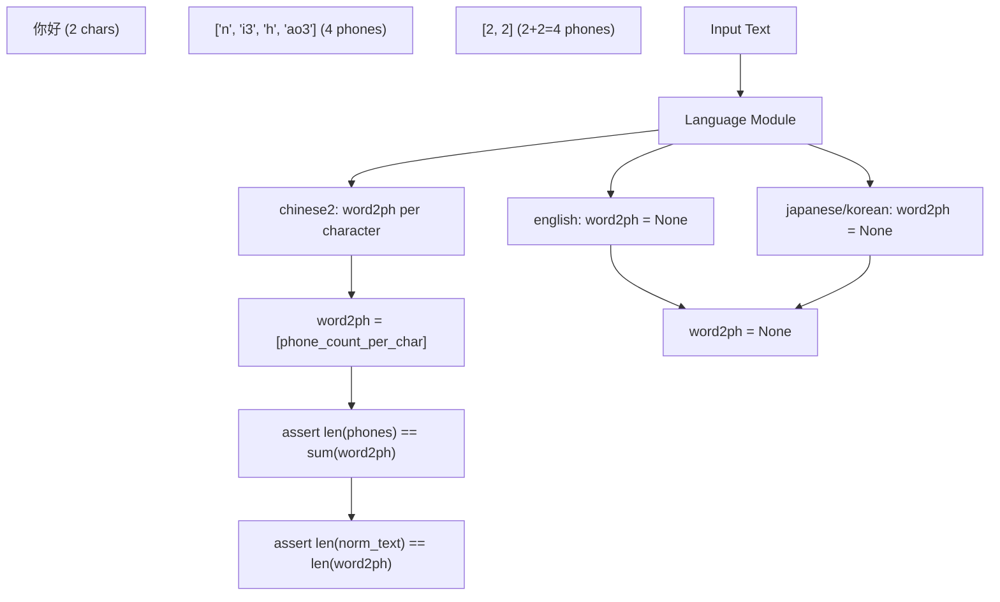
**特定语言的字到音素对齐**

### Error Handling in Language Modules (语言模块中的错误处理)

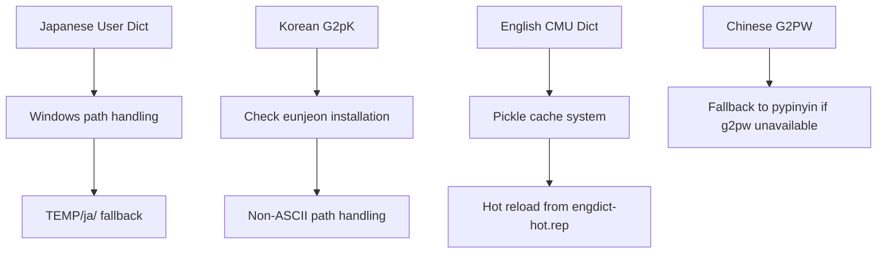
**特定语言的错误处理机制**

关键错误处理实现：

-   **日文**: Windows 路径兼容性，针对非 ASCII 路径自动回退到 TEMP 目录
-   **韩文**: `eunjeon` 依赖检查和 MeCab 词典路径处理
-   **英文**: 具有针对自定义发音的 Hot-reload (热加载) 功能的词典缓存系统
-   **中文**: 当高级模型不可用时，从 G2PW 平滑回退到 pypinyin

来源： [GPT\_SoVITS/text/cleaner.py42-55](https://github.com/RVC-Boss/GPT-SoVITS/blob/c767f0b8/GPT_SoVITS/text/cleaner.py#L42-L55) [GPT\_SoVITS/text/japanese.py11-77](https://github.com/RVC-Boss/GPT-SoVITS/blob/c767f0b8/GPT_SoVITS/text/japanese.py#L11-L77) [GPT\_SoVITS/text/korean.py12-56](https://github.com/RVC-Boss/GPT-SoVITS/blob/c767f0b8/GPT_SoVITS/text/korean.py#L12-L56) [GPT\_SoVITS/text/english.py210-220](https://github.com/RVC-Boss/GPT-SoVITS/blob/c767f0b8/GPT_SoVITS/text/english.py#L210-L220)

## Integration Points (集成点)

文本处理流水线与系统的其他组件集成：

-   **TTS 推理**: 为 GPT 模型提供 Token 化输入序列
-   **训练流水线**: 为数据集准备生成音素序列
-   **API 端点**: 处理 REST API 请求的文本预处理
-   **WebUI**: 驱动用户界面中的实时文本处理

有关处理后的文本如何流入模型推理的详细信息，请参阅 [Inference Pipeline (推理流水线)](/RVC-Boss/GPT-SoVITS/2.4-inference-pipeline)。有关使用此流水线进行训练数据准备的信息，请参阅 [Feature Extraction (特征提取)](/RVC-Boss/GPT-SoVITS/5.3-feature-extraction-scripts)。
