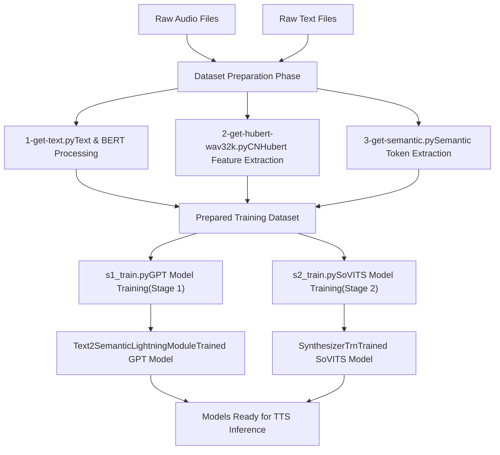
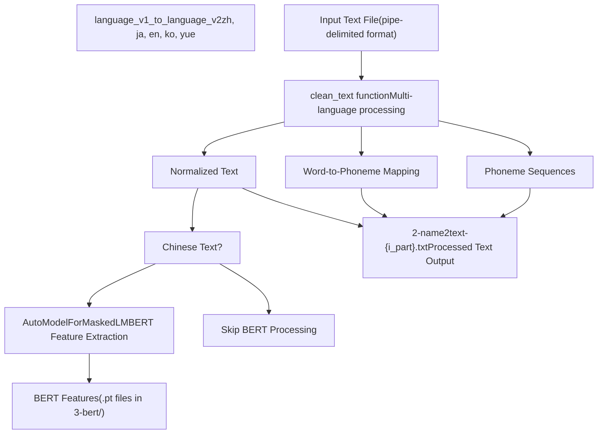
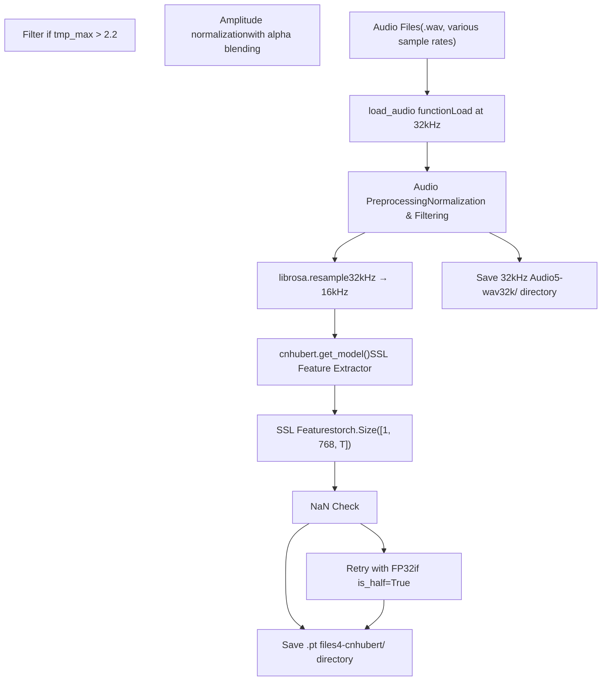
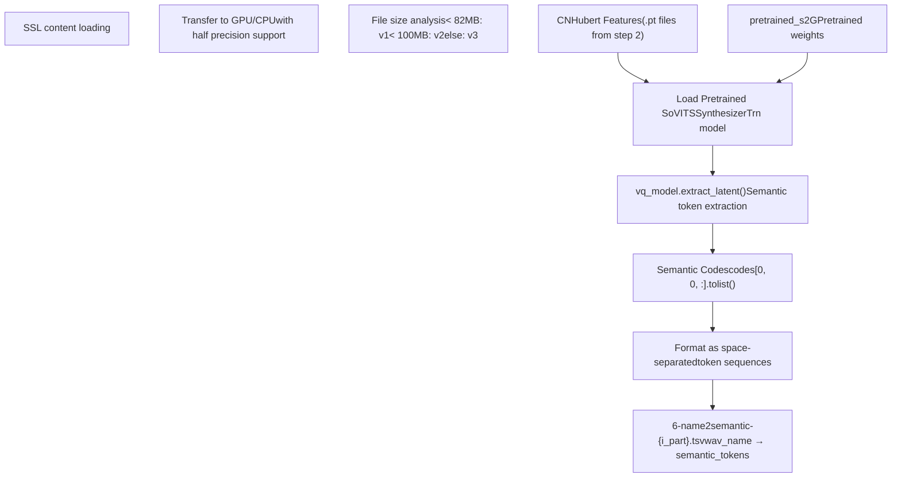
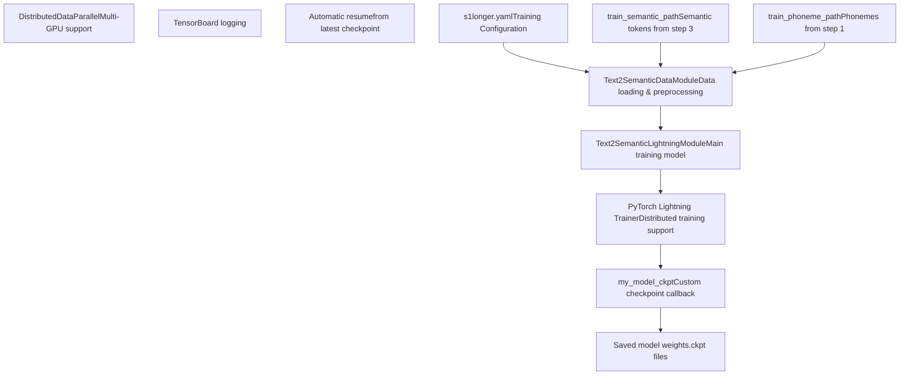
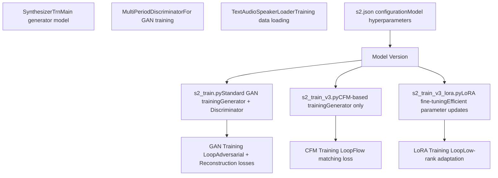
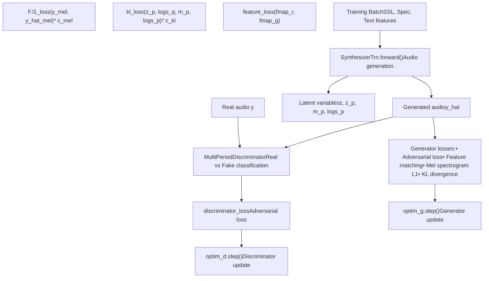
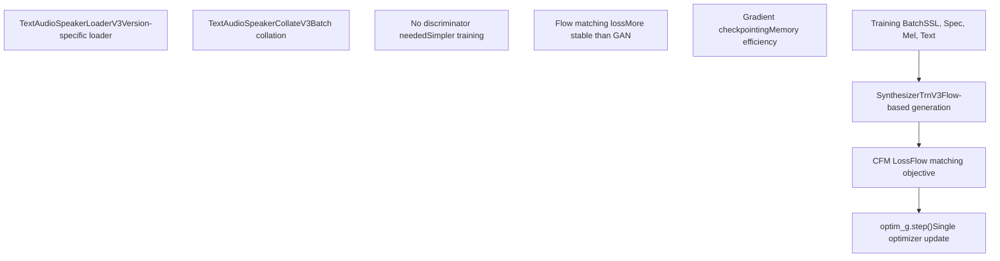
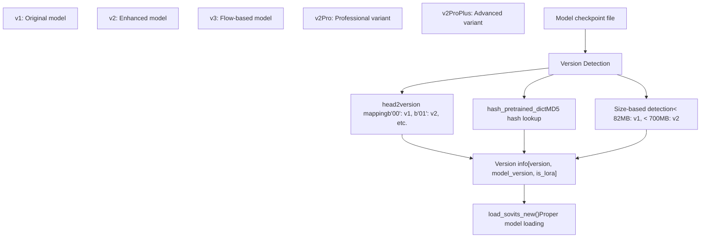
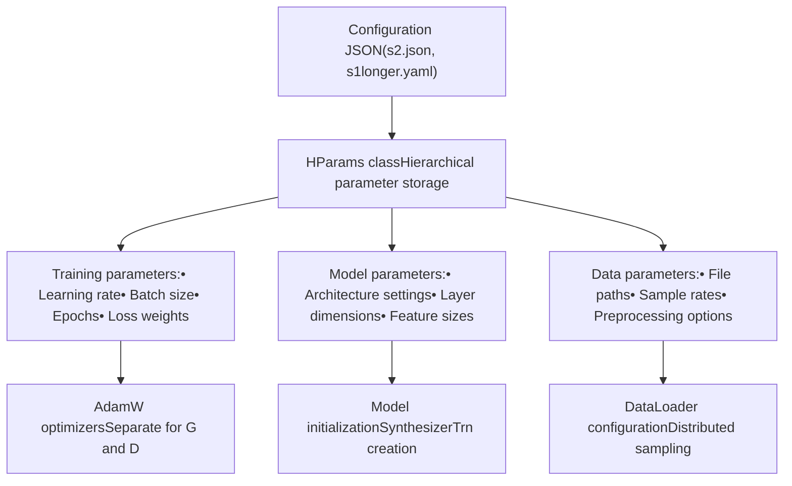

# Training Pipeline (训练流水线)

相关源文件

-   [GPT\_SoVITS/prepare\_datasets/1-get-text.py](https://github.com/RVC-Boss/GPT-SoVITS/blob/c767f0b8/GPT_SoVITS/prepare_datasets/1-get-text.py)
-   [GPT\_SoVITS/prepare\_datasets/2-get-hubert-wav32k.py](https://github.com/RVC-Boss/GPT-SoVITS/blob/c767f0b8/GPT_SoVITS/prepare_datasets/2-get-hubert-wav32k.py)
-   [GPT\_SoVITS/prepare\_datasets/3-get-semantic.py](https://github.com/RVC-Boss/GPT-SoVITS/blob/c767f0b8/GPT_SoVITS/prepare_datasets/3-get-semantic.py)
-   [GPT\_SoVITS/s1\_train.py](https://github.com/RVC-Boss/GPT-SoVITS/blob/c767f0b8/GPT_SoVITS/s1_train.py)
-   [api.py](https://github.com/RVC-Boss/GPT-SoVITS/blob/c767f0b8/api.py)
-   [config.py](https://github.com/RVC-Boss/GPT-SoVITS/blob/c767f0b8/config.py)
-   [webui.py](https://github.com/RVC-Boss/GPT-SoVITS/blob/c767f0b8/webui.py)

## Purpose and Scope (目的与范围)

本文档介绍了 GPT-SoVITS 的完整训练流水线，涵盖了数据准备工作流程、模型训练步骤以及 Checkpoint (检查点) 管理。该流水线包含三个主要阶段：数据集准备、GPT 模型训练（Stage 1 (第一阶段)）和 SoVITS 模型训练（Stage 2 (第二阶段)）。

有关使用训练好的模型进行推理的过程的信息，请参阅 [Inference Pipeline (推理流水线)](/RVC-Boss/GPT-SoVITS/2.4-inference-pipeline)。有关底层神经网络架构的详细信息，请参阅 [Core Models (核心模型)](/RVC-Boss/GPT-SoVITS/2.1-core-model-architectures)。

## Overview (概览)

训练流水线通过结构化的多阶段过程，将原始音频和文本数据转换为训练好的 Text-to-Speech (语音合成) 模型：

来源： [GPT\_SoVITS/prepare\_datasets/1-get-text.py1-144](https://github.com/RVC-Boss/GPT-SoVITS/blob/c767f0b8/GPT_SoVITS/prepare_datasets/1-get-text.py#L1-L144) [GPT\_SoVITS/prepare\_datasets/2-get-hubert-wav32k.py1-135](https://github.com/RVC-Boss/GPT-SoVITS/blob/c767f0b8/GPT_SoVITS/prepare_datasets/2-get-hubert-wav32k.py#L1-L135) [GPT\_SoVITS/prepare\_datasets/3-get-semantic.py1-119](https://github.com/RVC-Boss/GPT-SoVITS/blob/c767f0b8/GPT_SoVITS/prepare_datasets/3-get-semantic.py#L1-L119) [GPT\_SoVITS/s1\_train.py1-172](https://github.com/RVC-Boss/GPT-SoVITS/blob/c767f0b8/GPT_SoVITS/s1_train.py#L1-L172) [GPT\_SoVITS/s2\_train.py1-685](https://github.com/RVC-Boss/GPT-SoVITS/blob/c767f0b8/GPT_SoVITS/s2_train.py#L1-L685)

## Dataset Preparation Phase (数据集准备阶段)

数据集准备阶段由三个顺序脚本组成，用于从原始音频和文本数据中提取不同类型的特征。

### Text Processing and BERT Feature Extraction (文本处理与 BERT 特征提取)

第一步使用 `1-get-text.py` 处理文本数据并为中文文本提取 BERT (BERT) 特征：

该脚本处理格式为 `wav_name|spk_name|language|text` 的输入文件，并输出音素序列、Word-to-Phoneme (词到音素) 映射以及中文文本的 BERT 特征。

来源： [GPT\_SoVITS/prepare\_datasets/1-get-text.py86-144](https://github.com/RVC-Boss/GPT-SoVITS/blob/c767f0b8/GPT_SoVITS/prepare_datasets/1-get-text.py#L86-L144) [GPT\_SoVITS/prepare\_datasets/1-get-text.py61-84](https://github.com/RVC-Boss/GPT-SoVITS/blob/c767f0b8/GPT_SoVITS/prepare_datasets/1-get-text.py#L61-L84) [GPT\_SoVITS/prepare\_datasets/1-get-text.py110-126](https://github.com/RVC-Boss/GPT-SoVITS/blob/c767f0b8/GPT_SoVITS/prepare_datasets/1-get-text.py#L110-L126)

### CNHubert Feature Extraction (CNHubert 特征提取)

第二步使用 `2-get-hubert-wav32k.py` 从音频文件中提取 CNHubert SSL (Self-Supervised Learning (自监督学习)) 特征：

此步骤生成两个输出：处理后的 32kHz 音频文件和以 PyTorch 张量形式存储的 CNHubert SSL 特征。

来源： [GPT\_SoVITS/prepare\_datasets/2-get-hubert-wav32k.py78-106](https://github.com/RVC-Boss/GPT-SoVITS/blob/c767f0b8/GPT_SoVITS/prepare_datasets/2-get-hubert-wav32k.py#L78-L106) [GPT\_SoVITS/prepare\_datasets/2-get-hubert-wav32k.py54-74](https://github.com/RVC-Boss/GPT-SoVITS/blob/c767f0b8/GPT_SoVITS/prepare_datasets/2-get-hubert-wav32k.py#L54-L74) [GPT\_SoVITS/prepare\_datasets/2-get-hubert-wav32k.py127-134](https://github.com/RVC-Boss/GPT-SoVITS/blob/c767f0b8/GPT_SoVITS/prepare_datasets/2-get-hubert-wav32k.py#L127-L134)

### Semantic Token Extraction (语义 Token 提取)

最后的准备步骤通过 `3-get-semantic.py` 使用预训练的 SoVITS 模型提取 Semantic Token (语义 Token)：

此步骤将 CNHubert 特征转换为 Discrete (离散) 语义 Token，作为 GPT 模型训练的 Intermediate Representations (中间表示)。

来源： [GPT\_SoVITS/prepare\_datasets/3-get-semantic.py89-101](https://github.com/RVC-Boss/GPT-SoVITS/blob/c767f0b8/GPT_SoVITS/prepare_datasets/3-get-semantic.py#L89-L101) [GPT\_SoVITS/prepare\_datasets/3-get-semantic.py68-87](https://github.com/RVC-Boss/GPT-SoVITS/blob/c767f0b8/GPT_SoVITS/prepare_datasets/3-get-semantic.py#L68-L87) [GPT\_SoVITS/prepare\_datasets/3-get-semantic.py18-28](https://github.com/RVC-Boss/GPT-SoVITS/blob/c767f0b8/GPT_SoVITS/prepare_datasets/3-get-semantic.py#L18-L28)

## Stage 1: GPT Model Training (Stage 1：GPT 模型训练)

Stage 1 (第一阶段) 训练使用 PyTorch Lightning 训练 Text2Semantic 模型，该模型学习将文本转换为语义 Token 序列。

### Training Architecture (训练架构)

训练过程使用 PyTorch Lightning 的 `Trainer` 类，通过 `my_model_ckpt` 进行自定义 Checkpoint 管理。

来源： [GPT\_SoVITS/s1\_train.py85-148](https://github.com/RVC-Boss/GPT-SoVITS/blob/c767f0b8/GPT_SoVITS/s1_train.py#L85-L148) [GPT\_SoVITS/s1\_train.py29-83](https://github.com/RVC-Boss/GPT-SoVITS/blob/c767f0b8/GPT_SoVITS/s1_train.py#L29-L83) [GPT\_SoVITS/s1\_train.py130-138](https://github.com/RVC-Boss/GPT-SoVITS/blob/c767f0b8/GPT_SoVITS/s1_train.py#L130-L138)

### Checkpoint Management (Checkpoint 管理)

GPT 训练实现了复杂的 Checkpoint 管理：

| 特性 | 实现 | 目的 |
| --- | --- | --- |
| 仅保留最新 | `if_save_latest=True` | 通过仅保留最新的 Checkpoint 来节省磁盘空间 |
| 权重保存 | `if_save_every_weights=True` | 以半精度保存模型权重 |
| 自动恢复 | `get_newest_ckpt()` | 自动从最新的 Checkpoint 恢复训练 |
| 分布式 | `LOCAL_RANK` 检查 | 防止多个进程同时保存 |

来源： [GPT\_SoVITS/s1\_train.py52-82](https://github.com/RVC-Boss/GPT-SoVITS/blob/c767f0b8/GPT_SoVITS/s1_train.py#L52-L82) [GPT\_SoVITS/s1\_train.py140-147](https://github.com/RVC-Boss/GPT-SoVITS/blob/c767f0b8/GPT_SoVITS/s1_train.py#L140-L147)

## Stage 2: SoVITS Model Training (Stage 2：SoVITS 模型训练)

Stage 2 (第二阶段) 训练专注于语音合成模型 (`SynthesizerTrn`)，使用各种训练配置和模型版本。

### Training Variants (训练变体)

来源： [GPT\_SoVITS/s2\_train.py135-155](https://github.com/RVC-Boss/GPT-SoVITS/blob/c767f0b8/GPT_SoVITS/s2_train.py#L135-L155) [GPT\_SoVITS/s2\_train\_v3.py135-149](https://github.com/RVC-Boss/GPT-SoVITS/blob/c767f0b8/GPT_SoVITS/s2_train_v3.py#L135-L149) [GPT\_SoVITS/s2\_train\_v3\_lora.py141-148](https://github.com/RVC-Boss/GPT-SoVITS/blob/c767f0b8/GPT_SoVITS/s2_train_v3_lora.py#L141-L148)

### GAN Training Process (v1/v2) (GAN 训练过程 (v1/v2))

标准的 SoVITS 训练采用 GAN (GAN (生成对抗网络)) 方法，包含生成器和判别器：

训练在判别器和生成器更新之间交替进行，使用多个 Loss (损失) 组件进行高质量的音频合成。

来源： [GPT\_SoVITS/s2\_train.py318-450](https://github.com/RVC-Boss/GPT-SoVITS/blob/c767f0b8/GPT_SoVITS/s2_train.py#L318-L450) [GPT\_SoVITS/s2\_train.py419-442](https://github.com/RVC-Boss/GPT-SoVITS/blob/c767f0b8/GPT_SoVITS/s2_train.py#L419-L442) [GPT\_SoVITS/s2\_train.py433-448](https://github.com/RVC-Boss/GPT-SoVITS/blob/c767f0b8/GPT_SoVITS/s2_train.py#L433-L448)

### CFM Training Process (v3) (CFM 训练过程 (v3))

版本 3 模型使用 Conditional Flow Matching (CFM (条件流匹配)) 代替 GAN 训练：

CFM 训练通过移除对抗组件简化了过程，同时保持了生成质量。

来源： [GPT\_SoVITS/s2\_train\_v3.py345-357](https://github.com/RVC-Boss/GPT-SoVITS/blob/c767f0b8/GPT_SoVITS/s2_train_v3.py#L345-L357) [GPT\_SoVITS/s2\_train\_v3.py90-118](https://github.com/RVC-Boss/GPT-SoVITS/blob/c767f0b8/GPT_SoVITS/s2_train_v3.py#L90-L118) [GPT\_SoVITS/s2\_train\_v3.py294-310](https://github.com/RVC-Boss/GPT-SoVITS/blob/c767f0b8/GPT_SoVITS/s2_train_v3.py#L294-L310)

## Checkpoint and Model Management (Checkpoint 与模型管理)

训练流水线通过 `process_ckpt.py` 和 `utils.py` 包含全面的 Checkpoint 管理：

### Model Version Handling (模型版本处理)

来源： [GPT\_SoVITS/process\_ckpt.py72-126](https://github.com/RVC-Boss/GPT-SoVITS/blob/c767f0b8/GPT_SoVITS/process_ckpt.py#L72-L126) [GPT\_SoVITS/process\_ckpt.py129-139](https://github.com/RVC-Boss/GPT-SoVITS/blob/c767f0b8/GPT_SoVITS/process_ckpt.py#L129-L139) [GPT\_SoVITS/process\_ckpt.py81-88](https://github.com/RVC-Boss/GPT-SoVITS/blob/c767f0b8/GPT_SoVITS/process_ckpt.py#L81-L88)

### Checkpoint Saving and Loading (Checkpoint 保存与加载)

训练系统提供稳健的 Checkpoint 管理，具有自动恢复功能：

| 函数 | 文件 | 用途 |
| --- | --- | --- |
| `save_checkpoint()` | utils.py:75-91 | 标准 PyTorch Checkpoint 保存 |
| `load_checkpoint()` | utils.py:23-61 | 带有 State Dict 匹配的 Checkpoint 加载 |
| `savee()` | process\_ckpt.py:41-61 | 具有版本头和压缩功能的自定义保存 |
| `my_save()` | utils.py:67-73 | 支持中文路径的保存实用程序 |
| `latest_checkpoint_path()` | utils.py:112-118 | 查找最新的 Checkpoint |

Checkpoint 系统处理设备兼容性、精度转换以及从最新可用 Checkpoint 自动恢复。

来源： [GPT\_SoVITS/utils.py75-91](https://github.com/RVC-Boss/GPT-SoVITS/blob/c767f0b8/GPT_SoVITS/utils.py#L75-L91) [GPT\_SoVITS/utils.py23-61](https://github.com/RVC-Boss/GPT-SoVITS/blob/c767f0b8/GPT_SoVITS/utils.py#L23-L61) [GPT\_SoVITS/process\_ckpt.py41-61](https://github.com/RVC-Boss/GPT-SoVITS/blob/c767f0b8/GPT_SoVITS/process_ckpt.py#L41-L61) [GPT\_SoVITS/utils.py112-118](https://github.com/RVC-Boss/GPT-SoVITS/blob/c767f0b8/GPT_SoVITS/utils.py#L112-L118)

## Training Configuration and Optimization (训练配置与优化)

### Hyperparameter Management (超参数管理)

训练配置通过 JSON 文件和 `HParams` 类进行管理：

来源： [GPT\_SoVITS/utils.py189-234](https://github.com/RVC-Boss/GPT-SoVITS/blob/c767f0b8/GPT_SoVITS/utils.py#L189-L234) [GPT\_SoVITS/utils.py324-354](https://github.com/RVC-Boss/GPT-SoVITS/blob/c767f0b8/GPT_SoVITS/utils.py#L324-L354) [GPT\_SoVITS/s2\_train.py172-198](https://github.com/RVC-Boss/GPT-SoVITS/blob/c767f0b8/GPT_SoVITS/s2_train.py#L172-L198)

### Distributed Training Support (分布式训练支持)

两个训练阶段均支持在多个 GPU 上进行分布式训练：

| 特性 | 实现 | 益处 |
| --- | --- | --- |
| 数据并行 | `DistributedDataParallel` (DDP) | 多 GPU 模型训练 |
| 分布式采样 | `DistributedBucketSampler` | 高效的 Batch (批) 分发 |
| 进程组 | `dist.init_process_group()` | 进程间通信 |
| 梯度同步 | 通过 DDP 自动执行 | 一致的参数更新 |

训练脚本会自动检测可用 GPU 并相应地配置分布式训练。

来源： [GPT\_SoVITS/s2\_train.py80-88](https://github.com/RVC-Boss/GPT-SoVITS/blob/c767f0b8/GPT_SoVITS/s2_train.py#L80-L88) [GPT\_SoVITS/s2\_train.py91-117](https://github.com/RVC-Boss/GPT-SoVITS/blob/c767f0b8/GPT_SoVITS/s2_train.py#L91-L117) [GPT\_SoVITS/s2\_train.py200-204](https://github.com/RVC-Boss/GPT-SoVITS/blob/c767f0b8/GPT_SoVITS/s2_train.py#L200-L204) [GPT\_SoVITS/s1\_train.py111-128](https://github.com/RVC-Boss/GPT-SoVITS/blob/c767f0b8/GPT_SoVITS/s1_train.py#L111-L128)
