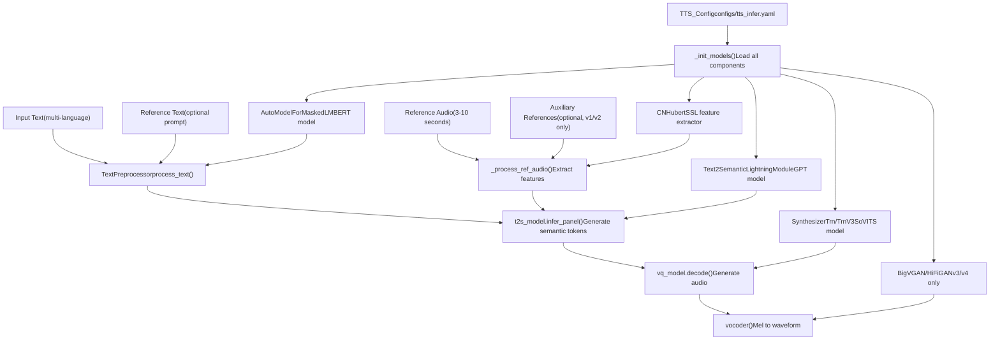
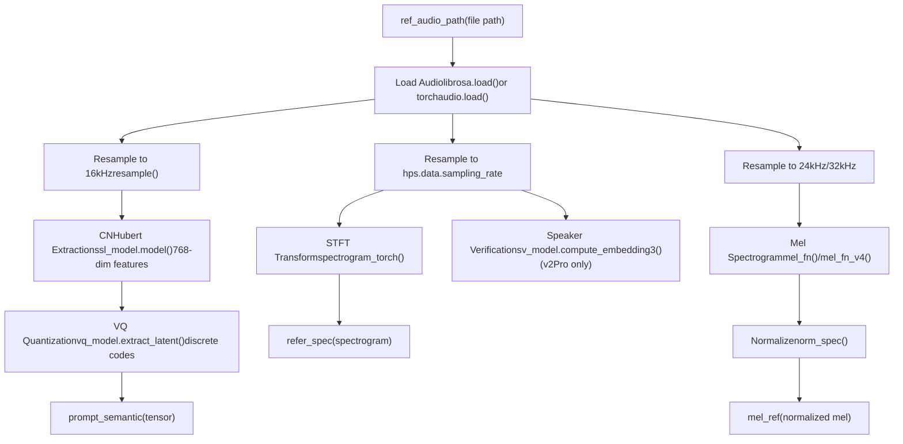
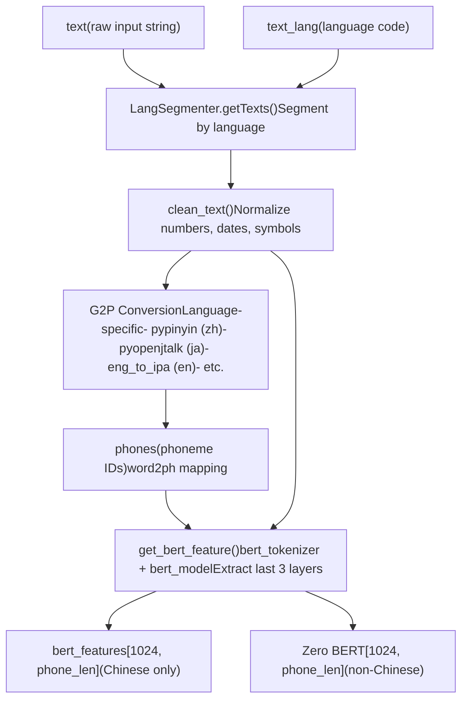
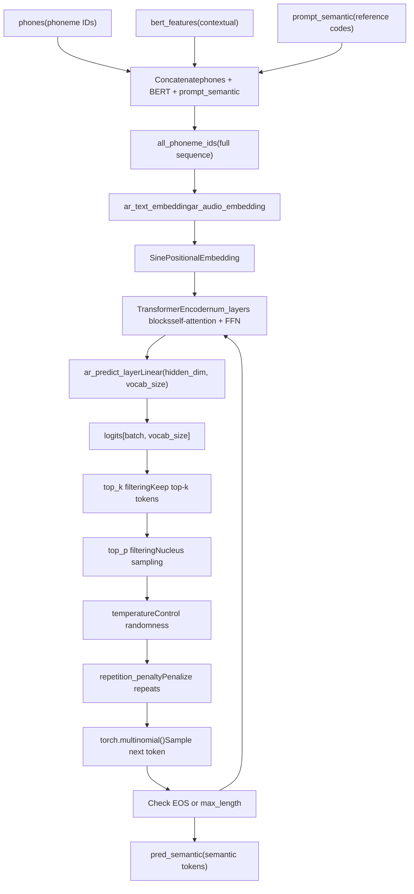
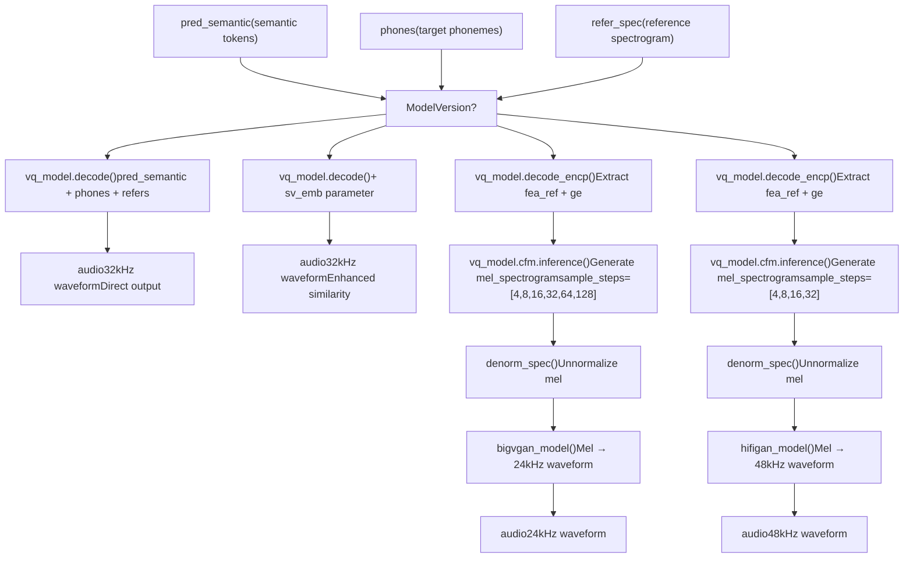
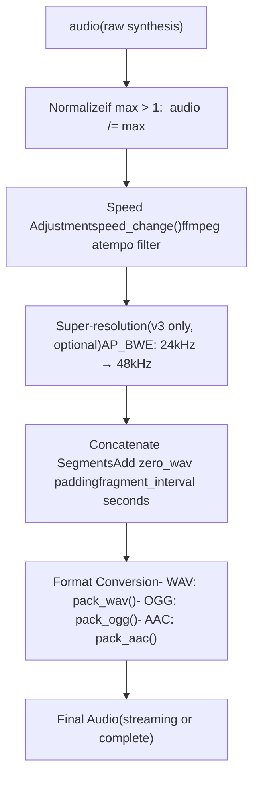
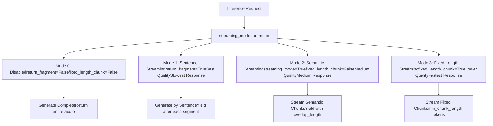
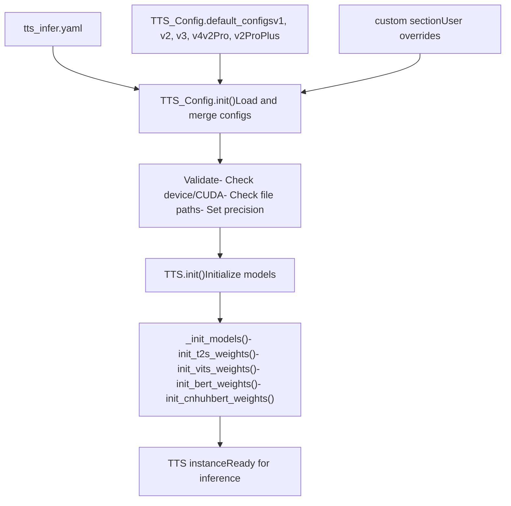

# Inference Pipeline (推理流水线)

相关源文件

-   [.gitignore](https://github.com/RVC-Boss/GPT-SoVITS/blob/c767f0b8/.gitignore)
-   [GPT\_SoVITS/AR/models/t2s\_model.py](https://github.com/RVC-Boss/GPT-SoVITS/blob/c767f0b8/GPT_SoVITS/AR/models/t2s_model.py)
-   [GPT\_SoVITS/AR/models/utils.py](https://github.com/RVC-Boss/GPT-SoVITS/blob/c767f0b8/GPT_SoVITS/AR/models/utils.py)
-   [GPT\_SoVITS/TTS\_infer\_pack/TTS.py](https://github.com/RVC-Boss/GPT-SoVITS/blob/c767f0b8/GPT_SoVITS/TTS_infer_pack/TTS.py)
-   [GPT\_SoVITS/configs/tts\_infer.yaml](https://github.com/RVC-Boss/GPT-SoVITS/blob/c767f0b8/GPT_SoVITS/configs/tts_infer.yaml)
-   [GPT\_SoVITS/inference\_webui.py](https://github.com/RVC-Boss/GPT-SoVITS/blob/c767f0b8/GPT_SoVITS/inference_webui.py)
-   [GPT\_SoVITS/inference\_webui\_fast.py](https://github.com/RVC-Boss/GPT-SoVITS/blob/c767f0b8/GPT_SoVITS/inference_webui_fast.py)
-   [GPT\_SoVITS/process\_ckpt.py](https://github.com/RVC-Boss/GPT-SoVITS/blob/c767f0b8/GPT_SoVITS/process_ckpt.py)
-   [api\_v2.py](https://github.com/RVC-Boss/GPT-SoVITS/blob/c767f0b8/api_v2.py)
-   [tools/assets.py](https://github.com/RVC-Boss/GPT-SoVITS/blob/c767f0b8/tools/assets.py)

本页面记录了从输入文本和参考音频开始，通过语义 Token 生成，直到最终音频合成的完整推理流程。有关推理中使用的模型训练信息，请参阅 [Training Pipeline (训练流水线)](/RVC-Boss/GPT-SoVITS/2.3-training-pipeline)。有关文本处理组件的详细信息，请参阅 [Text Processing Pipeline (文本处理流水线)](/RVC-Boss/GPT-SoVITS/2.2-text-processing-pipeline)。

## Overview (概览)

GPT-SoVITS 中的推理流水线通过以下步骤将原始文本输入转换为 Synthesized Speech (合成语音)：

1.  处理 Reference Audio (参考音频) 文件以提取声音特征
2.  将输入文本转换为带有上下文特征的音素序列
3.  使用 GPT 模型以自回归方式生成 Semantic Token (语义 Token)
4.  使用 SoVITS 模型从语义 Token 合成音频
5.  应用后处理（语速调整、超分辨率、拼接）

该流水线主要在 `TTS` 类中实现，并通过多个界面暴露：WebUI、REST API 和命令行工具。

来源： [GPT\_SoVITS/TTS\_infer\_pack/TTS.py421-1556](https://github.com/RVC-Boss/GPT-SoVITS/blob/c767f0b8/GPT_SoVITS/TTS_infer_pack/TTS.py#L421-L1556) [GPT\_SoVITS/inference\_webui.py751-1002](https://github.com/RVC-Boss/GPT-SoVITS/blob/c767f0b8/GPT_SoVITS/inference_webui.py#L751-L1002)

## Core Pipeline Components (核心流水线组件)


**TTS 流水线执行流程**

`TTS.run()` 方法编排了整个流水线，处理 Streaming (流式) 和非流式模式。

来源： [GPT\_SoVITS/TTS\_infer\_pack/TTS.py467-475](https://github.com/RVC-Boss/GPT-SoVITS/blob/c767f0b8/GPT_SoVITS/TTS_infer_pack/TTS.py#L467-L475) [GPT\_SoVITS/TTS\_infer\_pack/TTS.py1190-1556](https://github.com/RVC-Boss/GPT-SoVITS/blob/c767f0b8/GPT_SoVITS/TTS_infer_pack/TTS.py#L1190-L1556)

## Reference Audio Processing (参考音频处理)

参考音频处理提取了在合成期间将被克隆的声音特征：


**参考音频验证**

参考音频的时长必须在 3-10 秒之间（16kHz 采样率下为 48,000-160,000 个样本）。此限制确保了足够的上下文，同时不会使模型过载。

| 特征类型 | 提取方法 | 维度 | 用途 |
| --- | --- | --- | --- |
| SSL 特征 | `cnhubert_model.model()` | \[batch, 768, time\] | 声学内容表示 |
| 语义 Token | `vq_model.extract_latent()` | \[batch, 1, time\] | 离散语义代码 |
| 频谱图 (v1/v2) | `spectrogram_torch()` | \[batch, freq, time\] | 音色和韵律 |
| 梅尔频谱图 (v3/v4) | `mel_fn()` / `mel_fn_v4()` | \[batch, 100, time\] | CFM 的参考 |
| 声纹嵌入 (v2Pro) | `sv_model.compute_embedding3()` | \[20480\] | 说话人身份 |

来源： [GPT\_SoVITS/TTS\_infer\_pack/TTS.py764-830](https://github.com/RVC-Boss/GPT-SoVITS/blob/c767f0b8/GPT_SoVITS/TTS_infer_pack/TTS.py#L764-L830) [GPT\_SoVITS/inference\_webui.py812-826](https://github.com/RVC-Boss/GPT-SoVITS/blob/c767f0b8/GPT_SoVITS/inference_webui.py#L812-L826) [GPT\_SoVITS/TTS\_infer\_pack/TTS.py831-882](https://github.com/RVC-Boss/GPT-SoVITS/blob/c767f0b8/GPT_SoVITS/TTS_infer_pack/TTS.py#L831-L882)

## Text Processing Pipeline (文本处理流水线)

文本处理将输入文本转换为带有上下文嵌入的音素序列：


**文本切分与分段**

长文本在处理前会被切分为片段，以确保生成质量：

| 切分方法 | 实现 | 说明 |
| --- | --- | --- |
| `cut0` | 不切分 | 将整个文本作为一个片段处理 |
| `cut1` | `cut1()` | 每 4 句合并一次 |
| `cut2` | `cut2()` | 每 50 个字符切分一次 |
| `cut3` | `cut3()` | 按中文句号 `。` 切分 |
| `cut4` | `cut4()` | 按英文句号 `.` 切分 |
| `cut5` | `cut5()` | 按所有标点符号切分 |

**语言检测与多语言支持**

该流水线支持自动语言检测和混合语言合成：

```
# 语言模式示例"all_zh"      # 全部视为中文"all_ja"      # 全部视为日文  "all_yue"     # 全部视为粤语"zh"          # 中英混合"ja"          # 日英混合"auto"        # 自动检测"auto_yue"    # 自动检测且粤语优先
```
来源： [GPT\_SoVITS/TTS\_infer\_pack/TTS.py1062-1141](https://github.com/RVC-Boss/GPT-SoVITS/blob/c767f0b8/GPT_SoVITS/TTS_infer_pack/TTS.py#L1062-L1141) [GPT\_SoVITS/inference\_webui.py601-668](https://github.com/RVC-Boss/GPT-SoVITS/blob/c767f0b8/GPT_SoVITS/inference_webui.py#L601-L668) [GPT\_SoVITS/TTS\_infer\_pack/TextPreprocessor.py1-200](https://github.com/RVC-Boss/GPT-SoVITS/blob/c767f0b8/GPT_SoVITS/TTS_infer_pack/TextPreprocessor.py#L1-L200)

## GPT Semantic Token Generation (GPT 语义 Token 生成)

GPT 模型根据文本和参考特征以自回归方式生成语义 Token：


**推理方法**

`Text2SemanticDecoder` 类提供了多种推理方法：

| 方法 | 使用场景 | 关键参数 |
| --- | --- | --- |
| `infer()` | 基础自回归生成 | `top_k`, `temperature`, `early_stop_num` |
| `infer_panel()` | 带有无参考支持的 WebUI 推理 | `top_k`, `top_p`, `temperature` |
| `infer_panel_batch_infer()` | 并行批处理 | `batch_size`, `repetition_penalty` |
| `infer_panel_naive_batched()` | Streaming 优化推理 | `stream_mode`, `fixed_length_chunk` |

**采样参数**

| 参数 | 范围 | 默认值 | 效果 |
| --- | --- | --- | --- |
| `top_k` | 1-100 | 15 | 将词汇限制为概率前 k 名的 Token |
| `top_p` | 0.0-1.0 | 1.0 | Nucleus sampling (核采样) 阈值（累积概率） |
| `temperature` | 0.0-2.0 | 1.0 | 控制随机性（越高越随机） |
| `repetition_penalty` | 0.0-2.0 | 1.35 | 对 Token 重复进行惩罚 |
| `early_stop_num` | \-1 或正整数 | `hz * max_sec` | 生成 Token 的最大数量（-1 为禁用） |

**无参考模式**

当 `prompt_semantic` 为 `None` 时，模型以无参考模式运行，仅根据文本生成，不进行参考音频调节。此模式在 v1/v2/v2Pro 中受支持，但在 v3/v4 中不受支持。

来源： [GPT\_SoVITS/AR/models/t2s\_model.py513-576](https://github.com/RVC-Boss/GPT-SoVITS/blob/c767f0b8/GPT_SoVITS/AR/models/t2s_model.py#L513-L576) [GPT\_SoVITS/AR/models/t2s\_model.py583-896](https://github.com/RVC-Boss/GPT-SoVITS/blob/c767f0b8/GPT_SoVITS/AR/models/t2s_model.py#L583-L896) [GPT\_SoVITS/TTS\_infer\_pack/TTS.py1296-1409](https://github.com/RVC-Boss/GPT-SoVITS/blob/c767f0b8/GPT_SoVITS/TTS_infer_pack/TTS.py#L1296-L1409)

## Version-Specific Audio Synthesis (特定版本的音频合成)

音频合成阶段在不同模型版本之间有显著差异：


**版本对比表**

| 特性 | v1/v2 | v2Pro/ProPlus | v3 | v4 |
| --- | --- | --- | --- | --- |
| **合成方法** | 直接 VQ 解码 | 直接 VQ + SV | CFM + BigVGAN | CFM + HiFiGAN |
| **输出采样率** | 32kHz | 32kHz | 24kHz | 48kHz |
| **是否需要声码器** | 否 | 否 | 是 | 是 |
| **采样步数** | 不适用 | 不适用 | 4-128 | 4-32 |
| **声纹验证** | 否 | 是 | 否 | 否 |
| **辅助参考** | 是 | 是 | 否 | 否 |
| **LoRA 支持** | 否 | 否 | 是 | 是 |
| **超分辨率** | 否 | 否 | 是（可选） | 否 |
| **质量** | 好 | 增强相似度 | 高（可能有伪影） | 最佳（无伪影） |

**v3/v4 分块处理**

对于 v3/v4 模型，音频生成使用分块处理来处理长序列：

```
# 配置值v3_config = {    "sr": 24000,    "T_ref": 468,      # 参考帧    "T_chunk": 934,    # 块大小    "overlapped_len": 12} v4_config = {    "sr": 48000,    "T_ref": 500,    "T_chunk": 1000,    "overlapped_len": 12}
```
分块过程：

1.  从参考梅尔谱中获取最后 `T_ref` 帧作为上下文
2.  生成 `chunk_len = T_chunk - T_ref` 个新帧
3.  使用生成音频的最后 `T_ref` 帧作为下一块的上下文
4.  拼接所有块

来源： [GPT\_SoVITS/inference\_webui.py895-976](https://github.com/RVC-Boss/GPT-SoVITS/blob/c767f0b8/GPT_SoVITS/inference_webui.py#L895-L976) [GPT\_SoVITS/TTS\_infer\_pack/TTS.py1410-1511](https://github.com/RVC-Boss/GPT-SoVITS/blob/c767f0b8/GPT_SoVITS/TTS_infer_pack/TTS.py#L1410-L1511) [GPT\_SoVITS/TTS\_infer\_pack/TTS.py615-674](https://github.com/RVC-Boss/GPT-SoVITS/blob/c767f0b8/GPT_SoVITS/TTS_infer_pack/TTS.py#L615-L674)

## Post-Processing Pipeline (后处理流水线)

合成后，音频会经过几个后处理步骤：


**后处理参数**

| 参数 | 默认值 | 说明 |
| --- | --- | --- |
| `speed_factor` | 1.0 | 使用 ffmpeg atempo 的语速倍数 (0.6-1.65) |
| `fragment_interval` | 0.3 | 片段之间的静音时长（秒） |
| `super_sampling` | False | 启用 24→48kHz 上采样（仅限 v3） |
| `media_type` | "wav" | 输出格式: wav, ogg, aac, raw |

**片段拼接**

对于多句合成，片段拼接时带有可配置的停顿：

```
zero_wav = np.zeros(    int(hps.data.sampling_rate * pause_second),    dtype=np.float16 if is_half else np.float32) audio_opt = []for segment in segments:    audio_opt.append(segment_audio)    audio_opt.append(zero_wav)  # 添加停顿    final_audio = torch.cat(audio_opt, 0)
```
来源： [GPT\_SoVITS/TTS\_infer\_pack/TTS.py1512-1541](https://github.com/RVC-Boss/GPT-SoVITS/blob/c767f0b8/GPT_SoVITS/TTS_infer_pack/TTS.py#L1512-L1541) [GPT\_SoVITS/inference\_webui.py977-1001](https://github.com/RVC-Boss/GPT-SoVITS/blob/c767f0b8/GPT_SoVITS/inference_webui.py#L977-L1001) [api\_v2.py181-278](https://github.com/RVC-Boss/GPT-SoVITS/blob/c767f0b8/api_v2.py#L181-L278)

## Streaming Modes (流式模式)

推理流水线支持多种 Streaming (流式) 模式，以实现不同的延迟/质量权衡：


**流式配置参数**

| 参数 | 类型 | 范围 | 说明 |
| --- | --- | --- | --- |
| `streaming_mode` | bool/int | 0,1,2,3 或 True/False | 流式模式选择器 |
| `overlap_length` | int | 0-10 | 块之间重叠的语义 Token 数量（模式 2/3） |
| `min_chunk_length` | int | 4-64 | 每个块最小语义 Token 数量（模式 3） |
| `return_fragment` | bool | True/False | 按句子片段返回音频（模式 1） |

**流式实现**

对于流式模式 2 和 3，流水线使用重叠块：

```
# 模式 2/3: 语义 Token 流式传输last_output = Nonefor chunk_semantic in semantic_chunks:    # 与前一块重叠    if last_output is not None:        chunk_semantic = torch.cat([            last_output[-overlap_length:],            chunk_semantic        ], dim=-1)        audio_chunk = synthesize(chunk_semantic)    yield audio_chunk        last_output = chunk_semantic
```
**流式传输的 WAV 头**

当以 WAV 格式流式传输时，第一块包含一个 WAV 头：

```
def wave_header_chunk(frame_input=b"", channels=1,                       sample_width=2, sample_rate=32000):    wav_buf = BytesIO()    with wave.open(wav_buf, "wb") as vfout:        vfout.setnchannels(channels)        vfout.setsampwidth(sample_width)        vfout.setframerate(sample_rate)        vfout.writeframes(frame_input)    return wav_buf.read()
```
来源： [api\_v2.py388-424](https://github.com/RVC-Boss/GPT-SoVITS/blob/c767f0b8/api_v2.py#L388-L424) [GPT\_SoVITS/TTS\_infer\_pack/TTS.py1190-1295](https://github.com/RVC-Boss/GPT-SoVITS/blob/c767f0b8/GPT_SoVITS/TTS_infer_pack/TTS.py#L1190-L1295) [api\_v2.py282-294](https://github.com/RVC-Boss/GPT-SoVITS/blob/c767f0b8/api_v2.py#L282-L294)

## Configuration and Initialization (配置与初始化)

推理流水线通过 `TTS_Config` 类进行配置：


**TTS\_Config 结构**

```
class TTS_Config:    # 模型路径    t2s_weights_path: str        # GPT 模型检查点    vits_weights_path: str       # SoVITS 模型检查点    bert_base_path: str          # BERT 模型目录    cnhuhbert_base_path: str     # CNHubert 模型目录     # 运行时设置    device: torch.device         # cuda/cpu/mps    is_half: bool                # FP16/FP32    version: str                 # v1/v2/v3/v4/v2Pro/v2ProPlus     # 音频设置（来自 VITS 配置）    sampling_rate: int           # 32000 (v1/v2), 24000 (v3), 48000 (v4)    hop_length: int              # 640 (v1/v2), 256 (v3), 320 (v4)    filter_length: int           # 2048    win_length: int              # 2048     # 生成设置    max_sec: int                 # 最大生成长度    hz: int                      # 50 (语义 Token Hz)    languages: list              # 支持的语言
```
**版本自动检测**

使用多种策略从 Checkpoint 文件中检测模型版本：

```
# 策略 1: 检查预训练模型的哈希值hash_pretrained_dict = {    "dc3c97e17592963677a4a1681f30c653": ["v2", "v2", False],  # v1    "6642b37f3dbb1f76882b69937c95a5f3": ["v2", "v2", False],  # v2    "43797be674a37c1c83ee81081941ed0f": ["v2", "v3", False],  # v3    "4f26b9476d0c5033e04162c486074374": ["v2", "v4", False],  # v4    # ...} # 策略 2: 检查新权重的 2 字节文件头head2version = {    b"00": ["v1", "v1", False],    b"01": ["v2", "v2", False],    b"02": ["v2", "v3", False],    b"03": ["v2", "v3", True],   # LoRA    b"04": ["v2", "v4", True],   # LoRA    b"05": ["v2", "v2Pro", False],    b"06": ["v2", "v2ProPlus", False],} # 策略 3: 检查旧权重的文件大小# v1: ~82942KB, v2: ~83014KB, v3: ~750MB
```
返回: `(version, model_version, if_lora_v3)` 元组

来源： [GPT\_SoVITS/TTS\_infer\_pack/TTS.py217-419](https://github.com/RVC-Boss/GPT-SoVITS/blob/c767f0b8/GPT_SoVITS/TTS_infer_pack/TTS.py#L217-L419) [GPT\_SoVITS/TTS\_infer\_pack/TTS.py467-590](https://github.com/RVC-Boss/GPT-SoVITS/blob/c767f0b8/GPT_SoVITS/TTS_infer_pack/TTS.py#L467-L590) [GPT\_SoVITS/process\_ckpt.py22-127](https://github.com/RVC-Boss/GPT-SoVITS/blob/c767f0b8/GPT_SoVITS/process_ckpt.py#L22-L127) [GPT\_SoVITS/configs/tts\_infer.yaml1-57](https://github.com/RVC-Boss/GPT-SoVITS/blob/c767f0b8/GPT_SoVITS/configs/tts_infer.yaml#L1-L57)

## Inference Interfaces (推理接口)

推理流水线通过多个接口暴露：

**1\. TTS 类（程序化）**

```
from TTS_infer_pack.TTS import TTS, TTS_Config config = TTS_Config("configs/tts_infer.yaml")tts = TTS(config) inputs = {    "text": "你好，世界",    "text_lang": "zh",    "ref_audio_path": "reference.wav",    "prompt_text": "参考音频文本",    "prompt_lang": "zh",    "top_k": 15,    "top_p": 1.0,    "temperature": 1.0,} for sr, audio in tts.run(inputs):    # 处理音频块    pass
```
**2\. Inference WebUI (推理 WebUI)**

-   `inference_webui.py`: 具有模型切换功能的完整 UI
-   `inference_webui_fast.py`: 使用 `TTS` 类的优化 UI
-   端口: 9872（可通过 `infer_ttswebui` 环境变量配置）

**3\. REST API (api\_v2.py)**

```
# GET 请求curl "http://127.0.0.1:9880/tts?text=你好&text_lang=zh&ref_audio_path=ref.wav&prompt_lang=zh&streaming_mode=true" # POST 请求 (JSON)curl -X POST http://127.0.0.1:9880/tts \  -H "Content-Type: application/json" \  -d '{    "text": "你好，世界",    "text_lang": "zh",    "ref_audio_path": "reference.wav",    "prompt_text": "参考音频",    "prompt_lang": "zh",    "streaming_mode": 2  }'
```
**API 端点**

| 端点 | 方法 | 用途 |
| --- | --- | --- |
| `/tts` | GET/POST | 文本转语音合成 |
| `/set_gpt_weights` | GET/POST | 切换 GPT 模型 |
| `/set_sovits_weights` | GET/POST | 切换 SoVITS 模型 |
| `/control` | GET/POST | 控制命令（重启/退出） |

**4\. Batch Inference (批量推理)**

```
python batch_inference.py \  --gpt_path GPT_weights/model.ckpt \  --sovits_path SoVITS_weights/model.pth \  --input_file texts.txt \  --ref_audio reference.wav
```
来源： [GPT\_SoVITS/inference\_webui.py1-200](https://github.com/RVC-Boss/GPT-SoVITS/blob/c767f0b8/GPT_SoVITS/inference_webui.py#L1-L200) [GPT\_SoVITS/inference\_webui\_fast.py1-200](https://github.com/RVC-Boss/GPT-SoVITS/blob/c767f0b8/GPT_SoVITS/inference_webui_fast.py#L1-L200) [api\_v2.py1-102](https://github.com/RVC-Boss/GPT-SoVITS/blob/c767f0b8/api_v2.py#L1-L102) [api\_v2.py345-463](https://github.com/RVC-Boss/GPT-SoVITS/blob/c767f0b8/api_v2.py#L345-L463)

## Performance Optimization (性能优化)

**Prompt Caching (提示词缓存)**

流水线会缓存处理后的参考音频，以避免重复计算：

```
prompt_cache = {    "ref_audio_path": None,    "prompt_semantic": None,      # 缓存的语义 Token    "refer_spec": [],             # 缓存的频谱图    "prompt_text": None,    "prompt_lang": None,    "phones": None,               # 缓存的音素    "bert_features": None,        # 缓存的 BERT 特征    "norm_text": None,    "aux_ref_audio_paths": [],}
```
当重复使用相同的参考音频时，会重用缓存的特征。

**Parallel Inference (并行推理)**

当 `parallel_infer=True` 时，流水线会并行处理多个文本片段：

```
if parallel_infer and len(texts) > 1:    # 使用 infer_panel_batch_infer 进行并行处理    results = t2s_model.infer_panel_batch_infer(        x_list, x_lens, prompts, bert_features,        batch_size=batch_size,        # ...    )else:    # 顺序处理    for text in texts:        result = t2s_model.infer_panel(...)
```
**GPU 显存管理**

```
def empty_cache():    if torch.cuda.is_available():        torch.cuda.empty_cache()    gc.collect()
```
在模型加载操作之间调用，以释放 GPU 显存。

**Half Precision (FP16) (半精度)**

当 `is_half=True` 且 CUDA 可用时，所有模型均使用 FP16：

```
if is_half and torch.cuda.is_available():    model = model.half()
```
这在现代 GPU 上可将显存占用减少约 50%，并提高推理速度。

来源： [GPT\_SoVITS/TTS\_infer\_pack/TTS.py452-463](https://github.com/RVC-Boss/GPT-SoVITS/blob/c767f0b8/GPT_SoVITS/TTS_infer_pack/TTS.py#L452-L463) [GPT\_SoVITS/TTS\_infer\_pack/TTS.py691-728](https://github.com/RVC-Boss/GPT-SoVITS/blob/c767f0b8/GPT_SoVITS/TTS_infer_pack/TTS.py#L691-L728) [GPT\_SoVITS/TTS\_infer\_pack/TTS.py1190-1295](https://github.com/RVC-Boss/GPT-SoVITS/blob/c767f0b8/GPT_SoVITS/TTS_infer_pack/TTS.py#L1190-L1295)
