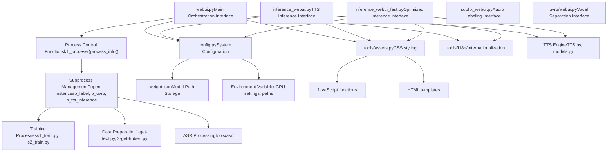
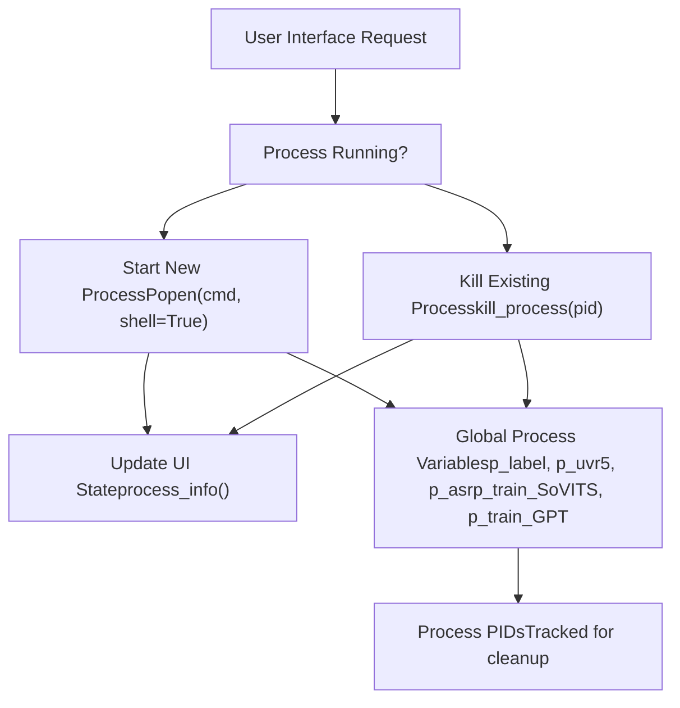
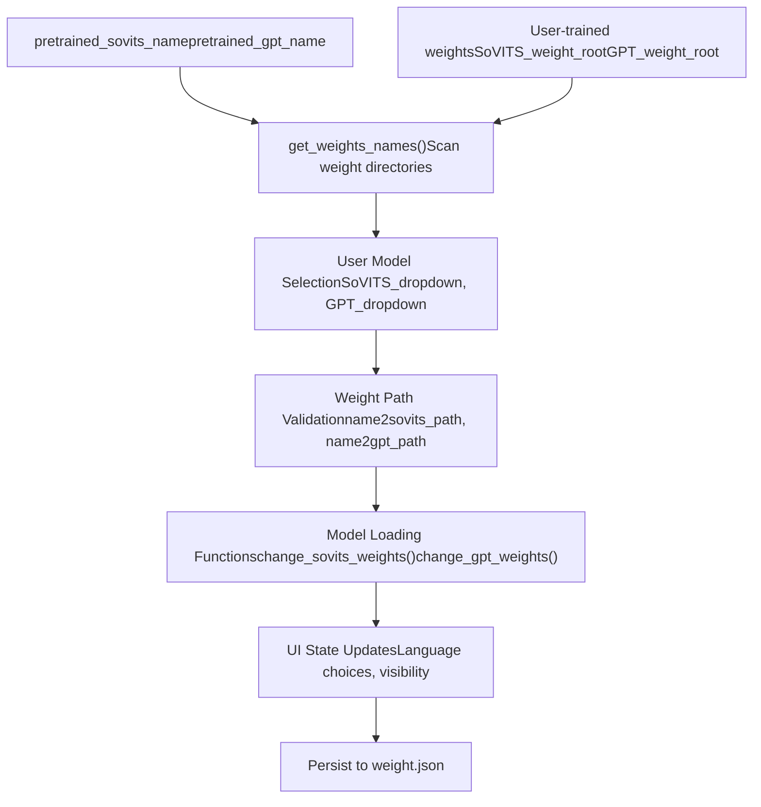

# Web Interface (Web 界面)

相关源文件

-   [GPT\_SoVITS/inference\_webui.py](https://github.com/RVC-Boss/GPT-SoVITS/blob/c767f0b8/GPT_SoVITS/inference_webui.py)
-   [GPT\_SoVITS/inference\_webui\_fast.py](https://github.com/RVC-Boss/GPT-SoVITS/blob/c767f0b8/GPT_SoVITS/inference_webui_fast.py)
-   [GPT\_SoVITS/process\_ckpt.py](https://github.com/RVC-Boss/GPT-SoVITS/blob/c767f0b8/GPT_SoVITS/process_ckpt.py)
-   [api.py](https://github.com/RVC-Boss/GPT-SoVITS/blob/c767f0b8/api.py)
-   [config.py](https://github.com/RVC-Boss/GPT-SoVITS/blob/c767f0b8/config.py)
-   [tools/assets.py](https://github.com/RVC-Boss/GPT-SoVITS/blob/c767f0b8/tools/assets.py)
-   [webui.py](https://github.com/RVC-Boss/GPT-SoVITS/blob/c767f0b8/webui.py)

GPT-SoVITS 系统为文本转语音模型的训练和推理的不同方面提供了多个基于 Web 的界面。本文档涵盖了 Web Interface (Web 界面) 子系统的架构和组件，该子系统通过使用 Gradio 构建的基于浏览器的 GUI (图形用户界面) 实现用户交互。

有关特定界面的详细信息，请参阅用于训练编排的 [Main WebUI](/RVC-Boss/GPT-SoVITS/3.1-main-webui)、用于 TTS 合成的 [Inference WebUI](/RVC-Boss/GPT-SoVITS/3.2-inference-webui)、用于程序化访问的 [API Reference](/RVC-Boss/GPT-SoVITS/3.3-rest-api) 以及用于系统设置的 [Configuration Management](/RVC-Boss/GPT-SoVITS/3.4-configuration-management)。

## System Overview (系统概览)

Web 界面子系统由多个独立的 Gradio 应用程序组成，这些程序可以单独启动，也可以一起启动。每个界面都在 GPT-SoVITS 工作流中服务于特定目的，从数据准备和模型训练到推理和系统配置。

## Web Interface Architecture (Web 界面架构)


Sources: [webui.py1-1660](https://github.com/RVC-Boss/GPT-SoVITS/blob/c767f0b8/webui.py#L1-L1660) [GPT\_SoVITS/inference\_webui.py1-1200](https://github.com/RVC-Boss/GPT-SoVITS/blob/c767f0b8/GPT_SoVITS/inference_webui.py#L1-L1200) [GPT\_SoVITS/inference\_webui\_fast.py1-524](https://github.com/RVC-Boss/GPT-SoVITS/blob/c767f0b8/GPT_SoVITS/inference_webui_fast.py#L1-L524) [config.py1-219](https://github.com/RVC-Boss/GPT-SoVITS/blob/c767f0b8/config.py#L1-L219) [tools/assets.py1-74](https://github.com/RVC-Boss/GPT-SoVITS/blob/c767f0b8/tools/assets.py#L1-L74)

## Core Web Interface Components (核心 Web 界面组件)

### Main Orchestration Interface (主编排界面)

主要的 Web 界面在 `webui.py` 中实现，并作为管理整个 GPT-SoVITS 工作流的中心枢纽。它提供以下控制：

-   **Process Management (进程管理)**：诸如 `change_label()`、`change_uvr5()`、`change_tts_inference()` 之类的函数负责管理子进程的生命周期。
-   **Training Orchestration (训练编排)**：`open1Ba()` 用于 SoVITS 训练，`open1Bb()` 用于 GPT 训练。
-   **Data Pipeline Control (数据流水线控制)**：`open1a()`、`open1b()`、`open1c()` 用于三阶段的数据准备。
-   **Audio Processing (音频处理)**：`open_slice()`、`open_asr()`、`open_denoise()` 用于音频预处理。

### Inference Interfaces (推理界面)

两个独立的界面处理 TTS 推理：

-   **Standard Interface (标准界面)** (`inference_webui.py`)：功能齐全的界面，包含所有模型选项。
-   **Fast Interface (快速界面)** (`inference_webui_fast.py`)：优化的界面，使用 `TTS_infer_pack.TTS` 流水线以获得更好的性能。

这两个界面共享类似的功能，但使用不同的后端实现。

### Process Management System (进程管理系统)


Sources: [webui.py212-243](https://github.com/RVC-Boss/GPT-SoVITS/blob/c767f0b8/webui.py#L212-L243) [webui.py271-296](https://github.com/RVC-Boss/GPT-SoVITS/blob/c767f0b8/webui.py#L271-L296) [webui.py302-326](https://github.com/RVC-Boss/GPT-SoVITS/blob/c767f0b8/webui.py#L302-L326)

## Configuration and Asset Management (配置与资产管理)

### Configuration System (配置系统)

Web 界面依赖于一个中心化的配置系统：

-   **`config.py`**：定义系统范围内的设置，包括 GPU 配置、模型路径和端口分配。
-   **`weight.json`**：存储用户选择的模型路径，以便在会话之间实现持久化。
-   **Environment Variables (环境变量)**：用于运行时配置，如 `CUDA_VISIBLE_DEVICES`、`is_half`、`version`。

关键配置元素：

| Component | Purpose | Default Value |
| --- | --- | --- |
| `webui_port_main` | 主界面端口 | 9874 |
| `webui_port_infer_tts` | 推理界面端口 | 9872 |
| `webui_port_uvr5` | UVR5 界面端口 | 9873 |
| `webui_port_subfix` | 音频标注端口 | 9871 |
| `exp_root` | 实验目录 | "logs" |
| `python_exec` | Python 可执行文件路径 | `sys.executable` |

### Asset Management (资产管理)

`tools/assets.py` 模块提供：

-   **CSS Styling (CSS 样式)**：支持深色/浅色主题的响应式设计。
-   **JavaScript Functions (JavaScript 函数)**：客户端功能，如主题删除。
-   **HTML Templates (HTML 模板)**：包含项目链接和品牌标识的通用页眉模板。

Sources: [config.py138-146](https://github.com/RVC-Boss/GPT-SoVITS/blob/c767f0b8/config.py#L138-L146) [tools/assets.py14-50](https://github.com/RVC-Boss/GPT-SoVITS/blob/c767f0b8/tools/assets.py#L14-L50) [tools/assets.py52-73](https://github.com/RVC-Boss/GPT-SoVITS/blob/c767f0b8/tools/assets.py#L52-L73)

## Interface Integration Points (界面集成点)

### Model Weight Management (模型权重管理)

两个推理界面都实现了动态模型切换：


Sources: [GPT\_SoVITS/inference\_webui.py229-368](https://github.com/RVC-Boss/GPT-SoVITS/blob/c767f0b8/GPT_SoVITS/inference_webui.py#L229-L368) [GPT\_SoVITS/inference\_webui\_fast.py233-298](https://github.com/RVC-Boss/GPT-SoVITS/blob/c767f0b8/GPT_SoVITS/inference_webui_fast.py#L233-L298) [config.py86-113](https://github.com/RVC-Boss/GPT-SoVITS/blob/c767f0b8/config.py#L86-L113)

### Internationalization Support (国际化支持)

所有的 Web 界面都通过 `tools/i18n` 系统支持多语言：

-   **Language Detection (语言检测)**：从系统区域设置或命令行参数自动检测。
-   **Dynamic Text (动态文本)**：所有的 UI 文本都使用 `i18n()` 函数调用进行翻译。
-   **Supported Languages (支持的语言)**：支持多种语言，并具有自动检测的回退机制。

每个界面中的语言系统初始化如下：

```
language = os.environ.get("language", "Auto")
language = sys.argv[-1] if sys.argv[-1] in scan_language_list() else language
i18n = I18nAuto(language=language)
```
Sources: [GPT\_SoVITS/inference\_webui.py129-131](https://github.com/RVC-Boss/GPT-SoVITS/blob/c767f0b8/GPT_SoVITS/inference_webui.py#L129-L131) [webui.py66-68](https://github.com/RVC-Boss/GPT-SoVITS/blob/c767f0b8/webui.py#L66-L68) [tools/i18n/i18n.py](https://github.com/RVC-Boss/GPT-SoVITS/blob/c767f0b8/tools/i18n/i18n.py)

## Deployment and Access (部署与访问)

Web 界面设计用于本地和远程访问：

-   **Local Development (本地开发)**：界面绑定到 `0.0.0.0` 以供网络访问。
-   **Shared Access (共享访问)**：可通过由 `is_share` 环境变量控制的 Gradio 共享机制进行可选共享。
-   **Process Isolation (进程隔离)**：每个界面都作为一个独立的进程运行，以确保稳定性。
-   **Resource Management (资源管理)**：通过环境变量进行 GPU 分配和显存管理。

主编排界面可以根据需要启动和管理所有其他界面，为 GPT-SoVITS 系统提供统一的入口点，同时保持单个组件的模块化和独立性。

Sources: [webui.py332-364](https://github.com/RVC-Boss/GPT-SoVITS/blob/c767f0b8/webui.py#L332-L364) [GPT\_SoVITS/inference\_webui.py84-90](https://github.com/RVC-Boss/GPT-SoVITS/blob/c767f0b8/GPT_SoVITS/inference_webui.py#L84-L90) [GPT\_SoVITS/inference\_webui\_fast.py45-52](https://github.com/RVC-Boss/GPT-SoVITS/blob/c767f0b8/GPT_SoVITS/inference_webui_fast.py#L45-L52)
