# Main WebUI (主 WebUI)

相关源文件

-   [README.md](https://github.com/RVC-Boss/GPT-SoVITS/blob/c767f0b8/README.md?plain=1)
-   [api.py](https://github.com/RVC-Boss/GPT-SoVITS/blob/c767f0b8/api.py)
-   [config.py](https://github.com/RVC-Boss/GPT-SoVITS/blob/c767f0b8/config.py)
-   [docs/cn/README.md](https://github.com/RVC-Boss/GPT-SoVITS/blob/c767f0b8/docs/cn/README.md?plain=1)
-   [docs/ja/README.md](https://github.com/RVC-Boss/GPT-SoVITS/blob/c767f0b8/docs/ja/README.md?plain=1)
-   [docs/ko/README.md](https://github.com/RVC-Boss/GPT-SoVITS/blob/c767f0b8/docs/ko/README.md?plain=1)
-   [docs/tr/README.md](https://github.com/RVC-Boss/GPT-SoVITS/blob/c767f0b8/docs/tr/README.md?plain=1)
-   [install.ps1](https://github.com/RVC-Boss/GPT-SoVITS/blob/c767f0b8/install.ps1)
-   [install.sh](https://github.com/RVC-Boss/GPT-SoVITS/blob/c767f0b8/install.sh)
-   [requirements.txt](https://github.com/RVC-Boss/GPT-SoVITS/blob/c767f0b8/requirements.txt)
-   [webui.py](https://github.com/RVC-Boss/GPT-SoVITS/blob/c767f0b8/webui.py)

## 目的与范围 (Purpose and Scope)

Main WebUI (`webui.py`) 是 GPT-SoVITS 的中央编排界面，提供对 Data preparation (数据准备)、Model training (模型训练) 和系统管理的统一访问。它作为一个 Process manager (进程管理器)，生成并控制各种 Sub-tools (子工具) 和训练进程。该界面专为准备 Dataset (数据集) 和训练自定义语音模型而设计。

有关训练后的交互式 TTS 生成 (Inference WebUI)，请参阅 [Inference WebUI](/RVC-Boss/GPT-SoVITS/3.2-inference-webui)。有关对已训练模型的程序化访问，请参阅 [REST API](/RVC-Boss/GPT-SoVITS/3.3-rest-api)。专门针对数据集标注，请参阅 [音频标注与管理](/RVC-Boss/GPT-SoVITS/5.4-audio-annotation-tools)。

---

## 架构概览 (Architecture Overview)

Main WebUI 实现为一个 Gradio application (Gradio 应用)，管理多个基于子进程的工具和训练流水线。它为不同的工作流阶段提供基于标签页的组织，并维护全局进程状态以进行资源协调。

### 系统组织 (System Organization)

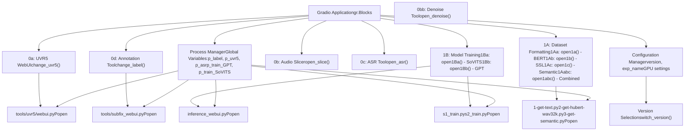
**来源：** [webui.py1-100](https://github.com/RVC-Boss/GPT-SoVITS/blob/c767f0b8/webui.py#L1-L100) [webui.py1305-1475](https://github.com/RVC-Boss/GPT-SoVITS/blob/c767f0b8/webui.py#L1305-L1475)

---

## 进程管理系统 (Process Management System)

Main WebUI 维护全局进程引用，并为所有生成的子进程提供生命周期管理。这可以防止资源冲突并允许进行适当的清理。

### 进程状态管理 (Process State Management)

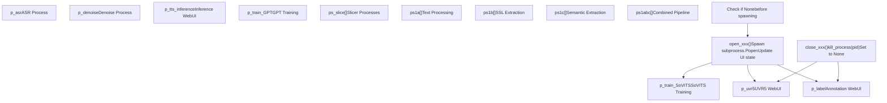
**关键进程管理函数：**

| 函数 | 目的 | 进程变量 | 行号 |
| --- | --- | --- | --- |
| `change_label()` | 切换标注 WebUI | `p_label` | [webui.py270-295](https://github.com/RVC-Boss/GPT-SoVITS/blob/c767f0b8/webui.py#L270-L295) |
| `change_uvr5()` | 切换 UVR5 分离 UI | `p_uvr5` | [webui.py301-325](https://github.com/RVC-Boss/GPT-SoVITS/blob/c767f0b8/webui.py#L301-L325) |
| `change_tts_inference()` | 切换推理 WebUI | `p_tts_inference` | [webui.py331-363](https://github.com/RVC-Boss/GPT-SoVITS/blob/c767f0b8/webui.py#L331-L363) |
| `open_asr()` / `close_asr()` | 控制 ASR 进程 | `p_asr` | [webui.py371-426](https://github.com/RVC-Boss/GPT-SoVITS/blob/c767f0b8/webui.py#L371-L426) |
| `open_denoise()` / `close_denoise()` | 控制去噪进程 | `p_denoise` | [webui.py432-482](https://github.com/RVC-Boss/GPT-SoVITS/blob/c767f0b8/webui.py#L432-L482) |
| `open_slice()` / `close_slice()` | 控制音频切分 | `ps_slice` | [webui.py682-773](https://github.com/RVC-Boss/GPT-SoVITS/blob/c767f0b8/webui.py#L682-L773) |
| `open1Ba()` / `close1Ba()` | 控制 SoVITS 训练 | `p_train_SoVITS` | [webui.py489-583](https://github.com/RVC-Boss/GPT-SoVITS/blob/c767f0b8/webui.py#L489-L583) |
| `open1Bb()` / `close1Bb()` | 控制 GPT 训练 | `p_train_GPT` | [webui.py590-675](https://github.com/RVC-Boss/GPT-SoVITS/blob/c767f0b8/webui.py#L590-L675) |

### 进程生命周期模式 (Process Lifecycle Pattern)

所有进程管理都遵循一致的模式：

> **[Mermaid stateDiagram]**
> *(图表结构无法解析)*

**终止进程实现 (Kill Process Implementation):**

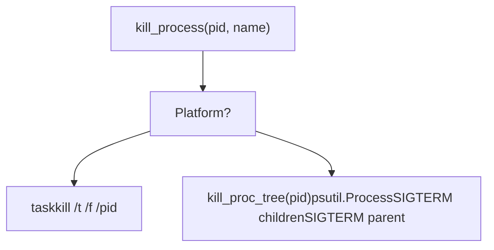
**来源：** [webui.py204-265](https://github.com/RVC-Boss/GPT-SoVITS/blob/c767f0b8/webui.py#L204-L265) [webui.py211-241](https://github.com/RVC-Boss/GPT-SoVITS/blob/c767f0b8/webui.py#L211-L241)

---

## 数据准备工具 (标签页 0) (Data Preparation Tools (Tab 0))

标签页 0 提供了四个预处理工具，用于为训练准备原始音频和文本。每个工具都作为一个独立的子进程运行。

### 工具架构 (Tool Architecture)

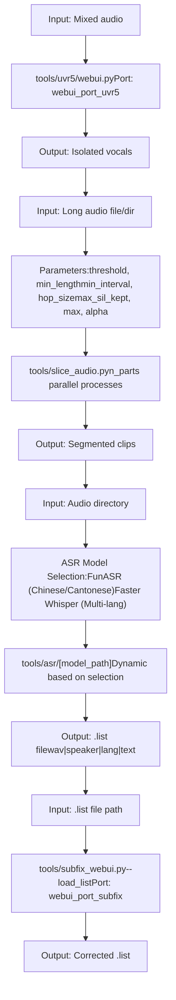
### ASR 模型选择逻辑 (ASR Model Selection Logic)

ASR 工具根据用户的选择动态选择合适的模型：

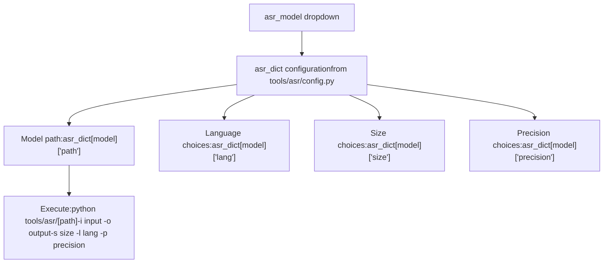
**动态 UI 更新：**

-   `change_lang_choices()`: 当模型改变时更新可用语言
-   `change_size_choices()`: 更新可用模型大小
-   `change_precision_choices()`: 根据 GPU 显存和 `is_half` 自动选择精度

**来源：** [webui.py1315-1475](https://github.com/RVC-Boss/GPT-SoVITS/blob/c767f0b8/webui.py#L1315-L1475) [webui.py371-414](https://github.com/RVC-Boss/GPT-SoVITS/blob/c767f0b8/webui.py#L371-L414) [webui.py1434-1454](https://github.com/RVC-Boss/GPT-SoVITS/blob/c767f0b8/webui.py#L1434-L1454)

---

## 训练流水线 (标签页 1) (Training Pipeline (Tab 1))

标签页 1 编排了从 Dataset formatting (数据集格式化) 到模型训练的完整训练工作流。它由两个主要部分组成：数据集准备 (1A) 和模型训练 (1B)。

### 数据集格式化流水线 (1A) (Dataset Formatting Pipeline (1A))

数据集格式化阶段由三个顺序执行的 Feature extraction (特征提取) 步骤组成，这些步骤可以单独运行或作为组合流水线运行。

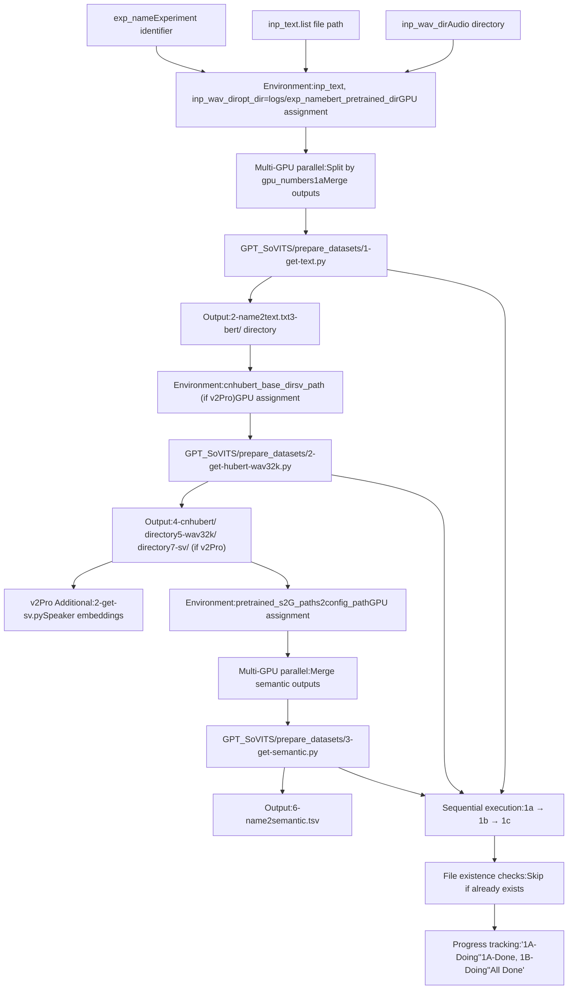
**进程管理模式：**

每个特征提取步骤 (`open1a`, `open1b`, `open1c`) 遵循以下模式：

1.  检查进程列表是否为空 (`ps1a == []` 等)
2.  构建包含路径和 GPU 分配的配置字典
3.  解析 GPU 字符串 (例如 "0-1-2") 以创建并行进程
4.  为每个进程设置环境变量
5.  为每个 GPU 生成 `subprocess.Popen`
6.  等待所有进程完成
7.  如果是跨 GPU 拆分的，则合并输出文件
8.  清空进程列表

**组合流水线 (`open1abc`):**

组合流水线函数顺序执行所有三个步骤，并具有智能跳过功能：

-   在运行 1a 之前检查 `2-name2text.txt` 是否存在
-   在运行 1c 之前检查 `6-name2semantic.tsv` 是否存在
-   始终运行 1b (SSL Extraction)
-   处理 v2Pro 额外的 SV 提取
-   通过 UI 提供进度更新

**来源：** [webui.py780-862](https://github.com/RVC-Boss/GPT-SoVITS/blob/c767f0b8/webui.py#L780-L862) [webui.py870-953](https://github.com/RVC-Boss/GPT-SoVITS/blob/c767f0b8/webui.py#L870-L953) [webui.py960-1039](https://github.com/RVC-Boss/GPT-SoVITS/blob/c767f0b8/webui.py#L960-L1039) [webui.py1046-1261](https://github.com/RVC-Boss/GPT-SoVITS/blob/c767f0b8/webui.py#L1046-L1261)

### 模型训练流水线 (1B) (Model Training Pipeline (1B))

在数据集格式化之后，使用提取的特征训练模型。

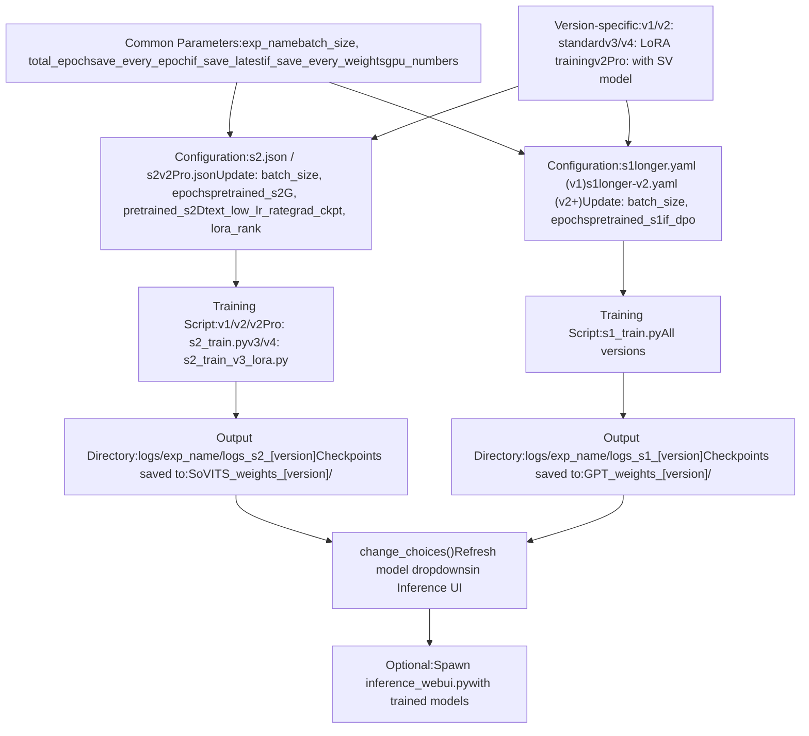
**训练配置构建：**

两个训练函数 (`open1Ba` 用于 SoVITS，`open1Bb` 用于 GPT) 都遵循此模式：

1.  检查训练进程是否为 None
2.  加载基础配置 (SoVITS 为 JSON，GPT 为 YAML)
3.  使用用户参数更新配置
4.  针对 Half-precision (半精度) 进行调整 (`is_half == False` 时 batch size 减半)
5.  设置版本特定的路径和参数
6.  将临时配置写入 `TEMP/tmp_s1.yaml` 或 `TEMP/tmp_s2.json`
7.  使用 Python 可执行文件和配置路径构建命令
8.  生成训练进程并等待完成
9.  刷新模型权重下拉菜单
10. 清空进程变量

**各版本的训练差异：**

| 版本 | SoVITS 脚本 | 配置 | 训练类型 | 备注 |
| --- | --- | --- | --- | --- |
| v1/v2 | `s2_train.py` | `s2.json` | 标准 | 全模型训练 |
| v2Pro/ProPlus | `s2_train.py` | `s2v2Pro.json` | 标准 + SV | 集成说话人验证 (Speaker Verification) |
| v3 | `s2_train_v3_lora.py` | `s2.json` | LoRA | 高效 8GB 显存训练 |
| v4 | `s2_train_v3_lora.py` | `s2.json` | LoRA | 与 v3 相同 |

**来源：** [webui.py489-583](https://github.com/RVC-Boss/GPT-SoVITS/blob/c767f0b8/webui.py#L489-L583) [webui.py590-675](https://github.com/RVC-Boss/GPT-SoVITS/blob/c767f0b8/webui.py#L590-L675)

---

## 模型版本管理 (Model Version Management)

Main WebUI 提供统一的版本选择，用于配置所有相关的路径和参数。

### 版本切换机制 (Version Switching Mechanism)

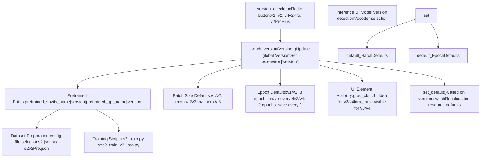
**版本特定的资源分配：**

`set_default()` 函数根据版本和 GPU 显存调整训练参数：

```
# 基于显存的 batch size 计算if version not in v3v4set:  # v1, v2, v2Pro, v2ProPlus    default_batch_size = minmem // 2    default_sovits_epoch = 8    default_sovits_save_every_epoch = 4else:  # v3, v4    default_batch_size = minmem // 8  # LoRA 使用更少显存    default_sovits_epoch = 2    default_sovits_save_every_epoch = 1
```
**版本检测与验证：**

启动时，WebUI 检查 Pretrained model (预训练模型) 是否存在：

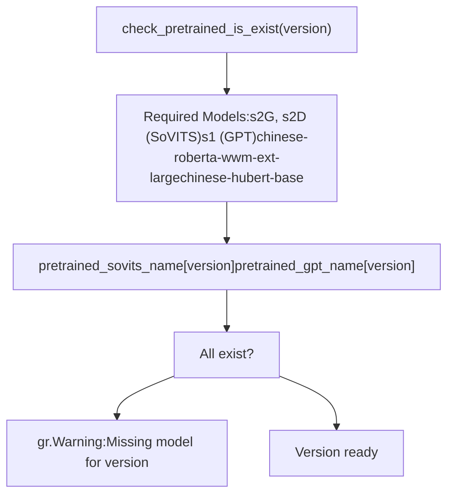
**来源：** [webui.py104-139](https://github.com/RVC-Boss/GPT-SoVITS/blob/c767f0b8/webui.py#L104-L139) [webui.py1264-1290](https://github.com/RVC-Boss/GPT-SoVITS/blob/c767f0b8/webui.py#L1264-L1290) [webui.py167-189](https://github.com/RVC-Boss/GPT-SoVITS/blob/c767f0b8/webui.py#L167-L189)

---

## 配置与资源管理 (Configuration and Resource Management)

Main WebUI 与 `config.py` 集成以获取系统范围的设置并管理 GPU 资源。

### 配置集成 (Configuration Integration)

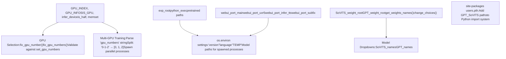
**GPU 分配策略：**

WebUI 使用两种 GPU 选择机制：

1.  **单 GPU 选择：** 适用于需要一个 GPU 的进程 (推理、去噪)

    -   `fix_gpu_number(input)`: 验证并限制在可用 GPU 范围内
    -   如果无效，则回退到 `default_gpu_numbers`
2.  **多 GPU 选择：** 适用于并行数据处理和训练

    -   格式："0-1-2" 表示 GPU 0、1 和 2
    -   每个 GPU 获得其自己的进程
    -   为每个进程设置 `_CUDA_VISIBLE_DEVICES` 环境变量

**模型权重发现：**

权重发现系统扫描目录并提供下拉选择：

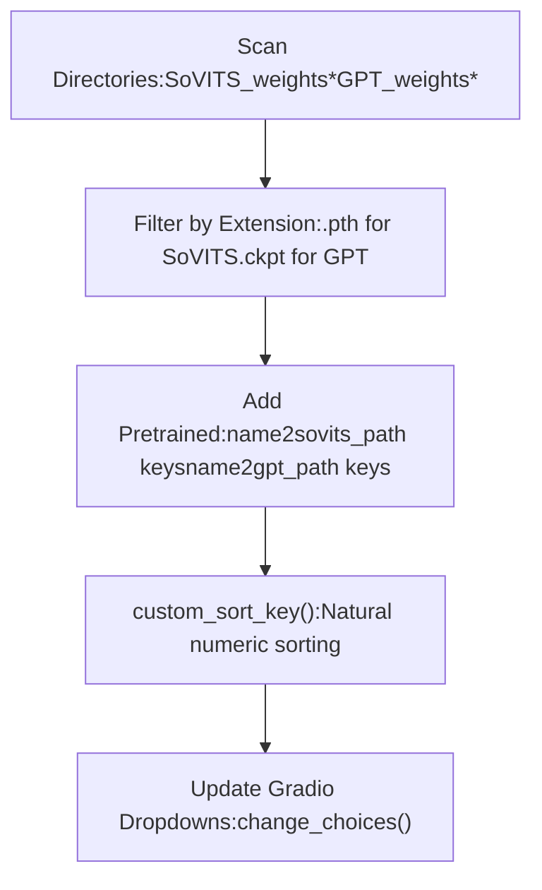
**来源：** [webui.py71-100](https://github.com/RVC-Boss/GPT-SoVITS/blob/c767f0b8/webui.py#L71-L100) [webui.py145-161](https://github.com/RVC-Boss/GPT-SoVITS/blob/c767f0b8/webui.py#L145-L161) [webui.py191-202](https://github.com/RVC-Boss/GPT-SoVITS/blob/c767f0b8/webui.py#L191-L202) [config.py86-121](https://github.com/RVC-Boss/GPT-SoVITS/blob/c767f0b8/config.py#L86-L121)

---

## 进程执行与环境设置 (Process Execution and Environment Setup)

Main WebUI 生成的每个子进程都遵循一致的执行模式，并带有仔细的环境配置。

### 子进程命令构建 (Subprocess Command Construction)

**示例：特征提取进程设置**

对于 `1-get-text.py` (BERT 特征提取)：

1.  **配置字典：**

    ```
    config = {    "inp_text": inp_text,    "inp_wav_dir": inp_wav_dir,    "exp_name": exp_name,    "opt_dir": f"{exp_root}/{exp_name}",    "bert_pretrained_dir": bert_pretrained_dir,    "i_part": "0",  # 进程索引    "all_parts": "3",  # 总进程数    "_CUDA_VISIBLE_DEVICES": "1",  # GPU 分配    "is_half": "True"}
    ```

2.  **环境更新：**

    ```
    os.environ.update(config)
    ```

3.  **命令构建：**

    ```
    cmd = '"%s" -s GPT_SoVITS/prepare_datasets/1-get-text.py' % python_exec
    ```

4.  **执行：**

    ```
    p = Popen(cmd, shell=True)ps1a.append(p)  # 跟踪进程
    ```


**训练进程配置：**

训练进程通过临时文件而非环境变量接收配置：

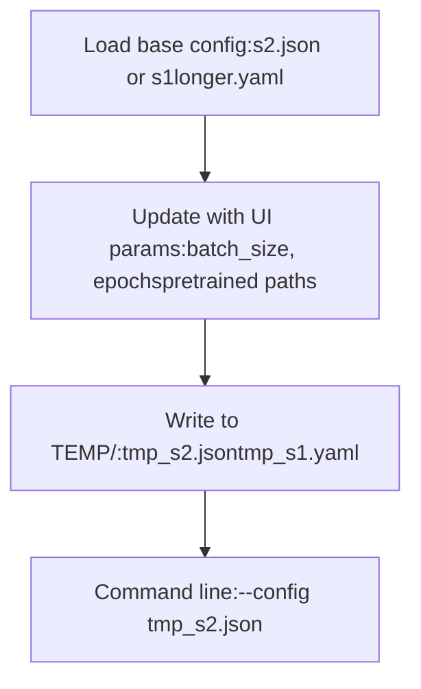
**来源：** [webui.py808-811](https://github.com/RVC-Boss/GPT-SoVITS/blob/c767f0b8/webui.py#L808-L811) [webui.py542-544](https://github.com/RVC-Boss/GPT-SoVITS/blob/c767f0b8/webui.py#L542-L544) [webui.py636](https://github.com/RVC-Boss/GPT-SoVITS/blob/c767f0b8/webui.py#L636-L636) [webui.py504-540](https://github.com/RVC-Boss/GPT-SoVITS/blob/c767f0b8/webui.py#L504-L540)

---

## UI 结构与状态管理 (UI Structure and State Management)

Main WebUI 使用 Gradio 的组件系统，并对进程控制进行仔细的状态管理。

### Gradio 应用结构 (Gradio Application Structure)

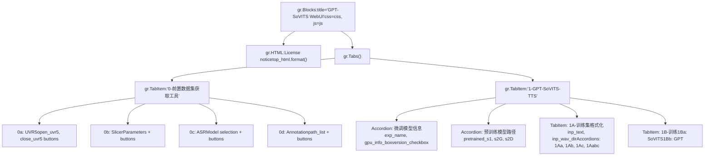
**按钮状态管理模式：**

每个进程控制使用成对的按钮，并具有可见性切换功能：

> **[Mermaid stateDiagram]**
> *(图表结构无法解析)*

**事件处理器 (Event Handlers)：**

所有按钮点击都使用 `.click()` 处理器，这些处理器会生成多个 UI 更新：

```
button_open.click(    open_function,    [input1, input2, ...],  # 输入组件    [info_box, button_open, button_close, output1, ...]  # 输出组件)
```
**更新字典格式：**

函数生成更新字典以修改 UI 组件：

```
yield (    "Process started",  # info_box 文本    {"__type__": "update", "visible": False},  # 隐藏打开按钮    {"__type__": "update", "visible": True},   # 显示关闭按钮    {"__type__": "update", "value": result}    # 更新输出)
```
**来源：** [webui.py1305-1650](https://github.com/RVC-Boss/GPT-SoVITS/blob/c767f0b8/webui.py#L1305-L1650) [webui.py270-295](https://github.com/RVC-Boss/GPT-SoVITS/blob/c767f0b8/webui.py#L270-L295) [webui.py545-571](https://github.com/RVC-Boss/GPT-SoVITS/blob/c767f0b8/webui.py#L545-L571)

---

## 国际化支持 (Internationalization Support)

Main WebUI 通过 i18n 系统支持多种语言，并具有动态语言选择功能。

### 语言系统集成 (Language System Integration)

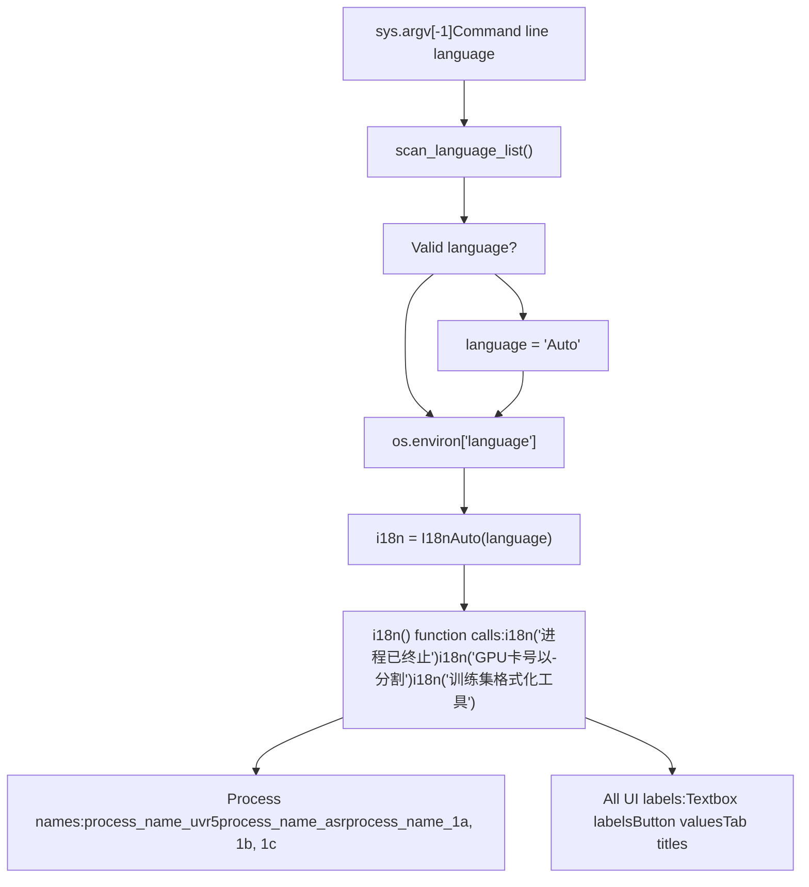
**进程状态消息：**

`process_info()` 函数翻译状态指示器：

| 指示器 | 中文示例 | 功能 |
| --- | --- | --- |
| "opened" | "已开启" | 进程已启动 |
| "closed" | "已关闭" | 进程已终止 |
| "running" | "运行中" | 进程正在执行 |
| "occupy" | "占用中,需先终止才能开启下一次任务" | 无法启动 (繁忙) |
| "finish" | "已完成" | 成功完成 |
| "failed" | "失败" | 执行失败 |

**来源：** [webui.py64-68](https://github.com/RVC-Boss/GPT-SoVITS/blob/c767f0b8/webui.py#L64-L68) [webui.py244-264](https://github.com/RVC-Boss/GPT-SoVITS/blob/c767f0b8/webui.py#L244-L264) [webui.py267](https://github.com/RVC-Boss/GPT-SoVITS/blob/c767f0b8/webui.py#L267-L267)

---

## 集成点 (Integration Points)

Main WebUI 作为一个中央枢纽，与所有其他系统组件集成。

### 系统集成图 (System Integration Map)

```mermaid
flowchart TD
    CoreUI["Process ManagementTab OrganizationVersion Control"]
    UVR5UI["tools/uvr5/webui.pyPort: 9873"]
    SubfixUI["tools/subfix_webui.pyPort: 9871"]
    InferUI["inference_webui.pyinference_webui_fast.pyPort: 9872"]
    GetText["1-get-text.pyBERT features"]
    GetHubert["2-get-hubert-wav32k.pySSL features"]
    GetSV["2-get-sv.pySpeaker embeddings"]
    GetSemantic["3-get-semantic.pySemantic tokens"]
    SliceAudio["slice_audio.pyAudio segmentation"]
    ASRScripts["tools/asr/*.pyFunASR/Whisper"]
    Denoise["cmd-denoise.pyNoise reduction"]
    S1Train["s1_train.pyGPT training"]
    S2Train["s2_train.pySoVITS v1/v2"]
    S2TrainLora["s2_train_v3_lora.pySoVITS v3/v4"]
    ConfigPy["config.pyGlobal settingsPath managementGPU detection"]
    WeightMgmt["Weight directories:SoVITS_weights_*GPT_weights_*"]
    PretrainedMgmt["pretrained_models/Base modelsBERT, HuBERT"]
    MyUtils["tools/my_utils.pyclean_path()check_for_existance()"]
    ProcessCkpt["process_ckpt.pyVersion detectionModel loading"]
    I18nSystem["tools/i18n/Multi-language support"]

    CoreUI --> UVR5UI
    CoreUI --> SubfixUI
    CoreUI --> InferUI
    CoreUI --> GetText
    CoreUI --> GetHubert
    CoreUI --> GetSV
    CoreUI --> GetSemantic
    CoreUI --> SliceAudio
    CoreUI --> ASRScripts
    CoreUI --> Denoise
    CoreUI --> S1Train
    CoreUI --> S2Train
    CoreUI --> S2TrainLora
    CoreUI --> ConfigPy
    CoreUI --> MyUtils
    CoreUI --> I18nSystem
    ConfigPy --> WeightMgmt
    ConfigPy --> PretrainedMgmt
    S1Train --> WeightMgmt
    S2Train --> WeightMgmt
    S2TrainLora --> WeightMgmt
```
**端口分配：**

| 界面 | 端口 | 配置变量 |
| --- | --- | --- |
| Main WebUI | 9874 | `webui_port_main` |
| Inference WebUI | 9872 | `webui_port_infer_tts` |
| UVR5 WebUI | 9873 | `webui_port_uvr5` |
| Annotation WebUI | 9871 | `webui_port_subfix` |
| REST API | 9880 | `api_port` |

**跨组件通信：**

1.  **模型权重更新：** 训练完成后，`change_choices()` 扫描权重目录并更新推理 UI 下拉菜单

2.  **环境变量传递：** 推理 WebUI 通过环境变量接收模型路径：

    ```
    os.environ["gpt_path"] = gpt_pathos.environ["sovits_path"] = sovits_pathos.environ["cnhubert_base_path"] = cnhubert_base_path
    ```

3.  **临时文件通信：** 训练脚本通过 `TEMP/` 中的临时 JSON/YAML 文件接收配置

4.  **基于文件的输出：** 数据处理脚本写入实验目录 (`logs/exp_name/`)，训练脚本从中读取


**来源：** [webui.py331-363](https://github.com/RVC-Boss/GPT-SoVITS/blob/c767f0b8/webui.py#L331-L363) [config.py140-146](https://github.com/RVC-Boss/GPT-SoVITS/blob/c767f0b8/config.py#L140-L146) [webui.py556-562](https://github.com/RVC-Boss/GPT-SoVITS/blob/c767f0b8/webui.py#L556-L562)

---

## 总结 (Summary)

Main WebUI (`webui.py`) 通过以下方式为整个 GPT-SoVITS 工作流提供集中编排：

-   **进程管理 (Process Management)：** 全局变量跟踪生成的子进程，具有一致的打开/关闭模式和资源清理
-   **基于标签页的组织 (Tab-Based Organization)：** 标签页 0 用于数据准备工具，标签页 1 用于数据集格式化和训练
-   **版本控制 (Version Control)：** 统一的版本选择用于调整路径、资源分配和训练脚本
-   **多 GPU 支持 (Multi-GPU Support)：** 为数据准备并行生成进程，并带有特定于 GPU 的环境配置
-   **配置集成 (Configuration Integration)：** 与 `config.py` 深度集成，用于系统范围的设置和模型发现
-   **子进程协调 (Subprocess Coordination)：** 标准化的命令构建、环境设置和进程生命周期管理

Main WebUI 专为训练工作流而设计。模型训练完成后，使用 Inference WebUI 进行交互式生成，或使用 REST API 进行程序化访问。
