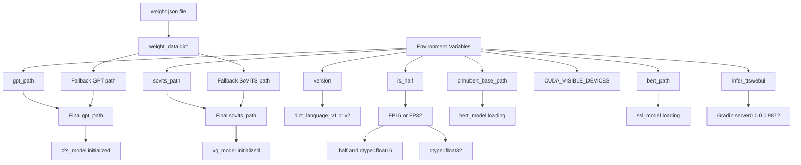
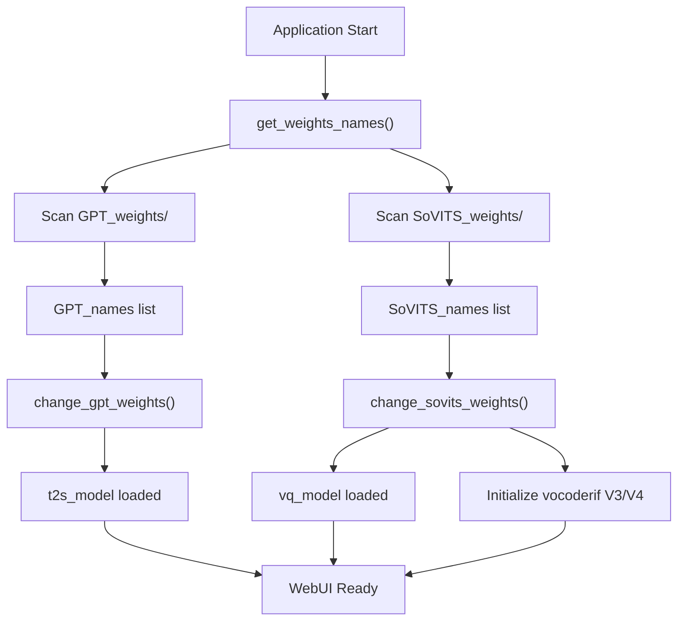
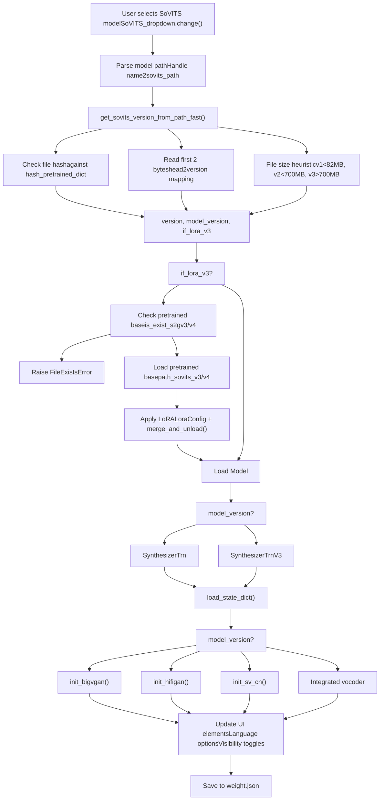
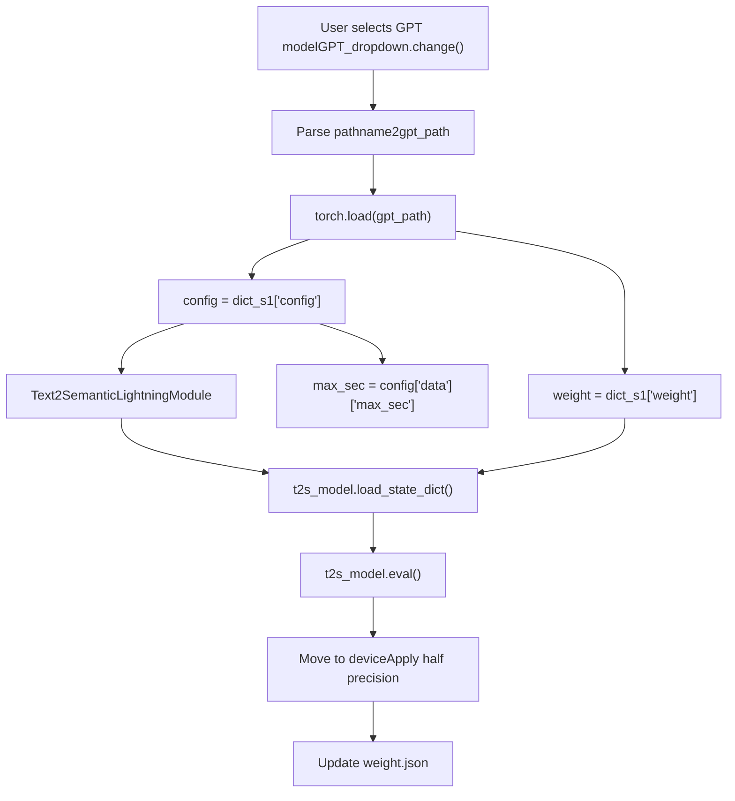
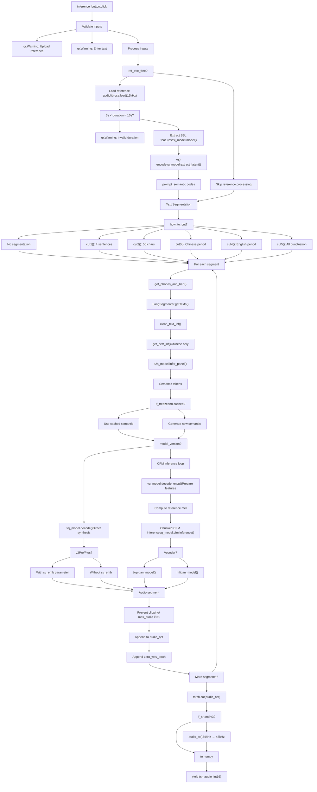
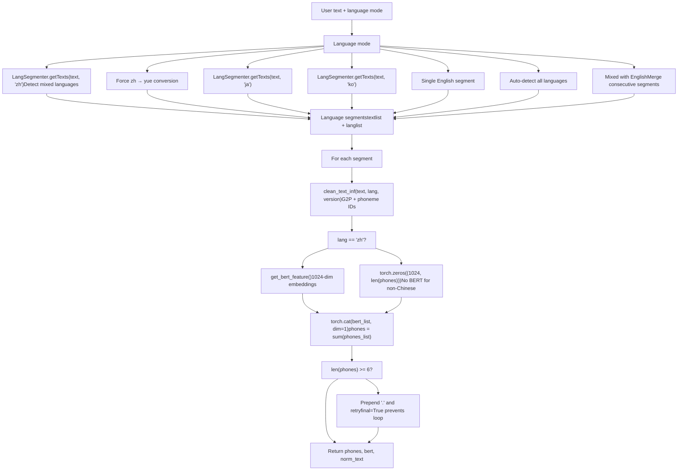
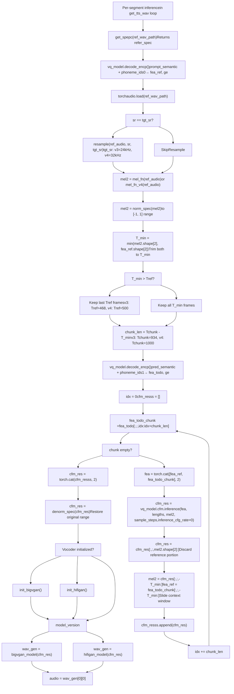
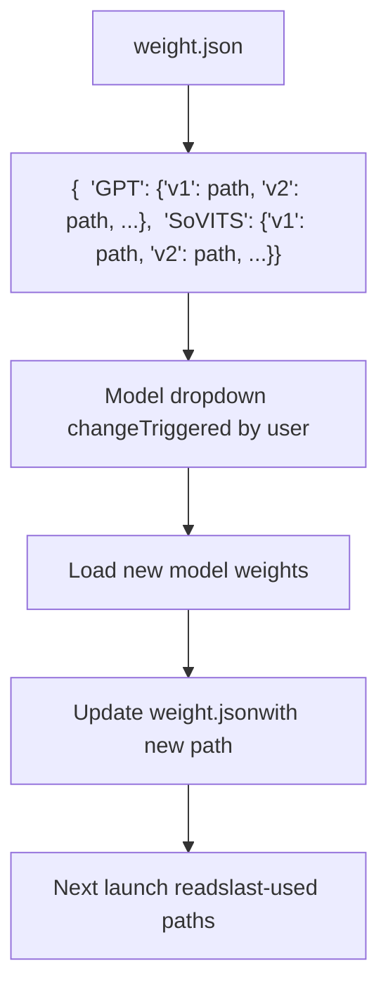
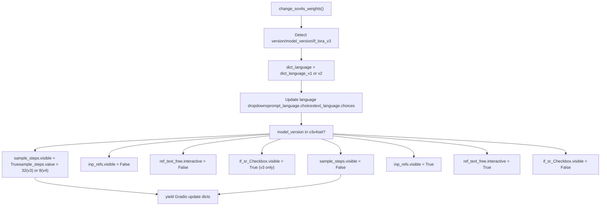
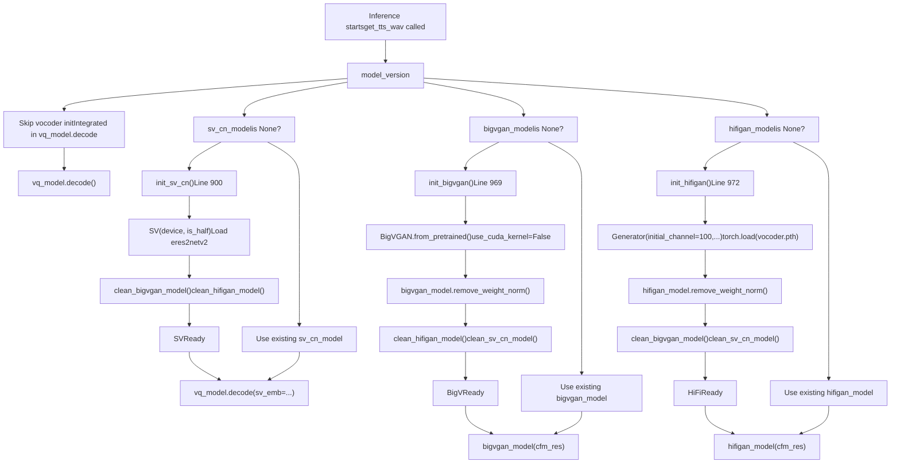

# Inference WebUI (推理 WebUI)

相关源文件

-   [GPT\_SoVITS/inference\_webui.py](https://github.com/RVC-Boss/GPT-SoVITS/blob/c767f0b8/GPT_SoVITS/inference_webui.py)
-   [GPT\_SoVITS/inference\_webui\_fast.py](https://github.com/RVC-Boss/GPT-SoVITS/blob/c767f0b8/GPT_SoVITS/inference_webui_fast.py)
-   [GPT\_SoVITS/process\_ckpt.py](https://github.com/RVC-Boss/GPT-SoVITS/blob/c767f0b8/GPT_SoVITS/process_ckpt.py)
-   [tools/assets.py](https://github.com/RVC-Boss/GPT-SoVITS/blob/c767f0b8/tools/assets.py)

Inference WebUI 是一个专门用于 TTS generation (TTS 生成) 的基于 Gradio 的界面，与综合性的 [Main WebUI](/RVC-Boss/GPT-SoVITS/3.1-main-webui) 分开。它提供了一种流线化的体验，专门专注于使用已训练的 GPT-SoVITS 模型进行推理。用户可以上传 Reference audio (参考音频)，配置 Synthesis parameters (合成参数)，并生成语音，而无需具备训练功能。

该界面充当交互式前端，而程序化访问可通过 [REST API](/RVC-Boss/GPT-SoVITS/3.3-rest-api) 获得。底层的推理实现记录在 [TTS 推理过程](/RVC-Boss/GPT-SoVITS/7.1-tts-inference-process) 中。

## 概览与架构 (Overview and Architecture)

GPT-SoVITS 提供了两种具有不同架构理念的推理 WebUI 实现：

### 架构比较：直接 vs 流水线 (Architecture Comparison: Direct vs Pipeline)


**来源：** [GPT\_SoVITS/inference\_webui.py1-220](https://github.com/RVC-Boss/GPT-SoVITS/blob/c767f0b8/GPT_SoVITS/inference_webui.py#L1-L220) [GPT\_SoVITS/inference\_webui\_fast.py1-148](https://github.com/RVC-Boss/GPT-SoVITS/blob/c767f0b8/GPT_SoVITS/inference_webui_fast.py#L1-L148) [TTS\_infer\_pack/TTS.py](https://github.com/RVC-Boss/GPT-SoVITS/blob/c767f0b8/TTS_infer_pack/TTS.py)

**实现选择指南：**

| 维度 | inference\_webui.py | inference\_webui\_fast.py |
| --- | --- | --- |
| **代码组织** | 模型加载为全局变量 | 封装在 `TTS` 类中 |
| **推理逻辑** | 内联在 `get_tts_wav()` 中 [751-1001](https://github.com/RVC-Boss/GPT-SoVITS/blob/c767f0b8/751-1001) | 委派给 `tts_pipeline.run()` [198-199](https://github.com/RVC-Boss/GPT-SoVITS/blob/c767f0b8/198-199) |
| **模型加载** | 手动 `torch.load()` + `load_state_dict()` [281-342](https://github.com/RVC-Boss/GPT-SoVITS/blob/c767f0b8/281-342) | `tts_pipeline.init_vits_weights()` [279](https://github.com/RVC-Boss/GPT-SoVITS/blob/c767f0b8/279) |
| **定制化** | 直接访问所有模型操作 | 受 `TTS` API 表面限制 |
| **维护** | 需要理解完整的推理流 | 更高层级的抽象 |
| **适用场景** | 调试、研究、自定义修改 | 生产部署、标准推理 |
| **代码大小** | 约 1350 行 | 约 520 行 |

建议大多数用户使用 fast 实现。标准实现为需要自定义推理逻辑的高级用例提供了更底层的访问。

## 应用初始化 (Application Initialization)

### 启动配置流 (Startup Configuration Flow)


**来源：** [GPT\_SoVITS/inference\_webui.py45-92](https://github.com/RVC-Boss/GPT-SoVITS/blob/c767f0b8/GPT_SoVITS/inference_webui.py#L45-L92) [GPT\_SoVITS/inference\_webui.py163-169](https://github.com/RVC-Boss/GPT-SoVITS/blob/c767f0b8/GPT_SoVITS/inference_webui.py#L163-L169) [GPT\_SoVITS/inference\_webui\_fast.py45-148](https://github.com/RVC-Boss/GPT-SoVITS/blob/c767f0b8/GPT_SoVITS/inference_webui_fast.py#L45-L148)

**配置优先级：**

1.  Environment variables (环境变量) (最高)
2.  `weight.json` 持久化路径
3.  来自 `get_weights_names()` 扫描的默认值

**关键初始化步骤：**

-   `set_high_priority()` [12-22](https://github.com/RVC-Boss/GPT-SoVITS/blob/c767f0b8/12-22): 在 Windows 上设置进程优先级
-   `get_weights_names()` [49](https://github.com/RVC-Boss/GPT-SoVITS/blob/c767f0b8/49): 扫描 `GPT_weights/` 和 `SoVITS_weights/` 目录
-   `change_gpt_weights(gpt_path)` [376-398](https://github.com/RVC-Boss/GPT-SoVITS/blob/c767f0b8/376-398): 加载 GPT Checkpoint (检查点)
-   `change_sovits_weights(sovits_path)` [229-368](https://github.com/RVC-Boss/GPT-SoVITS/blob/c767f0b8/229-368): 加载 SoVITS 模型并初始化声码器 (Vocoder)

### 启动时的模型加载 (Model Loading on Startup)


**来源：** [GPT\_SoVITS/inference\_webui.py376-400](https://github.com/RVC-Boss/GPT-SoVITS/blob/c767f0b8/GPT_SoVITS/inference_webui.py#L376-L400) [GPT\_SoVITS/inference\_webui\_fast.py125-148](https://github.com/RVC-Boss/GPT-SoVITS/blob/c767f0b8/GPT_SoVITS/inference_webui_fast.py#L125-L148) [config.py](https://github.com/RVC-Boss/GPT-SoVITS/blob/c767f0b8/config.py)

## Gradio 界面结构 (Gradio Interface Structure)

### 主界面布局 (Main Interface Layout)

Gradio 界面被组织为四个主要部分：

**来源：** [GPT\_SoVITS/inference\_webui.py1134-1327](https://github.com/RVC-Boss/GPT-SoVITS/blob/c767f0b8/GPT_SoVITS/inference_webui.py#L1134-L1327) [GPT\_SoVITS/inference\_webui\_fast.py306-480](https://github.com/RVC-Boss/GPT-SoVITS/blob/c767f0b8/GPT_SoVITS/inference_webui_fast.py#L306-L480)

### 界面组件细节 (Interface Component Details)

| 组件 | 类型 | 目的 | 关键参数 |
| --- | --- | --- | --- |
| `GPT_dropdown` | 下拉菜单 | 选择 GPT 检查点 | 按 `custom_sort_key()` 排序 |
| `SoVITS_dropdown` | 下拉菜单 | 选择 SoVITS 检查点 | 自动更新语言选项 |
| `inp_ref` | 音频 | 上传参考音频 | 强制 3-10 秒范围 |
| `prompt_text` | 文本框 | 参考音频转录文本 | 行数：5，在推理中验证 |
| `ref_text_free` | 复选框 | 启用无提示模式 | 对 V3/V4 模型禁用 |
| `inp_refs` | 文件 | 多个参考音频 | 对 V3/V4 隐藏，平均融合 |
| `text` | 文本框 | 目标合成文本 | 行数：26，支持换行 |
| `how_to_cut` | 下拉菜单 | 文本切分 (Text segmentation) 方法 | 来自 `cut1` 到 `cut5` 的 6 个选项 |
| `sample_steps` | 单选框 | CFM 采样步数 V3/V4 | V3: \[4,8,16,32,64,128\], V4: \[4,8,16,32\] |
| `if_sr_Checkbox` | 复选框 | 超分辨率 (Super-resolution) 24→48kHz | 仅限 V3，可选 |

## 模型加载与切换 (Model Loading and Switching)

### SoVITS 模型加载过程 (SoVITS Model Loading Process)


**来源：** [GPT\_SoVITS/inference\_webui.py229-368](https://github.com/RVC-Boss/GPT-SoVITS/blob/c767f0b8/GPT_SoVITS/inference_webui.py#L229-L368) [GPT\_SoVITS/process\_ckpt.py100-139](https://github.com/RVC-Boss/GPT-SoVITS/blob/c767f0b8/GPT_SoVITS/process_ckpt.py#L100-L139)

关键函数：

-   **`change_sovits_weights(sovits_path)`** [inference\_webui.py229-368](https://github.com/RVC-Boss/GPT-SoVITS/blob/c767f0b8/inference_webui.py#L229-L368): 主编排函数
-   **`get_sovits_version_from_path_fast()`** [process\_ckpt.py100-126](https://github.com/RVC-Boss/GPT-SoVITS/blob/c767f0b8/process_ckpt.py#L100-L126): 通过哈希 (Hash)/头部/大小确定版本
-   **`load_sovits_new()`** [process\_ckpt.py129-138](https://github.com/RVC-Boss/GPT-SoVITS/blob/c767f0b8/process_ckpt.py#L129-L138): 处理自定义头部格式

### 版本检测策略 (Version Detection Strategy)

| 方法 | 检查项 | 版本结果 |
| --- | --- | --- |
| Hash lookup (哈希查找) | 前 8KB 的 MD5 哈希 | 精确识别预训练模型 |
| Header bytes (头部字节) | 前 2 个字节 | `b"03"`→v3 LoRA, `b"04"`→v4 LoRA, `b"05"`→v2Pro |
| File size (文件大小) | 总字节数 | <82MB→v1, <700MB→v2, >700MB→v3 |

**来源：** [GPT\_SoVITS/process\_ckpt.py72-126](https://github.com/RVC-Boss/GPT-SoVITS/blob/c767f0b8/GPT_SoVITS/process_ckpt.py#L72-L126)

### GPT 模型加载 (GPT Model Loading)


**来源：** [GPT\_SoVITS/inference\_webui.py376-398](https://github.com/RVC-Boss/GPT-SoVITS/blob/c767f0b8/GPT_SoVITS/inference_webui.py#L376-L398) [GPT\_SoVITS/inference\_webui\_fast.py300-304](https://github.com/RVC-Boss/GPT-SoVITS/blob/c767f0b8/GPT_SoVITS/inference_webui_fast.py#L300-L304)

GPT 模型使用包含以下内容的检查点字典：

-   `config`: 训练配置，包括 `max_sec` 时长限制
-   `weight`: 模型状态字典 (State dictionary)

## 推理过程 (Inference Process)

### 端到端 TTS 生成流 (End-to-End TTS Generation Flow)


**来源：** [GPT\_SoVITS/inference\_webui.py751-1001](https://github.com/RVC-Boss/GPT-SoVITS/blob/c767f0b8/GPT_SoVITS/inference_webui.py#L751-L1001) [GPT\_SoVITS/inference\_webui\_fast.py150-202](https://github.com/RVC-Boss/GPT-SoVITS/blob/c767f0b8/GPT_SoVITS/inference_webui_fast.py#L150-L202)

### 文本切分方法 (Text Segmentation Methods)

`how_to_cut` 下拉菜单控制如何将长输入文本切分为易于管理的片段进行合成：

| UI 标签 | 函数 | 实现逻辑 |
| --- | --- | --- |
| 不切 | 不切分 (No segmentation) | 文本作为单个片段处理 |
| 凑四句一切 | `cut1()` [1023-1035](https://github.com/RVC-Boss/GPT-SoVITS/blob/c767f0b8/1023-1035) | 对标点符号进行 `split()` → 每 4 个片段一组 → `merge_short_text_in_array()` |
| 凑50字一切 | `cut2()` [1038-1060](https://github.com/RVC-Boss/GPT-SoVITS/blob/c767f0b8/1038-1060) | 累积字符直到超过 50 个 → 如果最后一个少于 50 则合并 |
| 按中文句号。切 | `cut3()` [1063-1067](https://github.com/RVC-Boss/GPT-SoVITS/blob/c767f0b8/1063-1067) | `inp.strip("。").split("。")` |
| 按英文句号.切 | `cut4()` [1070-1074](https://github.com/RVC-Boss/GPT-SoVITS/blob/c767f0b8/1070-1074) | `re.split(r"(?<!\d)\.(?!\d)")` (排除小数点) |
| 按标点符号切 | `cut5()` [1078-1099](https://github.com/RVC-Boss/GPT-SoVITS/blob/c767f0b8/1078-1099) | 在任何标点符号处拆分，保留小数点 |

**过滤：** 所有方法都会通过 `set(item).issubset(punctuation)` 移除仅包含标点符号的片段 [1034, 1059, 1066, 1073, 1098](https://github.com/RVC-Boss/GPT-SoVITS/blob/c767f0b8/1034, 1059, 1066, 1073, 1098)

**处理流程：**

1.  用户文本通过选定的 cut 函数
2.  结果在 `\n` 处拆分 → `texts.split("\n")` [844](https://github.com/RVC-Boss/GPT-SoVITS/blob/c767f0b8/844)
3.  空片段由 `process_text()` 过滤 [1110-1119](https://github.com/RVC-Boss/GPT-SoVITS/blob/c767f0b8/1110-1119)
4.  短片段由 `merge_short_text_in_array(texts, 5)` 合并 [846](https://github.com/RVC-Boss/GPT-SoVITS/blob/c767f0b8/846)

**来源：** [GPT\_SoVITS/inference\_webui.py831-846](https://github.com/RVC-Boss/GPT-SoVITS/blob/c767f0b8/GPT_SoVITS/inference_webui.py#L831-L846) [GPT\_SoVITS/inference\_webui.py1004-1119](https://github.com/RVC-Boss/GPT-SoVITS/blob/c767f0b8/GPT_SoVITS/inference_webui.py#L1004-L1119) [TTS\_infer\_pack/text\_segmentation\_method.py](https://github.com/RVC-Boss/GPT-SoVITS/blob/c767f0b8/TTS_infer_pack/text_segmentation_method.py)

### 语言处理流水线 (Language Processing Pipeline)


**来源：** [GPT\_SoVITS/inference\_webui.py601-667](https://github.com/RVC-Boss/GPT-SoVITS/blob/c767f0b8/GPT_SoVITS/inference_webui.py#L601-L667) [text/LangSegmenter.py](https://github.com/RVC-Boss/GPT-SoVITS/blob/c767f0b8/text/LangSegmenter.py)

关键观察：BERT 特征**仅对中文文本提取** (`lang == "zh"`)。所有其他语言都接收零填充的张量 (Tensor)。

## 参数调优指南 (Parameter Tuning Guide)

### GPT 采样参数 (GPT Sampling Parameters)

这些参数控制 `t2s_model.model.infer_panel()` 中的 GPT 模型语义令牌 (Semantic tokens) 生成 [878-888](https://github.com/RVC-Boss/GPT-SoVITS/blob/c767f0b8/878-888)：

| 参数 | 范围 | 默认值 | 目的 | 调优建议 |
| --- | --- | --- | --- | --- |
| `top_k` | 1-100 | 15-20 | 限制令牌采样池 | 越低 = 越确定，越高 = 越多样化 |
| `top_p` | 0.0-1.0 | 0.6-1.0 | Nucleus sampling (核采样) 截止值 | 越低 = 令牌越安全，越高 = 越冒险 |
| `temperature` | 0.0-1.0 | 0.6-1.0 | 采样分布的锐度 | 越低 = 稳定，越高 = 更有创意但不稳定 |
| `repetition_penalty` | 0.0-2.0 | 1.35 | 惩罚重复的令牌 | 仅限 fast 模式；如果出现口吃，请增加此值 |

**无参考模式警告：** 当 `ref_text_free=True` 时，避免使用非常低的值 (top\_k<5, top\_p<0.4, temperature<0.4)，因为 GPT 缺乏来自提示上下文的引导 [1271](https://github.com/RVC-Boss/GPT-SoVITS/blob/c767f0b8/1271)

### 合成控制参数 (Synthesis Control Parameters)

| 参数 | 范围 | 默认值 | 目的 | 备注 |
| --- | --- | --- | --- | --- |
| `speed` | 0.6-1.65 | 1.0 | 播放速度倍率 | 通过音频重采样应用 [917, 921](https://github.com/RVC-Boss/GPT-SoVITS/blob/c767f0b8/917, 921) |
| `pause_second` | 0.1-0.5 | 0.3 | 片段间静音时长 | 创建 `zero_wav_torch` 缓冲区 [802-810](https://github.com/RVC-Boss/GPT-SoVITS/blob/c767f0b8/802-810) |
| `sample_steps` | v3: \[4,8,16,32,64,128\]
v4: \[4,8,16,32\] | v3: 32
v4: 8 | CFM 采样迭代次数 | 越高 = 质量越好但越慢 [958-960](https://github.com/RVC-Boss/GPT-SoVITS/blob/c767f0b8/958-960) |
| `if_sr` | 布尔值 | False | 超分辨率 24→48kHz | 仅限 v3；有助于解决输出沉闷的问题 [993-998](https://github.com/RVC-Boss/GPT-SoVITS/blob/c767f0b8/993-998) |
| `if_freeze` | 布尔值 | False | 缓存语义令牌 | 允许在不重新运行 GPT 的情况下尝试合成参数 [874-890](https://github.com/RVC-Boss/GPT-SoVITS/blob/c767f0b8/874-890) |

**来源：** [GPT\_SoVITS/inference\_webui.py751-1001](https://github.com/RVC-Boss/GPT-SoVITS/blob/c767f0b8/GPT_SoVITS/inference_webui.py#L751-L1001) [GPT\_SoVITS/inference\_webui.py1250-1280](https://github.com/RVC-Boss/GPT-SoVITS/blob/c767f0b8/GPT_SoVITS/inference_webui.py#L1250-L1280) [GPT\_SoVITS/inference\_webui\_fast.py372-396](https://github.com/RVC-Boss/GPT-SoVITS/blob/c767f0b8/GPT_SoVITS/inference_webui_fast.py#L372-L396)

### V3/V4 CFM 推理流 (V3/V4 CFM Inference Flow)

模型 v3 和 v4 使用带有外部声码器的 Conditional Flow Matching (CFM, 条件流匹配)，而不是集成合成：


**来源：** [GPT\_SoVITS/inference\_webui.py923-976](https://github.com/RVC-Boss/GPT-SoVITS/blob/c767f0b8/GPT_SoVITS/inference_webui.py#L923-L976)

**关键常量：**

| 版本 | Tref (参考帧) | Tchunk (总块) | chunk\_len | 采样率 | Mel 函数 |
| --- | --- | --- | --- | --- | --- |
| v3 | 468 | 934 | 466 | 24kHz | `mel_fn()` [684-696](https://github.com/RVC-Boss/GPT-SoVITS/blob/c767f0b8/684-696) |
| v4 | 500 | 1000 | 500 | 32kHz | `mel_fn_v4()` [697-709](https://github.com/RVC-Boss/GPT-SoVITS/blob/c767f0b8/697-709) |

**分块策略 (Chunking Strategy)：**

-   **fea\_ref**: 来自前一个块的上下文 (最后 T\_min 帧)
-   **fea\_todo\_chunk**: 要合成的新内容 (chunk\_len 帧)
-   **mel2**: 用于条件的 Mel 频谱图上下文
-   Sliding window (滑动窗口) 保持长序列的一致性

**CFM 参数：**

-   `sample_steps` [958](https://github.com/RVC-Boss/GPT-SoVITS/blob/c767f0b8/958): ODE 积分步数 (v3: 4-128, v4: 4-32)
-   `inference_cfg_rate=0` [959](https://github.com/RVC-Boss/GPT-SoVITS/blob/c767f0b8/959): 禁用了 Classifier-free guidance

## 参数持久化与缓存 (Parameter Persistence and Caching)

### 权重持久化 (Weight Persistence)


**来源：** [GPT\_SoVITS/inference\_webui.py57-71](https://github.com/RVC-Boss/GPT-SoVITS/blob/c767f0b8/GPT_SoVITS/inference_webui.py#L57-L71) [GPT\_SoVITS/inference\_webui.py362-367](https://github.com/RVC-Boss/GPT-SoVITS/blob/c767f0b8/GPT_SoVITS/inference_webui.py#L362-L367)

`weight.json` 文件按版本存储最近使用的模型路径，允许 WebUI 在重新启动时恢复前一会话的模型选择。

### 推理结果缓存 (Inference Result Caching)

`if_freeze` 复选框支持缓存 GPT 生成的语义令牌：

```
cache = {}  # 全局缓存字典 # 在 get_tts_wav() 中：if i_text in cache and if_freeze == True:    pred_semantic = cache[i_text]  # 使用缓存结果else:    # 生成新的语义令牌    pred_semantic, idx = t2s_model.model.infer_panel(...)    cache[i_text] = pred_semantic  # 存储以备后用
```
**来源：** [GPT\_SoVITS/inference\_webui.py748-890](https://github.com/RVC-Boss/GPT-SoVITS/blob/c767f0b8/GPT_SoVITS/inference_webui.py#L748-L890)

这允许用户仅调整 SoVITS 参数 (速度、声码器等) 而不重新运行昂贵的 GPT 推理，对于参数实验非常有用。

## UI 状态管理 (UI State Management)

### 动态 UI 更新 (Dynamic UI Updates)

SoVITS 模型的更改会触发多个 UI 更新：


**来源：** [GPT\_SoVITS/inference\_webui.py256-279](https://github.com/RVC-Boss/GPT-SoVITS/blob/c767f0b8/GPT_SoVITS/inference_webui.py#L256-L279) [GPT\_SoVITS/inference\_webui\_fast.py260-276](https://github.com/RVC-Boss/GPT-SoVITS/blob/c767f0b8/GPT_SoVITS/inference_webui_fast.py#L260-L276)

这确保了 UI 控件与模型能力相匹配：

-   V3/V4 需要 `sample_steps` 配置
-   V3/V4 不支持多个参考音频 (`inp_refs`)
-   V3/V4 不支持无参考文本模式
-   V3 支持超分辨率 (Super-resolution)

## 声码器管理 (Vocoder Management)

不同的模型版本需要不同的声码器和辅助模型：

### 模型版本要求 (Model Version Requirements)

| 模型版本 | 声码器类型 | 初始化函数 | 模型路径 | 输出采样率 |
| --- | --- | --- | --- | --- |
| v1 | 集成 (Integrated) | None | 不适用 (在 SynthesizerTrn 中) | 32kHz |
| v2 | 集成 (Integrated) | None | 不适用 (在 SynthesizerTrn 中) | 32kHz |
| v2Pro | 集成 + SV | `init_sv_cn()` [491-495](https://github.com/RVC-Boss/GPT-SoVITS/blob/c767f0b8/491-495) | `pretrained_eres2netv2w24s4ep4.ckpt` | 32kHz |
| v2ProPlus | 集成 + SV | `init_sv_cn()` [491-495](https://github.com/RVC-Boss/GPT-SoVITS/blob/c767f0b8/491-495) | `pretrained_eres2netv2w24s4ep4.ckpt` | 32kHz |
| v3 | BigVGAN v2 | `init_bigvgan()` [440-456](https://github.com/RVC-Boss/GPT-SoVITS/blob/c767f0b8/440-456) | `models--nvidia--bigvgan_v2_24khz_100band_256x` | 24kHz |
| v4 | HiFi-GAN v4 | `init_hifigan()` [459-485](https://github.com/RVC-Boss/GPT-SoVITS/blob/c767f0b8/459-485) | `gsv-v4-pretrained/vocoder.pth` | 48kHz |

**来源：** [GPT\_SoVITS/inference\_webui.py440-504](https://github.com/RVC-Boss/GPT-SoVITS/blob/c767f0b8/GPT_SoVITS/inference_webui.py#L440-L504)

### 延迟初始化策略 (Lazy Initialization Strategy)


**来源：** [GPT\_SoVITS/inference\_webui.py895-976](https://github.com/RVC-Boss/GPT-SoVITS/blob/c767f0b8/GPT_SoVITS/inference_webui.py#L895-L976)

### 内存管理函数 (Memory Management Functions)

声码器清理函数确保只有一个声码器占用 GPU 内存：

```
def clean_bigvgan_model():  # 第 418-426 行    global bigvgan_model    if bigvgan_model:        bigvgan_model = bigvgan_model.cpu()        bigvgan_model = None        torch.cuda.empty_cache() def clean_hifigan_model():  # 第 407-415 行    # 类似的模式 def clean_sv_cn_model():  # 第 429-437 行    # 类似的模式，将 embedding_model 移动到 CPU
```
**清理触发点：**

-   `init_bigvgan()` 调用 `clean_hifigan_model()` + `clean_sv_cn_model()` [451-452](https://github.com/RVC-Boss/GPT-SoVITS/blob/c767f0b8/451-452)
-   `init_hifigan()` 调用 `clean_bigvgan_model()` + `clean_sv_cn_model()` [480-481](https://github.com/RVC-Boss/GPT-SoVITS/blob/c767f0b8/480-481)
-   `init_sv_cn()` 调用 `clean_bigvgan_model()` + `clean_hifigan_model()` [494-495](https://github.com/RVC-Boss/GPT-SoVITS/blob/c767f0b8/494-495)

这种互斥机制防止了多个声码器同时运行。

## 实现比较 (Implementation Comparison)

### 特性矩阵 (Feature Matrix)

| 特性 | inference\_webui.py | inference\_webui\_fast.py |
| --- | --- | --- |
| **模型加载** | 手动 `torch.load()` [381](https://github.com/RVC-Boss/GPT-SoVITS/blob/c767f0b8/381) | `tts_pipeline.init_vits_weights()` [279](https://github.com/RVC-Boss/GPT-SoVITS/blob/c767f0b8/279) |
| **版本检测** | `get_sovits_version_from_path_fast()` [233](https://github.com/RVC-Boss/GPT-SoVITS/blob/c767f0b8/233) | 相同 [237](https://github.com/RVC-Boss/GPT-SoVITS/blob/c767f0b8/237) |
| **BERT 提取** | `get_bert_feature()` [171-184](https://github.com/RVC-Boss/GPT-SoVITS/blob/c767f0b8/171-184) | 在 `TTS.run()` 内部 |
| **SSL 提取** | `ssl_model.model()` [823](https://github.com/RVC-Boss/GPT-SoVITS/blob/c767f0b8/823) | 在 `TTS.run()` 内部 |
| **文本切分** | `cut1()`\-`cut5()` [1023-1099](https://github.com/RVC-Boss/GPT-SoVITS/blob/c767f0b8/1023-1099) | `get_method(cut_method)` [509](https://github.com/RVC-Boss/GPT-SoVITS/blob/c767f0b8/509) |
| **GPT 推理** | `t2s_model.model.infer_panel()` [878](https://github.com/RVC-Boss/GPT-SoVITS/blob/c767f0b8/878) | 在 `TTS.run()` 内部 |
| **v1/v2 解码** | `vq_model.decode()` [916-922](https://github.com/RVC-Boss/GPT-SoVITS/blob/c767f0b8/916-922) | 在 `TTS.run()` 内部 |
| **v3/v4 CFM** | 内联循环 [952-976](https://github.com/RVC-Boss/GPT-SoVITS/blob/c767f0b8/952-976) | 在 `TTS.run()` 内部 |
| **缓存 (Caching)** | 手动 `cache[i_text]` 字典 [748, 874-890](https://github.com/RVC-Boss/GPT-SoVITS/blob/c767f0b8/748, 874-890) | 不支持 |
| **Streaming (流式处理)** | 单次生成结果 [1001](https://github.com/RVC-Boss/GPT-SoVITS/blob/c767f0b8/1001) | 每个片段一个生成器 [198-199](https://github.com/RVC-Boss/GPT-SoVITS/blob/c767f0b8/198-199) |
| **并行推理** | 不支持 | `parallel_infer` 参数 [419](https://github.com/RVC-Boss/GPT-SoVITS/blob/c767f0b8/419) |
| **种子控制 (Seed control)** | 不支持 | `seed` 和 `keep_random` [428-429](https://github.com/RVC-Boss/GPT-SoVITS/blob/c767f0b8/428-429) |
| **重复惩罚** | 不支持 | GPT 参数 [394](https://github.com/RVC-Boss/GPT-SoVITS/blob/c767f0b8/394) |
| **代码行数** | 约 1350 | 约 520 |

**来源：** [GPT\_SoVITS/inference\_webui.py1-1350](https://github.com/RVC-Boss/GPT-SoVITS/blob/c767f0b8/GPT_SoVITS/inference_webui.py#L1-L1350) [GPT\_SoVITS/inference\_webui\_fast.py1-524](https://github.com/RVC-Boss/GPT-SoVITS/blob/c767f0b8/GPT_SoVITS/inference_webui_fast.py#L1-L524) [TTS\_infer\_pack/TTS.py](https://github.com/RVC-Boss/GPT-SoVITS/blob/c767f0b8/TTS_infer_pack/TTS.py)

### 何时使用各实现

**在以下情况下使用 `inference_webui.py`：**

-   在底层调试推理问题
-   修改推理逻辑 (自定义采样策略)
-   为了研究目的理解完整流程
-   对于参数实验需要 `if_freeze` 缓存特性

**在以下情况下使用 `inference_webui_fast.py`：**

-   标准推理工作流
-   需要更整洁代码的生产部署
-   利用较新特性 (并行推理、种子控制、重复惩罚)
-   维护行数更少的代码库

Fast 版本委派给 `TTS` 类 [TTS\_infer\_pack/TTS.py](https://github.com/RVC-Boss/GPT-SoVITS/blob/c767f0b8/TTS_infer_pack/TTS.py)，该类使用来自 [GPT\_SoVITS/configs/tts\_infer.yaml](https://github.com/RVC-Boss/GPT-SoVITS/blob/c767f0b8/GPT_SoVITS/configs/tts_infer.yaml) 的配置。

## 启动配置 (Launch Configuration)

### 环境变量 (Environment Variables)

| 变量 | 默认值 | 目的 |
| --- | --- | --- |
| `version` | `"v2"` | 要加载的默认模型版本 |
| `gpt_path` | 来自 weight.json | GPT 检查点路径 |
| `sovits_path` | 来自 weight.json | SoVITS 检查点路径 |
| `cnhubert_base_path` | `"GPT_SoVITS/pretrained_models/chinese-hubert-base"` | SSL 模型位置 |
| `bert_path` | `"GPT_SoVITS/pretrained_models/chinese-roberta-wwm-ext-large"` | BERT 模型位置 |
| `infer_ttswebui` | `9872` | 端口号 |
| `is_share` | `"False"` | Gradio 分享链接 |
| `is_half` | `"True"` | FP16 精度 |
| `_CUDA_VISIBLE_DEVICES` | \- | GPU 设备选择 |
| `language` | `"Auto"` | UI 语言 |

**来源：** [GPT\_SoVITS/inference\_webui.py45-90](https://github.com/RVC-Boss/GPT-SoVITS/blob/c767f0b8/GPT_SoVITS/inference_webui.py#L45-L90) [GPT\_SoVITS/inference\_webui\_fast.py45-68](https://github.com/RVC-Boss/GPT-SoVITS/blob/c767f0b8/GPT_SoVITS/inference_webui_fast.py#L45-L68)

### 命令行启动 (Command Line Launch)

```
# 标准推理 UIpython GPT_SoVITS/inference_webui.py # 快速推理 UIpython GPT_SoVITS/inference_webui_fast.py # 带有环境变量version=v3 gpt_path=/path/to/gpt.ckpt sovits_path=/path/to/sovits.pth python GPT_SoVITS/inference_webui.py # 带有语言设置python GPT_SoVITS/inference_webui.py zh_CN
```
最后一个命令行参数会覆盖 UI 本地化的 `language` 环境变量。

**来源：** [GPT\_SoVITS/inference\_webui.py129-131](https://github.com/RVC-Boss/GPT-SoVITS/blob/c767f0b8/GPT_SoVITS/inference_webui.py#L129-L131) [tools/i18n/i18n.py](https://github.com/RVC-Boss/GPT-SoVITS/blob/c767f0b8/tools/i18n/i18n.py)

## 特殊功能 (Special Features)

### 进程优先级调整 (Windows) (Process Priority Adjustment (Windows))

```
def set_high_priority():    """Set current Python process to HIGH_PRIORITY_CLASS"""    if os.name != "nt":        return  # 仅限 Windows    p = psutil.Process(os.getpid())    try:        p.nice(psutil.HIGH_PRIORITY_CLASS)        print("Process priority set to High")    except psutil.AccessDenied:        print("Insufficient permission (run as administrator)")
```
**来源：** [GPT\_SoVITS/inference\_webui.py12-22](https://github.com/RVC-Boss/GPT-SoVITS/blob/c767f0b8/GPT_SoVITS/inference_webui.py#L12-L22)

尝试在 Windows 上提升进程优先级以获得更好的实时性能，在模块导入时立即调用。

### 语言支持矩阵 (Language Support Matrix)

| 版本 | 支持的语言 |
| --- | --- |
| V1 | 中文、英文、日文、中英混合、日英混合、自动 (Auto) |
| V2+ | V1 语言 + 粤语、韩文、粤英混合、韩英混合、自动-粤语 |

**来源：** [GPT\_SoVITS/inference\_webui.py140-161](https://github.com/RVC-Boss/GPT-SoVITS/blob/c767f0b8/GPT_SoVITS/inference_webui.py#L140-L161)

当通过 `change_sovits_weights()` 在 V1 和 V2+ 模型之间切换时，语言下拉菜单会动态更新。

### 超分辨率 (V3 仅限) (Super-resolution (V3 Only))

```
def audio_sr(audio, sr):    global sr_model    if sr_model == None:        from tools.audio_sr import AP_BWE        try:            sr_model = AP_BWE(device, DictToAttrRecursive)        except FileNotFoundError:            gr.Warning("Super-resolution model not downloaded")            return audio.cpu().detach().numpy(), sr    return sr_model(audio, sr)
```
**来源：** [GPT\_SoVITS/inference\_webui.py733-743](https://github.com/RVC-Boss/GPT-SoVITS/blob/c767f0b8/GPT_SoVITS/inference_webui.py#L733-L743)

V3 模型输出 24kHz 音频。可选的超分辨率 (Super-resolution) 使用来自 [tools/audio\_sr.py](https://github.com/RVC-Boss/GPT-SoVITS/blob/c767f0b8/tools/audio_sr.py) 的 Audio Perceptual Bandwidth Extension (AP\_BWE, 音频感知带宽扩展) 模型上采样到 48kHz。

## 错误处理 (Error Handling)

常见的验证检查：

| 条件 | 错误消息 | 实现 |
| --- | --- | --- |
| 缺少参考音频 | "请上传参考音频" | [inference\_webui.py770-773](https://github.com/RVC-Boss/GPT-SoVITS/blob/c767f0b8/inference_webui.py#L770-L773) |
| 缺少合成文本 | "请填入推理文本" | [inference\_webui.py774-777](https://github.com/RVC-Boss/GPT-SoVITS/blob/c767f0b8/inference_webui.py#L774-L777) |
| 参考音频不在 3-10s | "参考音频在3~10秒范围外，请更换！" | [inference\_webui.py814-816](https://github.com/RVC-Boss/GPT-SoVITS/blob/c767f0b8/inference_webui.py#L814-L816) |
| V3 带有 ref\_text\_free | "V3不支持无参考文本模式" | [inference\_webui\_fast.py201](https://github.com/RVC-Boss/GPT-SoVITS/blob/c767f0b8/inference_webui_fast.py#L201-L201) |
| LoRA 缺少底模 | "底模缺失，无法加载相应 LoRA 权重" | [inference\_webui.py238-240](https://github.com/RVC-Boss/GPT-SoVITS/blob/c767f0b8/inference_webui.py#L238-L240) |

所有错误都使用 `gr.Warning()` 在 Gradio 界面中进行非阻塞式用户通知。
