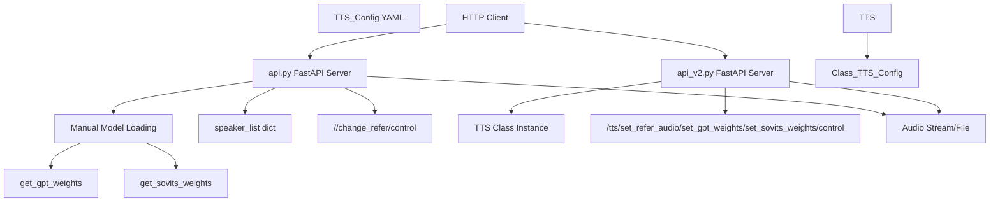
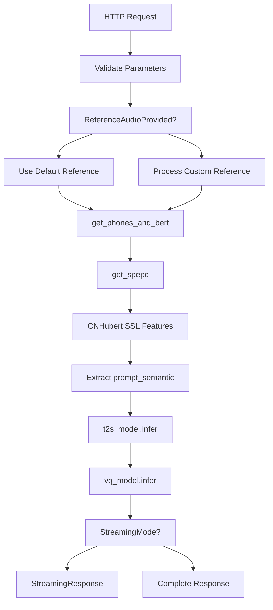
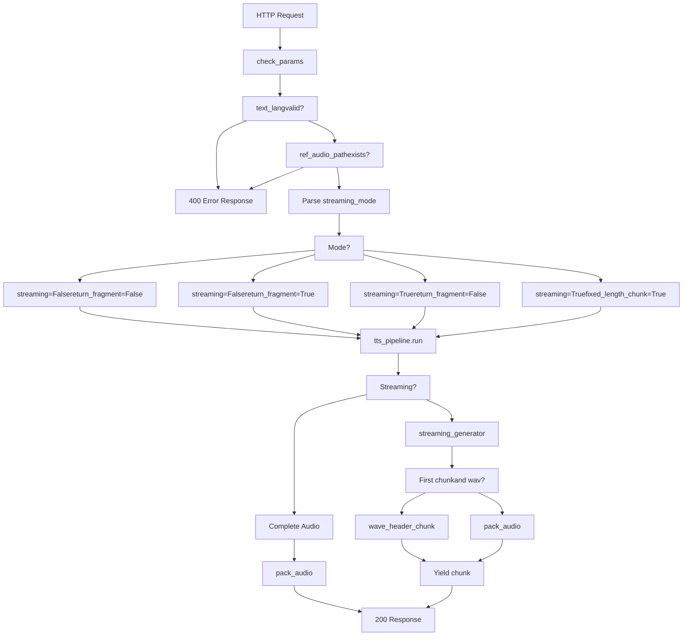
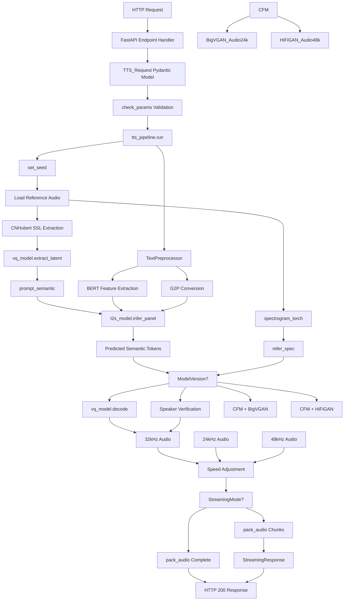
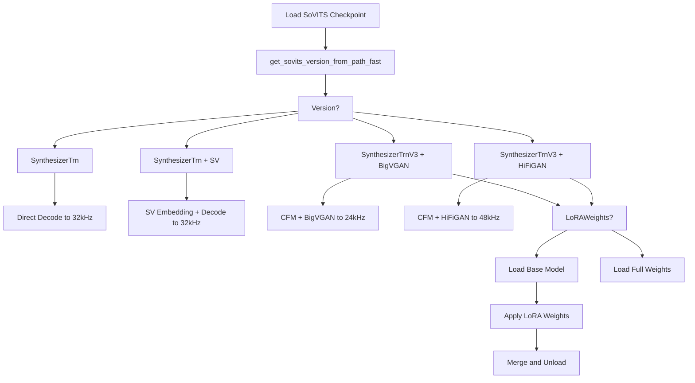

# REST API

相关源文件

-   [.gitignore](https://github.com/RVC-Boss/GPT-SoVITS/blob/c767f0b8/.gitignore)
-   [GPT\_SoVITS/AR/models/t2s\_model.py](https://github.com/RVC-Boss/GPT-SoVITS/blob/c767f0b8/GPT_SoVITS/AR/models/t2s_model.py)
-   [GPT\_SoVITS/AR/models/utils.py](https://github.com/RVC-Boss/GPT-SoVITS/blob/c767f0b8/GPT_SoVITS/AR/models/utils.py)
-   [GPT\_SoVITS/TTS\_infer\_pack/TTS.py](https://github.com/RVC-Boss/GPT-SoVITS/blob/c767f0b8/GPT_SoVITS/TTS_infer_pack/TTS.py)
-   [GPT\_SoVITS/configs/tts\_infer.yaml](https://github.com/RVC-Boss/GPT-SoVITS/blob/c767f0b8/GPT_SoVITS/configs/tts_infer.yaml)
-   [api.py](https://github.com/RVC-Boss/GPT-SoVITS/blob/c767f0b8/api.py)
-   [api\_v2.py](https://github.com/RVC-Boss/GPT-SoVITS/blob/c767f0b8/api_v2.py)
-   [config.py](https://github.com/RVC-Boss/GPT-SoVITS/blob/c767f0b8/config.py)
-   [webui.py](https://github.com/RVC-Boss/GPT-SoVITS/blob/c767f0b8/webui.py)

## 目的与范围 (Purpose and Scope)

本页面记录了用于程序化访问 GPT-SoVITS TTS 推理的 REST API 接口。REST API 允许应用程序通过发送 HTTP 请求来生成语音，支持 Synchronous (同步) 和 Streaming response modes (流式响应模式)。提供了两种 API 实现：原始的 `api.py` 和较新的 `api_v2.py`，两者均基于 FastAPI 构建。

有关基于 Web 的交互式推理，请参阅 [Inference WebUI](/RVC-Boss/GPT-SoVITS/3.2-inference-webui)。有关多文本的批量处理，请参阅 [批量处理](/RVC-Boss/GPT-SoVITS/7.3-batch-processing)。

---

## API 版本概览 (API Versions Overview)

GPT-SoVITS 提供了两种具有不同架构和能力的 REST API 实现：


**比较表 (Comparison Table):**

| 特性 | api.py | api\_v2.py |
| --- | --- | --- |
| 模型管理 | 通过函数手动加载 | 使用配置文件和 `TTS` 类 |
| 配置 | 命令行参数 | YAML 配置 + 命令行参数 |
| 主端点 (Main Endpoint) | `/` | `/tts` |
| 模型切换 | 通过 `/change_refer` | 通过 `/set_gpt_weights`, `/set_sovits_weights` |
| 流式模式 | 3 种模式 (字符串标志) | 4 种模式 (0, 1, 2, 3 或布尔值) |
| 默认参考音频 | 命令行参数 | 配置文件或动态设置 |
| 推荐程度 | 旧版 (Legacy) | ✓ 当前 (Current) |

来源：[api.py1-141](https://github.com/RVC-Boss/GPT-SoVITS/blob/c767f0b8/api.py#L1-L141) [api\_v2.py1-102](https://github.com/RVC-Boss/GPT-SoVITS/blob/c767f0b8/api_v2.py#L1-L102)

---

## 启动 API 服务器 (Starting the API Server)

### api.py (原始) (Original)

```
python api.py \  -s SoVITS_weights_v2/model.pth \  -g GPT_weights_v2/model.ckpt \  -dr "reference_audio.wav" \  -dt "Reference text here." \  -dl "zh" \  -a "127.0.0.1" \  -p 9880
```
**命令行参数 (Command-Line Arguments):**

| 参数 | 描述 | 默认值 |
| --- | --- | --- |
| `-s` | SoVITS 模型路径 | 来自 config.py |
| `-g` | GPT 模型路径 | 来自 config.py |
| `-dr` | 默认参考音频路径 | 如果请求中未提供则必填 |
| `-dt` | 默认参考文本 | 如果请求中未提供则必填 |
| `-dl` | 默认参考语言 | 如果请求中未提供则必填 |
| `-d` | 设备 (`cuda`, `cpu`) | 自动检测 |
| `-a` | 绑定地址 (Bind address) | `127.0.0.1` |
| `-p` | 端口 | `9880` |
| `-fp` | 强制全精度 (Force full precision) | False |
| `-hp` | 强制半精度 (Force half precision) | 自动检测 |
| `-sm` | 流式模式 | `close` |
| `-mt` | 媒体类型 (Media type) | `wav` |
| `-hb` | CNHubert 路径 | 来自 config.py |
| `-b` | BERT 路径 | 来自 config.py |

来源：[api.py1-141](https://github.com/RVC-Boss/GPT-SoVITS/blob/c767f0b8/api.py#L1-L141)

### api\_v2.py (推荐) (Recommended)

```
python api_v2.py \  -c GPT_SoVITS/configs/tts_infer.yaml \  -a "127.0.0.1" \  -p 9880
```
**命令行参数 (Command-Line Arguments):**

| 参数 | 描述 | 默认值 |
| --- | --- | --- |
| `-c` | TTS 配置文件路径 | `GPT_SoVITS/configs/tts_infer.yaml` |
| `-a` | 绑定地址 | `127.0.0.1` |
| `-p` | 端口 | `9880` |

配置文件 [GPT\_SoVITS/configs/tts\_infer.yaml1-57](https://github.com/RVC-Boss/GPT-SoVITS/blob/c767f0b8/GPT_SoVITS/configs/tts_infer.yaml#L1-L57) 指定了模型路径、设备设置和版本。API 在启动时会自动加载模型配置。

来源：[api\_v2.py133-142](https://github.com/RVC-Boss/GPT-SoVITS/blob/c767f0b8/api_v2.py#L133-L142) [config.py145](https://github.com/RVC-Boss/GPT-SoVITS/blob/c767f0b8/config.py#L145-L145)

---

## 核心概念 (Core Concepts)

### 模型配置架构 (Model Configuration Architecture)

```mermaid
flowchart TD
    ConfigFile["tts_infer.yaml"]
    TTS_Config_Class["TTS_Config"]
    version["version: v1/v2/v3/v4/v2Pro"]
    device["device: cuda/cpu"]
    is_half["is_half: bool"]
    t2s_weights_path["t2s_weights_path"]
    vits_weights_path["vits_weights_path"]
    bert_base_path["bert_base_path"]
    cnhuhbert_base_path["cnhuhbert_base_path"]
    TTS_Instance["TTS Pipeline Instance"]
    t2s_model["Text2SemanticLightningModule"]
    vits_model["SynthesizerTrn/V3"]
    bert_model["AutoModelForMaskedLM"]
    cnhuhbert_model["CNHubert"]
    vocoder["BigVGAN/HiFiGAN"]

    ConfigFile --> TTS_Config_Class
    TTS --> Config_Class_version
    TTS --> Config_Class_device
    TTS --> Config_Class_is_half
    TTS --> Config_Class_t2s_weights_path
    TTS --> Config_Class_vits_weights_path
    TTS --> Config_Class_bert_base_path
    TTS --> Config_Class_cnhuhbert_base_path
    TTS --> Config_Class_TTS_Instance
    TTS --> Instance_t2s_model
    TTS --> Instance_vits_model
    TTS --> Instance_bert_model
    TTS --> Instance_cnhuhbert_model
    TTS --> Instance_vocoder
```


来源：[GPT\_SoVITS/configs/tts\_infer.yaml1-57](https://github.com/RVC-Boss/GPT-SoVITS/blob/c767f0b8/GPT_SoVITS/configs/tts_infer.yaml#L1-L57) [GPT\_SoVITS/TTS\_infer\_pack/TTS.py217-419](https://github.com/RVC-Boss/GPT-SoVITS/blob/c767f0b8/GPT_SoVITS/TTS_infer_pack/TTS.py#L217-L419)

### 流式模式 (Streaming Modes)

两种 API 都支持流式响应，音频会按块发送，而不是等待完整生成。

**api\_v2.py 流式模式：**

| 模式 | 值 | 行为 | 使用场景 |
| --- | --- | --- | --- |
| 禁用 | `0` 或 `False` | 一次性返回完整音频 | 短文本、文件下载 |
| 最佳质量 | `1` 或 `True` | 按句子片段流式传输 | 平衡质量和 Latency (延迟) |
| 中等质量 | `2` | 按语义块、中等块流式传输 | 更低的延迟 |
| 较低质量 | `3` | 按语义块、小块流式传输 | 最低的延迟 |

**api.py 流式模式：**

| 模式 | 值 | 行为 |
| --- | --- | --- |
| 禁用 | `close`, `c` | 返回完整音频 |
| 普通 | `normal`, `n` | 完成后关闭连接的流式传输 |
| 保持激活 | `keepalive`, `k` | 使用持久连接的流式传输 |

来源：[api\_v2.py388-410](https://github.com/RVC-Boss/GPT-SoVITS/blob/c767f0b8/api_v2.py#L388-L410) [api.py21](https://github.com/RVC-Boss/GPT-SoVITS/blob/c767f0b8/api.py#L21-L21)

### 媒体类型 (Media Types)

两种 API 都支持多种音频编码格式：

| 格式 | 流式支持 | 非流式支持 | 备注 |
| --- | --- | --- | --- |
| `wav` | ✓ | ✓ | PCM uncompressed (PCM 无压缩) |
| `ogg` | ✓ | ✓ | Vorbis 压缩，大块可能导致栈溢出 |
| `aac` | ✓ | ✓ | 通过 FFmpeg 进行 AAC 压缩 |
| `raw` | ✓ | ✓ | 不带头部的原始 PCM 字节 (Raw PCM bytes) |

来源：[api.py670-780](https://github.com/RVC-Boss/GPT-SoVITS/blob/c767f0b8/api.py#L670-L780) [api\_v2.py268-279](https://github.com/RVC-Boss/GPT-SoVITS/blob/c767f0b8/api_v2.py#L268-L279)

---

## API 端点参考 (API Endpoints Reference)

### api.py 端点

#### `POST/GET /` - TTS 推理

主推理端点，从文本生成语音。


**请求参数 (GET 或 POST JSON)：**

| 参数 | 类型 | 是否必填 | 默认值 | 描述 |
| --- | --- | --- | --- | --- |
| `text` | string | ✓ | \- | 要合成的文本 |
| `text_language` | string | ✓ | \- | 语言：`zh`, `en`, `ja`, `ko`, `yue`, `auto` |
| `refer_wav_path` | string | 可选 | 命令行默认值 | 参考音频文件路径 |
| `prompt_text` | string | 可选 | \- | 参考音频的转录文本 |
| `prompt_language` | string | 可选 | \- | 参考音频的语言 |
| `cut_punc` | string | 可选 | \- | 用于文本切分的 Custom punctuation (自定义标点符号) |
| `top_k` | int | 可选 | 15 | Top-k Sampling (采样) |
| `top_p` | float | 可选 | 1.0 | Nucleus sampling (核采样) 阈值 |
| `temperature` | float | 可选 | 1.0 | 采样温度 |
| `speed` | float | 可选 | 1.0 | Playback speed multiplier (播放速度倍率) |
| `inp_refs` | list\[string\] | 可选 | \[\] | 辅助参考音频路径 |

**GET 示例：**

```
GET http://127.0.0.1:9880?text=你好世界&text_language=zh&refer_wav_path=ref.wav&prompt_text=测试&prompt_language=zh
```
**POST 示例：**

```
{    "text": "先帝创业未半而中道崩殂，今天下三分，益州疲弊，此诚危急存亡之秋也。",    "text_language": "zh",    "refer_wav_path": "123.wav",    "prompt_text": "一二三。",    "prompt_language": "zh",    "top_k": 20,    "top_p": 0.6,    "temperature": 0.6}
```
**响应：**

-   **成功 (200)**：音频流 (WAV/OGG/AAC 格式)
-   **错误 (400)**：包含错误消息的 JSON

来源：[api.py809-1010](https://github.com/RVC-Boss/GPT-SoVITS/blob/c767f0b8/api.py#L809-L1010)

#### `POST/GET /change_refer` - 更新默认参考

更新当请求中未指定自定义参考时使用的默认参考音频。

**请求参数：**

| 参数 | 类型 | 是否必填 | 描述 |
| --- | --- | --- | --- |
| `refer_wav_path` | string | ✓ | 新的参考音频路径 |
| `prompt_text` | string | ✓ | 参考文本 |
| `prompt_language` | string | ✓ | 参考语言 |

**响应：**

-   **成功 (200)**：`{"code": 0, "message": "Success"}`
-   **错误 (400)**：包含错误详情的 JSON

来源：[api.py100-120](https://github.com/RVC-Boss/GPT-SoVITS/blob/c767f0b8/api.py#L100-L120)

#### `POST/GET /control` - 服务器控制 (Server Control)

控制服务器生命周期。

**请求参数：**

| 参数 | 类型 | 值 | 描述 |
| --- | --- | --- | --- |
| `command` | string | `restart`, `exit` | 服务器命令 |

**响应：** 无响应 (服务器重启或退出)

来源：[api.py122-140](https://github.com/RVC-Boss/GPT-SoVITS/blob/c767f0b8/api.py#L122-L140)

---

### api\_v2.py 端点

#### `POST/GET /tts` - TTS 推理

具有 Enhanced parameter control (增强的参数控制) 的主推理端点。


**请求参数：**

| 参数 | 类型 | 是否必填 | 默认值 | 描述 |
| --- | --- | --- | --- | --- |
| `text` | string | ✓ | \- | 要合成的文本 |
| `text_lang` | string | ✓ | \- | `auto`, `zh`, `en`, `ja`, `ko`, `yue` 等 |
| `ref_audio_path` | string | ✓ | \- | 参考音频文件路径 |
| `prompt_lang` | string | ✓ | \- | 参考音频的语言 |
| `prompt_text` | string | 可选 | "" | 参考音频转录文本 |
| `aux_ref_audio_paths` | list\[string\] | 可选 | \[\] | 用于 Tone fusion (音色融合) 的额外参考音频 |
| `top_k` | int | 可选 | 15 | GPT 的 Top-k 采样 |
| `top_p` | float | 可选 | 1.0 | 核采样阈值 |
| `temperature` | float | 可选 | 1.0 | 采样温度 |
| `text_split_method` | string | 可选 | `cut5` | 文本切分方法 |
| `batch_size` | int | 可选 | 1 | 推理 Batch size (批大小) |
| `batch_threshold` | float | 可选 | 0.75 | 批切分阈值 |
| `split_bucket` | bool | 可选 | True | 启用 Batch bucketing (批分桶) |
| `speed_factor` | float | 可选 | 1.0 | 播放速度倍率 |
| `fragment_interval` | float | 可选 | 0.3 | 片段间的静音间隔 (秒) |
| `seed` | int | 可选 | \-1 | 随机种子 (-1 表示随机) |
| `media_type` | string | 可选 | `wav` | `wav`, `ogg`, `aac`, `raw` |
| `streaming_mode` | int/bool | 可选 | False | 0/False, 1/True, 2, 3 |
| `parallel_infer` | bool | 可选 | True | Parallel batch inference (并行批推理) |
| `repetition_penalty` | float | 可选 | 1.35 | T2S 的重复惩罚 |
| `sample_steps` | int | 可选 | 32 | 采样步数 (v3/v4) |
| `super_sampling` | bool | 可选 | False | 超分辨率 24kHz→48kHz (v3) |
| `overlap_length` | int | 可选 | 2 | 流式传输的语义令牌重叠 (Semantic token overlap) |
| `min_chunk_length` | int | 可选 | 16 | 流式传输的最小块长度 |

**POST 示例：**

```
{    "text": "这是一段测试文本。",    "text_lang": "zh",    "ref_audio_path": "reference.wav",    "prompt_lang": "zh",    "prompt_text": "参考音频文本",    "top_k": 15,    "top_p": 1.0,    "temperature": 1.0,    "streaming_mode": 2,    "media_type": "ogg"}
```
**响应：**

-   **成功 (200)**：
    -   非流式：完整音频文件
    -   流式：带有分块音频的 `StreamingResponse`
-   **错误 (400)**：包含错误详情的 JSON

来源：[api\_v2.py345-446](https://github.com/RVC-Boss/GPT-SoVITS/blob/c767f0b8/api_v2.py#L345-L446) [api\_v2.py455-515](https://github.com/RVC-Boss/GPT-SoVITS/blob/c767f0b8/api_v2.py#L455-L515)

#### `GET /set_refer_audio` - 设置参考音频

为 TTS 流水线实例配置参考音频。

**请求参数：**

| 参数 | 类型 | 是否必填 | 描述 |
| --- | --- | --- | --- |
| `refer_audio_path` | string | ✓ | 参考音频文件路径 |

**响应：**

-   **成功 (200)**：`{"message": "success"}`
-   **错误 (400)**：`{"message": "set refer audio failed", "Exception": "..."}`

来源：[api\_v2.py517-523](https://github.com/RVC-Boss/GPT-SoVITS/blob/c767f0b8/api_v2.py#L517-L523)

#### `GET /set_gpt_weights` - 切换 GPT 模型

无需重启服务器即可 Hot-swaps (热切换) Text2Semantic (GPT) 模型。

**请求参数：**

| 参数 | 类型 | 是否必填 | 描述 |
| --- | --- | --- | --- |
| `weights_path` | string | ✓ | GPT 检查点 (.ckpt) 路径 |

**响应：**

-   **成功 (200)**：`{"message": "success"}`
-   **错误 (400)**：`{"message": "change gpt weight failed", "Exception": "..."}`

来源：[api\_v2.py545-554](https://github.com/RVC-Boss/GPT-SoVITS/blob/c767f0b8/api_v2.py#L545-L554)

#### `GET /set_sovits_weights` - 切换 SoVITS 模型

无需重启服务器即可热切换声学 (SoVITS) 模型。

**请求参数：**

| 参数 | 类型 | 是否必填 | 描述 |
| --- | --- | --- | --- |
| `weights_path` | string | ✓ | SoVITS 检查点 (.pth) 路径 |

**响应：**

-   **成功 (200)**：`{"message": "success"}`
-   **错误 (400)**：`{"message": "change sovits weight failed", "Exception": "..."}`

来源：[api\_v2.py557-565](https://github.com/RVC-Boss/GPT-SoVITS/blob/c767f0b8/api_v2.py#L557-L565)

#### `POST/GET /control` - 服务器控制

与 api.py 的实现相同。

来源：[api\_v2.py448-452](https://github.com/RVC-Boss/GPT-SoVITS/blob/c767f0b8/api_v2.py#L448-L452)

---

## 请求/响应流 (Request/Response Flow)

### 完整推理流水线 (api\_v2.py) (Complete Inference Pipeline (api\_v2.py))


来源：[api\_v2.py345-446](https://github.com/RVC-Boss/GPT-SoVITS/blob/c767f0b8/api_v2.py#L345-L446) [GPT\_SoVITS/TTS\_infer\_pack/TTS.py1162-1400](https://github.com/RVC-Boss/GPT-SoVITS/blob/c767f0b8/GPT_SoVITS/TTS_infer_pack/TTS.py#L1162-L1400)

---

## 语言支持 (Language Support)

两种 API 都支持相同的语言代码，可用性取决于模型版本：

| 语言代码 | 语言 | v1 | v2/v2Pro/v3/v4 |
| --- | --- | --- | --- |
| `zh` | 中文 (普通话/Mandarin) | ✓ | ✓ |
| `en` | 英语 | ✓ | ✓ |
| `ja` | 日语 | ✓ | ✓ |
| `ko` | 韩语 | \- | ✓ |
| `yue` | 粤语 (Cantonese) | \- | ✓ |
| `auto` | 自动检测多语言 (Auto-detect) | \- | ✓ |
| `auto_yue` | 自动检测 (将 zh 视为 yue) | \- | ✓ |
| `all_zh` | 强制全部为中文 | ✓ | ✓ |
| `all_ja` | 强制全部为日语 | ✓ | ✓ |
| `all_ko` | 强制全部为韩语 | \- | ✓ |
| `all_yue` | 强制全部为粤语 | \- | ✓ |

来源：[GPT\_SoVITS/TTS\_infer\_pack/TTS.py275-277](https://github.com/RVC-Boss/GPT-SoVITS/blob/c767f0b8/GPT_SoVITS/TTS_infer_pack/TTS.py#L275-L277) [api.py545-610](https://github.com/RVC-Boss/GPT-SoVITS/blob/c767f0b8/api.py#L545-L610)

---

## 错误处理 (Error Handling)

### 常见错误响应 (Common Error Responses)

两种 API 均返回带有 HTTP 400 状态码的 JSON 错误响应：

```
{    "message": "Error description",    "Exception": "Detailed exception message (if available)"}
```
**常见错误场景：**

| 错误 | 原因 | 解决方案 |
| --- | --- | --- |
| `ref_audio_path is required` | 缺少参考音频 | 提供 `ref_audio_path` 或设置默认值 |
| `text is required` | 缺少文本参数 | 提供 `text` 参数 |
| `text_lang is not supported` | 无效的语言代码 | 使用模型版本支持的有效语言代码 |
| `Model loading failed` | 无效的检查点路径 | 验证模型文件是否存在且兼容 |
| `tts failed` | 推理错误 | 检查参考音频格式和模型兼容性 |

来源：[api\_v2.py305-343](https://github.com/RVC-Boss/GPT-SoVITS/blob/c767f0b8/api_v2.py#L305-L343) [api.py809-1010](https://github.com/RVC-Boss/GPT-SoVITS/blob/c767f0b8/api.py#L809-L1010)

---

## 集成示例 (Integration Examples)

### Python 客户端示例 (api\_v2.py) (Python Client Example (api\_v2.py))

```
import requestsimport ioimport soundfile as sf # 非流式请求def tts_request(text, ref_audio_path, output_path):    url = "http://127.0.0.1:9880/tts"        payload = {        "text": text,        "text_lang": "zh",        "ref_audio_path": ref_audio_path,        "prompt_lang": "zh",        "prompt_text": "参考文本",        "media_type": "wav",        "streaming_mode": 0    }        response = requests.post(url, json=payload)        if response.status_code == 200:        with open(output_path, 'wb') as f:            f.write(response.content)        print(f"Audio saved to {output_path}")    else:        print(f"Error: {response.json()}") # 流式请求def tts_streaming(text, ref_audio_path):    url = "http://127.0.0.1:9880/tts"        payload = {        "text": text,        "text_lang": "zh",        "ref_audio_path": ref_audio_path,        "prompt_lang": "zh",        "media_type": "wav",        "streaming_mode": 2  # 中等质量流式传输    }        with requests.post(url, json=payload, stream=True) as response:        if response.status_code == 200:            for chunk in response.iter_content(chunk_size=8192):                if chunk:                    # 处理音频块 (例如播放或保存)                    process_audio_chunk(chunk)        else:            print(f"Error: {response.text}") # 模型切换def switch_models(gpt_path, sovits_path):    requests.get(        "http://127.0.0.1:9880/set_gpt_weights",        params={"weights_path": gpt_path}    )    requests.get(        "http://127.0.0.1:9880/set_sovits_weights",        params={"weights_path": sovits_path}    )
```
### cURL 示例 (cURL Example)

```
# 简单 POST 请求curl -X POST "http://127.0.0.1:9880/tts" \  -H "Content-Type: application/json" \  -d '{    "text": "你好，世界",    "text_lang": "zh",    "ref_audio_path": "reference.wav",    "prompt_lang": "zh"  }' \  --output output.wav # 带参数的 GET 请求curl -X GET "http://127.0.0.1:9880/tts?text=测试文本&text_lang=zh&ref_audio_path=ref.wav&prompt_lang=zh&media_type=ogg" \  --output output.ogg # 切换模型curl "http://127.0.0.1:9880/set_gpt_weights?weights_path=GPT_weights_v2/model.ckpt"curl "http://127.0.0.1:9880/set_sovits_weights?weights_path=SoVITS_weights_v2/model.pth"
```
来源：[api\_v2.py455-515](https://github.com/RVC-Boss/GPT-SoVITS/blob/c767f0b8/api_v2.py#L455-L515)

---

## 性能考量 (Performance Considerations)

### 流式 vs 非流式 (Streaming vs Non-Streaming)

**非流式 (Non-Streaming) (模式 0/1)：**

-   响应前完成完整生成
-   延迟较高，但可进行完整的质量控制
-   适用于：文件下载、批量处理、质量关键型应用

**流式 (Streaming) (模式 2/3)：**

-   随着生成的进行提供增量响应
-   更低的延迟，更快的 Time-to-first-audio (首音输出时间)
-   适用于：实时应用、对话式 AI、现场播放

### 模型热切换 (Model Hot-Swapping)

api\_v2.py 中的 `/set_gpt_weights` 和 `/set_sovits_weights` 端点支持在不重启服务器的情况下动态切换模型：

这允许：

-   在无需停机的情况下测试不同模型
-   从单个服务器提供多种说话人/风格
-   模型版本的 A/B 测试

来源：[api\_v2.py545-565](https://github.com/RVC-Boss/GPT-SoVITS/blob/c767f0b8/api_v2.py#L545-L565) [GPT\_SoVITS/TTS\_infer\_pack/TTS.py594-608](https://github.com/RVC-Boss/GPT-SoVITS/blob/c767f0b8/GPT_SoVITS/TTS_infer_pack/TTS.py#L594-L608)

### 连接管理 (Connection Management)

**api.py** 为持久连接提供保持激活 (Keep-alive) 流式模式，在连续生成多个音频片段而无需重新连接时非常有用。

**api\_v2.py** 默认使用 FastAPI 内置的连接管理和 HTTP/1.1 keep-alive。

来源：[api.py21](https://github.com/RVC-Boss/GPT-SoVITS/blob/c767f0b8/api.py#L21-L21) [api\_v2.py568-576](https://github.com/RVC-Boss/GPT-SoVITS/blob/c767f0b8/api_v2.py#L568-L576)

---

## 配置管理 (Configuration Management)

### TTS 配置文件结构 (TTS Config File Structure)

[GPT\_SoVITS/configs/tts\_infer.yaml1-57](https://github.com/RVC-Boss/GPT-SoVITS/blob/c767f0b8/GPT_SoVITS/configs/tts_infer.yaml#L1-L57) 文件为每个模型版本定义了 Presets (预设)：

```
custom:  device: cuda  is_half: true  version: v2  t2s_weights_path: GPT_SoVITS/pretrained_models/.../s1....ckpt  vits_weights_path: GPT_SoVITS/pretrained_models/.../s2G....pth  bert_base_path: GPT_SoVITS/pretrained_models/chinese-roberta-wwm-ext-large  cnhuhbert_base_path: GPT_SoVITS/pretrained_models/chinese-hubert-base v1:  # v1 预设配置  v2:  # v2 预设配置  v3:  # v3 预设配置
```
默认加载 `custom` 部分。要使用不同版本的预设，请修改 `custom` 部分中的路径和版本。

来源：[GPT\_SoVITS/configs/tts\_infer.yaml1-57](https://github.com/RVC-Boss/GPT-SoVITS/blob/c767f0b8/GPT_SoVITS/configs/tts_infer.yaml#L1-L57) [GPT\_SoVITS/TTS\_infer\_pack/TTS.py299-354](https://github.com/RVC-Boss/GPT-SoVITS/blob/c767f0b8/GPT_SoVITS/TTS_infer_pack/TTS.py#L299-L354)

### 环境变量 (Environment Variables)

两种 API 都遵循 [config.py1-219](https://github.com/RVC-Boss/GPT-SoVITS/blob/c767f0b8/config.py#L1-L219) 中的配置：

| 变量 | 来源 | 描述 |
| --- | --- | --- |
| `is_half` | 环境或自动检测 | 启用 FP16 精度 |
| `infer_device` | 自动检测 | 用于推理的 GPU 设备 |
| `api_port` | config.py | 默认 API 端口 (9880) |

来源：[config.py127-145](https://github.com/RVC-Boss/GPT-SoVITS/blob/c767f0b8/config.py#L127-L145)

---

## 模型版本兼容性 (Model Version Compatibility)

不同的模型版本具有不同的推理路径和能力：


**版本特定特性：**

| 版本 | 架构 | 输出采样率 | 声码器 | LoRA 支持 | 特殊功能 |
| --- | --- | --- | --- | --- | --- |
| v1 | SynthesizerTrn | 32kHz | 无 | 否 | Original architecture (原始架构) |
| v2 | SynthesizerTrn | 32kHz | 无 | 否 | 改进的训练 |
| v2Pro/Plus | SynthesizerTrn | 32kHz | 无 | 否 | 说话人验证嵌入 (Speaker verification embedding) |
| v3 | SynthesizerTrnV3 | 24kHz | BigVGAN | 是 | CFM, 8GB 显存训练 |
| v4 | SynthesizerTrnV3 | 48kHz | HiFiGAN | 是 | 修复了 Metallic artifacts (金属音伪影) |

来源：[api.py381-464](https://github.com/RVC-Boss/GPT-SoVITS/blob/c767f0b8/api.py#L381-L464) [GPT\_SoVITS/TTS\_infer\_pack/TTS.py493-591](https://github.com/RVC-Boss/GPT-SoVITS/blob/c767f0b8/GPT_SoVITS/TTS_infer_pack/TTS.py#L493-L591) [process\_ckpt.py](https://github.com/RVC-Boss/GPT-SoVITS/blob/c767f0b8/process_ckpt.py)

---

## 部署建议 (Deployment Recommendations)

### 生产部署 (Production Deployment)

对于生产环境使用，请考虑：

1.  **使用 api\_v2.py**：更现代的架构，更好的参数控制
2.  **启用 HTTPS**：置于 Reverse proxy (反向代理) (nginx, Apache) 之后
3.  **设置合适的绑定地址**：使用 `-a 0.0.0.0` 进行网络访问
4.  **资源限制**：监控 GPU 显存，实现 Request queuing (请求队列)
5.  **模型缓存**：在启动时预加载模型以避免 Cold start latency (冷启动延迟)
6.  **错误日志**：实现全面的错误跟踪

### Docker 部署示例 (Docker Deployment Example)

```
# 构建并运行公开 API 的容器docker run -it --gpus all \  -p 9880:9880 \  -v /path/to/models:/workspace/models \  gpt-sovits:latest \  python api_v2.py -c /workspace/configs/tts_infer.yaml -a 0.0.0.0 -p 9880
```
### 负载均衡 (Load Balancing)

对于 High-throughput (高吞吐量) 场景：

-   在不同 GPU 上部署多个 API 实例
-   使用负载均衡器 (nginx, HAProxy) 进行请求分发
-   为不同语言/说话人实现 Model sharding (模型分片)

来源：[config.py145](https://github.com/RVC-Boss/GPT-SoVITS/blob/c767f0b8/config.py#L145-L145) [api\_v2.py568-576](https://github.com/RVC-Boss/GPT-SoVITS/blob/c767f0b8/api_v2.py#L568-L576)
