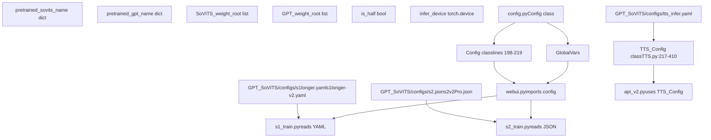
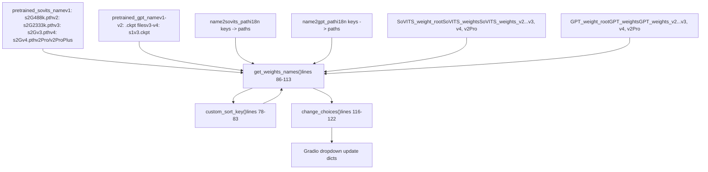
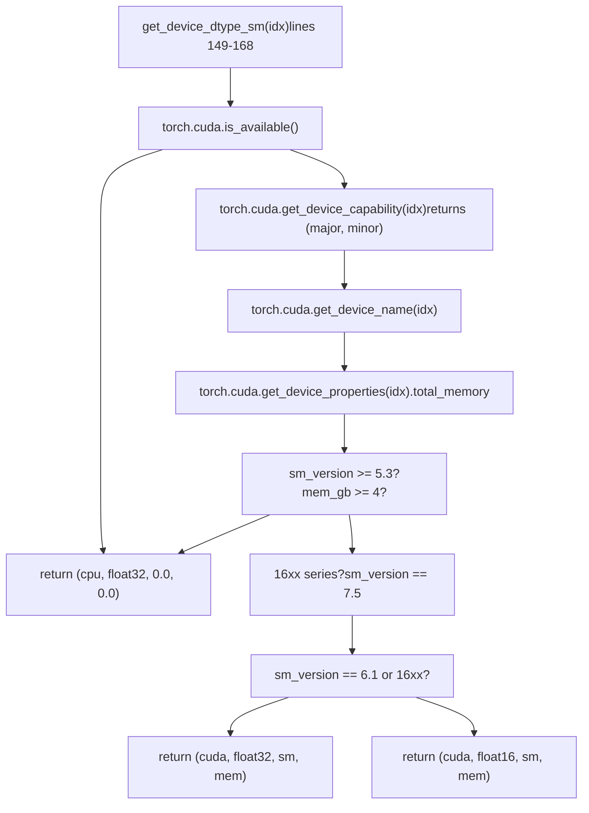
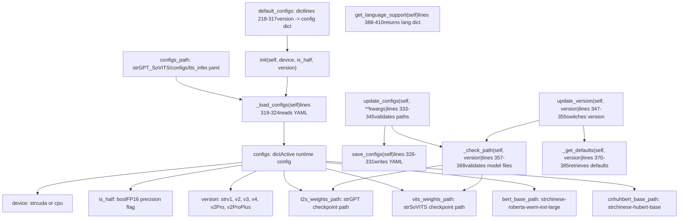
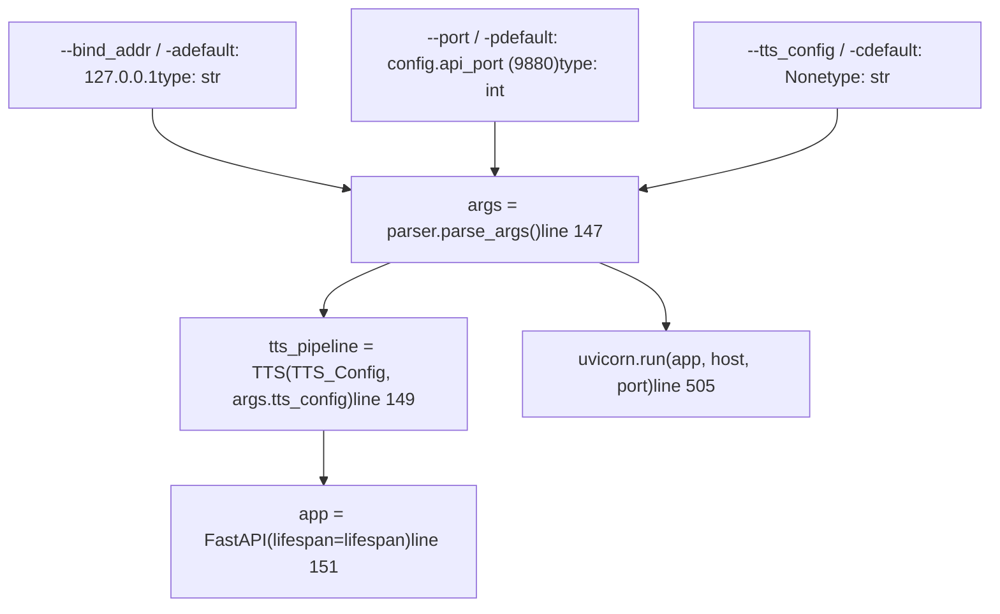
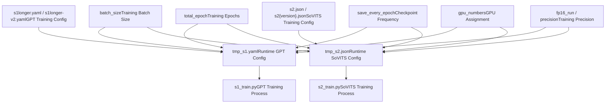

# 配置管理 (Configuration Management)

相关源文件

-   [README.md](https://github.com/RVC-Boss/GPT-SoVITS/blob/c767f0b8/README.md?plain=1)
-   [api.py](https://github.com/RVC-Boss/GPT-SoVITS/blob/c767f0b8/api.py)
-   [config.py](https://github.com/RVC-Boss/GPT-SoVITS/blob/c767f0b8/config.py)
-   [docs/cn/README.md](https://github.com/RVC-Boss/GPT-SoVITS/blob/c767f0b8/docs/cn/README.md?plain=1)
-   [docs/ja/README.md](https://github.com/RVC-Boss/GPT-SoVITS/blob/c767f0b8/docs/ja/README.md?plain=1)
-   [docs/ko/README.md](https://github.com/RVC-Boss/GPT-SoVITS/blob/c767f0b8/docs/ko/README.md?plain=1)
-   [docs/tr/README.md](https://github.com/RVC-Boss/GPT-SoVITS/blob/c767f0b8/docs/tr/README.md?plain=1)
-   [install.ps1](https://github.com/RVC-Boss/GPT-SoVITS/blob/c767f0b8/install.ps1)
-   [install.sh](https://github.com/RVC-Boss/GPT-SoVITS/blob/c767f0b8/install.sh)
-   [requirements.txt](https://github.com/RVC-Boss/GPT-SoVITS/blob/c767f0b8/requirements.txt)
-   [webui.py](https://github.com/RVC-Boss/GPT-SoVITS/blob/c767f0b8/webui.py)

本文档涵盖了 GPT-SoVITS 中的配置系统，包括全局系统设置、模型配置、设备管理和运行时参数。该配置系统管理多个相互关联的组件，这些组件控制训练、推理和部署设置。

有关使用这些配置的 Web 界面的信息，请参阅 [Web Interface (Web 界面)](/RVC-Boss/GPT-SoVITS/3-user-interfaces)。有关 TTS 推理流水线配置的详细信息，请参阅 [Inference Pipeline (推理流水线)](/RVC-Boss/GPT-SoVITS/2.4-inference-pipeline)。

## 配置架构 (Configuration Architecture)

GPT-SoVITS 使用多层配置系统，主要包含三个来源：`config.py` 中的全局设置、`TTS_Config` 类中的推理特定设置以及 JSON/YAML 文件中的训练配置。

**配置层次结构与代码实体**


来源: [config.py1-219](https://github.com/RVC-Boss/GPT-SoVITS/blob/c767f0b8/config.py#L1-L219) [GPT\_SoVITS/TTS\_infer\_pack/TTS.py217-410](https://github.com/RVC-Boss/GPT-SoVITS/blob/c767f0b8/GPT_SoVITS/TTS_infer_pack/TTS.py#L217-L410) [webui.py71-85](https://github.com/RVC-Boss/GPT-SoVITS/blob/c767f0b8/webui.py#L71-L85) [api\_v2.py129-145](https://github.com/RVC-Boss/GPT-SoVITS/blob/c767f0b8/api_v2.py#L129-L145)

## 全局系统配置 (Global System Configuration)

[config.py198-219](https://github.com/RVC-Boss/GPT-SoVITS/blob/c767f0b8/config.py#L198-L219) 中的 `Config` 类为系统范围的设置提供了一个简单的容器。大多数配置逻辑使用模块级变量而不是类实例。

### 模块级配置变量 (Module-Level Configuration Variables)

| 变量 | 类型 | 用途 | 设置方式 |
| --- | --- | --- | --- |
| `pretrained_sovits_name` | `dict[str, str]` | 将版本字符串映射到预训练 SoVITS 路径 | 静态定义 [config.py12-19](https://github.com/RVC-Boss/GPT-SoVITS/blob/c767f0b8/config.py#L12-L19) |
| `pretrained_gpt_name` | `dict[str, str]` | 将版本字符串映射到预训练 GPT 路径 | 静态定义 [config.py21-28](https://github.com/RVC-Boss/GPT-SoVITS/blob/c767f0b8/config.py#L21-L28) |
| `SoVITS_weight_root` | `list[str]` | SoVITS 检查点 (checkpoint) 目录 | 静态定义 [config.py44-51](https://github.com/RVC-Boss/GPT-SoVITS/blob/c767f0b8/config.py#L44-L51) |
| `GPT_weight_root` | `list[str]` | GPT 检查点目录 | 静态定义 [config.py52-59](https://github.com/RVC-Boss/GPT-SoVITS/blob/c767f0b8/config.py#L52-L59) |
| `is_half` | `bool` | 是否启用 FP16 模式 | `get_device_dtype_sm()` 或环境变量 [config.py127-128](https://github.com/RVC-Boss/GPT-SoVITS/blob/c767f0b8/config.py#L127-L128) |
| `infer_device` | `torch.device` | 主要推理设备 (inference device) | `get_device_dtype_sm()` [config.py194](https://github.com/RVC-Boss/GPT-SoVITS/blob/c767f0b8/config.py#L194-L194) |
| `IS_GPU` | `bool` | GPU 可用标志 | 硬件检测循环 [config.py189-192](https://github.com/RVC-Boss/GPT-SoVITS/blob/c767f0b8/config.py#L189-L192) |
| `GPU_INFOS` | `list[str]` | GPU 设备描述 | 硬件检测循环 [config.py186](https://github.com/RVC-Boss/GPT-SoVITS/blob/c767f0b8/config.py#L186-L186) |
| `GPU_INDEX` | `set[int]` | 可用 GPU 索引 | 硬件检测循环 [config.py187](https://github.com/RVC-Boss/GPT-SoVITS/blob/c767f0b8/config.py#L187-L187) |

来源: [config.py12-28](https://github.com/RVC-Boss/GPT-SoVITS/blob/c767f0b8/config.py#L12-L28) [config.py44-75](https://github.com/RVC-Boss/GPT-SoVITS/blob/c767f0b8/config.py#L44-L75) [config.py127-131](https://github.com/RVC-Boss/GPT-SoVITS/blob/c767f0b8/config.py#L127-L131) [config.py171-195](https://github.com/RVC-Boss/GPT-SoVITS/blob/c767f0b8/config.py#L171-L195)

## 全局系统配置 (Global System Configuration)

主系统配置通过 `config.py` 中的 `Config` 类进行管理，该类定义了系统范围的默认值和硬件检测。

### 核心配置参数 (Core Configuration Parameters)

| 参数 | 描述 | 默认值 |
| --- | --- | --- |
| `exp_root` | 实验根目录 | `"logs"` |
| `python_exec` | Python 可执行文件路径 | 系统可执行文件 |
| `is_half` | 半精度模式 | 自动检测 |
| `infer_device` | 主要推理设备 | 自动检测 |
| `webui_port_main` | 主 WebUI 端口 | `9874` |
| `api_port` | API 服务端口 | `9880` |

### 模型路径配置 (Model Path Configuration)

**路径解析函数与数据流**


`get_weights_names()` 函数扫描权重目录并返回可用检查点的排序列表。它对每个预训练路径检查 `os.path.exists()`，并扫描目录中的 `.pth` (SoVITS) 和 `.ckpt` (GPT) 文件。

来源: [config.py12-28](https://github.com/RVC-Boss/GPT-SoVITS/blob/c767f0b8/config.py#L12-L28) [config.py29-43](https://github.com/RVC-Boss/GPT-SoVITS/blob/c767f0b8/config.py#L29-L43) [config.py44-75](https://github.com/RVC-Boss/GPT-SoVITS/blob/c767f0b8/config.py#L44-L75) [config.py78-122](https://github.com/RVC-Boss/GPT-SoVITS/blob/c767f0b8/config.py#L78-L122)

### 硬件检测与设备管理 (Hardware Detection and Device Management)

[config.py149-168](https://github.com/RVC-Boss/GPT-SoVITS/blob/c767f0b8/config.py#L149-L168) 中的 `get_device_dtype_sm(idx: int)` 函数返回一个 4 元组：`(device, dtype, sm_version, mem_gb)`。

**硬件检测逻辑**


该函数通过正则表达式 `r"16\d{2}"` 和 SM 7.5 识别 16 系列 GPU，并为这些显卡强制使用 float32。SM 版本计算为 `major + minor / 10.0`。

来源: [config.py149-168](https://github.com/RVC-Boss/GPT-SoVITS/blob/c767f0b8/config.py#L149-L168)

### 设备选择与初始化 (Device Selection and Initialization)

在模块加载时，[config.py174-195](https://github.com/RVC-Boss/GPT-SoVITS/blob/c767f0b8/config.py#L174-L195) 执行一个循环：

1.  为每个 GPU 索引调用 `get_device_dtype_sm(i)`
2.  使用有效 GPU 的设备名称填充 `GPU_INFOS`
3.  将有效索引添加到 `GPU_INDEX` 集合
4.  在 `memset` 中收集内存值
5.  选择 `infer_device` 作为具有最高 `(sm_version, mem_gb)` 元组的 GPU
6.  如果任何 GPU 支持 float16，则设置 `is_half = True`

来源: [config.py174-195](https://github.com/RVC-Boss/GPT-SoVITS/blob/c767f0b8/config.py#L174-L195)

## TTS 配置系统 (TTS Configuration System)

[GPT\_SoVITS/TTS\_infer\_pack/TTS.py217-410](https://github.com/RVC-Boss/GPT-SoVITS/blob/c767f0b8/GPT_SoVITS/TTS_infer_pack/TTS.py#L217-L410) 中的 `TTS_Config` 类管理推理特定的配置，具有自动验证和版本特定的回退 (fallback) 机制。

### TTS\_Config 类结构与方法 (TTS\_Config Class Structure and Methods)


来源: [GPT\_SoVITS/TTS\_infer\_pack/TTS.py217-410](https://github.com/RVC-Boss/GPT-SoVITS/blob/c767f0b8/GPT_SoVITS/TTS_infer_pack/TTS.py#L217-L410)

### 配置验证与回退逻辑 (Configuration Validation and Fallback Logic)

[GPT\_SoVITS/TTS\_infer\_pack/TTS.py357-368](https://github.com/RVC-Boss/GPT-SoVITS/blob/c767f0b8/GPT_SoVITS/TTS_infer_pack/TTS.py#L357-L368) 中的 `_check_path()` 方法验证模型文件是否存在：

1.  检查 `os.path.isfile(self.configs["t2s_weights_path"])`
2.  检查 `os.path.isfile(self.configs["vits_weights_path"])`
3.  如果失败，调用 `_get_defaults(version)` 来检索回退路径
4.  调用 `save_configs()` 来持久化修正后的配置

[GPT\_SoVITS/TTS\_infer\_pack/TTS.py333-345](https://github.com/RVC-Boss/GPT-SoVITS/blob/c767f0b8/GPT_SoVITS/TTS_infer_pack/TTS.py#L333-L345) 中的 `update_configs()` 方法接受 `**kwargs` 并且：

-   使用提供的键更新 `self.configs` 字典
-   调用 `_check_path()` 进行验证
-   调用 `save_configs()` 来持久化更改

来源: [GPT\_SoVITS/TTS\_infer\_pack/TTS.py333-368](https://github.com/RVC-Boss/GPT-SoVITS/blob/c767f0b8/GPT_SoVITS/TTS_infer_pack/TTS.py#L333-L368)

### 配置文件格式 (Configuration File Format)

[GPT\_SoVITS/configs/tts\_infer.yaml](https://github.com/RVC-Boss/GPT-SoVITS/blob/c767f0b8/GPT_SoVITS/configs/tts_infer.yaml) 中的 YAML 文件在 `custom` 键下存储用户配置：

```yaml
custom:
  device: cuda
  is_half: true
  version: v2
  t2s_weights_path: GPT_SoVITS/pretrained_models/gsv-v2final-pretrained/s1bert25hz-5kh-longer-epoch=12-step=369668.ckpt
  vits_weights_path: GPT_SoVITS/pretrained_models/gsv-v2final-pretrained/s2G2333k.pth
  bert_base_path: GPT_SoVITS/pretrained_models/chinese-roberta-wwm-ext-large
  cnhuhbert_base_path: GPT_SoVITS/pretrained_models/chinese-hubert-base
```
该文件在 `_load_configs()` 中通过 `yaml.safe_load()` 读取，并在 `save_configs()` 中通过 `yaml.safe_dump()` 写入。

来源: [GPT\_SoVITS/configs/tts\_infer.yaml1-57](https://github.com/RVC-Boss/GPT-SoVITS/blob/c767f0b8/GPT_SoVITS/configs/tts_infer.yaml#L1-L57) [GPT\_SoVITS/TTS\_infer\_pack/TTS.py319-331](https://github.com/RVC-Boss/GPT-SoVITS/blob/c767f0b8/GPT_SoVITS/TTS_infer_pack/TTS.py#L319-L331)

### 语言支持配置 (Language Support Configuration)

[GPT\_SoVITS/TTS\_infer\_pack/TTS.py388-410](https://github.com/RVC-Boss/GPT-SoVITS/blob/c767f0b8/GPT_SoVITS/TTS_infer_pack/TTS.py#L388-L410) 中的 `get_language_support()` 方法返回版本特定的语言字典：

| 版本 | 支持的语言 | 字典键 |
| --- | --- | --- |
| v1 | zh, en, ja | `all_zh`, `en`, `ja`, `zh`, `auto` |
| v2, v2Pro, v2ProPlus | zh, en, ja, ko, yue | `all_zh`, `all_yue`, `en`, `ja`, `ko`, `yue`, `zh`, `auto`, `auto_yue` |
| v3, v4 | zh, en, ja, ko, yue | 与 v2 相同 |

来源: [GPT\_SoVITS/TTS\_infer\_pack/TTS.py388-410](https://github.com/RVC-Boss/GPT-SoVITS/blob/c767f0b8/GPT_SoVITS/TTS_infer_pack/TTS.py#L388-L410)

## 运行时配置管理 (Runtime Configuration Management)

[webui.py](https://github.com/RVC-Boss/GPT-SoVITS/blob/c767f0b8/webui.py) 文件在通过 `subprocess.Popen()` 产生子进程之前，通过 `os.environ[]` 设置环境变量 (Environment Variable) 来管理运行时配置。

### 环境变量系统 (Environment Variable System)

**由 webui.py 设置的环境变量**

```mermaid
flowchart TD
    versionEnv["os.environ['version'] = 'v2Pro'line 4"]
    tempEnv["os.environ['TEMP'] = tmp_dirlines 21-34"]
    languageEnv["os.environ['language'] = languageline 67"]
    proxyEnv["os.environ['no_proxy'] = 'localhost...'os.environ['all_proxy'] = ''lines 45-46"]
    cudaVisible["os.environ['_CUDA_VISIBLE_DEVICES']set in open1a, open1b, open1clines 803, 894, 988"]
    isHalfEnv["os.environ['is_half']set in open1a, open1b, open1clines 804, 885, 979"]
    bertPathEnv["os.environ['bert_pretrained_dir']set in open1a, line 794"]
    cnhubertPathEnv["os.environ['cnhubert_base_dir']set in open1b, line 883"]
    s2ConfigEnv["os.environ['s2config_path']set in open1c, line 978"]
    gptPathEnv["os.environ['gpt_path']set in change_tts_inferenceline 341"]
    sovitsPathEnv["os.environ['sovits_path']line 342"]
    cnhubertBaseEnv["os.environ['cnhubert_base_path']line 343"]
    bertPathEnv2["os.environ['bert_path']line 344"]
    cudaVisibleInfer["os.environ['_CUDA_VISIBLE_DEVICES']line 345"]
    isHalfInfer["os.environ['is_half']line 346"]
    inferWebUIPort["os.environ['infer_ttswebui']line 347"]
    isShareEnv["os.environ['is_share']line 348"]
    s1TrainPopen["Popen s1_train.pyline 645"]
    s2TrainPopen["Popen s2_train.pyline 553"]
    inferWebUIPopen["Popen inference_webui.pyline 355"]
    datasetPopen["Popen 1-get-text.py2-get-hubert.py3-get-semantic.py"]

    versionEnv --> s1TrainPopen
    versionEnv --> s2TrainPopen
    cudaVisible --> datasetPopen
    isHalfEnv --> datasetPopen
    bertPathEnv --> datasetPopen
    cnhubertPathEnv --> datasetPopen
    s2ConfigEnv --> datasetPopen
    gptPathEnv --> inferWebUIPopen
    sovitsPathEnv --> inferWebUIPopen
    cnhubertBaseEnv --> inferWebUIPopen
    bertPathEnv2 --> inferWebUIPopen
    cudaVisibleInfer --> inferWebUIPopen
    isHalfInfer --> inferWebUIPopen
    inferWebUIPort --> inferWebUIPopen
    isShareEnv --> inferWebUIPopen
```


来源: [webui.py1-90](https://github.com/RVC-Boss/GPT-SoVITS/blob/c767f0b8/webui.py#L1-L90) [webui.py332-364](https://github.com/RVC-Boss/GPT-SoVITS/blob/c767f0b8/webui.py#L332-L364) [webui.py780-811](https://github.com/RVC-Boss/GPT-SoVITS/blob/c767f0b8/webui.py#L780-L811) [webui.py870-901](https://github.com/RVC-Boss/GPT-SoVITS/blob/c767f0b8/webui.py#L870-L901) [webui.py960-995](https://github.com/RVC-Boss/GPT-SoVITS/blob/c767f0b8/webui.py#L960-L995)

### 动态配置函数 (Dynamic Configuration Functions)

**webui.py 中的关键配置函数**

| 函数 | 行号 | 用途 | 设置的环境变量 |
| --- | --- | --- | --- |
| `set_default()` | 104-139 | 根据 GPU 显存计算批大小 (batch size) | 无 (设置全局变量) |
| `fix_gpu_number(input)` | 145-151 | 验证 GPU 索引 | 无 |
| `fix_gpu_numbers(inputs)` | 154-161 | 验证 GPU 列表 | 无 |
| `change_tts_inference()` | 331-364 | 启动推理 WebUI | `gpt_path`, `sovits_path`, `cnhubert_base_path`, `bert_path`, `_CUDA_VISIBLE_DEVICES`, `is_half`, `infer_ttswebui`, `is_share` |
| `open1a()` | 780-846 | BERT 特征提取 | `inp_text`, `inp_wav_dir`, `exp_name`, `opt_dir`, `bert_pretrained_dir`, `i_part`, `all_parts`, `_CUDA_VISIBLE_DEVICES`, `is_half` |
| `open1b()` | 870-937 | Hubert/SV 特征提取 | `inp_text`, `inp_wav_dir`, `exp_name`, `opt_dir`, `cnhubert_base_dir`, `sv_path`, `is_half`, `i_part`, `all_parts`, `_CUDA_VISIBLE_DEVICES` |
| `open1c()` | 960-1023 | 语义 Token 提取 | `inp_text`, `exp_name`, `opt_dir`, `pretrained_s2G`, `s2config_path`, `is_half`, `i_part`, `all_parts`, `_CUDA_VISIBLE_DEVICES` |
| `open1Ba()` | 489-572 | SoVITS 训练 | 无 (写入临时 JSON 配置) |
| `open1Bb()` | 590-663 | GPT 训练 | `_CUDA_VISIBLE_DEVICES`, `hz` |

[webui.py104-139](https://github.com/RVC-Boss/GPT-SoVITS/blob/c767f0b8/webui.py#L104-L139) 中的 `set_default()` 函数计算：

-   对于 v1/v2，`default_batch_size = int(minmem // 2)`
-   对于 v3/v4 (显存占用更高)，`default_batch_size = int(minmem // 8)`
-   对于 GPT 训练，`default_batch_size_s1 = int(minmem // 2)`

来源: [webui.py104-161](https://github.com/RVC-Boss/GPT-SoVITS/blob/c767f0b8/webui.py#L104-L161) [webui.py331-364](https://github.com/RVC-Boss/GPT-SoVITS/blob/c767f0b8/webui.py#L331-L364) [webui.py489-572](https://github.com/RVC-Boss/GPT-SoVITS/blob/c767f0b8/webui.py#L489-L572) [webui.py590-663](https://github.com/RVC-Boss/GPT-SoVITS/blob/c767f0b8/webui.py#L590-L663) [webui.py780-1023](https://github.com/RVC-Boss/GPT-SoVITS/blob/c767f0b8/webui.py#L780-L1023)

## API 配置 (API Configuration)

[api\_v2.py](https://github.com/RVC-Boss/GPT-SoVITS/blob/c767f0b8/api_v2.py) 文件使用 `argparse` 处理命令行参数 (Command-Line Arguments)，并使用 `pydantic` 进行请求验证 (Validation)。

### 命令行参数 (Command-Line Arguments)

**ArgumentParser 配置 (第 129-145 行)**


来源: [api\_v2.py129-151](https://github.com/RVC-Boss/GPT-SoVITS/blob/c767f0b8/api_v2.py#L129-L151) [api\_v2.py505](https://github.com/RVC-Boss/GPT-SoVITS/blob/c767f0b8/api_v2.py#L505-L505)

### 请求模型配置 (Request Model Configuration)

**TTS\_Request Pydantic 模型 (第 150-173 行)**

| 字段 | 类型 | 默认值 | 是否必填 | 描述 |
| --- | --- | --- | --- | --- |
| `text` | `str` | \- | 是 | 待合成文本 |
| `text_lang` | `str` | \- | 是 | 目标语言 |
| `ref_audio_path` | `str` | \- | 是 | 参考音频路径 |
| `prompt_lang` | `str` | `""` | 否 | 参考音频语言 |
| `prompt_text` | `str` | `""` | 否 | 参考音频文本 |
| `top_k` | `int` | `5` | 否 | Top-k 采样 |
| `top_p` | `float` | `1.0` | 否 | Top-p 采样 |
| `temperature` | `float` | `1.0` | 否 | 采样温度 |
| `text_split_method` | `str` | `"cut5"` | 否 | 文本分割方法 |
| `batch_size` | `int` | `1` | 否 | 并行推理批大小 |
| `speed_factor` | `float` | `1.0` | 否 | 语速乘数 |
| `split_bucket` | `bool` | `True` | 否 | Bucket 分割 |
| `fragment_interval` | `float` | `0.3` | 否 | 段落间停顿时间 |
| `seed` | `int` | `-1` | 否 | 随机种子 |
| `parallel_infer` | `bool` | `True` | 否 | 启用并行推理 |
| `repetition_penalty` | `float` | `1.35` | 否 | 重复惩罚 |

该模型继承自 `pydantic.BaseModel` 并提供自动验证。

来源: [api\_v2.py150-173](https://github.com/RVC-Boss/GPT-SoVITS/blob/c767f0b8/api_v2.py#L150-L173)

### API 配置端点 (API Configuration Endpoints)

**动态配置端点**

| 端点 | 行号 | 方法 | 参数 | 作用 |
| --- | --- | --- | --- | --- |
| `/set_gpt_weights` | 469-475 | GET | `weights_path: str` | 调用 `tts_pipeline.init_t2s_weights(weights_path)` |
| `/set_sovits_weights` | 477-483 | GET | `weights_path: str` | 调用 `tts_pipeline.init_vits_weights(weights_path)` |
| `/set_refer_audio` | 441-447 | GET | `refer_audio_path: str` | 设置 `tts_pipeline.refer_audio_path` |
| `/control` | 485-489 | GET | `command: Literal["restart", "exit"]` | 调用 `os.execl()` 或 `os._exit(0)` |
| `/tts` | 263-373 | POST | `TTS_Request` body | 推理主端点 |
| `/health` | 492 | GET | 无 | 返回 `{"status": "ok"}` |

[api\_v2.py263-373](https://github.com/RVC-Boss/GPT-SoVITS/blob/c767f0b8/api_v2.py#L263-L373) 中的 `/tts` 端点执行：

1.  通过 `TTS_Request` pydantic 模型进行请求验证
2.  通过 [api\_v2.py260-297](https://github.com/RVC-Boss/GPT-SoVITS/blob/c767f0b8/api_v2.py#L260-L297) 中的 `check_params()` 进行参数检查
3.  通过 [api\_v2.py176-257](https://github.com/RVC-Boss/GPT-SoVITS/blob/c767f0b8/api_v2.py#L176-L257) 中的 `handle()` 生成器进行音频串流

来源: [api\_v2.py176-257](https://github.com/RVC-Boss/GPT-SoVITS/blob/c767f0b8/api_v2.py#L176-L257) [api\_v2.py260-297](https://github.com/RVC-Boss/GPT-SoVITS/blob/c767f0b8/api_v2.py#L260-L297) [api\_v2.py263-373](https://github.com/RVC-Boss/GPT-SoVITS/blob/c767f0b8/api_v2.py#L263-L373) [api\_v2.py441-492](https://github.com/RVC-Boss/GPT-SoVITS/blob/c767f0b8/api_v2.py#L441-L492)

## 训练配置管理 (Training Configuration Management)

训练过程使用 JSON 和 YAML 配置文件，并包含版本特定参数。

### 训练配置流程 (Training Configuration Flow)


来源: [webui.py490-584](https://github.com/RVC-Boss/GPT-SoVITS/blob/c767f0b8/webui.py#L490-L584) [webui.py591-676](https://github.com/RVC-Boss/GPT-SoVITS/blob/c767f0b8/webui.py#L591-L676)

### 配置参数验证 (Configuration Parameter Validation)

训练配置包含自动参数验证 (Validation) 和调整：

-   根据显存限制调整批大小 (Batch size)
-   针对设备兼容性验证精度模式
-   检查 GPU 可用性
-   验证模型路径是否存在
-   自动回退到安全默认值

来源: [webui.py105-140](https://github.com/RVC-Boss/GPT-SoVITS/blob/c767f0b8/webui.py#L105-L140) [webui.py520-534](https://github.com/RVC-Boss/GPT-SoVITS/blob/c767f0b8/webui.py#L520-L534) [webui.py614-616](https://github.com/RVC-Boss/GPT-SoVITS/blob/c767f0b8/webui.py#L614-L616)
